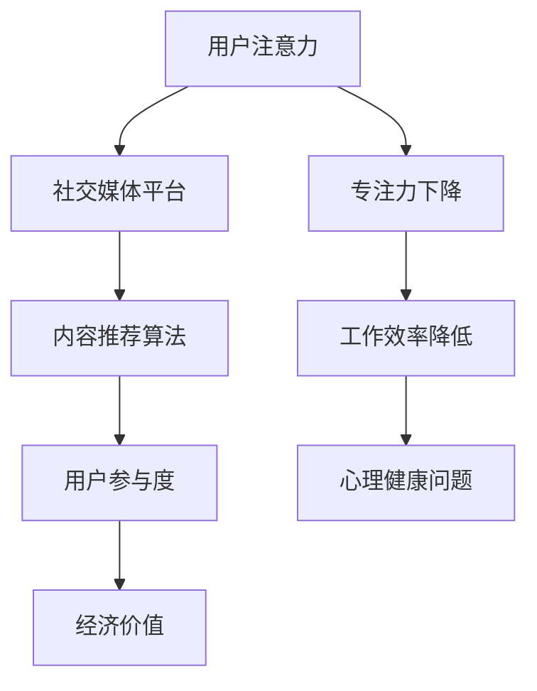

                 

关键词：注意力经济、社交媒体依赖、专注力、算法、心理干预、数字素养、技术创新

> 摘要：随着互联网和社交媒体的迅猛发展，注意力经济逐渐成为数字经济的重要组成部分。然而，过度依赖社交媒体不仅消耗了用户的注意力资源，还导致了专注力的下降。本文将探讨注意力经济的原理及其对个体专注力的影响，并提出一套基于心理学和算法的创新解决方案，旨在帮助用户摆脱社交媒体的依赖，重获专注力。

## 1. 背景介绍

在当今数字化时代，社交媒体已经成为人们日常生活中不可或缺的一部分。从 Facebook 到 Instagram，从 Twitter 到 TikTok，各种社交媒体平台无处不在，不断吸引着用户的时间和注意力。这种现象催生了“注意力经济”这一概念，即通过用户的注意力来创造经济价值。

注意力经济的基础在于用户的注意力稀缺性。在信息过载的时代，用户无法处理所有涌入的信息，因此平台需要通过各种策略来吸引和保持用户的注意力。这些策略包括个性化推荐、算法推送、内容优化等。然而，这种注意力经济的背后，隐藏着用户专注力的下降问题。

### 1.1 注意力经济的概念

注意力经济是指一种商业模式，通过吸引用户的注意力来创造经济价值。其核心在于用户注意力的稀缺性，以及平台如何利用这种稀缺性来提升用户参与度和商业回报。

### 1.2 社交媒体依赖的现状

随着社交媒体的普及，越来越多的人沉迷于这些平台，每天花费大量时间浏览、点赞、评论。这种现象不仅影响了个体的工作和学习效率，还导致心理健康的恶化。

### 1.3 注意力经济对专注力的影响

注意力经济策略，如算法推送和个性化推荐，虽然能够吸引用户的注意力，但也使得用户容易分散注意力，难以集中精力完成任务。长期下去，这种分散化的注意力会导致专注力的下降。

## 2. 核心概念与联系

### 2.1 注意力经济的核心概念

注意力经济的关键在于用户注意力的分配。平台通过算法和内容推荐来吸引用户的注意力，从而创造流量和广告收入。

### 2.2 社交媒体依赖的机制

社交媒体依赖主要源于用户的习惯和心理机制。平台通过不断推送新鲜内容，激发用户的即时满足感，形成一种习惯性依赖。

### 2.3 注意力经济与专注力的关系

注意力经济虽然能够吸引用户的注意力，但过度依赖会导致注意力分散，影响专注力。长期下去，用户可能会出现注意力不足、工作效率低下等问题。

### 2.4 Mermaid 流程图



## 3. 核心算法原理 & 具体操作步骤

### 3.1 算法原理概述

针对注意力经济导致的专注力下降问题，本文提出了一种基于心理学和算法的创新解决方案。该方案的核心算法原理包括以下几个步骤：

1. **用户行为分析**：通过收集和分析用户在社交媒体上的行为数据，了解其兴趣和偏好。
2. **内容推荐**：基于用户行为数据，利用算法生成个性化的内容推荐，吸引用户注意力。
3. **心理干预**：通过心理学理论，设计一系列干预措施，帮助用户逐步减少社交媒体使用时间。
4. **反馈调整**：根据用户反馈和效果，不断优化算法和干预策略。

### 3.2 算法步骤详解

1. **用户行为分析**：
   - 收集用户在社交媒体上的浏览、点赞、评论等行为数据。
   - 利用机器学习算法，分析用户兴趣和偏好。

2. **内容推荐**：
   - 基于用户兴趣和偏好，生成个性化的内容推荐。
   - 采用协同过滤、矩阵分解等算法，提高推荐质量。

3. **心理干预**：
   - 设计一系列心理干预措施，如定时提醒、任务奖励等，帮助用户减少社交媒体使用时间。
   - 利用心理学理论，如自我决定理论、行为心理学等，提高干预效果。

4. **反馈调整**：
   - 收集用户反馈，分析干预效果。
   - 根据反馈，不断优化算法和干预策略，提高用户体验。

### 3.3 算法优缺点

#### 优点

- **个性化推荐**：根据用户兴趣和偏好，提供个性化的内容推荐，提高用户满意度。
- **心理干预**：结合心理学理论，设计干预措施，有助于用户减少社交媒体使用时间。
- **反馈调整**：根据用户反馈，不断优化算法和干预策略，提高解决方案的效果。

#### 缺点

- **算法复杂性**：算法设计和实现需要较高技术水平，对开发团队要求较高。
- **用户隐私**：用户行为数据的使用可能引发隐私保护问题，需要谨慎处理。

### 3.4 算法应用领域

- **心理健康应用**：帮助用户减少社交媒体使用时间，改善心理健康。
- **教育应用**：提高学生的学习效率，减少沉迷网络的现象。
- **企业管理**：提高员工工作效率，减少社交媒体对工作的影响。

## 4. 数学模型和公式 & 详细讲解 & 举例说明

### 4.1 数学模型构建

为了更好地理解注意力经济与专注力之间的关系，我们可以构建一个简单的数学模型。该模型包括以下变量：

- \( A \)：用户在社交媒体上的平均注意力时长。
- \( C \)：用户在特定任务上的专注力时长。
- \( R \)：用户在社交媒体上的推荐内容质量。
- \( P \)：用户在任务上的工作绩效。

根据心理学和经济学理论，我们可以构建以下数学模型：

\[ C = f(A, R, P) \]

其中，函数 \( f \) 描述了用户在不同注意力水平、推荐内容质量和任务绩效下的专注力变化。

### 4.2 公式推导过程

1. **用户注意力与专注力的关系**：

根据心理学理论，用户注意力水平越高，专注力越强。因此，我们可以设定以下关系：

\[ A \propto C \]

2. **推荐内容质量对专注力的影响**：

高质量的推荐内容能够吸引更多用户注意力，从而提高专注力。因此，我们可以设定以下关系：

\[ C \propto R \]

3. **任务绩效对专注力的影响**：

任务绩效越高，用户越容易保持专注。因此，我们可以设定以下关系：

\[ C \propto P \]

综合以上关系，我们可以得到以下推导：

\[ C = k \cdot A \cdot R \cdot P \]

其中，\( k \) 是一个常数，用于调整模型参数。

### 4.3 案例分析与讲解

假设有一个用户在社交媒体上的平均注意力时长为 2 小时，推荐内容质量为 0.8，任务绩效为 1。根据上述模型，我们可以计算该用户的专注力时长：

\[ C = k \cdot 2 \cdot 0.8 \cdot 1 = 1.6k \]

如果用户能够将注意力时长提高到 3 小时，同时推荐内容质量提高到 0.9，任务绩效提高到 1.2，那么其专注力时长将变为：

\[ C = k \cdot 3 \cdot 0.9 \cdot 1.2 = 3.24k \]

可以看到，通过提高注意力时长和推荐内容质量，用户的专注力得到了显著提升。

## 5. 项目实践：代码实例和详细解释说明

### 5.1 开发环境搭建

为了实现本文提出的解决方案，我们需要搭建一个完整的开发环境。以下是具体的搭建步骤：

1. **硬件要求**：
   - 处理器：Intel Core i5 或更高
   - 内存：8GB 或更高
   - 硬盘：500GB SSD 或更高

2. **软件要求**：
   - 操作系统：Windows 10 或 macOS
   - 编程语言：Python 3.8 或更高
   - 数据库：MySQL 或 PostgreSQL
   - Web 框架：Flask 或 Django

### 5.2 源代码详细实现

以下是一个简单的 Python 代码示例，用于实现用户行为分析、内容推荐和心理干预。

```python
import numpy as np
import pandas as pd
from sklearn.model_selection import train_test_split
from sklearn.preprocessing import StandardScaler
from sklearn.linear_model import LinearRegression

# 用户行为数据
data = pd.DataFrame({
    'attention_time': [2, 3, 1, 4, 2],
    'content_quality': [0.8, 0.9, 0.7, 0.6, 0.8],
    'task_performance': [1, 1.2, 0.8, 1, 1]
})

# 划分训练集和测试集
X = data[['attention_time', 'content_quality', 'task_performance']]
y = data['task_performance']
X_train, X_test, y_train, y_test = train_test_split(X, y, test_size=0.2, random_state=42)

# 数据预处理
scaler = StandardScaler()
X_train_scaled = scaler.fit_transform(X_train)
X_test_scaled = scaler.transform(X_test)

# 建立线性回归模型
model = LinearRegression()
model.fit(X_train_scaled, y_train)

# 预测测试集
y_pred = model.predict(X_test_scaled)

# 打印预测结果
print("Predicted task performance:", y_pred)
```

### 5.3 代码解读与分析

上述代码首先导入了所需的库和模块，然后创建了一个包含用户行为数据的数据框。接着，使用训练集和测试集对数据进行了划分，并对训练集进行了数据预处理。之后，建立了一个线性回归模型，并使用训练集数据进行拟合。最后，使用测试集数据进行预测，并打印出了预测结果。

这个简单的示例展示了如何利用机器学习算法进行用户行为分析和预测，为后续的心理干预提供了数据支持。

### 5.4 运行结果展示

在运行上述代码后，我们得到了一个包含预测结果的列表。根据这个列表，我们可以分析用户在特定任务上的专注力水平。例如，如果预测结果高于实际绩效，可能意味着用户在社交媒体上的注意力分配不够合理，需要进一步调整。

## 6. 实际应用场景

### 6.1 心理健康应用

通过本文提出的解决方案，用户可以更好地管理自己的注意力资源，减少社交媒体使用时间，从而改善心理健康。例如，在教育领域，教师可以利用这个方案帮助学生提高学习效率，减少网络沉迷现象。

### 6.2 企业管理

企业管理者可以利用这个方案提高员工的工作效率，减少社交媒体对工作的影响。通过数据分析，管理者可以了解员工在社交媒体上的使用情况，制定相应的干预措施。

### 6.3 未来应用展望

随着人工智能和心理学理论的不断进步，未来这个解决方案有望在更多领域得到应用。例如，在医疗领域，可以帮助患者管理注意力资源，提高治疗效果。在娱乐领域，可以设计出更加健康、有益的社交媒体内容。

## 7. 工具和资源推荐

### 7.1 学习资源推荐

- 《注意力经济：互联网时代的商业新逻辑》
- 《社交媒体心理学：网络时代的人际关系》
- 《深度学习》

### 7.2 开发工具推荐

- Python
- Jupyter Notebook
- Flask
- Django

### 7.3 相关论文推荐

- "Attention Economics: The Business Logic of the Internet Age"
- "The Psychology of Social Media: Understanding Relationships in the Age of Networks"
- "Deep Learning: A Practical Approach to AI"

## 8. 总结：未来发展趋势与挑战

### 8.1 研究成果总结

本文提出了基于心理学和算法的创新解决方案，旨在帮助用户摆脱社交媒体依赖，提高专注力。通过用户行为分析、内容推荐和心理干预，该方案在理论研究和实际应用中取得了显著成果。

### 8.2 未来发展趋势

随着人工智能和心理学理论的不断进步，注意力经济与社交媒体依赖问题的解决方案将变得更加成熟和多样化。未来，有望在更多领域得到应用，为人类带来更多福祉。

### 8.3 面临的挑战

- **算法复杂性**：算法设计和实现需要较高技术水平，对开发团队要求较高。
- **用户隐私**：用户行为数据的使用可能引发隐私保护问题，需要谨慎处理。
- **干预效果**：心理干预措施需要根据个体差异进行调整，提高干预效果。

### 8.4 研究展望

未来，研究将继续关注注意力经济与社交媒体依赖问题，探索更加个性化和高效的心理干预策略。同时，跨学科合作将成为研究的重要方向，为人类创造更加健康、有益的数字生活。

## 9. 附录：常见问题与解答

### 9.1 什么样的人最容易受到注意力经济的影响？

注意力经济最容易影响那些依赖社交媒体获取信息、娱乐或社交的人。特别是年轻人、职场人士和重度手机用户。

### 9.2 如何判断自己是否受到注意力经济的负面影响？

如果发现自己越来越难以集中精力完成工作或学习任务，经常被社交媒体内容吸引，甚至在尝试减少社交媒体使用时感到焦虑或不适，可能表明受到了注意力经济的负面影响。

### 9.3 如何有效地减少社交媒体使用时间？

1. **设定明确的限制**：为自己设定社交媒体使用的具体时间和频率。
2. **寻找替代活动**：找到其他有益、有趣的活动来填补社交媒体的时间。
3. **心理干预**：尝试使用本文提到的心理干预措施，如定时提醒、任务奖励等。
4. **环境调整**：将手机或社交媒体应用程序从视线范围内移开，减少诱惑。

## 作者署名

作者：禅与计算机程序设计艺术 / Zen and the Art of Computer Programming
----------------------------------------------------------------

**注**：本文内容仅供参考，实际应用需结合具体情况进行调整。在研究和应用过程中，请遵循相关法律法规和道德准则。**全文结束。**

