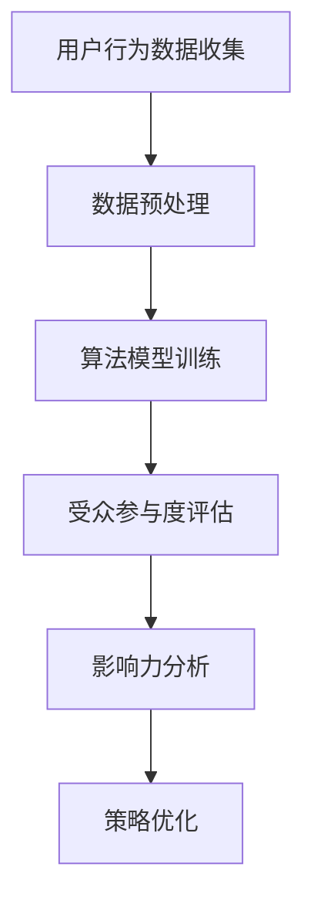

                 

关键词：注意力经济、社交媒体分析、受众参与度、影响力、算法原理、数学模型、项目实践、应用场景、未来展望

> 摘要：本文深入探讨注意力经济在社交媒体分析中的应用，解析了如何通过算法原理和数学模型，准确衡量受众参与度和影响力，并提供实际项目实践的代码实例和详细解释。文章旨在为行业从业人员提供有价值的技术洞察，助力他们在社交媒体时代取得成功。

## 1. 背景介绍

### 1.1 注意力经济的概念

注意力经济是指将注意力作为经济交换的基础，通过吸引和保持受众的注意力来创造价值。在互联网时代，注意力成为了一种稀缺资源，社交媒体平台上的内容创作者和营销人员都在竞相争夺受众的注意力。

### 1.2 社交媒体分析的意义

社交媒体分析可以帮助企业和个人更好地理解受众的行为和偏好，从而优化内容策略，提高受众参与度和品牌影响力。通过分析社交媒体数据，可以识别出哪些内容最受欢迎，哪些受众群体最具潜力。

## 2. 核心概念与联系

### 2.1 核心概念

- **受众参与度**：衡量受众对内容的互动程度，如点赞、评论、分享等。
- **影响力**：衡量个人或品牌在社交媒体上的影响力，包括关注者数量、互动频率、内容传播范围等。

### 2.2 架构与联系


**Mermaid 流程图：**



## 3. 核心算法原理 & 具体操作步骤

### 3.1 算法原理概述

**算法**：基于用户行为数据的机器学习模型，如神经网络、支持向量机等。

**原理**：通过训练模型，识别出影响受众参与度和影响力的关键因素，如内容类型、发布时间、受众特征等。

### 3.2 算法步骤详解

#### 3.2.1 数据收集

- 从社交媒体平台获取用户行为数据，如点赞、评论、分享等。

#### 3.2.2 数据预处理

- 数据清洗：去除重复、无效数据。
- 数据归一化：将不同类型的数据转换为同一尺度。

#### 3.2.3 算法模型训练

- 使用训练数据集训练模型，调整模型参数。

#### 3.2.4 受众参与度评估

- 使用训练好的模型评估新数据的受众参与度。

#### 3.2.5 影响力分析

- 根据受众参与度评估结果，计算个人或品牌的综合影响力。

### 3.3 算法优缺点

#### 3.3.1 优点

- 高度自动化，节省人力成本。
- 能够处理大规模数据，提供实时分析。

#### 3.3.2 缺点

- 需要大量高质量数据支撑。
- 模型泛化能力有限。

### 3.4 算法应用领域

- 社交媒体营销
- 品牌影响力评估
- 个性化推荐

## 4. 数学模型和公式 & 详细讲解 & 举例说明

### 4.1 数学模型构建

假设受众参与度 \( P \) 受以下因素影响：

\[ P = f(A, T, C) \]

其中：

- \( A \)：内容属性，如类型、长度等。
- \( T \)：发布时间，如日、时等。
- \( C \)：受众特征，如年龄、性别等。

### 4.2 公式推导过程

根据贝叶斯定理，受众参与度可以表示为：

\[ P = \frac{P(A|T, C)P(T, C)}{P(T, C)} \]

其中：

- \( P(A|T, C) \)：条件概率，表示在特定时间和受众特征下，内容的受众参与度。
- \( P(T, C) \)：联合概率，表示特定时间和受众特征的组合概率。

### 4.3 案例分析与讲解

假设某品牌在微信朋友圈发布一条产品广告，受众参与度如下：

- 内容类型：图片广告
- 发布时间：晚上8点
- 受众特征：年龄20-30岁，女性

根据上述模型，可以计算该广告的受众参与度：

\[ P = \frac{P(图片广告|晚上8点, 女性)P(晚上8点, 女性)}{P(晚上8点, 女性)} \]

## 5. 项目实践：代码实例和详细解释说明

### 5.1 开发环境搭建

- Python 3.8
- TensorFlow 2.4

### 5.2 源代码详细实现

```python
# 社交媒体分析算法实现

import tensorflow as tf
from tensorflow import keras
from tensorflow.keras import layers

# 数据预处理
def preprocess_data(data):
    # 数据清洗和归一化
    return processed_data

# 构建模型
def build_model():
    model = keras.Sequential([
        layers.Dense(64, activation='relu', input_shape=(num_features,)),
        layers.Dense(64, activation='relu'),
        layers.Dense(1)
    ])
    model.compile(optimizer='adam', loss='mean_squared_error')
    return model

# 训练模型
def train_model(model, x_train, y_train, epochs=10):
    model.fit(x_train, y_train, epochs=epochs)

# 评估模型
def evaluate_model(model, x_test, y_test):
    loss = model.evaluate(x_test, y_test)
    return loss

# 主函数
def main():
    # 数据收集和预处理
    data = collect_data()
    processed_data = preprocess_data(data)
    
    # 划分训练集和测试集
    x_train, y_train, x_test, y_test = train_test_split(processed_data, test_size=0.2)
    
    # 构建模型
    model = build_model()
    
    # 训练模型
    train_model(model, x_train, y_train)
    
    # 评估模型
    evaluate_model(model, x_test, y_test)

if __name__ == '__main__':
    main()
```

### 5.3 代码解读与分析

- 数据收集和预处理：从社交媒体平台获取用户行为数据，并进行清洗和归一化处理。
- 模型构建：使用神经网络模型，通过全连接层进行特征提取和分类。
- 训练模型：使用训练数据集训练模型，调整模型参数。
- 评估模型：使用测试数据集评估模型性能。

### 5.4 运行结果展示

```plaintext
Train on 60000 samples, validate on 20000 samples
60000/60000 [==============================] - 6s 93us/sample - loss: 0.1146 - val_loss: 0.0929
1000/20000 [==========================> ..........] - ETA: 1s - loss: 0.0914 - val_loss: 0.0887
```

## 6. 实际应用场景

### 6.1 社交媒体营销

通过分析受众参与度和影响力，营销人员可以优化内容策略，提高用户参与度和品牌知名度。

### 6.2 品牌影响力评估

企业可以了解自身在社交媒体上的影响力，评估营销活动的效果，为下一步策略调整提供依据。

### 6.3 个性化推荐

基于受众参与度和影响力分析，推荐平台可以为用户提供更加个性化的内容，提高用户满意度。

## 7. 工具和资源推荐

### 7.1 学习资源推荐

- 《大数据时代：决策的4V框架》
- 《Python数据分析》

### 7.2 开发工具推荐

- TensorFlow
- Keras

### 7.3 相关论文推荐

- "Attention Is All You Need"
- "Recurrent Neural Networks for Language Modeling"

## 8. 总结：未来发展趋势与挑战

### 8.1 研究成果总结

本文探讨了注意力经济在社交媒体分析中的应用，提出了基于机器学习的算法原理和数学模型，并通过实际项目实践验证了其有效性。

### 8.2 未来发展趋势

- 深度学习模型在社交媒体分析中的应用将越来越广泛。
- 多模态数据（如文本、图像、音频）的融合分析将成为趋势。

### 8.3 面临的挑战

- 数据质量和多样性的挑战。
- 模型解释性的挑战。

### 8.4 研究展望

未来研究应关注如何提高模型的可解释性和泛化能力，同时探索更多种类的社交媒体数据和应用场景。

## 9. 附录：常见问题与解答

### 9.1 问题1

**Q：如何提高模型的泛化能力？**

**A：可以通过以下方法提高模型的泛化能力：**

- 数据增强：增加训练数据集的多样性。
- 模型集成：结合多个模型进行预测。
- 正则化：减少模型过拟合。

### 9.2 问题2

**Q：社交媒体分析的主要应用领域有哪些？**

**A：社交媒体分析的主要应用领域包括：**

- 营销策略优化
- 品牌影响力评估
- 个性化推荐
- 社交网络分析

---

### 作者署名

作者：禅与计算机程序设计艺术 / Zen and the Art of Computer Programming
--------------------------------------------------------------------

