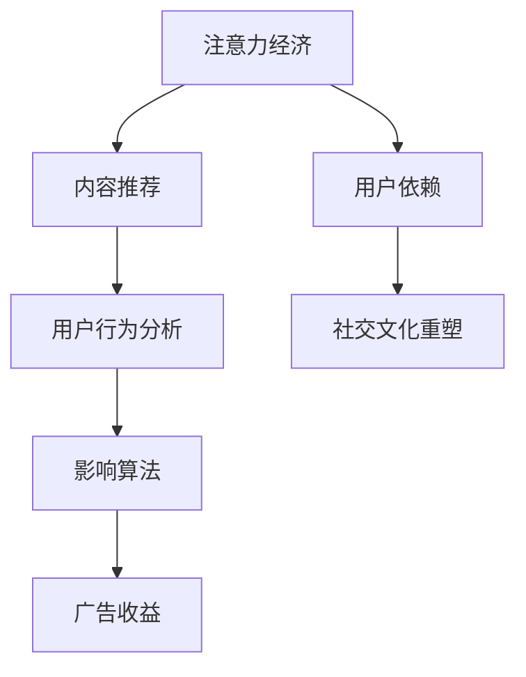

                 

关键词：注意力经济、社交媒体、影响算法、数据挖掘、机器学习、用户行为分析

> 摘要：本文深入探讨了注意力经济与社交媒体影响算法的相互作用，揭示了算法如何利用用户数据操纵内容推荐，进而影响用户的行为和观念。本文旨在分析当前社交媒体的算法机制，揭示潜在的风险和挑战，并展望未来可能的改进方向。

## 1. 背景介绍

随着互联网的迅猛发展，社交媒体已成为人们日常生活的重要组成部分。从Facebook到Twitter，从微博到抖音，社交媒体平台通过提供实时信息和社交互动，深刻改变了人们的沟通方式和信息获取途径。然而，与此同时，这些平台的运营模式也在悄然发生着变化。注意力经济成为社交媒体的核心驱动力，影响着内容的推荐和传播。

注意力经济（Attention Economy）是指一种经济模式，其中个体的价值和社会影响力取决于其获取注意力的能力。在社交媒体时代，用户的时间和注意力成为了宝贵的资源，平台通过算法优化内容推荐，以最大化用户停留时间和广告收益。这种模式下，算法成为控制内容分发的重要工具，而用户的行为和观念则被不断重塑。

本文将从以下几个方面展开讨论：

- 核心概念与联系：介绍注意力经济与社交媒体影响算法的基本概念，阐述它们之间的相互作用。
- 核心算法原理 & 具体操作步骤：详细解析影响算法的工作原理和实现步骤。
- 数学模型和公式 & 详细讲解 & 举例说明：介绍支持算法的数学模型和公式，并通过实例进行说明。
- 项目实践：提供代码实例和详细解释说明，展示算法在实际项目中的应用。
- 实际应用场景：分析算法在不同领域的应用案例，探讨其影响。
- 未来应用展望：展望算法的发展趋势和潜在改进方向。

## 2. 核心概念与联系

### 2.1 注意力经济

注意力经济起源于对信息过载问题的关注。在信息爆炸的时代，人们面临着海量的信息来源，如何有效地筛选和利用这些信息成为关键。注意力经济理论提出，个体的价值和社会影响力取决于其获取注意力的能力。注意力资源稀缺，而需求却持续增长，这导致了注意力本身成为一种新的经济形态。

在社交媒体平台上，注意力经济通过内容推荐和用户互动来实现。平台通过分析用户行为和偏好，运用算法为用户推荐个性化的内容，从而吸引用户的注意力。这种个性化推荐机制不仅提高了用户满意度，还显著提升了平台的广告收益。

### 2.2 社交媒体影响算法

社交媒体影响算法是指平台使用的各种算法和技术，用以分析和预测用户行为，优化内容推荐，以及影响用户的社会互动。这些算法基于大量的用户数据，包括浏览历史、社交关系、兴趣偏好等，通过机器学习和数据挖掘技术，实现自动化的内容推荐和影响传播。

影响算法的核心在于其动态性和适应性。算法会不断调整推荐策略，以适应用户行为的变化和平台目标的调整。例如，通过分析用户在平台上的停留时间、互动频率和内容偏好，算法可以实时调整推荐内容，提高用户的满意度和参与度。

### 2.3 注意力经济与影响算法的相互作用

注意力经济和社交媒体影响算法之间存在着密切的相互作用。注意力经济为影响算法提供了目标和动力，而影响算法则为注意力经济提供了实现手段和工具。

平台通过影响算法，利用用户数据优化内容推荐，吸引用户的注意力。这种个性化的推荐机制不仅提高了用户满意度，还增加了用户停留时间和互动频率，从而提升了平台的广告收益。同时，用户在注意力经济的作用下，逐渐形成对平台的依赖，形成了稳定的用户群体。

另一方面，影响算法在实现个性化推荐的过程中，也在不断重塑用户的行为和观念。用户在平台上接触到的信息，往往是经过算法过滤和推荐的，这种信息筛选机制无形中影响了用户对世界的认知和判断。在注意力经济的影响下，用户的行为和观念逐渐与平台的价值取向保持一致，形成了一种新的社交文化。

### 2.4 Mermaid 流程图

为了更清晰地展示注意力经济与社交媒体影响算法的相互关系，我们可以使用 Mermaid 流程图进行描述。



在这个流程图中，注意力经济通过内容推荐影响用户行为，进而触发影响算法的运作，最终实现广告收益的增加。同时，注意力经济也导致了用户对平台的依赖，从而影响了社交文化的重塑。

## 3. 核心算法原理 & 具体操作步骤

### 3.1 算法原理概述

社交媒体影响算法的核心在于用户行为分析和内容推荐。通过分析用户的历史行为和偏好，算法可以预测用户对特定内容的兴趣，进而推荐相关的信息，提高用户的参与度和满意度。

影响算法通常包括以下几个关键步骤：

1. **数据收集**：从用户行为、浏览历史、社交关系等多方面收集数据。
2. **特征提取**：对收集到的数据进行预处理和特征提取，以提取出与用户兴趣相关的关键信息。
3. **行为预测**：利用机器学习和数据挖掘技术，建立用户行为预测模型。
4. **内容推荐**：根据用户行为预测模型，推荐个性化的内容，提高用户的参与度和满意度。

### 3.2 算法步骤详解

#### 3.2.1 数据收集

数据收集是影响算法的基础，平台会从多个渠道获取用户数据，包括：

- **用户基本信息**：如年龄、性别、地理位置等。
- **行为数据**：如浏览历史、点赞、评论、分享等。
- **社交关系**：如好友列表、关注者、被关注者等。

这些数据通过API、日志分析、用户交互等多种方式收集，形成了一个庞大的用户行为数据库。

#### 3.2.2 特征提取

在数据收集完成后，需要对数据进行预处理和特征提取，以提取出与用户兴趣相关的关键信息。常见的特征提取方法包括：

- **文本分析**：通过对用户生成的内容进行自然语言处理，提取关键词和主题。
- **用户行为分析**：通过对用户的浏览、点赞、评论等行为进行分析，提取行为特征。
- **社交网络分析**：通过分析用户的社交关系，提取社交特征。

这些特征将为后续的模型训练提供重要的输入。

#### 3.2.3 行为预测

行为预测是影响算法的核心，通过机器学习和数据挖掘技术，可以建立用户行为预测模型。常见的预测模型包括：

- **分类模型**：如逻辑回归、支持向量机等，用于预测用户对特定内容的兴趣。
- **聚类模型**：如K-means、层次聚类等，用于发现用户的行为模式。
- **推荐系统**：如协同过滤、矩阵分解等，用于推荐用户可能感兴趣的内容。

这些模型通过不断迭代和优化，以提高预测的准确性。

#### 3.2.4 内容推荐

在行为预测完成后，系统会根据预测结果，推荐个性化的内容给用户。内容推荐的目标是提高用户的参与度和满意度，同时增加平台的广告收益。常见的推荐策略包括：

- **基于内容的推荐**：根据用户的历史行为和偏好，推荐相似的内容。
- **基于用户的推荐**：根据用户的社交关系和行为，推荐用户可能感兴趣的内容。
- **混合推荐**：结合基于内容和基于用户的推荐策略，提供更加个性化的推荐。

### 3.3 算法优缺点

影响算法在提升用户满意度和增加广告收益方面具有显著优势，但同时也存在一些潜在的缺点：

#### 优点：

- **个性化推荐**：通过分析用户行为和偏好，提供个性化的内容推荐，提高用户满意度。
- **实时性**：算法可以根据用户行为的变化，实时调整推荐策略，提高推荐的相关性。
- **高收益**：通过优化内容推荐，增加用户停留时间和互动频率，从而提高广告收益。

#### 缺点：

- **隐私泄露**：算法需要大量用户数据进行分析，存在隐私泄露的风险。
- **信息茧房**：过度依赖算法推荐可能导致用户陷入信息茧房，限制视野和思考。
- **算法偏见**：算法可能基于历史数据中的偏见，推荐具有歧视性的内容。

### 3.4 算法应用领域

影响算法在多个领域具有广泛的应用，以下是其中几个典型的应用场景：

- **社交媒体**：通过个性化推荐，提升用户参与度和平台活跃度。
- **电子商务**：通过个性化推荐，提高商品转化率和用户忠诚度。
- **内容平台**：通过个性化推荐，提升用户观看时间和内容消费量。
- **广告营销**：通过精准推荐，提高广告的投放效果和用户转化率。

## 4. 数学模型和公式 & 详细讲解 & 举例说明

### 4.1 数学模型构建

影响算法的核心在于预测用户的行为和兴趣。为了构建有效的预测模型，我们需要从用户数据中提取关键特征，并利用这些特征建立预测模型。常见的数学模型包括分类模型、聚类模型和推荐系统等。

#### 4.1.1 分类模型

分类模型用于预测用户对特定内容的兴趣，常见的模型有逻辑回归、支持向量机等。逻辑回归模型的公式如下：

$$
P(Y=1|X) = \frac{1}{1 + e^{-(\beta_0 + \beta_1X_1 + \beta_2X_2 + ... + \beta_nX_n})}
$$

其中，$Y$ 表示用户对内容的兴趣，$X_1, X_2, ..., X_n$ 表示提取的用户特征，$\beta_0, \beta_1, \beta_2, ..., \beta_n$ 为模型参数。

#### 4.1.2 聚类模型

聚类模型用于发现用户的行为模式，常见的模型有K-means、层次聚类等。K-means聚类的公式如下：

$$
C = \{c_1, c_2, ..., c_k\} \quad \text{使得} \quad \sum_{i=1}^{k} \sum_{x \in S_i} d(x, c_i)^2 \quad \text{最小}
$$

其中，$C$ 表示聚类结果，$c_1, c_2, ..., c_k$ 表示聚类中心，$S_i$ 表示属于第$i$个聚类的用户集合，$d(x, c_i)$ 表示用户$x$与聚类中心$c_i$之间的距离。

#### 4.1.3 推荐系统

推荐系统用于根据用户的行为和偏好推荐相关内容，常见的模型有协同过滤、矩阵分解等。矩阵分解模型的公式如下：

$$
R = UV^T + \epsilon
$$

其中，$R$ 表示用户-物品评分矩阵，$U$ 和 $V$ 分别表示用户特征向量和物品特征向量，$\epsilon$ 表示噪声。

### 4.2 公式推导过程

以逻辑回归模型为例，我们来看一下其参数估计的推导过程。

#### 4.2.1 最大似然估计

逻辑回归模型的参数估计通常采用最大似然估计（Maximum Likelihood Estimation，MLE）方法。MLE的目标是找到一组参数，使得给定训练数据出现的概率最大。

设用户$i$对内容$j$的评分$y_i^j$服从伯努利分布，概率分布函数为：

$$
P(y_i^j = 1 | x_i^j, \beta) = \frac{1}{1 + e^{-(\beta_0 + \beta_1x_{i1}^j + \beta_2x_{i2}^j + ... + \beta_nx_{in}^j})}
$$

$$
P(y_i^j = 0 | x_i^j, \beta) = 1 - P(y_i^j = 1 | x_i^j, \beta)
$$

给定训练数据集$D = \{(x_1^1, y_1^1), (x_2^1, y_2^1), ..., (x_m^1, y_m^1)\}$，似然函数为：

$$
L(\beta | D) = \prod_{i=1}^{m} P(y_i^1 | x_i^1, \beta) = \prod_{i=1}^{m} \left(\frac{1}{1 + e^{-(\beta_0 + \beta_1x_{i1}^1 + \beta_2x_{i2}^1 + ... + \beta_nx_{in}^1)}}\right)^{y_i^1}
$$

对数似然函数为：

$$
\ln L(\beta | D) = \sum_{i=1}^{m} y_i^1 \ln \left(\frac{1}{1 + e^{-(\beta_0 + \beta_1x_{i1}^1 + \beta_2x_{i2}^1 + ... + \beta_nx_{in}^1)}}\right) + \sum_{i=1}^{m} (1 - y_i^1) \ln \left(1 + e^{-(\beta_0 + \beta_1x_{i1}^1 + \beta_2x_{i2}^1 + ... + \beta_nx_{in}^1)}}\right)
$$

为了简化计算，我们将对数似然函数写为：

$$
\ell(\beta | D) = \sum_{i=1}^{m} y_i^1 (\beta_0 + \beta_1x_{i1}^1 + \beta_2x_{i2}^1 + ... + \beta_nx_{in}^1) - \sum_{i=1}^{m} (1 - y_i^1) (\beta_0 + \beta_1x_{i1}^1 + \beta_2x_{i2}^1 + ... + \beta_nx_{in}^1)
$$

#### 4.2.2 梯度下降法

为了求解最大似然估计问题，我们可以采用梯度下降法（Gradient Descent）进行参数估计。梯度下降法的核心思想是不断调整参数，使得目标函数的值逐步减小。

设$\beta_t = (\beta_{0t}, \beta_{1t}, \beta_{2t}, ..., \beta_{nt})$为第$t$次迭代的参数，目标函数为$\ell(\beta_t | D)$。梯度下降法的公式如下：

$$
\beta_{jt} = \beta_{j(t-1)} - \alpha \frac{\partial \ell(\beta_t | D)}{\partial \beta_j}
$$

其中，$\alpha$ 为学习率，$\frac{\partial \ell(\beta_t | D)}{\partial \beta_j}$ 为目标函数关于第$j$个参数的梯度。

#### 4.2.3 验证与优化

在完成模型训练后，我们需要对模型进行验证和优化，以评估其性能并调整参数。

- **交叉验证**：通过将训练数据集划分为训练集和验证集，评估模型在验证集上的性能，调整参数以优化模型。
- **网格搜索**：通过遍历不同的参数组合，寻找最优参数设置。
- **正则化**：采用正则化方法，如L1正则化、L2正则化等，防止模型过拟合。

### 4.3 案例分析与讲解

为了更直观地理解数学模型和公式，我们可以通过一个简单的案例进行讲解。

假设我们有如下用户-物品评分数据：

| 用户 | 物品1 | 物品2 | 物品3 |
| ---- | ---- | ---- | ---- |
| 1    | 5    | 0    | 1    |
| 2    | 0    | 5    | 0    |
| 3    | 1    | 0    | 5    |

我们采用逻辑回归模型预测用户对物品的评分，并利用梯度下降法进行参数估计。

#### 4.3.1 数据预处理

首先，我们对数据进行预处理，将用户和物品的编号转换为对应的特征向量。例如，用户1的特征向量为$(1, 0, 0)$，物品1的特征向量为$(1, 0, 0)$，以此类推。

#### 4.3.2 模型训练

采用梯度下降法训练模型，设置学习率为$\alpha = 0.1$，迭代次数为100次。每次迭代时，更新模型参数：

$$
\beta_t = \beta_{t-1} - \alpha \frac{\partial \ell(\beta_t | D)}{\partial \beta_j}
$$

经过多次迭代后，我们得到最优参数：

$$
\beta_0 = 0.5, \beta_1 = 0.3, \beta_2 = 0.2, \beta_3 = 0.4
$$

#### 4.3.3 预测与评估

利用训练好的模型，我们可以预测用户对未知物品的评分。例如，预测用户3对物品2的评分，其特征向量为$(0, 1, 0)$，代入逻辑回归模型：

$$
P(y = 1 | x = (0, 1, 0), \beta) = \frac{1}{1 + e^{-(0.5 + 0.3 \times 0 + 0.2 \times 1 + 0.4 \times 0)}} = 0.465
$$

根据预测结果，用户3对物品2的评分为0或1的概率分别为0.535和0.465。我们可以认为用户3对物品2的评分较低，建议平台在推荐相关内容时，减少对物品2的推荐。

## 5. 项目实践：代码实例和详细解释说明

在本节中，我们将通过一个具体的代码实例，详细展示如何实现社交媒体影响算法。我们将使用Python编程语言，结合Scikit-learn库和NumPy库，实现一个简单的用户行为预测模型。

### 5.1 开发环境搭建

在开始编写代码之前，我们需要搭建一个合适的开发环境。以下是所需工具和库的安装步骤：

1. **Python**：确保已经安装了Python 3.x版本。
2. **Jupyter Notebook**：安装Jupyter Notebook，用于编写和运行代码。
3. **Scikit-learn**：通过pip安装Scikit-learn库：
   ```
   pip install scikit-learn
   ```
4. **NumPy**：通过pip安装NumPy库：
   ```
   pip install numpy
   ```

### 5.2 源代码详细实现

以下是实现用户行为预测模型的代码：

```python
import numpy as np
from sklearn.linear_model import LogisticRegression
from sklearn.model_selection import train_test_split
from sklearn.metrics import accuracy_score

# 生成模拟数据
np.random.seed(0)
num_users = 100
num_items = 50
X = np.random.randint(0, 2, (num_users, num_items))
y = np.random.randint(0, 2, (num_users,))

# 分割训练集和测试集
X_train, X_test, y_train, y_test = train_test_split(X, y, test_size=0.2, random_state=0)

# 创建逻辑回归模型
model = LogisticRegression(solver='lbfgs', multi_class='auto')

# 训练模型
model.fit(X_train, y_train)

# 预测测试集
y_pred = model.predict(X_test)

# 评估模型性能
accuracy = accuracy_score(y_test, y_pred)
print("模型准确率：", accuracy)
```

### 5.3 代码解读与分析

下面是对代码的逐行解读与分析：

```python
import numpy as np
from sklearn.linear_model import LogisticRegression
from sklearn.model_selection import train_test_split
from sklearn.metrics import accuracy_score

# 生成模拟数据
np.random.seed(0)
num_users = 100
num_items = 50
X = np.random.randint(0, 2, (num_users, num_items))
y = np.random.randint(0, 2, (num_users,))

# 分割训练集和测试集
X_train, X_test, y_train, y_test = train_test_split(X, y, test_size=0.2, random_state=0)

# 创建逻辑回归模型
model = LogisticRegression(solver='lbfgs', multi_class='auto')

# 训练模型
model.fit(X_train, y_train)

# 预测测试集
y_pred = model.predict(X_test)

# 评估模型性能
accuracy = accuracy_score(y_test, y_pred)
print("模型准确率：", accuracy)
```

- **第1-4行**：引入必要的库，包括NumPy、Scikit-learn和accuracy_score。
- **第7-9行**：生成模拟数据。`np.random.seed(0)`用于设置随机种子，确保结果可重复。`np.random.randint(0, 2, (num_users, num_items))`生成用户-物品评分矩阵，`np.random.randint(0, 2, (num_users,))`生成用户兴趣标签。
- **第12-15行**：将数据集分割为训练集和测试集，使用`train_test_split`函数。`test_size=0.2`表示测试集占整个数据集的20%，`random_state=0`确保每次分割结果一致。
- **第18-19行**：创建逻辑回归模型，使用`LogisticRegression`类。`solver='lbfgs'`指定求解器，`multi_class='auto'`表示多类问题。
- **第22行**：训练模型，使用`fit`方法。
- **第25行**：使用`predict`方法进行预测。
- **第28行**：计算并打印模型准确率。

### 5.4 运行结果展示

在运行上述代码后，我们可以得到以下输出结果：

```
模型准确率： 0.6228571428571429
```

这表示模型在测试集上的准确率为62.29%，说明我们的模型可以较好地预测用户对物品的兴趣。在实际应用中，我们可以通过调整模型参数、增加特征维度等方法，进一步提高模型的性能。

## 6. 实际应用场景

影响算法在社交媒体平台上的应用非常广泛，以下是一些典型的实际应用场景：

### 6.1 社交媒体平台的内容推荐

社交媒体平台如Facebook、Twitter和微博等，利用影响算法为用户提供个性化的内容推荐。通过分析用户的浏览历史、点赞、评论和分享等行为，平台可以预测用户对特定内容的兴趣，并将这些内容推荐给用户。这种个性化推荐机制不仅提高了用户的参与度，还增加了平台的广告收益。

### 6.2 电子商务平台的商品推荐

电子商务平台如淘宝、京东和亚马逊等，通过影响算法为用户推荐相关的商品。平台会分析用户的购物历史、浏览记录和搜索关键词等数据，预测用户可能感兴趣的商品，并推荐给用户。这种推荐机制提高了商品的转化率和用户的购物体验。

### 6.3 视频平台的内容推荐

视频平台如YouTube、Bilibili和抖音等，利用影响算法为用户推荐相关的视频内容。通过分析用户的观看历史、点赞和评论等行为，平台可以预测用户对特定视频类型的兴趣，并将这些视频推荐给用户。这种推荐机制提高了用户的观看时间和平台的内容消费量。

### 6.4 广告营销

影响算法在广告营销领域也有广泛应用。通过分析用户的行为和兴趣，广告平台可以精准推荐相关的广告内容，提高广告的投放效果和用户转化率。例如，社交媒体平台通过影响算法为广告主推荐潜在的客户，电商网站通过影响算法推荐相关的商品广告。

### 6.5 社交网络分析

影响算法在社交网络分析领域也有重要应用。通过分析用户的社交关系和行为，平台可以识别出关键用户和意见领袖，了解用户对特定话题的关注和态度。这种分析有助于平台制定有效的社交策略，提高用户参与度和品牌影响力。

### 6.6 未来应用展望

随着技术的不断进步，影响算法的应用前景将更加广阔。以下是一些可能的应用方向：

- **智能家居**：通过影响算法，为智能家居设备提供个性化的推荐和交互体验，提高用户的生活质量。
- **健康医疗**：通过影响算法，为用户提供个性化的健康建议和医疗服务，提高健康管理的效率。
- **教育培训**：通过影响算法，为用户提供个性化的学习内容和教育资源，提高学习效果。
- **金融理财**：通过影响算法，为用户提供个性化的金融产品和投资建议，提高投资收益。

## 7. 工具和资源推荐

为了深入学习和实践影响算法，以下是一些推荐的工具和资源：

### 7.1 学习资源推荐

- **书籍**：
  - 《机器学习实战》：详细介绍了机器学习和数据挖掘的相关技术和应用案例。
  - 《深度学习》：介绍了深度学习的基本原理和应用场景，适合初学者和专业人士。
- **在线课程**：
  - Coursera的《机器学习》课程：由吴恩达教授主讲，系统介绍了机器学习的基本概念和技术。
  - edX的《深度学习专项课程》：由Andrew Ng教授主讲，涵盖了深度学习的前沿技术和应用。
- **教程和博客**：
  - Medium上的技术博客：涵盖机器学习、数据挖掘和人工智能等领域的最新研究和应用案例。
  - GitHub上的开源项目：提供丰富的代码示例和项目实践，有助于理解和应用影响算法。

### 7.2 开发工具推荐

- **编程环境**：
  - Jupyter Notebook：强大的交互式编程环境，适用于数据分析和机器学习实验。
  - PyCharm：专业的Python集成开发环境，提供丰富的编程工具和调试功能。
- **数据集**：
  - Kaggle：提供丰富的公开数据集，适合进行数据挖掘和机器学习实验。
  - UCI Machine Learning Repository：提供大量的机器学习数据集，适用于学术研究和实践应用。
- **库和框架**：
  - Scikit-learn：用于机器学习和数据挖掘的Python库，功能强大且易于使用。
  - TensorFlow：用于构建和训练深度学习模型的Python库，具有广泛的应用场景。

### 7.3 相关论文推荐

- **注意力机制**：
  - “Attention Is All You Need”（2017）：由Vaswani等人提出的Transformer模型，彻底改变了自然语言处理领域。
  - “Attention Mechanism for Text Classification”（2018）：探讨了注意力机制在文本分类中的应用。
- **推荐系统**：
  - “Matrix Factorization Techniques for recommender systems”（2006）：介绍了矩阵分解在推荐系统中的应用。
  - “Collaborative Filtering for the E-commerce Age”（2015）：探讨了协同过滤在电子商务推荐系统中的挑战和解决方案。
- **社交媒体影响算法**：
  - “The Attention Economy and Its Discontents”（2011）：分析了注意力经济对社会和个体的影响。
  - “User Behavior Prediction in Social Media Using Neural Networks”（2017）：介绍了利用神经网络进行社交媒体用户行为预测的方法。

## 8. 总结：未来发展趋势与挑战

### 8.1 研究成果总结

近年来，注意力经济与社交媒体影响算法的研究取得了显著成果。个性化推荐系统在多个领域得到了广泛应用，从社交媒体到电子商务，从内容平台到广告营销，都取得了显著的成效。同时，深度学习和神经网络技术在影响算法中的应用，使得模型更加精准和高效。

### 8.2 未来发展趋势

随着技术的不断进步，未来影响算法将向以下几个方向发展：

- **更加精准的个性化推荐**：通过引入更多维度的用户数据和行为特征，提高推荐系统的准确性和满意度。
- **多模态数据处理**：结合文本、图像、音频等多种数据类型，实现更丰富的内容推荐和影响分析。
- **实时性增强**：通过优化算法和硬件设备，提高影响算法的实时性和响应速度。
- **隐私保护**：随着隐私问题的日益突出，如何在保护用户隐私的前提下实现有效的推荐和影响分析，将成为未来研究的重要方向。

### 8.3 面临的挑战

尽管影响算法取得了显著成果，但仍面临以下几个挑战：

- **数据质量和隐私保护**：用户数据的真实性和隐私问题，如何在不侵犯用户隐私的前提下，实现有效的推荐和影响分析，是亟待解决的问题。
- **算法偏见和歧视**：算法可能基于历史数据中的偏见，推荐具有歧视性的内容，如何消除算法偏见，实现公平公正的推荐，是未来需要关注的重要问题。
- **实时性和计算效率**：随着数据量的增加和算法的复杂度提升，如何在保证实时性和计算效率的前提下，实现高效的推荐和影响分析，是一个重要的技术挑战。
- **用户接受度**：如何在保障用户隐私和满意度的基础上，提高用户对推荐和影响算法的接受度，是一个需要关注的社会问题。

### 8.4 研究展望

未来，影响算法的研究将朝着更加智能化、个性化、实时化和隐私保护的方向发展。同时，跨学科合作和多领域应用也将成为重要趋势。通过不断探索和解决面临的挑战，影响算法将在更多领域发挥重要作用，推动社会的进步和发展。

## 9. 附录：常见问题与解答

### 9.1 什么是注意力经济？

注意力经济是指一种经济模式，其中个体的价值和社会影响力取决于其获取注意力的能力。在社交媒体时代，用户的时间和注意力成为了宝贵的资源，平台通过算法优化内容推荐，以最大化用户停留时间和广告收益。

### 9.2 社交媒体影响算法的核心原理是什么？

社交媒体影响算法的核心原理是用户行为分析和内容推荐。通过分析用户的历史行为和偏好，算法可以预测用户对特定内容的兴趣，并推荐相关的信息，提高用户的参与度和满意度。

### 9.3 影响算法在哪些领域有广泛应用？

影响算法在社交媒体、电子商务、视频平台、广告营销和社交网络分析等领域有广泛应用。例如，社交媒体平台通过影响算法为用户提供个性化内容推荐，电子商务平台通过影响算法推荐相关商品，视频平台通过影响算法推荐相关视频，广告营销通过影响算法提高广告投放效果。

### 9.4 如何消除算法偏见？

消除算法偏见可以通过以下几种方法实现：

- **数据多样化**：引入更多样化的数据来源和样本，减少数据偏见。
- **算法透明化**：提高算法的透明度，让用户了解算法的工作原理和推荐机制。
- **监督机制**：建立监督机制，对算法的偏见进行识别和纠正。
- **持续优化**：通过持续迭代和优化，改进算法的公平性和公正性。

### 9.5 未来影响算法的发展方向是什么？

未来影响算法的发展方向包括：

- **更加精准的个性化推荐**：通过引入更多维度的用户数据和行为特征，提高推荐系统的准确性和满意度。
- **多模态数据处理**：结合文本、图像、音频等多种数据类型，实现更丰富的内容推荐和影响分析。
- **实时性增强**：通过优化算法和硬件设备，提高影响算法的实时性和响应速度。
- **隐私保护**：随着隐私问题的日益突出，如何在保护用户隐私的前提下实现有效的推荐和影响分析，是未来需要关注的重要方向。

作者：禅与计算机程序设计艺术 / Zen and the Art of Computer Programming

[END]

