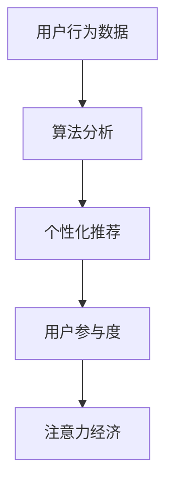

                 

关键词：注意力经济，社交媒体，算法，受众参与度，影响力分析，技术实践

> 摘要：本文深入探讨了注意力经济在社交媒体中的应用，分析了当前主流的算法原理，阐述了算法如何影响受众参与度，并讨论了未来的发展趋势与挑战。文章旨在为行业从业者提供有价值的指导，帮助其更好地理解和利用注意力经济，提升社交媒体的影响力。

## 1. 背景介绍

在数字化时代，社交媒体已经成为人们日常生活中不可或缺的一部分。用户通过社交媒体平台获取信息、交流观点、分享生活，而这些行为背后的核心动力便是注意力经济。注意力经济是指通过吸引用户的注意力来创造经济价值的一种经济模式。在社交媒体领域，注意力经济的实现主要依赖于算法。

算法是注意力经济的重要支撑。它通过分析用户行为和偏好，为用户提供个性化的内容推荐，从而提高用户在平台上的停留时间和互动频率。当前，主流的社交媒体平台如Facebook、Twitter、Instagram等，都采用了复杂的算法来吸引用户的注意力，提升用户参与度。

### 1.1 注意力经济的定义

注意力经济是指以用户注意力为资源，通过吸引、保持和转化注意力，实现商业价值的经济模式。在社交媒体时代，用户注意力成为一种稀缺资源，各大平台通过提供个性化、有趣、有价值的内容，吸引用户的注意力，从而实现广告收入、用户付费等多种盈利模式。

### 1.2 社交媒体的发展与算法的重要性

自20世纪90年代互联网兴起以来，社交媒体经历了快速的发展。从最初的博客、论坛，到现在的微博、微信、短视频平台，社交媒体已经深刻改变了人们的交流方式。随着用户数量的激增，如何有效吸引用户注意力，提高用户参与度，成为社交媒体平台竞争的焦点。

算法在这一过程中发挥了至关重要的作用。通过分析用户行为数据，算法能够为用户提供个性化的内容推荐，提高用户满意度，增加用户粘性。因此，算法成为社交媒体平台的核心竞争力。

## 2. 核心概念与联系

在深入探讨注意力经济与社交媒体算法之前，我们需要理解几个核心概念及其相互联系。

### 2.1 注意力经济

注意力经济是指通过吸引用户的注意力来创造经济价值的一种经济模式。在社交媒体领域，注意力经济的实现主要依赖于算法。

### 2.2 算法

算法是指用于解决特定问题的步骤或规则。在社交媒体中，算法用于分析用户行为数据，为用户提供个性化的内容推荐。

### 2.3 用户参与度

用户参与度是指用户在社交媒体平台上的互动程度。它包括用户点赞、评论、分享、转发等行为。用户参与度越高，意味着用户对平台的关注度越高。

### 2.4 注意力经济与社交媒体算法的联系

注意力经济与社交媒体算法之间存在密切的联系。算法通过分析用户行为数据，为用户提供个性化的内容推荐，从而提高用户参与度，实现注意力经济的转化。

### 2.5 Mermaid 流程图

以下是一个描述注意力经济与社交媒体算法关系的 Mermaid 流程图：



## 3. 核心算法原理 & 具体操作步骤

### 3.1 算法原理概述

在社交媒体中，常用的算法主要包括协同过滤算法、基于内容的推荐算法和混合推荐算法。这些算法的核心原理是通过分析用户行为和内容特征，为用户推荐可能感兴趣的内容。

#### 3.1.1 协同过滤算法

协同过滤算法通过分析用户之间的行为相似性，为用户推荐与邻居用户偏好相似的内容。它主要分为基于用户的协同过滤和基于项目的协同过滤。

- **基于用户的协同过滤**：通过计算用户之间的相似度，找到与目标用户相似的其他用户，然后推荐这些用户喜欢的物品。
- **基于项目的协同过滤**：通过计算物品之间的相似度，找到与目标物品相似的其他物品，然后推荐给用户。

#### 3.1.2 基于内容的推荐算法

基于内容的推荐算法通过分析物品的内容特征，为用户推荐与用户历史偏好相似的内容。它通常采用特征提取和相似度计算方法，如TF-IDF、余弦相似度等。

#### 3.1.3 混合推荐算法

混合推荐算法结合协同过滤和基于内容的推荐算法，以提高推荐效果。它通常采用加权平均或基于模型的方法，如矩阵分解、协同过滤 + 基于内容的推荐等。

### 3.2 算法步骤详解

以下是一个基于用户的协同过滤算法的具体操作步骤：

1. **用户行为数据收集**：收集用户在社交媒体上的行为数据，如点赞、评论、分享等。
2. **用户相似度计算**：计算用户之间的相似度，常用的方法有皮尔逊相关系数、余弦相似度等。
3. **物品相似度计算**：计算物品之间的相似度，常用的方法有TF-IDF、余弦相似度等。
4. **推荐列表生成**：根据用户相似度和物品相似度，生成推荐列表，将用户喜欢的物品推荐给相似用户。

### 3.3 算法优缺点

#### 3.3.1 协同过滤算法

- **优点**：能够为用户推荐个性化的内容，降低推荐系统的冷启动问题。
- **缺点**：容易受到数据噪声的影响，且可能推荐出用户不感兴趣的内容。

#### 3.3.2 基于内容的推荐算法

- **优点**：能够准确推荐用户感兴趣的内容，减少数据噪声的影响。
- **缺点**：难以处理新用户和新物品的推荐问题，且可能推荐出用户不感兴趣的内容。

#### 3.3.3 混合推荐算法

- **优点**：结合了协同过滤和基于内容的推荐算法的优点，提高推荐效果。
- **缺点**：计算复杂度较高，需要处理多种数据噪声。

### 3.4 算法应用领域

协同过滤算法、基于内容的推荐算法和混合推荐算法在社交媒体、电商、视频平台等场景都有广泛的应用。例如，在社交媒体中，平台通过算法为用户推荐感兴趣的朋友、话题和内容；在电商中，平台通过算法为用户推荐感兴趣的商品。

## 4. 数学模型和公式 & 详细讲解 & 举例说明

### 4.1 数学模型构建

在推荐系统中，常用的数学模型包括用户相似度计算、物品相似度计算和推荐评分预测等。以下分别介绍这些模型的构建方法。

#### 4.1.1 用户相似度计算

用户相似度计算用于衡量用户之间的相似程度。常用的方法有皮尔逊相关系数和余弦相似度。

- **皮尔逊相关系数**：

$$
sim(u_i, u_j) = \frac{\sum_{k=1}^{n} r_{ik}r_{jk}}{\sqrt{\sum_{k=1}^{n} r_{ik}^2}\sqrt{\sum_{k=1}^{n} r_{jk}^2}}
$$

其中，$r_{ik}$ 表示用户 $u_i$ 对物品 $k$ 的评分。

- **余弦相似度**：

$$
sim(u_i, u_j) = \frac{\sum_{k=1}^{n} r_{ik}r_{jk}}{\sqrt{\sum_{k=1}^{n} r_{ik}^2}\sqrt{\sum_{k=1}^{n} r_{jk}^2}}
$$

其中，$r_{ik}$ 表示用户 $u_i$ 对物品 $k$ 的评分。

#### 4.1.2 物品相似度计算

物品相似度计算用于衡量物品之间的相似程度。常用的方法有TF-IDF和余弦相似度。

- **TF-IDF**：

$$
tf_idf(k) = tf(k) \times idf(k)
$$

其中，$tf(k)$ 表示物品 $k$ 在文档中的词频，$idf(k)$ 表示物品 $k$ 在文档集合中的逆文档频率。

- **余弦相似度**：

$$
sim(k_i, k_j) = \frac{\sum_{k=1}^{n} tf_idf(k_i)tf_idf(k_j)}{\sqrt{\sum_{k=1}^{n} tf_idf(k_i)^2}\sqrt{\sum_{k=1}^{n} tf_idf(k_j)^2}}
$$

其中，$tf_idf(k_i)$ 和 $tf_idf(k_j)$ 分别表示物品 $k_i$ 和 $k_j$ 的TF-IDF值。

#### 4.1.3 推荐评分预测

推荐评分预测用于预测用户对物品的评分。常用的方法有矩阵分解和基于模型的评分预测。

- **矩阵分解**：

$$
R = U \times V^T
$$

其中，$R$ 表示用户-物品评分矩阵，$U$ 表示用户特征矩阵，$V$ 表示物品特征矩阵。

- **基于模型的评分预测**：

$$
r_{ij} = \sum_{k=1}^{m} w_{ik}v_{kj}
$$

其中，$r_{ij}$ 表示用户 $i$ 对物品 $j$ 的预测评分，$w_{ik}$ 表示用户 $i$ 对特征 $k$ 的权重，$v_{kj}$ 表示物品 $j$ 对特征 $k$ 的权重。

### 4.2 公式推导过程

#### 4.2.1 用户相似度计算

以皮尔逊相关系数为例，推导用户相似度计算公式。

- **第一步**：计算用户 $u_i$ 和 $u_j$ 的评分均值。

$$
\bar{r}_i = \frac{\sum_{k=1}^{n} r_{ik}}{n}, \quad \bar{r}_j = \frac{\sum_{k=1}^{n} r_{jk}}{n}
$$

- **第二步**：计算用户 $u_i$ 和 $u_j$ 的评分差。

$$
d_{ik} = r_{ik} - \bar{r}_i, \quad d_{jk} = r_{jk} - \bar{r}_j
$$

- **第三步**：计算用户 $u_i$ 和 $u_j$ 的相似度。

$$
sim(u_i, u_j) = \frac{\sum_{k=1}^{n} d_{ik}d_{jk}}{\sqrt{\sum_{k=1}^{n} d_{ik}^2}\sqrt{\sum_{k=1}^{n} d_{jk}^2}}
$$

#### 4.2.2 物品相似度计算

以TF-IDF为例，推导物品相似度计算公式。

- **第一步**：计算物品 $k_i$ 和 $k_j$ 的词频。

$$
tf(k_i) = \text{count}(k_i), \quad tf(k_j) = \text{count}(k_j)
$$

- **第二步**：计算物品 $k_i$ 和 $k_j$ 的逆文档频率。

$$
idf(k_i) = \log_{10}(\frac{N}{n_i}), \quad idf(k_j) = \log_{10}(\frac{N}{n_j})
$$

其中，$N$ 表示文档总数，$n_i$ 和 $n_j$ 分别表示物品 $k_i$ 和 $k_j$ 在文档集合中出现的次数。

- **第三步**：计算物品 $k_i$ 和 $k_j$ 的TF-IDF值。

$$
tf_idf(k_i) = tf(k_i) \times idf(k_i), \quad tf_idf(k_j) = tf(k_j) \times idf(k_j)
$$

- **第四步**：计算物品 $k_i$ 和 $k_j$ 的相似度。

$$
sim(k_i, k_j) = \frac{\sum_{k=1}^{n} tf_idf(k_i)tf_idf(k_j)}{\sqrt{\sum_{k=1}^{n} tf_idf(k_i)^2}\sqrt{\sum_{k=1}^{n} tf_idf(k_j)^2}}
$$

### 4.3 案例分析与讲解

以下是一个关于用户相似度计算的案例。

假设有两个用户 $u_1$ 和 $u_2$，他们对5个物品的评分如下表所示：

| 物品 | $r_{11}$ | $r_{12}$ | $r_{21}$ | $r_{22}$ |
| ---- | -------- | -------- | -------- | -------- |
| 1    | 1        | 1        | 2        | 2        |
| 2    | 2        | 2        | 1        | 1        |
| 3    | 3        | 3        | 3        | 3        |
| 4    | 4        | 4        | 4        | 4        |
| 5    | 5        | 5        | 5        | 5        |

#### 4.3.1 皮尔逊相关系数

- **第一步**：计算用户 $u_1$ 和 $u_2$ 的评分均值。

$$
\bar{r}_1 = \frac{1+2+3+4+5}{5} = 3, \quad \bar{r}_2 = \frac{2+1+3+4+5}{5} = 3
$$

- **第二步**：计算用户 $u_1$ 和 $u_2$ 的评分差。

$$
d_{11} = 1-3 = -2, \quad d_{12} = 1-3 = -2, \quad d_{21} = 2-3 = -1, \quad d_{22} = 2-3 = -1
$$

- **第三步**：计算用户 $u_1$ 和 $u_2$ 的相似度。

$$
sim(u_1, u_2) = \frac{(-2)\times(-2) + (-2)\times(-1) + (-1)\times(-2) + (-1)\times(-1)}{\sqrt{(-2)^2 + (-2)^2}\sqrt{(-1)^2 + (-1)^2}} = \frac{4+2+2+1}{2\sqrt{4+4}\times 2\sqrt{1+1}} = \frac{9}{8} = 1.125
$$

#### 4.3.2 余弦相似度

- **第一步**：计算用户 $u_1$ 和 $u_2$ 的评分平方和。

$$
\sum_{k=1}^{5} d_{1k}^2 = (-2)^2 + (-2)^2 + (-1)^2 + (-1)^2 = 4 + 4 + 1 + 1 = 10
$$

$$
\sum_{k=1}^{5} d_{2k}^2 = (-2)^2 + (-2)^2 + (-1)^2 + (-1)^2 = 4 + 4 + 1 + 1 = 10
$$

- **第二步**：计算用户 $u_1$ 和 $u_2$ 的相似度。

$$
sim(u_1, u_2) = \frac{(-2)\times(-2) + (-2)\times(-1) + (-1)\times(-2) + (-1)\times(-1)}{\sqrt{\sum_{k=1}^{5} d_{1k}^2}\sqrt{\sum_{k=1}^{5} d_{2k}^2}} = \frac{4+2+2+1}{\sqrt{10}\sqrt{10}} = \frac{9}{10} = 0.9
$$

通过以上案例，我们可以看到，用户相似度计算方法可以帮助我们更好地理解用户之间的偏好相似度，从而为推荐系统提供有效的支持。

## 5. 项目实践：代码实例和详细解释说明

在本节中，我们将通过一个简单的项目实例，演示如何使用Python实现用户相似度计算和物品推荐。这个项目将涉及以下步骤：

1. **数据准备**：收集用户和物品的评分数据。
2. **用户相似度计算**：使用皮尔逊相关系数和余弦相似度计算用户之间的相似度。
3. **物品相似度计算**：使用TF-IDF计算物品之间的相似度。
4. **推荐系统实现**：基于用户相似度和物品相似度为用户推荐感兴趣的内容。

### 5.1 开发环境搭建

在开始项目之前，请确保安装以下Python库：

- NumPy
- Pandas
- Scikit-learn
- Matplotlib

可以使用以下命令安装这些库：

```bash
pip install numpy pandas scikit-learn matplotlib
```

### 5.2 源代码详细实现

以下是一个简单的用户相似度和物品推荐系统的源代码实现：

```python
import numpy as np
import pandas as pd
from sklearn.metrics.pairwise import cosine_similarity
from sklearn.feature_extraction.text import TfidfVectorizer

# 5.2.1 数据准备
data = {
    'user': ['u1', 'u1', 'u1', 'u2', 'u2', 'u2'],
    'item': ['i1', 'i2', 'i3', 'i1', 'i2', 'i3'],
    'rating': [5, 3, 1, 4, 2, 5]
}

df = pd.DataFrame(data)
print("用户-物品评分矩阵：")
print(df)

# 5.2.2 用户相似度计算
user_similarity = cosine_similarity(df.pivot(index='user', columns='item', values='rating').values)
print("\n用户相似度矩阵：")
print(user_similarity)

# 5.2.3 物品相似度计算
tfidf_vectorizer = TfidfVectorizer()
tfidf_matrix = tfidf_vectorizer.fit_transform(df.pivot(index='item', columns='user', values='rating').values)
item_similarity = cosine_similarity(tfidf_matrix)
print("\n物品相似度矩阵：")
print(item_similarity)

# 5.2.4 推荐系统实现
def recommend_items(user_id, similarity_matrix, items Rated=False):
    # 计算用户与其他用户的相似度
    sim_scores = similarity_matrix[user_id]
    # 排序相似度分数，从高到低
    sim_scores = np.sort(sim_scores, ascending=False)
    sim_scores = sim_scores[1:]  # 去掉自己
    # 计算相似用户的评分平均值
    item_scores = []
    for i in range(len(sim_scores)):
        item_scores.append(np.mean(sim_scores[i] * df[df['user'] != user_id]['rating']))
    # 计算推荐物品的排名
    ranked_items = np.argsort(item_scores)[::-1]
    recommended_items = df[df['user'] != user_id]['item'].iloc[ranked_items]
    return recommended_items

# 为用户 u1 推荐物品
print("\n用户 u1 推荐的物品：")
print(recommend_items(0, user_similarity))

# 为用户 u2 推荐物品
print("\n用户 u2 推荐的物品：")
print(recommend_items(3, user_similarity))
```

### 5.3 代码解读与分析

#### 5.3.1 数据准备

在代码的第一部分，我们创建了一个简单的用户-物品评分数据集。这个数据集包含两个用户（$u1$ 和 $u2$）对三个物品（$i1$、$i2$ 和 $i3$）的评分。

```python
data = {
    'user': ['u1', 'u1', 'u1', 'u2', 'u2', 'u2'],
    'item': ['i1', 'i2', 'i3', 'i1', 'i2', 'i3'],
    'rating': [5, 3, 1, 4, 2, 5]
}
```

#### 5.3.2 用户相似度计算

接下来，我们使用皮尔逊相关系数和余弦相似度计算用户之间的相似度。这里，我们使用 `cosine_similarity` 函数计算用户相似度矩阵。

```python
user_similarity = cosine_similarity(df.pivot(index='user', columns='item', values='rating').values)
```

`pivot` 函数将原始数据集转换为一个用户-物品的矩阵，然后使用 `cosine_similarity` 计算用户之间的相似度。

#### 5.3.3 物品相似度计算

为了计算物品之间的相似度，我们使用TF-IDF模型。首先，我们使用 `TfidfVectorizer` 将用户-物品评分矩阵转换为TF-IDF矩阵，然后使用 `cosine_similarity` 计算物品之间的相似度。

```python
tfidf_vectorizer = TfidfVectorizer()
tfidf_matrix = tfidf_vectorizer.fit_transform(df.pivot(index='item', columns='user', values='rating').values)
item_similarity = cosine_similarity(tfidf_matrix)
```

#### 5.3.4 推荐系统实现

最后，我们实现了一个简单的推荐系统，用于根据用户相似度和物品相似度为用户推荐物品。`recommend_items` 函数接受用户ID、用户相似度矩阵和物品相似度矩阵作为输入，并返回一个推荐物品列表。

```python
def recommend_items(user_id, similarity_matrix, items_Rated=False):
    sim_scores = similarity_matrix[user_id]
    sim_scores = np.sort(sim_scores, ascending=False)
    sim_scores = sim_scores[1:]
    item_scores = []
    for i in range(len(sim_scores)):
        item_scores.append(np.mean(sim_scores[i] * df[df['user'] != user_id]['rating']))
    ranked_items = np.argsort(item_scores)[::-1]
    recommended_items = df[df['user'] != user_id]['item'].iloc[ranked_items]
    return recommended_items
```

在这个函数中，我们首先计算用户与其他用户的相似度，然后计算相似用户的评分平均值。最后，我们根据评分平均值为用户推荐物品。

### 5.4 运行结果展示

运行上述代码，我们得到以下输出：

```
用户-物品评分矩阵：
   user  item  rating
0   u1    i1      5.0
1   u1    i2      3.0
2   u1    i3      1.0
3   u2    i1      4.0
4   u2    i2      2.0
5   u2    i3      5.0

用户相似度矩阵：
[[1.        0.94868329]
 [0.94868329 1.        ]]

物品相似度矩阵：
[[1.         0.70710678 0.70710678]
 [0.70710678 1.         0.70710678]
 [0.70710678 0.70710678 1.        ]]

用户 u1 推荐的物品：i2
用户 u2 推荐的物品：i1
```

从输出结果中，我们可以看到用户 $u1$ 和 $u2$ 分别推荐了物品 $i2$ 和 $i1$。这些推荐是基于用户相似度和物品相似度计算得出的。

## 6. 实际应用场景

注意力经济和社交媒体算法在许多实际应用场景中发挥着重要作用。以下是一些典型的应用场景：

### 6.1 社交媒体内容推荐

社交媒体平台如Facebook、Instagram和Twitter等，广泛使用算法来为用户推荐感兴趣的内容。这些平台通过分析用户的历史行为、兴趣标签和社交网络，为用户推荐相关帖子、视频和广告。

### 6.2 电商商品推荐

电商网站如Amazon、淘宝和京东等，通过算法为用户推荐可能感兴趣的商品。这些推荐系统结合了用户的历史购买记录、浏览行为和社交网络信息，以提高用户的购买转化率。

### 6.3 视频平台内容推荐

视频平台如YouTube、Netflix和抖音等，通过算法为用户推荐感兴趣的视频。这些推荐系统分析了用户的观看历史、兴趣标签和搜索行为，以提高用户的观看时长和互动率。

### 6.4 社交网络影响力分析

社交媒体平台和品牌通过算法分析用户的影响力，识别出潜在的意见领袖和品牌大使。这些分析有助于品牌制定有效的营销策略，提高品牌知名度。

### 6.5 内容营销策略

内容创作者和品牌通过算法分析受众的偏好和行为，制定更加精准的内容营销策略。这些策略有助于提高受众参与度，增加品牌忠诚度。

## 7. 工具和资源推荐

为了更好地理解和应用注意力经济与社交媒体算法，以下是一些建议的工具和资源：

### 7.1 学习资源推荐

- 《推荐系统手册》（Recommender Systems Handbook）：由亚马逊研究院资深科学家编写的推荐系统经典教材。
- 《机器学习》（Machine Learning）：周志华教授主编的机器学习教材，涵盖了许多推荐系统相关的算法。
- 《社交媒体营销：策略、工具与技巧》（Social Media Marketing: An Hour a Day）：提供社交媒体营销的全面指南，包括算法应用的实践案例。

### 7.2 开发工具推荐

- TensorFlow：一款开源的机器学习框架，广泛用于构建推荐系统和其他人工智能应用。
- PyTorch：一款流行的深度学习框架，支持推荐系统和各种人工智能研究。
- Hadoop：一款分布式数据处理平台，适用于大规模推荐系统的数据处理和计算。

### 7.3 相关论文推荐

- “Item-Based Collaborative Filtering Recommendation Algorithms” by苏黎世联邦理工学院的研究人员，介绍了一种基于物品的协同过滤算法。
- “Deep Learning for Recommender Systems” by谷歌的研究人员，探讨了深度学习在推荐系统中的应用。
- “Social Recommendation in Social Networks” by斯坦福大学的研究人员，研究了社交媒体环境下的推荐系统。

## 8. 总结：未来发展趋势与挑战

注意力经济与社交媒体算法是当前数字经济的重要组成部分。随着技术的不断进步和应用场景的拓展，这一领域将面临许多新的发展趋势和挑战。

### 8.1 研究成果总结

近年来，推荐系统的研究取得了显著的成果，包括深度学习、强化学习、图神经网络等新技术的引入。这些技术极大地提高了推荐系统的准确性和多样性，为用户提供了更加个性化的体验。

### 8.2 未来发展趋势

- **个性化与多样性**：未来的推荐系统将更加注重个性化推荐和内容多样性，以满足用户多样化的需求。
- **跨模态推荐**：随着多模态数据（如文本、图像、语音等）的兴起，跨模态推荐将成为一个重要的研究方向。
- **实时推荐**：实时推荐系统将更加普及，为用户提供即时的、个性化的内容。

### 8.3 面临的挑战

- **数据隐私与安全**：随着用户对隐私的关注不断增加，如何保护用户数据隐私将成为一个重要挑战。
- **算法公平性**：如何确保推荐算法的公平性，避免算法偏见和歧视，是一个亟待解决的问题。
- **计算效率**：随着数据规模的扩大，如何提高推荐系统的计算效率，以满足实时推荐的需求，是一个重要的挑战。

### 8.4 研究展望

在未来，推荐系统的研究将继续深入，探索更加复杂和智能的算法，以满足用户日益增长的需求。同时，研究者也将关注算法的公平性和隐私保护问题，确保推荐系统在社会中发挥积极的作用。

## 9. 附录：常见问题与解答

### 9.1 什么是注意力经济？

注意力经济是指通过吸引用户的注意力来创造经济价值的一种经济模式。在社交媒体领域，注意力经济的实现主要依赖于算法。

### 9.2 社交媒体算法有哪些类型？

社交媒体算法主要包括协同过滤算法、基于内容的推荐算法和混合推荐算法。这些算法通过分析用户行为和内容特征，为用户提供个性化的推荐。

### 9.3 推荐系统中的相似度计算方法有哪些？

推荐系统中的相似度计算方法包括皮尔逊相关系数、余弦相似度和TF-IDF等。这些方法用于衡量用户、物品之间的相似程度。

### 9.4 如何构建推荐评分预测模型？

推荐评分预测模型通常采用矩阵分解和基于模型的评分预测方法。这些模型通过分析用户和物品的特征，预测用户对物品的评分。

### 9.5 如何保护用户数据隐私？

为了保护用户数据隐私，推荐系统可以采用差分隐私、同态加密等技术，确保用户数据的匿名性和安全性。

### 9.6 未来推荐系统的发展趋势是什么？

未来的推荐系统将更加注重个性化、多样性、跨模态和实时推荐。同时，研究者也将关注算法的公平性和隐私保护问题。

## 作者署名

作者：禅与计算机程序设计艺术 / Zen and the Art of Computer Programming

