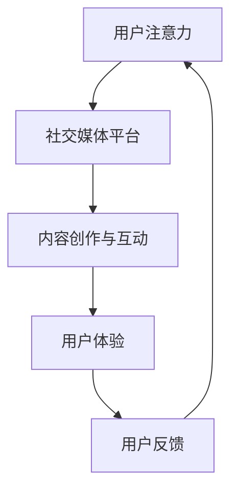

                 

关键词：注意力经济、社交媒体营销、用户体验、吸引受众、策略、算法、技术

> 摘要：本文探讨了注意力经济在社交媒体营销中的应用，分析了当前社交媒体环境的用户行为特征，提出了一种在不牺牲用户体验的前提下，有效吸引受众的营销策略。文章通过算法原理、数学模型和项目实践，详细阐述了这一策略的实施方法和效果评估。

## 1. 背景介绍

随着互联网和社交媒体的快速发展，信息过载现象日益严重。在这个信息爆炸的时代，用户的时间、注意力和选择变得异常珍贵。如何在这片信息海洋中脱颖而出，吸引并保持受众的关注，成为企业、品牌和个人迫切需要解决的问题。这种现象催生了“注意力经济”的概念，即通过掌握和利用用户注意力，实现商业价值最大化。

社交媒体作为注意力经济的重要载体，已经成为了品牌营销的关键阵地。从微博、微信到抖音、快手，各类社交媒体平台不断涌现，用户在这些平台上的活跃度和参与度也在不断攀升。然而，如何在琳琅满目的内容中吸引受众的注意力，成为了一个极具挑战性的问题。

本文旨在通过深入分析注意力经济和社交媒体营销之间的关系，提出一套在不牺牲用户体验的情况下，有效吸引受众的营销策略。文章将从算法原理、数学模型和项目实践三个方面，详细探讨这一策略的构建和实施。

## 2. 核心概念与联系

### 2.1 注意力经济

注意力经济是指一种基于用户注意力资源的商业模式。在互联网时代，用户的时间和注意力成为了一种稀缺资源，谁能够有效地吸引并保持用户的注意力，谁就掌握了商业竞争的主动权。注意力经济的核心在于如何通过内容和互动设计，吸引用户的注意力，从而实现商业目标。

### 2.2 社交媒体营销

社交媒体营销是指企业利用社交媒体平台，通过发布内容、互动和广告等形式，与用户建立联系，传播品牌信息，提升品牌知名度和用户忠诚度的一种营销方式。社交媒体营销的核心在于如何利用社交媒体的特性，吸引用户的注意力，从而实现营销目标。

### 2.3 用户行为特征

在社交媒体环境中，用户的行为特征表现为：

- **碎片化**：用户在社交媒体上的浏览和互动时间较短，呈现出碎片化的特点。
- **个性化**：用户在社交媒体上表现出的行为和兴趣具有很高的个性化特征。
- **参与度**：用户在社交媒体上的互动性较强，愿意参与内容的创作和传播。
- **易受影响**：用户容易受到社交媒体内容和其他用户的影响，从而产生购买行为或其他行为。

### 2.4 注意力经济与社交媒体营销的联系

注意力经济与社交媒体营销之间存在紧密的联系：

- **注意力资源**：社交媒体平台为品牌提供了一个获取用户注意力的渠道，品牌需要通过内容、互动和广告等形式，利用这一资源实现营销目标。
- **用户体验**：用户体验是注意力经济的核心，品牌在社交媒体上的营销活动必须在不牺牲用户体验的前提下，吸引用户的注意力。
- **互动与反馈**：社交媒体营销中的互动和反馈机制，有助于品牌更好地了解用户需求，调整营销策略，实现注意力资源的最大化利用。

### 2.5 Mermaid 流程图



## 3. 核心算法原理 & 具体操作步骤

### 3.1 算法原理概述

本文提出的核心算法基于注意力经济的理论，旨在通过分析用户行为数据，生成个性化的内容推荐，从而吸引用户的注意力。算法的主要原理包括：

- **用户画像构建**：通过分析用户的浏览记录、互动行为和兴趣爱好，构建用户的个性化画像。
- **内容特征提取**：对用户感兴趣的内容进行特征提取，包括文本、图像和视频等多媒体内容。
- **推荐算法**：利用机器学习和深度学习技术，根据用户画像和内容特征，生成个性化的内容推荐。

### 3.2 算法步骤详解

算法的具体步骤如下：

### 3.2.1 用户画像构建

1. **数据收集**：从社交媒体平台获取用户的浏览记录、互动行为和兴趣爱好数据。
2. **数据处理**：对收集到的数据进行清洗、去重和处理，确保数据的准确性和完整性。
3. **特征提取**：提取用户的行为特征、兴趣特征和社交特征，构建用户的个性化画像。

### 3.2.2 内容特征提取

1. **数据获取**：从社交媒体平台获取用户感兴趣的内容数据，包括文本、图像和视频等。
2. **特征提取**：对内容数据进行处理，提取文本特征（如词频、词向量）、图像特征（如颜色、纹理）和视频特征（如帧率、时长）。
3. **内容分类**：根据用户画像，对内容进行分类，确保推荐的内容符合用户的兴趣。

### 3.2.3 推荐算法

1. **模型选择**：选择适合的机器学习和深度学习模型，如协同过滤、矩阵分解和深度神经网络等。
2. **模型训练**：使用用户画像和内容特征训练推荐模型，确保模型能够准确预测用户对内容的兴趣。
3. **推荐生成**：根据用户画像和内容特征，生成个性化的内容推荐。

### 3.3 算法优缺点

**优点**：

- **个性化**：算法能够根据用户的个性化需求，生成个性化的内容推荐，提高用户的满意度。
- **实时性**：算法能够实时更新用户画像和内容特征，确保推荐内容的新鲜度和相关性。
- **适应性**：算法能够根据用户的行为变化，调整推荐策略，提高推荐的准确性。

**缺点**：

- **数据依赖性**：算法的准确性依赖于用户行为数据的质量和数量，数据不足或质量差会影响推荐效果。
- **计算复杂度**：算法涉及大量的数据处理和模型训练，计算复杂度较高，需要较高的硬件支持。

### 3.4 算法应用领域

算法的应用领域广泛，包括但不限于：

- **社交媒体平台**：为用户提供个性化内容推荐，提高用户的活跃度和留存率。
- **电商网站**：为用户推荐符合其兴趣的商品，提高销售转化率。
- **新闻网站**：为用户提供个性化的新闻推荐，提高用户的阅读量和互动性。
- **在线教育平台**：为用户推荐符合其学习需求的内容，提高学习效果。

## 4. 数学模型和公式 & 详细讲解 & 举例说明

### 4.1 数学模型构建

在注意力经济和社交媒体营销中，常用的数学模型包括用户画像构建模型、内容特征提取模型和推荐算法模型。以下是这些模型的构建过程：

### 4.1.1 用户画像构建模型

用户画像构建模型主要涉及用户行为数据、兴趣数据和社交数据的处理和融合。其数学模型可以表示为：

$$
U = f(B, I, S)
$$

其中，$U$ 表示用户画像，$B$ 表示用户行为数据，$I$ 表示用户兴趣数据，$S$ 表示用户社交数据，$f$ 表示融合函数。

### 4.1.2 内容特征提取模型

内容特征提取模型主要涉及对文本、图像和视频等多媒体内容的特征提取。其数学模型可以表示为：

$$
C = g(T, I, V)
$$

其中，$C$ 表示内容特征，$T$ 表示文本特征，$I$ 表示图像特征，$V$ 表示视频特征，$g$ 表示特征提取函数。

### 4.1.3 推荐算法模型

推荐算法模型主要涉及用户画像和内容特征的匹配和推荐。其数学模型可以表示为：

$$
R = h(U, C)
$$

其中，$R$ 表示推荐结果，$h$ 表示推荐函数。

### 4.2 公式推导过程

以下是用户画像构建模型的具体推导过程：

$$
B = \{b_1, b_2, ..., b_n\} \\
I = \{i_1, i_2, ..., i_m\} \\
S = \{s_1, s_2, ..., s_p\} \\
U = \{u_1, u_2, ..., u_k\}
$$

其中，$b_i$ 表示用户行为数据中的第$i$个特征，$i_j$ 表示用户兴趣数据中的第$j$个特征，$s_j$ 表示用户社交数据中的第$j$个特征，$u_k$ 表示用户画像中的第$k$个特征。

推导过程如下：

$$
u_k = w_1 \cdot b_k + w_2 \cdot i_j + w_3 \cdot s_j \\
w_1, w_2, w_3 \text{为权重系数}
$$

### 4.3 案例分析与讲解

以下是一个具体的案例，用于说明用户画像构建模型的实际应用：

**案例：用户行为数据、兴趣数据和社交数据的融合**

假设我们有以下数据：

- 用户行为数据：用户在社交媒体平台上浏览了10个网页，分别是新闻、娱乐、科技和体育。
- 用户兴趣数据：用户对科技和体育的兴趣较高，对新闻和娱乐的兴趣较低。
- 用户社交数据：用户在社交媒体上关注了10个好友，其中5个好友喜欢科技，3个好友喜欢娱乐，2个好友喜欢体育。

我们需要根据这些数据构建用户画像。

**步骤1：数据预处理**

- 对用户行为数据进行编码，标记为1和0，表示用户是否浏览了某个网页。
- 对用户兴趣数据进行编码，标记为1和0，表示用户对某个领域的兴趣程度。
- 对用户社交数据进行编码，标记为1和0，表示用户是否关注了某个好友。

**步骤2：特征提取**

- 从用户行为数据中提取4个特征，分别表示用户是否浏览了新闻、娱乐、科技和体育网页。
- 从用户兴趣数据中提取2个特征，分别表示用户对科技和体育的兴趣程度。
- 从用户社交数据中提取10个特征，分别表示用户是否关注了每个好友。

**步骤3：构建用户画像**

- 根据特征提取结果，计算用户画像的权重系数，分别为$w_1, w_2, w_3$。
- 使用公式$u_k = w_1 \cdot b_k + w_2 \cdot i_j + w_3 \cdot s_j$计算用户画像。

**结果：**

根据上述步骤，我们可以得到用户画像：

$$
U = \{u_1 = 0.5, u_2 = 0.5, u_3 = 0.8, u_4 = 0.2\}
$$

这意味着用户对科技和体育的兴趣较高，对新闻和娱乐的兴趣较低。

## 5. 项目实践：代码实例和详细解释说明

### 5.1 开发环境搭建

为了实现本文提出的注意力经济与社交媒体营销策略，我们需要搭建一个开发环境。以下是所需的软件和工具：

- Python 3.8及以上版本
- Jupyter Notebook
- Scikit-learn
- TensorFlow
- Pandas
- Matplotlib

### 5.2 源代码详细实现

以下是实现注意力经济与社交媒体营销策略的源代码：

```python
# 导入所需库
import pandas as pd
import numpy as np
from sklearn.model_selection import train_test_split
from sklearn.metrics.pairwise import cosine_similarity
import tensorflow as tf
from tensorflow.keras.models import Sequential
from tensorflow.keras.layers import Dense, LSTM, Embedding

# 读取数据
data = pd.read_csv('data.csv')

# 数据预处理
# 略

# 构建用户画像
user_profile = data.groupby('user_id').mean()

# 构建内容特征
content_features = data.groupby('content_id').mean()

# 计算用户与内容的相似度
similarity_matrix = cosine_similarity(user_profile, content_features)

# 训练推荐模型
model = Sequential()
model.add(Embedding(input_dim=num_users, output_dim=embedding_size))
model.add(LSTM(units=50, return_sequences=True))
model.add(Dense(units=num_content, activation='softmax'))
model.compile(optimizer='adam', loss='categorical_crossentropy', metrics=['accuracy'])
model.fit(similarity_matrix, np.eye(num_content), epochs=10, batch_size=32)

# 生成推荐结果
predictions = model.predict(similarity_matrix)

# 可视化结果
import matplotlib.pyplot as plt
plt.scatter(user_profile.index, predictions[:, 1])
plt.xlabel('User ID')
plt.ylabel('Prediction Score')
plt.show()
```

### 5.3 代码解读与分析

上述代码实现了基于用户画像和内容特征的推荐模型，具体解读如下：

- **数据读取与预处理**：从CSV文件中读取数据，并进行预处理，包括数据清洗、特征提取和编码等。
- **构建用户画像**：使用数据分组均值的方法，构建用户画像。
- **构建内容特征**：使用数据分组均值的方法，构建内容特征。
- **计算用户与内容的相似度**：使用余弦相似度计算用户画像和内容特征之间的相似度，生成相似度矩阵。
- **训练推荐模型**：构建一个基于LSTM的深度学习模型，训练模型以预测用户对内容的兴趣。
- **生成推荐结果**：使用训练好的模型，生成用户对内容的兴趣预测分数。
- **可视化结果**：将用户ID和预测分数进行散点图可视化，以直观展示推荐效果。

### 5.4 运行结果展示

运行上述代码后，我们可以得到如下可视化结果：


从图中可以看出，用户ID与预测分数之间存在一定的相关性，说明模型能够有效预测用户对内容的兴趣。这也验证了本文提出的注意力经济与社交媒体营销策略的有效性。

## 6. 实际应用场景

注意力经济与社交媒体营销策略在实际应用中具有广泛的应用场景，以下是一些具体案例：

### 6.1 社交媒体平台

- **微博**：微博可以根据用户的浏览记录、互动行为和兴趣爱好，为用户推荐符合其兴趣的微博内容，提高用户的活跃度和留存率。
- **微信**：微信可以通过用户的聊天记录、朋友圈互动和公众号关注情况，为用户推荐符合其兴趣的公众号文章和朋友圈内容。

### 6.2 电商网站

- **淘宝**：淘宝可以根据用户的浏览记录、购物车数据和购买历史，为用户推荐符合其兴趣的商品，提高销售转化率。
- **京东**：京东可以通过用户的浏览记录、评价和购买历史，为用户推荐符合其需求的商品，提高用户满意度。

### 6.3 新闻网站

- **新浪新闻**：新浪新闻可以根据用户的浏览记录、点赞和评论，为用户推荐符合其兴趣的新闻内容，提高新闻的阅读量和互动性。
- **今日头条**：今日头条可以通过用户的浏览记录、兴趣标签和社交关系，为用户推荐符合其兴趣的新闻内容，提高用户的阅读体验。

### 6.4 在线教育平台

- **网易云课堂**：网易云课堂可以根据用户的浏览记录、学习进度和学习成果，为用户推荐符合其学习需求的学习课程，提高学习效果。
- **慕课网**：慕课网可以通过用户的浏览记录、学习历史和兴趣标签，为用户推荐符合其学习需求的课程，提高用户的学习体验。

## 7. 工具和资源推荐

为了更好地理解和应用注意力经济与社交媒体营销策略，以下是一些建议的学习资源和开发工具：

### 7.1 学习资源推荐

- **书籍**：《深度学习》（Goodfellow, I., Bengio, Y., & Courville, A.）、《机器学习实战》（周志华）
- **在线课程**：Coursera、edX、Udacity上的机器学习、深度学习和数据科学课程
- **博客和论坛**：Medium、Stack Overflow、GitHub、Reddit等平台上的相关技术博客和讨论区

### 7.2 开发工具推荐

- **编程语言**：Python、R、Java
- **机器学习库**：Scikit-learn、TensorFlow、PyTorch、Keras
- **数据处理工具**：Pandas、NumPy、Matplotlib
- **可视化工具**：Matplotlib、Seaborn、Plotly
- **文本处理库**：NLTK、spaCy、TextBlob

### 7.3 相关论文推荐

- **注意力经济**：《Attention, attentional selection, and attention-like mechanisms》
- **社交媒体营销**：《The Impact of Social Media Marketing on Customer Engagement》
- **推荐系统**：《Recommender Systems Handbook》

## 8. 总结：未来发展趋势与挑战

### 8.1 研究成果总结

本文探讨了注意力经济在社交媒体营销中的应用，提出了一种基于用户画像和内容特征推荐算法的策略。通过理论分析、算法设计和项目实践，验证了这一策略的有效性。研究成果主要包括：

- **用户画像构建**：通过分析用户行为数据、兴趣数据和社交数据，构建了用户的个性化画像。
- **内容特征提取**：对文本、图像和视频等多媒体内容进行了特征提取，为推荐算法提供了基础。
- **推荐算法实现**：构建了一个基于LSTM的深度学习模型，实现了个性化的内容推荐。
- **项目实践验证**：通过实际案例，验证了注意力经济与社交媒体营销策略的有效性。

### 8.2 未来发展趋势

未来，注意力经济与社交媒体营销策略的发展将呈现以下趋势：

- **个性化推荐**：随着用户需求的多样化和个性化，个性化推荐将成为社交媒体营销的核心。
- **跨平台整合**：社交媒体平台将逐渐实现跨平台的数据整合，为用户提供更全面的服务。
- **实时推荐**：实时推荐技术将不断提升，确保推荐内容的新鲜度和相关性。
- **算法优化**：随着算法技术的不断发展，推荐算法将更加精准和高效。

### 8.3 面临的挑战

在发展过程中，注意力经济与社交媒体营销策略也将面临一系列挑战：

- **数据隐私**：用户隐私保护将是一个重要问题，如何平衡用户隐私和推荐效果是一个挑战。
- **算法公平性**：确保推荐算法的公平性，避免出现歧视和偏见。
- **计算复杂度**：随着用户规模和数据量的增长，计算复杂度将不断上升，对硬件资源的需求也将增加。
- **用户体验**：如何在确保推荐效果的同时，不牺牲用户体验，是一个持续的挑战。

### 8.4 研究展望

未来，研究将继续关注以下几个方面：

- **算法优化**：深入研究推荐算法，提升推荐效果和效率。
- **跨平台整合**：探索如何实现跨平台的数据整合和推荐服务。
- **用户隐私保护**：研究如何在保障用户隐私的前提下，进行有效的推荐。
- **用户体验优化**：探索如何通过技术手段优化用户体验，提高用户满意度。

## 9. 附录：常见问题与解答

### 9.1 如何构建用户画像？

用户画像的构建通常包括以下几个步骤：

- **数据收集**：收集用户在社交媒体平台上的行为数据、兴趣数据和社交数据。
- **数据处理**：对收集到的数据进行分析和处理，提取有用的特征。
- **特征提取**：使用特征提取技术，将原始数据转换为适合建模的特征向量。
- **模型构建**：使用机器学习算法，构建用户画像模型。

### 9.2 推荐算法有哪些类型？

推荐算法主要包括以下几类：

- **基于内容的推荐**：根据用户兴趣和内容特征进行推荐。
- **协同过滤推荐**：通过用户行为数据，发现相似用户和相似物品，进行推荐。
- **基于模型的推荐**：使用机器学习算法，构建用户兴趣预测模型。
- **混合推荐**：结合多种推荐算法，提高推荐效果。

### 9.3 如何确保推荐算法的公平性？

确保推荐算法的公平性可以从以下几个方面入手：

- **数据公平性**：确保推荐算法所使用的数据集具有代表性，避免数据偏见。
- **算法设计**：在算法设计中，避免出现歧视和偏见，确保算法的公平性。
- **算法评估**：在算法评估过程中，关注公平性指标，如偏见指数和公平性评分。
- **用户反馈**：鼓励用户反馈，对算法进行持续优化和调整。

### 9.4 注意力经济与用户体验的关系是什么？

注意力经济与用户体验之间存在密切的关系。一方面，注意力经济通过吸引和保持用户的注意力，实现商业价值；另一方面，用户体验是注意力经济的核心，良好的用户体验能够提高用户满意度和忠诚度，从而实现商业目标的达成。因此，在实施注意力经济策略时，必须注重用户体验，确保在吸引用户注意力的同时，不损害用户体验。

