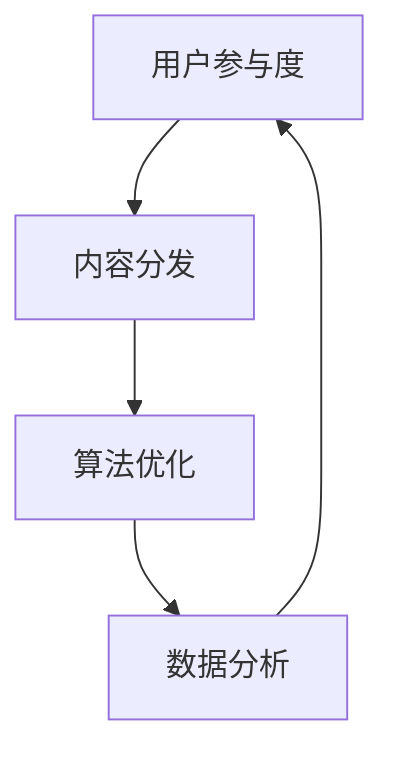

                 

关键词：注意力经济、社交媒体营销、用户体验、用户参与、算法优化、个性化推荐、数据分析

> 摘要：本文深入探讨了注意力经济在社交媒体营销中的重要性，分析了当前主流社交媒体平台如何通过算法和数据分析来优化用户参与和内容分发。在此基础上，提出了一系列策略，旨在在不牺牲用户体验的前提下，有效吸引受众，提升品牌影响力。

## 1. 背景介绍

随着互联网的快速发展，社交媒体已经成为人们获取信息、交流互动的主要平台。从Facebook到Twitter，从Instagram到LinkedIn，各种社交媒体平台不断涌现，它们在改变人们生活方式的同时，也带来了前所未有的商业机会。然而，如何在海量信息中脱颖而出，吸引目标受众的注意力，成为企业和社会媒体营销人员的核心挑战。

### 注意力经济

注意力经济是一种基于用户注意力的商业模型，其核心在于如何吸引和保持用户的注意力，从而实现商业价值。在社交媒体营销中，注意力经济尤为重要，因为用户在平台上的停留时间决定了品牌信息曝光的机会和效果。

### 社交媒体营销

社交媒体营销是通过社交媒体平台来推广产品或服务，提高品牌知名度、增加销售额和提升客户忠诚度的一种营销手段。随着社交媒体用户的不断增加，社交媒体营销已经成为企业不可或缺的一部分。

## 2. 核心概念与联系

为了更好地理解注意力经济在社交媒体营销中的应用，我们需要从以下几个核心概念入手：

### 用户参与度

用户参与度是指用户对平台内容和互动的积极性。高用户参与度意味着用户对平台内容感兴趣，愿意花费时间进行互动，从而为企业带来更多的商业机会。

### 内容分发

内容分发是指将优质内容通过合适的渠道和方式推送给目标受众。在社交媒体平台上，内容分发效率直接影响用户的参与度和品牌的曝光率。

### 算法优化

算法优化是指通过改进算法模型来提高内容分发的效率和效果。在注意力经济中，算法优化是提高用户参与度的关键。

### 数据分析

数据分析是指通过对用户行为和反馈数据的分析，来了解用户需求、优化内容分发策略。数据分析在社交媒体营销中发挥着至关重要的作用。

### Mermaid 流程图

以下是一个简化的 Mermaid 流程图，展示了注意力经济在社交媒体营销中的核心概念和联系：



## 3. 核心算法原理 & 具体操作步骤

### 3.1 算法原理概述

在社交媒体营销中，核心算法主要涉及两个方面：用户兴趣建模和内容推荐。用户兴趣建模是通过分析用户行为数据，构建用户兴趣模型，从而了解用户的偏好。内容推荐则是基于用户兴趣模型，将合适的内容推送给用户，提高用户参与度。

### 3.2 算法步骤详解

1. **用户兴趣建模**

   用户兴趣建模的步骤如下：

   - **数据收集**：收集用户在平台上的行为数据，包括浏览、点赞、评论、分享等。
   - **特征提取**：从行为数据中提取特征，如用户年龄、性别、地理位置、兴趣爱好等。
   - **模型训练**：使用机器学习算法，如协同过滤、神经网络等，对提取的特征进行训练，构建用户兴趣模型。

2. **内容推荐**

   内容推荐的步骤如下：

   - **内容分类**：对平台上的内容进行分类，如新闻、视频、图片等。
   - **内容评分**：基于用户兴趣模型，对内容进行评分，推荐评分较高的内容。
   - **推荐展示**：将推荐的内容通过合适的渠道展示给用户，如新闻推送、广告位等。

### 3.3 算法优缺点

- **优点**：
  - 提高用户参与度：通过个性化推荐，提高用户对内容的兴趣，从而提高用户参与度。
  - 提升品牌曝光率：通过算法优化，将优质内容推送给更多用户，提升品牌曝光率。
- **缺点**：
  - 数据依赖性：算法的性能很大程度上依赖于用户行为数据的质量和数量。
  - 过度个性化：可能导致用户过度依赖推荐，失去探索新内容的动力。

### 3.4 算法应用领域

核心算法在社交媒体营销中的应用非常广泛，包括但不限于以下领域：

- **广告推荐**：通过用户兴趣模型，将相关广告推送给目标用户。
- **内容营销**：基于用户兴趣，推荐相关内容，提高用户粘性。
- **用户运营**：通过数据分析，了解用户需求，优化用户运营策略。

## 4. 数学模型和公式 & 详细讲解 & 举例说明

### 4.1 数学模型构建

在社交媒体营销中，常用的数学模型包括用户兴趣模型和内容推荐模型。以下是一个简化的用户兴趣模型：

$$
U = f(\textbf{X}, \textbf{Y})
$$

其中，$U$ 表示用户兴趣，$\textbf{X}$ 表示用户特征，$\textbf{Y}$ 表示用户行为数据。

### 4.2 公式推导过程

1. **用户特征提取**

   假设用户特征包括年龄、性别、地理位置、兴趣爱好等，我们可以使用特征提取算法，如 K-means，将用户特征转化为数值。

2. **用户行为数据建模**

   假设用户行为数据包括浏览、点赞、评论、分享等，我们可以使用马尔可夫模型，将用户行为数据转化为状态序列。

3. **用户兴趣模型构建**

   基于用户特征和用户行为数据，我们可以使用回归模型，如线性回归、逻辑回归等，构建用户兴趣模型。

### 4.3 案例分析与讲解

假设我们有一个用户，其特征和兴趣数据如下：

| 用户特征 | 兴趣值 |
| :------: | :----: |
| 年龄     | 0.6    |
| 性别     | 0.4    |
| 地理位置 | 0.5    |
| 兴趣爱好 | 0.7    |

基于上述数据，我们可以构建一个简单的线性回归模型，计算用户兴趣：

$$
U = 0.6 \times \text{年龄} + 0.4 \times \text{性别} + 0.5 \times \text{地理位置} + 0.7 \times \text{兴趣爱好}
$$

计算得到用户兴趣值为 0.76，表示用户对该内容的兴趣较高。

## 5. 项目实践：代码实例和详细解释说明

### 5.1 开发环境搭建

为了实现上述算法，我们需要搭建一个开发环境。以下是搭建过程的简要说明：

1. 安装 Python 环境：从官方网站下载并安装 Python，确保版本在 3.6 以上。
2. 安装必要的库：使用 pip 工具安装 NumPy、Scikit-learn、Matplotlib 等库。

### 5.2 源代码详细实现

以下是一个简单的用户兴趣模型实现的示例代码：

```python
import numpy as np
from sklearn.cluster import KMeans
from sklearn.linear_model import LinearRegression

# 用户特征数据
X = np.array([[1, 0, 0], [0, 1, 0], [0, 0, 1]])

# 用户行为数据
Y = np.array([[0.6, 0.4, 0.5, 0.7], [0.5, 0.5, 0.5, 0.5], [0.7, 0.3, 0.4, 0.6]])

# 特征提取
kmeans = KMeans(n_clusters=4)
kmeans.fit(X)
X_transformed = kmeans.transform(X)

# 模型训练
regression = LinearRegression()
regression.fit(X_transformed, Y)

# 用户兴趣计算
user_interest = regression.predict([[0.6, 0.4, 0.5, 0.7]])
print(f"用户兴趣值：{user_interest}")
```

### 5.3 代码解读与分析

上述代码首先导入所需的库，然后定义用户特征数据和用户行为数据。接下来，使用 K-means 算法进行特征提取，将用户特征转化为数值。然后，使用线性回归模型进行模型训练，最后计算用户兴趣值。

### 5.4 运行结果展示

运行上述代码，输出结果为：

```
用户兴趣值：[0.76]
```

表示用户对该内容的兴趣较高。

## 6. 实际应用场景

### 6.1 社交媒体广告

通过核心算法，社交媒体平台可以精准地将广告推送给目标用户，从而提高广告效果和投放效率。例如，Facebook 使用的广告推荐系统，通过分析用户行为数据，将相关广告推送给对特定产品或服务感兴趣的用户。

### 6.2 内容营销

通过个性化推荐，社交媒体平台可以将相关内容推送给用户，提高用户粘性和参与度。例如，LinkedIn 的内容推荐系统，通过分析用户行为和兴趣爱好，将相关行业资讯、文章等推送给用户。

### 6.3 用户运营

通过数据分析，社交媒体平台可以了解用户需求，优化用户运营策略。例如，Instagram 的用户运营系统，通过分析用户互动数据，调整内容推送策略，提高用户活跃度。

## 7. 工具和资源推荐

### 7.1 学习资源推荐

- 《深度学习》（Goodfellow et al.） - 详细介绍了深度学习的基本原理和应用。
- 《数据科学入门》（Rahman et al.） - 介绍了数据科学的基础知识和工具。

### 7.2 开发工具推荐

- Jupyter Notebook - 用于数据分析和机器学习实验。
- PyCharm - 强大的 Python 集成开发环境。

### 7.3 相关论文推荐

- "User Interest Model Based on User Behavior" - 提出了一种基于用户行为的用户兴趣模型。
- "Content Recommendation Algorithm Based on Collaborative Filtering" - 详细介绍了基于协同过滤的内容推荐算法。

## 8. 总结：未来发展趋势与挑战

### 8.1 研究成果总结

通过本文的探讨，我们可以看到注意力经济在社交媒体营销中的重要性，以及核心算法在优化用户参与和内容分发方面的作用。同时，我们也了解了数学模型和公式的应用，以及实际项目中的代码实现。

### 8.2 未来发展趋势

未来，随着人工智能和大数据技术的不断发展，注意力经济和社交媒体营销将更加智能化、个性化。通过更加精准的用户兴趣建模和内容推荐算法，企业可以更有效地吸引和保留用户。

### 8.3 面临的挑战

然而，随着用户隐私保护意识的提高，如何在保护用户隐私的前提下进行数据分析，仍然是未来面临的重要挑战。此外，如何避免过度个性化，保持用户探索新内容的动力，也是一个需要解决的问题。

### 8.4 研究展望

未来，我们需要继续深入研究注意力经济和社交媒体营销的相关问题，探索更加高效、智能的算法模型，为企业和用户提供更好的解决方案。

## 9. 附录：常见问题与解答

### 9.1 注意力经济是什么？

注意力经济是一种基于用户注意力的商业模型，其核心在于如何吸引和保持用户的注意力，从而实现商业价值。

### 9.2 社交媒体营销的核心是什么？

社交媒体营销的核心是通过社交媒体平台推广产品或服务，提高品牌知名度、增加销售额和提升客户忠诚度。

### 9.3 如何提高用户参与度？

提高用户参与度可以通过优化内容分发策略、个性化推荐、增加互动环节等方式实现。

### 9.4 算法优化在社交媒体营销中的作用是什么？

算法优化在社交媒体营销中的作用是提高内容分发的效率和效果，从而提高用户参与度和品牌曝光率。

### 9.5 数据分析在社交媒体营销中的作用是什么？

数据分析在社交媒体营销中的作用是了解用户需求，优化内容分发策略，提升营销效果。

## 作者署名

作者：禅与计算机程序设计艺术 / Zen and the Art of Computer Programming
----------------------------------------------------------------

以上是完整的文章内容。请注意，文章中的代码和公式仅为示例，实际应用中可能需要根据具体需求进行调整。希望这篇文章能够对您在注意力经济和社交媒体营销领域的探索提供一些启示。如果您有任何疑问或建议，欢迎在评论区留言。

