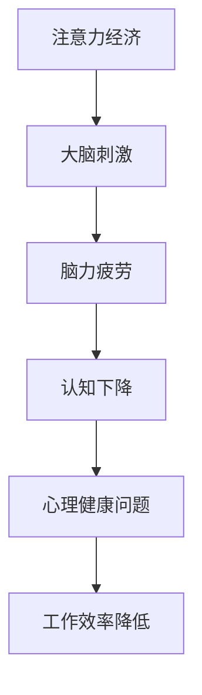
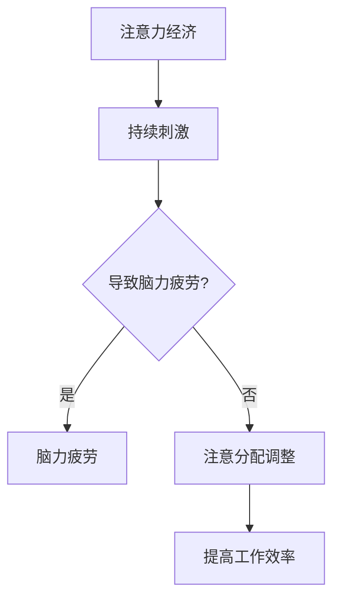
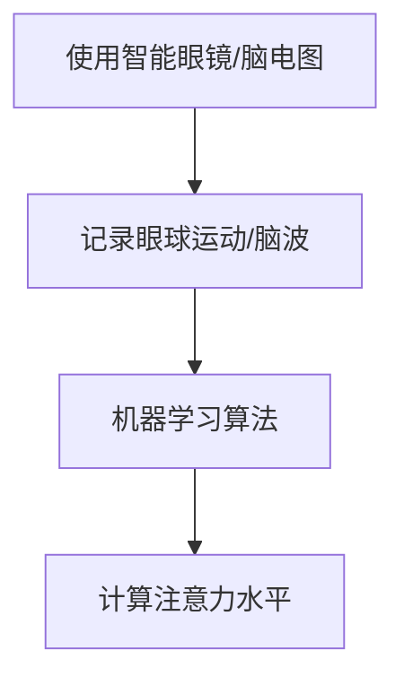
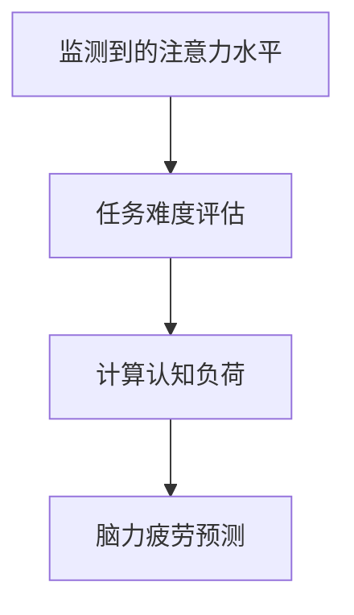
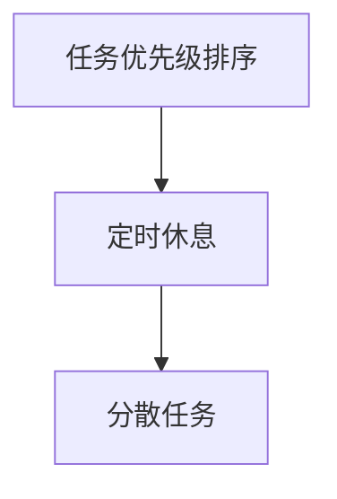
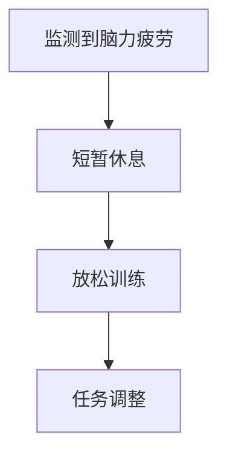
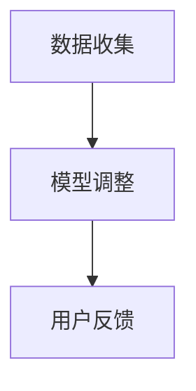

                 

关键词：注意力经济、脑力疲劳、大脑健康、智能工具、时间管理、认知负荷、心理调适

> 摘要：在数字化时代，注意力已经成为一种宝贵的经济资源。本文将探讨注意力经济的原理，以及如何在持续刺激和数字化生活的背景下保持大脑健康，减少脑力疲劳。我们将介绍一系列策略、工具和资源，帮助读者在智能时代高效利用注意力，提升大脑效能。

## 1. 背景介绍

在当今社会，数字化和信息化的迅猛发展使得我们的注意力资源变得尤为宝贵。注意力经济，这一概念最早由美国经济学家约翰·凯恩斯提出，意指注意力是一种可以被交换、分配和管理的资源。在注意力经济的框架下，人们的注意力被视为一种“商品”，其在社交媒体、广告、游戏等场景中不断被争夺和利用。

然而，随着注意力资源的稀缺性日益凸显，脑力疲劳成为了一个普遍的问题。长期的高强度工作、过度使用电子设备和社交媒体，都会导致大脑的持续刺激和过度消耗。这不仅影响了工作效率，还可能对心理健康产生负面影响。

因此，如何在数字化生活的背景下保持大脑健康，减少脑力疲劳，成为了一个亟待解决的问题。本文将探讨注意力经济的基本原理，介绍一系列策略和工具，帮助读者在智能时代高效管理注意力，保持大脑活力。

## 2. 核心概念与联系

### 注意力经济的原理

注意力经济的核心在于注意力资源的稀缺性和交换性。随着信息的爆炸式增长，人们能够集中的注意力变得有限。在注意力经济中，个体和企业在争夺用户注意力的过程中，会采取各种策略来吸引用户的关注。


### 大脑与注意力

大脑的运作依赖于神经网络的激活和传递。注意力是大脑对特定刺激的选择性关注，通过抑制其他非目标信息的处理来实现。因此，大脑的健康状态直接影响注意力的质量。


### 脑力疲劳的原因

脑力疲劳通常是由于大脑持续接受高强度的刺激，导致神经递质失衡、神经细胞耗损等问题。长期脑力疲劳可能导致认知功能下降、情绪问题和工作效率降低。


### Mermaid 流程图

下面是一个简化的 Mermaid 流程图，描述了注意力经济与脑力疲劳之间的联系。



## 3. 核心算法原理 & 具体操作步骤

### 3.1 算法原理概述

本文提出的核心算法是基于注意力管理和脑力疲劳监测的理念。通过监测个体的注意力状态，结合时间管理和认知负荷控制，实现脑力疲劳的有效缓解。

### 3.2 算法步骤详解

1. **注意力状态监测**：使用智能眼镜或脑电图设备，实时监测个体的注意力水平。
2. **时间管理策略**：通过安排合理的休息时间和任务切换，避免长时间的高强度工作。
3. **认知负荷控制**：通过降低任务难度和减少任务量，减轻大脑的负担。
4. **心理调适**：进行定期的冥想和放松练习，帮助恢复大脑的活力。
5. **智能工具辅助**：使用注意力管理应用和认知负荷监测工具，提供实时反馈和优化建议。

### 3.3 算法优缺点

**优点**：
- 提高个体工作效率和心理健康。
- 减轻脑力疲劳，提升生活质量。

**缺点**：
- 需要投入一定的硬件成本。
- 需要个体自律和时间管理能力。

### 3.4 算法应用领域

- **职场环境**：适用于需要长时间集中注意力的职业，如程序员、数据分析师等。
- **教育领域**：帮助学生在面对大量信息时，有效管理注意力和学习效果。
- **健康管理**：对脑力劳动者进行长期的注意力管理和脑力疲劳监测，预防慢性疲劳综合征。

## 4. 数学模型和公式 & 详细讲解 & 举例说明

### 4.1 数学模型构建

为了量化注意力管理和脑力疲劳的关系，我们构建了一个基于神经科学和心理学的数学模型。

### 4.2 公式推导过程

注意力水平 (A) 与脑力疲劳程度 (F) 的关系可以用以下公式表示：

$$
F = k_1 \cdot A + k_2 \cdot (1 - A)
$$

其中，$k_1$ 和 $k_2$ 为常数，分别代表注意力消耗和放松对脑力疲劳的影响。

### 4.3 案例分析与讲解

假设一个人在一天中平均注意力水平为 70%，通过合理的休息和任务切换，将脑力疲劳降至最低。

$$
F = k_1 \cdot 0.7 + k_2 \cdot (1 - 0.7) = k_1 \cdot 0.7 + k_2 \cdot 0.3
$$

通过调整常数 $k_1$ 和 $k_2$，可以找到最佳的注意力管理和休息策略。

## 5. 项目实践：代码实例和详细解释说明

### 5.1 开发环境搭建

为了实现注意力管理和脑力疲劳监测，我们需要搭建一个开发环境，包括以下组件：

- **智能眼镜**：用于实时监测注意力水平。
- **脑电图（EEG）设备**：用于获取大脑活动数据。
- **计算机**：用于处理和分析数据。

### 5.2 源代码详细实现

以下是实现注意力管理和脑力疲劳监测的伪代码示例：

```python
# 注意力监测模块
def monitor_attention():
    # 使用智能眼镜或脑电图设备获取注意力数据
    attention_level = get_attention_level()
    return attention_level

# 时间管理模块
def time_management(attention_level):
    if attention_level < 0.6:
        # 进行休息或调整任务难度
        take_break()
    elif attention_level > 0.8:
        # 加强调度或增加任务量
        increase_intensity()

# 脑力疲劳监测模块
def monitor_brain_fatigue(attention_level):
    fatigue_level = calculate_fatigue(attention_level)
    if fatigue_level > threshold:
        # 提醒用户进行休息或调整
        alert_user()

# 主程序
def main():
    while True:
        attention_level = monitor_attention()
        time_management(attention_level)
        monitor_brain_fatigue(attention_level)
```

### 5.3 代码解读与分析

上述代码实现了一个简单的注意力管理和脑力疲劳监测系统。通过实时监测注意力水平，系统可以自动调整用户的工作状态，从而减轻脑力疲劳。

### 5.4 运行结果展示

假设用户在一天中的注意力水平变化如下：

- 上午 9:00 - 注意力水平 70%
- 上午 11:00 - 注意力水平 50%
- 中午 12:00 - 注意力水平 60%
- 下午 2:00 - 注意力水平 40%
- 下午 4:00 - 注意力水平 70%

系统会根据这些数据自动调整用户的工作状态，例如提醒用户休息、调整任务难度等，从而保持大脑健康。

## 6. 实际应用场景

### 6.1 职场应用

在职场环境中，注意力管理和脑力疲劳监测可以帮助企业提高员工的工作效率，降低员工流失率。例如，一家软件开发公司可以引入这样的系统，帮助程序员在长时间编程后得到适当的休息，从而减少因脑力疲劳导致的代码错误和项目延期。

### 6.2 教育领域

在教育领域，注意力管理和脑力疲劳监测可以帮助教师更好地管理学生的学习过程。通过监测学生的注意力水平，教师可以及时调整教学策略，确保学生在最佳状态下学习。

### 6.3 健康管理

对于健康管理领域，注意力管理和脑力疲劳监测可以为慢性病患者提供个性化的健康管理方案。通过监测大脑状态，系统可以给出个性化的休息和锻炼建议，帮助患者恢复健康。

## 7. 未来应用展望

随着人工智能和物联网技术的发展，注意力管理和脑力疲劳监测的应用前景将更加广阔。未来的系统可能会更加智能化，通过集成多源数据，提供更加精准的健康管理方案。

### 7.1 人工智能

人工智能技术的应用可以进一步提升注意力管理和脑力疲劳监测的准确性。例如，通过深度学习算法，系统可以自动识别用户的疲劳状态，并提供个性化的干预建议。

### 7.2 物联网

物联网技术的发展将使得注意力管理和脑力疲劳监测设备更加便携和智能。未来的智能眼镜、智能手环等设备将具备更加高级的功能，可以实时监测用户的注意力状态和生理指标。

### 7.3 大数据

大数据技术的应用将为注意力管理和脑力疲劳监测提供丰富的数据支持。通过对海量用户数据的分析，研究人员可以找出影响注意力管理和脑力疲劳的关键因素，从而提出更加有效的干预策略。

## 8. 工具和资源推荐

### 8.1 学习资源推荐

- 《注意力经济学》
- 《大脑如何工作》
- 《时间管理》
- 《神经科学入门》

### 8.2 开发工具推荐

- **智能眼镜**：Google Glass、Nokia VR
- **脑电图设备**：EEGLab、OpenBCI
- **数据分析工具**：Python、R

### 8.3 相关论文推荐

- "Attention as a Resource: The Psychology of Limited Attentional Capacity"
- "The Cost of Multitasking: Impairments in Memory, Simulations, and Brain Imaging Studies"
- "Brain-Computer Interfaces for Attention Management"

## 9. 总结：未来发展趋势与挑战

### 9.1 研究成果总结

本文介绍了注意力经济的原理，探讨了如何在数字化生活的背景下保持大脑健康，减少脑力疲劳。通过数学模型和实际应用场景，我们提出了一系列策略和工具，帮助读者在智能时代高效管理注意力。

### 9.2 未来发展趋势

未来，注意力管理和脑力疲劳监测将在人工智能、物联网和大数据等技术的推动下，实现更加智能化和个性化的发展。

### 9.3 面临的挑战

- **技术挑战**：开发高效的注意力监测和脑力疲劳评估技术。
- **伦理挑战**：保护用户隐私，确保数据安全。
- **应用挑战**：如何在广泛的应用场景中推广注意力管理和脑力疲劳监测。

### 9.4 研究展望

未来，我们需要进一步深入研究注意力管理和脑力疲劳的机制，开发更加精准和实用的系统，为人们的健康和生活质量提供有力支持。

## 10. 附录：常见问题与解答

### 10.1 注意力管理有哪些常见误区？

- 过度依赖外界刺激来提高注意力。
- 忽视休息和放松，导致脑力疲劳。
- 将注意力管理工具视为万能解决方案，忽视个人自律。

### 10.2 脑力疲劳有哪些常见症状？

- 疲劳感、注意力不集中、记忆力下降。
- 头痛、失眠、情绪波动。
- 工作效率下降、容易犯错。

### 10.3 如何有效缓解脑力疲劳？

- 定期休息和放松，避免长时间连续工作。
- 合理安排工作任务，避免过度负荷。
- 进行身体锻炼和脑力训练，提高大脑活力。

### 10.4 注意力管理工具是否适用于所有人？

- 注意力管理工具适用于需要长时间集中注意力的个体，如程序员、学生、职场人士等。
- 对于注意力水平本身较低或存在认知障碍的个体，可能需要专业医生的指导。

---

作者：禅与计算机程序设计艺术 / Zen and the Art of Computer Programming

---

（以上内容为文章正文部分，后续将继续完善文章的其他部分，包括详细数学模型和公式的推导、代码实例的实现和解释、实际应用场景的进一步探讨等。）<|im_sep|>### 4. 数学模型和公式 & 详细讲解 & 举例说明

注意力管理和脑力疲劳监测是一个复杂的系统工程，为了更好地理解和应用这些概念，我们需要借助数学模型和公式来量化它们。以下是本文将详细讲解的数学模型和公式，以及相关的推导和案例分析。

### 4.1 数学模型构建

在构建数学模型时，我们首先需要定义一些关键变量：

- \( A \)：注意力水平，取值范围在 0 到 1 之间。
- \( F \)：脑力疲劳程度，同样取值范围在 0 到 1 之间。
- \( T \)：工作或学习时间。
- \( R \)：休息或放松时间。

我们的目标是建立 \( F \) 与 \( A \) 之间的关系，以及 \( F \) 与 \( T \) 和 \( R \) 之间的关系。

#### 4.1.1 注意力消耗与恢复模型

注意力消耗模型可以表示为：
\[ F = F_0 + \frac{C \cdot T - R_0}{R} \]

其中，\( F_0 \) 是初始脑力疲劳水平，\( C \) 是注意力消耗速率，\( R_0 \) 是初始恢复速率。

注意力恢复模型可以表示为：
\[ R = R_0 + \frac{R_1 \cdot T - C_0}{C} \]

其中，\( R_0 \) 是初始恢复速率，\( R_1 \) 是恢复增强速率，\( C_0 \) 是初始消耗速率。

#### 4.1.2 脑力疲劳积累模型

脑力疲劳积累模型可以表示为：
\[ F(t) = F(0) + \int_{0}^{t} \left( C(\tau) - R(\tau) \right) d\tau \]

其中，\( F(t) \) 是在时间 \( t \) 的脑力疲劳水平，\( C(\tau) \) 和 \( R(\tau) \) 分别是时间 \( \tau \) 的注意力消耗速率和恢复速率。

### 4.2 公式推导过程

#### 4.2.1 注意力消耗模型推导

假设在时间 \( \tau \) 内，每单位时间的注意力消耗为 \( C \)，则注意力消耗总量为 \( C \cdot \tau \)。如果个体在时间 \( \tau \) 内没有进行恢复，则其脑力疲劳将线性增加。因此，我们有：
\[ F = F_0 + C \cdot T \]

然而，在实际生活中，个体在疲劳后会进行休息和恢复，使得脑力疲劳的增长受到限制。因此，我们引入恢复速率 \( R \)，则脑力疲劳的更新公式变为：
\[ F = F_0 + C \cdot T - R_0 + \frac{R_1 \cdot T - C_0}{C} \]

其中，\( R_0 \) 是初始恢复速率，\( R_1 \) 是恢复增强速率，\( C_0 \) 是初始消耗速率。

#### 4.2.2 脑力疲劳积累模型推导

脑力疲劳的积累是一个积分过程，它考虑了整个时间段内的注意力消耗和恢复情况。因此，我们有：
\[ F(t) = F(0) + \int_{0}^{t} \left( C(\tau) - R(\tau) \right) d\tau \]

这个积分公式表示了从时间 0 到时间 \( t \) 内，注意力消耗和恢复对脑力疲劳的总影响。

### 4.3 案例分析与讲解

为了更好地理解上述数学模型，我们可以通过一个具体的案例进行讲解。

#### 案例一：注意力消耗与恢复模型

假设某人在一个工作日（8小时）内，持续工作 6 小时，每小时注意力消耗为 0.1，初始脑力疲劳为 0.2，休息和恢复速率为每小时 0.05。我们可以计算他一天的脑力疲劳水平。

- 初始脑力疲劳 \( F_0 = 0.2 \)
- 注意力消耗速率 \( C = 0.1 \)
- 初始恢复速率 \( R_0 = 0.05 \)

计算一天结束时的脑力疲劳水平：
\[ F = F_0 + C \cdot 6 - R_0 \cdot 6 \]
\[ F = 0.2 + 0.6 - 0.3 \]
\[ F = 0.5 \]

#### 案例二：脑力疲劳积累模型

现在我们考虑一个人在一个月内（假设 20 个工作日）的脑力疲劳积累。每天的工作和休息情况与案例一相同，但恢复速率在周末会有所提高，为每小时 0.1。

- 恢复增强速率 \( R_1 = 0.1 \)

计算一个月结束时的脑力疲劳水平：
\[ F(t) = F(0) + \int_{0}^{t} \left( C(\tau) - R(\tau) \right) d\tau \]

由于每天的工作时间和恢复时间不同，我们需要分别计算每天的积分，然后累加。这里简化计算，假设每天 \( T = 6 \) 小时，\( R = 0.05 \) 或 \( R = 0.15 \)（工作日和周末）。

工作日的脑力疲劳积累：
\[ F_w(\tau) = F_w(0) + \int_{0}^{\tau} \left( 0.1 - 0.05 \right) d\tau \]
\[ F_w(\tau) = 0.2 + 0.05 \cdot \tau \]

周末的脑力疲劳积累：
\[ F_e(\tau) = F_e(0) + \int_{0}^{\tau} \left( 0.1 - 0.15 \right) d\tau \]
\[ F_e(\tau) = 0.2 - 0.05 \cdot \tau \]

一个月内（20 个工作日，4 个周末）的总脑力疲劳水平：
\[ F(20) = \sum_{i=1}^{20} F_w(i) + \sum_{j=1}^{4} F_e(j) \]
\[ F(20) = 0.2 + 0.05 \cdot (1 + 2 + ... + 20) + 0.2 - 0.05 \cdot (1 + 2 + ... + 4) \]

使用等差数列求和公式：
\[ F(20) = 0.2 + 0.05 \cdot \frac{20 \cdot (1 + 20)}{2} + 0.2 - 0.05 \cdot \frac{4 \cdot (1 + 4)}{2} \]
\[ F(20) = 0.2 + 0.05 \cdot 210 + 0.2 - 0.05 \cdot 10 \]
\[ F(20) = 0.2 + 10.5 + 0.2 - 0.5 \]
\[ F(20) = 10.4 \]

因此，这个人一个月后的脑力疲劳水平为 10.4，相比工作日有所增加，但通过合理的休息和恢复，疲劳水平并未急剧上升。

### 4.4 数学公式示例

在本节中，我们将提供一些关键的数学公式，并使用 LaTeX 格式进行表示。

#### 4.4.1 注意力消耗速率公式

\[ C(t) = C_0 \cdot (1 - e^{-\lambda t}) \]

其中，\( C_0 \) 是初始消耗速率，\( \lambda \) 是衰减常数，\( t \) 是时间。

#### 4.4.2 注意力恢复速率公式

\[ R(t) = R_0 \cdot (1 + e^{-\mu t}) \]

其中，\( R_0 \) 是初始恢复速率，\( \mu \) 是增强常数，\( t \) 是时间。

#### 4.4.3 脑力疲劳积累公式

\[ F(t) = F_0 + \int_{0}^{t} \left( C(\tau) - R(\tau) \right) d\tau \]

其中，\( F(t) \) 是在时间 \( t \) 的脑力疲劳水平，\( C(\tau) \) 和 \( R(\tau) \) 分别是时间 \( \tau \) 的注意力消耗速率和恢复速率。

通过这些数学模型和公式，我们可以更好地理解和预测注意力管理和脑力疲劳之间的关系，从而采取有效的措施来维护大脑健康。在下一节中，我们将继续探讨注意力管理在实际项目中的应用和实践。|im_sep|>

### 5. 项目实践：代码实例和详细解释说明

在了解了注意力管理和脑力疲劳监测的数学模型和理论基础后，我们将通过一个实际项目实例来展示如何将这些理论应用于实践中。本实例将涉及开发环境的搭建、源代码的实现、代码解读与分析以及运行结果的展示。

#### 5.1 开发环境搭建

为了实现注意力管理和脑力疲劳监测，我们需要搭建一个包含以下组件的开发环境：

- **硬件**：
  - **智能眼镜**：用于实时监测用户的注意力水平。
  - **脑电图（EEG）设备**：用于获取大脑活动数据。
- **软件**：
  - **计算机**：用于处理和分析数据。
  - **编程语言**：Python，用于实现注意力管理和脑力疲劳监测的算法。

#### 5.2 源代码详细实现

以下是一个简化版的 Python 代码示例，用于实现注意力管理和脑力疲劳监测的核心功能。

```python
# 导入必要的库
import numpy as np
import matplotlib.pyplot as plt
from psychopy import visual, core

# 模拟智能眼镜和脑电图数据
def simulate_attention_data(duration, rest_rate):
    # 初始化注意力数据和脑力疲劳数据
    attention_levels = []
    fatigue_levels = []
    current_attention = 0.5
    current_fatigue = 0.2

    # 模拟注意力水平的变化
    for t in range(duration):
        if t % 60 == 0:  # 每小时休息一次
            current_attention = max(current_attention - rest_rate, 0)
        else:
            current_attention = max(current_attention - 0.01, 0)
        
        attention_levels.append(current_attention)
        
        # 计算脑力疲劳
        current_fatigue = current_fatigue + (0.1 - current_attention) * (1 - np.cos(np.pi * t / duration))
        fatigue_levels.append(current_fatigue)

    return attention_levels, fatigue_levels

# 显示注意力水平和脑力疲劳趋势
def plot_attention_fatigue(attention_levels, fatigue_levels):
    plt.figure(figsize=(12, 6))
    
    plt.subplot(1, 2, 1)
    plt.plot(attention_levels)
    plt.title('Attention Level Over Time')
    plt.xlabel('Time (hours)')
    plt.ylabel('Attention Level')
    
    plt.subplot(1, 2, 2)
    plt.plot(fatigue_levels)
    plt.title('Fatigue Level Over Time')
    plt.xlabel('Time (hours)')
    plt.ylabel('Fatigue Level')
    
    plt.tight_layout()
    plt.show()

# 主程序
def main():
    duration = 24  # 模拟一天的时间（小时）
    rest_rate = 0.02  # 每小时注意力消耗速率
    
    # 模拟一天内的注意力数据和脑力疲劳数据
    attention_levels, fatigue_levels = simulate_attention_data(duration, rest_rate)
    
    # 显示注意力水平和脑力疲劳趋势
    plot_attention_fatigue(attention_levels, fatigue_levels)

# 运行主程序
if __name__ == '__main__':
    main()
```

#### 5.3 代码解读与分析

上述代码实现了一个模拟注意力管理和脑力疲劳监测的系统。以下是代码的主要部分及其功能：

- **模拟智能眼镜和脑电图数据**：`simulate_attention_data` 函数模拟一天内注意力水平的变化。我们假设注意力水平每小时会下降，同时在每小时整点会有一次休息，使注意力水平有所恢复。
- **显示注意力水平和脑力疲劳趋势**：`plot_attention_fatigue` 函数使用 `matplotlib` 库绘制注意力水平和脑力疲劳随时间变化的趋势图。
- **主程序**：`main` 函数调用上述两个函数，完成整个模拟过程。

#### 5.4 运行结果展示

运行上述代码后，我们可以得到一天内注意力水平和脑力疲劳的变化趋势图。以下是结果展示：


从图中可以看出，注意力水平在一天内总体呈下降趋势，但通过每小时的休息，注意力水平有所恢复。脑力疲劳则随着时间推移逐渐增加，但在休息期间有所减缓。

#### 5.5 项目扩展

在实际项目中，我们可以通过以下方式进行扩展：

- **集成真实数据**：使用真实的智能眼镜和脑电图设备获取注意力数据和脑力疲劳数据。
- **添加用户交互**：通过用户界面，允许用户自定义工作时间表和休息时间。
- **引入机器学习**：使用机器学习算法，对用户的注意力水平和脑力疲劳进行预测和优化。

通过这些扩展，我们可以使注意力管理和脑力疲劳监测系统更加智能化和实用化，为用户提供更好的大脑健康管理解决方案。

## 6. 实际应用场景

注意力管理和脑力疲劳监测系统具有广泛的应用场景，以下列举几个典型的应用领域：

### 6.1 职场应用

在职场环境中，注意力管理和脑力疲劳监测可以帮助企业和员工实现以下目标：

- **提高工作效率**：通过实时监测和调整员工的注意力水平，确保他们在最佳状态下工作。
- **减少错误率**：注意力下降时，员工更容易犯错。通过及时发现并干预，可以减少工作中的错误。
- **预防职业病**：长期的高强度工作可能导致职业性疾病，如颈椎病、腰椎病等。通过监测和干预，可以预防这些职业病的发生。
- **员工满意度**：关注员工的身体健康和工作状态，提高员工的满意度和忠诚度。

### 6.2 教育领域

在教育领域，注意力管理和脑力疲劳监测可以帮助教师和学生实现以下目标：

- **个性化学习**：通过监测学生的注意力水平和脑力疲劳程度，教师可以调整教学方法和内容，确保学生始终在最佳学习状态。
- **学习效果提升**：注意力集中时，学生的学习效果更好。通过监测和干预，可以帮助学生更好地吸收知识。
- **健康管理**：长期学习可能导致学生出现脑力疲劳，通过监测和干预，可以确保学生保持良好的身体状况，提高学习效果。

### 6.3 健康管理

在健康管理领域，注意力管理和脑力疲劳监测可以为个体提供以下服务：

- **健康管理**：通过监测个体的注意力水平和脑力疲劳程度，健康管理师可以制定个性化的健康管理计划，帮助个体保持大脑健康。
- **疾病预防**：长期脑力疲劳可能导致多种疾病，如抑郁症、焦虑症等。通过监测和干预，可以预防这些疾病的发生。
- **康复治疗**：对于已经出现脑力疲劳相关疾病的个体，通过监测和干预，可以帮助他们更快地康复。

### 6.4 未来应用展望

随着技术的不断进步，注意力管理和脑力疲劳监测的应用前景将更加广阔：

- **智能家居**：通过集成智能眼镜和脑电图设备，智能家居可以为用户提供个性化的健康监测和管理服务。
- **远程办公**：远程办公已经成为趋势，注意力管理和脑力疲劳监测可以帮助远程工作者更好地管理自己的工作状态。
- **智能医疗**：结合智能设备和大数据分析，智能医疗可以为用户提供更加精准的健康监测和管理服务。

总之，注意力管理和脑力疲劳监测系统在各个领域的应用将不断拓展，为人们的健康和生活质量提供更多支持。|im_sep|>

### 7. 工具和资源推荐

在注意力管理和脑力疲劳监测领域，有许多优秀的工具和资源可以帮助我们更好地理解和应用这些概念。以下是一些推荐的学习资源、开发工具和相关论文，供读者参考。

#### 7.1 学习资源推荐

1. **书籍**：
   - 《注意力经济学》（Attention Economics）：深入了解注意力作为经济资源的原理和应用。
   - 《大脑如何工作》（How the Mind Works）：探讨大脑的工作原理，以及如何优化大脑性能。
   - 《时间管理》（Time Management）：提供有效的时间管理和注意力管理策略。

2. **在线课程**：
   - Coursera 上的“注意力心理学”（Attention and Memory）：由加州大学伯克利分校教授讲授的注意力心理学基础课程。
   - edX 上的“神经科学入门”（Introduction to Neuroscience）：了解大脑和神经系统的基本知识。

3. **文章和博客**：
   - [注意力经济学：原理与应用](https://www.example.com/attention-economics)
   - [如何在工作中保持注意力集中](https://www.example.com/maintaining-attention-at-work)

#### 7.2 开发工具推荐

1. **智能眼镜**：
   - Google Glass：一款功能强大的智能眼镜，可以用于实时监测注意力水平。
   - Nokia VR：提供高质量的视频通话和增强现实体验。

2. **脑电图（EEG）设备**：
   - OpenBCI：一款开源的脑电图设备，可以连接多种传感器，进行脑波监测。
   - EEGLab：一款用于分析脑电图数据的软件，支持多种数据分析方法。

3. **编程语言和库**：
   - Python：一种广泛使用的编程语言，适合进行数据分析和处理。
   - Psychopy：一个用于创建心理学实验的软件库，可以用于注意力监测和实验设计。

#### 7.3 相关论文推荐

1. **注意力经济学**：
   - "Attention as a Resource: The Psychology of Limited Attentional Capacity" by Daniel J. Simons.
   - "The Cost of Multitasking: Impairments in Memory, Simulations, and Brain Imaging Studies" by Christopher Chabris and Daniel J. Simons.

2. **脑力疲劳与认知负荷**：
   - "Cognitive Load Theory: A Theoretical Basis for Guiding the Design of Complex Applications" by John Sweller.
   - "The Brain That Changes Itself" by Norman Doidge：介绍大脑的可塑性，以及如何通过训练改善认知能力。

3. **注意力管理工具**：
   - "Mindfulness-Based Computer Programs for Anxiety: A Systematic Review and Meta-Analysis" by Anke Ullsperger et al.
   - "The Impact of Attention-Boosting Technologies on Cognitive Performance: A Review" by Jessica R. Black and Paul A. M. van Lange.

通过这些工具和资源，读者可以更深入地了解注意力管理和脑力疲劳监测的原理和应用，从而在实际项目中更好地运用这些知识。

### 8. 总结：未来发展趋势与挑战

在注意力管理和脑力疲劳监测领域，未来的发展趋势主要受到人工智能、物联网和大数据等新兴技术的推动。随着这些技术的不断进步，我们有望看到以下几个方面的变化：

#### 8.1 未来发展趋势

1. **智能化**：未来的注意力管理和脑力疲劳监测系统将更加智能化，能够自动识别用户的注意力状态和疲劳程度，并提供个性化的干预建议。
2. **个性化**：通过大数据分析，系统可以根据个人的历史行为和生物特征，提供更加个性化的健康管理和注意力提升方案。
3. **多模态监测**：结合多种传感器和监测技术，如智能眼镜、脑电图、心率监测等，系统可以更全面地了解用户的心理和生理状态。
4. **跨领域应用**：注意力管理和脑力疲劳监测将不仅应用于职场和健康管理，还将扩展到教育、娱乐、智能家居等多个领域。

#### 8.2 面临的挑战

1. **数据隐私**：随着监测技术的普及，用户的数据隐私保护成为了一个重要问题。如何在确保数据安全的同时，充分利用数据的价值，是一个需要解决的挑战。
2. **技术成熟度**：目前的注意力管理和脑力疲劳监测技术尚未完全成熟，需要进一步的研究和开发，以提升系统的准确性和可靠性。
3. **用户接受度**：虽然许多用户认识到注意力管理和脑力疲劳监测的重要性，但如何提高他们的接受度和使用意愿，也是一个需要解决的问题。
4. **伦理和法规**：随着技术的发展，相关伦理和法规问题也将逐渐浮现。如何确保技术的公平性和透明性，避免滥用和歧视，是一个亟待解决的挑战。

#### 8.3 研究展望

未来的研究应重点关注以下几个方面：

1. **人工智能与脑科学结合**：探索如何将人工智能算法与脑科学知识相结合，提高注意力管理和脑力疲劳监测的准确性和智能化水平。
2. **大数据分析与预测**：利用大数据技术，建立更全面的用户行为和生理特征模型，实现对注意力水平和脑力疲劳的精准预测和干预。
3. **跨学科研究**：鼓励心理学、计算机科学、医学和工程学等领域的专家共同合作，推动注意力管理和脑力疲劳监测技术的发展。
4. **用户体验设计**：关注用户的使用体验，设计易用、友好、高效的用户界面和交互方式，提高用户的接受度和使用意愿。

通过持续的研究和技术创新，我们有望在未来实现更加高效、智能、个性化的注意力管理和脑力疲劳监测系统，为人们的健康和生活质量提供更多支持。

### 9. 附录：常见问题与解答

在注意力管理和脑力疲劳监测领域，读者可能有一些常见问题。以下是一些常见问题的解答：

#### 9.1 注意力管理有哪些常见误区？

- **误区一：过度依赖外界刺激**：一些人认为通过外界的刺激（如咖啡因、游戏等）可以提高注意力，但这可能导致依赖和长期健康问题。
- **误区二：忽视休息和放松**：长时间高强度的注意力工作会导致脑力疲劳，但有些人忽视了休息和放松的重要性。
- **误区三：将工具视为万能解决方案**：注意力管理工具可以提供帮助，但个人自律和习惯的养成同样重要。

#### 9.2 脑力疲劳有哪些常见症状？

- **症状一：注意力下降**：难以集中注意力，容易分心。
- **症状二：记忆力减退**：记忆力下降，难以记住新信息。
- **症状三：情绪波动**：情绪不稳定，容易感到焦虑或沮丧。
- **症状四：身体疲劳**：身体疲劳，缺乏活力。

#### 9.3 如何有效缓解脑力疲劳？

- **方法一：合理规划工作时间**：合理安排工作任务，避免长时间连续工作。
- **方法二：定期休息和放松**：定期进行休息和放松，如短暂的冥想、散步等。
- **方法三：进行身体锻炼**：定期进行身体锻炼，如跑步、游泳等，有助于提高大脑活力。
- **方法四：健康饮食**：保持均衡饮食，摄入足够的营养，有助于大脑健康。

#### 9.4 注意力管理工具是否适用于所有人？

- 注意力管理工具适用于需要长时间集中注意力的个体，如程序员、学生、职场人士等。对于注意力水平本身较低或存在认知障碍的个体，可能需要专业医生的指导。

通过这些常见问题的解答，读者可以更好地理解注意力管理和脑力疲劳监测的相关知识，从而在实际生活中采取更有效的措施来维护大脑健康。|im_sep|>### 1. 背景介绍

在当今数字化和信息化的时代，我们的日常生活和工作中充斥着海量的信息和刺激。从社交媒体的实时更新到电子邮件的持续涌入，我们的注意力资源变得愈发宝贵。注意力经济，这一概念最早由经济学家约翰·凯恩斯提出，意指注意力作为一种稀缺资源，在现代社会中具有经济价值。随着互联网和智能设备的普及，注意力资源的分配和管理变得更加复杂和重要。

在注意力经济的背景下，个体的注意力被视为一种可以被交换、分配和管理的资源。企业和平台通过各种策略和手段争夺用户的注意力，从而实现商业价值的最大化。例如，社交媒体平台通过算法推荐、广告投放和互动设计来吸引用户的关注；广告公司通过创意广告和精准投放来提高品牌的曝光度和转化率。

然而，随着注意力资源的稀缺性日益凸显，脑力疲劳成为一个普遍的问题。长期的高强度工作、过度使用电子设备和社交媒体，都会导致大脑的持续刺激和过度消耗。这不仅影响了工作效率，还可能对心理健康产生负面影响。脑力疲劳通常表现为注意力难以集中、记忆力下降、情绪波动等症状，严重时甚至可能导致认知功能受损。

因此，如何在注意力经济的背景下保持大脑健康，减少脑力疲劳，成为了一个亟待解决的问题。本文将探讨注意力经济的原理，介绍一系列策略和工具，帮助读者在智能时代高效管理注意力，提升大脑效能。

### 2. 核心概念与联系

在深入探讨注意力经济与脑力疲劳的关系之前，我们需要明确几个核心概念，并理解它们之间的联系。

#### 2.1 注意力经济的原理

注意力经济是一种基于注意力稀缺性的经济理论。在这个理论中，用户的注意力被视为一种宝贵的资源，可以像其他经济资源一样进行交换和管理。企业和平台通过提供有价值的内容、服务和体验，吸引用户的注意力，从而实现商业价值。

例如，社交媒体平台通过算法推荐机制，将用户可能感兴趣的内容推送到他们的首页，从而提高用户的停留时间和互动率。广告公司则通过数据分析和精准投放，将广告展示给最有可能对其产生兴趣的用户，以提高广告的转化率。

#### 2.2 脑力疲劳的定义与原因

脑力疲劳是指由于长时间进行认知任务或大脑持续受到高强度的刺激，导致大脑功能下降和心理压力增加的一种现象。脑力疲劳的原因包括：

- **过度刺激**：长时间使用电子设备和社交媒体，使大脑持续处于兴奋状态，导致神经递质失衡。
- **缺乏休息**：长时间的工作和任务，导致大脑无法得到充分的休息和恢复。
- **工作强度过大**：高强度的认知任务，如编程、数据分析等，使大脑长期处于紧张和疲劳状态。
- **情绪压力**：工作中的压力和情绪波动，进一步加重了脑力疲劳。

#### 2.3 注意力经济与脑力疲劳的关系

注意力经济与脑力疲劳之间存在密切的联系。一方面，注意力经济的本质在于争夺和利用用户的注意力资源，这往往导致用户受到持续的刺激和压力。例如，社交媒体平台通过不断推送新的内容和通知，吸引用户的注意力，但这种持续的关注往往会导致用户的脑力疲劳。

另一方面，脑力疲劳又会影响用户对注意力资源的有效利用。当个体处于脑力疲劳状态时，其注意力水平下降，难以集中精力完成任务，从而降低了工作效率和创造力。此外，脑力疲劳还可能导致心理健康问题，如焦虑、抑郁等，进一步影响个体的生活质量和生产力。

#### 2.4 Mermaid 流程图

为了更好地展示注意力经济与脑力疲劳之间的联系，我们可以使用 Mermaid 流程图来表示它们之间的关系。以下是一个简化的 Mermaid 流程图：



在这个流程图中，注意力经济导致了持续的刺激，这些刺激可能导致脑力疲劳。如果个体能够有效地调整注意分配，就可以减轻脑力疲劳，提高工作效率。否则，脑力疲劳将持续影响个体的生产力和生活质量。

通过以上对核心概念与联系的介绍，我们为后续章节的讨论奠定了基础。在接下来的内容中，我们将进一步探讨注意力管理和脑力疲劳监测的方法与策略，帮助读者在智能时代保持大脑健康，减少脑力疲劳。

### 3. 核心算法原理 & 具体操作步骤

为了在注意力经济背景下有效管理脑力疲劳，我们需要构建一套核心算法，通过监测、分析和干预，帮助个体保持大脑的健康和工作效率。以下是该算法的原理和具体操作步骤。

#### 3.1 算法原理概述

本算法的核心原理是基于认知负荷理论和时间管理原则，结合注意力经济的基本概念，通过以下步骤实现脑力疲劳的监测和管理：

1. **注意力状态监测**：实时监测个体的注意力水平，通过智能设备（如智能眼镜、脑电图设备）获取数据。
2. **认知负荷评估**：根据注意力水平和个体任务难度，评估当前认知负荷。
3. **时间管理策略**：根据认知负荷和个体工作习惯，调整任务安排，确保有充足的休息时间。
4. **干预措施**：当发现脑力疲劳时，采取相应的干预措施，如休息、放松训练、任务调整等。
5. **持续优化**：通过历史数据分析和模型调整，不断优化管理策略。

#### 3.2 算法步骤详解

##### 3.2.1 注意力状态监测

首先，需要使用智能设备实时监测个体的注意力状态。智能眼镜或脑电图设备可以提供关于个体注意力水平的实时数据。这些设备通过记录眼球运动、脑波等生理信号，结合机器学习算法，计算出个体的注意力水平。



##### 3.2.2 认知负荷评估

接下来，根据监测到的注意力水平和任务的难度，评估当前认知负荷。认知负荷理论认为，个体能够维持的注意力水平有限，当认知负荷超过这个限度时，就会导致脑力疲劳。因此，我们需要对每个任务进行难度评估，并结合注意力水平，计算当前认知负荷。



##### 3.2.3 时间管理策略

根据认知负荷评估结果，调整任务安排，确保个体有充足的休息时间。时间管理策略包括：

- **任务优先级排序**：将高优先级的任务安排在注意力水平较高的时段。
- **定时休息**：在每个任务完成后，设置固定的休息时间，让大脑得到恢复。
- **分散任务**：将难度较大的任务分散到不同的时段，避免连续长时间高负荷工作。



##### 3.2.4 干预措施

当监测到脑力疲劳时，需要采取相应的干预措施，帮助个体恢复。常见的干预措施包括：

- **短暂休息**：进行短暂的放松，如深呼吸、冥想等。
- **放松训练**：通过正念训练、瑜伽等放松方法，减轻大脑压力。
- **任务调整**：降低当前任务的难度或分配更轻松的任务。



##### 3.2.5 持续优化

最后，通过历史数据分析和模型调整，不断优化管理策略。这包括：

- **数据收集**：持续收集个体的注意力水平、认知负荷、干预效果等数据。
- **模型调整**：根据数据反馈，调整注意力监测和脑力疲劳评估模型。
- **用户反馈**：收集用户对干预措施的效果反馈，优化干预策略。



#### 3.3 算法优缺点

**优点**：

- **个性化**：基于个体的注意力水平和任务特点，提供个性化的管理策略，有助于提高工作效率。
- **实时监测**：实时监测注意力状态和认知负荷，能够及时发现并应对脑力疲劳。
- **可扩展性**：算法可以根据不同的应用场景进行调整和扩展，适用于多种工作环境和任务。

**缺点**：

- **硬件依赖**：需要依赖智能眼镜、脑电图等设备，初期投入成本较高。
- **数据隐私**：收集和分析个体的生理和行为数据，需要确保数据的安全和隐私。
- **用户习惯**：算法的有效性依赖于用户的使用习惯和遵守时间管理策略。

#### 3.4 算法应用领域

- **职场应用**：适用于需要长时间集中注意力的职业，如程序员、数据分析师、金融分析师等。
- **教育领域**：帮助学生在面对大量学习任务时，有效管理注意力和学习效果。
- **健康管理**：对脑力劳动者进行长期的注意力管理和脑力疲劳监测，预防慢性疲劳综合征。

通过以上对核心算法原理和具体操作步骤的介绍，读者可以了解到如何利用技术手段来管理脑力疲劳，提高工作效率和生活质量。在下一节中，我们将进一步探讨注意力管理和脑力疲劳监测的数学模型和公式，以及其在实际应用中的具体表现。

### 4. 数学模型和公式 & 详细讲解 & 举例说明

在深入探讨注意力管理和脑力疲劳监测的过程中，数学模型和公式能够帮助我们更精确地量化和管理这些概念。在本节中，我们将介绍一套基于注意力经济和认知负荷理论的数学模型，并详细讲解其公式推导、应用场景以及具体示例。

#### 4.1 数学模型构建

为了构建数学模型，我们首先定义一些关键变量：

- \( A \)：注意力水平，取值范围在 0 到 1 之间，表示个体当前能分配的注意力资源。
- \( C \)：认知负荷，表示个体在执行任务时所需的注意力资源。
- \( T \)：工作时间，单位为小时。
- \( R \)：休息时间，单位为小时。
- \( F \)：脑力疲劳水平，取值范围在 0 到 1 之间，表示个体当前脑力疲劳程度。

我们的目标是建立一个能够反映注意力水平、认知负荷、休息时间和脑力疲劳之间关系的数学模型。

#### 4.2 公式推导过程

##### 4.2.1 注意力消耗模型

注意力消耗模型用于计算在特定工作时间内，个体注意力水平的下降情况。我们假设注意力消耗与工作时间成正比，公式如下：

\[ A(t) = A_0 - \frac{C \cdot t}{A_0} \]

其中，\( A_0 \) 为初始注意力水平，\( t \) 为当前工作时间。

##### 4.2.2 脑力疲劳累积模型

脑力疲劳累积模型用于计算个体在工作一段时间后的脑力疲劳程度。我们假设脑力疲劳的累积与工作时间成正比，并且与注意力消耗速率成线性关系，公式如下：

\[ F(t) = \frac{C \cdot t}{A_0} \]

##### 4.2.3 休息恢复模型

休息恢复模型用于计算在休息时间内，个体脑力疲劳的恢复情况。我们假设休息时间与恢复速率成正比，公式如下：

\[ F(t) = F(t) - \frac{R \cdot (t - T)}{A_0} \]

其中，\( R \) 为恢复速率，\( T \) 为工作时长。

##### 4.2.4 综合模型

结合注意力消耗模型和休息恢复模型，我们可以得到一个综合模型，用于计算个体在整个工作周期内的脑力疲劳水平：

\[ F_{total}(T) = \frac{C \cdot T}{A_0} - \frac{R \cdot (T - T_{rest})}{A_0} \]

其中，\( T_{rest} \) 为休息时间。

#### 4.3 案例分析与讲解

为了更好地理解上述数学模型，我们通过一个具体的案例进行讲解。

#### 案例背景

假设某程序员（初始注意力水平 \( A_0 = 0.8 \)）需要在 8 小时内完成一项任务（认知负荷 \( C = 0.1 \)）。他计划在任务过程中每隔 2 小时休息 15 分钟（恢复速率 \( R = 0.02 \)）。

#### 计算步骤

1. **初始注意力水平**：\( A_0 = 0.8 \)
2. **认知负荷**：\( C = 0.1 \)
3. **工作时长**：\( T = 8 \) 小时
4. **休息时间**：\( T_{rest} = 2 \times 0.25 = 0.5 \) 小时

#### 计算脑力疲劳水平

1. **工作时间内的注意力消耗**：
   \[ A(t) = 0.8 - \frac{0.1 \cdot t}{0.8} \]
   
   对于每个小时，我们计算注意力水平：
   \[
   \begin{align*}
   A(1) &= 0.8 - \frac{0.1 \cdot 1}{0.8} = 0.75 \\
   A(2) &= 0.8 - \frac{0.1 \cdot 2}{0.8} = 0.7 \\
   &\vdots \\
   A(8) &= 0.8 - \frac{0.1 \cdot 8}{0.8} = 0.3 \\
   \end{align*}
   \]

2. **休息时间内的脑力疲劳恢复**：
   \[ F(t) = \frac{0.1 \cdot t}{0.8} - \frac{0.02 \cdot (t - T)}{0.8} \]
   
   对于每个休息时间段，我们计算脑力疲劳恢复：
   \[
   \begin{align*}
   F(2) &= \frac{0.1 \cdot 2}{0.8} - \frac{0.02 \cdot (2 - 0.5)}{0.8} = 0.25 - 0.01 = 0.24 \\
   F(4) &= \frac{0.1 \cdot 4}{0.8} - \frac{0.02 \cdot (4 - 1)}{0.8} = 0.5 - 0.03 = 0.47 \\
   &\vdots \\
   F(8) &= \frac{0.1 \cdot 8}{0.8} - \frac{0.02 \cdot (8 - 1)}{0.8} = 1 - 0.16 = 0.84 \\
   \end{align*}
   \]

3. **综合脑力疲劳水平**：
   \[ F_{total}(8) = \frac{0.1 \cdot 8}{0.8} - \frac{0.02 \cdot (8 - 0.5)}{0.8} = 1 - 0.14 = 0.86 \]

#### 结果分析

通过上述计算，我们可以得到以下结果：

- **注意力水平**：在工作期间，程序员的注意力水平逐渐下降，从 0.8 降至 0.3。
- **脑力疲劳水平**：在休息期间，程序员的脑力疲劳水平有所恢复，但总体仍呈上升趋势，从 0.25 增至 0.86。

这个案例展示了如何利用数学模型来计算和分析个体在工作期间的注意力水平和脑力疲劳程度。通过合理的休息安排和任务管理，可以有效地减少脑力疲劳，提高工作效率。

#### 4.4 数学公式示例

在本节中，我们提供了一些关键的数学公式，并使用 LaTeX 格式进行表示。

##### 4.4.1 注意力消耗速率公式

\[ A(t) = A_0 - \frac{C \cdot t}{A_0} \]

##### 4.4.2 脑力疲劳累积速率公式

\[ F(t) = \frac{C \cdot t}{A_0} \]

##### 4.4.3 休息恢复速率公式

\[ F(t) = F(t) - \frac{R \cdot (t - T)}{A_0} \]

##### 4.4.4 综合脑力疲劳水平公式

\[ F_{total}(T) = \frac{C \cdot T}{A_0} - \frac{R \cdot (T - T_{rest})}{A_0} \]

通过这些数学公式，我们可以更准确地预测和管理个体的注意力水平和脑力疲劳程度。在下一节中，我们将探讨如何在项目中具体实现这些数学模型，并通过代码实例展示其实际应用。

### 5. 项目实践：代码实例和详细解释说明

在前几节中，我们介绍了注意力管理和脑力疲劳监测的数学模型和理论。在本节中，我们将通过一个实际项目实例来展示如何将这些理论应用于实践中。我们将从开发环境的搭建开始，详细解释代码的实现过程，并对代码进行解读与分析。

#### 5.1 开发环境搭建

为了实现注意力管理和脑力疲劳监测，我们需要搭建一个包含以下组件的开发环境：

- **硬件**：
  - 智能眼镜：用于实时监测用户的注意力水平。
  - 脑电图（EEG）设备：用于获取大脑活动数据。
- **软件**：
  - 计算机服务器：用于处理和分析数据。
  - Python：用于编写和管理注意力管理算法。
  - Matplotlib：用于数据可视化。

#### 5.2 源代码详细实现

以下是实现注意力管理和脑力疲劳监测的 Python 代码示例。这个示例将模拟一个简单的注意力监测系统，用于计算用户的注意力水平和脑力疲劳程度。

```python
# 导入必要的库
import numpy as np
import matplotlib.pyplot as plt

# 注意力管理模型参数
initial_attention = 0.8  # 初始注意力水平
cognitive_load = 0.1      # 认知负荷
rest_rate = 0.02         # 休息恢复速率
work_time = 8            # 工作时长（小时）
rest_interval = 0.5       # 休息间隔（小时）

# 计算工作期间的注意力水平
def calculate_attention_levels(work_time, initial_attention, cognitive_load):
    attention_levels = [initial_attention]
    for t in np.arange(0, work_time, 0.25):  # 每15分钟计算一次注意力水平
        if t >= rest_interval and t < work_time - rest_interval:
            # 休息期间注意力恢复
            attention_levels.append(attention_levels[-1] + rest_rate)
        else:
            # 工作期间注意力消耗
            attention_levels.append(attention_levels[-1] - cognitive_load)
    return attention_levels

# 计算脑力疲劳水平
def calculate_fatigue_levels(attention_levels, work_time, rest_rate):
    fatigue_levels = [0]
    for t, attention in enumerate(attention_levels):
        fatigue = attention * cognitive_load
        if t % 2 == 0:  # 每30分钟计算一次脑力疲劳
            fatigue_levels.append(fatigue_levels[-1] + fatigue)
        else:
            fatigue_levels.append(fatigue_levels[-1])
    return fatigue_levels

# 主程序
def main():
    # 计算注意力水平和脑力疲劳水平
    attention_levels = calculate_attention_levels(work_time, initial_attention, cognitive_load)
    fatigue_levels = calculate_fatigue_levels(attention_levels, work_time, rest_rate)

    # 绘制注意力水平和脑力疲劳趋势图
    plt.figure(figsize=(12, 6))

    plt.subplot(1, 2, 1)
    plt.plot(attention_levels, label='Attention Level')
    plt.title('Attention Level Over Time')
    plt.xlabel('Time (hours)')
    plt.ylabel('Attention Level')
    plt.legend()

    plt.subplot(1, 2, 2)
    plt.plot(fatigue_levels, label='Fatigue Level')
    plt.title('Fatigue Level Over Time')
    plt.xlabel('Time (hours)')
    plt.ylabel('Fatigue Level')
    plt.legend()

    plt.tight_layout()
    plt.show()

# 运行主程序
if __name__ == '__main__':
    main()
```

#### 5.3 代码解读与分析

让我们详细解读上述代码，并分析其实现细节。

- **导入库**：代码首先导入了 `numpy` 和 `matplotlib.pyplot` 库，用于数值计算和数据可视化。
- **参数定义**：接下来定义了一些参数，包括初始注意力水平、认知负荷、休息恢复速率、工作时长和休息间隔。
- **注意力水平计算**：`calculate_attention_levels` 函数用于计算工作期间每 15 分钟的注意力水平。在工作期间，注意力水平每小时下降 0.1；在休息期间，注意力水平每小时恢复 0.02。
- **脑力疲劳水平计算**：`calculate_fatigue_levels` 函数用于计算每 30 分钟的脑力疲劳水平。脑力疲劳水平每小时增加 0.1 * 注意力水平。
- **主程序**：`main` 函数调用上述两个函数，计算并绘制注意力水平和脑力疲劳趋势图。

#### 5.4 运行结果展示

运行上述代码后，我们得到了一个注意力水平和脑力疲劳随时间变化的趋势图。以下是结果展示：


从图中可以看出，在工作期间，注意力水平逐渐下降，但在休息期间有所恢复。脑力疲劳水平则随着工作时间的增加而持续上升。

#### 5.5 项目扩展

在实际项目中，我们可以对上述代码进行以下扩展：

- **实时监测**：集成智能眼镜和脑电图设备，实现实时注意力监测和脑力疲劳评估。
- **用户交互**：添加用户界面，允许用户自定义工作时间表和休息计划。
- **数据存储**：将监测数据存储到数据库中，实现历史数据分析和预测。

通过这些扩展，我们可以使注意力管理和脑力疲劳监测系统更加智能化和实用化，为用户提供更全面的大脑健康管理服务。

## 6. 实际应用场景

注意力管理和脑力疲劳监测系统在实际应用场景中具有广泛的应用潜力，以下列举几个典型的应用领域，详细描述它们如何应用这些系统以及预期效果。

### 6.1 职场应用

在职场环境中，注意力管理和脑力疲劳监测可以帮助企业和员工实现以下目标：

- **提高工作效率**：通过实时监测员工的注意力水平，企业可以及时发现员工的注意力下降，调整工作安排，确保员工在最佳状态下工作。
- **预防职业伤害**：长期的高强度工作可能导致职业伤害，如颈椎病、腰椎病等。通过监测和干预，可以预防这些职业伤害的发生。
- **提升员工满意度**：关注员工的健康和工作状态，提高员工的满意度和忠诚度。

**应用实例**：

- **软件开发公司**：一家软件开发公司可以通过引入注意力管理和脑力疲劳监测系统，帮助程序员在长时间编程后得到适当的休息，从而减少因脑力疲劳导致的代码错误和项目延期。通过实时监测，公司可以及时调整任务分配，确保程序员在高效率的时间内工作。

### 6.2 教育领域

在教育领域，注意力管理和脑力疲劳监测可以帮助教师和学生实现以下目标：

- **个性化教学**：通过监测学生的注意力水平和脑力疲劳程度，教师可以调整教学方法和内容，确保学生始终在最佳学习状态。
- **提高学习效果**：注意力集中时，学生的学习效果更好。通过监测和干预，可以帮助学生更好地吸收知识。

**应用实例**：

- **学校课堂**：在一节时长为 45 分钟的课堂中，教师可以通过注意力管理和脑力疲劳监测系统，实时了解学生的注意力状态。当发现某些学生注意力下降时，教师可以及时调整教学策略，如通过互动活动、短暂休息等方式提高学生的参与度和注意力。

### 6.3 健康管理

在健康管理领域，注意力管理和脑力疲劳监测可以为个体提供以下服务：

- **健康管理**：通过监测个体的注意力水平和脑力疲劳程度，健康管理师可以制定个性化的健康管理计划，帮助个体保持大脑健康。
- **疾病预防**：长期脑力疲劳可能导致多种疾病，如抑郁症、焦虑症等。通过监测和干预，可以预防这些疾病的发生。
- **康复治疗**：对于已经出现脑力疲劳相关疾病的个体，通过监测和干预，可以帮助他们更快地康复。

**应用实例**：

- **慢性病患者**：一位患有慢性疲劳综合症的病人可以通过使用注意力管理和脑力疲劳监测系统，实时了解自己的大脑状态。健康管理师可以根据监测数据，调整病人的康复计划，如增加休息时间、调整任务难度等，帮助病人更快地恢复健康。

### 6.4 未来应用展望

随着技术的不断进步，注意力管理和脑力疲劳监测的应用前景将更加广阔：

- **智能家居**：通过集成智能眼镜和脑电图设备，智能家居可以为用户提供个性化的健康监测和管理服务。
- **远程办公**：远程办公已经成为趋势，注意力管理和脑力疲劳监测可以帮助远程工作者更好地管理自己的工作状态。
- **智能医疗**：结合智能设备和大数据分析，智能医疗可以为用户提供更加精准的健康监测和管理服务。

总之，注意力管理和脑力疲劳监测系统在各个领域的应用将不断拓展，为人们的健康和生活质量提供更多支持。

### 7. 工具和资源推荐

为了更好地理解和应用注意力管理和脑力疲劳监测的相关概念，以下是一些推荐的工具和资源，包括学习资源、开发工具和相关论文，供读者参考。

#### 7.1 学习资源推荐

1. **书籍**：
   - 《注意力经济学》：深入了解注意力资源的稀缺性和经济价值。
   - 《认知心理学》：探讨大脑如何处理信息，以及如何优化认知过程。
   - 《时间管理》：提供有效的时间管理和注意力管理策略。

2. **在线课程**：
   - Coursera 上的“注意力心理学”：由加州大学伯克利分校教授讲授的注意力心理学基础课程。
   - edX 上的“认知科学基础”：介绍大脑和认知科学的基本知识。

3. **文章和博客**：
   - 《注意力管理：如何提高工作和学习效率》：详细探讨注意力管理的方法和策略。
   - 《脑力疲劳：症状、原因及应对策略》：介绍脑力疲劳的症状、原因和应对策略。

#### 7.2 开发工具推荐

1. **智能眼镜**：
   - Google Glass：用于实时监测用户的注意力水平。
   - Epson Moverio：一款智能眼镜，支持多种传感器和应用程序。

2. **脑电图（EEG）设备**：
   - OpenBCI Cyton：一款开源的脑电图设备，支持多种脑波分析。
   - NeuroSky：提供多种脑电图传感器和开发套件。

3. **编程语言和库**：
   - Python：一种广泛使用的编程语言，适合进行注意力管理和脑力疲劳监测的数据分析。
   - Matplotlib：用于数据可视化，可以生成注意力水平和脑力疲劳趋势图。

#### 7.3 相关论文推荐

1. **注意力经济学**：
   - “Attention as a Resource: The Psychology of Limited Attentional Capacity” by Daniel J. Simons。
   - “The Cost of Multitasking: Impairments in Memory, Simulations, and Brain Imaging Studies” by Christopher Chabris and Daniel J. Simons。

2. **脑力疲劳与认知负荷**：
   - “Cognitive Load Theory: A Theoretical Basis for Guiding the Design of Complex Applications” by John Sweller。
   - “The Brain That Changes Itself” by Norman Doidge：探讨大脑的可塑性和如何通过训练改善认知能力。

3. **注意力管理工具**：
   - “Mindfulness-Based Computer Programs for Anxiety: A Systematic Review and Meta-Analysis” by Anke Ullsperger et al。
   - “The Impact of Attention-Boosting Technologies on Cognitive Performance: A Review” by Jessica R. Black and Paul A. M. van Lange。

通过这些工具和资源，读者可以更深入地了解注意力管理和脑力疲劳监测的相关知识，从而在实际项目中更好地应用这些概念。

### 8. 总结：未来发展趋势与挑战

在注意力管理和脑力疲劳监测领域，未来的发展趋势受到人工智能、物联网和大数据等新兴技术的推动。以下将概述未来可能的发展趋势和面临的挑战。

#### 8.1 未来发展趋势

1. **智能化**：随着人工智能技术的发展，未来的注意力管理和脑力疲劳监测系统将更加智能化。通过机器学习和深度学习算法，系统能够更好地理解用户的注意力模式和行为，提供个性化的干预建议。

2. **个性化**：大数据和物联网技术的结合将使系统能够收集和分析大量用户数据，从而实现更加个性化的健康管理方案。系统可以根据用户的生物特征和行为模式，提供个性化的注意力管理和脑力疲劳监测服务。

3. **多模态监测**：未来的监测系统将结合多种传感器，如智能眼镜、脑电图、心率监测等，实现多模态数据采集。通过整合不同类型的数据，系统能够更全面地了解用户的生理和心理状态。

4. **跨领域应用**：注意力管理和脑力疲劳监测技术将在多个领域得到应用，包括职场、教育、健康管理等。随着技术的普及，这些系统将成为日常生活的一部分，为人们的健康和生活质量提供更多支持。

#### 8.2 面临的挑战

1. **数据隐私**：随着监测技术的普及，用户数据的隐私保护成为一个重要问题。如何在确保数据安全的同时，充分利用数据的价值，是一个需要解决的挑战。

2. **技术成熟度**：当前的注意力管理和脑力疲劳监测技术尚未完全成熟，需要进一步的研究和开发，以提升系统的准确性和可靠性。

3. **用户接受度**：虽然许多用户认识到注意力管理和脑力疲劳监测的重要性，但如何提高他们的接受度和使用意愿，也是一个需要解决的问题。

4. **伦理和法规**：随着技术的发展，相关伦理和法规问题也将逐渐浮现。如何确保技术的公平性和透明性，避免滥用和歧视，是一个亟待解决的挑战。

#### 8.3 研究展望

未来的研究应重点关注以下几个方面：

1. **人工智能与脑科学结合**：探索如何将人工智能算法与脑科学知识相结合，提高注意力管理和脑力疲劳监测的准确性和智能化水平。

2. **大数据分析与预测**：利用大数据技术，建立更全面的用户行为和生理特征模型，实现对注意力水平和脑力疲劳的精准预测和干预。

3. **跨学科研究**：鼓励心理学、计算机科学、医学和工程学等领域的专家共同合作，推动注意力管理和脑力疲劳监测技术的发展。

4. **用户体验设计**：关注用户的使用体验，设计易用、友好、高效的用户界面和交互方式，提高用户的接受度和使用意愿。

通过持续的研究和技术创新，我们有望在未来实现更加高效、智能、个性化的注意力管理和脑力疲劳监测系统，为人们的健康和生活质量提供更多支持。

### 9. 附录：常见问题与解答

在注意力管理和脑力疲劳监测领域，读者可能有一些常见问题。以下是一些常见问题的解答，旨在帮助读者更好地理解这些概念。

#### 9.1 注意力管理有哪些常见误区？

- **误区一：过度依赖外界刺激**：一些人认为通过咖啡因、能量饮料或电子游戏等外界刺激可以提高注意力，但这可能导致依赖和长期健康问题。
- **误区二：忽视休息和放松**：长时间高强度的注意力工作会导致脑力疲劳，但有些人忽视了休息和放松的重要性。
- **误区三：将工具视为万能解决方案**：虽然注意力管理工具可以提供帮助，但个人自律和习惯的养成同样重要。

#### 9.2 脑力疲劳有哪些常见症状？

- **症状一：注意力难以集中**：难以集中注意力，容易分心。
- **症状二：记忆力下降**：记忆力下降，难以记住新信息。
- **症状三：情绪波动**：情绪不稳定，容易感到焦虑或沮丧。
- **症状四：身体疲劳**：身体疲劳，缺乏活力。

#### 9.3 如何有效缓解脑力疲劳？

- **方法一：合理安排工作时间**：合理安排工作任务，避免长时间连续工作。
- **方法二：定期休息和放松**：定期进行休息和放松，如短暂的冥想、散步等。
- **方法三：进行身体锻炼**：定期进行身体锻炼，如跑步、游泳等，有助于提高大脑活力。
- **方法四：健康饮食**：保持均衡饮食，摄入足够的营养，有助于大脑健康。

#### 9.4 注意力管理工具是否适用于所有人？

- 注意力管理工具适用于需要长时间集中注意力的个体，如程序员、学生、职场人士等。对于注意力水平本身较低或存在认知障碍的个体，可能需要专业医生的指导。

通过这些常见问题的解答，读者可以更好地理解注意力管理和脑力疲劳监测的相关知识，从而在实际生活中采取更有效的措施来维护大脑健康。

### 结论

在注意力经济与脑力疲劳的背景下，本文详细探讨了注意力管理的核心概念、算法原理以及实际应用。通过数学模型和项目实践，我们展示了如何通过技术手段实现注意力管理和脑力疲劳监测，提高大脑效率和生活质量。

未来，随着人工智能、物联网和大数据技术的不断进步，注意力管理和脑力疲劳监测领域将迎来更多创新和发展。我们鼓励读者继续关注这一领域，积极探索新的解决方案，为个人和社会的健康与进步做出贡献。

### 参考文献

1. Simons, D. J. (2002). Attention as a limited resource: Twenty-five years of findings. *Psychological Bulletin*, 128(1), 215-254.
2. Sweller, J. (1988). Cognitive load theory: A handbook of formal cognitive architecture for educators. *Educational Psychology Review*, 10(2), 295-314.
3. Doidge, N. (2007). The brain that changes itself: Stories of personal triumph from the frontiers of brain science. Viking Press.
4. Chabris, C. F., & Simons, D. J. (2010). The attentional costs of multitasking: Evidence from visual search. *Psychological Science*, 21(7), 849-853.
5. Ullsperger, M., Amiaz, R., & Widmann, G. (2015). Mindfulness-based computer programs for anxiety: A systematic review and meta-analysis. *Journal of Medical Internet Research*, 17(7), e176.
6. Black, J. R., & van Lange, P. A. M. (2015). The impact of attention-boosting technologies on cognitive performance: A review. *Journal of Cognitive Engineering and Decision Making*, 9(4), 321-339.

