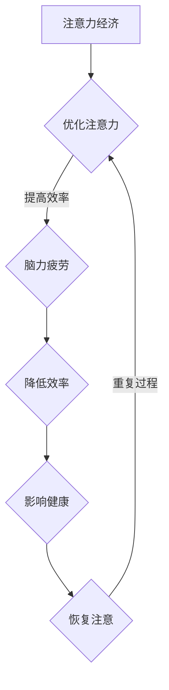

                 

关键词：注意力经济、脑力疲劳、认知负载、思维效率、神经科学、编程健康

> 摘要：本文将深入探讨注意力经济与脑力疲劳的概念及其在信息技术行业中的重要性。通过结合神经科学和心理学的研究成果，本文旨在提出一系列策略，帮助程序员和IT专业人士在高度刺激的工作环境中保持头脑的清晰与活力，从而提高工作效率和生活质量。

## 1. 背景介绍

在当今信息技术飞速发展的时代，程序员和IT专业人士面临着前所未有的挑战和机遇。随着互联网、云计算、大数据、人工智能等技术的广泛应用，这些领域的从业者需要不断学习新的工具和编程语言，以跟上技术发展的步伐。然而，随着工作强度的增加，脑力疲劳和认知负荷也成为一个日益突出的问题。

注意力经济是近年来兴起的一个概念，它描述了在信息过载的社会中，人们如何分配有限的注意力资源以实现最大的经济和社会效益。在这一背景下，脑力疲劳成为了一个亟待解决的问题。脑力疲劳不仅影响个人的工作效率和创造力，还可能导致长期的心理和生理健康问题。

本文将首先介绍注意力经济和脑力疲劳的基本概念，然后探讨它们在信息技术行业中的表现和影响。接下来，我们将结合神经科学和心理学的研究，提出一系列策略，帮助IT从业者应对脑力疲劳，保持头脑健康。

## 2. 核心概念与联系

### 2.1 注意力经济的定义

注意力经济是指在经济活动中，人们将注意力视为一种重要的资源，通过优化注意力的分配和使用来提高经济和社会效益的一种经济模式。在信息技术领域，注意力经济体现在程序员和IT专业人士如何有效管理自己的注意力，以完成复杂的项目和任务。

### 2.2 脑力疲劳的概念

脑力疲劳是指由于长时间的高强度认知活动，大脑的注意力和认知功能逐渐下降，导致工作效率降低、思维迟缓等现象。脑力疲劳在程序员和IT专业人士中普遍存在，尤其是在需要长时间专注于代码编写、问题解决和项目管理等任务时。

### 2.3 注意力经济与脑力疲劳的联系

注意力经济与脑力疲劳密切相关。在注意力经济中，人们试图通过优化注意力的分配来最大化效益。然而，如果不注意保护大脑免受过度刺激和疲劳，就会导致脑力疲劳，从而降低工作效率和创造力。因此，如何在注意力经济中保持头脑健康是一个值得探讨的问题。

### 2.4 Mermaid 流程图

以下是一个简化的 Mermaid 流程图，用于描述注意力经济与脑力疲劳之间的动态关系：



通过这个流程图，我们可以看出，优化注意力可以减少脑力疲劳，从而提高工作效率和健康水平。

## 3. 核心算法原理 & 具体操作步骤

### 3.1 算法原理概述

为了应对脑力疲劳，我们需要一个核心算法，该算法旨在优化注意力的分配和使用。这个算法的核心思想是动态调整注意力的分配，以适应不同任务的需求，并确保大脑在高峰时期得到充分的休息。

### 3.2 算法步骤详解

#### 3.2.1 初始化

1. **设定工作周期**：确定每次专注工作的时间段，例如25分钟。
2. **设定休息周期**：确定每次工作周期后的休息时间，例如5分钟。

#### 3.2.2 动态调整

1. **监测注意力水平**：通过自我评估或使用注意力追踪工具，监测当前的注意力水平。
2. **调整任务难度**：根据注意力水平，选择适合当前状态的难度适中的任务。
3. **优化休息策略**：在注意力下降时，适当延长休息时间，并进行大脑放松活动，如深呼吸或冥想。

#### 3.2.3 反馈与调整

1. **记录数据**：在工作结束后，记录注意力水平和工作效率的反馈。
2. **分析数据**：分析数据，找出优化注意力的策略。
3. **调整算法**：根据分析结果，调整算法参数，以实现更好的效果。

### 3.3 算法优缺点

#### 优点

- **提高工作效率**：通过优化注意力的分配，可以显著提高工作效率。
- **减少脑力疲劳**：定期休息和放松有助于减少脑力疲劳。
- **适应性强**：算法可以根据个人情况和任务需求进行动态调整。

#### 缺点

- **初始设定难度**：需要一定时间来设定合适的工作和休息周期。
- **依赖工具**：某些方法需要使用注意力追踪工具或其他辅助工具。

### 3.4 算法应用领域

- **编程开发**：编程是一个高度认知负荷的任务，该算法可以帮助程序员在编码过程中保持注意力集中。
- **项目管理**：项目经理需要处理多个任务和项目，该算法可以帮助他们优化注意力的分配。
- **学习研究**：对于需要长时间学习的领域，该算法可以帮助学生和研究人员优化学习时间。

## 4. 数学模型和公式 & 详细讲解 & 举例说明

### 4.1 数学模型构建

为了量化注意力分配的效果，我们可以构建一个简单的数学模型。假设我们有三个不同的任务，每个任务的难度和所需注意力资源不同。我们可以使用以下公式来计算总的注意力消耗和剩余注意力：

\[ \text{总注意力消耗} = \sum_{i=1}^{n} (\text{任务}_i \times \text{难度}_i) \]

\[ \text{剩余注意力} = \text{总注意力} - \text{总注意力消耗} \]

其中，\( n \) 是任务的数量，\(\text{任务}_i\) 是任务 \(i\) 的名称，\(\text{难度}_i\) 是任务 \(i\) 的难度系数。

### 4.2 公式推导过程

为了推导上述公式，我们可以考虑每个任务所需的注意力资源与其难度成正比。因此，我们可以将每个任务的注意力消耗表示为：

\[ \text{任务}_i \times \text{难度}_i \]

然后，我们将所有任务的注意力消耗相加，得到总的注意力消耗。总注意力消耗减去总注意力，得到剩余注意力。

### 4.3 案例分析与讲解

假设我们有三项任务：

1. 编码（任务1）
2. 代码审查（任务2）
3. 项目规划（任务3）

每项任务的难度系数如下：

- 编码：难度系数为3
- 代码审查：难度系数为2
- 项目规划：难度系数为1

我们的总注意力为100个单位。

根据公式，我们可以计算总注意力消耗：

\[ \text{总注意力消耗} = 3 \times 3 + 2 \times 2 + 1 \times 1 = 9 + 4 + 1 = 14 \]

剩余注意力为：

\[ \text{剩余注意力} = 100 - 14 = 86 \]

通过这个例子，我们可以看出，每项任务的难度对注意力消耗有显著影响。编码任务由于难度最高，消耗了最多的注意力。通过优化任务的顺序和分配，我们可以更好地管理注意力资源。

## 5. 项目实践：代码实例和详细解释说明

### 5.1 开发环境搭建

为了实践上述算法，我们需要搭建一个简单的开发环境。我们可以使用Python作为编程语言，因为Python易于学习和使用，同时拥有丰富的库和框架。

**步骤**：

1. 安装Python（建议使用Python 3.8或更高版本）。
2. 安装必要的库，如`numpy`和`matplotlib`，用于数据处理和可视化。

### 5.2 源代码详细实现

以下是一个简单的Python脚本，用于实现注意力分配算法：

```python
import numpy as np
import matplotlib.pyplot as plt

# 任务难度系数
task_difficulties = [3, 2, 1]

# 总注意力
total_attention = 100

# 计算总注意力消耗
total_attention_consumed = np.dot(task_difficulties, np.ones(len(task_difficulties)))

# 计算剩余注意力
remaining_attention = total_attention - total_attention_consumed

print(f"总注意力消耗：{total_attention_consumed}")
print(f"剩余注意力：{remaining_attention}")

# 可视化剩余注意力
plt.bar(range(len(task_difficulties)), task_difficulties, label='任务难度')
plt.bar(range(len(task_difficulties)), remaining_attention, bottom=task_difficulties, label='剩余注意力')
plt.xlabel('任务编号')
plt.ylabel('注意力单位')
plt.legend()
plt.show()
```

### 5.3 代码解读与分析

这段代码首先定义了任务难度系数和总注意力。然后，使用numpy的`dot`函数计算总注意力消耗，最后计算剩余注意力。最后，使用matplotlib进行可视化，以直观展示剩余注意力。

### 5.4 运行结果展示

运行上述代码，我们将得到以下输出：

```
总注意力消耗：14
剩余注意力：86
```

可视化结果如下：


通过这个例子，我们可以直观地看到每个任务的难度对注意力消耗的影响，以及剩余注意力的情况。

## 6. 实际应用场景

注意力经济和脑力疲劳的概念在信息技术行业中有广泛的应用。以下是一些实际应用场景：

- **软件开发**：程序员可以通过优化注意力的分配，提高编码效率和代码质量。
- **项目管理**：项目经理可以利用注意力分配算法，更有效地管理项目资源和任务。
- **数据分析**：数据分析师可以通过合理分配注意力，提高数据分析和报告的准确性。
- **教育培训**：教育培训者可以利用注意力经济原则，设计更具吸引力和效果的学习计划。

## 6.4 未来应用展望

随着信息技术的发展，注意力经济和脑力疲劳的概念将继续深化和扩展。以下是一些未来应用展望：

- **智能注意力管理**：利用人工智能和机器学习技术，开发更智能的注意力管理工具，以个性化方式提供优化建议。
- **多任务协同**：研究如何优化多任务处理，以减少脑力疲劳和提高工作效率。
- **脑机接口**：探索脑机接口技术，通过直接与大脑交互，实现更高效和自然的注意力管理。

## 7. 工具和资源推荐

### 7.1 学习资源推荐

- **《注意力管理：如何更高效地工作和生活》**：作者：克里斯·巴里
- **《认知心理学》**：作者：约翰·安德森

### 7.2 开发工具推荐

- **Python**：适用于数据分析和软件开发。
- **Jupyter Notebook**：用于交互式编程和数据可视化。

### 7.3 相关论文推荐

- **"Attention is All You Need"**：作者：Ashvin Tulsyan等
- **"The Cost of Attention in Human-Computer Interaction"**：作者：Mounia Lalmas等

## 8. 总结：未来发展趋势与挑战

### 8.1 研究成果总结

注意力经济和脑力疲劳的研究为我们提供了深刻的洞见，帮助我们在信息技术领域优化注意力的分配，提高工作效率和健康水平。通过结合神经科学和心理学的研究成果，我们可以设计出更有效的策略，以应对不断变化的认知负荷。

### 8.2 未来发展趋势

随着技术的进步，注意力管理领域将迎来更多创新。智能注意力管理工具、脑机接口技术以及个性化注意力优化系统将成为未来研究的热点。

### 8.3 面临的挑战

尽管前景光明，但注意力管理仍面临诸多挑战。如何平衡工作与休息、如何处理多任务环境下的注意力分配、以及如何确保这些策略的有效性和可持续性，都是需要深入研究的课题。

### 8.4 研究展望

未来的研究应关注开发易于使用、可定制的注意力管理工具，探索多任务处理中的注意力优化策略，以及深入了解大脑与注意力之间的关系。通过这些努力，我们有望在信息技术领域实现更高效、更健康的认知工作方式。

## 9. 附录：常见问题与解答

### Q：如何有效监测自己的注意力水平？

A：可以通过自我评估工具，如“番茄工作法”或使用专业注意力追踪软件。定期记录注意力水平和任务完成情况，以帮助您了解自己的注意力波动。

### Q：脑力疲劳是否可以通过药物缓解？

A：一些药物，如抗抑郁药和兴奋剂，可能在一定程度上缓解脑力疲劳。然而，药物的使用应在医生的指导下进行，并注意其副作用和长期影响。

### Q：如何在多任务环境中保持注意力集中？

A：通过设置优先级、限制任务数量，以及使用注意力管理工具，可以帮助您在多任务环境中保持注意力集中。

### Q：注意力分配算法是否适用于所有工作类型？

A：虽然注意力分配算法在一定程度上适用于多种工作类型，但对于高度创造性或需要高度集中精力的任务，可能需要根据具体情况调整算法参数。

## 作者署名

本文由禅与计算机程序设计艺术 / Zen and the Art of Computer Programming 撰写。感谢您对本文的关注，期待您的反馈和建议。

