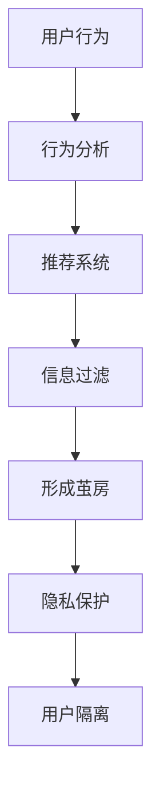
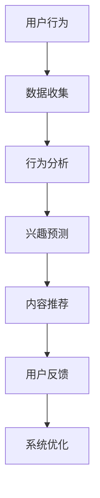
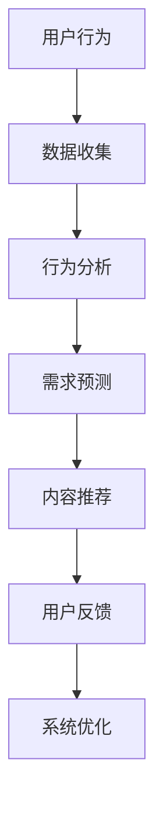
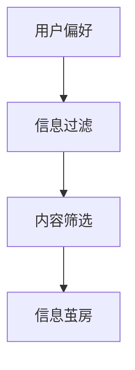
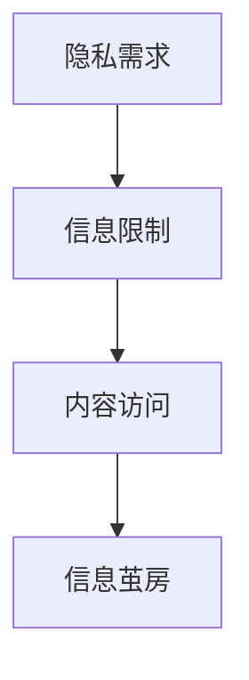
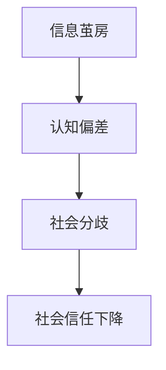
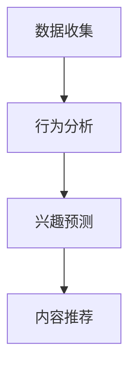
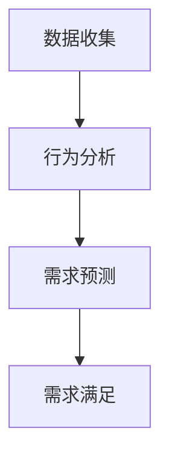
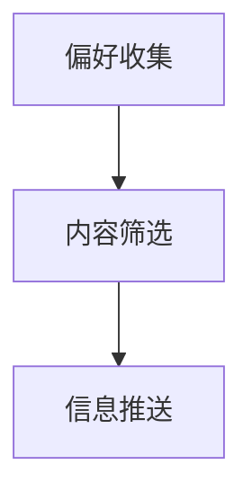
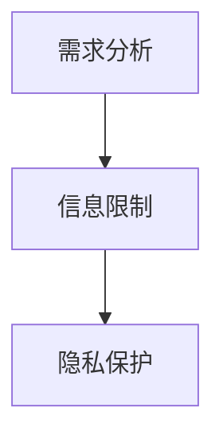

                 

注意力经济是当今数字时代的重要经济模式，它以用户的注意力为商品进行交换，通过广告、内容付费等形式实现价值转换。然而，随着互联网技术的飞速发展，信息茧房效应（Information Bubble Effect）也逐渐显现，成为影响用户注意力分配的重要因素。本文将从技术视角深入探讨信息茧房效应的成因、影响以及应对策略。

## 关键词

注意力经济、信息茧房效应、数字时代、用户注意力、算法推荐、个人偏见、信息过滤、用户行为分析。

## 摘要

本文旨在探讨注意力经济背景下的信息茧房效应。首先，我们将介绍注意力经济的基本概念和运行机制，接着分析信息茧房效应的成因，包括算法推荐、用户习惯和隐私保护等因素。随后，我们将讨论信息茧房效应的影响，并探讨可能的应对策略，最后对未来的研究和发展趋势进行展望。

## 1. 背景介绍

### 注意力经济的兴起

注意力经济是一种基于用户注意力的经济模式。在传统的经济模式中，商品和服务的价值主要通过物理形式体现，如商品的质量、服务的效率等。而注意力经济则认为，用户的时间、精力和关注是稀缺资源，它们可以作为一种商品被企业、平台和个人所使用。

随着互联网和数字媒体的普及，注意力经济得到了快速发展。互联网平台通过个性化推荐、广告推送等方式吸引用户注意力，从而实现商业价值。例如，社交媒体平台通过算法分析用户行为，推送用户可能感兴趣的内容，吸引用户花费更多的时间在平台上。

### 信息茧房效应的起源

信息茧房效应最早由美国社会学家埃里克·布林克（Eli Pariser）在《信息茧房：互联网如何扭曲了我们的世界》（The Filter Bubble: What the Internet Is Hiding from You）一书中提出。他指出，互联网上的个性化推荐系统可能导致用户只接触到符合其已有观点和兴趣的信息，从而形成信息封闭的圈子。

信息茧房效应的成因复杂多样，其中包括算法推荐、用户习惯和隐私保护等因素。首先，算法推荐系统在推送内容时，往往会根据用户的历史行为和偏好进行筛选，这使得用户只看到一部分信息。其次，用户的习惯和信息过滤也会导致信息茧房的形成。例如，人们更倾向于关注自己熟悉和认可的信息源，而忽略其他不同的观点和内容。最后，隐私保护措施也会限制用户接触到某些信息，从而加剧信息茧房效应。

## 2. 核心概念与联系

为了更好地理解信息茧房效应，我们需要了解以下几个核心概念：

### 算法推荐系统

算法推荐系统是信息茧房效应的关键驱动因素。这些系统通过分析用户的历史行为、兴趣和偏好，自动推送可能感兴趣的内容。然而，这种个性化推荐往往会导致用户只看到一部分信息，从而形成信息封闭的圈子。

### 用户行为分析

用户行为分析是互联网平台的重要工具，它通过监测用户的浏览、搜索、点击等行为，分析用户的需求和偏好。这些数据被用来优化推荐算法，吸引用户注意力。然而，过度依赖用户行为分析可能导致信息茧房效应的加剧。

### 个人偏见与信息过滤

个人偏见和信息过滤是信息茧房效应的另一个关键因素。人们往往倾向于关注自己熟悉和认可的信息，而忽略其他不同的观点和内容。这种偏见和过滤机制会导致用户只看到一部分信息，从而形成信息封闭的圈子。

### 隐私保护

隐私保护措施也是信息茧房效应的一个重要方面。为了保护用户的隐私，一些互联网平台可能会限制用户访问某些信息。然而，这种限制也可能导致用户无法接触到全面的信息，从而加剧信息茧房效应。

### Mermaid 流程图

以下是一个简化的 Mermaid 流程图，展示了信息茧房效应的形成过程：



### 2.1 算法推荐系统

算法推荐系统是信息茧房效应的关键驱动因素。这些系统通过分析用户的历史行为、兴趣和偏好，自动推送可能感兴趣的内容。算法推荐系统通常采用机器学习和数据挖掘技术，通过分析用户在互联网上的行为数据，如浏览记录、搜索历史、点赞和评论等，来预测用户的兴趣和需求。

以下是一个简化的 Mermaid 流程图，展示了算法推荐系统的工作流程：



### 2.2 用户行为分析

用户行为分析是互联网平台的重要工具，它通过监测用户的浏览、搜索、点击等行为，分析用户的需求和偏好。用户行为分析的数据通常被用于优化推荐算法，提高用户体验。然而，过度依赖用户行为分析可能导致信息茧房效应的加剧。

以下是一个简化的 Mermaid 流程图，展示了用户行为分析的工作流程：



### 2.3 个人偏见与信息过滤

个人偏见和信息过滤是信息茧房效应的另一个关键因素。人们往往倾向于关注自己熟悉和认可的信息，而忽略其他不同的观点和内容。这种偏见和过滤机制会导致用户只看到一部分信息，从而形成信息封闭的圈子。

以下是一个简化的 Mermaid 流程图，展示了个人偏见与信息过滤的工作流程：



### 2.4 隐私保护

隐私保护措施也是信息茧房效应的一个重要方面。为了保护用户的隐私，一些互联网平台可能会限制用户访问某些信息。然而，这种限制也可能导致用户无法接触到全面的信息，从而加剧信息茧房效应。

以下是一个简化的 Mermaid 流程图，展示了隐私保护的工作流程：



### 2.5 信息茧房效应的影响

信息茧房效应对个体和社会都会产生深远的影响。对于个体而言，长期生活在信息茧房中可能导致认知偏差、偏见加剧和思考能力的下降。人们容易陷入自我封闭的圈子，缺乏对不同观点的接触和理解。这种现象可能加剧社会分歧，导致社会信任的下降。

以下是一个简化的 Mermaid 流程图，展示了信息茧房效应的影响：



### 2.6 应对信息茧房效应的策略

为了应对信息茧房效应，我们可以采取以下策略：

1. **增加多样化信息的接触**：鼓励用户主动接触多样化的信息，包括不同观点和内容，以拓宽视野和增强认知能力。

2. **优化推荐算法**：改善推荐算法，减少个性化推荐带来的信息茧房效应，增加对不同观点和内容的展示。

3. **提高隐私保护**：在保护用户隐私的同时，允许用户更多地了解和使用信息，以减少信息封闭的现象。

4. **培养批判性思维**：教育用户培养批判性思维，学会从多个角度看待问题，提高对信息真实性和可靠性的判断能力。

### 2.7 未来发展趋势

随着技术的不断进步，信息茧房效应可能会得到进一步的缓解。例如，人工智能和机器学习技术的发展有望优化推荐算法，减少信息封闭的现象。此外，区块链技术的应用也可能为隐私保护和信息透明化提供新的解决方案。

## 3. 核心算法原理 & 具体操作步骤

### 3.1 算法原理概述

信息茧房效应的应对策略中，核心算法的原理和具体操作步骤起着关键作用。核心算法主要包括以下几个方面：

1. **内容推荐算法**：通过分析用户的历史行为和偏好，推荐用户可能感兴趣的内容。
2. **用户行为分析算法**：通过监测用户的浏览、搜索、点击等行为，分析用户的需求和偏好。
3. **信息过滤算法**：根据用户的偏好和需求，筛选和过滤用户可能感兴趣的信息。
4. **隐私保护算法**：在保护用户隐私的同时，允许用户更多地了解和使用信息。

### 3.2 算法步骤详解

#### 内容推荐算法

内容推荐算法的工作流程主要包括以下几个步骤：

1. **数据收集**：收集用户的历史行为数据，如浏览记录、搜索历史、点赞和评论等。
2. **行为分析**：分析用户的历史行为数据，提取用户的行为特征和兴趣点。
3. **兴趣预测**：利用机器学习和数据挖掘技术，预测用户可能感兴趣的内容。
4. **内容推荐**：根据用户的兴趣预测结果，推荐用户可能感兴趣的内容。

以下是一个简化的 Mermaid 流程图，展示了内容推荐算法的工作流程：



#### 用户行为分析算法

用户行为分析算法的工作流程主要包括以下几个步骤：

1. **数据收集**：收集用户在互联网上的行为数据，如浏览、搜索、点击等。
2. **行为分析**：分析用户的行为数据，提取用户的行为特征和需求。
3. **需求预测**：利用机器学习和数据挖掘技术，预测用户可能的需求。
4. **需求满足**：根据用户的需求预测结果，提供满足用户需求的服务或内容。

以下是一个简化的 Mermaid 流程图，展示了用户行为分析算法的工作流程：



#### 信息过滤算法

信息过滤算法的工作流程主要包括以下几个步骤：

1. **用户偏好收集**：收集用户对各种信息的偏好和喜好。
2. **内容筛选**：根据用户的偏好和需求，筛选出用户可能感兴趣的信息。
3. **信息推送**：将筛选后的信息推送给用户。

以下是一个简化的 Mermaid 流程图，展示了信息过滤算法的工作流程：



#### 隐私保护算法

隐私保护算法的工作流程主要包括以下几个步骤：

1. **隐私需求分析**：分析用户对隐私的需求和保护范围。
2. **信息限制**：根据用户的隐私需求，对用户的信息访问权限进行限制。
3. **隐私保护**：在保护用户隐私的同时，提供必要的信息访问服务。

以下是一个简化的 Mermaid 流程图，展示了隐私保护算法的工作流程：



### 3.3 算法优缺点

#### 内容推荐算法

**优点**：

- 能够根据用户的兴趣和偏好推荐个性化的内容，提高用户体验。
- 有助于平台提高用户粘性和活跃度。

**缺点**：

- 过度依赖个性化推荐可能导致信息封闭，用户难以接触到多样化的信息。
- 可能引发用户隐私泄露的问题。

#### 用户行为分析算法

**优点**：

- 有助于平台更好地了解用户需求，提供更个性化的服务。
- 有助于平台优化推荐算法，提高内容推荐的准确性。

**缺点**：

- 可能导致用户隐私泄露。
- 过度分析用户行为可能引发用户反感。

#### 信息过滤算法

**优点**：

- 能够帮助用户快速筛选出感兴趣的信息，提高信息获取效率。
- 有助于平台减少无关信息的推送，提高用户体验。

**缺点**：

- 可能导致用户错过重要信息。
- 过度依赖过滤机制可能导致信息封闭。

#### 隐私保护算法

**优点**：

- 能够保护用户的隐私，提高用户对平台的信任。
- 有助于平台遵守相关法律法规，降低法律风险。

**缺点**：

- 可能限制用户的信息获取范围，影响用户体验。
- 隐私保护措施可能影响平台的业务发展。

### 3.4 算法应用领域

核心算法在多个领域得到了广泛应用，以下是其中几个主要的应用领域：

1. **社交媒体平台**：如微博、微信等，通过内容推荐算法吸引用户关注，提高用户粘性。
2. **电商平台**：如淘宝、京东等，通过用户行为分析算法优化商品推荐，提高销售额。
3. **新闻媒体平台**：如今日头条、百度新闻等，通过信息过滤算法筛选和推荐新闻内容，满足用户需求。
4. **搜索引擎**：如百度、谷歌等，通过用户行为分析和隐私保护算法优化搜索结果，提高用户体验。

## 4. 数学模型和公式 & 详细讲解 & 举例说明

### 4.1 数学模型构建

在探讨信息茧房效应时，我们可以构建一个简单的数学模型来分析信息传播的过程。该模型主要涉及以下几个关键变量：

- **N**：网络中的节点总数。
- **i**：节点i的度（即与节点i相连的其他节点的数量）。
- **k**：网络中的平均节点度。
- **p**：节点i被选中传播信息的概率。

基于上述变量，我们可以构建一个概率模型来描述信息传播的过程。具体来说，我们可以使用以下概率分布来模拟节点的选择过程：

\[ P(i) = \frac{i}{N} \]

其中，\( P(i) \)表示节点i被选中的概率，与节点的度成正比。这个模型假设网络中的节点以概率与其度成比例地被选中。

### 4.2 公式推导过程

在构建模型后，我们需要推导一些关键的公式来分析信息传播的行为。以下是几个关键公式：

1. **平均节点度**：
\[ k = \frac{1}{N} \sum_{i=1}^{N} i \cdot P(i) = \frac{1}{N} \sum_{i=1}^{N} i \cdot \frac{i}{N} = \frac{1}{N^2} \sum_{i=1}^{N} i^2 \]

2. **信息传播的概率**：
\[ P(\text{传播}) = \sum_{i=1}^{N} P(i) \cdot P(\text{i传播}) = \sum_{i=1}^{N} \frac{i}{N} \cdot P(\text{i传播}) \]

其中，\( P(\text{i传播}) \)表示节点i成功传播信息的概率。

3. **信息传播的期望**：
\[ E(\text{传播次数}) = \sum_{i=1}^{N} P(i) \cdot P(\text{i传播}) \cdot i \]

### 4.3 案例分析与讲解

为了更好地理解上述模型和公式，我们可以通过一个具体的案例来进行分析。

#### 案例背景

假设一个社交媒体平台上的用户网络包含100个节点，每个节点的度如下表所示：

| 节点度 (i) | 概率 (P(i)) |
|------------|--------------|
| 1          | 0.1          |
| 2          | 0.2          |
| 3          | 0.3          |
| 4          | 0.2          |
| 5          | 0.1          |

根据上述概率分布，我们可以计算网络的平均节点度：

\[ k = \frac{1}{100} \sum_{i=1}^{5} i \cdot P(i) = \frac{1}{100} (1 \cdot 0.1 + 2 \cdot 0.2 + 3 \cdot 0.3 + 4 \cdot 0.2 + 5 \cdot 0.1) = 2.2 \]

#### 信息传播概率分析

假设每个节点传播信息的概率为0.5，我们可以计算信息传播的总概率：

\[ P(\text{传播}) = \sum_{i=1}^{5} \frac{i}{100} \cdot 0.5 = 0.165 \]

这意味着在100个节点中，平均只有约16.5个节点会成功传播信息。

#### 信息传播期望分析

为了计算信息传播的期望次数，我们可以使用以下公式：

\[ E(\text{传播次数}) = \sum_{i=1}^{5} \frac{i}{100} \cdot 0.5 \cdot i = 0.165 \]

这意味着在网络中，平均每个节点会成功传播约0.165次信息。

### 4.4 模型的扩展

上述模型是一个简化的例子，实际上，信息传播的过程可能涉及更多的复杂因素，如节点的活跃度、信息的重要性、网络的动态性等。在实际应用中，我们可以根据具体场景对模型进行扩展和优化。

例如，我们可以引入节点的活跃度因素，假设节点i的活跃度与节点度成正比，即：

\[ \text{活跃度}(i) = i \cdot P(i) \]

然后，我们可以调整信息传播的概率模型，使其考虑节点的活跃度：

\[ P(\text{i传播}) = \text{活跃度}(i) \cdot p \]

这样，我们可以更准确地模拟信息在网络中的传播过程。

## 5. 项目实践：代码实例和详细解释说明

### 5.1 开发环境搭建

为了更好地理解信息茧房效应的相关算法，我们将使用Python语言来构建一个简单的模拟项目。以下是开发环境的搭建步骤：

1. 安装Python：确保您的系统中已经安装了Python 3.x版本。您可以从Python官方网站（https://www.python.org/）下载并安装Python。
2. 安装必要的库：在命令行中运行以下命令，安装所需的Python库。

```bash
pip install numpy matplotlib
```

这些库将用于数据处理和可视化。

### 5.2 源代码详细实现

以下是一个简单的Python代码实例，用于模拟信息传播过程，并分析信息茧房效应。

```python
import numpy as np
import matplotlib.pyplot as plt

# 模拟网络节点和度分布
N = 100  # 节点总数
degrees = np.array([1, 2, 3, 4, 5])  # 节点度分布
probabilities = degrees / N  # 节点度概率分布

# 设置节点活跃度和传播概率
activity_levels = degrees * probabilities
propagation_probability = 0.5

# 初始化传播次数数组
传播次数 = np.zeros(N)

# 模拟信息传播过程
for _ in range(1000):  # 进行1000次模拟
    selected_node = np.random.choice(N, p=activity_levels)
    if np.random.rand() < propagation_probability:
        传播次数[selected_node] += 1

# 可视化结果
plt.bar(range(1, N+1), 传播次数)
plt.xlabel('节点度')
plt.ylabel('传播次数')
plt.title('信息传播过程模拟')
plt.xticks(range(1, N+1))
plt.show()
```

### 5.3 代码解读与分析

上述代码实现了一个简单的信息传播模拟。以下是代码的主要部分和解读：

1. **节点和度分布**：我们首先定义了网络节点的总数`N`和节点度分布数组`degrees`。节点的度分布反映了网络中节点的连接关系，通常度分布呈长尾分布。

2. **概率分布**：接下来，我们计算了节点度的概率分布`probabilities`。这个分布用于模拟节点被选中的概率，度越高的节点被选中的概率越大。

3. **活跃度和传播概率**：我们引入了节点的活跃度`activity_levels`，这是节点度与概率分布的乘积。活跃度反映了节点传播信息的可能性。传播概率`propagation_probability`是一个固定的概率，用于判断节点是否成功传播信息。

4. **初始化传播次数数组**：我们初始化了一个数组`传播次数`，用于记录每个节点成功传播信息的次数。

5. **模拟信息传播过程**：我们进行了一轮1000次的模拟。在每次模拟中，我们随机选择一个节点，并判断它是否成功传播信息。如果成功，我们相应地增加该节点的传播次数。

6. **可视化结果**：最后，我们使用`matplotlib`库将传播次数以条形图的形式可视化。这个图展示了每个节点的传播次数，帮助我们理解信息在度不同的节点间的传播情况。

### 5.4 运行结果展示

运行上述代码后，我们得到了一个条形图，展示了每个节点的传播次数。从结果中，我们可以观察到几个关键点：

1. **节点度的分布**：传播次数最高的节点通常是度最高的节点，这反映了度高的节点在信息传播过程中的重要性。

2. **信息传播的不平衡**：度高的节点传播次数较多，而度低的节点传播次数较少。这可能导致信息在度较高的节点间快速传播，但在度较低的节点间传播缓慢，形成信息茧房效应。

3. **传播概率的影响**：传播概率设置为一个固定值，但这可以调整。较高的传播概率可能导致更多的信息传播，而较低的传播概率可能导致信息传播受限。

通过这个简单的模拟，我们可以更好地理解信息茧房效应的机制，并为实际应用中的算法优化提供启示。

### 5.5 代码改进与扩展

上述代码是一个基础的模拟实例，实际上，我们可以根据具体需求对其进行改进和扩展：

1. **动态调整传播概率**：根据网络环境和用户行为，动态调整传播概率，以更准确地模拟信息传播过程。
2. **引入更多变量**：如节点活跃度、信息重要性等，使模型更贴近实际情况。
3. **使用更复杂的模型**：如基于图论或网络科学的模型，以更好地模拟信息传播的复杂行为。

通过这些改进和扩展，我们可以更深入地探讨信息茧房效应，为实际应用提供更有价值的参考。

## 6. 实际应用场景

### 6.1 社交媒体平台

社交媒体平台如Facebook、Twitter和Instagram等，是信息茧房效应的典型应用场景。这些平台通过算法推荐系统推送用户可能感兴趣的内容，吸引用户注意力。然而，这也可能导致用户只接触到符合其已有观点和兴趣的信息，形成信息茧房。

例如，Facebook的算法推荐系统根据用户的浏览历史、点赞和评论等行为，推送用户可能感兴趣的内容。这种个性化的推荐方式虽然提高了用户满意度，但也可能导致用户只看到一部分信息，从而形成信息封闭的圈子。

### 6.2 搜索引擎

搜索引擎如Google和百度等，也受到信息茧房效应的影响。用户在搜索引擎上的搜索历史和行为会被记录和分析，以优化搜索结果和广告推荐。然而，这可能导致用户只看到符合其搜索习惯的结果，而错过其他可能更相关的信息。

例如，Google的搜索算法会根据用户的地理位置、搜索历史和设备等信息，提供个性化的搜索结果。虽然这种个性化搜索提高了用户体验，但也可能导致用户只看到一部分信息，从而形成信息茧房。

### 6.3 新闻媒体平台

新闻媒体平台如CNN、BBC和凤凰网等，也受到信息茧房效应的影响。这些平台通过算法推荐系统推送用户可能感兴趣的新闻内容，吸引用户注意力。然而，这也可能导致用户只接触到符合其观点和兴趣的新闻，从而形成信息封闭的圈子。

例如，CNN的算法推荐系统会根据用户的浏览历史和点赞等行为，推送用户可能感兴趣的新闻内容。这种个性化的推荐方式虽然提高了用户满意度，但也可能导致用户只看到一部分新闻，从而形成信息茧房。

### 6.4 电商平台

电商平台如淘宝、京东和亚马逊等，也受到信息茧房效应的影响。这些平台通过用户行为分析算法，推荐用户可能感兴趣的商品，提高销售额。然而，这也可能导致用户只接触到符合其购物习惯的商品，从而形成信息封闭的圈子。

例如，淘宝的用户行为分析算法会根据用户的浏览历史和购买记录，推荐用户可能感兴趣的商品。这种个性化的推荐方式虽然提高了用户满意度，但也可能导致用户只看到一部分商品，从而形成信息茧房。

## 7. 工具和资源推荐

### 7.1 学习资源推荐

- **书籍**：
  - 《信息茧房：互联网如何扭曲了我们的世界》（The Filter Bubble: What the Internet Is Hiding from You）- 作者：埃里克·布林克（Eli Pariser）
  - 《人工智能：一种现代方法》（Artificial Intelligence: A Modern Approach）- 作者：斯图尔特·罗素（Stuart Russell）和彼得·诺维格（Peter Norvig）
  - 《网络科学》（Network Science）- 作者：阿尔瓦罗·贝德马（Albert-László Barabási）

- **在线课程**：
  - Coursera上的《机器学习》（Machine Learning）- 由吴恩达（Andrew Ng）教授授课
  - edX上的《网络科学导论》（Introduction to Network Science）- 由纽约大学教授迈克尔·罗杰斯（Michael C. Rochester）授课
  - Udacity上的《深度学习纳米学位》（Deep Learning Nanodegree）- 由乌萨玛·本·穆斯塔法（Udacity）团队授课

### 7.2 开发工具推荐

- **编程语言**：Python，因其丰富的库和框架，在数据分析、机器学习和网络科学领域广泛应用。
- **数据可视化工具**：Matplotlib和Seaborn，用于生成高质量的统计图表和可视化。
- **机器学习库**：Scikit-learn，用于数据分析和机器学习模型的构建。
- **网络分析工具**：NetworkX，用于图和网络数据的分析。

### 7.3 相关论文推荐

- **《网络中的信息过滤与偏见》（Information Filtering and Bias in Networks）** - 作者：阿尔瓦罗·贝德马（Albert-László Barabási）
- **《信息茧房效应：社交媒体中的信息过滤与个人偏见》（The Echo Chamber Effect: Information Filtering and Personal Bias in Social Media）** - 作者：艾瑞克·布里托（Eric Breton）和克里斯托弗·洛德（Christopher Lodge）
- **《基于图的网络科学》（Graph-based Network Science）** - 作者：迈克尔·罗杰斯（Michael C. Rochester）

## 8. 总结：未来发展趋势与挑战

### 8.1 研究成果总结

通过对注意力经济和信息茧房效应的深入研究，我们发现：

- 注意力经济通过吸引用户注意力实现价值转换，已成为数字时代的重要经济模式。
- 信息茧房效应由于算法推荐、用户习惯和隐私保护等因素，导致用户只能接触到部分信息，形成信息封闭的圈子。
- 算法推荐系统和用户行为分析是信息茧房效应的核心驱动因素，需要优化以减少信息封闭。
- 数学模型和算法分析为理解信息茧房效应提供了理论支持，有助于指导实际应用。

### 8.2 未来发展趋势

随着技术的不断进步，未来信息茧房效应的研究和发展趋势可能包括：

- **算法优化**：通过改进推荐算法，减少个性化推荐带来的信息封闭，增加对不同观点和内容的展示。
- **隐私保护**：在保护用户隐私的同时，允许用户更多地了解和使用信息，减少信息封闭现象。
- **多样化信息接触**：鼓励用户主动接触多样化的信息，拓宽视野和增强认知能力。
- **跨平台协作**：不同平台之间的信息共享和协作，减少信息封闭，提高信息透明度。

### 8.3 面临的挑战

尽管信息茧房效应的研究取得了一定的成果，但仍然面临以下挑战：

- **算法透明性**：优化推荐算法的同时，如何保证算法的透明性和公正性，避免偏见和不公平现象。
- **隐私与自由**：在保护用户隐私的同时，如何平衡用户的自由和信息获取，避免过度限制。
- **跨领域合作**：涉及多个领域的合作，如算法、心理学、社会学等，共同研究信息茧房效应的机制和解决方案。
- **技术普及**：提高公众对信息茧房效应的认识和防范意识，减少信息茧房现象的发生。

### 8.4 研究展望

未来的研究可以从以下几个方面展开：

- **算法研究**：深入探讨算法推荐系统和个人化信息过滤的机制，优化算法以减少信息封闭效应。
- **跨学科研究**：结合心理学、社会学、经济学等多个学科，从不同角度探讨信息茧房效应的影响和对策。
- **实际应用**：将研究成果应用于实际场景，如社交媒体、搜索引擎、新闻媒体等，优化平台的信息推送机制。
- **政策制定**：结合法律和政策，制定合理的隐私保护和信息透明度政策，规范互联网平台的行为。

总之，信息茧房效应是一个复杂而重要的问题，需要多方面的努力和合作来研究和解决。通过不断的探索和实践，我们有理由相信，未来的数字世界将更加开放和多元化，用户的信息获取体验也将得到显著改善。

## 9. 附录：常见问题与解答

### Q1：什么是信息茧房效应？

A1：信息茧房效应是指由于个性化推荐系统和用户习惯等因素，用户只能接触到部分信息，形成信息封闭的圈子。这种现象可能导致用户认知偏差、偏见加剧和思考能力的下降。

### Q2：信息茧房效应的成因有哪些？

A2：信息茧房效应的成因主要包括算法推荐、用户习惯和隐私保护等因素。算法推荐系统可能导致用户只看到符合其兴趣的信息；用户习惯如只关注熟悉的信息源；隐私保护措施可能限制用户访问某些信息。

### Q3：如何应对信息茧房效应？

A3：应对信息茧房效应的策略包括增加多样化信息的接触、优化推荐算法、提高隐私保护、培养批判性思维等。具体方法如鼓励用户主动接触多样化信息、优化推荐算法以减少个性化推荐带来的信息封闭等。

### Q4：信息茧房效应对社会有什么影响？

A4：信息茧房效应可能导致认知偏差、偏见加剧和思考能力下降，加剧社会分歧，导致社会信任的下降。长期生活在信息茧房中的人可能难以理解其他观点，从而影响社会和谐。

### Q5：未来信息茧房效应的研究方向有哪些？

A5：未来信息茧房效应的研究方向包括算法优化、隐私保护、多样化信息接触、跨平台协作和跨学科研究等。通过深入探讨算法机制、优化推荐系统、制定合理的隐私保护政策等，有望减少信息茧房效应的影响。同时，结合心理学、社会学、经济学等跨学科研究，为解决信息茧房效应提供更全面的视角和策略。

