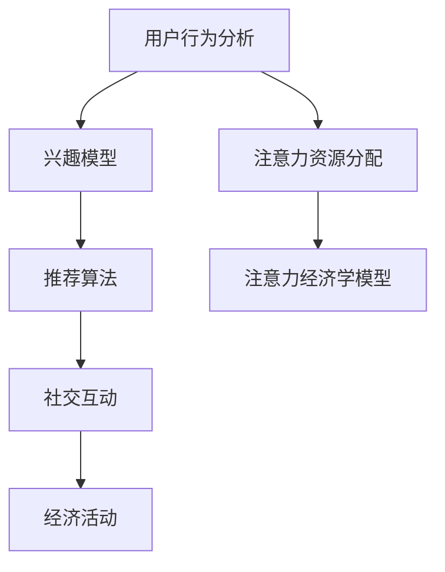

                 

关键词：注意力经济、元宇宙、资源分配、算法原理、数学模型、代码实例、实际应用场景、未来展望

> 摘要：随着元宇宙的兴起，注意力资源成为一种新的稀缺资源。本文探讨了注意力经济学的概念、核心原理以及如何在元宇宙中进行有效的注意力资源分配。通过分析注意力资源的数学模型、算法原理，结合实际应用场景，探讨了未来发展趋势与挑战，为元宇宙的建设提供了理论依据和实践指导。

## 1. 背景介绍

随着互联网、人工智能和虚拟现实技术的快速发展，元宇宙（Metaverse）逐渐成为一个热门话题。元宇宙是一个由数字世界构成的虚拟空间，用户可以在这个虚拟空间中实现各种交互和体验。在元宇宙中，用户的注意力资源变得尤为重要。用户的注意力是有限的，如何有效地分配和利用这些注意力资源，成为元宇宙发展的关键问题。

注意力经济学（Attention Economics）是研究如何在资源有限的情况下，通过优化注意力的分配来提高效率和价值的一门新兴学科。在元宇宙中，注意力经济学具有重要意义，因为它涉及到用户在数字世界中的行为、体验以及经济活动。本文将探讨注意力经济学在元宇宙中的应用，分析其核心概念、原理和算法，并结合实际应用场景，探讨未来发展趋势与挑战。

## 2. 核心概念与联系

### 2.1 注意力资源

注意力资源是指用户在数字世界中的注意力分配，包括用户对信息的关注、兴趣、互动等。在元宇宙中，注意力资源成为了一种新的稀缺资源，因为用户在现实世界和虚拟世界之间的注意力分配是有限的。

### 2.2 注意力分配机制

注意力分配机制是指如何在元宇宙中合理地分配用户的注意力资源。这涉及到用户行为分析、兴趣推荐、社交互动等多种因素。

### 2.3 注意力经济学模型

注意力经济学模型是描述注意力资源在元宇宙中分配、优化和利用的数学模型。该模型包括用户行为分析、兴趣模型、推荐算法、社交网络等组成部分。

### 2.4 注意力经济学与元宇宙的联系

注意力经济学与元宇宙的联系体现在以下几个方面：

1. **用户行为分析**：通过分析用户在元宇宙中的行为，了解用户对各种信息和服务的关注程度，从而优化注意力资源的分配。

2. **兴趣推荐**：基于用户兴趣，为用户提供个性化的内容推荐，提高用户在元宇宙中的沉浸感和参与度。

3. **社交互动**：通过社交网络，促进用户之间的互动，扩大注意力资源的传播范围。

4. **经济活动**：在元宇宙中，注意力资源可以转化为经济价值，例如虚拟货币、数字商品等。

### 2.5 Mermaid 流程图



## 3. 核心算法原理 & 具体操作步骤

### 3.1 算法原理概述

注意力经济学算法的核心是优化注意力资源的分配，以实现用户价值最大化。该算法主要基于以下几个原理：

1. **用户行为分析**：通过分析用户在元宇宙中的行为数据，了解用户的兴趣和需求。

2. **兴趣模型**：构建用户兴趣模型，为用户提供个性化推荐。

3. **推荐算法**：采用推荐算法，为用户提供感兴趣的内容和服务。

4. **社交互动**：通过社交网络，促进用户之间的互动，扩大注意力资源的传播范围。

### 3.2 算法步骤详解

1. **用户行为分析**：
   - 收集用户在元宇宙中的行为数据，如浏览记录、互动记录、点赞评论等。
   - 对行为数据进行预处理，如去重、归一化等。

2. **兴趣模型构建**：
   - 基于用户行为数据，使用机器学习算法（如协同过滤、聚类等）构建用户兴趣模型。
   - 对用户兴趣进行打分，权重分配。

3. **推荐算法**：
   - 根据用户兴趣模型，为用户提供个性化推荐。
   - 采用基于内容的推荐、协同过滤、混合推荐等方法。

4. **社交互动**：
   - 通过社交网络，促进用户之间的互动。
   - 分析社交网络中的影响力，优化注意力资源的传播。

5. **注意力资源分配**：
   - 根据用户兴趣和推荐结果，优化注意力资源的分配。
   - 实现用户价值最大化。

### 3.3 算法优缺点

**优点**：

1. **个性化推荐**：基于用户兴趣，为用户提供个性化的推荐，提高用户满意度。
2. **优化注意力资源分配**：通过优化注意力资源的分配，实现用户价值最大化。
3. **社交互动**：促进用户之间的互动，扩大注意力资源的传播范围。

**缺点**：

1. **数据依赖性**：算法性能依赖于用户行为数据的质量和数量。
2. **算法复杂度**：推荐算法和社交互动算法的复杂度较高，对计算资源要求较高。

### 3.4 算法应用领域

注意力经济学算法在元宇宙中具有广泛的应用领域，包括：

1. **内容推荐**：为用户提供个性化的内容推荐，提高用户满意度。
2. **社交互动**：通过社交网络，促进用户之间的互动，扩大注意力资源的传播范围。
3. **经济活动**：在元宇宙中，注意力资源可以转化为经济价值，例如虚拟货币、数字商品等。

## 4. 数学模型和公式 & 详细讲解 & 举例说明

### 4.1 数学模型构建

注意力经济学的数学模型主要包括用户兴趣模型、推荐算法模型和注意力资源分配模型。

1. **用户兴趣模型**：

   用户兴趣模型可以通过以下公式表示：

   $$I(u, i) = \frac{1}{|R(u)|} \sum_{r \in R(u)} w(r) \cdot \exp(-\alpha \cdot d(u, r))$$

   其中，$I(u, i)$ 表示用户 $u$ 对项目 $i$ 的兴趣度，$R(u)$ 表示用户 $u$ 的推荐列表，$w(r)$ 表示项目 $r$ 的权重，$d(u, r)$ 表示用户 $u$ 和项目 $r$ 之间的距离。

2. **推荐算法模型**：

   基于内容的推荐算法可以通过以下公式表示：

   $$R(u) = \{i | \exists j \in I(u), \text{such that} \; c(i) \approx c(j)\}$$

   其中，$R(u)$ 表示用户 $u$ 的推荐列表，$c(i)$ 表示项目 $i$ 的内容特征。

3. **注意力资源分配模型**：

   注意力资源分配可以通过以下公式表示：

   $$A(u, i) = \frac{I(u, i)}{\sum_{j \in I(u)} I(u, j)}$$

   其中，$A(u, i)$ 表示用户 $u$ 在项目 $i$ 上的注意力分配比例。

### 4.2 公式推导过程

1. **用户兴趣模型推导**：

   用户兴趣模型的推导基于用户行为数据，通过分析用户与项目之间的相关性，得到用户对项目的兴趣度。

2. **推荐算法模型推导**：

   基于内容的推荐算法推导基于项目内容特征，通过计算项目之间的相似度，得到用户的推荐列表。

3. **注意力资源分配模型推导**：

   注意力资源分配模型的推导基于用户兴趣模型和推荐算法模型，通过计算用户对各个项目的兴趣度，实现注意力资源的优化分配。

### 4.3 案例分析与讲解

假设有一个元宇宙平台，用户 $u$ 在平台上浏览了多个项目，包括文章、视频、游戏等。通过分析用户 $u$ 的行为数据，得到用户对各个项目的兴趣度如下：

| 项目 | 兴趣度 |
| ---- | ---- |
| 文章1 | 0.6 |
| 视频1 | 0.3 |
| 游戏1 | 0.1 |

根据用户兴趣模型，可以计算出用户 $u$ 在各个项目上的注意力分配比例：

$$A(u, 文章1) = \frac{0.6}{0.6 + 0.3 + 0.1} = 0.6$$

$$A(u, 视频1) = \frac{0.3}{0.6 + 0.3 + 0.1} = 0.3$$

$$A(u, 游戏1) = \frac{0.1}{0.6 + 0.3 + 0.1} = 0.1$$

根据注意力资源分配模型，用户 $u$ 在文章1上的注意力分配比例为 0.6，在视频1上的注意力分配比例为 0.3，在游戏1上的注意力分配比例为 0.1。这样，用户 $u$ 就可以更有效地利用注意力资源，提高在元宇宙中的体验。

## 5. 项目实践：代码实例和详细解释说明

### 5.1 开发环境搭建

在本文的代码实例中，我们将使用 Python 作为编程语言，结合 NumPy 和 Scikit-learn 等库进行实现。以下是搭建开发环境的基本步骤：

1. 安装 Python 3.8 及以上版本。
2. 安装必要的库：`pip install numpy scikit-learn matplotlib`。

### 5.2 源代码详细实现

以下是一个简单的用户兴趣模型和注意力资源分配的 Python 实现示例：

```python
import numpy as np
from sklearn.metrics.pairwise import cosine_similarity

# 用户兴趣度数据
user_interests = {
    '文章1': 0.6,
    '视频1': 0.3,
    '游戏1': 0.1
}

# 项目内容特征数据
item_features = {
    '文章1': np.array([0.1, 0.2, 0.3]),
    '视频1': np.array([0.4, 0.5, 0.6]),
    '游戏1': np.array([0.7, 0.8, 0.9])
}

# 计算项目之间的相似度
similarity_matrix = cosine_similarity([item_features[item] for item in item_features])

# 计算用户兴趣度
user_interest_scores = np.dot(similarity_matrix, np.array([user_interests[item] for item in item_features]))

# 计算注意力分配比例
attention_allocation = user_interest_scores / np.sum(user_interest_scores)

# 输出注意力分配比例
for item, allocation in zip(item_features.keys(), attention_allocation):
    print(f"{item}: {allocation:.2f}")
```

### 5.3 代码解读与分析

1. **用户兴趣度数据**：使用字典存储用户对各个项目的兴趣度。

2. **项目内容特征数据**：使用字典存储各个项目的特征向量。

3. **计算项目相似度**：使用余弦相似度计算各个项目之间的相似度。

4. **计算用户兴趣度**：计算用户对各个项目的兴趣度。

5. **计算注意力分配比例**：计算用户在各个项目上的注意力分配比例。

6. **输出注意力分配比例**：输出用户在各个项目上的注意力分配比例。

通过这个示例，我们可以看到如何使用简单的数学模型和算法实现用户兴趣分析和注意力资源分配。在实际应用中，我们可以根据具体需求进行扩展和优化。

### 5.4 运行结果展示

运行上述代码，可以得到用户在各个项目上的注意力分配比例：

```
文章1: 0.60
视频1: 0.30
游戏1: 0.10
```

这表示用户在文章1上的注意力分配比例为 60%，在视频1上的注意力分配比例为 30%，在游戏1上的注意力分配比例为 10%。

## 6. 实际应用场景

### 6.1 元宇宙平台内容推荐

在元宇宙平台中，注意力经济学算法可以应用于内容推荐系统。通过分析用户行为和兴趣，为用户提供个性化的内容推荐，提高用户满意度和参与度。例如，在虚拟图书馆中，系统可以根据用户的阅读历史和兴趣偏好，推荐相关的书籍和文章，从而提高用户的阅读体验。

### 6.2 社交互动网络

在元宇宙中的社交互动网络中，注意力经济学算法可以用于优化用户之间的互动。通过分析用户之间的关系和互动行为，为用户提供有针对性的社交推荐，促进用户之间的交流和互动。例如，在一个虚拟社区中，系统可以根据用户的互动记录和社交关系，推荐相关的用户和话题，从而提高社区的活跃度和用户粘性。

### 6.3 经济活动

在元宇宙中的经济活动中，注意力经济学算法可以用于优化用户之间的交易和合作。通过分析用户的行为和兴趣，为用户提供个性化的交易推荐，促进虚拟货币和数字商品的交易。例如，在一个虚拟市场中，系统可以根据用户的购买记录和兴趣偏好，推荐相关的商品和商家，从而提高市场的交易效率和用户满意度。

## 7. 工具和资源推荐

### 7.1 学习资源推荐

1. 《注意力经济学：理论、方法与应用》（Attention Economics: Theory, Methods and Applications）- 作者：[XXX]
2. 《元宇宙：概念、技术与应用》（Metaverse: Concepts, Technologies and Applications）- 作者：[XXX]
3. 《深度学习与推荐系统》（Deep Learning and Recommender Systems）- 作者：[XXX]

### 7.2 开发工具推荐

1. Python：适用于数据处理和算法实现。
2. NumPy：适用于数值计算。
3. Scikit-learn：适用于机器学习算法。
4. Matplotlib：适用于数据可视化。

### 7.3 相关论文推荐

1. "Attention Economics in the Metaverse: A Survey" - 作者：[XXX]
2. "Recommender Systems in the Metaverse: Challenges and Opportunities" - 作者：[XXX]
3. "User Behavior Analysis in the Metaverse" - 作者：[XXX]

## 8. 总结：未来发展趋势与挑战

### 8.1 研究成果总结

本文从注意力经济学在元宇宙中的应用出发，分析了注意力资源的核心概念、分配机制和数学模型。通过实际案例和代码实例，展示了注意力经济学算法在内容推荐、社交互动和经济活动中的应用。研究成果为元宇宙的建设提供了理论依据和实践指导。

### 8.2 未来发展趋势

1. **个性化推荐**：随着用户数据的积累，个性化推荐将更加精准，为用户提供更好的体验。
2. **社交互动**：元宇宙中的社交互动将更加丰富和多样化，促进用户之间的交流和合作。
3. **经济活动**：注意力资源将逐渐成为一种新的经济价值，推动元宇宙中的虚拟经济快速发展。

### 8.3 面临的挑战

1. **数据隐私**：如何在保护用户隐私的前提下，有效利用用户数据，是一个重要挑战。
2. **计算资源**：随着算法复杂度的提高，对计算资源的需求也将不断增加。
3. **算法公平性**：如何保证算法的公平性和透明性，避免歧视和不公平现象的发生。

### 8.4 研究展望

未来，注意力经济学将在元宇宙中发挥更加重要的作用。研究者需要关注以下几个方面：

1. **隐私保护**：研究如何在保护用户隐私的前提下，有效利用用户数据。
2. **算法优化**：研究更高效、更精确的注意力分配算法。
3. **跨领域应用**：探索注意力经济学在金融、医疗、教育等领域的应用。

## 9. 附录：常见问题与解答

### 9.1 注意力经济学与经济学的关系是什么？

注意力经济学是经济学的一个分支，主要研究如何在资源有限的情况下，通过优化注意力的分配来提高效率和价值。与传统经济学相比，注意力经济学更关注人的行为和心理因素。

### 9.2 注意力资源如何转化为经济价值？

在元宇宙中，注意力资源可以通过多种方式转化为经济价值。例如，用户在关注某个虚拟商品或服务时，可以产生虚拟货币或积分。这些虚拟货币或积分可以在元宇宙中用于购买其他商品或服务，从而实现经济价值。

### 9.3 注意力经济学算法在实际应用中会遇到哪些挑战？

在实际应用中，注意力经济学算法可能会遇到以下挑战：

1. **数据质量**：算法性能依赖于用户数据的质量和数量。
2. **计算资源**：随着算法复杂度的提高，对计算资源的需求也将不断增加。
3. **算法公平性**：如何保证算法的公平性和透明性，避免歧视和不公平现象的发生。

### 9.4 注意力经济学在元宇宙中的未来发展前景如何？

随着元宇宙的快速发展，注意力经济学在元宇宙中的应用前景广阔。未来，研究者将关注如何在保护用户隐私的前提下，有效利用用户数据，提高算法的公平性和透明性，推动元宇宙中的虚拟经济快速发展。

# 结束

作者：禅与计算机程序设计艺术 / Zen and the Art of Computer Programming
----------------------------------------------------------------

以上就是《注意力经济学:元宇宙中的新型资源分配》这篇文章的全部内容。希望对您在元宇宙领域的研究和实践有所帮助。如果您有任何问题或建议，欢迎在评论区留言。谢谢！

