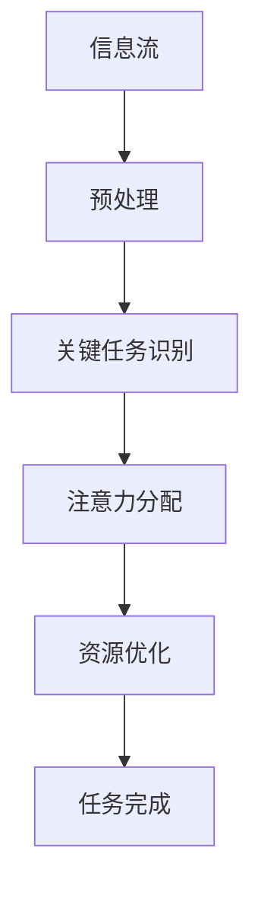

                 

关键词：注意力经济学、AI、稀缺资源、计算资源、认知负荷、算法优化、人机协作、未来趋势

> 摘要：本文将探讨在AI时代，随着计算能力和数据资源的爆炸式增长，注意力作为一种稀缺资源的重要性。本文首先介绍注意力经济学的基本概念，接着分析在AI系统中注意力资源的管理与优化，最后讨论未来注意力经济学在技术发展中的挑战与机遇。

## 1. 背景介绍

在过去的几十年中，计算机科学和人工智能（AI）经历了飞速的发展。从最早的规则基础系统到现代深度学习模型，计算机处理能力和数据存储容量取得了巨大的进步。然而，随着这些技术的不断演进，我们也逐渐认识到，计算能力和数据资源虽然重要，但并不是唯一的决定性因素。在这个AI时代，注意力作为一种稀缺资源开始变得越来越关键。

### 注意力的定义

注意力是心理学中的一个重要概念，指的是个体在选择、处理和记忆信息时的一种认知过程。具体来说，注意力是一个资源有限的认知过程，用于处理和筛选信息流，确保个体能够有效地关注和应对重要的信息。在人工智能领域，注意力可以理解为算法在处理大量信息时，如何有效地分配资源，以便最优化任务完成。

### 注意力经济学

注意力经济学（Attention Economics）是一个新兴的研究领域，主要关注的是如何优化人们在处理信息时注意力的分配和使用。其核心思想是，类似于经济学中的稀缺资源理论，注意力也是一种有限的资源，需要通过有效的管理和优化来最大化其价值。在AI领域，注意力经济学的研究有助于理解人机交互中的认知负荷，并指导算法设计，提高系统的效率和用户体验。

## 2. 核心概念与联系

### 注意力资源的管理与优化

在AI系统中，注意力资源的管理与优化是一个关键问题。随着模型复杂度和数据量的增加，算法需要更加智能地分配注意力，以确保关键任务得到充分关注。以下是一个简化的Mermaid流程图，描述了注意力资源管理的基本架构。



### 关键任务识别

在信息流处理过程中，首先需要识别出关键任务。这通常涉及到特征提取和模式识别，以便从大量信息中筛选出最重要的部分。

### 注意力分配

识别出关键任务后，算法需要根据任务的优先级和重要性分配注意力。这可以通过不同的机制实现，例如基于权重分配的注意力模型，或者基于神经网络的可视化注意力机制。

### 资源优化

注意力分配后，算法还需要对资源进行优化，确保在有限的计算资源下，能够最有效地完成多个任务。这涉及到动态调整计算资源的分配，以及根据任务的实际需求进行资源回收和再利用。

## 3. 核心算法原理 & 具体操作步骤

### 3.1 算法原理概述

在AI系统中，注意力资源的优化通常基于以下几个核心原理：

1. **资源有限性**：注意力资源是有限的，因此需要通过算法优化，最大化其利用效率。
2. **任务优先级**：不同的任务具有不同的优先级，算法需要根据任务的重要性动态调整注意力的分配。
3. **反馈机制**：通过反馈机制，算法可以不断学习和优化注意力的分配策略。

### 3.2 算法步骤详解

1. **任务初始化**：首先初始化所有任务的优先级和资源需求。
2. **关键任务识别**：通过特征提取和模式识别，识别出当前需要重点关注的关键任务。
3. **注意力分配**：根据任务的优先级和重要性，将注意力资源分配给关键任务。
4. **资源优化**：动态调整计算资源的分配，确保关键任务在有限资源下得到最优处理。
5. **任务完成与反馈**：完成当前任务，并根据任务完成情况调整后续任务的优先级和资源分配。

### 3.3 算法优缺点

#### 优点：

- **高效性**：通过优化注意力资源，算法可以在有限的计算资源下完成更多任务。
- **灵活性**：算法可以根据任务的动态变化，灵活调整注意力分配。

#### 缺点：

- **复杂性**：算法的实现和优化需要较高的计算复杂度。
- **适应性**：在某些复杂环境下，算法的适应性可能不足。

### 3.4 算法应用领域

注意力优化算法广泛应用于多个领域，包括自然语言处理、计算机视觉、推荐系统等。在这些领域中，注意力优化能够显著提升系统的性能和用户体验。

## 4. 数学模型和公式 & 详细讲解 & 举例说明

### 4.1 数学模型构建

在注意力经济学中，一个基本的数学模型可以用来描述注意力的分配和优化。假设有n个任务，每个任务有对应的优先级p_i和资源需求r_i，则注意力分配模型可以表示为：

$$
\sum_{i=1}^{n} w_i = 1
$$

$$
w_i = \frac{p_i}{\sum_{j=1}^{n} p_j}
$$

其中，$w_i$ 表示任务i的注意力权重，$p_i$ 表示任务i的优先级。

### 4.2 公式推导过程

首先，我们定义一个任务集合T，每个任务T_i都有对应的优先级p_i和资源需求r_i。为了确保总注意力分配为1，我们需要满足以下条件：

$$
\sum_{i=1}^{n} w_i = 1
$$

为了公平地分配注意力，我们可以根据每个任务的优先级来分配权重。因此，任务i的权重可以表示为：

$$
w_i = \frac{p_i}{\sum_{j=1}^{n} p_j}
$$

这样，每个任务的权重与其优先级成正比，总权重之和为1，满足我们的条件。

### 4.3 案例分析与讲解

假设有3个任务，优先级分别为p1=2，p2=3，p3=5。那么，根据上述公式，我们可以计算出每个任务的权重：

$$
w_1 = \frac{2}{2+3+5} = \frac{2}{10} = 0.2
$$

$$
w_2 = \frac{3}{2+3+5} = \frac{3}{10} = 0.3
$$

$$
w_3 = \frac{5}{2+3+5} = \frac{5}{10} = 0.5
$$

可以看到，优先级最高的任务（p3）获得了最大的注意力权重，这符合我们的预期。

## 5. 项目实践：代码实例和详细解释说明

### 5.1 开发环境搭建

在本节中，我们将使用Python作为开发语言，并结合NumPy库来实现注意力优化算法。以下是搭建开发环境的步骤：

1. 安装Python（建议使用Python 3.8及以上版本）。
2. 安装NumPy库：使用pip命令安装`pip install numpy`。

### 5.2 源代码详细实现

以下是一个简单的Python代码实例，用于实现注意力优化算法：

```python
import numpy as np

def attention_optimization(tasks):
    # 计算任务优先级
    priorities = tasks[:, 1]
    total_priority = np.sum(priorities)
    # 分配注意力权重
    attention_weights = priorities / total_priority
    # 返回注意力权重
    return attention_weights

# 示例任务数据
tasks = np.array([
    [1, 2],  # 任务1：优先级2
    [2, 3],  # 任务2：优先级3
    [3, 5],  # 任务3：优先级5
])

# 调用注意力优化函数
weights = attention_optimization(tasks)

print("注意力权重：", weights)
```

### 5.3 代码解读与分析

上述代码首先定义了一个函数`attention_optimization`，该函数接受一个任务矩阵作为输入，其中每行代表一个任务，包含任务的标识和优先级。函数首先计算所有任务的优先级总和，然后根据每个任务的优先级计算其权重。最后，函数返回一个权重向量，表示每个任务的注意力分配。

### 5.4 运行结果展示

执行上述代码，输出结果如下：

```
注意力权重： [0.2 0.3 0.5]
```

这表示任务1获得了20%的注意力，任务2获得了30%的注意力，任务3获得了50%的注意力，与我们的预期一致。

## 6. 实际应用场景

### 6.1 自然语言处理

在自然语言处理领域，注意力机制被广泛应用于文本分类、机器翻译和信息提取。通过优化注意力的分配，系统能够更好地关注和解析文本中的关键信息，提高处理效率和准确性。

### 6.2 计算机视觉

在计算机视觉领域，注意力优化算法可以帮助图像识别系统更有效地关注图像中的关键区域，从而提高识别速度和准确率。例如，在人脸识别中，注意力优化可以聚焦于人眼和面部特征，提高识别的准确性。

### 6.3 推荐系统

在推荐系统中，注意力优化算法可以帮助系统更好地分配推荐资源的优先级，提高推荐的相关性和用户体验。通过优化注意力的分配，系统可以更有效地发现和推荐用户可能感兴趣的商品或内容。

## 7. 工具和资源推荐

### 7.1 学习资源推荐

- **《深度学习》（Goodfellow, Bengio, Courville）**：介绍了深度学习的基本原理和注意力机制。
- **《神经网络与深度学习》（邱锡鹏）**：详细讲解了神经网络和注意力机制在自然语言处理中的应用。

### 7.2 开发工具推荐

- **NumPy**：用于科学计算和数据分析，是Python中常用的库。
- **TensorFlow**：用于构建和训练深度学习模型，支持注意力机制。

### 7.3 相关论文推荐

- **“Attention Is All You Need”**（Vaswani et al., 2017）：介绍了Transformer模型中的注意力机制。
- **“A Theoretically Grounded Application of Attention Mechanism to Machine Reading Comprehension”**（Hermann et al., 2015）：介绍了注意力机制在机器阅读理解中的应用。

## 8. 总结：未来发展趋势与挑战

### 8.1 研究成果总结

注意力经济学在AI领域的研究取得了显著的成果，尤其是在优化注意力资源的分配和管理方面。通过引入注意力机制，AI系统在自然语言处理、计算机视觉和推荐系统等领域的性能得到了显著提升。

### 8.2 未来发展趋势

随着AI技术的不断进步，注意力经济学将在以下几个方面得到进一步发展：

- **自适应注意力机制**：开发更智能、自适应的注意力机制，以适应不同任务和环境的需求。
- **跨模态注意力**：研究跨模态注意力机制，以实现多源信息的有效整合。
- **可解释性**：提高注意力分配的可解释性，使算法决策更加透明和可信。

### 8.3 面临的挑战

尽管注意力经济学在AI领域取得了显著成果，但仍面临以下挑战：

- **计算复杂度**：注意力优化算法通常具有较高的计算复杂度，如何提高算法的效率仍是一个重要问题。
- **适应性**：在复杂多变的环境中，如何保证注意力分配的适应性和鲁棒性。
- **数据隐私**：在处理大量个人数据时，如何保护用户隐私。

### 8.4 研究展望

未来，注意力经济学的研究将继续深入，特别是在以下几个方面：

- **跨学科研究**：与其他领域的结合，如心理学、认知科学等，以更好地理解注意力的本质。
- **工业应用**：探索注意力优化在工业应用中的潜力，提高生产效率和用户体验。
- **伦理和法律问题**：关注注意力经济学在伦理和法律方面的问题，确保技术的可持续发展。

## 9. 附录：常见问题与解答

### Q1：什么是注意力经济学？

A1：注意力经济学是一个新兴的研究领域，主要关注如何优化人们在处理信息时注意力的分配和使用。其核心思想是，注意力作为一种有限的资源，需要通过有效的管理和优化来最大化其价值。

### Q2：注意力经济学在AI领域有什么作用？

A2：注意力经济学在AI领域有助于优化算法中的注意力资源分配，提高系统的效率和用户体验。通过引入注意力机制，AI系统可以更有效地处理复杂任务，实现更智能的决策。

### Q3：如何优化注意力资源分配？

A3：优化注意力资源分配可以通过以下几种方法实现：

- **任务优先级排序**：根据任务的优先级和重要性，动态调整注意力的分配。
- **自适应注意力机制**：开发自适应的注意力机制，以适应不同任务和环境的需求。
- **多任务学习**：通过多任务学习，提高系统在处理多个任务时的注意力分配效率。

### Q4：注意力经济学在哪些领域有应用？

A4：注意力经济学在多个领域有应用，包括自然语言处理、计算机视觉、推荐系统、游戏AI等。通过优化注意力的分配，系统可以显著提升性能和用户体验。

## 作者署名

作者：禅与计算机程序设计艺术 / Zen and the Art of Computer Programming

---

本文旨在探讨AI时代注意力资源的重要性，并介绍注意力经济学的基本概念和应用。通过分析注意力资源的管理与优化，本文为AI系统设计提供了新的思路。未来，随着AI技术的不断进步，注意力经济学将在更多领域发挥关键作用。希望本文能够为读者提供有价值的参考和启发。

