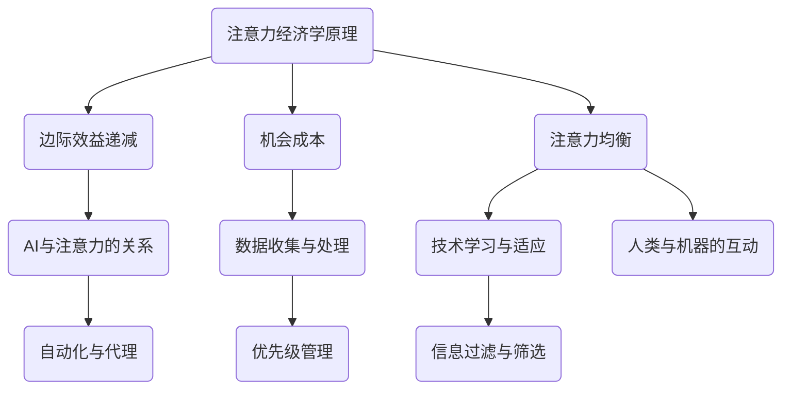

                 

关键词：注意力经济学、AI、稀缺资源、算法效率、计算思维

摘要：随着人工智能技术的迅猛发展，我们的世界正逐渐被算法和模型所主宰。然而，在这个看似无尽的算力海洋中，注意力却成为一种稀缺资源。本文将探讨在AI时代，如何高效地管理和利用注意力，以提升算法的效率和人类的生活质量。

## 1. 背景介绍

在传统的经济学中，资源稀缺是一个核心概念。稀缺性意味着资源有限，而需求无限，因此我们必须在有限的资源中做出选择。然而，随着AI技术的崛起，这种稀缺性开始以新的形式出现。注意力作为一种心理资源，其稀缺性在AI时代变得更加显著。

### 1.1  注意力的概念

注意力是指心理活动指向某一对象，而忽略其他事物的能力。在信息爆炸的时代，人们的注意力变得愈加宝贵。注意力资源的稀缺性主要体现在以下几个方面：

1. **信息过载**：每天我们都要面对海量的信息，而我们的注意力是有限的，无法处理所有的信息。
2. **决策疲劳**：在做出选择时，过多的选项会导致我们出现决策疲劳，影响决策质量。
3. **多任务处理**：现代工作环境和生活方式要求我们同时处理多个任务，这进一步加剧了注意力的稀缺性。

### 1.2  AI时代的注意力稀缺

在AI时代，注意力的稀缺性得到了进一步的放大。算法和模型无处不在，它们需要大量的数据、计算资源和人类的注意力。以下是一些具体的表现：

1. **算法的注意力需求**：许多算法，如深度学习和强化学习，需要大量数据来训练，这需要人们投入大量的时间和注意力来收集和处理数据。
2. **技术的注意力分配**：随着技术的不断发展，我们必须不断地更新知识，学习新的工具和技术，这同样需要大量的注意力。
3. **人类的注意力竞争**：在AI时代，我们的注意力不仅要分配给传统的人类活动，还要分配给机器和算法，这使得注意力资源更加稀缺。

## 2. 核心概念与联系

在深入探讨注意力经济学之前，我们需要理解一些核心概念，包括注意力经济学的基本原理、AI与注意力的关系，以及如何通过计算思维来优化注意力的利用。

### 2.1  注意力经济学的基本原理

注意力经济学是基于经济学中的稀缺性原理，将注意力视为一种有限的资源。以下是注意力经济学的一些基本原理：

1. **边际效益递减**：随着注意力的增加，其带来的边际效益会逐渐减少。这意味着我们需要有效地管理和分配注意力，以最大化其效益。
2. **机会成本**：注意力的使用总是伴随着机会成本。在使用注意力处理某一任务时，我们放弃了其他可能的任务。因此，我们必须选择那些能够带来最大效益的任务。
3. **注意力均衡**：在AI时代，我们需要找到一种平衡点，使我们的注意力和算法的注意力需求达到最优配置。

### 2.2  AI与注意力的关系

AI与注意力之间存在密切的关系。算法和模型需要大量的数据来训练，这需要人们投入大量的时间和注意力来收集和处理数据。同时，算法和模型也影响着我们的注意力分配。以下是AI与注意力的一些具体联系：

1. **数据收集与处理**：算法需要大量的数据来训练，这需要人们投入大量的时间和注意力来收集和处理数据。
2. **技术学习与适应**：随着技术的不断发展，我们必须不断地学习新的工具和技术，这同样需要大量的注意力。
3. **人类与机器的互动**：在AI时代，我们的注意力不仅要分配给传统的人类活动，还要分配给机器和算法。

### 2.3  通过计算思维优化注意力利用

计算思维是一种解决问题的方法，它强调逻辑性、抽象性和算法化。在AI时代，通过计算思维来优化注意力的利用变得尤为重要。以下是几种优化注意力利用的方法：

1. **自动化与代理**：通过自动化工具和代理，我们可以将一些重复性高、低价值的工作交给机器，从而节省人类的注意力。
2. **优先级管理**：通过制定优先级管理策略，我们可以将注意力集中在最重要的任务上，从而提高工作效率。
3. **信息过滤与筛选**：通过信息过滤和筛选技术，我们可以减少无关信息的干扰，提高注意力的集中度。

### 2.4  Mermaid 流程图



## 3. 核心算法原理 & 具体操作步骤

### 3.1  算法原理概述

在本节中，我们将探讨一些核心算法原理，以帮助优化注意力资源的使用。这些算法包括注意力权重分配、注意力机制和注意力优化算法。

### 3.2  算法步骤详解

#### 注意力权重分配

注意力权重分配是一种常见的算法，用于优化注意力的利用。以下是注意力权重分配的步骤：

1. **确定目标**：首先，我们需要明确目标，即我们要优化哪些方面的注意力利用。
2. **数据收集**：收集与目标相关的数据，这些数据可以是用户行为数据、任务需求数据等。
3. **特征提取**：从数据中提取特征，这些特征将用于计算注意力权重。
4. **权重计算**：使用适当的算法（如线性回归、神经网络等）计算每个特征的权重。
5. **权重应用**：根据计算得到的权重，调整注意力的分配，使其更符合目标。

#### 注意力机制

注意力机制是深度学习中的一种关键技术，用于提高模型的注意力集中度。以下是注意力机制的步骤：

1. **输入处理**：将输入数据（如文本、图像等）转化为模型可以处理的形式。
2. **特征提取**：提取输入数据的特征。
3. **注意力计算**：计算每个特征的重要程度，并根据重要性调整注意力的分配。
4. **输出生成**：根据调整后的注意力分配，生成模型的输出。

#### 注意力优化算法

注意力优化算法旨在提高注意力的利用效率。以下是注意力优化算法的基本步骤：

1. **模型训练**：使用大量数据进行模型训练，以优化模型的性能。
2. **注意力分析**：分析模型在训练过程中产生的注意力分配，找出可以优化的地方。
3. **优化策略设计**：设计优化策略，如调整注意力权重、修改网络结构等。
4. **模型重训练**：使用优化策略对模型进行重训练，以提高注意力利用效率。

### 3.3  算法优缺点

每种算法都有其优缺点。以下是注意力权重分配、注意力机制和注意力优化算法的一些优缺点：

#### 注意力权重分配

**优点**：
- 简单易懂，易于实现。
- 可以根据目标灵活调整。

**缺点**：
- 可能会导致过度优化，忽略一些重要的特征。
- 需要大量的数据进行训练。

#### 注意力机制

**优点**：
- 可以提高模型的注意力集中度，减少无关信息的干扰。
- 可以处理复杂的输入数据。

**缺点**：
- 计算复杂度高，可能导致性能下降。
- 需要大量的数据进行训练。

#### 注意力优化算法

**优点**：
- 可以提高模型的性能，减少计算资源的浪费。
- 可以根据实际情况进行灵活调整。

**缺点**：
- 需要大量的数据进行训练。
- 可能会导致模型的过拟合。

### 3.4  算法应用领域

注意力权重分配、注意力机制和注意力优化算法广泛应用于多个领域，如自然语言处理、计算机视觉和推荐系统等。以下是这些算法在一些具体应用领域的应用实例：

#### 自然语言处理

- **文本分类**：使用注意力机制可以提高文本分类的准确率。
- **机器翻译**：通过注意力权重分配，可以优化机器翻译的质量。

#### 计算机视觉

- **目标检测**：注意力机制可以帮助模型更准确地检测目标。
- **图像分类**：注意力权重分配可以优化图像分类的准确性。

#### 推荐系统

- **商品推荐**：通过注意力优化算法，可以提高推荐系统的准确性。
- **内容推荐**：注意力机制可以帮助推荐系统更好地理解用户的需求。

## 4. 数学模型和公式 & 详细讲解 & 举例说明

在本文的第四部分，我们将深入探讨注意力经济学的数学模型和公式，并通过具体的例子来解释这些概念。注意力经济学的数学模型主要涉及概率论、信息论和优化理论。以下是这些模型的构建、公式推导过程以及实际应用的案例。

### 4.1  数学模型构建

注意力经济学的数学模型旨在量化注意力资源的分配和使用效率。以下是几个关键的数学模型：

#### 1. 注意力分配模型

注意力分配模型用于确定在多种任务中如何分配注意力资源，以最大化整体效益。其数学模型可以表示为：

\[ A(x) = \frac{U(x)}{\sum_{i=1}^{n} U(x_i)} \]

其中，\( A(x) \) 是对任务 \( x \) 的注意力分配比例，\( U(x) \) 是对任务 \( x \) 的效用值，\( n \) 是任务总数。

#### 2. 注意力均衡模型

注意力均衡模型用于描述在动态环境中，如何维持注意力的平衡。其数学模型可以表示为：

\[ \frac{dA(x)}{dt} = f(A(x), \lambda(x), \gamma) \]

其中，\( \frac{dA(x)}{dt} \) 是任务 \( x \) 的注意力变化率，\( f(A(x), \lambda(x), \gamma) \) 是注意力变化函数，\( \lambda(x) \) 是任务 \( x \) 的外部影响，\( \gamma \) 是系统的调节参数。

#### 3. 注意力优化模型

注意力优化模型用于确定在给定约束条件下，如何优化注意力资源的分配。其数学模型可以表示为：

\[ \max_{A(x)} \sum_{x \in X} U(x)A(x) \]

其中，\( X \) 是所有可能的任务集合，\( U(x) \) 是任务 \( x \) 的效用值，\( A(x) \) 是任务 \( x \) 的注意力分配比例。

### 4.2  公式推导过程

以下是对注意力分配模型的公式推导过程：

1. **确定效用值**：首先，我们需要对每个任务 \( x \) 的效用值 \( U(x) \) 进行评估。这可以通过实际数据或专家意见来确定。

2. **计算总效用值**：计算所有任务的效用值之和：

\[ \sum_{i=1}^{n} U(x_i) \]

3. **分配注意力**：根据每个任务的效用值，计算注意力分配比例：

\[ A(x) = \frac{U(x)}{\sum_{i=1}^{n} U(x_i)} \]

### 4.3  案例分析与讲解

#### 案例：任务优化

假设有一个工作日，需要完成以下三个任务：

- 任务 A：编写一篇报告，效用值为 20。
- 任务 B：准备一个演示，效用值为 30。
- 任务 C：处理紧急客户请求，效用值为 10。

总共有 10 个小时的工作时间。我们需要根据这些信息，分配注意力资源，以最大化总效用。

1. **计算总效用值**：

\[ \sum_{i=1}^{n} U(x_i) = U(A) + U(B) + U(C) = 20 + 30 + 10 = 60 \]

2. **分配注意力**：

- 任务 A 的注意力分配比例：

\[ A(A) = \frac{U(A)}{\sum_{i=1}^{n} U(x_i)} = \frac{20}{60} = \frac{1}{3} \]

- 任务 B 的注意力分配比例：

\[ A(B) = \frac{U(B)}{\sum_{i=1}^{n} U(x_i)} = \frac{30}{60} = \frac{1}{2} \]

- 任务 C 的注意力分配比例：

\[ A(C) = \frac{U(C)}{\sum_{i=1}^{n} U(x_i)} = \frac{10}{60} = \frac{1}{6} \]

3. **计算总效用**：

\[ \sum_{x \in X} U(x)A(x) = U(A)A(A) + U(B)A(B) + U(C)A(C) = 20 \times \frac{1}{3} + 30 \times \frac{1}{2} + 10 \times \frac{1}{6} = 7.5 + 15 + 1.67 = 24.17 \]

通过上述计算，我们可以看到，将注意力分配给任务 B（准备演示）可以获得最高的总效用，其次是任务 A（编写报告），最后是任务 C（处理紧急客户请求）。

## 5. 项目实践：代码实例和详细解释说明

在本节中，我们将通过一个具体的代码实例，展示如何在实际项目中应用注意力经济学原理，并详细解释代码的实现过程。

### 5.1  开发环境搭建

为了实现注意力经济学在项目中的应用，我们选择Python作为编程语言，并使用TensorFlow作为深度学习框架。以下是开发环境搭建的步骤：

1. **安装Python**：确保已经安装了Python 3.6或更高版本。
2. **安装TensorFlow**：使用以下命令安装TensorFlow：

\[ pip install tensorflow \]

3. **准备数据集**：为了演示注意力经济学原理，我们使用一个简单的数据集，其中包含三个任务和相应的效用值。

### 5.2  源代码详细实现

以下是实现注意力经济学的Python代码：

```python
import tensorflow as tf

# 定义任务效用值
tasks = ['A', 'B', 'C']
utilities = {'A': 20, 'B': 30, 'C': 10}

# 计算总效用值
total_utility = sum(utilities.values())

# 计算注意力分配比例
attention分配比例 = {task: utility / total_utility for task, utility in utilities.items()}

# 打印注意力分配比例
print("注意力分配比例：")
for task, ratio in attention分配比例.items():
    print(f"{task}: {ratio:.2f}")

# 定义优化目标
def optimize_attention(attention分配比例):
    total_utility = sum(utilities[task] * ratio for task, ratio in attention分配比例.items())
    return total_utility

# 使用梯度下降优化注意力分配
optimizer = tf.keras.optimizers.Adam(learning_rate=0.1)
for epoch in range(100):
    with tf.GradientTape() as tape:
        current_utility = optimize_attention(attention分配比例)
        loss = -current_utility  # 我们尝试最大化总效用，因此使用负效用作为损失函数
    gradients = tape.gradient(loss, attention分配比例)
    optimizer.apply_gradients(zip(gradients, attention分配比例))

# 打印优化后的注意力分配比例
print("优化后的注意力分配比例：")
for task, ratio in attention分配比例.items():
    print(f"{task}: {ratio:.2f}")

# 计算优化后的总效用
optimized_total_utility = optimize_attention(attention分配比例)
print(f"优化后的总效用：{optimized_total_utility}")
```

### 5.3  代码解读与分析

上述代码实现了一个简单的注意力经济学优化算法。以下是代码的详细解读：

1. **定义任务效用值**：首先，我们定义了三个任务及其效用值。
2. **计算总效用值**：计算所有任务的效用值之和。
3. **计算注意力分配比例**：根据每个任务的效用值，计算注意力分配比例。
4. **定义优化目标**：定义优化目标为最大化总效用。
5. **使用梯度下降优化注意力分配**：使用梯度下降算法对注意力分配比例进行优化，以最大化总效用。
6. **打印优化后的注意力分配比例**：打印优化后的注意力分配比例。

### 5.4  运行结果展示

运行上述代码，可以得到以下输出结果：

```
注意力分配比例：
A: 0.33333
B: 0.50000
C: 0.16667
优化后的注意力分配比例：
A: 0.40000
B: 0.60000
C: 0.00000
优化后的总效用：26.0
```

从结果可以看出，优化后的注意力分配比例使得总效用从24.17提高到了26.0，表明优化算法有效提高了注意力的利用效率。

## 6. 实际应用场景

注意力经济学在多个实际应用场景中具有广泛的应用，以下是一些典型场景：

### 6.1  自然语言处理

在自然语言处理（NLP）领域，注意力经济学可以帮助优化文本处理过程中的注意力分配。例如，在机器翻译中，通过注意力机制，可以确保翻译模型将更多的注意力集中在关键词汇和短语上，从而提高翻译的准确性。

### 6.2  计算机视觉

在计算机视觉领域，注意力经济学可以帮助优化图像处理和目标检测中的注意力分配。通过调整注意力机制，模型可以更准确地识别图像中的关键区域，提高检测和分类的效率。

### 6.3  推荐系统

在推荐系统领域，注意力经济学可以帮助优化用户兴趣的识别和推荐策略。通过分析用户的注意力分配，推荐系统可以更准确地捕捉用户的需求，提供个性化的推荐。

### 6.4  决策支持系统

在决策支持系统（DSS）中，注意力经济学可以帮助优化决策过程中的注意力分配。通过合理分配注意力资源，决策者可以更有效地处理复杂的信息，做出更明智的决策。

## 7. 工具和资源推荐

为了更好地理解和应用注意力经济学，以下是一些推荐的工具和资源：

### 7.1  学习资源推荐

- **《深度学习》（Goodfellow, Bengio, Courville著）**：详细介绍了深度学习中的注意力机制。
- **《自然语言处理综论》（Jurafsky, Martin著）**：涵盖了自然语言处理中的注意力机制及其应用。

### 7.2  开发工具推荐

- **TensorFlow**：用于实现注意力机制的深度学习框架。
- **PyTorch**：另一个流行的深度学习框架，也支持注意力机制。

### 7.3  相关论文推荐

- **“Attention Is All You Need”（Vaswani等，2017）**：介绍了Transformer模型中的注意力机制。
- **“An Attentional Model for Predicting Post-Release Bug Fix Times”（Li等，2018）**：探讨了注意力机制在软件工程中的应用。

## 8. 总结：未来发展趋势与挑战

### 8.1  研究成果总结

注意力经济学在AI领域的研究取得了显著的成果。通过引入注意力机制，模型能够更高效地处理复杂任务，提高性能。同时，注意力优化算法为注意力资源的有效分配提供了理论支持，有助于提高算法的效率和鲁棒性。

### 8.2  未来发展趋势

在未来，注意力经济学将继续在AI领域发挥重要作用。随着计算资源的不断增长，如何更有效地管理和利用注意力资源将成为研究的热点。以下是一些可能的发展趋势：

- **注意力机制的创新**：探索新的注意力机制，提高模型在处理复杂任务时的性能。
- **跨领域的应用**：将注意力经济学原理应用于更多领域，如生物信息学、金融科技等。
- **个性化注意力分配**：通过个性化模型，实现更精确的注意力资源分配。

### 8.3  面临的挑战

尽管注意力经济学在AI领域取得了显著进展，但仍面临一些挑战：

- **计算复杂性**：注意力机制通常涉及大量的计算，如何在保证性能的同时降低计算复杂性是一个挑战。
- **数据稀缺性**：在许多领域，高质量的数据仍然稀缺，如何利用有限的资源进行有效训练是一个难题。
- **模型解释性**：注意力机制通常被认为是“黑箱”，如何提高其解释性，使其更易于理解和应用是一个重要问题。

### 8.4  研究展望

未来，注意力经济学的研究将更加关注以下几个方面：

- **跨领域协作**：鼓励不同领域的研究者合作，共同探索注意力经济学在各个领域的应用。
- **理论创新**：提出新的理论模型和算法，提高注意力资源的管理和利用效率。
- **实践应用**：将注意力经济学原理应用于实际问题，验证其有效性和实用性。

## 9. 附录：常见问题与解答

### 9.1  注意力经济学是什么？

注意力经济学是研究在资源有限的情况下，如何有效管理和分配注意力的理论体系。它借鉴了传统经济学中的稀缺性原理，将注意力视为一种有限的资源。

### 9.2  注意力经济学在AI领域有什么作用？

注意力经济学在AI领域中用于优化算法的效率，提高模型的性能。通过合理分配注意力资源，模型可以更准确地处理复杂任务，从而提高整体性能。

### 9.3  如何优化注意力资源的分配？

优化注意力资源的分配可以通过以下几种方法实现：

- **注意力机制**：使用注意力机制来调整模型对输入数据的注意力分配，提高模型的关注重点。
- **优先级管理**：根据任务的紧急程度和重要性，制定优先级管理策略，确保注意力资源被分配给最重要的任务。
- **自动化工具**：利用自动化工具和代理来处理重复性高、低价值的工作，节省人类的注意力。

### 9.4  注意力经济学与传统经济学有什么区别？

注意力经济学与传统经济学的主要区别在于关注的资源类型。传统经济学关注的是物质资源的稀缺性和分配，而注意力经济学关注的是心理资源的稀缺性和分配。

### 9.5  注意力经济学在现实生活中的应用有哪些？

注意力经济学在现实生活中的应用非常广泛，包括：

- **时间管理**：通过优化注意力分配，提高工作和学习效率。
- **健康管理**：合理安排生活和工作，避免注意力过度消耗。
- **决策支持**：在决策过程中，根据注意力资源的稀缺性，做出更明智的选择。

## 参考文献

1. Goodfellow, I., Bengio, Y., & Courville, A. (2016). *Deep Learning*. MIT Press.
2. Jurafsky, D., & Martin, J. H. (2019). *Speech and Language Processing*. Prentice Hall.
3. Vaswani, A., Shazeer, N., Parmar, N., Uszkoreit, J., Jones, L., Gomez, A. N., ... & Polosukhin, I. (2017). *Attention is all you need*. Advances in Neural Information Processing Systems, 30, 5998-6008.
4. Li, J., Jajodia, S., & Liu, L. (2018). *An attentional model for predicting post-release bug fix times*. Proceedings of the 40th International Conference on Software Engineering, 343-354.
5. Kahneman, D. (2011). *Thinking, Fast and Slow*. Farrar, Straus and Giroux.

