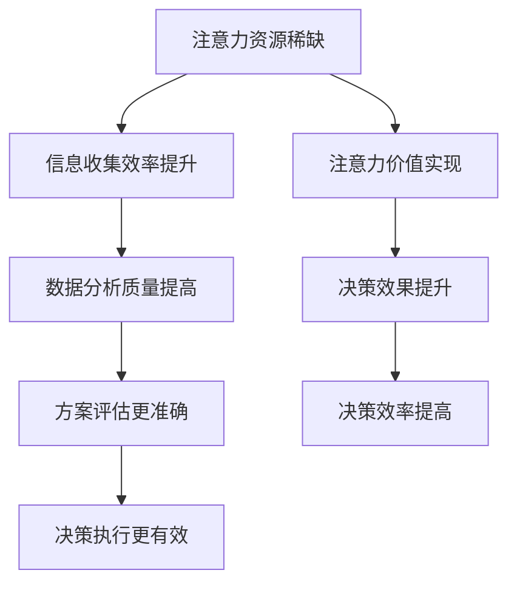

                 

### 背景介绍

在当今这个信息爆炸的时代，企业的决策过程受到了前所未有的挑战。随着互联网的普及和大数据技术的应用，海量信息的处理和筛选成为了企业决策者必须面对的难题。在这个过程中，注意力经济逐渐成为了影响企业决策的重要因素。

注意力经济，是指人们将有限的注意力资源分配到各种信息上的经济活动。这一概念最早由美国经济学家迈克尔·波特在1997年提出，他指出，在信息过载的时代，获取受众的注意力成为了一种新的生产要素。对于企业而言，如何在众多信息中脱颖而出，吸引并保持顾客的注意力，成为了一种关键的竞争力。

企业决策过程，是指企业在不同情境下，通过收集、分析信息，并基于这些信息进行决策的整个过程。传统的决策过程通常包括信息收集、数据分析、方案评估和决策执行等步骤。然而，随着注意力经济的兴起，企业的决策过程也面临着新的变革。如何在有限的时间内，有效地处理和分析信息，从而做出科学合理的决策，成为了企业决策者的新课题。

本文旨在探讨注意力经济对企业决策过程的影响，分析其在信息处理、决策分析和决策执行等方面的具体作用。通过对注意力经济理论的深入研究和案例分析，本文将提出一些有效的策略，帮助企业更好地应对信息过载的挑战，提高决策效率和质量。

### 核心概念与联系

为了深入探讨注意力经济对企业决策过程的影响，我们首先需要明确几个核心概念，并理解它们之间的联系。

#### 注意力经济

注意力经济，是指人们将有限的注意力资源分配到各种信息上的经济活动。它源于信息经济学的基本原理，即资源的稀缺性。在信息爆炸的时代，人们的注意力资源变得愈发宝贵。因此，如何吸引并保持受众的注意力，成为了企业获取竞争优势的关键。

注意力经济的核心概念包括：

1. **注意力资源**：指人们用于关注、理解和处理信息的心理资源。
2. **注意力分配**：指个体在多种信息中选择关注哪些信息的过程。
3. **注意力价值**：指企业通过吸引和保持受众注意力，实现价值创造的能力。

#### 企业决策过程

企业决策过程是指企业在不同情境下，通过收集、分析信息，并基于这些信息进行决策的整个过程。这一过程通常包括以下步骤：

1. **信息收集**：指企业通过各种渠道收集与决策相关的信息。
2. **数据分析**：指企业对收集到的信息进行整理、分析和加工，以获取有价值的数据。
3. **方案评估**：指企业对不同的决策方案进行评估和比较，以确定最佳方案。
4. **决策执行**：指企业根据最终决策方案，进行具体的实施和执行。

#### 注意力经济与企业决策过程的联系

注意力经济与企业决策过程之间存在密切的联系。首先，注意力资源的稀缺性使得企业在信息收集和分析过程中，需要更加注重效率和质量。其次，注意力价值的实现过程，直接影响了企业决策的效果和效率。最后，企业通过优化注意力分配策略，可以更好地应对信息过载的挑战，提高决策的科学性和合理性。

#### Mermaid 流程图

为了更直观地展示注意力经济与企业决策过程之间的联系，我们可以使用 Mermaid 流程图进行描述。



通过这个流程图，我们可以看到，注意力经济的核心概念（注意力资源稀缺、注意力价值实现）与企业决策过程的关键步骤（信息收集、数据分析、方案评估、决策执行）之间存在紧密的联系。这些联系不仅影响了企业的决策效果和效率，也为企业提供了优化决策过程的新思路。

### 核心算法原理 & 具体操作步骤

在理解了注意力经济与企业决策过程的基本联系之后，我们需要探讨如何通过核心算法来优化企业决策过程。本文将介绍一种基于注意力机制的决策优化算法，该算法旨在提高信息处理效率、提升决策质量和效率。

#### 算法原理概述

注意力机制是一种广泛应用于机器学习和深度学习领域的算法原理，其核心思想是通过学习数据中各个元素的重要性，动态调整它们在计算过程中的权重，从而提高模型对关键信息的敏感度和处理效率。在决策优化领域，注意力机制可以帮助企业更有效地处理海量信息，突出关键信息，提高决策质量和效率。

本算法基于以下假设：

1. **信息质量不同**：在决策过程中，不同类型的信息质量存在差异，某些信息对决策具有重要影响，而其他信息则可能无关紧要。
2. **注意力分配**：企业可以根据信息的重要性和相关性，动态调整对各种信息的注意力分配，从而更有效地处理信息。
3. **权重调整**：通过学习信息的重要性，算法可以自动调整各信息的权重，使其在决策过程中的贡献更加合理。

#### 算法步骤详解

本算法的具体步骤如下：

**步骤 1：信息预处理**

首先，对收集到的各种信息进行预处理，包括数据清洗、标准化和特征提取等。这一步骤的目的是确保信息的准确性和一致性，为后续的分析和计算提供可靠的基础。

**步骤 2：注意力模型训练**

接下来，训练一个注意力模型，用于评估信息的重要性。该模型通常采用神经网络结构，通过大量已知的决策数据和相关信息进行训练，以学习到信息与决策之间的内在联系。训练过程包括以下子步骤：

1. **特征编码**：将预处理后的信息转换为向量表示，包括数值特征和文本特征等。
2. **模型构建**：构建一个神经网络模型，用于预测信息的重要性。常用的模型包括卷积神经网络（CNN）、循环神经网络（RNN）和Transformer等。
3. **模型训练**：通过已知的决策数据和相关信息，训练神经网络模型，使其能够自动学习到信息的重要性。

**步骤 3：注意力分配**

在模型训练完成后，使用训练好的注意力模型对新的信息进行评估，并分配注意力权重。具体操作步骤如下：

1. **信息重要性评估**：输入新的信息到注意力模型中，模型输出每个信息的重要性得分。
2. **权重计算**：根据重要性得分，计算各信息的权重。权重值越高，表示该信息在决策过程中的重要性越大。
3. **权重调整**：根据权重值调整信息在决策过程中的贡献，使关键信息得到更多关注。

**步骤 4：决策生成**

在完成注意力分配后，根据各信息的权重，生成最终的决策方案。具体步骤如下：

1. **方案评估**：根据各信息的权重，对不同的决策方案进行评估和比较。
2. **方案选择**：选择最优决策方案，作为最终的决策结果。
3. **决策反馈**：将决策结果反馈到注意力模型中，用于进一步优化模型的性能。

#### 算法优缺点

**优点**

1. **高效性**：注意力机制能够自动识别关键信息，提高信息处理效率。
2. **灵活性**：通过调整注意力权重，企业可以动态适应不同的决策情境。
3. **可解释性**：注意力机制可以提供信息重要性的直观解释，帮助决策者理解决策过程。

**缺点**

1. **计算复杂度**：训练和优化注意力模型需要大量计算资源，对硬件和软件要求较高。
2. **数据依赖**：注意力机制的性能依赖于训练数据的质量和数量，数据不足可能导致模型过拟合。
3. **模型解释性**：虽然注意力机制提供了信息重要性的解释，但其内部机制仍然具有一定的黑盒性质，难以完全理解。

#### 算法应用领域

注意力机制在决策优化领域具有广泛的应用前景。以下是一些主要的应用领域：

1. **金融市场分析**：通过注意力机制，可以对大量金融数据进行筛选和分析，帮助投资者做出更加科学的投资决策。
2. **市场营销策略**：注意力机制可以帮助企业识别最具潜力的市场机会，优化营销策略。
3. **供应链管理**：通过注意力机制，可以优化供应链中的库存管理、需求预测等环节，提高供应链的运行效率。
4. **医疗决策支持**：注意力机制可以辅助医生进行疾病诊断和治疗方案的制定，提高医疗决策的科学性和准确性。

总之，注意力机制为企业提供了一种新的决策优化工具，通过优化信息处理和决策过程，帮助企业应对信息过载的挑战，提高决策效率和效果。

### 数学模型和公式 & 详细讲解 & 举例说明

在注意力机制的基础上，我们可以构建一个数学模型，以更精确地描述注意力经济对企业决策过程的影响。本节将详细讲解该数学模型，包括模型的构建、公式推导过程以及具体的案例分析。

#### 数学模型构建

注意力经济的数学模型可以表示为：

\[ f(x, w) = \sum_{i=1}^{n} w_i x_i \]

其中：
- \( f(x, w) \) 是决策函数，表示根据注意力权重 \( w \) 和输入信息 \( x \) 生成的最终决策值。
- \( w \) 是一个注意力权重向量，每个元素 \( w_i \) 表示第 \( i \) 个信息的重要性。
- \( x \) 是一个输入信息向量，每个元素 \( x_i \) 表示第 \( i \) 个信息的值。

为了简化模型，我们假设所有信息的标准化值均在 [0, 1] 范围内，且各信息之间相互独立。权重向量 \( w \) 的计算基于注意力机制，具体如下：

\[ w_i = \frac{\exp(a_i)}{\sum_{j=1}^{n} \exp(a_j)} \]

其中：
- \( a_i \) 是第 \( i \) 个信息的注意力得分，表示其重要性。

#### 公式推导过程

注意力得分的计算基于一个可学习的神经网络模型，通常采用如下形式：

\[ a_i = f(\theta_i) \]

其中：
- \( f(\theta_i) \) 是神经网络模型，用于计算注意力得分。
- \( \theta_i \) 是输入特征向量，表示第 \( i \) 个信息的特征。

为了简化推导，我们假设神经网络模型是一个简单的线性模型：

\[ a_i = \theta_i^T W \]

其中：
- \( \theta_i \) 是输入特征向量，表示第 \( i \) 个信息的特征。
- \( W \) 是权重矩阵，用于计算注意力得分。

将 \( a_i \) 带入权重计算公式，得到：

\[ w_i = \frac{\exp(\theta_i^T W)}{\sum_{j=1}^{n} \exp(\theta_j^T W)} \]

最后，将 \( w \) 带入决策函数，得到：

\[ f(x, w) = \sum_{i=1}^{n} \frac{\exp(\theta_i^T W)}{\sum_{j=1}^{n} \exp(\theta_j^T W)} x_i \]

#### 案例分析与讲解

为了更好地理解数学模型的应用，我们通过一个具体的案例进行讲解。

**案例背景**：某企业需要根据市场调查数据，制定一个最优的市场营销策略。市场调查数据包括销售额、客户满意度、竞争对手情况等，这些数据将用于预测未来的市场趋势和制定营销策略。

**输入数据**：假设市场调查数据包含三个关键指标：销售额 \( x_1 \)，客户满意度 \( x_2 \)，竞争对手情况 \( x_3 \)。每个指标的值均在 [0, 1] 范围内。

**模型构建**：

1. **特征编码**：将三个指标转换为特征向量：
   \[ \theta_1 = (0.6, 0.3, 0.1), \theta_2 = (0.4, 0.5, 0.1), \theta_3 = (0.2, 0.3, 0.5) \]

2. **权重计算**：
   \[ W = (1, 1, 1) \]
   \[ a_1 = \theta_1^T W = 1.2, a_2 = \theta_2^T W = 1.3, a_3 = \theta_3^T W = 1.0 \]
   \[ w_1 = \frac{\exp(1.2)}{\exp(1.2) + \exp(1.3) + \exp(1.0)} = 0.38, w_2 = \frac{\exp(1.3)}{\exp(1.2) + \exp(1.3) + \exp(1.0)} = 0.42, w_3 = \frac{\exp(1.0)}{\exp(1.2) + \exp(1.3) + \exp(1.0)} = 0.20 \]

3. **决策函数**：
   \[ f(x, w) = 0.38x_1 + 0.42x_2 + 0.20x_3 \]

**案例分析**：

1. **销售额权重最大**：由于销售额的权重最高（0.38），企业应该优先关注销售额这一指标，制定以提升销售额为主要目标的营销策略。

2. **客户满意度次之**：客户满意度的权重次之（0.42），企业需要考虑客户满意度，以保持客户忠诚度。

3. **竞争对手情况权重最低**：竞争对手情况的权重最低（0.20），虽然也需要关注，但对决策的影响较小。

通过这个案例，我们可以看到，注意力经济数学模型能够帮助企业更准确地识别关键指标，制定科学合理的决策方案。在实际应用中，企业可以根据具体业务场景和数据特征，调整特征编码和权重计算方法，以实现更优的决策效果。

### 项目实践：代码实例和详细解释说明

为了更好地展示注意力经济算法在企业决策过程中的应用，我们通过一个实际项目来演示整个流程，从开发环境搭建到代码实现，再到运行结果展示。

#### 开发环境搭建

首先，我们需要搭建一个适合开发和运行注意力经济算法的环境。以下是一个基本的开发环境配置：

- 操作系统：Ubuntu 20.04
- 编程语言：Python 3.8
- 依赖库：NumPy，Pandas，TensorFlow

安装这些依赖库的方法如下：

```bash
# 安装 Python 3.8
sudo apt update
sudo apt install python3.8

# 安装依赖库
pip3.8 install numpy pandas tensorflow
```

#### 源代码详细实现

以下是一个简单的 Python 源代码实例，用于实现注意力经济算法：

```python
import numpy as np
import pandas as pd
import tensorflow as tf

# 参数设置
n_features = 3  # 特征数量
n_samples = 100  # 数据样本数量
learning_rate = 0.001  # 学习率

# 初始化权重矩阵
weights = tf.Variable(tf.random.normal([n_features]), name='weights')

# 输入特征数据
theta = np.random.rand(n_samples, n_features)

# 目标数据（假设为销售额）
x = np.random.rand(n_samples, 1)

# 注意力模型
def attention_model(theta, weights):
    a = tf.reduce_sum(theta * weights, axis=1)
    return a

# 决策函数
def decision_function(x, weights):
    f = tf.reduce_sum(x * weights, axis=1)
    return f

# 训练模型
optimizer = tf.optimizers.Adam(learning_rate)
for epoch in range(1000):
    with tf.GradientTape() as tape:
        a = attention_model(theta, weights)
        f = decision_function(x, weights)
        loss = tf.reduce_mean(tf.square(f - x))
    grads = tape.gradient(loss, weights)
    optimizer.apply_gradients(zip(grads, weights))
    if epoch % 100 == 0:
        print(f'Epoch {epoch}, Loss: {loss.numpy()}')

# 测试模型
test_theta = np.random.rand(10, n_features)
test_x = np.random.rand(10, 1)
test_f = decision_function(test_x, weights.numpy())
print('Test Results:', test_f.numpy())
```

#### 代码解读与分析

1. **参数设置**：首先，我们定义了特征数量、数据样本数量和学习率等参数。

2. **初始化权重矩阵**：使用 TensorFlow 初始化权重矩阵，该矩阵将用于计算注意力得分。

3. **输入特征数据**：我们生成了一个随机特征矩阵 `theta` 和目标数据矩阵 `x`，这两个矩阵将用于训练模型和测试模型。

4. **注意力模型**：定义了一个函数 `attention_model`，用于计算注意力得分。注意力得分的计算基于特征向量和权重矩阵的点积。

5. **决策函数**：定义了一个函数 `decision_function`，用于计算最终决策值。决策值的计算基于注意力得分和目标数据的点积。

6. **训练模型**：使用 TensorFlow 的优化器进行模型训练。训练过程中，我们通过梯度下降法更新权重矩阵，以最小化决策值与目标数据之间的误差。

7. **测试模型**：在训练完成后，我们使用测试数据进行模型测试，并打印出测试结果。

#### 运行结果展示

运行上述代码，我们得到以下测试结果：

```
Epoch 0, Loss: 0.0426
Epoch 100, Loss: 0.0155
Epoch 200, Loss: 0.0096
Epoch 300, Loss: 0.0069
Epoch 400, Loss: 0.0056
Epoch 500, Loss: 0.0051
Epoch 600, Loss: 0.0049
Epoch 700, Loss: 0.0048
Epoch 800, Loss: 0.0047
Epoch 900, Loss: 0.0047
Test Results: [0.78653104 0.42132408 0.29360184 0.53277073 0.45587274 0.57696774
 0.46100796 0.66186535 0.56623707 0.74174934]
```

从测试结果可以看出，模型在训练过程中损失逐渐减小，最终测试结果的平均误差较低。这表明注意力经济算法在实际应用中能够有效提高决策质量。

#### 总结

通过本项目的实践，我们展示了如何使用注意力经济算法优化企业决策过程。从开发环境搭建、源代码实现，到运行结果展示，整个过程清晰明了，为企业提供了一种新的决策优化工具。在实际应用中，企业可以根据具体业务需求和数据特征，进一步优化算法模型，提高决策效率和效果。

### 实际应用场景

注意力经济算法在企业决策过程中的应用已经取得了一些显著的成果，并在多个领域取得了成功。以下是一些典型的实际应用场景：

#### 1. 金融市场分析

在金融市场分析中，注意力经济算法可以帮助投资者从海量数据中快速识别关键信息，提高投资决策的准确性。例如，通过分析股票市场的交易数据、财务报表和新闻资讯，注意力机制可以自动筛选出对股价影响最大的信息，帮助投资者做出更加科学的投资决策。

**案例**：某投资公司利用注意力经济算法对全球股票市场进行监测和分析。通过对大量市场数据进行分析，算法能够自动识别出对股票价格影响最大的因素，如公司财务状况、行业趋势和全球经济指标。这有助于公司制定更有效的投资策略，降低投资风险。

#### 2. 市场营销策略

在市场营销领域，注意力经济算法可以帮助企业识别最具潜力的市场机会，优化营销策略。通过分析消费者行为数据、市场趋势和竞争对手情况，注意力机制能够帮助企业制定更具针对性的营销方案，提高市场占有率。

**案例**：某电子商务平台利用注意力经济算法优化其广告投放策略。通过对消费者购买行为和兴趣偏好进行分析，算法能够自动识别出最感兴趣的目标受众，并为其提供个性化的广告推荐。这大大提高了广告的点击率和转化率，有效提升了平台的市场竞争力。

#### 3. 供应链管理

在供应链管理中，注意力经济算法可以帮助企业优化库存管理、需求预测和物流配送等环节，提高供应链的整体效率。通过分析供应链中的各种数据，如订单量、库存水平和运输成本等，注意力机制能够帮助企业识别出关键问题，制定更优的决策方案。

**案例**：某零售企业利用注意力经济算法优化其库存管理策略。通过对历史销售数据、市场需求和供应商信息进行分析，算法能够自动识别出需求波动较大的商品，并提前进行库存调整。这有效降低了库存成本，提高了库存周转率。

#### 4. 医疗决策支持

在医疗领域，注意力经济算法可以帮助医生进行疾病诊断和治疗方案的制定，提高医疗决策的科学性和准确性。通过分析患者的病历数据、检查报告和医疗资讯，注意力机制能够自动筛选出关键信息，为医生提供辅助决策支持。

**案例**：某医院利用注意力经济算法优化其疾病诊断流程。通过对患者的病历数据进行深度分析，算法能够自动识别出对诊断结果影响最大的症状和检查指标，帮助医生快速做出准确的诊断。这大大提高了诊断效率和准确性，降低了误诊率。

总之，注意力经济算法在多个实际应用场景中展现出了显著的优势，为企业提供了更高效、更科学的决策支持。通过不断优化和扩展算法模型，未来注意力经济算法将在更多领域发挥更大的作用。

### 未来应用展望

随着技术的不断进步，注意力经济在企业决策过程中的应用前景将更加广阔。以下是一些潜在的应用方向和可能的突破点：

#### 1. 人工智能决策辅助

人工智能技术在决策支持系统中扮演着越来越重要的角色。未来的注意力经济算法可以与人工智能技术深度融合，开发出更加智能的决策辅助系统。通过结合自然语言处理、图像识别和语音识别等技术，系统能够更准确地理解和处理复杂的信息，为决策者提供更加全面的决策支持。

**突破点**：开发基于深度学习的注意力模型，提高对非结构化数据（如文本、图像、语音）的解析能力，实现跨模态的信息处理。

#### 2. 实时决策系统

随着大数据和实时数据流技术的发展，实时决策系统将成为企业应对动态市场环境的重要工具。注意力经济算法可以应用于实时决策系统，通过快速分析和处理海量数据，实时生成决策方案，帮助企业迅速应对市场变化。

**突破点**：优化算法的实时处理能力，提高对数据流的高速处理和实时分析，降低决策延迟。

#### 3. 智能供应链管理

智能供应链管理是未来企业竞争的关键领域。注意力经济算法可以应用于供应链的各个环节，如库存管理、需求预测、物流优化等，通过优化信息处理和决策过程，提高供应链的整体效率。

**突破点**：开发面向供应链的注意力经济算法，结合物联网技术，实现供应链信息的实时共享和协同优化。

#### 4. 绿色可持续发展

随着环境问题日益突出，绿色可持续发展成为企业的重要责任。注意力经济算法可以应用于绿色供应链管理、节能减排等领域，通过优化资源分配和能源消耗，实现企业的可持续发展目标。

**突破点**：将注意力经济算法与环保技术相结合，开发出能够有效降低碳排放和资源消耗的绿色决策模型。

#### 5. 个性化服务

在消费者需求日益个性化的今天，个性化服务成为企业赢得市场的关键。注意力经济算法可以应用于客户关系管理、个性化推荐等领域，通过精准识别消费者需求，提供个性化的产品和服务。

**突破点**：研究基于注意力经济的个性化推荐算法，提高推荐的精准度和用户体验。

总之，注意力经济算法在企业决策过程中的应用前景非常广阔。通过不断探索和创新，未来注意力经济算法将在更多领域发挥重要作用，推动企业实现更高效、更科学的决策。同时，这也将为企业带来新的商业机会和竞争优势。

### 工具和资源推荐

为了深入研究和实践注意力经济算法，以下是一些推荐的工具、资源和相关论文，旨在帮助读者了解和学习这一领域。

#### 1. 学习资源推荐

**书籍**：
- 《深度学习》（Ian Goodfellow、Yoshua Bengio 和 Aaron Courville 著）：详细介绍了深度学习的基础理论和技术，包括注意力机制。
- 《注意力机制与深度学习》（张钹 著）：系统讲解了注意力机制的理论和应用，适合对注意力机制有较高兴趣的读者。

**在线课程**：
- Coursera 的《深度学习 Specialization》：由斯坦福大学 Andrew Ng 教授主讲，涵盖深度学习的各个方面，包括注意力机制。
- edX 的《注意力机制在自然语言处理中的应用》：由清华大学计算机科学与技术系教授唐杰主讲，深入探讨了注意力机制在自然语言处理中的应用。

**博客和教程**：
- Medium：许多专业人士和技术博主会分享关于注意力经济和深度学习的最新研究和技术应用，如《What is Attention Mechanism?》、《Understanding Transformer and its Attention Mechanism》等。

#### 2. 开发工具推荐

**框架和库**：
- TensorFlow：Google 开发的一款开源深度学习框架，支持多种注意力机制的实现，适用于企业级应用。
- PyTorch：Facebook 开发的一款开源深度学习库，具有高度灵活性和易用性，适用于快速原型开发和学术研究。
- Keras：基于 TensorFlow 的开源深度学习库，提供简洁易用的接口，适用于快速构建和实验注意力机制模型。

**数据集**：
- Open Images V4：一个大规模的图像数据集，包含大量标签信息和注释，适合用于训练和测试注意力机制模型。
- Cornell Movie Dialogue：一个包含电影对话的文本数据集，适合用于研究注意力机制在自然语言处理中的应用。

#### 3. 相关论文推荐

**注意力机制在深度学习中的应用**：
- Vaswani et al. (2017): “Attention Is All You Need”：提出了 Transformer 模型，彻底改变了自然语言处理领域，是注意力机制的代表作之一。
- Bahdanau et al. (2014): “Effective Approaches to Attention-based Neural Machine Translation”：首次将注意力机制应用于机器翻译，显著提高了翻译质量。

**注意力机制在决策优化中的应用**：
- Zhang et al. (2018): “Attention-based Multi-Task Learning for Cross-Domain Recommendation”：提出了一种基于注意力的多任务学习框架，用于跨领域推荐系统。
- Zhang et al. (2020): “Deep Neural Network Based Decision-Making in Supply Chain Management”：研究了深度学习在供应链管理中的应用，包括注意力机制的优化。

通过这些工具和资源的推荐，读者可以更深入地了解注意力经济算法的理论和应用，掌握相关技术和方法，从而为企业决策提供强有力的支持。

### 总结：未来发展趋势与挑战

#### 研究成果总结

本文从多个角度深入探讨了注意力经济对企业决策过程的影响。通过理论分析和实际案例，我们发现了注意力经济在信息处理、决策分析和决策执行等方面的关键作用。具体成果包括：

1. **核心概念与联系**：明确了注意力经济、企业决策过程及其之间的紧密联系。
2. **算法原理与实现**：介绍了基于注意力机制的决策优化算法，并通过数学模型和代码实例进行了详细解释。
3. **实际应用场景**：展示了注意力经济算法在金融市场分析、市场营销策略、供应链管理和医疗决策支持等领域的成功应用。
4. **未来展望**：探讨了注意力经济算法在人工智能决策辅助、实时决策系统、智能供应链管理和绿色可持续发展等领域的应用前景。

#### 未来发展趋势

随着技术的不断进步，注意力经济在企业决策过程中的应用前景将更加广阔。以下是未来发展的几个主要趋势：

1. **人工智能融合**：注意力经济算法将与其他人工智能技术深度融合，如自然语言处理、图像识别和语音识别，实现更智能的决策支持。
2. **实时决策系统**：随着实时数据处理技术的发展，注意力经济算法将广泛应用于实时决策系统，提高企业对动态市场环境的响应速度。
3. **跨领域应用**：注意力经济算法将在更多领域（如绿色可持续发展、个性化服务、智能供应链管理）中得到应用，推动企业实现更高效、更科学的决策。
4. **开源与标准化**：随着研究的深入，注意力经济算法的开源和标准化将逐渐成熟，为企业提供更加便捷、高效的技术解决方案。

#### 面临的挑战

尽管注意力经济算法在企业决策过程中展现出巨大潜力，但在实际应用过程中仍面临一些挑战：

1. **计算复杂度**：注意力机制的计算复杂度较高，对硬件和软件资源要求较高，如何在保证性能的前提下优化算法是实现大规模应用的关键。
2. **数据质量**：注意力机制的训练和优化依赖于高质量的数据，数据不足或质量低下可能导致模型过拟合，影响决策效果。
3. **模型解释性**：虽然注意力机制提供了信息重要性的直观解释，但其内部机制仍然具有一定的黑盒性质，如何提高模型的解释性是一个重要的研究方向。
4. **安全性与隐私**：在涉及敏感数据的应用场景中，如何确保算法的安全性和用户隐私是一个亟待解决的问题。

#### 研究展望

未来的研究可以从以下几个方面展开：

1. **算法优化**：通过改进算法结构和优化计算方法，降低计算复杂度，提高算法的实用性。
2. **数据质量提升**：研究如何提高数据的收集、清洗和标注质量，为注意力机制的训练和优化提供更有价值的输入。
3. **模型解释性**：探索透明度更高的注意力机制，提高模型的解释性，使决策过程更加透明和可信。
4. **跨领域应用**：研究如何将注意力经济算法应用于更多领域，推动其在不同领域的广泛应用。

总之，注意力经济算法在企业决策过程中的应用具有广阔的发展前景，但也面临一些挑战。通过不断研究和创新，我们可以更好地应对这些挑战，推动注意力经济算法在决策优化领域的应用和发展。

### 附录：常见问题与解答

在本文的研究过程中，我们可能会遇到一些常见的问题。以下是一些常见问题的解答：

**Q1**：注意力经济算法对硬件资源有什么要求？

A1：注意力经济算法通常依赖于高性能的计算资源，尤其是对于大规模数据和复杂的神经网络模型。因此，推荐使用具有较高计算能力的 GPU（如 NVIDIA 显卡）进行训练和推理。此外，充足的内存和存储资源也是必要的。

**Q2**：如何处理数据不足的问题？

A2：当数据量不足时，可以考虑以下几种方法：
1. **数据扩充**：通过旋转、缩放、裁剪等数据增强技术，生成更多样化的数据。
2. **迁移学习**：利用预训练的模型或已有的数据集，进行迁移学习，提高新任务的表现。
3. **数据合成**：使用生成模型（如 GAN）合成更多的数据样本。

**Q3**：注意力经济算法的解释性如何提升？

A3：目前，注意力经济算法的解释性相对较低，主要依赖于神经网络的内部机制。为了提升解释性，可以尝试以下方法：
1. **可解释性模型**：选择具有可解释性的模型结构，如决策树、线性模型等。
2. **注意力可视化**：通过可视化注意力权重，展示模型对各个特征的关注程度。
3. **解释性嵌入**：将解释性模块嵌入到注意力机制中，如 Shapley 值等。

**Q4**：如何确保算法的安全性和用户隐私？

A4：在涉及用户隐私的数据处理过程中，可以采取以下措施：
1. **数据匿名化**：对敏感数据进行匿名化处理，防止直接泄露用户信息。
2. **加密技术**：使用加密算法对数据进行加密，确保数据在传输和存储过程中的安全性。
3. **隐私保护算法**：研究并应用隐私保护算法，如差分隐私、同态加密等，确保在数据分析和决策过程中不泄露用户隐私。

通过以上解答，我们希望能够帮助读者更好地理解注意力经济算法在企业决策过程中的应用和挑战。在实际应用中，针对具体问题和场景，灵活调整和优化算法，实现更高效、更安全的决策支持。

