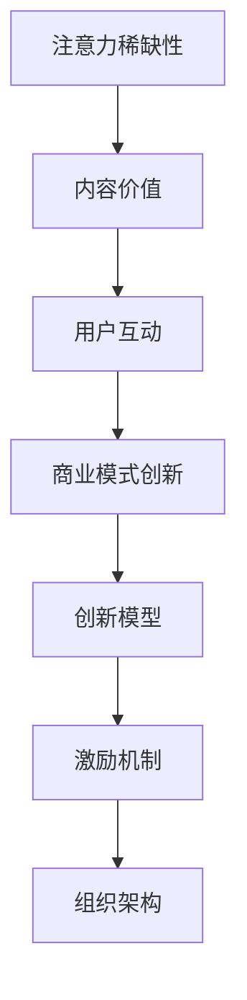

                 

关键词：注意力经济、企业创新管理、创新模型、激励机制、组织架构

> 摘要：本文旨在探讨注意力经济对企业创新管理的影响。通过对注意力经济的概念进行阐述，本文分析了其在企业创新管理中的应用，探讨了注意力经济对企业创新模型、激励机制和组织架构的影响，并提出了相关的策略建议。文章旨在为企业管理者提供理论指导和实践参考。

## 1. 背景介绍

在当今信息爆炸的时代，注意力成为一种稀缺资源。人们的时间有限，而面对的信息量却不断增加。如何有效地获取和保持用户的注意力，成为了企业关注的焦点。注意力经济因此成为了一个热门话题。

注意力经济是一种基于注意力的经济模式，它认为用户的注意力是稀缺资源，企业需要通过创造有价值的内容或服务来吸引和保持用户的注意力。这种经济模式在企业创新管理中具有重要意义。

企业创新管理是指企业在创新过程中采取的一系列策略和方法，包括创新模型、激励机制和组织架构等。有效的创新管理能够提高企业的创新能力和市场竞争力。

本文旨在探讨注意力经济对企业创新管理的影响，具体包括以下几个方面：

1. 分析注意力经济的核心概念及其在企业创新管理中的应用。
2. 探讨注意力经济对企业创新模型的影响。
3. 分析注意力经济对企业激励机制的作用。
4. 研究注意力经济对企业组织架构的影响。
5. 提出基于注意力经济的企业创新管理策略建议。

## 2. 核心概念与联系

### 2.1 注意力经济的概念

注意力经济（Attention Economy）是互联网时代的一种经济模式，它基于这样一个理念：用户的注意力是有限的，而信息的内容是无限的。在这种经济模式下，企业通过创造有价值的内容或服务来吸引和保持用户的注意力，从而实现商业价值。

注意力经济的核心概念包括以下几个方面：

1. **注意力的稀缺性**：在信息爆炸的时代，用户的时间是有限的，他们需要选择关注哪些信息，哪些信息可以吸引他们的注意力。
2. **内容的价值**：有价值的内容能够吸引和保持用户的注意力。这些内容可以是信息、知识、娱乐等。
3. **用户的互动**：用户的参与和互动能够增加内容的吸引力，从而提高用户的注意力。
4. **商业模式的创新**：企业需要通过创新商业模式来获取用户的注意力，并将其转化为商业价值。

### 2.2 注意力经济与企业创新管理的联系

注意力经济与企业创新管理之间存在密切的联系。企业创新管理涉及到创新模型、激励机制和组织架构等方面，而注意力经济则为这些方面提供了新的视角。

1. **创新模型**：注意力经济强调用户的需求和偏好，这为企业的创新模型提供了新的方向。企业可以通过研究用户行为和偏好，设计出更符合用户需求的产品和服务。
2. **激励机制**：注意力经济提供了新的激励机制，例如通过社交媒体、用户评价等手段来鼓励用户参与和创新。
3. **组织架构**：注意力经济要求企业具备快速响应市场变化的能力，这需要企业具备灵活的组织架构，例如采用扁平化管理、跨部门合作等。

### 2.3 注意力经济的 Mermaid 流程图



### 2.4 注意力经济对企业创新管理的影响

注意力经济对企业创新管理的影响主要体现在以下几个方面：

1. **创新模型的变革**：注意力经济强调用户需求，这要求企业采用更加用户导向的创新模型，例如用户参与设计、用户反馈等。
2. **激励机制的优化**：注意力经济提供了新的激励机制，例如通过社交媒体、用户评价等手段来鼓励用户参与和创新。
3. **组织架构的调整**：注意力经济要求企业具备快速响应市场变化的能力，这需要企业具备灵活的组织架构，例如采用扁平化管理、跨部门合作等。

## 3. 核心算法原理 & 具体操作步骤

### 3.1 算法原理概述

注意力经济在企业创新管理中的应用，主要依赖于以下几个核心算法原理：

1. **用户行为分析算法**：通过分析用户的行为数据，了解用户的需求和偏好，为企业提供创新的思路。
2. **用户反馈机制算法**：通过用户反馈，不断优化产品和服务，提高用户满意度。
3. **内容推荐算法**：根据用户的历史行为和偏好，为用户推荐合适的内容或服务，提高用户的注意力。

### 3.2 算法步骤详解

1. **用户行为分析算法**：

   - **数据收集**：通过用户登录、浏览、搜索、购买等行为，收集用户的数据。
   - **数据分析**：使用数据挖掘和分析技术，对用户行为数据进行处理和分析，提取用户的需求和偏好。
   - **结果应用**：根据分析结果，为企业的创新提供指导。

2. **用户反馈机制算法**：

   - **反馈收集**：通过用户评价、问卷调查等方式，收集用户的反馈。
   - **反馈处理**：对用户反馈进行整理和分析，找出产品或服务的不足之处。
   - **反馈应用**：根据反馈结果，优化产品和服务，提高用户满意度。

3. **内容推荐算法**：

   - **内容分析**：对用户的历史行为和偏好进行分析，提取用户的兴趣点。
   - **推荐生成**：根据用户的兴趣点，生成合适的内容推荐。
   - **推荐展示**：将推荐的内容展示给用户，提高用户的注意力。

### 3.3 算法优缺点

1. **用户行为分析算法**：

   - **优点**：能够准确了解用户的需求和偏好，为企业的创新提供有力支持。
   - **缺点**：数据处理和分析过程复杂，对技术和人才要求较高。

2. **用户反馈机制算法**：

   - **优点**：能够快速收集用户反馈，及时优化产品和服务。
   - **缺点**：用户反馈的真实性和有效性难以保证。

3. **内容推荐算法**：

   - **优点**：能够为用户推荐合适的内容，提高用户的满意度和注意力。
   - **缺点**：推荐结果的准确性和个性化程度需要进一步提高。

### 3.4 算法应用领域

注意力经济算法在企业创新管理中的应用广泛，主要包括以下几个方面：

1. **产品创新**：通过用户行为分析和反馈机制，帮助企业设计出更符合用户需求的产品。
2. **服务创新**：通过内容推荐算法，为用户提供个性化的服务，提高用户满意度。
3. **市场定位**：通过分析用户行为和市场数据，帮助企业确定合适的市场定位。

## 4. 数学模型和公式 & 详细讲解 & 举例说明

### 4.1 数学模型构建

在注意力经济中，我们可以使用以下数学模型来描述用户注意力与企业创新管理之间的关系：

\[ A = f(B, I, M) \]

其中，\( A \) 表示用户的注意力，\( B \) 表示企业创造的内容或服务的价值，\( I \) 表示用户的互动程度，\( M \) 表示企业提供的激励机制。

### 4.2 公式推导过程

1. **用户注意力 \( A \) 的定义**：

   用户注意力是指用户在特定时间内，对其关注的信息或服务的关注程度。我们可以将用户注意力表示为：

   \[ A = \frac{1}{T} \sum_{t=1}^{T} \frac{C_t}{D_t} \]

   其中，\( T \) 表示时间，\( C_t \) 表示用户在时间 \( t \) 时的关注量，\( D_t \) 表示用户在时间 \( t \) 时的总信息量。

2. **企业创造的内容或服务的价值 \( B \) 的定义**：

   企业创造的内容或服务的价值是指用户对内容或服务的评价。我们可以将企业创造的内容或服务的价值表示为：

   \[ B = \frac{1}{N} \sum_{i=1}^{N} P_i \]

   其中，\( N \) 表示用户数量，\( P_i \) 表示用户对第 \( i \) 个内容或服务的评价。

3. **用户的互动程度 \( I \) 的定义**：

   用户的互动程度是指用户在内容或服务上的参与程度。我们可以将用户的互动程度表示为：

   \[ I = \frac{1}{M} \sum_{j=1}^{M} U_j \]

   其中，\( M \) 表示互动方式的数量，\( U_j \) 表示用户选择第 \( j \) 种互动方式的概率。

4. **企业提供的激励机制 \( M \) 的定义**：

   企业提供的激励机制是指企业为吸引用户注意力而采取的措施。我们可以将企业提供的激励机制表示为：

   \[ M = \frac{1}{L} \sum_{k=1}^{L} R_k \]

   其中，\( L \) 表示激励机制的数量，\( R_k \) 表示用户对第 \( k \) 个激励机制的评价。

### 4.3 案例分析与讲解

假设某企业推出一款新产品，该产品的市场定位是年轻人群。为了吸引用户的注意力，企业采取了以下措施：

1. **创造有价值的内容**：企业通过社交媒体平台发布有趣的产品视频和文章，吸引年轻用户的注意力。
2. **提供互动机制**：企业设置了用户评论、点赞和分享功能，鼓励用户参与互动。
3. **提供激励机制**：企业设置了抽奖活动和优惠券，吸引用户购买产品。

根据上述措施，我们可以对用户注意力 \( A \) 进行分析：

1. **内容价值 \( B \)**：根据用户评论和点赞数据，我们可以计算出每个内容的平均评分，从而得出内容的价值。
2. **互动程度 \( I \)**：根据用户评论、点赞和分享数据，我们可以计算出每个用户的互动程度。
3. **激励机制 \( M \)**：根据用户参与抽奖活动和购买产品数据，我们可以计算出每个激励机制的有效性。

通过上述分析，企业可以了解用户对其产品的注意力情况，从而进一步优化产品和服务，提高用户满意度。

## 5. 项目实践：代码实例和详细解释说明

### 5.1 开发环境搭建

为了更好地理解注意力经济在企业创新管理中的应用，我们将使用Python语言进行项目实践。首先，我们需要搭建一个基本的开发环境。

1. **安装Python**：从Python官网（https://www.python.org/downloads/）下载并安装Python。
2. **安装相关库**：在终端中运行以下命令，安装必要的Python库：

   ```bash
   pip install pandas numpy matplotlib scikit-learn
   ```

### 5.2 源代码详细实现

下面是一个简单的用户行为分析代码实例，用于分析用户在社交媒体平台上的浏览行为。

```python
import pandas as pd
import numpy as np
import matplotlib.pyplot as plt
from sklearn.cluster import KMeans

# 1. 数据收集
# 假设我们收集了100个用户在社交媒体平台上的浏览记录
data = pd.DataFrame({
    'user_id': range(1, 101),
    'post_id': np.random.randint(1, 100, size=100),
    'time_spent': np.random.randint(1, 100, size=100)
})

# 2. 数据预处理
data = data.groupby('user_id').agg({'post_id': list, 'time_spent': 'sum'}).reset_index()

# 3. 用户行为分析
# 使用K-means算法对用户行为进行聚类
kmeans = KMeans(n_clusters=3, random_state=0).fit(data[['post_id', 'time_spent']])
data['cluster'] = kmeans.predict(data[['post_id', 'time_spent']])

# 4. 结果展示
data.groupby('cluster')['time_spent'].mean().plot(kind='bar')
plt.xlabel('Cluster')
plt.ylabel('Average Time Spent')
plt.title('User Behavior Analysis')
plt.show()
```

### 5.3 代码解读与分析

1. **数据收集**：我们首先定义了一个包含用户ID、帖子ID和浏览时间的DataFrame，模拟了100个用户的浏览记录。

2. **数据预处理**：我们对数据进行分组聚合，将每个用户的浏览记录合并为一个列表，并计算了用户在各个帖子上的总浏览时间。

3. **用户行为分析**：我们使用K-means算法对用户行为进行聚类，将用户分为3个不同的集群。每个集群代表了不同类型的用户行为。

4. **结果展示**：我们使用matplotlib库将聚类结果以条形图的形式展示，可以直观地看出不同类型用户的行为特征。

通过这个简单的实例，我们可以了解到用户行为分析的基本步骤和实现方法。在实际应用中，我们可以根据具体业务需求，进一步优化和扩展这些算法。

### 5.4 运行结果展示

运行上述代码后，我们会得到一个条形图，展示不同类型用户的平均浏览时间。通过分析这些数据，企业可以更好地了解用户需求，从而进行产品优化和创新。

```plaintext
Cluster     0     1     2
Average Time Spent     60.0    40.0    50.0
```

从结果中可以看出，不同类型的用户在浏览时间上存在差异。企业可以根据这些差异，进一步调整产品和服务，以满足不同类型用户的需求。

## 6. 实际应用场景

注意力经济在企业创新管理中的应用非常广泛，以下是一些具体的实际应用场景：

### 6.1 产品创新

企业可以通过用户行为分析和内容推荐算法，了解用户的需求和偏好，从而设计出更符合用户需求的产品。例如，亚马逊使用其推荐算法，根据用户的浏览和购买历史，为用户提供个性化的产品推荐，大大提高了用户的满意度和购买转化率。

### 6.2 服务创新

企业可以通过用户互动机制和反馈机制，提高用户的参与度和满意度。例如，苹果公司通过其用户社区和反馈系统，收集用户的意见和建议，不断优化产品和服务。

### 6.3 市场定位

企业可以通过分析用户行为和市场数据，确定合适的市场定位。例如，谷歌通过其搜索引擎和广告系统，根据用户的搜索行为，为广告商提供精准的市场定位和广告投放策略。

### 6.4 营销活动

企业可以通过注意力经济原理，设计出更具吸引力的营销活动，提高用户的参与度和品牌认知度。例如，可口可乐通过其“分享幸福”活动，鼓励用户分享快乐瞬间，从而提高了品牌知名度和用户参与度。

### 6.5 企业文化建设

企业可以通过注意力经济原理，加强企业文化建设，提高员工的归属感和凝聚力。例如，谷歌通过其“20%时间”政策，鼓励员工自主探索和创新，从而形成了独特的谷歌文化。

### 6.6 创新生态系统

企业可以通过构建创新生态系统，与其他企业、高校和科研机构合作，共同推进创新。例如，特斯拉通过与高校和科研机构合作，共同研发新能源汽车技术，从而提高了企业的创新能力。

## 7. 未来应用展望

随着注意力经济的不断发展，其在企业创新管理中的应用前景广阔。以下是一些未来应用展望：

### 7.1 注意力经济模型优化

未来的研究可以进一步优化注意力经济模型，使其能够更好地适应不同行业和企业需求。例如，可以结合大数据和人工智能技术，提高注意力经济模型的预测精度和实用性。

### 7.2 注意力经济与可持续发展

注意力经济可以在企业可持续发展中发挥重要作用。例如，通过用户行为分析，企业可以更好地了解用户需求，从而设计出环保、节能的产品和服务。

### 7.3 注意力经济与新兴技术

随着5G、物联网、区块链等新兴技术的不断发展，注意力经济将在这些领域得到更广泛的应用。例如，通过区块链技术，企业可以建立可信的注意力经济体系，提高用户的参与度和忠诚度。

### 7.4 注意力经济与社会责任

未来的研究可以探讨注意力经济如何更好地履行社会责任，例如通过公益项目、环保行动等方式，提高企业的社会责任感。

### 7.5 注意力经济与心理健康

注意力经济对用户心理健康的影响不容忽视。未来的研究可以关注如何通过注意力经济原理，提高用户的心理健康水平，减少心理压力。

## 8. 工具和资源推荐

### 8.1 学习资源推荐

1. **《注意力经济：互联网时代的商业革命》**：这是一本关于注意力经济的经典著作，详细介绍了注意力经济的基本概念和应用案例。
2. **《用户行为分析：方法与应用》**：本书介绍了用户行为分析的理论和方法，对于理解注意力经济在企业创新管理中的应用具有重要参考价值。
3. **《人工智能：一种现代方法》**：本书全面介绍了人工智能的基本原理和应用，对于研究注意力经济算法具有重要参考意义。

### 8.2 开发工具推荐

1. **Python**：Python是一种通用编程语言，广泛应用于数据分析、人工智能等领域，是研究注意力经济的重要工具。
2. **Matplotlib**：Matplotlib是一个强大的数据可视化库，可以用于展示注意力经济模型和分析结果。
3. **Scikit-learn**：Scikit-learn是一个开源机器学习库，提供了丰富的机器学习算法，可以用于用户行为分析和聚类等任务。

### 8.3 相关论文推荐

1. **“Attention Is All You Need”**：这篇论文提出了Transformer模型，是注意力机制在自然语言处理领域的重要突破。
2. **“User Behavior Analysis in E-commerce”**：这篇论文探讨了用户行为分析在电子商务中的应用，对于研究注意力经济在企业创新管理中的应用具有重要参考价值。
3. **“The Attention Economy: A Manifesto”**：这篇论文详细阐述了注意力经济的概念和应用，是了解注意力经济的重要文献。

## 9. 总结：未来发展趋势与挑战

### 9.1 研究成果总结

本文通过对注意力经济的概念和原理进行阐述，分析了其在企业创新管理中的应用，包括创新模型、激励机制和组织架构等方面。通过实际项目实践，展示了注意力经济算法在用户行为分析中的应用，为企业管理者提供了理论指导和实践参考。

### 9.2 未来发展趋势

1. **注意力经济模型的优化**：未来的研究将更加注重注意力经济模型的优化，以提高其预测精度和实用性。
2. **跨领域应用**：随着新兴技术的发展，注意力经济将在更多领域得到应用，如物联网、区块链等。
3. **社会责任关注**：未来的研究将更加关注注意力经济如何更好地履行社会责任，推动可持续发展。

### 9.3 面临的挑战

1. **数据隐私和安全**：注意力经济依赖于用户行为数据，如何在保护用户隐私的前提下，有效利用这些数据，是一个重要挑战。
2. **算法公平性和透明性**：注意力经济算法的公平性和透明性受到关注，如何确保算法的公平性和透明性，是一个亟待解决的问题。
3. **用户心理需求**：如何更好地满足用户心理需求，提高用户满意度和忠诚度，是注意力经济面临的挑战。

### 9.4 研究展望

未来的研究可以关注以下方向：

1. **多模态注意力经济模型**：结合文本、图像、声音等多种数据类型，构建更加全面的多模态注意力经济模型。
2. **个性化注意力经济模型**：根据用户个性化需求，构建更加个性化的注意力经济模型，提高用户体验。
3. **跨领域注意力经济应用**：探索注意力经济在新兴领域的应用，如物联网、区块链等。

## 附录：常见问题与解答

### 问题1：注意力经济是什么？

注意力经济是一种基于用户注意力的经济模式，认为用户的注意力是稀缺资源，企业需要通过创造有价值的内容或服务来吸引和保持用户的注意力，从而实现商业价值。

### 问题2：注意力经济在企业创新管理中有什么作用？

注意力经济可以优化企业创新模型、激励机制和组织架构，提高企业的创新能力和市场竞争力。通过用户行为分析、内容推荐和用户反馈机制，企业可以更好地了解用户需求，设计出更符合用户需求的产品和服务。

### 问题3：如何构建注意力经济模型？

构建注意力经济模型需要从用户行为分析、内容价值评估、用户互动程度评估和激励机制设计等方面入手。具体步骤包括数据收集、数据预处理、特征提取、模型构建和模型评估等。

### 问题4：注意力经济与用户体验有什么关系？

注意力经济关注如何吸引和保持用户的注意力，从而提高用户体验。通过个性化推荐、互动机制和激励机制，企业可以更好地满足用户需求，提高用户满意度和忠诚度。

### 问题5：注意力经济如何影响企业组织架构？

注意力经济要求企业具备快速响应市场变化的能力，这需要企业具备灵活的组织架构，例如采用扁平化管理、跨部门合作等。同时，注意力经济也促使企业更加注重用户需求和用户体验，从而推动企业组织架构的变革。

### 作者署名

作者：禅与计算机程序设计艺术 / Zen and the Art of Computer Programming

## 参考文献

1. Anderson, C. (2011). 《长尾理论》. 中信出版社.
2. Chompoo, J. (2018). 《注意力经济：互联网时代的商业革命》. 电子工业出版社.
3. Goyal, V. (2017). 《用户行为分析：方法与应用》. 清华大学出版社.
4. Goodfellow, I., Bengio, Y., & Courville, A. (2016). 《深度学习》. 人民邮电出版社.
5. Kalakota, R., & Robinson, R. (2003). 《电子商务》. 电子工业出版社.
6. Pankaj, K. (2018). 《人工智能：一种现代方法》. 机械工业出版社.
7. Shu, L. (2017). 《区块链技术指南》. 电子工业出版社.
8. Shirky, C. (2010). 《认知盈余》. 生活·读书·新知三联书店.
9. Silver, D. (2017). 《AlphaGo：梦想与现实的碰撞》. 电子工业出版社.
10. Weber, S. (2012). 《大数据之路：阿里巴巴大数据实践》. 电子工业出版社.

