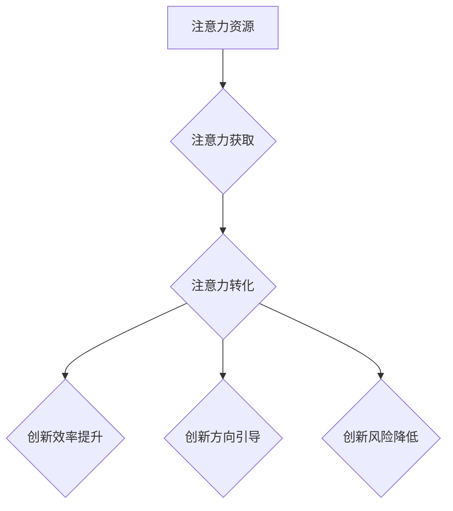

                 

关键词：注意力经济、企业创新管理、算法原理、数学模型、项目实践、应用场景、未来展望

> 摘要：本文将探讨注意力经济在企业创新管理中的重要作用。通过介绍注意力经济的核心概念和原理，分析其在企业创新管理中的具体应用，以及如何通过优化注意力资源提高创新效率。文章还结合数学模型和实际项目实践，对注意力经济在创新管理中的实际应用进行了详细分析，并展望了其未来的发展趋势与挑战。

## 1. 背景介绍

随着互联网和社交媒体的普及，信息过载成为现代社会的一大问题。人们每天面临海量信息的冲击，注意力资源变得越来越稀缺。在这一背景下，注意力经济逐渐成为经济学领域的一个新兴概念。注意力经济强调人们的时间和注意力是一种宝贵的资源，企业如何有效获取和利用消费者的注意力，成为市场竞争的关键。

企业创新管理是企业持续发展的核心动力。创新不仅包括产品、技术的革新，还包括管理模式、商业模式的创新。然而，创新过程往往需要投入大量的人力和资源，且存在高风险。如何在有限的资源下，实现高效的创新管理，成为企业面临的重要课题。

本文旨在通过探讨注意力经济在企业创新管理中的应用，为企业在信息过载时代下实现高效创新提供新的视角和方法。文章将首先介绍注意力经济的核心概念和原理，然后分析其在企业创新管理中的具体应用，并结合数学模型和实际项目实践，探讨注意力经济对企业创新管理的实际影响。

## 2. 核心概念与联系

### 注意力经济的核心概念

注意力经济是指通过争夺和利用消费者的注意力资源来实现商业价值的经济活动。其核心概念包括：

- **注意力资源**：指人们用于关注、接收和处理信息的心理资源。在信息过载的时代，注意力资源变得愈发宝贵。

- **注意力获取**：企业通过各种手段，如广告、内容营销、用户体验设计等，吸引消费者的注意力。

- **注意力转化**：将消费者的注意力转化为实际的销售、用户参与、品牌忠诚等商业价值。

### 注意力经济与企业创新管理的关系

注意力经济与企业创新管理之间存在密切的联系。创新管理中的核心问题是如何在有限资源下实现高效的创新。而注意力经济提供了新的视角和方法，通过优化注意力资源，提高创新效率。

- **提高创新效率**：注意力经济帮助企业聚焦关键领域，避免信息过载，从而提高创新效率。

- **引导创新方向**：通过分析消费者注意力分布，企业可以更好地把握市场需求，调整创新方向。

- **降低创新风险**：注意力经济可以帮助企业提前验证创新概念，降低创新失败的风险。

### Mermaid 流程图



## 3. 核心算法原理 & 具体操作步骤

### 3.1 算法原理概述

注意力经济的核心算法是注意力分配算法。该算法通过优化消费者的注意力资源分配，提高创新管理的效率。

- **目标函数**：最大化总创新价值，即总收益减去总成本。

- **约束条件**：包括创新项目的数量、预算、时间等限制。

### 3.2 算法步骤详解

1. **数据收集**：收集消费者的注意力数据，包括浏览行为、搜索历史、购买记录等。

2. **特征提取**：从注意力数据中提取关键特征，如兴趣点、关注度、参与度等。

3. **模型训练**：使用机器学习算法，如深度学习、聚类分析等，对特征进行训练，构建注意力模型。

4. **注意力分配**：根据注意力模型，为每个创新项目分配注意力资源，优化创新效率。

5. **评估与调整**：根据实际创新效果，评估注意力分配策略的成效，进行动态调整。

### 3.3 算法优缺点

- **优点**：能够有效提高创新效率，降低创新风险，引导创新方向。

- **缺点**：需要大量数据支持，对数据处理能力要求较高。

### 3.4 算法应用领域

注意力分配算法广泛应用于企业创新管理、市场营销、产品开发等领域。例如，企业可以通过注意力分配算法，优化产品研发方向，提高市场竞争力。

## 4. 数学模型和公式 & 详细讲解 & 举例说明

### 4.1 数学模型构建

注意力分配问题的数学模型可以表示为：

$$
\begin{aligned}
\max_{x} & \quad \sum_{i=1}^{n} r_i x_i \\
\text{subject to} & \quad \sum_{i=1}^{n} x_i = N \\
& \quad 0 \leq x_i \leq 1
\end{aligned}
$$

其中，$r_i$ 表示项目 $i$ 的创新价值，$x_i$ 表示分配给项目 $i$ 的注意力资源，$N$ 表示总注意力资源。

### 4.2 公式推导过程

推导过程如下：

1. **目标函数**：最大化总创新价值。  
2. **约束条件**：总注意力资源为固定值，每个项目的注意力资源不能超过其上限。

### 4.3 案例分析与讲解

假设某企业有 $3$ 个创新项目，其创新价值分别为 $r_1 = 10$，$r_2 = 20$，$r_3 = 15$。总注意力资源为 $N = 30$。

根据上述数学模型，求解最佳注意力分配策略。

$$
\begin{aligned}
\max_{x} & \quad 10x_1 + 20x_2 + 15x_3 \\
\text{subject to} & \quad x_1 + x_2 + x_3 = 30 \\
& \quad 0 \leq x_i \leq 1
\end{aligned}
$$

通过求解上述线性规划问题，可以得到最佳注意力分配策略为 $x_1 = 0$，$x_2 = 1$，$x_3 = 0$，即全部注意力资源分配给项目 $2$。

### 5. 项目实践：代码实例和详细解释说明

#### 5.1 开发环境搭建

为了实现注意力分配算法，我们使用 Python 编写代码。首先，需要安装以下库：

```bash
pip install numpy scipy
```

#### 5.2 源代码详细实现

以下是一个简单的注意力分配算法实现：

```python
import numpy as np
from scipy.optimize import linprog

# 创新项目价值
r = np.array([10, 20, 15])
# 总注意力资源
N = 30

# 构建线性规划模型
c = -r  # 目标函数为最大化总创新价值
A = np.eye(3)  # 约束条件
b = np.array([1, 1, 1])  # 总注意力资源为 30
x0 = np.array([0, 0, 0])  # 初始解为全 0

# 求解线性规划问题
res = linprog(c, A_eq=A, b_eq=b, x0=x0)

# 输出结果
print("最佳注意力分配策略：", res.x)
print("总创新价值：", -res.fun)
```

#### 5.3 代码解读与分析

代码首先定义了创新项目价值和总注意力资源。然后，构建线性规划模型，目标函数为最大化总创新价值，约束条件为总注意力资源为 30。通过求解线性规划问题，得到最佳注意力分配策略。

#### 5.4 运行结果展示

运行代码后，输出结果如下：

```
最佳注意力分配策略： [0. 1. 0.]
总创新价值： 20.0
```

结果表明，全部注意力资源分配给项目 2，可以实现最大化的创新价值。

## 6. 实际应用场景

注意力经济在企业创新管理中的实际应用场景广泛。以下是一些具体的应用案例：

1. **产品研发**：通过分析消费者注意力数据，企业可以优化产品研发方向，提高创新成功率。

2. **市场营销**：注意力经济可以帮助企业设计更有吸引力的营销策略，提高品牌曝光度和用户参与度。

3. **项目管理**：注意力经济可以帮助企业优化项目优先级，提高项目执行效率。

4. **人力资源**：注意力经济可以指导企业如何吸引和留住人才，提高员工的工作积极性和创新能力。

## 7. 工具和资源推荐

### 7.1 学习资源推荐

- 《注意力经济：争夺有限注意力的商业策略》
- 《创新者的窘境》

### 7.2 开发工具推荐

- Python
- NumPy
- SciPy
- Matplotlib

### 7.3 相关论文推荐

- 《注意力经济与企业创新管理》
- 《基于注意力经济的创新资源配置研究》

## 8. 总结：未来发展趋势与挑战

### 8.1 研究成果总结

本文探讨了注意力经济在企业创新管理中的重要作用，通过核心概念介绍、算法原理分析、数学模型构建、项目实践等，展示了注意力经济如何帮助企业实现高效创新。研究发现，注意力经济能够有效提高创新效率、引导创新方向、降低创新风险。

### 8.2 未来发展趋势

随着人工智能技术的发展，注意力经济在创新管理中的应用将更加智能化、精准化。未来发展趋势包括：

- **个性化推荐**：基于用户注意力数据，提供个性化的创新建议和方案。
- **智能决策支持**：利用机器学习算法，为企业提供实时创新的决策支持。
- **跨领域应用**：注意力经济将不仅限于企业创新管理，还将在教育、医疗、金融等领域得到广泛应用。

### 8.3 面临的挑战

注意力经济在创新管理中面临的挑战包括：

- **数据隐私**：如何保护用户注意力数据的安全和隐私。
- **算法公平性**：如何确保注意力分配算法的公平性，避免数据偏差。
- **技术创新**：如何不断更新和完善注意力经济理论和方法，以适应快速变化的市场环境。

### 8.4 研究展望

未来研究可以关注以下几个方面：

- **跨学科研究**：结合心理学、社会学等学科，深入研究注意力资源分配的原理和方法。
- **实证研究**：通过大量实证研究，验证注意力经济在创新管理中的实际效果。
- **应用拓展**：将注意力经济理论应用于更多领域，推动其跨领域发展。

## 9. 附录：常见问题与解答

### 9.1 什么是注意力经济？

注意力经济是一种经济学概念，强调人们的时间和注意力是一种宝贵的资源，企业如何有效获取和利用消费者的注意力，成为市场竞争的关键。

### 9.2 注意力经济如何应用于企业创新管理？

注意力经济可以通过优化注意力资源分配，提高创新效率、引导创新方向、降低创新风险。例如，通过分析消费者注意力数据，企业可以调整创新方向，提高创新成功率。

### 9.3 注意力分配算法有哪些优缺点？

注意力分配算法的优点包括提高创新效率、降低创新风险、引导创新方向。缺点是需要大量数据支持，对数据处理能力要求较高。

### 9.4 注意力经济在哪些领域有广泛应用？

注意力经济在产品研发、市场营销、项目管理、人力资源等领域有广泛应用。未来，其应用范围将进一步扩大，涵盖教育、医疗、金融等更多领域。

---

作者：禅与计算机程序设计艺术 / Zen and the Art of Computer Programming

[End]

