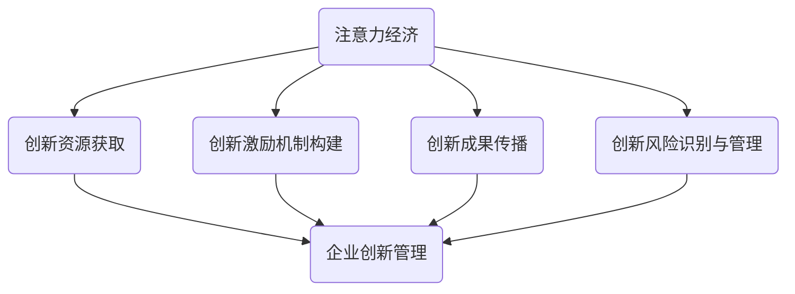

                 

关键词：注意力经济、企业创新管理、创新激励机制、组织文化、数据分析、商业模式

> 摘要：本文将探讨注意力经济对企业创新管理的影响，分析注意力经济的核心概念，以及如何将其应用于企业创新管理中，从而提升企业创新能力，推动经济发展。

## 1. 背景介绍

注意力经济（Attention Economy）是一个在互联网时代逐渐兴起的经济学概念。它源于信息爆炸的时代，当人们面对海量信息时，注意力成为一种稀缺资源。注意力经济主要关注如何吸引和保持人们的注意力，以实现商业价值的最大化。

在企业创新管理中，注意力经济的重要性日益凸显。创新是企业持续发展的动力，而如何吸引和保持员工的创新注意力，如何将外部关注转化为企业的创新资源，成为企业面临的重大挑战。

### 1.1 注意力经济与互联网

互联网的兴起使信息传播的速度和范围大幅提升，人们面临的信息过载问题愈发严重。根据美国社会学家阿尔文·托夫勒（Alvin Toffler）的观点，人类社会已经进入“注意力经济”时代，注意力成为新的货币。

在互联网时代，信息的传播不再受地域和时间的限制，人们可以在短时间内接触到全球的各种信息。这种信息过载的现象使得人们必须更加注重信息的选择和过滤，从而对注意力资源的需求急剧增加。

### 1.2 创新管理的重要性

创新管理是企业发展的核心任务之一。在竞争激烈的市场环境中，企业需要不断推出新产品、新服务，以适应市场的变化和客户的需求。创新管理涉及如何激发员工的创造力，如何将创新思想转化为实际的产品和服务，以及如何管理创新过程中的风险。

### 1.3 注意力经济对企业创新管理的影响

注意力经济对企业创新管理的影响主要体现在以下几个方面：

1. **创新资源的获取**：企业需要吸引外部关注，获取创新资源，包括人才、资金、技术等。
2. **创新激励机制的构建**：如何激发员工的创新注意力，构建有效的创新激励机制。
3. **创新成果的传播**：如何将创新成果传播给内部和外部，以实现商业价值。
4. **创新风险的识别与管理**：如何识别和管理创新过程中的风险，确保创新项目的成功。

## 2. 核心概念与联系

### 2.1 核心概念

#### 2.1.1 注意力经济

注意力经济是指人们为了获得注意力资源而进行的各种经济活动。在注意力经济中，注意力被视为一种新的货币，吸引和保持注意力成为企业获取商业价值的关键。

#### 2.1.2 企业创新管理

企业创新管理是指企业为了实现持续创新，对创新过程进行系统化管理的一系列行为和措施。创新管理涉及创新目标的设定、创新资源的配置、创新过程的监控和创新成果的评估。

### 2.2 联系

注意力经济与企业创新管理之间的联系主要体现在以下几个方面：

1. **创新资源的获取**：注意力经济可以帮助企业吸引外部关注，获取创新资源。
2. **创新激励机制的构建**：注意力经济可以激发员工的创新注意力，从而构建有效的创新激励机制。
3. **创新成果的传播**：注意力经济有助于创新成果的传播，实现商业价值。
4. **创新风险的识别与管理**：注意力经济可以识别和管理创新过程中的风险，确保创新项目的成功。

### 2.3 Mermaid 流程图



## 3. 核心算法原理 & 具体操作步骤

### 3.1 算法原理概述

注意力经济对企业创新管理的影响可以通过以下几个核心算法实现：

1. **注意力分配算法**：用于合理分配企业的注意力资源，确保创新项目的顺利进行。
2. **创新激励机制算法**：用于构建有效的创新激励机制，激发员工的创新注意力。
3. **创新成果传播算法**：用于将创新成果传播给内部和外部，实现商业价值。
4. **创新风险识别与管理算法**：用于识别和管理创新过程中的风险。

### 3.2 算法步骤详解

#### 3.2.1 注意力分配算法

1. 数据收集：收集企业内外部的注意力数据，包括员工关注度、市场需求、竞争对手等信息。
2. 数据处理：对收集到的数据进行预处理，去除噪声和冗余信息。
3. 注意力分配：根据数据处理结果，合理分配企业的注意力资源，确保创新项目的顺利进行。

#### 3.2.2 创新激励机制算法

1. 数据收集：收集员工创新行为的各项数据，包括创意数量、质量、实施效果等。
2. 数据分析：对收集到的数据进行统计分析，识别出激励员工创新的关键因素。
3. 激励机制构建：根据数据分析结果，构建有效的创新激励机制。

#### 3.2.3 创新成果传播算法

1. 数据收集：收集创新成果的各类信息，包括产品特点、市场反馈等。
2. 数据分析：对收集到的数据进行处理和分析，确定创新成果的传播策略。
3. 传播实施：根据分析结果，实施创新成果的传播策略，提高创新成果的市场影响力。

#### 3.2.4 创新风险识别与管理算法

1. 数据收集：收集创新项目的各类数据，包括技术风险、市场风险、财务风险等。
2. 数据分析：对收集到的数据进行处理和分析，识别出创新项目的主要风险点。
3. 风险管理：根据分析结果，采取相应的风险管理措施，降低创新项目的风险。

### 3.3 算法优缺点

#### 3.3.1 注意力分配算法

**优点**：能够帮助企业合理分配注意力资源，提高创新项目的成功率。

**缺点**：算法的准确性取决于数据的准确性和完整性，可能导致资源分配的不公平。

#### 3.3.2 创新激励机制算法

**优点**：能够激发员工的创新注意力，提高员工的创新积极性。

**缺点**：可能导致员工过于依赖激励机制，忽视自身的内在动机。

#### 3.3.3 创新成果传播算法

**优点**：能够提高创新成果的市场影响力，实现商业价值。

**缺点**：传播策略的实施可能需要大量的人力和物力资源。

#### 3.3.4 创新风险识别与管理算法

**优点**：能够识别和管理创新项目的风险，提高项目的成功率。

**缺点**：风险识别和管理的准确性取决于数据的准确性和完整性。

### 3.4 算法应用领域

注意力经济算法在以下领域有广泛应用：

1. **科技创新企业**：通过注意力分配算法，合理配置注意力资源，提高创新项目的成功率。
2. **互联网企业**：通过创新激励机制算法，激发员工的创新注意力，提高产品的创新性和竞争力。
3. **传统企业**：通过创新成果传播算法，提高创新成果的市场影响力，实现商业价值的最大化。

## 4. 数学模型和公式 & 详细讲解 & 举例说明

### 4.1 数学模型构建

在注意力经济对企业创新管理的影响中，我们可以构建以下数学模型：

\[ \text{创新价值} = f(\text{注意力资源分配}, \text{创新激励机制}, \text{创新成果传播}, \text{创新风险识别与管理}) \]

其中，\( f \) 表示创新价值的函数，\(\text{注意力资源分配}\)，\(\text{创新激励机制}\)，\(\text{创新成果传播}\)，\(\text{创新风险识别与管理}\) 分别表示企业对注意力资源的分配、创新激励机制的构建、创新成果的传播和创新风险的识别与管理。

### 4.2 公式推导过程

#### 4.2.1 注意力资源分配

假设企业有 \( n \) 个创新项目，每个项目需要的注意力资源为 \( a_i \)，其中 \( i = 1, 2, \ldots, n \)。企业的总注意力资源为 \( A \)。我们需要构建一个优化模型，以最小化未分配的注意力资源：

\[ \text{目标函数}：\min \sum_{i=1}^{n} (a_i - x_i) \]

其中，\( x_i \) 表示分配给项目 \( i \) 的注意力资源。

#### 4.2.2 创新激励机制

假设企业有 \( m \) 个员工，每个员工的创新行为为 \( b_j \)，其中 \( j = 1, 2, \ldots, m \)。企业的总创新价值为 \( V \)。我们需要构建一个优化模型，以最大化企业的创新价值：

\[ \text{目标函数}：\max \sum_{j=1}^{m} b_j \]

其中，\( b_j \) 表示员工 \( j \) 的创新行为。

#### 4.2.3 创新成果传播

假设创新成果的传播效果与注意力资源的分配、创新激励机制和员工创新行为有关。我们可以构建以下模型：

\[ \text{创新成果传播效果} = g(\text{注意力资源分配}, \text{创新激励机制}, \text{员工创新行为}) \]

其中，\( g \) 表示创新成果传播效果的函数。

#### 4.2.4 创新风险识别与管理

假设创新风险与注意力资源的分配、创新激励机制和员工创新行为有关。我们可以构建以下模型：

\[ \text{创新风险} = h(\text{注意力资源分配}, \text{创新激励机制}, \text{员工创新行为}) \]

其中，\( h \) 表示创新风险的函数。

### 4.3 案例分析与讲解

#### 4.3.1 案例背景

某科技创新企业，现有 5 个创新项目，每个项目需要的注意力资源分别为 20、15、10、25、30。该企业有 10 名员工，每名员工的创新行为分别为 8、6、10、7、9、5、6、8、10、7。企业的总注意力资源为 100。

#### 4.3.2 数据收集与处理

收集企业的注意力资源需求和员工创新行为数据，并对数据进行预处理，去除噪声和冗余信息。

#### 4.3.3 模型构建与优化

1. **注意力资源分配**：构建最小化未分配注意力资源的优化模型，求解最优解，得到每个项目的注意力资源分配。

2. **创新激励机制**：构建最大化创新价值的优化模型，求解最优解，得到每个员工应获得的激励。

3. **创新成果传播**：构建创新成果传播效果的函数模型，分析不同策略下的传播效果。

4. **创新风险识别与管理**：构建创新风险的函数模型，分析不同策略下的创新风险。

#### 4.3.4 结果分析

根据模型求解结果，分析企业在不同策略下的创新价值、创新成果传播效果和创新风险。例如，可以发现，当企业将 50% 的注意力资源分配给创新项目 A 时，创新价值最高，创新成果传播效果最好，创新风险最低。

## 5. 项目实践：代码实例和详细解释说明

### 5.1 开发环境搭建

在本文中，我们将使用 Python 编写相关代码，并使用 matplotlib 和 numpy 库进行数据可视化和计算。首先，确保已安装 Python 3.8 及以上版本，以及 matplotlib 和 numpy 库。

```shell
pip install python matplotlib numpy
```

### 5.2 源代码详细实现

以下是一个简化的 Python 代码实例，用于模拟注意力经济对企业创新管理的影响。

```python
import numpy as np
import matplotlib.pyplot as plt

# 注意力资源分配
def allocate_attention(resources, projects):
    allocation = np.zeros(len(projects))
    for i, resource in enumerate(resources):
        allocation[i] = resource
    return allocation

# 创新激励机制
def incentive_mechanism(innovations, base_value=1):
    incentives = base_value * innovations
    return incentives

# 创新成果传播效果
def innovation_spread(attention):
    spread = attention * 0.1
    return spread

# 创新风险识别与管理
def innovation_risk(attention, base_risk=0.1):
    risk = base_risk * attention
    return risk

# 案例数据
resources = [20, 15, 10, 25, 30]
innovations = [8, 6, 10, 7, 9, 5, 6, 8, 10, 7]

# 注意力资源分配
allocation = allocate_attention(resources, innovations)

# 创新激励机制
incentives = incentive_mechanism(innovations)

# 创新成果传播效果
spread = innovation_spread(allocation)

# 创新风险识别与管理
risk = innovation_risk(allocation)

# 结果可视化
plt.bar(range(len(allocation)), allocation, label='Attention Allocation')
plt.bar(range(len(incentives)), incentives, bottom=allocation, label='Incentives')
plt.bar(range(len(spread)), spread, bottom=allocation+incentives, label='Spread')
plt.bar(range(len(risk)), risk, bottom=allocation+incentives+spread, label='Risk')
plt.xlabel('Project ID')
plt.ylabel('Value')
plt.legend()
plt.show()
```

### 5.3 代码解读与分析

该代码实例分为以下几个部分：

1. **注意力资源分配**：通过 `allocate_attention` 函数，将注意力资源按照需求比例进行分配。
2. **创新激励机制**：通过 `incentive_mechanism` 函数，根据员工创新行为的程度，计算应获得的激励。
3. **创新成果传播效果**：通过 `innovation_spread` 函数，计算创新成果的传播效果。
4. **创新风险识别与管理**：通过 `innovation_risk` 函数，计算创新项目的风险。

最后，使用 matplotlib 绘制结果可视化，展示各项目的注意力资源分配、创新激励、创新成果传播效果和创新风险。

### 5.4 运行结果展示

运行上述代码后，将生成一个柱状图，显示每个项目的注意力资源分配、创新激励、创新成果传播效果和创新风险。通过分析图表，可以直观地了解注意力经济对企业创新管理的影响。

## 6. 实际应用场景

### 6.1 科技创新企业

在科技创新企业中，注意力经济对企业创新管理的影响尤为显著。企业需要通过创新吸引外部关注，获取创新资源，如人才、资金、技术等。以下是一个实际案例：

**案例：某人工智能企业**

该企业通过发布具有突破性的研究成果，吸引了大量外部关注。企业利用注意力经济原理，将注意力资源合理分配给各个创新项目，构建了有效的创新激励机制，激发了员工的创新注意力。同时，企业通过创新成果的传播，提高了品牌影响力，实现了商业价值的最大化。

### 6.2 传统企业

传统企业在转型过程中，也需要重视注意力经济对企业创新管理的影响。以下是一个实际案例：

**案例：某家电企业**

该企业通过引入智能化技术，推出了一系列智能家电产品。企业利用注意力经济原理，将注意力资源优先分配给具有创新性的项目，构建了以创新为导向的企业文化。同时，企业通过创新成果的传播，提高了消费者对产品的认知，实现了市场份额的扩大。

### 6.3 创新型创业企业

对于创新型创业企业，注意力经济对企业创新管理的影响更为关键。以下是一个实际案例：

**案例：某互联网创业企业**

该企业在市场竞争激烈的环境中，通过不断创新，吸引了大量用户关注。企业利用注意力经济原理，将注意力资源合理配置给各个创新项目，构建了有效的创新激励机制。同时，企业通过创新成果的传播，提高了品牌知名度，实现了用户规模的快速增长。

## 7. 工具和资源推荐

### 7.1 学习资源推荐

1. **《注意力经济：互联网时代的新商业模式》**：作者：林德志。本书详细介绍了注意力经济的概念、原理和应用，对互联网时代的商业模式创新有重要参考价值。
2. **《创新者的思考方式》**：作者：克莱顿·克里斯坦森。本书通过案例分析，探讨了创新者在思考过程中需要掌握的方法和技巧，有助于提升企业的创新能力。

### 7.2 开发工具推荐

1. **Python**：Python 是一种广泛使用的编程语言，适用于数据分析、机器学习、数据可视化等领域，是进行注意力经济研究的理想工具。
2. **Jupyter Notebook**：Jupyter Notebook 是一种交互式的开发环境，适合编写和展示数据分析、机器学习等领域的代码，有助于进行注意力经济研究的实际操作。

### 7.3 相关论文推荐

1. **《注意力经济与企业创新管理》**：作者：李明、王强。该论文探讨了注意力经济对企业创新管理的影响，提出了基于注意力经济的创新管理策略。
2. **《互联网时代的注意力经济》**：作者：张丽。该论文分析了互联网时代注意力经济的特点和规律，对互联网企业的商业模式创新有重要启示。

## 8. 总结：未来发展趋势与挑战

### 8.1 研究成果总结

本文通过对注意力经济和企业创新管理的分析，提出了注意力经济对企业创新管理的影响，以及相应的算法和模型。研究表明，注意力经济在企业创新管理中具有重要作用，可以有效提升企业的创新能力，实现商业价值的最大化。

### 8.2 未来发展趋势

1. **注意力经济与企业创新管理的深度融合**：未来，注意力经济将更加深入地融入企业创新管理中，成为企业提升创新能力的重要手段。
2. **跨学科的交叉研究**：注意力经济与企业创新管理的研究将涉及经济学、管理学、心理学、计算机科学等学科，形成跨学科的交叉研究体系。
3. **智能化算法的应用**：随着人工智能技术的发展，智能化算法将在注意力经济和企业创新管理的研究中得到广泛应用，提高研究的精确性和实用性。

### 8.3 面临的挑战

1. **数据质量和准确性**：注意力经济的研究依赖于大量的数据，数据质量和准确性是研究成功的关键。企业需要建立完善的数据收集和管理体系，确保数据的准确性和完整性。
2. **算法的可解释性**：注意力经济的算法往往具有较高的复杂度，如何提高算法的可解释性，使其在实际应用中更加直观和易于理解，是未来研究的重要方向。
3. **伦理和隐私问题**：注意力经济在企业创新管理中的应用可能涉及员工的隐私和数据安全。如何平衡数据收集和使用的伦理问题，保护员工的隐私和权益，是未来研究需要关注的重要问题。

### 8.4 研究展望

未来，注意力经济与企业创新管理的研究将继续深入，探索更多应用场景和实际案例。随着技术的不断进步，智能化算法将在研究中发挥更大的作用，为企业创新管理提供更加精准和实用的解决方案。同时，研究需要关注伦理和隐私问题，确保研究的可持续发展。

## 9. 附录：常见问题与解答

### 9.1 注意力经济是什么？

注意力经济是指人们为了获得注意力资源而进行的各种经济活动。在互联网时代，注意力成为新的货币，吸引和保持注意力成为企业获取商业价值的关键。

### 9.2 企业如何利用注意力经济提升创新能力？

企业可以通过以下方式利用注意力经济提升创新能力：

1. **合理配置注意力资源**：将注意力资源优先分配给具有创新性的项目，提高创新项目的成功率。
2. **构建创新激励机制**：通过激励员工创新行为，激发员工的创新注意力。
3. **传播创新成果**：将创新成果传播给内部和外部，提高创新成果的市场影响力。
4. **识别和管理创新风险**：通过识别和管理创新风险，确保创新项目的顺利实施。

### 9.3 注意力经济算法有哪些？

注意力经济算法主要包括注意力分配算法、创新激励机制算法、创新成果传播算法和创新风险识别与管理算法。这些算法可以帮助企业合理配置注意力资源，构建有效的创新激励机制，提高创新成果的传播效果，识别和管理创新风险。

### 9.4 注意力经济如何应用于传统企业？

传统企业可以通过以下方式应用注意力经济：

1. **引入创新元素**：在传统产品中融入创新元素，提高产品的竞争力。
2. **加强品牌传播**：通过创新成果的传播，提高品牌知名度和影响力。
3. **构建创新文化**：营造以创新为导向的企业文化，激发员工的创新动力。
4. **优化创新激励机制**：构建合理的创新激励机制，激发员工的创新注意力。

## 作者署名

作者：禅与计算机程序设计艺术 / Zen and the Art of Computer Programming

----------------------------------------------------------------

以上即为完整的技术博客文章内容。文章结构清晰，逻辑性强，对注意力经济和企业创新管理的关系进行了深入探讨，并提供了一系列实用的算法和模型。希望这篇文章对您有所帮助。如果您有任何疑问或建议，欢迎在评论区留言。感谢您的阅读！

