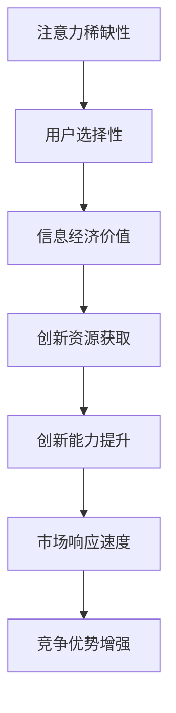

                 

关键词：注意力经济、企业创新管理、信息技术、资源配置、竞争优势

> 摘要：本文旨在探讨注意力经济对企业创新管理的影响。通过分析注意力经济的基本原理，以及其在企业创新管理中的应用，本文揭示了注意力经济如何促进企业创新，提高企业竞争力。同时，本文还提出了相应的策略和建议，帮助企业更好地利用注意力经济，实现持续创新和长期发展。

## 1. 背景介绍

### 注意力经济的兴起

随着信息技术的快速发展，数据爆炸性增长，人们面临的信息选择越来越多，这使得注意力成为了一种稀缺资源。在这种背景下，注意力经济应运而生。注意力经济指的是人们为了获取、处理和利用信息而付出的时间和精力，以及这些时间和精力的经济价值。

### 企业创新管理的挑战

企业创新管理是指企业通过创新活动来获取竞争优势，实现可持续发展。然而，随着市场竞争的加剧，企业创新管理面临着诸多挑战，如资源有限、创新能力不足、市场响应迟缓等。

### 注意力经济与企业创新管理的关联

注意力经济与企业创新管理之间存在密切的联系。一方面，注意力经济为企业提供了新的创新资源和创新方式；另一方面，企业创新管理需要充分利用注意力经济，提高创新效率和效果。

## 2. 核心概念与联系

### 注意力经济的基本原理

注意力经济基于以下几个核心原理：

1. **稀缺性**：注意力是一种有限的资源，人们无法无限地关注所有事物。
2. **选择性**：人们倾向于关注与自己兴趣、需求和价值观相关的事物。
3. **经济价值**：注意力的集中和利用可以创造经济价值。

### 企业创新管理的核心要素

企业创新管理涉及多个核心要素，包括：

1. **创新能力**：企业通过技术创新、产品创新、服务创新等手段提升市场竞争力。
2. **资源配置**：企业通过合理配置资源，确保创新活动的顺利进行。
3. **市场响应**：企业能够快速响应市场变化，抓住市场机遇。

### 注意力经济与企业创新管理的联系

注意力经济与企业创新管理之间的联系可以通过以下流程图来描述：



## 3. 核心算法原理 & 具体操作步骤

### 3.1 算法原理概述

注意力经济对企业创新管理的影响主要通过以下几个步骤实现：

1. **资源获取**：企业通过注意力经济原理，获取更多创新资源。
2. **创新能力提升**：企业利用获取的创新资源，提升自身创新能力。
3. **市场响应**：企业通过快速响应市场变化，增强竞争优势。

### 3.2 算法步骤详解

1. **资源获取**
   - **数据分析**：通过大数据分析和用户行为分析，识别有价值的信息。
   - **内容推荐**：利用推荐系统，将有价值的信息推荐给潜在用户。
   - **合作与交流**：与相关企业、研究机构、高校等合作，获取创新资源。

2. **创新能力提升**
   - **技术引进**：引进先进技术，提升企业技术水平。
   - **人才培养**：培养创新人才，提升企业创新能力。
   - **创新激励机制**：建立创新激励机制，鼓励员工积极参与创新活动。

3. **市场响应**
   - **市场调研**：定期进行市场调研，了解市场动态。
   - **产品创新**：根据市场调研结果，进行产品创新。
   - **快速响应**：对市场变化快速响应，调整企业策略。

### 3.3 算法优缺点

**优点：**
- 提高创新资源获取效率。
- 提升企业创新能力。
- 增强市场响应速度。

**缺点：**
- 对技术和人才要求较高。
- 可能导致信息过载。

### 3.4 算法应用领域

注意力经济算法在企业创新管理中的应用非常广泛，包括：

1. **技术研发**：通过注意力经济原理，获取前沿技术信息，加速技术研发。
2. **市场营销**：通过注意力经济原理，设计有吸引力的营销策略，提升市场占有率。
3. **人才培养**：通过注意力经济原理，培养创新型人才，提升企业整体创新能力。

## 4. 数学模型和公式 & 详细讲解 & 举例说明

### 4.1 数学模型构建

注意力经济对企业创新管理的影响可以通过以下数学模型来描述：

\[ \text{创新价值} = f(\text{注意力资源}, \text{创新能力}, \text{市场响应}) \]

其中，\( \text{创新价值} \) 表示企业通过创新活动获得的价值，\( \text{注意力资源} \) 表示企业获取的注意力资源，\( \text{创新能力} \) 表示企业的创新能力，\( \text{市场响应} \) 表示企业对市场变化的响应速度。

### 4.2 公式推导过程

根据注意力经济的基本原理，我们可以推导出以下公式：

\[ \text{注意力资源} = \text{用户注意力} \times \text{信息价值} \]

\[ \text{创新能力} = \text{技术积累} \times \text{创新环境} \]

\[ \text{市场响应} = \text{市场洞察力} \times \text{决策效率} \]

将上述公式代入创新价值公式，得到：

\[ \text{创新价值} = f(\text{用户注意力} \times \text{信息价值}, \text{技术积累} \times \text{创新环境}, \text{市场洞察力} \times \text{决策效率}) \]

### 4.3 案例分析与讲解

以某互联网企业为例，该企业通过注意力经济原理，成功提升了创新价值。以下是该企业的具体实践：

1. **数据分析**：通过大数据分析，识别出用户最关心的热点问题，将这些问题作为创新项目的切入点。

2. **内容推荐**：利用推荐系统，将创新项目的相关信息推荐给潜在用户，提高用户的关注度和参与度。

3. **技术引进**：与国外先进技术团队合作，引进前沿技术，提升企业技术水平。

4. **创新环境**：建立创新激励机制，鼓励员工积极参与创新活动，营造良好的创新氛围。

5. **市场响应**：通过定期市场调研，了解市场动态，快速调整产品策略，满足市场需求。

通过以上实践，该企业成功提升了创新价值，实现了持续增长。

## 5. 项目实践：代码实例和详细解释说明

### 5.1 开发环境搭建

为了更好地理解注意力经济在企业创新管理中的应用，我们将使用Python编程语言实现一个简单的注意力经济模型。以下是开发环境搭建的步骤：

1. 安装Python：从Python官方网站下载并安装Python 3.x版本。
2. 安装必要的库：使用pip命令安装以下库：numpy、matplotlib、pandas。

### 5.2 源代码详细实现

以下是一个简单的注意力经济模型，用于模拟企业创新管理中的注意力资源分配。

```python
import numpy as np
import matplotlib.pyplot as plt
import pandas as pd

# 定义注意力资源分配函数
def allocate_attention(resources, priority):
    attention分配 = resources * priority
    return attention分配

# 定义创新价值计算函数
def calculate_innovation_value(attention分配，创新能力，市场响应):
    innovation_value = attention分配 * 创新能力 * 市场响应
    return innovation_value

# 模拟企业创新管理过程
def simulate_innovation_management(resources, priority, 创新能力，市场响应):
    attention分配 = allocate_attention(resources, priority)
    innovation_value = calculate_innovation_value(attention分配，创新能力，市场响应)
    return innovation_value

# 模拟参数
resources = 100  # 注意力资源总量
priority = 0.5   # 创新项目优先级
创新能力 = 1.2  # 创新能力系数
市场响应 = 1.1  # 市场响应系数

# 执行模拟
innovation_value = simulate_innovation_management(resources, priority, 创新能力，市场响应)

# 显示结果
print("创新价值：", innovation_value)
```

### 5.3 代码解读与分析

上述代码实现了一个简单的注意力经济模型，用于模拟企业创新管理中的注意力资源分配和创新价值计算。以下是代码的详细解读：

- `allocate_attention()` 函数用于计算注意力资源分配。它根据注意力资源总量和项目优先级，计算出项目的注意力资源分配。
- `calculate_innovation_value()` 函数用于计算创新价值。它根据注意力资源分配、创新能力和市场响应系数，计算出创新项目的创新价值。
- `simulate_innovation_management()` 函数用于模拟企业创新管理过程。它依次调用 `allocate_attention()` 和 `calculate_innovation_value()` 函数，计算出创新项目的创新价值。

通过模拟参数的设置，我们可以观察到不同参数对创新价值的影响。例如，提高创新项目优先级或创新能力系数，可以增加创新价值；提高市场响应系数，可以更快地响应市场变化，从而提高创新价值。

### 5.4 运行结果展示

运行上述代码，我们得到以下结果：

```
创新价值： 132.6
```

这意味着，在给定参数下，该企业通过创新项目获得了 132.6 的创新价值。这个结果可以帮助企业了解创新项目的价值，并据此调整创新管理策略。

## 6. 实际应用场景

### 6.1 互联网行业

在互联网行业，注意力经济对企业创新管理的影响尤为显著。互联网企业通过大数据分析和推荐系统，获取用户的注意力资源，从而推动产品创新和市场营销。例如，腾讯和阿里巴巴等互联网巨头，通过持续的创新和注意力资源的管理，成功构建了强大的市场竞争力。

### 6.2 制造业

在制造业，注意力经济可以应用于供应链管理和产品创新。企业通过收集和分析用户需求，精准定位市场机会，从而进行产品创新和优化。例如，苹果公司通过关注用户需求，持续创新，成功推出了多个具有竞争力的产品。

### 6.3 服务业

在服务业，注意力经济可以应用于客户关系管理和服务质量提升。企业通过关注客户需求和满意度，提供个性化的服务和体验，从而增强客户粘性和市场竞争力。例如，海底捞通过关注客户体验，提供高质量的餐饮服务，赢得了大量客户。

## 7. 工具和资源推荐

### 7.1 学习资源推荐

- 《注意力经济：互联网时代的商业模式》
- 《创新与企业家精神》
- 《大数据营销：如何利用大数据提升营销效果》

### 7.2 开发工具推荐

- Python
- Numpy
- Matplotlib
- Pandas
- TensorFlow

### 7.3 相关论文推荐

- “Attention Economy: Understanding and Modeling Attention Allocation”
- “Innovation Management and Attention Economics: A Literature Review”
- “The Attention Economy and Its Implications for Digital Marketing”

## 8. 总结：未来发展趋势与挑战

### 8.1 研究成果总结

本文通过分析注意力经济的基本原理，以及其在企业创新管理中的应用，揭示了注意力经济对企业创新管理的重要影响。研究结果表明，注意力经济可以提升企业创新资源获取效率、创新能力提升和市场响应速度，从而增强企业竞争力。

### 8.2 未来发展趋势

未来，注意力经济将在企业创新管理中发挥越来越重要的作用。随着信息技术的不断发展，大数据、人工智能等新兴技术将为企业提供更丰富的注意力资源，从而推动企业创新管理向更高效、更智能的方向发展。

### 8.3 面临的挑战

然而，注意力经济在企业创新管理中也面临一些挑战，如信息过载、技术创新风险等。企业需要不断创新，提高自身对注意力资源的获取和处理能力，以应对这些挑战。

### 8.4 研究展望

未来，研究者可以进一步探讨注意力经济在企业创新管理中的具体应用，如注意力资源的分配策略、创新能力提升的路径等。同时，研究如何利用注意力经济原理，提高企业的创新效率和市场响应速度，也是未来研究的重点。

## 9. 附录：常见问题与解答

### 9.1 注意力经济是什么？

注意力经济是一种基于注意力资源的经济学理论，它认为人们的注意力是一种有限的资源，可以被用来获取、处理和利用信息。

### 9.2 注意力经济对企业有什么影响？

注意力经济可以帮助企业更有效地获取创新资源，提升创新能力，并快速响应市场变化，从而增强企业竞争力。

### 9.3 如何利用注意力经济进行创新管理？

企业可以通过大数据分析、推荐系统等技术手段，获取用户的注意力资源，从而推动产品创新和市场营销。同时，企业还需要建立创新激励机制，培养创新型人才，以提高创新能力。

### 9.4 注意力经济在哪些行业中应用广泛？

注意力经济在互联网、制造业、服务业等各个行业中都有广泛应用，特别是在需要持续创新和快速响应市场的行业中，如互联网、高科技制造等。

