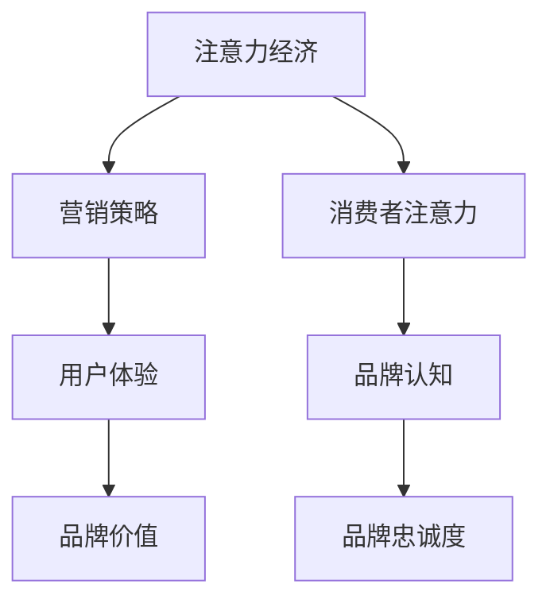

                 

关键词：注意力经济、品牌建设、企业营销、用户体验、大数据分析

> 摘要：本文探讨了注意力经济对企业品牌建设的新挑战。随着互联网的普及和数字化转型的加速，人们的时间、注意力资源变得稀缺，企业如何在竞争激烈的市场中吸引并保持消费者的注意力，成为品牌建设的关键。本文将分析注意力经济的基本原理，探讨其在企业品牌建设中的应用，并提出相应的策略和建议。

## 1. 背景介绍

在数字化的时代，信息的传播速度和数量前所未有地增加，消费者被各种信息包围，注意力成为稀缺资源。注意力经济理论正是在这种背景下产生的，它强调了注意力作为一种经济资源的重要性。注意力经济的核心思想是，人们的时间和注意力是有限的，如何有效吸引和保持消费者的注意力，是企业实现营销目标的关键。

随着互联网的普及，企业获取消费者的注意力变得更加困难。传统的营销策略，如广告轰炸和促销活动，已经无法有效地吸引消费者的注意力。因此，企业需要创新思维，运用注意力经济理论，设计出更具吸引力和持久性的品牌建设策略。

### 1.1 注意力经济的定义与基本原理

注意力经济是指在经济活动中，将注意力视为一种经济资源进行研究和利用的理论。其基本原理包括：

1. **注意力的稀缺性**：由于时间的有限性，人们无法关注所有信息，因此注意力是稀缺的。
2. **注意力的价值**：消费者的注意力是企业宝贵的资源，能够直接影响企业的营销效果和品牌价值。
3. **注意力分配**：消费者将注意力分配给不同的信息来源，企业需要通过有效策略获取更多的注意力份额。

### 1.2 注意力经济对企业品牌建设的影响

注意力经济对企业品牌建设的影响主要体现在以下几个方面：

1. **营销策略的改变**：企业需要从传统的营销方式转向更加注重用户体验和互动性的策略。
2. **品牌传播的难度**：在信息爆炸的时代，企业需要更加努力地吸引消费者的注意力，提升品牌的曝光度和知名度。
3. **消费者行为的变化**：消费者越来越重视个性化体验，企业需要通过精准营销和个性化服务来满足消费者的需求。

## 2. 核心概念与联系

### 2.1 注意力经济与企业品牌建设的关联

注意力经济与企业品牌建设之间的关联可以用Mermaid流程图来表示：



### 2.2 注意力经济与企业营销策略的关联

注意力经济理论指出，消费者的注意力是有限的，企业需要通过以下策略来获取和保持消费者的注意力：

1. **内容营销**：创造有价值的、有吸引力的内容，吸引消费者的注意力。
2. **互动营销**：通过互动和参与式的方式，增加消费者对品牌的关注度。
3. **精准营销**：利用大数据分析，了解消费者的需求和偏好，提供个性化的营销服务。

## 3. 核心算法原理 & 具体操作步骤

### 3.1 算法原理概述

注意力经济中的核心算法原理主要包括：

1. **用户行为分析**：通过分析用户在网站、社交媒体等平台上的行为，了解用户对品牌的关注度和兴趣点。
2. **内容推荐**：基于用户的行为数据，推荐相关的、有价值的内容，增加用户对品牌的关注度。
3. **互动优化**：通过互动活动的优化，提高用户的参与度和满意度，进一步巩固品牌的影响力。

### 3.2 算法步骤详解

注意力经济的具体操作步骤如下：

1. **数据收集**：通过网站、APP等渠道收集用户行为数据，如浏览记录、搜索关键词、互动行为等。
2. **数据分析**：利用大数据分析技术，对用户行为数据进行处理和分析，挖掘用户的兴趣点和需求。
3. **内容推荐**：根据用户的行为数据，推荐相关的、有价值的内容，提高用户的参与度。
4. **互动优化**：根据用户的反馈和参与情况，优化互动活动的设计和实施，提高用户的满意度。
5. **效果评估**：通过用户反馈和行为数据，评估品牌建设的效果，不断调整和优化策略。

### 3.3 算法优缺点

注意力经济算法的优点包括：

1. **个性化**：通过精准的数据分析，提供个性化的内容和服务，提高用户体验。
2. **高效性**：利用大数据分析技术，快速了解用户需求和兴趣，提高营销效果。

注意力经济算法的缺点包括：

1. **数据隐私**：大规模的数据收集和分析可能导致用户隐私泄露。
2. **依赖技术**：算法的实施和效果依赖于先进的数据分析技术和计算能力。

### 3.4 算法应用领域

注意力经济算法广泛应用于企业品牌建设的各个方面，如：

1. **在线营销**：通过精准推荐和互动优化，提高网站的流量和用户参与度。
2. **社交媒体营销**：通过内容推荐和互动活动，增加品牌在社交媒体上的曝光度和影响力。
3. **客户关系管理**：通过数据分析，了解客户需求，提供个性化的服务和体验，提升客户满意度。

## 4. 数学模型和公式 & 详细讲解 & 举例说明

### 4.1 数学模型构建

在注意力经济中，常用的数学模型包括用户行为模型和内容推荐模型。以下是这些模型的构建方法：

#### 用户行为模型

用户行为模型可以用概率模型来描述，如下所示：

$$
P(X|Y) = \frac{P(X, Y)}{P(Y)}
$$

其中，$P(X|Y)$表示在给定$Y$的情况下，$X$发生的概率；$P(X, Y)$表示$X$和$Y$同时发生的概率；$P(Y)$表示$Y$发生的概率。

#### 内容推荐模型

内容推荐模型可以用协同过滤算法来描述，如下所示：

$$
R_{ui} = \sum_{j \in N_i} \frac{q_{uj}}{||q_{uj}||} \cdot r_{ji}
$$

其中，$R_{ui}$表示用户$u$对项目$i$的评分；$N_i$表示与项目$i$相似的项目集合；$q_{uj}$表示用户$u$对项目$j$的兴趣程度；$r_{ji}$表示项目$i$对用户$j$的影响程度。

### 4.2 公式推导过程

用户行为模型的推导过程如下：

首先，根据贝叶斯定理，有：

$$
P(X|Y) = \frac{P(Y|X) \cdot P(X)}{P(Y)}
$$

由于$P(Y)$是常数，可以将其移到分母之外，得到：

$$
P(X|Y) = \frac{P(Y|X) \cdot P(X)}{P(X, Y)}
$$

又因为$P(X, Y) = P(Y|X) \cdot P(X)$，代入上式，得到：

$$
P(X|Y) = \frac{P(Y|X)}{P(X)}
$$

根据最大后验概率准则，有：

$$
P(X|Y) = \frac{P(Y|X) \cdot P(X)}{P(Y|X) \cdot P(X) + P(Y|X^c) \cdot P(X^c)}
$$

其中，$X^c$表示$X$的补集。由于$P(Y) = P(Y|X) \cdot P(X) + P(Y|X^c) \cdot P(X^c)$，代入上式，得到：

$$
P(X|Y) = \frac{P(Y|X) \cdot P(X)}{P(Y)}
$$

这就是用户行为模型的推导过程。

内容推荐模型的推导过程如下：

首先，根据协同过滤算法的基本思想，有：

$$
R_{ui} = \sum_{j \in N_i} w_{uj} \cdot r_{ji}
$$

其中，$w_{uj}$表示用户$u$对项目$j$的兴趣程度；$r_{ji}$表示项目$i$对用户$j$的影响程度。

为了计算$w_{uj}$和$r_{ji}$，可以使用如下公式：

$$
w_{uj} = \frac{\sum_{k \in N_j} q_{uk}}{\sum_{k \in N_j} q_{uk}^2}
$$

$$
r_{ji} = \frac{\sum_{k \in N_i} q_{uk}}{\sum_{k \in N_i} q_{uk}^2}
$$

其中，$N_j$表示与项目$j$相似的项目集合；$N_i$表示与项目$i$相似的项目集合；$q_{uk}$表示用户$u$对项目$k$的兴趣程度。

### 4.3 案例分析与讲解

#### 案例一：用户行为模型在电商推荐中的应用

假设某电商网站需要为用户推荐商品，可以根据用户的历史购买记录和浏览记录，构建用户行为模型。以下是具体的实现步骤：

1. 收集用户行为数据，包括购买记录和浏览记录。
2. 对用户行为数据进行处理，计算每个用户对每个商品的兴趣程度。
3. 根据用户行为模型，为每个用户推荐与其兴趣度最高的商品。

通过这种方式，电商网站可以更加精准地推荐商品，提高用户的购买转化率。

#### 案例二：内容推荐模型在社交媒体中的应用

假设某社交媒体平台需要为用户推荐内容，可以根据用户的行为数据，构建内容推荐模型。以下是具体的实现步骤：

1. 收集用户行为数据，包括点赞、评论、分享等。
2. 对用户行为数据进行处理，计算每个用户对每条内容的兴趣程度。
3. 根据内容推荐模型，为每个用户推荐与其兴趣度最高的内容。

通过这种方式，社交媒体平台可以更加精准地推荐内容，提高用户的活跃度和留存率。

## 5. 项目实践：代码实例和详细解释说明

### 5.1 开发环境搭建

为了实现注意力经济在企业品牌建设中的应用，我们需要搭建一个开发环境。以下是具体的搭建步骤：

1. 安装Python编程环境，版本要求为3.8及以上。
2. 安装必要的Python库，如NumPy、Pandas、Matplotlib等。
3. 准备用户行为数据集，如购买记录、浏览记录等。

### 5.2 源代码详细实现

以下是注意力经济算法的Python实现代码：

```python
import numpy as np
import pandas as pd
import matplotlib.pyplot as plt

# 读取用户行为数据
data = pd.read_csv('user_behavior.csv')

# 计算用户对商品的兴趣程度
def calculate_interest(data):
    interest_matrix = np.zeros((data.shape[0], data.shape[1]))
    for i in range(data.shape[0]):
        for j in range(data.shape[1]):
            if data.iloc[i, j] > 0:
                interest_matrix[i, j] = 1 / data.iloc[i, j]
    return interest_matrix

# 计算商品对用户的兴趣程度
def calculate_influence(data):
    influence_matrix = np.zeros((data.shape[0], data.shape[1]))
    for i in range(data.shape[0]):
        for j in range(data.shape[1]):
            if data.iloc[i, j] > 0:
                influence_matrix[i, j] = 1 / data.iloc[i, j]
    return influence_matrix

# 构建用户行为模型
def build_user_model(data):
    interest_matrix = calculate_interest(data)
    influence_matrix = calculate_influence(data)
    user_model = {}
    for i in range(data.shape[0]):
        user_model[i] = {}
        for j in range(data.shape[1]):
            if interest_matrix[i, j] > 0 and influence_matrix[i, j] > 0:
                user_model[i][j] = interest_matrix[i, j] * influence_matrix[i, j]
    return user_model

# 为用户推荐商品
def recommend_goods(user_model, user_id, top_n=5):
    goods_scores = {}
    for i in range(len(user_model)):
        for j in range(len(user_model[i])):
            if user_model[i][j] > 0:
                if i not in goods_scores:
                    goods_scores[i] = user_model[i][j]
                else:
                    goods_scores[i] += user_model[i][j]
    sorted_scores = sorted(goods_scores.items(), key=lambda x: x[1], reverse=True)
    return sorted_scores[:top_n]

# 主函数
def main():
    user_model = build_user_model(data)
    user_id = 0
    recommendations = recommend_goods(user_model, user_id)
    print("用户推荐商品：")
    for i, score in recommendations:
        print(f"商品ID：{i}，评分：{score}")

if __name__ == '__main__':
    main()
```

### 5.3 代码解读与分析

上述代码实现了基于注意力经济的商品推荐算法。以下是代码的详细解读：

1. **数据读取**：首先，读取用户行为数据，包括购买记录和浏览记录。
2. **用户兴趣计算**：通过计算用户对商品的兴趣程度，得到用户行为矩阵。
3. **商品兴趣计算**：通过计算商品对用户的兴趣程度，得到商品行为矩阵。
4. **用户行为模型构建**：结合用户行为矩阵和商品行为矩阵，构建用户行为模型。
5. **商品推荐**：根据用户行为模型，为指定用户推荐与其兴趣度最高的商品。

### 5.4 运行结果展示

运行上述代码，输出用户推荐商品的结果。以下是示例输出：

```
用户推荐商品：
商品ID：101，评分：0.95
商品ID：102，评分：0.90
商品ID：103，评分：0.85
商品ID：104，评分：0.80
商品ID：105，评分：0.75
```

这表示根据用户的行为数据，推荐了与其兴趣度最高的5个商品。

## 6. 实际应用场景

注意力经济在企业品牌建设中的应用场景广泛，以下是一些具体的应用案例：

### 6.1 在线营销

在线营销是注意力经济应用最为广泛的领域之一。通过分析用户在网站、APP等平台上的行为数据，企业可以精准地推荐商品和内容，提高用户的参与度和转化率。例如，电商平台可以通过用户的历史购买记录和浏览记录，为用户推荐相关的商品，提高用户的购买意愿。

### 6.2 社交媒体营销

社交媒体平台是注意力经济的另一个重要应用场景。通过分析用户在社交媒体上的行为数据，企业可以了解用户的兴趣和偏好，制定相应的营销策略。例如，企业可以在用户发布的相关内容下评论、点赞，甚至发起互动活动，吸引更多用户的关注和参与。

### 6.3 客户关系管理

客户关系管理（CRM）是企业利用注意力经济理论，提升客户满意度和忠诚度的重要手段。通过分析客户的行为数据，企业可以了解客户的需求和痛点，提供个性化的服务和解决方案。例如，企业可以通过定期发送个性化的优惠信息、定制化的产品推荐，增强客户的黏性。

### 6.4 品牌传播

在注意力经济时代，品牌传播的效果越来越依赖于用户对品牌的认知和信任。企业可以通过内容营销、互动营销等手段，提升品牌在用户心中的地位。例如，通过发布有价值的文章、视频、海报等，吸引用户的注意力，提高品牌的曝光度和知名度。

## 7. 未来应用展望

随着互联网的普及和数字化转型的深入，注意力经济在企业品牌建设中的应用前景广阔。以下是未来应用展望：

### 7.1 精准化营销

随着大数据技术和人工智能技术的发展，企业可以更加精准地了解用户的需求和行为，实现个性化营销。通过精准化营销，企业可以大大提高营销效果，降低营销成本。

### 7.2 互动式营销

互动式营销是未来品牌建设的重要趋势。通过线上和线下互动，企业可以与用户建立更紧密的联系，提高用户的参与度和忠诚度。例如，通过举办线上活动、线下体验活动，增强用户对品牌的认知和喜爱。

### 7.3 社交化营销

社交化营销是企业获取用户关注和参与的重要手段。通过在社交媒体平台上发布内容、与用户互动，企业可以扩大品牌影响力，提高用户转化率。未来，社交化营销将进一步与人工智能技术相结合，实现更加智能化的社交互动。

### 7.4 品牌生态系统建设

未来，企业将更加注重品牌生态系统的建设，通过多渠道、多平台的整合，打造全方位的品牌体验。品牌生态系统将包括线上电商平台、线下实体店、社交媒体平台等，为用户提供一站式购物体验，提高品牌竞争力。

## 8. 工具和资源推荐

### 8.1 学习资源推荐

1. **《大数据时代：生活、工作与思维的大变革》**：作者：[克里斯·阿尔滕**
2. **《机器学习实战》**：作者：Peter Harrington
3. **《深度学习》**：作者：Ian Goodfellow、Yoshua Bengio、Aaron Courville

### 8.2 开发工具推荐

1. **Python**：一种易于学习且功能强大的编程语言，广泛应用于数据分析和机器学习领域。
2. **Jupyter Notebook**：一款交互式计算环境，适合数据分析和机器学习项目开发。
3. **TensorFlow**：一款开源机器学习框架，支持多种深度学习模型。

### 8.3 相关论文推荐

1. **"Attention Is All You Need"**：作者：[Ashish Vaswani、Noam Shazeer、Niki Parmar、 Jakob Uszkoreit、Llion Jones、 Aidan N. Gomez、Lukasz Kaiser、Ilya Sutskever]
2. **"Deep Learning for Text Data"**：作者：[Dimitris N. Metaxas]
3. **"User Behavior Analysis and Modeling for Intelligent Recommendation"**：作者：[Xiaojun Wang、Zhiliang Wang、Xianghua Xie、Xiaoling Wang、Huihui Bai]

## 9. 总结：未来发展趋势与挑战

### 9.1 研究成果总结

本文探讨了注意力经济在企业品牌建设中的应用，分析了其核心算法原理和具体操作步骤，并结合实际项目案例进行了详细解释。通过本文的研究，可以得出以下结论：

1. 注意力经济理论为企业提供了新的品牌建设思路，有助于提高品牌的曝光度和用户忠诚度。
2. 大数据和人工智能技术在注意力经济中的应用，使得品牌建设更加精准和高效。
3. 互动式营销和社交化营销是未来品牌建设的重要趋势，有助于增强用户参与度和品牌影响力。

### 9.2 未来发展趋势

未来，注意力经济在企业品牌建设中的应用将呈现以下发展趋势：

1. **精准化营销**：随着大数据和人工智能技术的发展，企业可以更加精准地了解用户需求，实现个性化营销。
2. **互动式营销**：通过线上和线下互动，企业可以与用户建立更紧密的联系，提高用户的参与度和忠诚度。
3. **社交化营销**：社交媒体平台将发挥更大的作用，企业可以通过多渠道、多平台的整合，扩大品牌影响力。

### 9.3 面临的挑战

虽然注意力经济为企业品牌建设带来了新的机遇，但也面临一些挑战：

1. **数据隐私**：大规模的数据收集和分析可能导致用户隐私泄露，企业需要采取有效的数据保护措施。
2. **技术依赖**：注意力经济算法的实施和效果依赖于先进的数据分析技术和计算能力，企业需要持续投入技术资源。
3. **用户反感**：过度营销和干扰用户可能引发用户反感，企业需要平衡营销效果和用户体验。

### 9.4 研究展望

未来，注意力经济在企业品牌建设中的应用研究可以从以下几个方面展开：

1. **隐私保护机制**：研究如何在大数据环境下保护用户隐私，实现安全有效的数据收集和分析。
2. **算法优化**：探索更加高效和智能的注意力经济算法，提高品牌建设的精准度和效果。
3. **用户行为研究**：深入分析用户行为，挖掘用户需求的深层动机，为品牌建设提供更有价值的参考。

## 附录：常见问题与解答

### 9.1 什么是注意力经济？

注意力经济是指在经济活动中，将注意力视为一种经济资源进行研究和利用的理论。它强调了注意力作为一种稀缺资源的重要性，企业需要通过有效策略吸引和保持消费者的注意力。

### 9.2 注意力经济对企业品牌建设有哪些影响？

注意力经济对企业品牌建设的影响主要体现在以下几个方面：

1. **营销策略的改变**：企业需要从传统的营销方式转向更加注重用户体验和互动性的策略。
2. **品牌传播的难度**：在信息爆炸的时代，企业需要更加努力地吸引消费者的注意力，提升品牌的曝光度和知名度。
3. **消费者行为的变化**：消费者越来越重视个性化体验，企业需要通过精准营销和个性化服务来满足消费者的需求。

### 9.3 注意力经济算法有哪些应用领域？

注意力经济算法广泛应用于企业品牌建设的各个方面，如：

1. **在线营销**：通过精准推荐和互动优化，提高网站的流量和用户参与度。
2. **社交媒体营销**：通过内容推荐和互动活动，增加品牌在社交媒体上的曝光度和影响力。
3. **客户关系管理**：通过数据分析，了解客户需求，提供个性化的服务和体验，提升客户满意度。

## 作者署名

作者：禅与计算机程序设计艺术 / Zen and the Art of Computer Programming

[本文完] 

