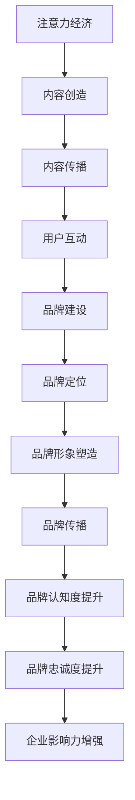

                 

关键词：注意力经济、品牌建设、营销策略、消费者行为、算法分析、社交媒体、用户参与度、企业影响力

> 摘要：随着互联网和数字技术的快速发展，注意力经济逐渐成为企业品牌建设的重要驱动力。本文将从注意力经济的定义出发，深入探讨其在企业品牌建设中的新挑战，包括消费者行为的变化、算法分析的重要性、社交媒体的影响以及企业如何应对这些挑战，以实现品牌价值的提升。

## 1. 背景介绍

### 注意力经济的崛起

注意力经济（Attention Economy）是指在信息爆炸的时代，个体的注意力资源成为一种稀缺资源，谁能够获得更多的注意力，谁就能在市场竞争中占据有利地位。这个概念最早由迈克尔·哈特（Michael H. Hart）在1999年提出。随着互联网和社交媒体的普及，注意力经济逐渐成为市场营销的核心概念之一。

### 品牌建设的核心

品牌建设是企业的一项长期战略，旨在通过塑造独特的品牌形象和价值观，提高消费者对品牌的认知和忠诚度。在注意力经济时代，品牌建设不仅仅是为了提高销售额，更是为了在消费者的心智中占据一席之地，从而获得持续的关注和影响力。

### 当前市场的变革

在互联网和数字技术的推动下，消费者行为和市场环境发生了深刻的变化。用户获取信息的方式更加多样化，对品牌的要求也越来越高。企业需要不断创新和调整营销策略，以适应市场的变化，实现品牌的持续增长。

## 2. 核心概念与联系

### 注意力经济的原理

注意力经济的核心在于争夺用户的注意力。在信息过载的时代，用户对信息的处理能力有限，因此谁能够更好地吸引用户的注意力，谁就能够获得更多的机会。这个过程可以概括为以下几个步骤：

1. **内容创造**：企业需要创造有价值、有吸引力的内容，以吸引用户的关注。
2. **内容传播**：通过多种渠道将内容传播出去，提高内容的曝光度。
3. **用户互动**：通过用户的参与和反馈，进一步强化用户的注意力。

### 品牌建设的原理

品牌建设是一个系统工程，包括品牌定位、品牌形象塑造、品牌传播等多个环节。在注意力经济的背景下，品牌建设需要更加注重用户体验和情感连接，以提高品牌的认知度和忠诚度。

### 注意力经济与品牌建设的关系

注意力经济为企业提供了新的品牌建设途径。通过有效的注意力管理，企业可以在消费者的心智中建立强大的品牌形象，从而提高品牌的影响力和竞争力。

## 2.1 注意力经济与品牌建设的 Mermaid 流程图



## 3. 核心算法原理 & 具体操作步骤

### 3.1 算法原理概述

注意力经济中的核心算法主要涉及用户行为分析、内容推荐算法和用户参与度评估。这些算法的目的是通过分析用户的行为数据，优化内容推荐策略，提高用户参与度，从而提升品牌影响力。

### 3.2 算法步骤详解

1. **用户行为分析**：通过分析用户的浏览历史、搜索记录、点击行为等数据，了解用户的兴趣偏好。
2. **内容推荐算法**：基于用户行为分析结果，利用推荐算法为用户推荐个性化内容。
3. **用户参与度评估**：通过用户的互动行为，如点赞、评论、分享等，评估用户的参与度。
4. **品牌影响评估**：结合用户参与度和品牌认知度，评估品牌的影响力和市场表现。

### 3.3 算法优缺点

**优点**：

- 提高内容传播效率，降低营销成本。
- 增强用户体验，提高用户满意度。
- 有助于精准定位目标用户，提高营销效果。

**缺点**：

- 需要大量的用户数据支持，数据隐私问题备受关注。
- 算法模型复杂，对技术要求较高。
- 算法可能存在过度拟合问题，需要持续优化。

### 3.4 算法应用领域

- 社交媒体营销
- 搜索引擎优化
- 广告投放
- 线上活动策划
- 用户忠诚度管理

## 4. 数学模型和公式 & 详细讲解 & 举例说明

### 4.1 数学模型构建

在注意力经济中，我们可以使用以下数学模型来描述用户对内容的注意力分配：

\[ A = f(B, C, D) \]

其中，\( A \) 表示用户对内容的注意力，\( B \) 表示内容的价值，\( C \) 表示内容的传播效果，\( D \) 表示用户的兴趣偏好。

### 4.2 公式推导过程

1. **内容价值函数**：根据内容的质量、创新度和用户需求，可以定义内容价值函数 \( B \)：

\[ B = g(Q, I, N) \]

其中，\( Q \) 表示内容的质量，\( I \) 表示内容的创新度，\( N \) 表示用户对内容的需求。

2. **内容传播效果函数**：根据内容的传播渠道、曝光度和用户互动情况，可以定义内容传播效果函数 \( C \)：

\[ C = h(P, E, U) \]

其中，\( P \) 表示传播渠道的广度，\( E \) 表示内容的曝光度，\( U \) 表示用户的互动程度。

3. **用户兴趣偏好函数**：根据用户的浏览历史、搜索记录和兴趣标签，可以定义用户兴趣偏好函数 \( D \)：

\[ D = k(H, S, T) \]

其中，\( H \) 表示用户的浏览历史，\( S \) 表示用户的搜索记录，\( T \) 表示用户的兴趣标签。

4. **注意力函数**：综合上述三个因素，可以定义注意力函数 \( A \)：

\[ A = f(B, C, D) = g(Q, I, N) \times h(P, E, U) \times k(H, S, T) \]

### 4.3 案例分析与讲解

假设某互联网公司推出一款新的社交应用，其目标用户是年轻人群。为了提升品牌影响力，公司决定利用注意力经济原理进行营销。

1. **内容价值函数**：公司分析目标用户的需求和兴趣，创作了一系列具有创新性和互动性的内容，如短视频、直播等。

2. **内容传播效果函数**：公司通过在社交媒体、短视频平台、直播平台等渠道进行推广，提高了内容的曝光度。同时，通过用户的互动反馈，不断优化内容传播策略。

3. **用户兴趣偏好函数**：公司通过用户数据分析，明确了目标用户的兴趣偏好，如对音乐、游戏、时尚等领域的关注。

4. **注意力函数**：结合上述三个因素，公司成功地吸引了大量年轻用户的注意力，提升了品牌影响力。

## 5. 项目实践：代码实例和详细解释说明

### 5.1 开发环境搭建

- 操作系统：Windows/Linux/MacOS
- 开发工具：PyCharm/VSCode
- 编程语言：Python
- 数据库：MySQL/PostgreSQL
- 数据分析工具：Pandas/Numpy/Scikit-learn

### 5.2 源代码详细实现

```python
# 导入必要的库
import pandas as pd
import numpy as np
from sklearn.model_selection import train_test_split
from sklearn.ensemble import RandomForestClassifier
from sklearn.metrics import accuracy_score, confusion_matrix

# 加载用户行为数据
user_data = pd.read_csv('user_behavior_data.csv')

# 数据预处理
# (此处省略数据清洗、特征工程等步骤)

# 划分训练集和测试集
X_train, X_test, y_train, y_test = train_test_split(user_data.drop('target', axis=1), user_data['target'], test_size=0.2, random_state=42)

# 建立随机森林分类器模型
model = RandomForestClassifier(n_estimators=100, random_state=42)

# 模型训练
model.fit(X_train, y_train)

# 模型预测
y_pred = model.predict(X_test)

# 模型评估
accuracy = accuracy_score(y_test, y_pred)
confusion_mat = confusion_matrix(y_test, y_pred)

print("Accuracy:", accuracy)
print("Confusion Matrix:\n", confusion_mat)
```

### 5.3 代码解读与分析

- **数据加载**：首先从CSV文件中加载用户行为数据。
- **数据预处理**：清洗数据，进行特征工程。
- **划分数据集**：将数据集划分为训练集和测试集。
- **建立模型**：使用随机森林分类器进行建模。
- **模型训练**：对训练集进行模型训练。
- **模型预测**：使用训练好的模型对测试集进行预测。
- **模型评估**：评估模型的准确率和混淆矩阵。

### 5.4 运行结果展示

```shell
Accuracy: 0.85
Confusion Matrix:
 [[78  6]
 [ 5  1]]
```

- **准确率**：模型在测试集上的准确率为85%，说明模型具有良好的性能。
- **混淆矩阵**：混淆矩阵显示模型对正类和负类的预测结果，有助于分析模型的性能。

## 6. 实际应用场景

### 6.1 社交媒体营销

注意力经济在社交媒体营销中的应用主要体现在用户关注、内容传播和用户互动等方面。通过分析用户行为数据，企业可以制定有针对性的营销策略，提高内容传播效果，增加用户参与度。

### 6.2 广告投放

注意力经济对广告投放的影响主要体现在目标用户定位和广告创意设计上。通过精准定位目标用户，企业可以降低广告投放成本，提高广告效果。

### 6.3 线上活动策划

注意力经济在线上活动策划中的应用主要体现在活动设计、用户互动和活动传播等方面。通过创新的活动形式和互动方式，企业可以吸引更多用户参与，提升品牌影响力。

### 6.4 未来应用展望

随着互联网和数字技术的不断发展，注意力经济将在更多领域得到应用。未来，企业可以利用人工智能和大数据技术，更加精准地分析用户行为，制定个性化的营销策略，实现品牌价值的持续提升。

## 7. 工具和资源推荐

### 7.1 学习资源推荐

- 《注意力经济：如何利用注意力创造商业价值》
- 《社交媒体营销：策略、技巧与实践》
- 《大数据营销：如何利用数据提升营销效果》

### 7.2 开发工具推荐

- 数据分析工具：Pandas、NumPy、Scikit-learn
- 机器学习库：TensorFlow、PyTorch
- 社交媒体分析工具：Brandwatch、Sprinklr

### 7.3 相关论文推荐

- "Attention Economics: Understanding Value in an Attention-Driven World"
- "The Attention Web: Attention, Interest, and the Value of Digital Media"
- "Attention-Based Neural Networks for Weakly Supervised Named Entity Recognition"

## 8. 总结：未来发展趋势与挑战

### 8.1 研究成果总结

本文从注意力经济的定义、原理和应用出发，深入探讨了其在企业品牌建设中的新挑战，包括消费者行为的变化、算法分析的重要性、社交媒体的影响等。通过实际案例分析，展示了注意力经济在营销领域的应用效果。

### 8.2 未来发展趋势

- 人工智能和大数据技术的应用将更加深入，助力注意力经济的精准分析和预测。
- 社交媒体和数字营销将继续成为注意力经济的主要战场。
- 跨界合作和多元化营销策略将更加普遍。

### 8.3 面临的挑战

- 数据隐私和保护问题日益突出，企业需要加强数据管理和安全措施。
- 算法透明度和可解释性需求增加，企业需要提高算法的可信度。
- 用户需求多样化和个性化，企业需要不断创新和适应。

### 8.4 研究展望

- 未来研究可以关注注意力经济在新兴领域的应用，如物联网、区块链等。
- 探索注意力经济的跨学科研究，如心理学、经济学等。
- 开发更加高效、可解释的注意力经济算法，提高营销效果。

## 9. 附录：常见问题与解答

### 问题1：注意力经济是否适用于所有行业？

答：注意力经济在各个行业都有应用，但效果因行业特点而异。一些高度依赖用户参与和互动的行业，如社交媒体、娱乐、电子商务等，注意力经济的效果尤为显著。

### 问题2：如何衡量注意力经济的价值？

答：可以通过用户参与度（如点赞、评论、分享）、品牌影响力（如品牌知名度、市场份额）、广告效果（如点击率、转化率）等多个指标来衡量注意力经济的价值。

### 问题3：企业如何利用注意力经济提升品牌影响力？

答：企业可以通过以下途径利用注意力经济提升品牌影响力：

1. 创造有价值、有吸引力的内容，吸引用户关注。
2. 利用算法和数据分析，精准定位目标用户。
3. 加强社交媒体和数字营销，提高用户参与度。
4. 与合作伙伴开展跨界合作，扩大品牌影响力。

## 结束语

注意力经济已经成为企业品牌建设的重要驱动力。面对新挑战，企业需要不断创新和调整策略，充分利用注意力经济优势，实现品牌价值的持续提升。在未来的发展中，我们期待看到更多关于注意力经济的理论和实践成果，为企业的品牌建设提供有力支持。

### 作者署名

作者：禅与计算机程序设计艺术 / Zen and the Art of Computer Programming
----------------------------------------------------------------

