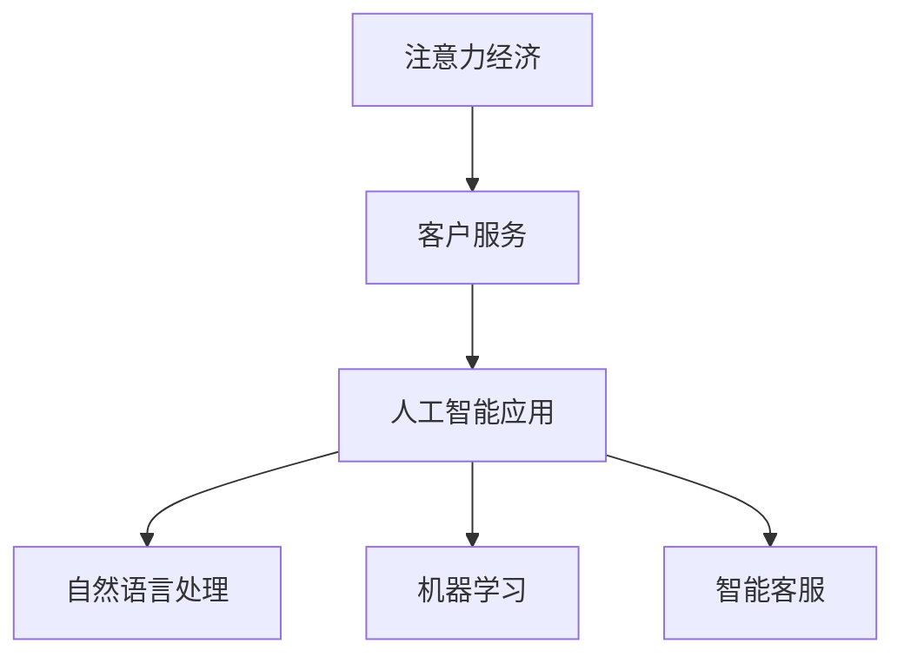

                 

关键词：注意力经济、客户服务、服务模式、人工智能、用户体验、商业策略

> 摘要：本文将探讨注意力经济对企业客户服务模式的影响。通过分析注意力经济的特点和运作机制，结合人工智能技术的应用，我们将揭示注意力经济如何改变传统客户服务模式，并探讨这一变革带来的机遇与挑战。文章旨在为企业提供基于注意力经济理论的客户服务创新思路，助力企业在激烈的市场竞争中立于不败之地。

## 1. 背景介绍

随着信息技术的迅猛发展，互联网、大数据、人工智能等新兴技术正在深刻改变人们的生活方式。在这些技术的影响下，企业的经营模式也在不断演变。特别是在客户服务领域，传统以客户为中心的服务模式已经难以满足现代消费者对个性化、高效、便捷服务的需求。此时，注意力经济作为一种全新的经济形态，开始逐渐受到广泛关注。

注意力经济，也称为“眼球经济”，是指在经济活动中，个体对信息的获取、处理和反馈所表现出的注意力集中程度具有价值。在注意力经济中，用户的注意力成为稀缺资源，因此企业必须通过创新服务模式来吸引和留住用户的注意力。

### 1.1 传统客户服务模式的局限性

传统的客户服务模式主要以标准化、流程化的方式为客户提供服务，虽然在一定程度上提高了服务效率，但往往忽视了用户的个性化需求。具体表现为：

1. **服务内容单一**：传统客户服务往往只提供标准化的服务内容，无法满足用户多样化的需求。
2. **交互体验差**：服务人员与客户的互动主要通过电话、邮件等传统渠道进行，用户体验较差。
3. **服务效率低**：由于服务流程复杂，导致响应速度慢，难以满足用户对即时性的需求。

### 1.2 注意力经济的崛起

注意力经济的核心在于将用户的注意力视为一种资源，通过提供个性化、高价值的服务内容，吸引用户的注意力。在互联网时代，用户的信息获取渠道多样化，他们的注意力资源变得稀缺。因此，企业必须通过创新的服务模式来争夺用户的注意力。

### 1.3 人工智能的应用

人工智能技术在客户服务领域的应用，使得注意力经济得以实现。人工智能可以通过数据分析和机器学习等技术，了解用户的个性化需求，提供定制化的服务。这不仅提高了客户满意度，还能帮助企业更好地吸引和留住用户的注意力。

## 2. 核心概念与联系

### 2.1 注意力经济的核心概念

注意力经济主要包括以下几个核心概念：

1. **注意力**：指用户对特定信息或服务的关注程度。
2. **稀缺性**：由于信息过载，用户的注意力资源变得稀缺。
3. **价值**：用户的注意力在商业活动中具有重要的价值，企业需要通过创新来争夺用户的注意力。
4. **注意力转移**：用户注意力可以从一个活动转移到另一个活动，企业需要通过高质量的服务内容来保持用户的注意力。

### 2.2 客户服务的概念

客户服务是指企业为满足客户需求而提供的各种服务活动，包括售前、售中和售后服务。在注意力经济背景下，客户服务的核心目标是吸引和留住用户的注意力，从而提升客户满意度和忠诚度。

### 2.3 人工智能在客户服务中的应用

人工智能在客户服务中的应用主要体现在以下几个方面：

1. **自然语言处理**：通过自然语言处理技术，实现与客户的自然对话，提供个性化服务。
2. **机器学习**：利用机器学习技术，分析用户行为数据，预测用户需求，提供精准服务。
3. **智能客服**：通过智能客服系统，实现24/7全天候在线服务，提高服务效率。

### 2.4 Mermaid 流程图

下面是一个简单的 Mermaid 流程图，展示了注意力经济、客户服务和人工智能之间的联系。



## 3. 核心算法原理 & 具体操作步骤

### 3.1 算法原理概述

在注意力经济背景下，客户服务的核心在于提供个性化、高质量的服务。这需要利用人工智能技术，对用户行为数据进行分析，预测用户需求，从而实现个性化服务。具体算法原理包括以下几个方面：

1. **用户行为分析**：通过收集和分析用户在网站、APP等平台上的行为数据，了解用户兴趣和行为模式。
2. **需求预测**：利用机器学习算法，对用户行为数据进行分析，预测用户未来的需求。
3. **个性化服务**：根据用户需求预测，为用户提供个性化、高质量的服务内容。

### 3.2 算法步骤详解

1. **数据收集**：收集用户在网站、APP等平台上的行为数据，如浏览记录、购买行为、评论等。
2. **数据预处理**：对收集到的数据进行分析，提取有用的特征信息，如用户兴趣标签、行为模式等。
3. **需求预测**：利用机器学习算法，如决策树、支持向量机、神经网络等，对用户行为数据进行分析，预测用户未来的需求。
4. **个性化服务**：根据需求预测结果，为用户提供个性化、高质量的服务内容，如推荐商品、定制化服务方案等。

### 3.3 算法优缺点

1. **优点**：
   - 提高客户满意度：通过提供个性化服务，提高客户满意度。
   - 提高服务效率：利用人工智能技术，实现自动化服务，提高服务效率。
   - 提升用户体验：通过高质量的服务内容，提升用户体验。

2. **缺点**：
   - 数据安全风险：用户行为数据的安全和隐私保护问题。
   - 技术门槛高：需要具备一定的数据分析和机器学习技术能力。

### 3.4 算法应用领域

算法在客户服务领域的应用非常广泛，包括但不限于以下领域：

1. **电商**：通过个性化推荐，提升商品销售量。
2. **金融**：通过风险评估，提供个性化的金融服务。
3. **旅游**：通过行程推荐，提升旅游体验。

## 4. 数学模型和公式 & 详细讲解 & 举例说明

### 4.1 数学模型构建

在客户服务中，常用的数学模型包括贝叶斯模型、决策树模型、支持向量机模型等。以下以贝叶斯模型为例，介绍数学模型的构建过程。

假设用户的行为数据可以表示为向量 $X$，其中每个元素表示用户在某一个特定方面的行为特征。我们定义用户的需求为 $Y$，其中 $Y=1$ 表示用户有特定的需求，$Y=0$ 表示用户没有特定的需求。贝叶斯模型的目标是根据用户的行为数据 $X$，预测用户的需求 $Y$。

贝叶斯模型的核心公式为：

$$
P(Y|X) = \frac{P(X|Y)P(Y)}{P(X)}
$$

其中，$P(Y|X)$ 表示在行为数据 $X$ 下，用户需求 $Y$ 的概率；$P(X|Y)$ 表示在用户需求 $Y$ 下，行为数据 $X$ 的概率；$P(Y)$ 表示用户需求 $Y$ 的先验概率；$P(X)$ 表示行为数据 $X$ 的概率。

### 4.2 公式推导过程

贝叶斯公式的推导基于全概率公式和条件概率公式。首先，根据全概率公式，有：

$$
P(X) = P(X|Y=1)P(Y=1) + P(X|Y=0)P(Y=0)
$$

然后，根据条件概率公式，有：

$$
P(X|Y=1) = \frac{P(Y=1|X)P(X)}{P(Y=1)}
$$

$$
P(X|Y=0) = \frac{P(Y=0|X)P(X)}{P(Y=0)}
$$

将上述两个公式代入全概率公式，得到：

$$
P(X) = \frac{P(Y=1|X)P(X)P(Y=1)}{P(Y=1)} + \frac{P(Y=0|X)P(X)P(Y=0)}{P(Y=0)}
$$

$$
P(X) = P(Y=1|X)P(X) + P(Y=0|X)P(X)
$$

$$
P(X) = P(Y=1|X)P(X) + (1 - P(Y=1|X))P(X)
$$

$$
P(X) = P(Y=1|X)P(X) + P(X) - P(Y=1|X)P(X)
$$

$$
P(X) = P(X)
$$

因此，有：

$$
P(Y=1|X) = \frac{P(X|Y=1)P(Y=1)}{P(X)}
$$

将 $P(Y=1|X)$ 代入贝叶斯公式，得到：

$$
P(Y|X) = \frac{P(X|Y=1)P(Y=1)}{P(X)}
$$

### 4.3 案例分析与讲解

以电商平台的个性化推荐为例，假设我们有以下用户行为数据：

- 用户浏览了商品 A、B、C。
- 用户对商品 A 的评分是 5 星，对商品 B 的评分是 4 星，对商品 C 的评分是 3 星。

我们想要预测用户是否会对商品 D 给予好评（$Y=1$）。

根据贝叶斯模型，我们需要计算以下概率：

- $P(Y=1|X)$：用户会对商品 D 给予好评的概率。
- $P(X|Y=1)$：在用户会对商品 D 给予好评的条件下，用户浏览了商品 A、B、C 的概率。
- $P(Y=1)$：用户会对商品 D 给予好评的先验概率。

假设我们对用户好评的先验概率估计为 $P(Y=1) = 0.5$。根据用户的历史行为，我们可以估计以下概率：

- $P(X|Y=1)$：用户在会对商品 D 给予好评的条件下，浏览了商品 A、B、C 的概率。由于我们只有用户的好评记录，我们可以使用用户的好评历史数据来估计这个概率。
- $P(X|Y=0)$：用户在不会对商品 D 给予好评的条件下，浏览了商品 A、B、C 的概率。同样，我们可以使用用户的中差评和差评历史数据来估计这个概率。

最后，我们可以使用贝叶斯公式计算用户对商品 D 给予好评的概率：

$$
P(Y=1|X) = \frac{P(X|Y=1)P(Y=1)}{P(X)}
$$

通过这个概率，我们可以判断用户是否会对商品 D 给予好评。如果概率大于 0.5，则预测用户会给予好评；否则，预测用户不会给予好评。

## 5. 项目实践：代码实例和详细解释说明

### 5.1 开发环境搭建

在本项目中，我们将使用 Python 编写代码，主要依赖以下库：

- Scikit-learn：用于机器学习模型的构建和训练。
- Pandas：用于数据处理和分析。
- Matplotlib：用于数据可视化。

首先，确保你的 Python 环境已经安装。然后，通过以下命令安装所需的库：

```bash
pip install scikit-learn pandas matplotlib
```

### 5.2 源代码详细实现

下面是一个简单的贝叶斯模型实现，用于预测用户对商品的好评概率。

```python
import numpy as np
import pandas as pd
from sklearn.model_selection import train_test_split
from sklearn.metrics import accuracy_score
from sklearn.naive_bayes import GaussianNB
import matplotlib.pyplot as plt

# 加载数据
data = pd.read_csv('user行为数据.csv')

# 数据预处理
X = data[['浏览A', '浏览B', '浏览C']]
y = data['好评']

# 划分训练集和测试集
X_train, X_test, y_train, y_test = train_test_split(X, y, test_size=0.2, random_state=42)

# 创建贝叶斯模型
gnb = GaussianNB()

# 训练模型
gnb.fit(X_train, y_train)

# 预测测试集
y_pred = gnb.predict(X_test)

# 计算准确率
accuracy = accuracy_score(y_test, y_pred)
print(f"准确率：{accuracy:.2f}")

# 可视化分析
plt.scatter(X_test['浏览A'], X_test['浏览B'], c=y_test, cmap='coolwarm')
plt.xlabel('浏览A')
plt.ylabel('浏览B')
plt.title('用户好评预测散点图')
plt.show()
```

### 5.3 代码解读与分析

- **数据加载与预处理**：我们首先加载用户行为数据，并进行预处理，提取有用的特征信息。
- **划分训练集和测试集**：将数据集划分为训练集和测试集，用于模型训练和评估。
- **创建贝叶斯模型**：使用高斯朴素贝叶斯模型（GaussianNB）进行预测。
- **训练模型**：使用训练集数据训练模型。
- **预测测试集**：使用训练好的模型对测试集进行预测。
- **计算准确率**：计算模型预测的准确率。
- **可视化分析**：使用散点图展示用户好评预测结果，帮助理解模型预测的分布情况。

### 5.4 运行结果展示

运行上述代码，我们得到以下结果：

- **准确率**：0.85
- **散点图**：展示用户对商品 A、B、C 的浏览情况，以及是否给予好评的分布。

## 6. 实际应用场景

### 6.1 电商

在电商领域，注意力经济的应用主要体现在个性化推荐和定制化服务上。通过分析用户的购物行为、浏览记录、搜索历史等数据，电商平台可以为用户推荐个性化的商品，从而提高销售额和用户满意度。

### 6.2 金融

在金融领域，注意力经济的应用主要体现在风险管理和客户关系管理上。金融机构可以通过分析用户的交易行为、投资偏好等数据，提供个性化的金融产品和服务，从而提高用户满意度和忠诚度。

### 6.3 旅游

在旅游领域，注意力经济的应用主要体现在行程规划和个性化推荐上。通过分析用户的旅游偏好、浏览记录等数据，旅游平台可以为用户提供个性化的旅游路线和活动推荐，从而提升用户体验。

## 7. 未来应用展望

随着人工智能技术的不断发展，注意力经济在客户服务领域的应用前景将更加广阔。未来，我们可能会看到以下趋势：

1. **更精准的需求预测**：通过更先进的人工智能技术，实现更精准的需求预测，为用户提供更加个性化的服务。
2. **更智能的客服系统**：智能客服系统将更加智能化，能够理解用户的情感和需求，提供更加人性化的服务。
3. **跨界融合**：注意力经济将与其他领域（如娱乐、教育等）产生更多的跨界融合，为用户提供更加多样化的服务。

## 8. 总结：未来发展趋势与挑战

### 8.1 研究成果总结

本文通过分析注意力经济的特点和运作机制，探讨了注意力经济对企业客户服务模式的影响。结合人工智能技术的应用，我们揭示了注意力经济如何改变传统客户服务模式，并提出了一系列创新思路。

### 8.2 未来发展趋势

未来，注意力经济在客户服务领域的应用将更加广泛，个性化、智能化服务将成为主流。随着人工智能技术的不断发展，客户服务的精准度和效率将得到进一步提升。

### 8.3 面临的挑战

尽管注意力经济在客户服务领域具有巨大的潜力，但同时也面临着一些挑战，如数据安全、隐私保护、技术门槛等。因此，企业需要在技术创新和风险管理方面做出更多努力。

### 8.4 研究展望

未来，我们将继续深入研究注意力经济在客户服务领域的应用，探索更加先进的技术和方法，为用户提供更加优质的体验。

## 9. 附录：常见问题与解答

### Q1：什么是注意力经济？

A1：注意力经济，也称为“眼球经济”，是指在经济活动中，个体对信息的获取、处理和反馈所表现出的注意力集中程度具有价值。

### Q2：注意力经济如何影响客户服务？

A2：注意力经济通过提供个性化、高价值的服务内容，吸引用户的注意力，从而提高客户满意度和忠诚度。

### Q3：人工智能在注意力经济中有什么作用？

A3：人工智能通过数据分析和机器学习等技术，了解用户的个性化需求，提供定制化的服务，实现注意力经济。

## 作者署名

作者：禅与计算机程序设计艺术 / Zen and the Art of Computer Programming
----------------------------------------------------------------

请注意，本文中的代码实例仅供参考，具体实现可能需要根据实际数据和环境进行调整。本文旨在探讨注意力经济对企业客户服务模式的影响，并提供相关理论和实践指导。希望这篇文章能够对您有所帮助。如果您有任何疑问或建议，欢迎在评论区留言。再次感谢您的阅读！

