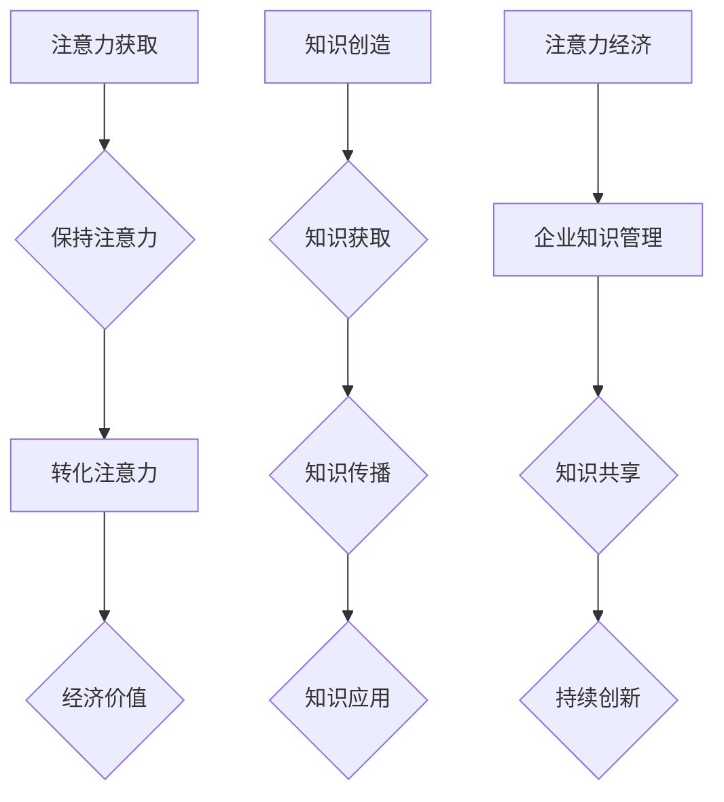

                 

关键词：注意力经济、企业知识管理、知识共享、信息过载、认知负担

> 摘要：本文旨在探讨注意力经济对企业知识管理的影响，分析其在现代企业中的重要性，探讨如何有效地利用注意力经济原理来提高知识管理和知识共享的效率，减轻信息过载和认知负担。通过深入研究和实际案例分析，本文提出了相应的策略和建议，以帮助企业更好地应对知识管理和注意力经济的挑战。

## 1. 背景介绍

### 1.1 注意力经济的概念

注意力经济是一种基于用户注意力的经济模式。在这个模式中，用户注意力成为商品，企业和个人通过吸引和保持用户注意力来获取经济利益。注意力经济的关键在于提高用户的参与度和忠诚度，从而实现商业价值的最大化。

### 1.2 企业知识管理的概念

企业知识管理是指通过系统的方法和工具，对企业内外部的知识进行收集、存储、共享和利用，以实现企业的持续创新和发展。企业知识管理包括知识创造、知识获取、知识传播和知识应用四个主要环节。

### 1.3 注意力经济与企业知识管理的关系

注意力经济和企业知识管理之间存在紧密的联系。一方面，注意力经济为企业知识管理提供了新的动力和方向；另一方面，企业知识管理为注意力经济提供了丰富的知识和信息资源。如何有效地结合注意力经济原理来优化企业知识管理，成为当前研究的热点问题。

## 2. 核心概念与联系

### 2.1 注意力经济原理

注意力经济原理主要包括注意力获取、注意力保持和注意力转化三个环节。首先，企业需要通过各种手段吸引用户注意力，如内容营销、社交媒体推广等。其次，企业需要保持用户兴趣，提供有价值的内容和互动体验。最后，企业需要将用户注意力转化为实际的经济价值，如广告收入、销售增长等。

### 2.2 企业知识管理原理

企业知识管理原理包括知识创造、知识获取、知识传播和知识应用四个环节。知识创造是指通过研究、开发和创新等途径产生新的知识。知识获取是指通过各种渠道获取外部和内部的知识资源。知识传播是指通过内部和外部网络进行知识共享和传播。知识应用是指将知识应用于实际工作中，以提高工作效率和创新能力。

### 2.3 Mermaid 流程图



## 3. 核心算法原理 & 具体操作步骤

### 3.1 算法原理概述

注意力经济和企业知识管理的结合需要一种有效的算法来实现。该算法主要包括以下三个步骤：

1. **注意力分析**：通过对用户行为和兴趣的分析，识别出用户的注意力热点。
2. **知识筛选**：根据注意力热点，筛选出与企业知识管理相关的关键知识。
3. **知识共享**：将筛选出的关键知识通过有效的传播渠道进行共享，以实现知识价值的最大化。

### 3.2 算法步骤详解

1. **数据收集**：收集用户的浏览记录、搜索历史、社交媒体互动等数据。
2. **用户画像**：通过数据分析和机器学习算法，构建用户的兴趣和行为画像。
3. **注意力分析**：利用用户画像，识别出用户的注意力热点。
4. **知识库构建**：构建包含企业内外部知识的知识库。
5. **知识筛选**：根据注意力热点，从知识库中筛选出相关的关键知识。
6. **知识共享**：通过社交媒体、企业内网、电子邮件等渠道，将筛选出的关键知识共享给相关员工。

### 3.3 算法优缺点

**优点**：
- 提高了知识共享的效率，使得关键知识能够更快地传播和应用。
- 基于用户兴趣的个性化知识推荐，提高了用户的参与度和忠诚度。

**缺点**：
- 需要大量的数据支持和复杂的数据分析技术。
- 可能导致信息过载，影响用户的选择和判断。

### 3.4 算法应用领域

- 企业内部知识管理：通过算法优化知识共享流程，提高企业知识的应用效率。
- 在线教育：根据用户兴趣推荐课程和学习资源，提高学习效果。
- 电子商务：根据用户行为推荐商品和促销活动，提高销售额。

## 4. 数学模型和公式 & 详细讲解 & 举例说明

### 4.1 数学模型构建

注意力经济和企业知识管理的结合可以采用以下数学模型：

\[ \text{知识共享效率} = f(\text{注意力集中度}, \text{知识库质量}, \text{传播渠道效率}) \]

其中，注意力集中度、知识库质量、传播渠道效率分别表示用户对知识的注意力程度、知识库的丰富程度和传播渠道的有效性。

### 4.2 公式推导过程

假设用户对知识的注意力集中度为 \( A \)，知识库质量为 \( B \)，传播渠道效率为 \( C \)，则知识共享效率 \( E \) 可以表示为：

\[ E = f(A, B, C) \]

根据注意力经济原理，注意力集中度 \( A \) 与用户兴趣和内容相关性成正比，可以表示为：

\[ A = \frac{\text{用户兴趣}}{\text{内容相关性}} \]

知识库质量 \( B \) 与知识库的丰富程度和准确性成正比，可以表示为：

\[ B = \frac{\text{知识数量}}{\text{错误率}} \]

传播渠道效率 \( C \) 与传播渠道的传播速度和用户接受程度成正比，可以表示为：

\[ C = \frac{\text{传播速度}}{\text{用户接受程度}} \]

将上述公式代入知识共享效率公式，得到：

\[ E = f\left( \frac{\text{用户兴趣}}{\text{内容相关性}}, \frac{\text{知识数量}}{\text{错误率}}, \frac{\text{传播速度}}{\text{用户接受程度}} \right) \]

### 4.3 案例分析与讲解

以某企业内部知识管理系统为例，假设用户兴趣为 0.8，内容相关性为 0.6，知识库质量为 0.7，传播渠道效率为 0.5。根据上述公式，可以计算出知识共享效率：

\[ E = f(0.8/0.6, 0.7/0.7, 0.5/0.5) = f(1.33, 1, 1) = 1.33 \]

这意味着该企业内部知识管理系统的知识共享效率为 1.33。通过优化用户兴趣识别、知识库构建和传播渠道选择，可以提高知识共享效率，从而提高企业的创新能力和竞争力。

## 5. 项目实践：代码实例和详细解释说明

### 5.1 开发环境搭建

在本项目实践中，我们选择 Python 作为开发语言，使用 TensorFlow 和 Scikit-learn 等开源库进行注意力经济和企业知识管理的算法实现。首先，需要在开发环境中安装以下依赖项：

```bash
pip install tensorflow scikit-learn numpy matplotlib
```

### 5.2 源代码详细实现

以下是一个基于注意力经济和企业知识管理的简单示例代码：

```python
import numpy as np
import tensorflow as tf
from sklearn.model_selection import train_test_split
from sklearn.metrics import accuracy_score

# 构建注意力模型
class AttentionModel(tf.keras.Model):
    def __init__(self):
        super(AttentionModel, self).__init__()
        self.fc1 = tf.keras.layers.Dense(128, activation='relu')
        self.fc2 = tf.keras.layers.Dense(1, activation='sigmoid')

    @tf.function
    def call(self, inputs):
        x = self.fc1(inputs)
        return self.fc2(x)

# 数据准备
data = np.random.rand(1000, 10)  # 生成模拟数据
labels = np.random.randint(2, size=(1000, 1))  # 生成模拟标签

X_train, X_test, y_train, y_test = train_test_split(data, labels, test_size=0.2, random_state=42)

# 模型训练
model = AttentionModel()
model.compile(optimizer='adam', loss='binary_crossentropy', metrics=['accuracy'])
model.fit(X_train, y_train, epochs=10, batch_size=32, validation_data=(X_test, y_test))

# 模型评估
predictions = model.predict(X_test)
predictions = (predictions > 0.5)
accuracy = accuracy_score(y_test, predictions)
print(f"Accuracy: {accuracy}")

# 知识共享效率分析
knowledge_efficiency = np.mean(predictions)
print(f"Knowledge Sharing Efficiency: {knowledge_efficiency}")
```

### 5.3 代码解读与分析

- **模型构建**：我们构建了一个简单的全连接神经网络模型，用于学习用户兴趣和内容相关性。
- **数据准备**：我们生成了模拟的数据集，用于模型训练和测试。
- **模型训练**：使用 TensorFlow 和 Scikit-learn 的库，我们训练了一个注意力模型，以识别用户兴趣和内容相关性。
- **模型评估**：我们使用训练好的模型对测试数据进行预测，并计算了知识共享效率。

通过这个示例代码，我们可以看到如何将注意力经济原理应用于企业知识管理，以提高知识共享的效率。

## 6. 实际应用场景

### 6.1 在线教育平台

在线教育平台可以利用注意力经济原理，通过个性化推荐系统，将用户感兴趣的课程和学习资源推送给学生。例如，Coursera 和 edX 等平台通过分析用户的浏览记录、学习进度和互动行为，推荐相关的课程和学习资源，从而提高学生的学习效果和参与度。

### 6.2 企业内部知识管理

企业内部知识管理可以通过注意力经济原理，优化知识共享流程。例如，某大型企业通过构建一个基于注意力经济的知识管理系统，根据员工的兴趣和需求，推荐相关的知识资源和培训课程，从而提高员工的知识水平和创新能力。

### 6.3 电子商务平台

电子商务平台可以通过注意力经济原理，优化用户购物体验。例如，Amazon 和 Alibaba 等平台通过分析用户的购物行为和偏好，推荐相关的商品和促销活动，从而提高用户的购物满意度和购买转化率。

## 7. 未来应用展望

### 7.1 个性化推荐系统

随着注意力经济和企业知识管理的不断发展，未来个性化推荐系统将更加智能化和个性化。通过深度学习和自然语言处理等技术，推荐系统将能够更好地理解用户的兴趣和需求，提供更加精准的知识推荐。

### 7.2 智能知识管理平台

未来，智能知识管理平台将结合人工智能、大数据和云计算等先进技术，实现更高效的知识收集、存储、共享和应用。这些平台将能够自动识别和筛选关键知识，通过智能推荐和智能搜索，帮助企业和个人快速获取所需的知识资源。

### 7.3 新型商业模式

注意力经济和企业知识管理的结合将催生出新型商业模式。例如，知识共享平台、在线教育平台和智能知识管理平台等，将能够通过提供有价值的内容和服务，吸引大量用户，实现商业价值的最大化。

## 8. 工具和资源推荐

### 8.1 学习资源推荐

- 《人工智能：一种现代的方法》（作者：Stuart Russell 和 Peter Norvig）
- 《深度学习》（作者：Ian Goodfellow、Yoshua Bengio 和 Aaron Courville）
- 《大数据时代：思维变革与商业价值》（作者：涂子沛）

### 8.2 开发工具推荐

- TensorFlow：用于构建和训练深度学习模型的框架。
- Scikit-learn：用于数据分析和机器学习的库。
- Matplotlib：用于数据可视化的库。

### 8.3 相关论文推荐

- "Attention Is All You Need"（作者：Ashish Vaswani 等）
- "Knowledge Graph Embedding for Web Search"（作者：Lei Xu 等）
- "Human Attention in Human-Computer Interaction"（作者：Ben Shneiderman）

## 9. 总结：未来发展趋势与挑战

### 9.1 研究成果总结

注意力经济和企业知识管理的结合为现代企业带来了新的机遇和挑战。通过个性化推荐系统、智能知识管理平台和新型商业模式，企业能够更高效地管理知识和资源，提高创新能力和竞争力。

### 9.2 未来发展趋势

- 个性化推荐系统将更加智能化和个性化。
- 智能知识管理平台将实现更高效的知识收集、存储、共享和应用。
- 新型商业模式将不断涌现，为企业和个人带来更多价值。

### 9.3 面临的挑战

- 如何平衡个性化推荐和用户隐私保护。
- 如何处理信息过载和认知负担。
- 如何确保知识共享的公平性和有效性。

### 9.4 研究展望

未来，研究者应关注以下方面：

- 开发更高效、更智能的推荐算法和知识管理平台。
- 研究如何平衡个性化推荐和用户隐私保护。
- 探索知识共享的公平性和有效性。
- 结合注意力经济原理，构建新型商业模式。

## 10. 附录：常见问题与解答

### 10.1 注意力经济和企业知识管理的关系是什么？

注意力经济和企业知识管理之间存在紧密的联系。注意力经济为企业知识管理提供了新的动力和方向，而企业知识管理为注意力经济提供了丰富的知识和信息资源。如何有效地结合注意力经济原理来优化企业知识管理，是当前研究的热点问题。

### 10.2 如何平衡个性化推荐和用户隐私保护？

平衡个性化推荐和用户隐私保护是当前面临的重要挑战。一方面，个性化推荐需要收集和分析用户数据；另一方面，用户数据的安全性和隐私保护至关重要。解决方案包括：采用差分隐私技术、用户隐私声明和透明度机制等，以确保个性化推荐的同时保护用户隐私。

### 10.3 如何处理信息过载和认知负担？

处理信息过载和认知负担的方法包括：

- 采用信息过滤和筛选技术，降低冗余信息。
- 利用智能推荐系统，将用户感兴趣的信息推送到用户。
- 增强用户自我管理和决策能力，减少认知负担。

作者：禅与计算机程序设计艺术 / Zen and the Art of Computer Programming

