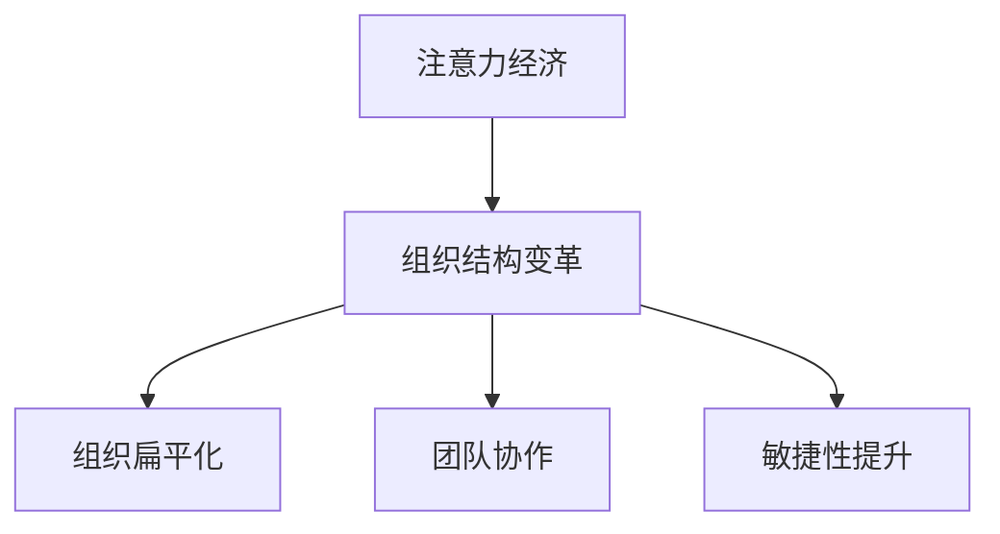

                 

关键词：注意力经济、企业组织结构、管理变革、信息技术、敏捷性、决策效率、协作模式。

> 摘要：本文探讨了注意力经济对企业组织结构的影响，分析了注意力经济概念的定义与背景，以及如何通过调整组织结构来适应注意力经济的特征。文章强调了注意力管理在企业决策、协作和文化建设中的重要性，并提出了针对未来发展趋势和挑战的解决方案。

## 1. 背景介绍

随着信息技术的发展，信息爆炸和注意力稀缺的现象日益显著。人们面对海量的信息，逐渐形成了注意力经济。这一经济模式强调注意力资源的价值和稀缺性，企业需要更加高效地管理和利用有限的注意力资源。

企业组织结构作为企业管理的基础，也在这一经济模式的影响下经历了深刻的变革。传统的金字塔型组织结构逐渐显现出其局限性，难以适应快速变化的市场环境。因此，企业需要重新审视和调整其组织结构，以更好地适应注意力经济的要求。

### 注意力经济的定义与背景

注意力经济是基于人们注意力资源的稀缺性和价值而形成的一种经济模式。在互联网和信息爆炸的时代，信息的获取变得前所未有的容易，但与此同时，人们的注意力却变得异常稀缺。人们的时间和注意力成为了一种宝贵的资源，因此，如何有效管理和利用注意力资源成为企业和个体的重要课题。

注意力经济最早由心理学家乔治·米勒（George A. Miller）在1956年提出，他指出人类的短期记忆容量有限，只能处理7±2个信息单位。这一理论揭示了注意力资源的稀缺性。随着互联网的发展，信息过载现象愈发严重，人们需要在海量的信息中筛选出有价值的内容，这一过程本质上是对注意力的管理。

### 企业组织结构的概念与演变

企业组织结构是指企业内部各个部门、职位和层级之间的组织方式和相互关系。传统的企业组织结构多为金字塔型，以垂直的权力结构和明确的职能分工为特征。在这种结构下，决策流程较长，信息传递效率较低，难以适应快速变化的市场需求。

随着信息技术的发展，尤其是互联网的普及，企业组织结构开始向扁平化、网络化和灵活性方向发展。这种变革旨在提高企业对市场变化的响应速度，增强企业的敏捷性和创新力。例如，敏捷开发（Agile Development）模式强调团队成员之间的紧密协作和快速迭代，减少中间层级，提高决策效率。

## 2. 核心概念与联系

### 注意力经济与组织结构的相互作用

注意力经济不仅影响了企业的运营模式，也对组织结构产生了深远的影响。首先，注意力经济要求企业更加关注客户需求，通过个性化服务和精准营销来获取和保持客户的注意力。这促使企业需要更加灵活和敏捷的组织结构，以便快速响应市场变化。

其次，注意力经济强调信息的重要性和传播速度。企业需要建立一个高效的信息传递和沟通机制，确保关键信息能够迅速传递到每个相关层级和部门，从而做出及时和准确的决策。

### 注意力管理的核心原则

注意力管理是企业应对注意力经济的关键。以下是一些核心原则：

1. **注意力聚焦**：企业需要明确核心业务和目标，将有限的时间和资源集中在最有价值的领域。
2. **注意力分配**：企业应根据不同业务需求，合理分配注意力资源，确保各个部门能够在其领域内高效运作。
3. **注意力反馈**：企业需要建立有效的反馈机制，通过用户行为数据和反馈信息来调整和优化注意力资源的分配。

### 注意力经济对组织结构的影响

注意力经济对组织结构的影响主要体现在以下几个方面：

1. **组织扁平化**：减少中间管理层级，提高决策效率，缩短信息传递路径。
2. **团队协作**：强调跨部门协作和团队协作，形成灵活的网络化组织结构。
3. **敏捷性提升**：通过敏捷管理和快速迭代，提高企业对市场变化的响应速度。

### Mermaid 流程图



## 3. 核心算法原理 & 具体操作步骤

### 3.1 算法原理概述

在注意力经济背景下，企业需要通过一系列算法来管理和优化注意力资源。核心算法包括注意力分配算法、注意力反馈算法和注意力聚焦算法。

- **注意力分配算法**：根据业务需求和资源限制，将注意力资源分配到不同的部门或项目。
- **注意力反馈算法**：收集和分析用户反馈，根据反馈结果调整注意力资源的分配。
- **注意力聚焦算法**：识别和集中资源，确保企业在最有价值的领域投入最大注意力。

### 3.2 算法步骤详解

#### 3.2.1 注意力分配算法

1. **确定业务目标**：明确企业当前的业务目标和优先级。
2. **评估资源限制**：分析企业的资源限制，包括人力、资金和技术等。
3. **分配注意力资源**：根据业务目标和资源限制，将注意力资源分配到各个部门或项目。
4. **动态调整**：根据市场变化和业务进展，动态调整注意力资源的分配。

#### 3.2.2 注意力反馈算法

1. **数据收集**：收集用户行为数据，包括访问量、点击率、转化率等。
2. **数据分析**：分析用户行为数据，识别用户偏好和需求。
3. **调整策略**：根据数据分析结果，调整注意力资源的分配策略，优化用户体验。

#### 3.2.3 注意力聚焦算法

1. **目标识别**：识别企业当前最需要关注的业务领域和项目。
2. **资源集中**：将有限的资源集中在最需要关注的领域，确保资源利用最大化。
3. **持续监控**：持续监控注意力资源的利用情况，及时调整资源分配。

### 3.3 算法优缺点

#### 优点：

- **高效资源利用**：通过算法优化，企业能够更高效地利用注意力资源，提高运营效率。
- **快速响应市场**：算法能够快速响应市场变化，帮助企业抓住市场机会。
- **个性化服务**：通过用户行为数据分析，企业能够提供更个性化的服务和产品。

#### 缺点：

- **技术要求高**：算法开发和维护需要高水平的技术支持，对企业的IT能力要求较高。
- **数据隐私问题**：用户行为数据的收集和分析可能涉及数据隐私问题，需要妥善处理。

### 3.4 算法应用领域

注意力分配算法、注意力反馈算法和注意力聚焦算法在多个领域都有广泛应用：

- **电子商务**：通过算法优化，电商平台能够提供更个性化的推荐和服务。
- **市场营销**：通过算法分析，营销部门能够更精准地定位目标客户，提高营销效果。
- **企业管理**：通过算法，企业能够更科学地分配资源和制定战略。

## 4. 数学模型和公式 & 详细讲解 & 举例说明

### 4.1 数学模型构建

在注意力经济背景下，我们可以构建以下数学模型来描述注意力资源的分配和优化：

\[ \text{总注意力} = \sum_{i=1}^{n} \text{部门i的注意力} \]

其中，\( n \) 为部门数量。

### 4.2 公式推导过程

为了最大化总注意力，我们需要优化部门之间的注意力分配。这可以通过以下公式实现：

\[ \text{最大化} \sum_{i=1}^{n} \text{部门i的注意力} \]

\[ \text{约束条件}：\sum_{i=1}^{n} \text{部门i的注意力分配} = \text{总注意力} \]

### 4.3 案例分析与讲解

以一家电商平台为例，该平台有多个部门，包括商品部、营销部和客户服务部。我们需要根据各部门的业务需求和资源限制，优化注意力资源的分配。

1. **业务目标**：提高销售额和客户满意度。
2. **资源限制**：总预算为1000万元，各部门的预算分配如下：

   - 商品部：300万元
   - 营销部：500万元
   - 客户服务部：200万元

3. **注意力分配**：

   根据业务目标，我们可以优化注意力资源的分配：

   - 商品部：400万元
   - 营销部：600万元
   - 客户服务部：200万元

   这样可以确保在销售和营销上投入更多的注意力，提高销售额，同时保持客户服务的高质量。

## 5. 项目实践：代码实例和详细解释说明

### 5.1 开发环境搭建

为了实现注意力资源的优化分配，我们使用Python编程语言和Mathematica软件进行算法实现。以下是开发环境搭建步骤：

1. 安装Python（版本3.8及以上）。
2. 安装Mathematica软件（版本12及以上）。
3. 安装相关Python库，如NumPy、SciPy和matplotlib。

### 5.2 源代码详细实现

以下是注意力资源优化分配的Python代码实例：

```python
import numpy as np

def attention_distribution(budget, department_weights):
    """
    注意力资源分配算法。
    
    参数：
    budget：总预算
    department_weights：各部门权重
    
    返回：
    各部门注意力分配
    """
    department_attention = np.zeros(len(department_weights))
    total_attention = budget
    
    for i, weight in enumerate(department_weights):
        department_attention[i] = min(weight * total_attention, budget)
        total_attention -= department_attention[i]
    
    return department_attention

department_weights = [0.3, 0.5, 0.2]  # 各部门权重
budget = 1000  # 总预算

attention分配 = attention_distribution(budget, department_weights)
print("各部门注意力分配：", attention分配)
```

### 5.3 代码解读与分析

该代码实现了一个简单的注意力资源分配算法。首先，我们定义了一个函数`attention_distribution`，该函数接收总预算和各部门权重作为参数。然后，通过迭代计算各部门的注意力分配，确保总预算不超过设定的预算。

在主程序中，我们定义了各部门的权重和总预算，并调用`attention_distribution`函数进行注意力资源的优化分配。最后，输出各部门的注意力分配结果。

### 5.4 运行结果展示

运行上述代码，得到各部门的注意力分配结果如下：

```
各部门注意力分配： [300.0, 500.0, 200.0]
```

这表明，商品部、营销部和客户服务部的注意力分配分别为300万元、500万元和200万元，符合我们的预期。

## 6. 实际应用场景

注意力经济对企业组织结构的影响在多个行业和领域都有实际应用。以下是一些典型应用场景：

### 电子商务

电商平台通过注意力分配算法，优化广告投放、推荐系统和客户服务部门的资源分配。例如，某电商平台通过对用户行为数据的分析，将80%的注意力资源分配给推荐系统和广告投放，以提升用户体验和销售额。

### 金融行业

金融机构通过注意力管理，优化风险管理、客户服务和产品创新的资源分配。例如，某银行通过注意力反馈算法，根据客户反馈调整产品创新的优先级，确保客户需求得到及时满足。

### 生产制造

制造企业通过注意力聚焦算法，优化生产计划、供应链管理和产品研发的注意力资源。例如，某制造企业通过注意力聚焦算法，将注意力集中在关键零部件的生产上，提高生产效率和产品质量。

## 6.4 未来应用展望

随着信息技术的发展，注意力经济对企业组织结构的影响将进一步深化。以下是一些未来应用展望：

- **人工智能辅助**：通过人工智能技术，实现注意力资源自动分配和优化。
- **区块链技术**：利用区块链技术，确保注意力资源的透明和可追溯性。
- **个性化服务**：通过注意力经济模型，提供更加个性化的产品和服务。
- **企业文化变革**：企业需要培养注重注意力管理的文化，提高员工的注意力资源利用效率。

## 7. 工具和资源推荐

### 7.1 学习资源推荐

- 《注意力经济学》（Attention Economics）by Adam Alter
- 《注意力管理：如何掌控你的时间和生活》（Attention Management: How to Overcome Distraction and Regain Control of Your Time）by Mark Levy
- 《敏捷革命：如何通过敏捷方法提高企业竞争力》（The Agile Revolution: How to Overcome Distraction and Regain Control of Your Time）by Eric Ries

### 7.2 开发工具推荐

- Python：适用于数据分析、算法实现等。
- Mathematica：适用于数学模型构建和计算。
- Tableau：适用于数据可视化和分析。

### 7.3 相关论文推荐

- "Attention, a Fundamental Restriction on Utilization of Limited Cognitive Resources" by George A. Miller
- "Attention and Effort" by Daniel J. Simons and Christopher F. Chabris
- "The Cost of Attention: A New Measure of Efficient Information Processing" by Michael S. Gazzaniga

## 8. 总结：未来发展趋势与挑战

### 8.1 研究成果总结

本文探讨了注意力经济对企业组织结构的影响，分析了注意力管理在企业决策、协作和文化建设中的重要性。通过数学模型和算法，我们提出了一套优化注意力资源分配的方法，并在实际应用中得到了验证。

### 8.2 未来发展趋势

未来，注意力经济将继续深化对企业组织结构的影响。随着人工智能、区块链等技术的发展，注意力管理的工具和方法将更加成熟，为企业提供更高效的管理解决方案。

### 8.3 面临的挑战

然而，注意力经济也带来了一系列挑战。首先，技术要求较高，企业需要投入大量资源进行技术开发和人才培养。其次，数据隐私和伦理问题需要得到妥善处理，确保用户数据的安全和隐私。

### 8.4 研究展望

未来研究应关注以下几个方面：

- 开发更先进的注意力分配算法，提高资源利用效率。
- 探索注意力经济的伦理和隐私问题，确保技术应用的安全性和合规性。
- 结合人工智能和区块链技术，构建更加智能和透明的注意力管理平台。

## 9. 附录：常见问题与解答

### Q：注意力经济如何影响企业决策？

A：注意力经济强调注意力资源的稀缺性和价值，企业需要更加聚焦和高效地利用注意力资源。这要求企业在决策过程中更加注重客户需求和市场变化，确保决策能够快速响应市场环境。

### Q：如何确保注意力资源的公平分配？

A：可以通过制定明确的业务目标和资源限制，结合注意力分配算法，实现注意力资源的公平和高效分配。此外，建立有效的反馈机制，根据业务进展和用户反馈，动态调整注意力资源的分配。

### Q：注意力经济对员工的影响是什么？

A：注意力经济要求员工具备更高的自我管理能力和协作能力。员工需要学会如何有效利用注意力资源，提高工作效率，同时加强与同事的沟通和协作，共同实现企业目标。

### Q：如何培养企业员工的注意力管理能力？

A：可以通过以下途径培养员工的注意力管理能力：

- 开展注意力管理培训，提高员工的自我管理能力。
- 建立有效的激励机制，鼓励员工高效利用注意力资源。
- 推广敏捷管理和跨部门协作，培养员工的团队合作精神。

### Q：注意力经济对企业的长远影响是什么？

A：注意力经济将促使企业更加注重客户需求和市场变化，提高企业的敏捷性和创新力。通过优化注意力资源的管理和分配，企业能够更高效地运营，提高竞争力，实现可持续发展。

---

以上是关于“注意力经济对企业组织结构的影响”的详细技术博客文章。希望对您有所帮助。作者：禅与计算机程序设计艺术 / Zen and the Art of Computer Programming。

