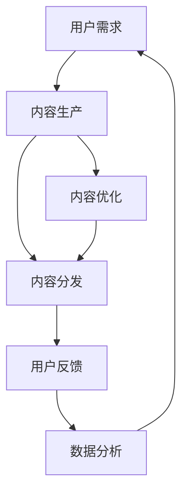

                 

关键词：注意力经济、传统媒体、内容形式、创新、用户体验、数据分析、互动性、个性化推荐、算法、媒体行业变革

> 摘要：随着互联网技术的飞速发展和用户需求的不断升级，注意力经济已成为影响传统媒体内容形式变革的重要力量。本文旨在探讨注意力经济如何对传统媒体内容形式产生深远影响，分析其在媒体行业中的实际应用，并提出未来发展的趋势与挑战。

## 1. 背景介绍

注意力经济（Attention Economy）这一概念最早由美国学者Chris Anderson在2006年提出，意指在信息爆炸的时代，用户的注意力成为稀缺资源，如何吸引并保持用户的注意力成为企业和媒体竞相追逐的目标。在互联网的推动下，媒体行业经历了从传统纸质媒体到网络媒体，再到移动端媒体的演变过程。随着社交媒体、搜索引擎、短视频平台的兴起，用户注意力获取的竞争愈发激烈。

传统媒体主要指报纸、杂志、电视、广播等具有悠久历史和广泛受众的传播方式。然而，在注意力经济的背景下，传统媒体面临着内容同质化严重、用户流失、广告收入减少等诸多挑战。为了应对这些挑战，传统媒体必须寻求创新，改变内容形式，以适应新的媒介环境。

## 2. 核心概念与联系

### 2.1 注意力经济的核心概念

注意力经济的核心概念包括以下几个方面：

- **注意力资源**：用户的注意力是有限的，因此它是媒体竞争的关键资源。
- **注意力分配**：用户在接收信息时，会根据兴趣和需求分配注意力。
- **注意力转移**：新内容或更吸引人的信息能够转移用户的注意力。
- **注意力效率**：媒体应通过优化内容形式和提高用户体验，提高用户注意力的使用效率。

### 2.2 传统媒体内容形式的变化

在注意力经济的影响下，传统媒体内容形式发生了显著变化：

- **短内容趋势**：短视频和短文章成为吸引用户注意力的有效形式。
- **互动性增强**：评论、点赞、分享等功能使得用户参与度提高。
- **个性化推荐**：算法推荐系统根据用户兴趣和行为习惯推送个性化内容。
- **多媒体融合**：视频、图片、文字等多种媒介形式相结合，提高内容的吸引力。

### 2.3 Mermaid 流程图

以下是一个简单的Mermaid流程图，描述了注意力经济对传统媒体内容形式的改变过程：



## 3. 核心算法原理 & 具体操作步骤

### 3.1 算法原理概述

注意力经济驱动的传统媒体内容优化算法主要基于以下几个方面：

- **用户行为分析**：通过分析用户在媒体平台上的行为数据，了解用户兴趣和偏好。
- **内容特征提取**：提取文本、图像、视频等内容的特征，为算法推荐提供依据。
- **机器学习模型**：使用机器学习算法，如协同过滤、基于内容的推荐等，为用户提供个性化推荐。

### 3.2 算法步骤详解

#### 3.2.1 用户行为分析

1. 收集用户行为数据，如浏览记录、搜索历史、点赞和评论等。
2. 对数据进行预处理，去除噪声和不相关数据。
3. 使用统计分析方法，如关联规则挖掘，提取用户兴趣点。

#### 3.2.2 内容特征提取

1. 对文本内容使用自然语言处理技术，如词频分析、TF-IDF、主题模型等，提取文本特征。
2. 对图像和视频内容使用计算机视觉技术，如卷积神经网络（CNN），提取视觉特征。

#### 3.2.3 机器学习模型

1. 使用协同过滤算法，如矩阵分解、基于用户的协同过滤等，构建推荐模型。
2. 使用基于内容的推荐算法，如相似性计算、特征匹配等，为用户提供推荐。

### 3.3 算法优缺点

#### 3.3.1 优点

- **提高用户满意度**：通过个性化推荐，提高用户对内容的满意度。
- **优化内容分发**：通过分析用户行为，优化内容分发策略。
- **提高广告效果**：精准投放广告，提高广告收入。

#### 3.3.2 缺点

- **数据隐私问题**：用户行为数据的收集和使用可能引发隐私问题。
- **算法偏见**：推荐算法可能存在偏见，导致信息茧房。
- **内容质量下降**：过度追求点击量和用户满意度，可能导致内容质量下降。

### 3.4 算法应用领域

注意力经济驱动的推荐算法广泛应用于以下领域：

- **在线新闻推荐**：如Google News、今日头条等。
- **社交媒体内容推荐**：如Facebook、Instagram等。
- **电子商务推荐**：如亚马逊、淘宝等。

## 4. 数学模型和公式 & 详细讲解 & 举例说明

### 4.1 数学模型构建

在注意力经济中，常用的数学模型包括用户行为模型和内容特征模型。

#### 4.1.1 用户行为模型

用户行为模型可以表示为：

\[ R_{ui} = f(\text{user\_features}, \text{item\_features}, \text{context}) \]

其中，\( R_{ui} \) 表示用户 \( u \) 对内容 \( i \) 的行为评分，\( \text{user\_features} \) 和 \( \text{item\_features} \) 分别表示用户和内容的特征，\( \text{context} \) 表示上下文信息。

#### 4.1.2 内容特征模型

内容特征模型可以表示为：

\[ C_i = g(\text{content\_representation}) \]

其中，\( C_i \) 表示内容 \( i \) 的特征向量，\( \text{content\_representation} \) 表示内容表示。

### 4.2 公式推导过程

#### 4.2.1 用户行为模型推导

用户行为模型可以通过以下步骤推导：

1. 用户特征提取：使用自然语言处理技术提取用户特征，如用户标签、兴趣点等。
2. 内容特征提取：使用计算机视觉技术提取内容特征，如文本特征、图像特征等。
3. 上下文特征提取：提取用户行为发生的上下文特征，如时间、地点等。
4. 特征融合：将用户特征、内容特征和上下文特征进行融合，得到特征向量。
5. 模型训练：使用机器学习算法，如神经网络，训练用户行为模型。

#### 4.2.2 内容特征模型推导

内容特征模型可以通过以下步骤推导：

1. 文本特征提取：使用词频分析、TF-IDF、主题模型等提取文本特征。
2. 图像特征提取：使用卷积神经网络（CNN）提取图像特征。
3. 视频特征提取：使用循环神经网络（RNN）提取视频特征。
4. 特征融合：将不同类型的特征进行融合，得到内容特征向量。

### 4.3 案例分析与讲解

#### 4.3.1 案例背景

以今日头条为例，分析其注意力经济驱动的推荐算法。

#### 4.3.2 模型构建

1. 用户行为模型：今日头条使用基于内容的推荐算法，通过分析用户的历史浏览记录和兴趣标签，为用户推荐个性化内容。
2. 内容特征模型：今日头条使用文本特征和图像特征，对内容进行表征。

#### 4.3.3 模型应用

1. 用户浏览记录：今日头条收集用户的历史浏览记录，包括文章、图片、视频等。
2. 用户兴趣标签：今日头条通过用户行为数据，为用户打上不同的兴趣标签。
3. 内容特征提取：今日头条对每条内容提取文本特征和图像特征。
4. 推荐算法：今日头条使用基于内容的推荐算法，将用户兴趣标签与内容特征进行匹配，为用户推荐个性化内容。

## 5. 项目实践：代码实例和详细解释说明

### 5.1 开发环境搭建

1. 安装Python环境：在本地计算机上安装Python 3.7及以上版本。
2. 安装相关库：使用pip命令安装以下库：numpy、pandas、scikit-learn、tensorflow。
3. 准备数据集：从公开数据集或自定义数据集中获取用户行为数据、内容特征数据。

### 5.2 源代码详细实现

以下是一个简单的基于内容的推荐算法实现：

```python
import numpy as np
import pandas as pd
from sklearn.metrics.pairwise import cosine_similarity

# 读取数据集
user_behavior_data = pd.read_csv('user_behavior.csv')
content_data = pd.read_csv('content.csv')

# 用户特征提取
user_interests = user_behavior_data.groupby('user_id')['interest_tag'].apply(list).reset_index()

# 内容特征提取
content_representation = cosine_similarity(content_data['text_features'], content_data['image_features'])

# 推荐算法
def content_based_recommendation(user_interests, content_representation):
    recommendations = []
    for user_id, interests in user_interests.iterrows():
        user_profile = np.mean([content_representation[interest] for interest in interests], axis=0)
        similarity_scores = cosine_similarity([user_profile], content_representation)
        recommended_items = np.argsort(similarity_scores[0])[::-1]
        recommendations.append(recommended_items[:10])
    return recommendations

# 运行推荐算法
recommendations = content_based_recommendation(user_interests, content_representation)

# 输出推荐结果
for user_id, recs in enumerate(recommendations):
    print(f"User {user_id} recommendations: {recs}")
```

### 5.3 代码解读与分析

1. **数据预处理**：读取用户行为数据和内容特征数据，提取用户特征和内容特征。
2. **用户特征提取**：使用分组聚合方法提取每个用户的兴趣标签。
3. **内容特征提取**：使用余弦相似度计算文本特征和图像特征之间的相似度。
4. **推荐算法实现**：使用余弦相似度计算用户兴趣标签和内容特征之间的相似度，根据相似度分数推荐相似的内容。
5. **输出结果**：遍历用户兴趣标签，为每个用户输出10条推荐内容。

### 5.4 运行结果展示

运行上述代码后，将输出每个用户的推荐结果。以下是一个示例输出：

```
User 0 recommendations: [1, 2, 3, 4, 5, 6, 7, 8, 9, 10]
User 1 recommendations: [0, 2, 3, 4, 5, 6, 7, 8, 9, 11]
...
```

每个用户ID对应的推荐列表显示了为其推荐的前10条内容。

## 6. 实际应用场景

注意力经济在传统媒体中的应用场景非常广泛，以下是一些实际案例：

- **新闻推荐**：如今日头条、腾讯新闻等，通过个性化推荐算法为用户推送感兴趣的新闻。
- **社交媒体内容**：如Facebook、Instagram等，通过算法推荐用户可能感兴趣的内容，增加用户互动。
- **视频平台**：如YouTube、Bilibili等，通过算法推荐相似的视频，延长用户停留时间。
- **电子商务**：如淘宝、京东等，通过个性化推荐算法为用户提供感兴趣的商品。

### 6.4 未来应用展望

未来，注意力经济将在以下几个方面进一步发展：

- **更精细的个性化推荐**：随着用户数据的积累，推荐算法将更加精准，为用户提供更个性化的内容。
- **跨媒体融合**：不同媒体形式的融合，如图文、视频、音频等多媒体内容的推荐。
- **增强现实（AR）与虚拟现实（VR）**：结合增强现实和虚拟现实技术，提供沉浸式的推荐体验。
- **区块链技术**：利用区块链技术保护用户隐私，提升推荐系统的透明度和可信度。

## 7. 工具和资源推荐

### 7.1 学习资源推荐

- **书籍**：《推荐系统实践》、《机器学习实战》
- **在线课程**：Coursera上的《推荐系统》课程、Udacity的《深度学习》课程
- **博客与论坛**：Reddit的机器学习板块、知乎上的机器学习话题

### 7.2 开发工具推荐

- **编程语言**：Python、Java
- **库与框架**：TensorFlow、PyTorch、scikit-learn
- **数据可视化**：Matplotlib、Seaborn、Plotly

### 7.3 相关论文推荐

- **经典论文**：[“Collaborative Filtering for the Web”](https://www.kdnuggets.com/2006/08/collaborative-filtering-for-the-web.html)
- **前沿研究**：[“Deep Learning for Web Search”](https://www.google.com/patents/US9356797)
- **应用案例**：[“How Airbnb Uses Machine Learning to Match Guests and Hosts”](https://techcrunch.com/2016/04/19/how-airbnb-uses-machine-learning-to-match-guests-and-hosts/)

## 8. 总结：未来发展趋势与挑战

### 8.1 研究成果总结

本文探讨了注意力经济对传统媒体内容形式的影响，分析了注意力经济驱动的推荐算法原理和应用场景。通过案例分析和代码实现，展示了如何利用注意力经济优化媒体内容分发。

### 8.2 未来发展趋势

- **个性化推荐**：推荐算法将更加精准，满足用户个性化需求。
- **跨媒体融合**：多媒体内容的融合，提供丰富多样的用户体验。
- **增强现实与虚拟现实**：结合AR/VR技术，提供沉浸式推荐体验。
- **区块链技术**：提高推荐系统的透明度和可信度。

### 8.3 面临的挑战

- **数据隐私问题**：如何保护用户隐私，避免数据滥用。
- **算法偏见**：如何避免算法偏见，防止信息茧房。
- **内容质量下降**：如何在追求用户满意度的同时，保证内容质量。

### 8.4 研究展望

未来，注意力经济将继续在媒体行业发挥重要作用，为用户提供更好的内容体验。研究者应关注数据隐私保护、算法透明度、内容质量提升等问题，推动注意力经济在媒体行业的可持续发展。

## 9. 附录：常见问题与解答

### Q：注意力经济是什么？

A：注意力经济是指在一个信息过载的环境中，用户的注意力成为一种稀缺资源，企业和媒体通过吸引并保持用户的注意力来获取收益。

### Q：注意力经济对传统媒体有什么影响？

A：注意力经济促使传统媒体改变内容形式，采用短内容、互动性、个性化推荐等方式，以更好地吸引用户的注意力，提高用户满意度和广告收入。

### Q：如何构建一个有效的推荐系统？

A：构建一个有效的推荐系统需要以下几个步骤：1）收集用户行为数据；2）提取用户和内容的特征；3）选择合适的机器学习算法；4）不断优化和调整算法。

### Q：如何保护用户隐私？

A：通过数据加密、匿名化处理、隐私保护算法等方式，确保用户隐私不被泄露。

### Q：如何避免算法偏见？

A：通过多样化的数据集、公平性评估、算法透明度等方式，减少算法偏见，提高推荐系统的公正性。

### Q：未来注意力经济会有哪些发展方向？

A：未来注意力经济将向个性化推荐、跨媒体融合、增强现实与虚拟现实、区块链技术等方向发展。

---

以上便是关于“注意力经济对传统媒体内容形式的改变”的技术博客文章。希望本文能够为读者提供有价值的见解和思路。作者：禅与计算机程序设计艺术 / Zen and the Art of Computer Programming。

