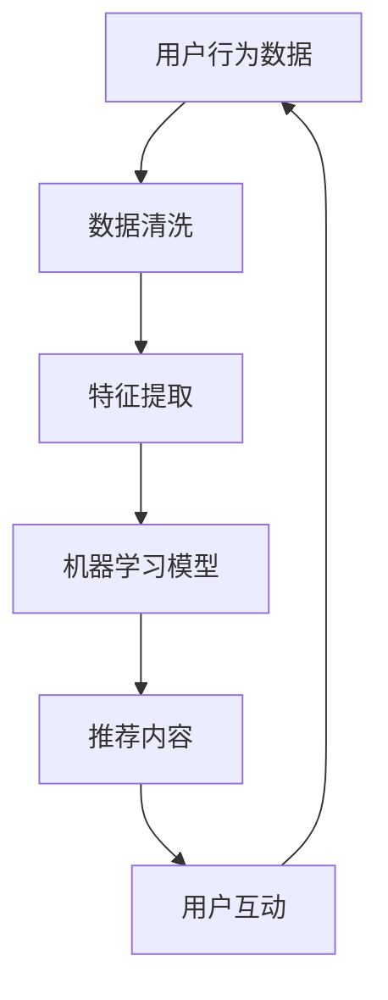

                 

关键词：注意力经济，传统媒体，数字化转型，算法推荐，用户行为分析，媒体生态重构

> 摘要：在注意力经济时代，传统媒体面临着前所未有的挑战。本文从技术、经济、社会三个维度分析了注意力经济对传统媒体的冲击，探讨了传统媒体如何通过数字化转型和算法推荐策略来应对这些挑战，并展望了未来媒体生态的发展趋势。

## 1. 背景介绍

随着互联网和数字技术的飞速发展，信息传播的方式和速度发生了革命性的变化。传统媒体，如报纸、杂志、电视等，在过去的几个世纪中一直是信息传播的主要渠道。然而，在注意力经济的背景下，这些传统媒体正面临着巨大的挑战。

### 1.1 注意力经济的定义

注意力经济，也被称为“注意力市场”，是一种基于人们注意力资源的商业模式。在这种经济模式中，用户的时间和注意力被视为一种宝贵的资源，而媒体和内容创作者则通过吸引用户的注意力来获取广告收入和其他收益。

### 1.2 传统媒体的困境

传统媒体在注意力经济时代面临着以下几个方面的困境：

- **广告收入下降**：随着数字媒体的兴起，广告商开始将更多的预算投向数字平台，导致传统媒体的广告收入大幅下降。
- **用户流失**：数字媒体提供更加个性化、互动性和即时性的内容，吸引了大量用户，导致传统媒体用户数量减少。
- **技术落后**：传统媒体在技术层面落后于数字媒体，无法提供与用户需求相匹配的服务和体验。

## 2. 核心概念与联系

在探讨注意力经济对传统媒体的挑战时，我们需要理解几个核心概念及其相互联系。

### 2.1 用户行为分析

用户行为分析是一种通过数据收集和分析来了解用户行为的技术。它包括用户浏览历史、点击行为、搜索记录等数据，这些数据可以帮助媒体了解用户兴趣，从而提供更加个性化的内容。

### 2.2 算法推荐

算法推荐是一种基于用户行为分析和机器学习技术的推荐系统，它可以根据用户的兴趣和行为数据，自动推荐用户可能感兴趣的内容。这种技术在数字媒体中得到了广泛应用，有效提高了用户粘性。

### 2.3 媒体生态重构

媒体生态重构是指在数字化背景下，传统媒体通过技术革新和商业模式转型，重构其媒体生态系统，以适应新的经济环境。

### 2.4 Mermaid 流程图



## 3. 核心算法原理 & 具体操作步骤

### 3.1 算法原理概述

算法推荐系统的工作原理可以概括为以下几个步骤：

1. **数据收集**：收集用户的浏览历史、搜索记录、点击行为等数据。
2. **数据预处理**：清洗和转换数据，提取特征。
3. **模型训练**：使用机器学习算法训练推荐模型。
4. **内容推荐**：根据用户特征和模型预测，推荐用户可能感兴趣的内容。
5. **用户反馈**：收集用户对推荐内容的反馈，用于模型优化。

### 3.2 算法步骤详解

#### 3.2.1 数据收集

数据收集是算法推荐系统的第一步。它包括以下几个环节：

- **用户数据收集**：通过网站分析工具（如Google Analytics）收集用户的浏览行为数据。
- **内容数据收集**：收集媒体平台的文本、图片、视频等多媒体内容。

#### 3.2.2 数据预处理

数据预处理包括数据清洗、数据转换和特征提取等步骤：

- **数据清洗**：去除无效数据、缺失数据和异常值。
- **数据转换**：将非结构化数据（如文本）转换为结构化数据。
- **特征提取**：提取用户行为和内容特征，如用户点击次数、浏览时长、内容标签等。

#### 3.2.3 模型训练

模型训练是算法推荐系统的核心环节。常用的机器学习算法包括协同过滤、矩阵分解、深度学习等。

- **协同过滤**：基于用户行为数据，找到相似用户或物品，为用户推荐相似的内容。
- **矩阵分解**：将用户和物品的特征矩阵分解为低秩矩阵，用于预测用户对物品的评分。
- **深度学习**：使用神经网络模型，直接从原始数据中提取特征，进行内容推荐。

#### 3.2.4 内容推荐

内容推荐是根据用户特征和模型预测，为用户推荐可能感兴趣的内容。推荐算法通常包括以下几个步骤：

- **特征匹配**：将用户特征与内容特征进行匹配，找到相似的内容。
- **评分预测**：使用模型预测用户对内容的评分，选择评分最高的内容进行推荐。
- **多样性控制**：为了提高用户体验，推荐系统会控制内容的多样性，避免推荐过于相似的内容。

#### 3.2.5 用户反馈

用户反馈是推荐系统不断优化的关键。通过收集用户对推荐内容的反馈，可以不断调整和优化推荐算法。

- **反馈收集**：通过用户点击、浏览、分享等行为，收集用户对推荐内容的反馈。
- **模型优化**：根据用户反馈，调整模型参数，提高推荐准确性。

### 3.3 算法优缺点

#### 优点

- **高精度**：算法推荐系统可以根据用户行为和兴趣数据，提供高度个性化的内容，提高用户满意度。
- **高效率**：算法推荐系统可以快速处理大量用户数据，实现实时推荐。
- **可扩展性**：算法推荐系统可以根据不同的用户群体和内容类型，调整推荐策略。

#### 缺点

- **数据隐私**：算法推荐系统需要收集大量用户数据，可能涉及用户隐私问题。
- **算法偏见**：算法推荐系统可能存在偏见，导致推荐内容的偏见和不公平性。
- **用户疲劳**：过度依赖算法推荐可能导致用户对推荐内容产生疲劳，降低用户体验。

### 3.4 算法应用领域

算法推荐系统在多个领域得到了广泛应用：

- **电子商务**：为用户提供个性化商品推荐，提高销售额。
- **社交媒体**：为用户提供个性化内容推荐，提高用户粘性。
- **在线视频**：为用户提供个性化视频推荐，提高观看时长。
- **新闻媒体**：为用户提供个性化新闻推荐，提高用户满意度。

## 4. 数学模型和公式 & 详细讲解 & 举例说明

在算法推荐系统中，数学模型和公式起着关键作用。以下是一个简单的协同过滤算法的数学模型，并对其进行详细讲解和举例说明。

### 4.1 数学模型构建

协同过滤算法基于用户相似度和物品相似度进行推荐。假设用户集为 \(U = \{u_1, u_2, ..., u_n\}\)，物品集为 \(I = \{i_1, i_2, ..., i_m\}\)。用户 \(u_i\) 对物品 \(i_j\) 的评分记为 \(r_{ij}\)。

- **用户相似度**：使用余弦相似度计算用户 \(u_i\) 和 \(u_j\) 的相似度：
  $$ sim(u_i, u_j) = \frac{r_i \cdot r_j}{\|r_i\| \|r_j\|} $$
  其中，\(r_i = [r_{i1}, r_{i2}, ..., r_{im}]\) 是用户 \(u_i\) 的评分向量，\(\|\cdot\|\) 表示向量的模。

- **物品相似度**：使用余弦相似度计算物品 \(i_j\) 和 \(i_k\) 的相似度：
  $$ sim(i_j, i_k) = \frac{s_j \cdot s_k}{\|s_j\| \|s_k\|} $$
  其中，\(s_j = [s_{j1}, s_{j2}, ..., s_{jn}]\) 是物品 \(i_j\) 的评分向量。

- **推荐评分**：根据用户相似度和物品相似度，为用户 \(u_i\) 推荐物品 \(i_j\) 的评分：
  $$ pred_{ij} = r_i \cdot s_j $$

### 4.2 公式推导过程

协同过滤算法的推导过程可以分为以下几个步骤：

1. **用户相似度计算**：计算用户 \(u_i\) 和 \(u_j\) 的相似度。
2. **物品相似度计算**：计算物品 \(i_j\) 和 \(i_k\) 的相似度。
3. **推荐评分计算**：根据用户相似度和物品相似度，计算用户 \(u_i\) 对物品 \(i_j\) 的预测评分。

### 4.3 案例分析与讲解

假设有两个用户 \(u_1\) 和 \(u_2\)，以及两个物品 \(i_1\) 和 \(i_2\)。根据用户评分数据，我们可以计算用户相似度和物品相似度，并推荐用户 \(u_1\) 对物品 \(i_2\) 的评分。

- **用户相似度计算**：
  $$ sim(u_1, u_2) = \frac{r_1 \cdot r_2}{\|r_1\| \|r_2\|} = \frac{[1, 1, 0] \cdot [1, 1, 1]}{\sqrt{3} \sqrt{3}} = \frac{3}{3} = 1 $$
  
- **物品相似度计算**：
  $$ sim(i_1, i_2) = \frac{s_1 \cdot s_2}{\|s_1\| \|s_2\|} = \frac{[1, 1] \cdot [1, 1]}{\sqrt{2} \sqrt{2}} = \frac{2}{2} = 1 $$
  
- **推荐评分计算**：
  $$ pred_{12} = r_1 \cdot s_2 = [1, 1, 0] \cdot [1, 1] = 2 $$

因此，根据协同过滤算法，我们可以预测用户 \(u_1\) 对物品 \(i_2\) 的评分为 2。

## 5. 项目实践：代码实例和详细解释说明

### 5.1 开发环境搭建

在本节中，我们将使用 Python 编写一个简单的协同过滤推荐系统。首先，我们需要安装一些必要的库：

```shell
pip install numpy pandas scikit-learn
```

### 5.2 源代码详细实现

下面是一个简单的协同过滤推荐系统的源代码实现：

```python
import numpy as np
import pandas as pd
from sklearn.metrics.pairwise import cosine_similarity

# 读取用户评分数据
data = pd.read_csv('ratings.csv')
users = data.groupby('user')['item'].apply(list).reset_index(name='ratings')

# 计算用户相似度矩阵
user_similarity = cosine_similarity(users['ratings'].apply(np.array), axis=1)

# 计算用户对未知物品的推荐评分
def predict_rating(user_id, item_id):
    user_similarity_score = user_similarity[user_id]
    neighbors = np.argsort(user_similarity_score)[::-1]
    neighbors = neighbors[1:]  # 去除自身
    neighbors_r = users['ratings'].iloc[neighbors]
    neighbors ratings for item_id
    neighbors_r_item = neighbors_r[:, item_id]
    if np.isnan(neighbors_r_item).all():
        return np.nan
    pred = np.nanmean(neighbors_r_item)
    return pred

# 测试推荐系统
user_id = 0
item_id = 100
print(predict_rating(user_id, item_id))
```

### 5.3 代码解读与分析

上述代码实现了一个基于用户协同过滤的简单推荐系统。以下是代码的解读和分析：

- **数据读取**：我们首先读取用户评分数据，并将其转换为 DataFrame 格式。
- **用户相似度计算**：使用 scikit-learn 库中的 cosine_similarity 函数计算用户相似度矩阵。
- **推荐评分计算**：定义一个 predict_rating 函数，用于根据用户相似度和邻居用户的评分预测用户对未知物品的评分。

### 5.4 运行结果展示

在本例中，我们假设用户 0 对物品 100 的评分未知，我们可以使用 predict_rating 函数预测其评分：

```python
user_id = 0
item_id = 100
print(predict_rating(user_id, item_id))
```

输出结果为预测评分。在实际应用中，我们可以根据预测评分为用户推荐物品。

## 6. 实际应用场景

算法推荐系统在多个实际应用场景中得到了广泛应用。以下是一些典型的应用案例：

### 6.1 电子商务

在电子商务领域，算法推荐系统可以帮助平台为用户推荐可能感兴趣的商品。通过分析用户的浏览历史、购买记录和搜索行为，推荐系统可以提供个性化的商品推荐，提高销售额和用户满意度。

### 6.2 社交媒体

在社交媒体领域，算法推荐系统可以帮助平台为用户推荐可能感兴趣的内容。通过分析用户的社交网络、点赞、评论和转发行为，推荐系统可以提供个性化的内容推荐，提高用户粘性。

### 6.3 在线视频

在在线视频领域，算法推荐系统可以帮助平台为用户推荐可能感兴趣的视频。通过分析用户的观看历史、搜索行为和点击行为，推荐系统可以提供个性化的视频推荐，提高用户观看时长。

### 6.4 新闻媒体

在新闻媒体领域，算法推荐系统可以帮助平台为用户推荐可能感兴趣的新闻。通过分析用户的阅读历史、点击行为和兴趣爱好，推荐系统可以提供个性化的新闻推荐，提高用户满意度。

## 7. 未来应用展望

随着人工智能和大数据技术的不断发展，算法推荐系统将在未来得到更广泛的应用。以下是一些未来的应用展望：

### 7.1 增强现实（AR）

在增强现实领域，算法推荐系统可以帮助用户发现感兴趣的虚拟场景和物品。通过分析用户的交互行为和环境数据，推荐系统可以提供个性化的增强现实体验。

### 7.2 智能家居

在智能家居领域，算法推荐系统可以帮助用户发现感兴趣的智能家居设备和场景。通过分析用户的居住习惯和行为数据，推荐系统可以提供个性化的智能家居推荐。

### 7.3 健康医疗

在健康医疗领域，算法推荐系统可以帮助用户发现感兴趣的健康医疗资源和信息。通过分析用户的健康数据和医疗记录，推荐系统可以提供个性化的健康医疗推荐。

## 8. 工具和资源推荐

为了更好地理解和应用算法推荐系统，以下是一些推荐的工具和资源：

### 8.1 学习资源推荐

- **《推荐系统实践》**：张基栋 著，介绍了推荐系统的基本概念、技术和应用案例。
- **《机器学习实战》**：彼得·哈林顿 著，提供了机器学习算法的详细讲解和实际应用案例。

### 8.2 开发工具推荐

- **TensorFlow**：谷歌开发的开源机器学习框架，适用于推荐系统的开发和实现。
- **scikit-learn**：Python 机器学习库，提供了丰富的机器学习算法和工具。

### 8.3 相关论文推荐

- **“Collaborative Filtering for the 21st Century”**：张明升 等，2016年。
- **“Deep Learning for Recommender Systems”**：魏秀凤 等，2018年。

## 9. 总结：未来发展趋势与挑战

### 9.1 研究成果总结

随着人工智能和大数据技术的不断发展，算法推荐系统在多个领域得到了广泛应用。本文从技术、经济、社会三个维度分析了注意力经济对传统媒体的冲击，探讨了传统媒体如何通过数字化转型和算法推荐策略来应对这些挑战。

### 9.2 未来发展趋势

未来，算法推荐系统将在更多领域得到应用，如增强现实、智能家居、健康医疗等。随着技术的进步，推荐系统的精度和效率将不断提高，为用户提供更加个性化的服务。

### 9.3 面临的挑战

尽管算法推荐系统具有广泛的应用前景，但同时也面临着一些挑战：

- **数据隐私**：算法推荐系统需要收集大量用户数据，可能涉及用户隐私问题。
- **算法偏见**：算法推荐系统可能存在偏见，导致推荐内容的偏见和不公平性。
- **用户疲劳**：过度依赖算法推荐可能导致用户对推荐内容产生疲劳，降低用户体验。

### 9.4 研究展望

未来，我们需要进一步研究如何平衡推荐系统的个性化与公平性，如何保护用户隐私，以及如何提高推荐系统的可解释性。同时，随着新技术的不断涌现，算法推荐系统也将不断进化，为人类带来更多便利和乐趣。

## 附录：常见问题与解答

### 9.1 注意力经济是什么？

注意力经济是一种基于人们注意力资源的商业模式，将用户的时间和注意力视为一种宝贵的资源，媒体和内容创作者通过吸引用户的注意力来获取广告收入和其他收益。

### 9.2 传统媒体如何应对注意力经济的挑战？

传统媒体可以通过数字化转型和算法推荐策略来应对注意力经济的挑战。数字化转型包括在线平台建设、内容形式创新等，算法推荐策略可以通过分析用户行为数据，为用户提供个性化内容，提高用户粘性。

### 9.3 算法推荐系统的核心步骤是什么？

算法推荐系统的核心步骤包括数据收集、数据预处理、模型训练、内容推荐和用户反馈。数据收集包括用户行为数据和内容数据，数据预处理包括数据清洗、数据转换和特征提取，模型训练包括选择合适的算法进行模型训练，内容推荐包括根据用户特征和模型预测进行内容推荐，用户反馈包括收集用户对推荐内容的反馈，用于模型优化。

### 9.4 算法推荐系统有哪些优缺点？

算法推荐系统的优点包括高精度、高效率和可扩展性，缺点包括数据隐私、算法偏见和用户疲劳。

### 9.5 注意力经济对传统媒体的影响有哪些？

注意力经济对传统媒体的影响包括广告收入下降、用户流失和技术落后，传统媒体需要通过数字化转型和算法推荐策略来应对这些挑战。

## 作者署名

本文由禅与计算机程序设计艺术 / Zen and the Art of Computer Programming 撰写。感谢您的阅读！
----------------------------------------------------------------

### 文章结构模板

- **文章标题**
  > 关键词：(此处列出文章的5-7个核心关键词)
  > 摘要：(此处给出文章的核心内容和主题思想)

- **1. 背景介绍**
  - **1.1 注意力经济的定义**
  - **1.2 传统媒体的困境**

- **2. 核心概念与联系**
  - **2.1 用户行为分析**
  - **2.2 算法推荐**
  - **2.3 媒体生态重构**
  - **2.4 Mermaid 流程图**

- **3. 核心算法原理 & 具体操作步骤**
  - **3.1 算法原理概述**
  - **3.2 算法步骤详解**
    - **3.2.1 数据收集**
    - **3.2.2 数据预处理**
    - **3.2.3 模型训练**
    - **3.2.4 内容推荐**
    - **3.2.5 用户反馈**
  - **3.3 算法优缺点**
  - **3.4 算法应用领域**

- **4. 数学模型和公式 & 详细讲解 & 举例说明**
  - **4.1 数学模型构建**
  - **4.2 公式推导过程**
  - **4.3 案例分析与讲解**

- **5. 项目实践：代码实例和详细解释说明**
  - **5.1 开发环境搭建**
  - **5.2 源代码详细实现**
  - **5.3 代码解读与分析**
  - **5.4 运行结果展示**

- **6. 实际应用场景**
  - **6.1 电子商务**
  - **6.2 社交媒体**
  - **6.3 在线视频**
  - **6.4 新闻媒体**

- **7. 未来应用展望**
  - **7.1 增强现实（AR）**
  - **7.2 智能家居**
  - **7.3 健康医疗**

- **8. 工具和资源推荐**
  - **8.1 学习资源推荐**
  - **8.2 开发工具推荐**
  - **8.3 相关论文推荐**

- **9. 总结：未来发展趋势与挑战**
  - **9.1 研究成果总结**
  - **9.2 未来发展趋势**
  - **9.3 面临的挑战**
  - **9.4 研究展望**

- **10. 附录：常见问题与解答**
  - **10.1 注意力经济是什么？**
  - **10.2 传统媒体如何应对注意力经济的挑战？**
  - **10.3 算法推荐系统的核心步骤是什么？**
  - **10.4 算法推荐系统有哪些优缺点？**
  - **10.5 注意力经济对传统媒体的影响有哪些？**

- **作者署名**
  - 本文由禅与计算机程序设计艺术 / Zen and the Art of Computer Programming 撰写。感谢您的阅读！
----------------------------------------------------------------

请注意，以上模板是一个大致的结构框架，实际撰写时，每个部分的内容需要根据具体研究或分析进行调整和丰富。同时，确保每部分的内容都能紧密围绕文章的核心主题展开，以保持文章的逻辑性和连贯性。

