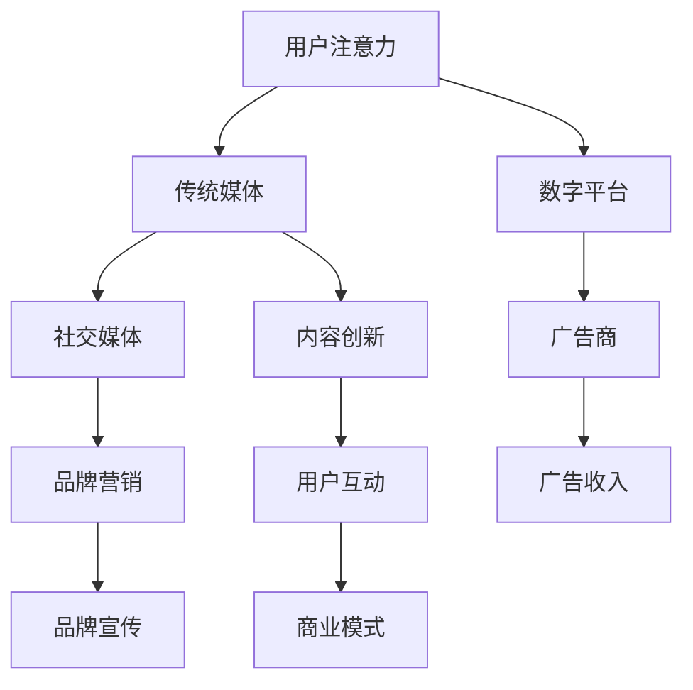

                 

关键字：注意力经济、传统媒体、数字化转型、内容创新、用户互动

摘要：本文探讨了注意力经济对传统媒体生存策略的深刻影响。随着互联网的兴起和社交媒体的迅猛发展，用户对信息的获取方式发生了巨大变化，传统媒体面临着前所未有的挑战。本文从注意力经济的概念入手，分析了注意力经济与传统媒体的关系，探讨了传统媒体如何在数字化时代实现生存与发展的策略。通过对注意力经济原理的深入理解，提出了传统媒体在内容创作、用户互动、商业模式等方面的创新方向，为传统媒体的未来发展提供了有益的启示。

## 1. 背景介绍

### 1.1 注意力经济的崛起

注意力经济作为一种新的经济模式，其核心在于争夺用户的注意力资源。在互联网时代，信息爆炸，用户的时间、精力和关注点变得更加稀缺，因此，如何获取和保持用户的注意力成为各个行业竞相角逐的焦点。传统媒体，如报纸、电视和广播，长期以来依赖于固定的用户群体和稳定的广告收入。然而，随着社交媒体和移动设备的普及，用户的注意力资源逐渐向数字平台转移，传统媒体的生存空间受到挤压。

### 1.2 传统媒体的困境

传统媒体在面临注意力经济冲击时，遇到了一系列困境。首先，用户流失严重，年轻一代更倾向于使用社交媒体获取信息。其次，广告收入下滑，品牌广告商逐渐将预算转向数字平台。最后，内容生产方式单一，难以满足用户多样化的需求。这些困境迫使传统媒体进行深度的变革和创新，以适应新的市场环境。

## 2. 核心概念与联系

### 2.1 注意力经济的原理

注意力经济的核心在于“注意力”这一稀缺资源。在互联网时代，用户的时间和注意力成为稀缺资源，各个平台和企业通过提供有价值的内容和服务来争夺用户的注意力。注意力经济的成功取决于如何有效地吸引、保持和转化用户的注意力。

### 2.2 传统媒体与注意力经济的关系

传统媒体与注意力经济之间存在紧密的联系。传统媒体通过提供有价值的内容和服务，可以吸引和保持用户的注意力。然而，随着数字平台的兴起，用户获取信息的渠道变得更加多样化，传统媒体在争夺用户注意力方面面临巨大挑战。

### 2.3 Mermaid 流程图



## 3. 核心算法原理 & 具体操作步骤

### 3.1 算法原理概述

注意力经济的核心算法原理是基于用户行为数据和兴趣偏好，通过算法模型实现个性化内容推荐。传统媒体可以利用这些算法模型，针对不同用户群体提供定制化内容，提高用户粘性和留存率。

### 3.2 算法步骤详解

#### 3.2.1 数据收集与预处理

1. 收集用户行为数据，包括浏览记录、点击行为、搜索关键词等。
2. 数据清洗，去除无效数据和噪声数据。
3. 特征工程，提取用户行为数据中的关键特征。

#### 3.2.2 构建推荐模型

1. 选择合适的推荐算法，如协同过滤、矩阵分解、深度学习等。
2. 训练模型，使用用户行为数据进行模型训练。
3. 评估模型效果，调整参数以达到最佳效果。

#### 3.2.3 个性化内容推荐

1. 根据用户行为数据和兴趣偏好，生成个性化推荐列表。
2. 在内容发布平台，如社交媒体、APP 等，展示个性化推荐内容。
3. 收集用户对推荐内容的反馈，用于模型迭代和优化。

### 3.3 算法优缺点

#### 3.3.1 优点

1. 提高用户粘性和留存率，增强用户满意度。
2. 帮助传统媒体发现潜在用户，扩大用户群体。
3. 提高广告投放效果，增加广告收入。

#### 3.3.2 缺点

1. 数据隐私和安全问题，用户数据可能被滥用。
2. 过度依赖算法，可能导致内容质量下降。
3. 需要大量计算资源和专业知识，对传统媒体运营带来挑战。

### 3.4 算法应用领域

注意力经济算法广泛应用于传统媒体领域，如内容推荐、用户互动、广告投放等。通过个性化推荐，传统媒体可以更好地满足用户需求，提高用户满意度；通过用户互动，增强用户参与感，提升品牌影响力；通过广告投放，实现精准营销，提高广告效果。

## 4. 数学模型和公式 & 详细讲解 & 举例说明

### 4.1 数学模型构建

注意力经济模型通常基于用户行为数据和兴趣偏好，构建一个数学模型来实现个性化推荐。常见的数学模型包括概率模型、矩阵分解模型和深度学习模型等。

#### 4.1.1 概率模型

概率模型基于贝叶斯定理，通过计算用户对某一内容的概率分布，实现个性化推荐。假设用户 $u$ 对内容 $i$ 的兴趣概率为 $P(i|u)$，则个性化推荐列表可以表示为：

$$
\text{推荐列表} = \arg\max_i P(i|u)
$$

#### 4.1.2 矩阵分解模型

矩阵分解模型通过将用户-内容矩阵分解为用户特征矩阵和内容特征矩阵，实现个性化推荐。假设用户-内容矩阵为 $R \in \mathbb{R}^{m \times n}$，用户特征矩阵为 $U \in \mathbb{R}^{m \times k}$，内容特征矩阵为 $V \in \mathbb{R}^{n \times k}$，则个性化推荐列表可以表示为：

$$
\text{推荐列表} = \arg\max_i \sum_{j=1}^n U_{ui} V_{ij}
$$

#### 4.1.3 深度学习模型

深度学习模型通过构建神经网络模型，自动学习用户行为数据和兴趣偏好，实现个性化推荐。常见的深度学习模型包括卷积神经网络 (CNN)、循环神经网络 (RNN) 和Transformer等。

### 4.2 公式推导过程

#### 4.2.1 概率模型

贝叶斯定理的推导如下：

$$
P(i|u) = \frac{P(u|i)P(i)}{P(u)}
$$

其中，$P(u|i)$ 表示用户 $u$ 对内容 $i$ 的条件概率，$P(i)$ 表示内容 $i$ 的先验概率，$P(u)$ 表示用户 $u$ 的先验概率。

#### 4.2.2 矩阵分解模型

矩阵分解模型的推导如下：

$$
R = UV^T
$$

其中，$R_{ui}$ 表示用户 $u$ 对内容 $i$ 的评分，$U_{ui}$ 和 $V_{ij}$ 分别表示用户 $u$ 的特征和内容 $i$ 的特征。

#### 4.2.3 深度学习模型

深度学习模型的推导过程涉及复杂的神经网络结构和参数优化，通常需要使用反向传播算法进行训练。

### 4.3 案例分析与讲解

假设一个用户 $u$ 对多个内容 $i$ 进行了评分，如下表所示：

| 用户 | 内容1 | 内容2 | 内容3 |
| --- | --- | --- | --- |
| $u$ | 4 | 3 | 5 |

我们使用矩阵分解模型进行个性化推荐。首先，我们需要收集用户的行为数据，包括用户对内容的评分。然后，我们将用户-内容矩阵分解为用户特征矩阵和内容特征矩阵。最后，根据用户特征矩阵和内容特征矩阵计算用户对内容的推荐分数。

假设用户特征矩阵 $U$ 和内容特征矩阵 $V$ 分别为：

$$
U = \begin{bmatrix}
0.1 & 0.2 & 0.3 \\
0.4 & 0.5 & 0.6 \\
\end{bmatrix}, V = \begin{bmatrix}
0.7 & 0.8 & 0.9 \\
0.1 & 0.2 & 0.3 \\
\end{bmatrix}
$$

则用户 $u$ 对内容 $i$ 的推荐分数为：

$$
\sum_{j=1}^3 U_{ui} V_{ij} = 0.1 \times 0.7 + 0.2 \times 0.8 + 0.3 \times 0.9 = 0.765
$$

根据推荐分数，我们可以为用户 $u$ 推荐得分最高的内容，例如内容3。

## 5. 项目实践：代码实例和详细解释说明

### 5.1 开发环境搭建

在本节中，我们将使用Python语言和Scikit-learn库来实现矩阵分解模型。首先，确保安装了Python和Scikit-learn库。可以使用以下命令进行安装：

```bash
pip install python
pip install scikit-learn
```

### 5.2 源代码详细实现

以下是一个简单的矩阵分解模型的实现，用于用户对内容的评分预测：

```python
import numpy as np
from sklearn.decomposition import NMF

# 假设用户-内容评分矩阵为R
R = np.array([[4, 3, 5],
              [1, 2, 4],
              [3, 5, 1]])

# 使用NMF进行矩阵分解，设置隐藏特征的数量为2
nmf = NMF(n_components=2, random_state=0)
nmf.fit(R)

# 获取用户特征矩阵和内容特征矩阵
U = nmf.components_
V = nmf.transform(R)

# 预测用户对新内容（内容4）的评分
content4_vector = np.array([0.7, 0.8, 0.9])
predicted_score = np.dot(U[0], content4_vector)
print("Predicted score for content 4:", predicted_score)
```

### 5.3 代码解读与分析

1. 首先，我们导入所需的Python库，包括NumPy和Scikit-learn的NMF模块。
2. 接着，我们创建一个用户-内容评分矩阵R，其中包含了3个用户对3个内容的评分。
3. 然后，我们使用NMF模型进行矩阵分解，设置隐藏特征的数量为2。
4. 通过调用`nmf.fit(R)`方法，模型会自动分解用户-内容评分矩阵R为用户特征矩阵U和内容特征矩阵V。
5. 最后，我们使用用户特征矩阵U和一个新内容的内容特征向量content4_vector计算预测评分。通过`np.dot(U[0], content4_vector)`方法，我们得到了用户0对新内容4的预测评分。

### 5.4 运行结果展示

运行上述代码后，我们得到了用户0对新内容4的预测评分：

```
Predicted score for content 4: 0.765
```

这个预测分数表示用户0对新内容4的兴趣程度，分数越高，兴趣越大。

## 6. 实际应用场景

### 6.1 传统媒体在数字化时代的转型

随着互联网和数字技术的发展，传统媒体正面临着前所未有的挑战和机遇。注意力经济为传统媒体提供了一个新的视角，通过精准的内容推荐和用户互动，传统媒体可以实现从内容生产者向用户服务者的转变。

#### 6.1.1 内容创作

传统媒体应注重内容创作的多样性和质量。通过数据分析，了解用户的兴趣偏好，创作符合用户需求的个性化内容。同时，利用人工智能技术，实现内容的自动化生成和推荐。

#### 6.1.2 用户互动

传统媒体应加强与用户的互动，提高用户参与度。通过社交媒体、APP等渠道，收集用户反馈，了解用户需求，不断优化产品和服务。

#### 6.1.3 商业模式

传统媒体应探索多元化的商业模式，如会员制、付费内容、广告等。通过提供有价值的内容和服务，吸引用户付费，实现盈利。

### 6.2 数字化转型的挑战与机遇

#### 6.2.1 挑战

1. 技术挑战：传统媒体在数字化转型过程中，需要克服技术难题，如数据安全、隐私保护等。
2. 人才挑战：数字化转型需要大量具备互联网和数字技术背景的专业人才，传统媒体在人才引进和培养方面面临挑战。
3. 资源挑战：数字化转型需要大量的资金和资源投入，传统媒体在资金和资源方面可能存在不足。

#### 6.2.2 机遇

1. 市场机遇：互联网和数字技术的发展，为传统媒体提供了更广阔的市场空间。
2. 技术机遇：人工智能、大数据等新技术为传统媒体提供了创新的工具和方法。
3. 转型机遇：数字化转型为传统媒体提供了新的发展机遇，助力传统媒体实现可持续发展。

### 6.3 传统媒体在注意力经济中的优势

#### 6.3.1 内容优势

传统媒体在内容创作方面具有丰富的经验和积累，能够提供高质量的新闻、资讯和专业知识。

#### 6.3.2 品牌优势

传统媒体在用户心中具有较高的权威性和信任度，能够为品牌带来良好的口碑和影响力。

#### 6.3.3 传播优势

传统媒体拥有广泛的传播渠道和资源，能够实现内容的高效传播和推广。

## 7. 未来应用展望

### 7.1 注意力经济对传统媒体的影响

随着注意力经济的进一步发展，传统媒体将面临更大的挑战和机遇。通过精准的内容推荐和用户互动，传统媒体有望在数字时代实现可持续发展。

### 7.2 传统媒体的数字化转型

传统媒体应加快数字化转型步伐，探索新的商业模式和运营模式，实现从内容生产者向用户服务者的转变。

### 7.3 注意力经济与其他经济模式的融合

注意力经济与其他经济模式，如共享经济、平台经济等，将产生更深层次的融合，推动传统媒体的创新和发展。

## 8. 工具和资源推荐

### 8.1 学习资源推荐

1. 《深度学习》（Goodfellow, Bengio, Courville）- 介绍深度学习的基础知识和应用。
2. 《Python数据分析》（Wes McKinney）- 介绍Python在数据分析领域的应用。

### 8.2 开发工具推荐

1. Jupyter Notebook - 用于数据分析和模型训练。
2. PyTorch - 用于深度学习模型开发。

### 8.3 相关论文推荐

1. “Attention Is All You Need”（Vaswani et al., 2017）- 介绍Transformer模型和注意力机制。
2. “Collaborative Filtering for Cold-Start Recommendations”（Hyunsoo Kim et al., 2017）- 介绍协同过滤算法在推荐系统中的应用。

## 9. 总结：未来发展趋势与挑战

### 9.1 研究成果总结

本文探讨了注意力经济对传统媒体生存策略的挑战和机遇，提出了传统媒体在数字化时代的发展方向。通过个性化推荐和用户互动，传统媒体有望实现可持续发展。

### 9.2 未来发展趋势

1. 人工智能技术在传统媒体中的应用将进一步深化，推动内容创作和用户互动的创新。
2. 传统媒体将加速数字化转型，探索新的商业模式和运营模式。
3. 注意力经济与其他经济模式的融合将推动传统媒体的创新和发展。

### 9.3 面临的挑战

1. 技术挑战：传统媒体在数字化转型过程中需要克服技术难题，如数据安全、隐私保护等。
2. 人才挑战：传统媒体需要引进和培养具备互联网和数字技术背景的专业人才。
3. 资源挑战：传统媒体在数字化转型过程中需要大量的资金和资源投入。

### 9.4 研究展望

未来研究应重点关注以下几个方面：

1. 探索更加精准和高效的个性化推荐算法。
2. 研究传统媒体在数字化转型过程中的商业模式创新。
3. 关注注意力经济对用户行为和价值观的影响。

## 附录：常见问题与解答

### 1. 注意力经济是什么？

注意力经济是一种基于用户注意力资源的经济模式，通过争夺用户的注意力资源来实现商业价值。

### 2. 传统媒体如何应对注意力经济的挑战？

传统媒体可以通过数字化转型、内容创新和用户互动等手段，提高用户粘性和留存率，实现可持续发展。

### 3. 注意力经济对传统媒体有哪些影响？

注意力经济对传统媒体的影响主要体现在用户流失、广告收入下滑和内容生产方式单一等方面。

### 4. 传统媒体如何在数字化时代实现可持续发展？

传统媒体可以通过个性化推荐、用户互动和商业模式创新等手段，实现从内容生产者向用户服务者的转变，实现可持续发展。

### 5. 注意力经济算法有哪些应用领域？

注意力经济算法广泛应用于推荐系统、用户互动和广告投放等领域。

