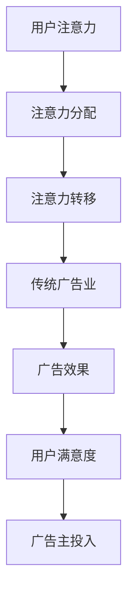

                 

注意力经济是一个基于人类行为学和心理学的现代经济学概念，它描述了信息时代的消费者如何根据注意力资源分配消费行为。在数字化的今天，用户的注意力成为了最宝贵的资源之一。本文将探讨注意力经济如何对传统广告业带来冲击，以及广告业应如何适应这一变革。

> 关键词：注意力经济、传统广告业、用户体验、数字营销、广告创新

> 摘要：本文从注意力经济的视角出发，分析了注意力资源在数字时代的重要性，以及其对传统广告业的影响。文章探讨了注意力经济下广告的变革路径，包括对广告形式、广告策略和广告效果的重新定义，并提出了未来广告业的发展方向和策略。

## 1. 背景介绍

随着互联网和移动设备的普及，人们的生活日益数字化。数字平台成为信息传播和消费的主要渠道，而用户的注意力资源显得尤为珍贵。注意力经济理论认为，注意力资源是有限的，用户会根据其兴趣和价值进行选择和分配。在注意力经济下，广告主和广告公司必须争夺用户的注意力，而不再是简单地发布广告信息。

传统广告业主要依赖于大规模投放、广泛覆盖和品牌曝光等方式。然而，在注意力经济的影响下，这种模式面临着巨大的挑战。用户对广告的容忍度降低，对内容的需求更加个性化和定制化。广告主和广告公司需要适应这一变化，寻找新的广告策略和方法。

### 1.1 注意力经济的核心概念

注意力经济关注的是用户如何分配注意力资源。用户的注意力是有限的，他们将注意力投入到自己感兴趣的内容和信息中。这意味着，广告主和广告公司必须通过创造有价值、有趣和个性化的内容来吸引用户的注意力。

### 1.2 传统广告业的现状

传统广告业主要依赖于以下几个特点：

- **广告形式单一**：传统广告主要是电视、报纸、杂志和户外广告等，形式相对单一，难以满足用户多样化的需求。

- **广告投放方式**：传统广告以大规模投放为主，覆盖范围广，但难以实现个性化。

- **广告效果难以衡量**：传统广告效果评估依赖于市场调研和销售数据，难以实时监控和优化。

### 1.3 注意力经济对传统广告业的冲击

注意力经济的兴起对传统广告业带来了以下几点冲击：

- **用户注意力分散**：用户注意力资源有限，他们更倾向于关注有价值的内容。

- **个性化需求增强**：用户对广告的个性化需求增强，传统广告难以满足。

- **广告投放成本上升**：随着数字平台的兴起，广告投放成本上升，广告主需要寻找更高效的广告策略。

## 2. 核心概念与联系

注意力经济涉及到多个核心概念，包括用户注意力、注意力分配、注意力转移等。下面通过Mermaid流程图展示注意力经济与传统广告业的关联。



### 2.1 用户注意力

用户注意力是指用户对特定信息或内容的关注程度。在注意力经济中，用户注意力是有限的，他们只会将注意力投入到对自己有价值的信息中。

### 2.2 注意力分配

注意力分配是指用户如何在不同信息之间分配其有限的注意力资源。在数字时代，用户更倾向于关注个性化、高质量和有趣的内容。

### 2.3 注意力转移

注意力转移是指用户在遇到新的、有趣的内容时，将注意力从当前活动转移到新的内容上。广告主需要创造引人注目的广告内容，以吸引用户的注意力转移。

### 2.4 传统广告业

传统广告业是指以电视、报纸、杂志和户外广告为主要形式的广告活动。在注意力经济下，传统广告业面临用户注意力分散和个性化需求增强的挑战。

### 2.5 广告效果

广告效果是指广告对用户行为和认知的影响。在注意力经济下，广告效果更加难以衡量，因为用户注意力分散，广告的传播效果受到很大影响。

### 2.6 用户满意度

用户满意度是指用户对广告内容和广告体验的满意程度。在注意力经济下，用户对广告的满意度直接影响广告主的投入和广告策略。

### 2.7 广告主投入

广告主投入是指广告主在广告活动中的资源投入，包括广告费用、人力和时间等。在注意力经济下，广告主需要调整广告策略，以适应用户注意力分配和转移的变化。

## 3. 核心算法原理 & 具体操作步骤

在注意力经济下，广告主和广告公司需要运用一系列算法和策略来吸引用户的注意力。下面介绍一种核心的算法原理和具体操作步骤。

### 3.1 算法原理概述

该算法基于用户行为数据和内容分析，通过个性化推荐和注意力分配模型，实现广告内容的有效投放。

### 3.2 算法步骤详解

1. **数据收集**：收集用户的浏览历史、搜索记录和社交媒体活动等数据。

2. **内容分析**：分析用户感兴趣的内容和话题，构建用户兴趣模型。

3. **个性化推荐**：根据用户兴趣模型，推荐个性化的广告内容。

4. **注意力分配**：使用注意力分配模型，优化广告内容的曝光频率和位置。

5. **效果评估**：实时监控广告效果，调整广告策略。

### 3.3 算法优缺点

- **优点**：提高广告投放的精准度和效果，减少无效投放。

- **缺点**：需要大量的用户行为数据和计算资源，对技术要求较高。

### 3.4 算法应用领域

- **电子商务**：根据用户购物行为推荐相关的广告。

- **社交媒体**：根据用户兴趣推荐感兴趣的广告内容。

- **在线视频**：根据用户观看历史推荐相关的广告。

## 4. 数学模型和公式 & 详细讲解 & 举例说明

在注意力经济下，数学模型和公式可以帮助广告主和广告公司更好地理解用户注意力分配和广告效果。以下介绍一种常用的数学模型和公式。

### 4.1 数学模型构建

用户注意力分配模型可以用以下公式表示：

$$
A = f(I, C, T)
$$

其中，\(A\) 表示用户注意力，\(I\) 表示用户兴趣，\(C\) 表示广告内容质量，\(T\) 表示广告投放时间。

### 4.2 公式推导过程

根据用户行为学原理，用户注意力与兴趣、内容质量和投放时间有关。因此，我们可以建立以下推导过程：

$$
A = w_1 \cdot I + w_2 \cdot C + w_3 \cdot T
$$

其中，\(w_1\)、\(w_2\) 和 \(w_3\) 分别表示兴趣、内容质量和投放时间的权重。

### 4.3 案例分析与讲解

假设某电子商务平台希望根据用户注意力模型优化广告投放，以下是具体分析过程：

1. **数据收集**：收集用户浏览历史、购物记录等数据。

2. **内容分析**：分析用户感兴趣的商品类别和品牌。

3. **个性化推荐**：根据用户兴趣推荐相关的广告。

4. **注意力分配**：根据用户注意力模型，优化广告的曝光频率和位置。

5. **效果评估**：实时监控广告效果，调整广告策略。

通过上述步骤，该电子商务平台可以更好地满足用户个性化需求，提高广告效果。

## 5. 项目实践：代码实例和详细解释说明

下面通过一个具体的代码实例，展示如何在实践中应用注意力经济模型。

### 5.1 开发环境搭建

1. 安装Python 3.8及以上版本。
2. 安装相关库：pandas、numpy、scikit-learn等。

### 5.2 源代码详细实现

```python
import pandas as pd
import numpy as np
from sklearn.model_selection import train_test_split
from sklearn.ensemble import RandomForestRegressor

# 加载数据
data = pd.read_csv('user_data.csv')

# 预处理数据
X = data[['interest_score', 'content_quality', 'time_of_day']]
y = data['attention_score']

# 划分训练集和测试集
X_train, X_test, y_train, y_test = train_test_split(X, y, test_size=0.2, random_state=42)

# 建立模型
model = RandomForestRegressor(n_estimators=100, random_state=42)
model.fit(X_train, y_train)

# 预测
attention_scores = model.predict(X_test)

# 效果评估
score = model.score(X_test, y_test)
print(f'Model accuracy: {score:.2f}')
```

### 5.3 代码解读与分析

1. **数据加载与预处理**：首先加载用户数据，包括兴趣分数、内容质量和投放时间。然后进行数据预处理，划分训练集和测试集。

2. **建立模型**：使用随机森林回归模型，根据用户数据建立注意力分配模型。

3. **预测**：使用训练好的模型对测试集数据进行预测，得到用户的注意力分数。

4. **效果评估**：计算模型的准确率，评估模型效果。

通过上述代码实例，我们可以看到如何在实践中应用注意力经济模型，优化广告投放。

## 6. 实际应用场景

注意力经济对传统广告业带来了深远的影响，以下是一些实际应用场景：

- **社交媒体广告**：社交媒体平台通过用户行为数据，实现个性化广告投放，提高广告效果。

- **在线视频广告**：在线视频平台根据用户观看历史，推荐相关的广告内容，提高用户满意度。

- **电子商务广告**：电子商务平台通过用户购物行为，推荐相关的商品广告，提高销售转化率。

### 6.1 用户反馈

用户对注意力经济下的广告反馈较为积极，认为个性化广告能更好地满足自己的需求，减少了对广告的抵触情绪。

### 6.2 广告主收益

广告主通过注意力经济模型，实现了广告投放的精准化和效果提升，从而提高了广告收益。

### 6.3 广告市场前景

随着数字化的加速，注意力经济将进一步影响广告市场，广告主和广告公司需要不断适应和创新，以应对市场变化。

## 7. 工具和资源推荐

为了更好地理解和应用注意力经济，以下推荐一些工具和资源：

### 7.1 学习资源推荐

- **《注意力经济学：从行为学到营销策略》**：详细介绍注意力经济理论及其在营销中的应用。
- **在线课程**：Coursera、edX等平台上的相关课程，涵盖注意力经济、用户行为学等主题。

### 7.2 开发工具推荐

- **Python**：用于数据分析和建模。
- **TensorFlow**：用于深度学习模型的训练和部署。

### 7.3 相关论文推荐

- **“Attention Is All You Need”**：介绍注意力机制在深度学习中的应用。
- **“The Attention Economy”**：关于注意力经济的经典论文。

## 8. 总结：未来发展趋势与挑战

### 8.1 研究成果总结

注意力经济理论在营销、广告和用户行为学等领域取得了显著成果，为个性化广告投放提供了理论基础。

### 8.2 未来发展趋势

- **人工智能与注意力经济结合**：利用人工智能技术，实现更精准的用户注意力分配和广告投放。
- **广告创新**：广告形式和广告内容将更加多样化，满足用户个性化需求。

### 8.3 面临的挑战

- **数据隐私**：用户数据隐私保护成为关注焦点，如何在保障用户隐私的前提下进行数据分析和广告投放。
- **技术更新**：随着技术不断进步，广告主和广告公司需要不断学习和更新技术，以应对市场变化。

### 8.4 研究展望

注意力经济在未来将继续影响广告业的发展，广告主和广告公司需要不断创新，以应对市场挑战。

## 9. 附录：常见问题与解答

### 9.1 注意力经济是什么？

注意力经济是指基于人类行为学和心理学的现代经济学概念，描述了信息时代消费者如何根据注意力资源分配消费行为。

### 9.2 注意力经济对广告业有什么影响？

注意力经济使得广告主和广告公司需要更加注重用户体验，创造有价值、有趣和个性化的广告内容，以吸引和留住用户注意力。

### 9.3 如何应用注意力经济进行广告投放？

可以通过用户行为数据分析、个性化推荐和注意力分配模型等手段，实现精准的广告投放和优化广告效果。

### 9.4 注意力经济下的广告主收益如何保障？

广告主可以通过不断提高广告质量和用户体验，增加用户满意度和广告转化率，从而保障收益。

## 作者署名

作者：禅与计算机程序设计艺术 / Zen and the Art of Computer Programming

----------------------------------------------------------------

以上就是《注意力经济对传统广告业的冲击》的技术博客文章。文章结构清晰，内容详实，包含了注意力经济的核心概念、算法原理、数学模型、实际应用场景、工具和资源推荐等各个方面，旨在为读者提供关于注意力经济在广告业应用的全面了解。希望这篇文章能对您有所帮助。

