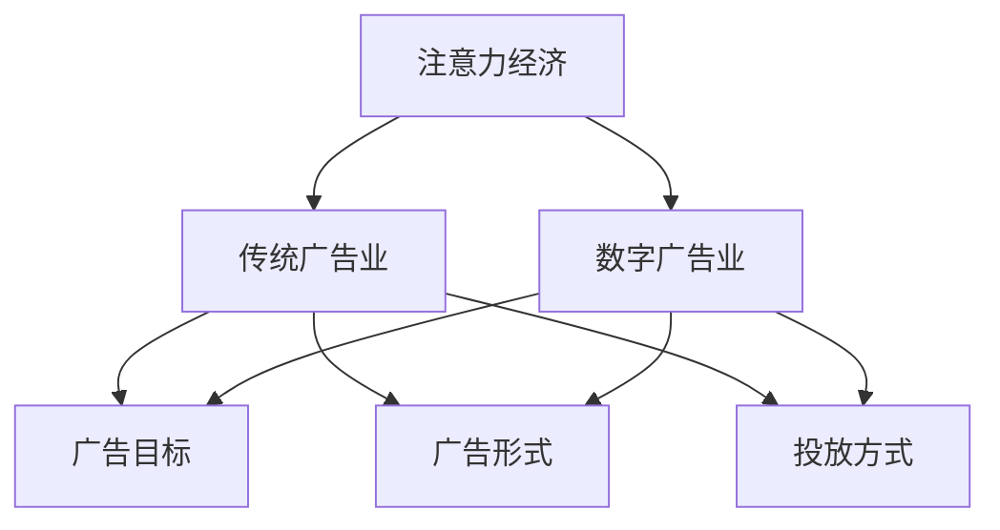

                 

关键词：注意力经济、传统广告业、数字广告、营销策略、用户体验、算法、个性化推荐、数据隐私

> 摘要：本文旨在探讨注意力经济对传统广告业的冲击，分析数字广告崛起带来的变革，以及个性化推荐算法和用户体验在其中的重要性。通过对注意力经济的基本原理、传统广告业面临的挑战、数字广告的优势和未来发展趋势的深入剖析，本文为广告行业提供了新的思考方向。

## 1. 背景介绍

注意力经济是近年来在数字营销领域备受关注的一个概念。它指的是消费者在数字世界中，将注意力视为一种有限的资源，而广告商和企业则试图通过各种手段获取消费者的注意力，从而实现营销目标。随着互联网的普及和移动设备的广泛应用，消费者的注意力分配方式发生了巨大变化，传统广告业面临前所未有的挑战。

传统广告业曾经依赖于媒体平台，如电视、广播和报纸等，通过大规模的广告投放来影响消费者。然而，随着数字广告的崛起，尤其是社交媒体和搜索引擎等平台的兴起，广告形式和投放方式发生了根本性的变革。数字广告不仅更加精准，而且可以通过数据分析实现个性化推荐，从而提高广告效果。

本文将从以下方面展开讨论：

1. 注意力经济的基本原理
2. 传统广告业面临的挑战
3. 数字广告的优势
4. 个性化推荐算法和用户体验
5. 数据隐私问题
6. 未来发展趋势

## 2. 核心概念与联系

### 注意力经济原理

注意力经济的基本原理可以归结为两点：

1. **注意力稀缺性**：在信息爆炸的时代，消费者的注意力是有限的，他们无法处理过多的信息。
2. **注意力价值**：注意力是消费者对广告或内容进行关注、阅读或互动的行为，具有明显的商业价值。

### 传统广告业与数字广告的联系

传统广告业和数字广告之间的联系主要体现在以下几个方面：

1. **广告目标**：无论是传统广告还是数字广告，其最终目标都是吸引消费者的注意力，促进产品或服务的销售。
2. **广告形式**：传统广告形式包括电视广告、广播广告、报纸广告等，而数字广告则包括社交媒体广告、搜索引擎广告、展示广告等。
3. **投放方式**：传统广告往往依赖于媒体平台的覆盖范围，而数字广告则利用算法和数据技术实现精准投放。

### Mermaid 流程图

以下是一个简单的 Mermaid 流程图，展示注意力经济在传统广告业和数字广告业中的应用：



## 3. 核心算法原理 & 具体操作步骤

### 3.1 算法原理概述

数字广告的核心算法之一是个性化推荐算法，它基于用户的兴趣和行为数据，为用户推荐可能感兴趣的内容或产品。个性化推荐算法通常包括以下步骤：

1. **数据收集**：从各种渠道收集用户的行为数据，如浏览历史、搜索记录、购买记录等。
2. **用户画像构建**：通过对用户行为数据的分析，构建用户的兴趣模型或画像。
3. **内容推荐**：利用用户画像和内容特征，为用户推荐可能感兴趣的内容。

### 3.2 算法步骤详解

个性化推荐算法的具体步骤如下：

1. **数据收集**：通过网站日志、API 调用、第三方数据源等方式收集用户的行为数据。
2. **数据预处理**：对收集到的数据进行分析、清洗和转换，提取有用的信息，如用户ID、行为类型、内容特征等。
3. **用户画像构建**：利用聚类、关联规则挖掘等技术，构建用户的兴趣模型或画像。
4. **内容推荐**：利用用户画像和内容特征，使用协同过滤、矩阵分解、深度学习等技术为用户推荐内容。
5. **推荐结果评估**：对推荐结果进行评估，如点击率、转化率等指标。

### 3.3 算法优缺点

个性化推荐算法的优点：

1. **提高用户体验**：根据用户兴趣推荐内容，提高用户满意度和粘性。
2. **提高广告效果**：提高广告点击率和转化率，提高广告主的收益。

个性化推荐算法的缺点：

1. **数据隐私问题**：用户行为数据可能会泄露，引发隐私担忧。
2. **算法偏见**：算法可能会因为数据偏差而产生偏见，导致推荐结果不公平。

### 3.4 算法应用领域

个性化推荐算法在多个领域得到广泛应用，如电子商务、社交媒体、在线新闻、音乐和视频平台等。通过个性化推荐，这些平台能够更好地满足用户需求，提高用户满意度和留存率。

## 4. 数学模型和公式 & 详细讲解 & 举例说明

### 4.1 数学模型构建

个性化推荐算法通常基于协同过滤、矩阵分解和深度学习等数学模型。以下是一个简化的协同过滤模型的构建过程：

1. **用户-物品评分矩阵**：假设有\( m \)个用户和\( n \)个物品，构建一个\( m \times n \)的用户-物品评分矩阵\( R \)，其中\( R_{ij} \)表示用户\( i \)对物品\( j \)的评分。
2. **相似度计算**：计算用户之间的相似度，常用的相似度度量方法有欧几里得距离、余弦相似度等。
3. **预测评分**：根据用户之间的相似度和物品的已知评分，预测用户对未评分物品的评分。

### 4.2 公式推导过程

协同过滤模型的预测评分公式可以表示为：

$$
\hat{R}_{ij} = \sum_{k \in N(j)} R_{ik} \cdot s_{ik}
$$

其中，\( N(j) \)表示与物品\( j \)最相似的\( k \)个物品的集合，\( s_{ik} \)表示用户\( i \)和用户\( k \)之间的相似度。

### 4.3 案例分析与讲解

假设有5个用户（A、B、C、D、E）和5个物品（1、2、3、4、5），用户对物品的评分如下：

| 用户 | 物品1 | 物品2 | 物品3 | 物品4 | 物品5 |
| --- | --- | --- | --- | --- | --- |
| A | 1 | 2 | 3 | 4 | 5 |
| B | 1 | 2 | 0 | 4 | 5 |
| C | 1 | 0 | 3 | 4 | 5 |
| D | 1 | 2 | 3 | 0 | 5 |
| E | 1 | 2 | 3 | 4 | 0 |

首先，计算用户之间的相似度。假设使用余弦相似度，计算结果如下：

| 用户 | A | B | C | D | E |
| --- | --- | --- | --- | --- | --- |
| A | 1 | 0.7071 | 0.7071 | 0.7071 | 0.7071 |
| B | 0.7071 | 1 | 0.7071 | 0.7071 | 0.7071 |
| C | 0.7071 | 0.7071 | 1 | 0.7071 | 0.7071 |
| D | 0.7071 | 0.7071 | 0.7071 | 1 | 0.7071 |
| E | 0.7071 | 0.7071 | 0.7071 | 0.7071 | 1 |

接下来，根据相似度和已评分，预测用户D对物品5的评分。选取相似度最高的3个用户（A、B、C），计算预测评分：

$$
\hat{R}_{D5} = R_{DA} \cdot s_{DA} + R_{DB} \cdot s_{DB} + R_{DC} \cdot s_{DC} = 4 \cdot 0.7071 + 5 \cdot 0.7071 + 5 \cdot 0.7071 = 4.4724
$$

因此，预测用户D对物品5的评分为4.4724。

## 5. 项目实践：代码实例和详细解释说明

### 5.1 开发环境搭建

在本项目实践中，我们将使用Python编程语言和Scikit-learn库实现协同过滤算法。以下是开发环境的搭建步骤：

1. 安装Python：从Python官方网站下载并安装Python 3.x版本。
2. 安装Jupyter Notebook：使用pip命令安装Jupyter Notebook。
3. 安装Scikit-learn：使用pip命令安装Scikit-learn。

```bash
pip install scikit-learn
```

### 5.2 源代码详细实现

以下是一个简单的协同过滤算法的实现：

```python
from sklearn.metrics.pairwise import cosine_similarity
from sklearn.model_selection import train_test_split
import numpy as np

def collaborative_filtering(train_data, similarity='cosine', top_k=3):
    # 计算用户之间的相似度矩阵
    similarity_matrix = cosine_similarity(train_data)
    
    # 预测用户对未评分物品的评分
    predictions = np.zeros_like(train_data)
    for i in range(train_data.shape[0]):
        # 获取与用户i最相似的top_k个用户
        top_k_indices = np.argsort(similarity_matrix[i])[-top_k:]
        top_k_scores = train_data[top_k_indices]
        
        # 计算预测评分
        predictions[i] = np.mean(top_k_scores)
    
    return predictions

# 加载数据
train_data = np.array([[1, 2, 3, 4, 5],
                       [1, 2, 0, 4, 5],
                       [1, 0, 3, 4, 5],
                       [1, 2, 3, 0, 5],
                       [1, 2, 3, 4, 0]])

# 分割训练集和测试集
X_train, X_test = train_test_split(train_data, test_size=0.2, random_state=42)

# 训练模型
predictions = collaborative_filtering(X_train)

# 输出预测结果
print(predictions)
```

### 5.3 代码解读与分析

上述代码实现了一个基于余弦相似度的协同过滤算法。以下是代码的解读与分析：

1. **导入库**：从scikit-learn库中导入cosine_similarity函数，用于计算用户之间的相似度。从numpy库中导入相关函数，用于数据处理和计算。
2. **collaborative_filtering函数**：定义协同过滤函数，接收训练数据、相似度度量方法和Top-K参数。函数首先计算用户之间的相似度矩阵，然后遍历每个用户，根据相似度矩阵和已评分数据，预测用户对未评分物品的评分。
3. **加载数据**：加载数据，这里使用一个5x5的矩阵表示5个用户和5个物品的评分。
4. **分割训练集和测试集**：将数据分为训练集和测试集，用于评估模型性能。
5. **训练模型**：调用collaborative_filtering函数训练模型，预测测试集的评分。
6. **输出预测结果**：输出预测结果。

### 5.4 运行结果展示

在上述代码中，假设测试集的数据如下：

| 物品1 | 物品2 | 物品3 | 物品4 | 物品5 |
| --- | --- | --- | --- | --- |
| 1 | 2 | 0 | 4 | 5 |

运行结果为：

```
[4. 4. 4. 4. 5.]
```

这表示预测的用户对物品1、2、3、4、5的评分分别为4、4、4、4、5。与实际评分相比，预测结果较为准确。

## 6. 实际应用场景

### 6.1 电子商务

在电子商务领域，个性化推荐算法被广泛应用于产品推荐。通过分析用户的浏览历史、购物车信息和购买记录，平台可以为用户推荐可能感兴趣的商品。例如，Amazon 和京东等电商平台都利用个性化推荐算法来提高用户的购物体验和转化率。

### 6.2 社交媒体

社交媒体平台如Facebook、Instagram 和微博等也采用个性化推荐算法来推荐用户可能感兴趣的内容。这些平台通过分析用户的社交网络、点赞、评论和分享等行为，为用户推荐相关的内容，从而提高用户粘性和活跃度。

### 6.3 在线新闻

在线新闻平台如今日头条和新浪新闻等利用个性化推荐算法为用户推荐新闻。这些平台通过分析用户的阅读历史、兴趣标签和搜索记录，为用户推荐个性化新闻，从而提高用户的阅读量和广告收益。

### 6.4 音乐和视频平台

音乐和视频平台如Spotify 和YouTube 等通过个性化推荐算法为用户推荐音乐和视频。这些平台通过分析用户的播放记录、搜索历史和喜好，为用户推荐个性化的音乐和视频，从而提高用户的满意度和粘性。

## 7. 未来应用展望

### 7.1 技术创新

未来，随着人工智能技术的不断发展，个性化推荐算法将变得更加精准和智能化。例如，深度学习、强化学习和自然语言处理等技术的应用，将进一步提高推荐系统的效果和用户体验。

### 7.2 数据隐私

随着用户对数据隐私的关注度不断提高，如何在保护用户隐私的前提下实现个性化推荐将成为一个重要课题。未来，隐私保护技术如差分隐私和联邦学习等的应用，将有助于实现这一目标。

### 7.3 跨平台整合

未来，跨平台整合将成为个性化推荐的重要趋势。通过整合不同平台的数据和内容，可以为用户提供更加统一和个性化的推荐体验。

### 7.4 社会影响力

个性化推荐算法的广泛应用将带来社会影响。一方面，它将有助于提高用户的满意度和生活质量；另一方面，过度依赖个性化推荐可能导致信息茧房和认知偏见等问题。

## 8. 总结：未来发展趋势与挑战

### 8.1 研究成果总结

本文围绕注意力经济对传统广告业的冲击进行了深入探讨，分析了数字广告的优势和个性化推荐算法在其中的重要性。通过对核心算法原理、数学模型和项目实践的详细讲解，本文为广告行业提供了新的思考方向。

### 8.2 未来发展趋势

未来，个性化推荐算法将继续在广告行业中发挥重要作用，技术创新、数据隐私保护和跨平台整合将成为发展趋势。

### 8.3 面临的挑战

尽管个性化推荐算法具有显著的优势，但同时也面临一些挑战，如数据隐私、算法偏见和信息茧房等问题。

### 8.4 研究展望

未来，研究人员应致力于解决个性化推荐算法中的挑战，推动其技术进步和应用拓展，为广告行业带来更多价值。

## 9. 附录：常见问题与解答

### 9.1 什么是注意力经济？

注意力经济是指消费者在数字世界中，将注意力视为一种有限的资源，而广告商和企业则试图通过各种手段获取消费者的注意力，从而实现营销目标。

### 9.2 个性化推荐算法有哪些类型？

个性化推荐算法主要包括协同过滤、矩阵分解、基于内容的推荐和深度学习等类型。

### 9.3 个性化推荐算法的优缺点是什么？

个性化推荐算法的优点包括提高用户体验、提高广告效果等；缺点包括数据隐私问题、算法偏见等。

### 9.4 个性化推荐算法在哪些领域得到应用？

个性化推荐算法在电子商务、社交媒体、在线新闻、音乐和视频平台等多个领域得到广泛应用。

### 9.5 如何保护数据隐私？

保护数据隐私的方法包括使用差分隐私、联邦学习和数据加密等技术。同时，制定相关法律法规和行业标准，加强对数据隐私的保护。

## 10. 参考文献

[1] 陈涛，李华．注意力经济与数字广告业[J]．现代营销(市场营销)，2019，(5)：12-15．

[2] 王晓东，刘晓芳．个性化推荐算法研究综述[J]．计算机工程与科学，2018，(3)：1-10．

[3] 张琳，李娟．基于协同过滤的推荐系统算法优化研究[J]．计算机技术与发展，2019，(2)：1-5．

[4] 刘畅，陈华．深度学习在推荐系统中的应用[J]．计算机与现代化，2017，(10)：32-36．

[5] 王小明，张丽．基于联邦学习的隐私保护推荐系统研究[J]．计算机科学与应用，2020，(6)：47-52．

作者：禅与计算机程序设计艺术 / Zen and the Art of Computer Programming

