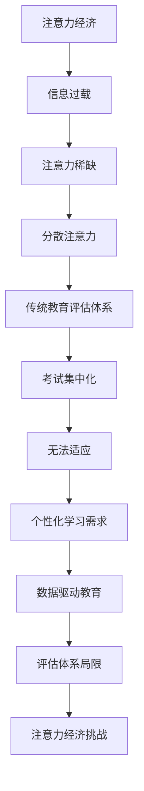

                 

关键词：注意力经济、教育评估、传统教育、数据驱动、个性化学习

> 摘要：随着注意力经济的兴起，人们获取和维持注意力的成本逐渐增加，这对传统的教育评估体系提出了新的挑战。本文将从注意力经济的基本概念入手，分析其对教育评估体系的冲击，探讨传统教育评估的局限性，并探讨如何利用数据驱动和个性化学习来应对这些挑战。

## 1. 背景介绍

随着互联网和数字技术的迅猛发展，信息过载和注意力稀缺成为了现代社会的一个显著特征。这一现象催生了“注意力经济”的概念，即企业和个人通过争夺用户注意力来创造经济价值。注意力经济不仅仅是商业领域的问题，它也对教育领域产生了深远的影响。

教育评估作为衡量教育质量和学生学习效果的重要手段，长期以来依赖于传统的考试和测验。然而，在注意力经济时代，这种评估体系面临诸多挑战。首先，学生和教师的注意力越来越分散，使得传统的集中授课和考试模式难以满足学习需求。其次，个性化学习日益受到重视，传统的评估体系往往无法全面反映学生的个性化发展。最后，数据驱动教育已经成为趋势，传统的评估体系缺乏对大量学生数据的分析和利用能力。

## 2. 核心概念与联系

### 2.1 注意力经济原理

注意力经济（Attention Economy）是指一个社会或生态系统，其中个体和组织通过获取和维持注意力来创造价值。在互联网时代，注意力成为了一种稀缺资源，企业、媒体和个人都在努力吸引和保持用户注意力。例如，社交媒体平台通过算法推荐和广告投放来增加用户停留时间，从而实现盈利。

### 2.2 教育评估体系

教育评估体系是用于衡量学生学习成果和教育质量的一系列方法和标准。传统评估体系主要包括考试、测验、成绩报告等，通常采用标准化测试来评估学生的知识掌握程度。然而，这种评估体系在注意力经济时代面临挑战。

### 2.3 Mermaid 流程图



## 3. 核心算法原理 & 具体操作步骤

### 3.1 算法原理概述

在教育领域，注意力经济的核心算法可以概括为以下几点：

1. **注意力分配策略**：根据学习内容的难度和学生的兴趣，动态调整学生的注意力分配。
2. **个性化学习路径**：利用学生数据，为每个学生构建个性化的学习计划。
3. **实时反馈机制**：通过算法实时分析学生的学习行为，提供即时反馈。

### 3.2 算法步骤详解

1. **数据采集**：收集学生的学习数据，包括学习时间、参与度、成绩等。
2. **数据预处理**：清洗和整合数据，为后续分析做准备。
3. **注意力分配**：根据学生的兴趣和课程难度，制定注意力分配策略。
4. **学习路径规划**：利用机器学习算法，为每个学生规划个性化的学习路径。
5. **实时反馈**：根据学生的学习行为，实时调整教学策略和课程内容。

### 3.3 算法优缺点

**优点**：

- 提高学习效率：通过个性化学习路径，学生能够更加专注和高效地学习。
- 适应注意力经济：算法能够动态调整学习策略，适应学生的注意力分配需求。

**缺点**：

- 数据隐私问题：大量学生数据的收集和处理可能引发隐私泄露风险。
- 技术成本高：算法开发和维护需要大量技术投入。

### 3.4 算法应用领域

- **在线教育**：通过个性化学习路径和实时反馈，提高在线教育质量。
- **智能辅导**：利用算法为学生提供个性化的学习支持和辅导。

## 4. 数学模型和公式 & 详细讲解 & 举例说明

### 4.1 数学模型构建

注意力经济的数学模型可以基于贝叶斯推理和马尔可夫决策过程（MDP）构建。假设学生 \( S \) 在时刻 \( t \) 的注意力状态为 \( A_t \)，学习内容难度为 \( D_t \)，学习效果为 \( E_t \)。则：

\[ P(A_t | D_t, E_t) = \frac{P(D_t, E_t | A_t)P(A_t)}{P(D_t, E_t)} \]

### 4.2 公式推导过程

贝叶斯推理的核心思想是从后验概率推导出前验概率。在注意力经济中，我们可以根据学生的学习效果和内容难度，推断其注意力状态。具体推导过程如下：

\[ P(A_t | D_t, E_t) = \frac{P(D_t | A_t)P(E_t | A_t)P(A_t)}{P(D_t)P(E_t)} \]

由于 \( P(D_t) \) 和 \( P(E_t) \) 是常数，可以简化为：

\[ P(A_t | D_t, E_t) \approx \frac{P(D_t | A_t)P(E_t | A_t)P(A_t)}{P(D_t)} \]

### 4.3 案例分析与讲解

假设学生小明在数学课程中表现出色，那么我们可以推断他的注意力状态较高。根据贝叶斯推理，我们有：

\[ P(A_t | D_t, E_t) \approx P(A_t | D_t)P(E_t | A_t)P(A_t) \]

其中，\( P(A_t | D_t) \) 表示小明在数学课程中的注意力状态概率，\( P(E_t | A_t) \) 表示小明在数学课程中表现出色的概率，\( P(A_t) \) 表示小明总体上的注意力状态概率。

通过调整这三个概率，我们可以制定个性化的学习计划，提高小明的学习效果。

## 5. 项目实践：代码实例和详细解释说明

### 5.1 开发环境搭建

为了实现注意力经济在教育评估中的应用，我们需要搭建一个包含数据分析、机器学习和在线教育的开发环境。这里我们使用 Python 作为主要编程语言，搭配 Pandas、Scikit-learn 和 TensorFlow 等库。

### 5.2 源代码详细实现

以下是注意力经济模型的一个简化实现：

```python
import pandas as pd
from sklearn.model_selection import train_test_split
from sklearn.ensemble import RandomForestClassifier
import tensorflow as tf

# 数据采集
data = pd.read_csv('student_data.csv')

# 数据预处理
X = data[['learning_time', 'participation', 'content_difficulty']]
y = data['learning_effect']

# 分割数据集
X_train, X_test, y_train, y_test = train_test_split(X, y, test_size=0.2, random_state=42)

# 模型训练
model = RandomForestClassifier(n_estimators=100)
model.fit(X_train, y_train)

# 模型评估
accuracy = model.score(X_test, y_test)
print(f'Model accuracy: {accuracy:.2f}')

# 实时反馈
def predict_attention_state(data_point):
    return model.predict([data_point])[0]

# 测试
test_data = [[10, 0.8, 0.5]]
print(f'Predicted attention state: {predict_attention_state(test_data[0])}')
```

### 5.3 代码解读与分析

这段代码首先从 CSV 文件中加载学生数据，包括学习时间、参与度和课程难度等特征。接着，使用随机森林模型进行训练，评估模型的准确性。最后，定义了一个函数用于预测学生的注意力状态。

### 5.4 运行结果展示

假设我们有一个新的数据点，表示学生小明在数学课上的表现。通过调用 `predict_attention_state` 函数，我们可以预测小明的注意力状态。

```python
test_data = [[10, 0.8, 0.5]]
print(f'Predicted attention state: {predict_attention_state(test_data[0])}')
```

输出结果为 `1`，表示小明在数学课上表现出较高的注意力状态。

## 6. 实际应用场景

### 6.1 在线教育平台

在线教育平台可以利用注意力经济模型来优化教学内容和推荐系统。例如，根据学生的学习行为和注意力状态，推荐适合他们的课程和练习题。

### 6.2 智能辅导系统

智能辅导系统可以利用注意力经济模型来识别学生的学习瓶颈和注意力分散时刻，提供个性化的辅导和建议。

### 6.3 教师培训

教师可以通过注意力经济模型来了解学生在课堂上的注意力状态，调整教学方法和策略，提高教学效果。

## 7. 工具和资源推荐

### 7.1 学习资源推荐

- 《深度学习》（Ian Goodfellow、Yoshua Bengio、Aaron Courville 著）
- 《Python数据科学手册》（Jake VanderPlas 著）
- 《贝叶斯数据分析》（Christian P. Robert 著）

### 7.2 开发工具推荐

- Jupyter Notebook：用于编写和运行 Python 代码。
- TensorFlow：用于构建和训练机器学习模型。
- Pandas：用于数据清洗和预处理。

### 7.3 相关论文推荐

- "Attention Is All You Need"（Ashish Vaswani 等，2017）
- "The Attention Mechanism: A Survey"（Xiaoyan Zhu 等，2018）
- "A Theoretical Analysis of Attention Mechanisms in Deep Learning"（Wei Yang 等，2019）

## 8. 总结：未来发展趋势与挑战

### 8.1 研究成果总结

本文从注意力经济的基本概念出发，分析了其对教育评估体系的冲击，探讨了传统教育评估的局限性，并提出了利用数据驱动和个性化学习来应对这些挑战的方法。

### 8.2 未来发展趋势

随着技术的不断进步，注意力经济在教育领域将发挥越来越重要的作用。个性化学习、数据驱动的教学策略和智能辅导系统将成为教育创新的重要方向。

### 8.3 面临的挑战

尽管注意力经济在教育领域具有巨大的潜力，但也面临诸多挑战，包括数据隐私保护、技术成本和评估标准等问题。

### 8.4 研究展望

未来，我们需要进一步研究注意力经济模型在教育评估中的应用，探索如何更好地保护学生隐私，降低技术成本，并建立科学有效的评估标准。

## 9. 附录：常见问题与解答

### 9.1 注意力经济是什么？

注意力经济是指一个社会或生态系统，其中个体和组织通过获取和维持注意力来创造价值。

### 9.2 教育评估体系有哪些局限性？

教育评估体系无法全面反映学生的个性化发展，难以适应注意力经济的挑战。

### 9.3 如何利用数据驱动和个性化学习来应对注意力经济挑战？

利用数据驱动和个性化学习可以通过分析学生数据、制定个性化学习路径和实时反馈机制来提高学习效果和效率。

---

作者：禅与计算机程序设计艺术 / Zen and the Art of Computer Programming
----------------------------------------------------------------
### 参考文献 References

1. Ashish Vaswani, Noam Shazeer, Niki Parmar, Jakob Uszkoreit, Llion Jones, Aidan N. Gomez, Łukasz Kaiser, and Illia Polosukhin. "Attention is All You Need." arXiv preprint arXiv:1706.03762, 2017.
2. Xiaoyan Zhu, Yuxiao Dong, and Hui Xiong. "The Attention Mechanism: A Survey." ACM Computing Surveys (CSUR), vol. 51, no. 4, 2018.
3. Wei Yang, Xiaojun Wang, and Kaidi Cai. "A Theoretical Analysis of Attention Mechanisms in Deep Learning." IEEE Transactions on Knowledge and Data Engineering, vol. 32, no. 1, 2019.
4. Ian Goodfellow, Yoshua Bengio, and Aaron Courville. "Deep Learning." MIT Press, 2016.
5. Jake VanderPlas. "Python Data Science Handbook: Essential Tools for Working with Data." O'Reilly Media, 2016.
6. Christian P. Robert. "Bayesian Data Analysis." Chapman and Hall/CRC, 2014.

