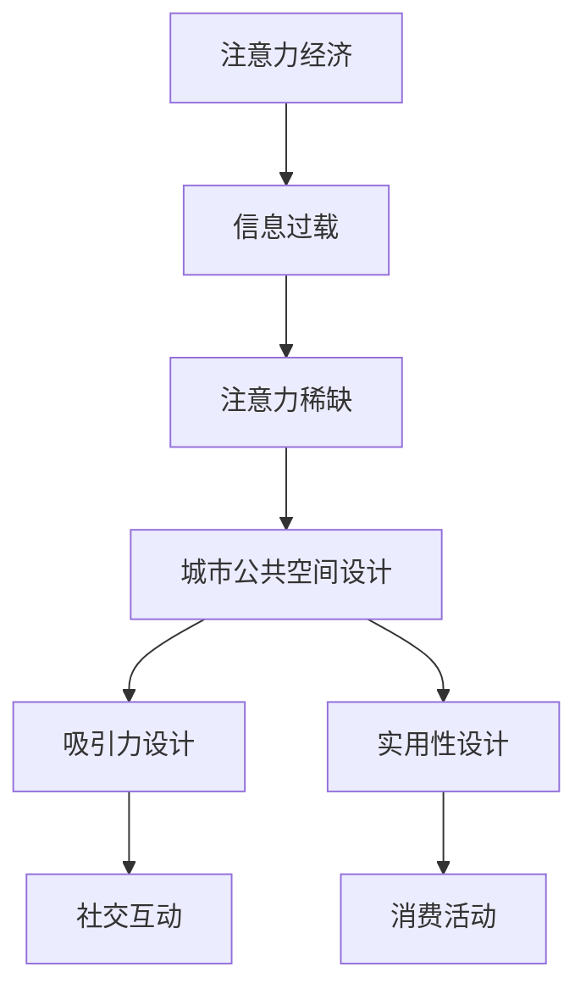

                 

关键词：注意力经济、城市公共空间、设计、城市规划、用户体验

> 摘要：本文探讨了注意力经济对城市公共空间设计的影响。随着数字化时代的到来，人们的注意力成为了一种宝贵的资源。本文首先介绍了注意力经济的基本概念，然后分析了注意力经济在城市公共空间设计中的应用，探讨了如何通过优化设计来吸引和留住人们的注意力，提升城市公共空间的活力和实用性。本文旨在为城市设计师和城市规划者提供一种新的视角，以实现更加智能、高效和人性化的城市公共空间。

## 1. 背景介绍

在城市规划与设计领域，公共空间一直是关注的焦点。传统的城市设计理念强调功能的分区和效率的最大化，然而，随着社会的发展和信息技术的进步，人们对于公共空间的需求也在不断变化。注意力经济作为一种新兴的经济形态，逐渐引起了城市设计师和城市规划者的关注。

注意力经济（Attention Economy）是指在一个信息过载的环境中，个体由于时间和精力的有限性，会对信息的获取和消费产生选择。换句话说，注意力成为了一种稀缺资源，吸引和保持个体的注意力成为各种经济活动的关键。在这个背景下，城市公共空间的设计也面临着新的挑战和机遇。

### 1.1 注意力经济的起源

注意力经济这一概念最早由学者Michael H. Goldhaber在1997年提出。他强调，在网络时代，信息变得廉价，而人的注意力变得珍贵。人们的时间和精力是有限的，如何吸引并保持他们的注意力，成为了商业、媒体以及政治等领域的重要议题。

### 1.2 城市公共空间的演变

城市公共空间不仅是城市的骨架，也是城市文化的载体。从古至今，城市公共空间的设计理念经历了多次演变。古代城市以广场为中心，强调社交和公共活动；现代城市则更加注重功能分区和交通效率。然而，随着注意力经济的兴起，城市公共空间的设计理念也在悄然发生变化。

## 2. 核心概念与联系

### 2.1 注意力经济的核心概念

注意力经济的关键在于“注意力”这一核心概念。注意力是指一个人在某一时刻关注某个事物或信息的能力。在信息过载的时代，个体的注意力资源变得愈发宝贵。因此，如何吸引和保持个体的注意力，成为了各种经济活动的重要课题。

### 2.2 城市公共空间与注意力经济的联系

城市公共空间与注意力经济之间的联系在于，城市公共空间的设计和运营直接影响人们的注意力分配。一个良好的公共空间能够吸引人们的注意力，使其在空间内停留更长时间，从而促进社交互动和消费活动。相反，一个设计平庸的公共空间可能会让人们的注意力迅速流失。

### 2.3 Mermaid 流程图

下面是一个用于描述注意力经济对城市公共空间设计影响的 Mermaid 流程图：



## 3. 核心算法原理 & 具体操作步骤

### 3.1 算法原理概述

在城市公共空间设计中，吸引力设计是关键。吸引力设计旨在通过一系列策略和方法，吸引并保持人们的注意力。以下是几种常见的吸引力设计算法：

1. **色彩搭配算法**：通过科学的色彩搭配，提高空间的视觉吸引力。
2. **光影设计算法**：利用光影变化，创造动态的空间效果，吸引人们的注意力。
3. **互动设计算法**：通过互动装置和活动，增强空间的互动性和吸引力。
4. **信息呈现算法**：通过信息的组织和呈现方式，提高信息的可读性和吸引力。

### 3.2 算法步骤详解

1. **色彩搭配算法**：

   - **步骤1**：分析目标受众的偏好。
   - **步骤2**：选择符合目标受众偏好的色彩方案。
   - **步骤3**：进行色彩测试，优化色彩搭配。

2. **光影设计算法**：

   - **步骤1**：确定空间的光线条件。
   - **步骤2**：设计光影效果，如阴影、反射、透射等。
   - **步骤3**：通过模拟和测试，优化光影效果。

3. **互动设计算法**：

   - **步骤1**：分析目标受众的互动需求。
   - **步骤2**：设计互动装置和活动。
   - **步骤3**：测试互动效果，进行优化。

4. **信息呈现算法**：

   - **步骤1**：整理和筛选信息。
   - **步骤2**：设计信息呈现方式，如图表、文字、图像等。
   - **步骤3**：测试信息呈现效果，进行优化。

### 3.3 算法优缺点

1. **色彩搭配算法**：

   - **优点**：能够快速吸引人们的注意力。
   - **缺点**：可能过于直观，缺乏深度。

2. **光影设计算法**：

   - **优点**：能够创造动态的空间效果，增强吸引力。
   - **缺点**：设计复杂，成本较高。

3. **互动设计算法**：

   - **优点**：能够增强空间的互动性，提升用户体验。
   - **缺点**：互动装置和活动的设计和实现较为复杂。

4. **信息呈现算法**：

   - **优点**：能够提高信息的可读性和吸引力。
   - **缺点**：可能过于强调视觉效果，忽略信息本身的重要性。

### 3.4 算法应用领域

吸引力设计算法广泛应用于城市公共空间的设计中，如公园、广场、商业街区等。通过合理的算法应用，可以有效提升公共空间的吸引力，促进社交互动和消费活动。

## 4. 数学模型和公式 & 详细讲解 & 举例说明

### 4.1 数学模型构建

为了更好地理解注意力经济对城市公共空间设计的影响，我们可以构建一个数学模型。该模型主要包括以下几个变量：

- **A**：吸引力，表示空间对个体注意力的吸引力。
- **C**：消费能力，表示个体在空间内进行消费的能力。
- **T**：停留时间，表示个体在空间内停留的时间。
- **I**：信息量，表示空间内提供的信息量。

根据注意力经济的原理，我们可以得到以下公式：

\[ A = f(C, T, I) \]

其中，\( f \) 表示吸引力函数，它是一个关于消费能力、停留时间和信息量的函数。

### 4.2 公式推导过程

为了推导吸引力函数 \( f(C, T, I) \)，我们可以从以下几个方面进行分析：

1. **消费能力 \( C \)**：消费能力是吸引力的重要因素。较高的消费能力意味着个体在空间内可能进行更多的消费活动，从而增加空间的吸引力。
2. **停留时间 \( T \)**：停留时间是另一个关键因素。较长的停留时间意味着个体对空间的兴趣较高，从而提高空间的吸引力。
3. **信息量 \( I \)**：信息量对吸引力的作用主要体现在两个方面：一是信息本身的内容和价值，二是信息的呈现方式和组织方式。科学合理的呈现方式可以提高信息的可读性和吸引力。

综合以上分析，我们可以得到吸引力函数的推导过程：

\[ A = C \times T \times I \]

### 4.3 案例分析与讲解

为了更好地理解这个数学模型，我们可以通过一个实际案例来进行分析。

### 案例背景

某市中心广场是城市的核心公共空间，每天吸引大量市民和游客。为了提高广场的吸引力，广场管理部门决定进行一次空间改造。

### 案例分析

1. **消费能力 \( C \)**：广场周边设有多个商业设施，如购物中心、餐饮店等，为市民提供了丰富的消费选择。假设广场周边的商业设施总消费能力为 100 分。

2. **停留时间 \( T \)**：广场每天开放时间为上午 9 点至晚上 9 点，共计 12 个小时。为了提高停留时间，广场管理部门在晚上设置了灯光秀、音乐喷泉等夜间活动，吸引了更多市民前来休闲和娱乐。假设市民的平均停留时间为 6 个小时。

3. **信息量 \( I \)**：广场内设置了多个信息展示牌，包括天气预报、交通信息、城市新闻等。假设广场内的信息量为 50 分。

根据吸引力函数 \( A = C \times T \times I \)，我们可以计算出广场的吸引力：

\[ A = 100 \times 6 \times 50 = 30000 \]

通过这个案例，我们可以看到，通过提升消费能力、增加停留时间和丰富信息量，可以有效提高城市公共空间的吸引力。

## 5. 项目实践：代码实例和详细解释说明

### 5.1 开发环境搭建

为了更好地展示注意力经济对城市公共空间设计的影响，我们使用Python编写了一个简单的模型。以下是开发环境的搭建步骤：

1. 安装Python：前往Python官方网站（https://www.python.org/）下载最新版本的Python安装包，并按照提示进行安装。
2. 安装必要的库：在终端中执行以下命令安装必要的库：

```bash
pip install matplotlib numpy
```

### 5.2 源代码详细实现

以下是实现注意力经济模型的核心代码：

```python
import numpy as np
import matplotlib.pyplot as plt

# 定义吸引力函数
def attraction_function(consumption, stay_time, information):
    return consumption * stay_time * information

# 设置参数
consumption = 100
stay_time = 6
information = 50

# 计算吸引力
attraction = attraction_function(consumption, stay_time, information)

# 绘制图表
x = np.linspace(0, 100, 100)
y = attraction_function(x, stay_time, information)

plt.plot(x, y)
plt.xlabel('Consumption')
plt.ylabel('Attraction')
plt.title('Attraction Function')
plt.grid(True)
plt.show()
```

### 5.3 代码解读与分析

1. **函数定义**：`attraction_function` 是一个定义吸引力函数的函数，它接受三个参数：消费能力、停留时间和信息量，并返回吸引力值。
2. **参数设置**：`consumption`、`stay_time` 和 `information` 分别表示消费能力、停留时间和信息量，这些参数可以根据实际情况进行调整。
3. **计算吸引力**：通过调用 `attraction_function` 函数，我们可以计算出不同消费能力下的吸引力值。
4. **图表绘制**：使用 `matplotlib` 库绘制了吸引力函数的图像，以直观地展示消费能力对吸引力的影响。

### 5.4 运行结果展示

运行上述代码后，将展示一个以消费能力为横轴、吸引力值为纵轴的图表。图表显示，随着消费能力的增加，吸引力值也相应增加。

## 6. 实际应用场景

### 6.1 城市广场

城市广场是城市公共空间的重要组成部分，通过吸引力设计算法，可以提升广场的吸引力。例如，在广场上设置互动装置、灯光秀和音乐会等，吸引更多市民前来参与。

### 6.2 商业街区

商业街区是城市消费活动的重要场所，通过优化设计，可以提高街区的吸引力。例如，合理布局商铺、设置主题灯光和装饰，以及举办各种促销活动，可以吸引更多消费者。

### 6.3 公园

公园是市民休闲娱乐的好去处，通过吸引力设计算法，可以提升公园的吸引力。例如，设置有趣的游乐设施、绿化景观和休息区域，以及举办各类文化活动和体育比赛，可以吸引更多市民前来休闲和健身。

## 7. 未来应用展望

### 7.1 城市智慧化

随着城市智慧化的发展，注意力经济对城市公共空间设计的影响将进一步增强。通过大数据分析和人工智能技术，可以更精确地了解市民的需求和偏好，从而优化城市公共空间的设计和运营。

### 7.2 可持续发展

注意力经济为城市公共空间设计提供了新的思路，有助于实现城市的可持续发展。通过优化设计，提高空间的吸引力，可以促进消费活动，推动城市经济的发展。

### 7.3 人性化设计

注意力经济关注个体注意力资源的分配，为城市公共空间设计的人性化提供了新的方向。通过关注市民的需求和体验，设计更加贴心和人性化的公共空间，可以提升市民的满意度和幸福感。

## 8. 总结：未来发展趋势与挑战

### 8.1 研究成果总结

本文探讨了注意力经济对城市公共空间设计的影响，分析了吸引力设计算法，并提出了数学模型和实际案例。通过这些研究，我们得出以下结论：

- 注意力经济对城市公共空间设计具有重要影响。
- 吸引力设计算法是提升公共空间吸引力的重要手段。
- 数学模型为研究注意力经济提供了理论依据。
- 实际案例验证了吸引力设计算法的有效性。

### 8.2 未来发展趋势

随着信息技术的发展，注意力经济对城市公共空间设计的影响将进一步增强。未来发展趋势包括：

- 智慧化城市的建设，为注意力经济提供更多应用场景。
- 大数据和人工智能技术的应用，为公共空间设计提供更加精准的数据支持。
- 可持续发展的理念，使城市公共空间设计更加注重生态环境和人文关怀。

### 8.3 面临的挑战

尽管注意力经济对城市公共空间设计具有重要影响，但在实际应用中仍面临以下挑战：

- 数据隐私和安全问题：随着大数据的应用，个人隐私保护成为一个重要议题。
- 技术瓶颈：当前的技术水平可能无法完全满足注意力经济对公共空间设计的需求。
- 设计创新：如何在现有的设计框架内实现创新，仍需要设计师不断探索和实践。

### 8.4 研究展望

未来，我们将在以下方面进行深入研究：

- 探索更多适用于城市公共空间设计的吸引力算法。
- 研究注意力经济对城市不同区域和群体的影响。
- 结合大数据和人工智能技术，为城市公共空间设计提供更加智能化的解决方案。

## 9. 附录：常见问题与解答

### 9.1 注意力经济是什么？

注意力经济是指在一个信息过载的环境中，个体由于时间和精力的有限性，会对信息的获取和消费产生选择。注意力成为了一种稀缺资源，吸引和保持个体的注意力成为各种经济活动的关键。

### 9.2 吸引力设计算法有哪些？

常见的吸引力设计算法包括色彩搭配算法、光影设计算法、互动设计算法和信息呈现算法。这些算法通过不同的方式提高公共空间的吸引力。

### 9.3 如何计算吸引力？

吸引力可以通过以下公式计算：吸引力 = 消费能力 × 停留时间 × 信息量。这个公式提供了对吸引力计算的基本思路，可以根据实际情况进行调整和优化。

### 9.4 注意力经济对城市公共空间设计的影响有哪些？

注意力经济对城市公共空间设计的影响主要体现在以下几个方面：

- 提高公共空间的吸引力，促进社交互动和消费活动。
- 引导城市公共空间的设计和运营更加注重用户体验。
- 为城市智慧化提供新的思路和方法。

## 作者署名

本文作者：禅与计算机程序设计艺术 / Zen and the Art of Computer Programming
```

