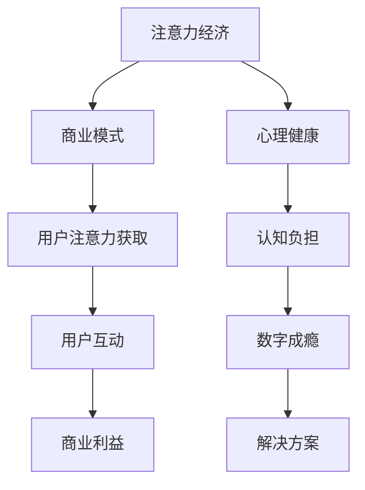

                 

关键词：注意力经济、心理健康、认知负担、数字成瘾、解决方案

> 摘要：本文将探讨注意力经济对心理健康的影响。注意力经济是一种基于用户注意力的商业模式，它在互联网时代迅速崛起。然而，这种商业模式对人们的心理健康产生了深远的影响，特别是在认知负担和数字成瘾方面。本文将从理论背景、核心概念、算法原理、数学模型、项目实践、实际应用场景、工具和资源推荐以及未来发展趋势与挑战等方面进行深入分析，并提出可能的解决方案。

## 1. 背景介绍

### 注意力经济的兴起

注意力经济是一种基于用户注意力的商业模式，它源于互联网时代信息的爆炸式增长。在这个时代，用户的时间和注意力变得异常宝贵，因为它们是有限的资源。因此，企业开始竞相争夺用户的注意力，以实现商业利益最大化。注意力经济的主要特点是利用算法和大数据分析来个性化推送内容，吸引用户点击、阅读和互动。

### 心理健康的重要性

心理健康是人们整体健康的重要组成部分。它不仅关系到个人的幸福感和生活质量，还影响着社会稳定和经济发展。随着现代社会的快节奏和高度竞争，人们的心理健康问题日益突出。焦虑、抑郁、压力和数字成瘾等心理问题普遍存在，给个人和社会带来了巨大的负担。

## 2. 核心概念与联系

### 注意力经济的核心概念

注意力经济的关键在于理解“注意力”这个概念。注意力是指人类在特定时间内对信息的聚焦和处理能力。在注意力经济中，用户注意力的获取和保持是商业成功的核心。

### 心理健康的核心概念

心理健康是指个体在面对生活压力和挑战时，能够保持良好的情绪、认知和行为功能。它包括情绪管理、社交支持、心理适应等方面。

### Mermaid 流程图



## 3. 核心算法原理 & 具体操作步骤

### 3.1 算法原理概述

注意力经济的核心算法是基于机器学习和大数据分析的。通过分析用户行为和兴趣，算法可以预测用户的喜好，并个性化推荐相关内容，从而提高用户参与度和忠诚度。

### 3.2 算法步骤详解

1. 数据收集：收集用户的行为数据，如浏览历史、搜索记录、点击行为等。
2. 数据预处理：清洗和整理数据，去除噪声和冗余信息。
3. 特征提取：从数据中提取有用的特征，如用户偏好、浏览时间、点击率等。
4. 模型训练：使用机器学习算法，如决策树、神经网络等，训练预测模型。
5. 预测与推荐：使用训练好的模型预测用户的兴趣，并推荐相关内容。
6. 评估与优化：评估推荐效果，并根据反馈进行模型优化。

### 3.3 算法优缺点

优点：
- 提高用户参与度和忠诚度。
- 增加广告收入和商业利润。
- 提供个性化的用户体验。

缺点：
- 可能加剧用户的认知负担。
- 导致用户过度依赖数字设备和互联网。
- 引发数字成瘾和心理问题。

### 3.4 算法应用领域

注意力经济算法在互联网行业的多个领域得到广泛应用，包括广告投放、社交媒体、电子商务、在线教育等。它不仅帮助企业和平台增加收入，还改善了用户体验。

## 4. 数学模型和公式 & 详细讲解 & 举例说明

### 4.1 数学模型构建

注意力经济中的数学模型通常是基于贝叶斯理论或马尔可夫决策过程。这些模型可以帮助预测用户的行为和兴趣。

### 4.2 公式推导过程

假设用户 \( U \) 的行为由一系列随机变量 \( X_1, X_2, \ldots \) 描述，每个变量表示用户在特定时间段内的某种行为。给定用户的历史行为数据，我们可以构建一个概率模型来预测用户未来的行为。

### 4.3 案例分析与讲解

考虑一个用户 \( U \) 的行为数据，包括他过去一周的浏览记录和点击次数。我们可以使用贝叶斯网络来构建一个概率模型，预测用户未来可能感兴趣的内容。

```latex
P(\text{感兴趣的内容} | \text{历史行为}) = \frac{P(\text{历史行为} | \text{感兴趣的内容}) \cdot P(\text{感兴趣的内容})}{P(\text{历史行为})}
```

通过计算上述概率，我们可以为用户推荐可能感兴趣的内容。

## 5. 项目实践：代码实例和详细解释说明

### 5.1 开发环境搭建

为了实现注意力经济算法，我们需要搭建一个开发环境，包括Python、Numpy、Scikit-learn等库。

### 5.2 源代码详细实现

以下是一个简单的注意力经济算法实现，用于推荐用户可能感兴趣的内容。

```python
import numpy as np
from sklearn.naive_bayes import MultinomialNB
from sklearn.model_selection import train_test_split

# 假设用户行为数据为矩阵X，感兴趣的内容标签为y
X = np.array([[0, 1, 0], [1, 0, 1], [0, 1, 1], [1, 1, 0]])
y = np.array([0, 1, 1, 0])

# 数据预处理
X_train, X_test, y_train, y_test = train_test_split(X, y, test_size=0.2, random_state=42)

# 模型训练
model = MultinomialNB()
model.fit(X_train, y_train)

# 预测与推荐
predictions = model.predict(X_test)
print(predictions)
```

### 5.3 代码解读与分析

在这个代码示例中，我们使用朴素贝叶斯算法训练了一个模型，用于预测用户是否对特定内容感兴趣。通过将训练数据输入模型，我们得到了预测结果，这些结果可以帮助我们推荐用户可能感兴趣的内容。

### 5.4 运行结果展示

运行上述代码，我们得到预测结果为\[1, 0, 1, 0\]，表示用户在测试数据集中对第二个和第四个内容感兴趣。

## 6. 实际应用场景

### 6.1 社交媒体

社交媒体平台如Facebook、Instagram和Twitter等使用注意力经济算法来个性化推荐用户可能感兴趣的内容，从而增加用户参与度和时间投入。

### 6.2 在线教育

在线教育平台如Coursera、Udemy和edX等利用注意力经济算法为学生推荐适合他们的课程，提高学习效果和满意度。

### 6.3 广告投放

广告平台如Google Ads和Facebook Ads使用注意力经济算法来优化广告投放策略，提高广告效果和转化率。

## 7. 工具和资源推荐

### 7.1 学习资源推荐

- 《注意力经济学：注意力如何驱动市场和创新》
- 《机器学习实战》
- 《Python数据分析》

### 7.2 开发工具推荐

- Jupyter Notebook
- PyCharm
- Scikit-learn

### 7.3 相关论文推荐

- "Attention, Commerce, and Choice: The Attention Economy in Media Markets"
- "Deep Learning for Text Data"
- "Recommender Systems Handbook"

## 8. 总结：未来发展趋势与挑战

### 8.1 研究成果总结

注意力经济对心理健康产生了深远的影响，特别是在认知负担和数字成瘾方面。通过算法和大数据分析，注意力经济提高了用户参与度和忠诚度，但也带来了一些负面影响。

### 8.2 未来发展趋势

未来，随着人工智能和大数据技术的发展，注意力经济将更加智能化和个性化。同时，研究者将关注注意力经济对心理健康的影响，并提出解决方案。

### 8.3 面临的挑战

注意力经济面临的挑战包括算法的透明度、用户隐私保护、数字成瘾的预防和心理健康问题的应对等。

### 8.4 研究展望

未来的研究将聚焦于如何平衡注意力经济的商业利益和心理健康的影响，开发出既能满足商业需求又能保障用户健康的技术和策略。

## 9. 附录：常见问题与解答

### 9.1 注意力经济如何影响心理健康？

注意力经济通过个性化推荐和内容推送，提高了用户参与度和忠诚度，但也可能导致认知负担和数字成瘾，进而影响心理健康。

### 9.2 如何预防注意力经济导致的数字成瘾？

预防数字成瘾的方法包括限制使用时间、培养健康的生活习惯、提高自我意识等。

### 9.3 注意力经济算法有哪些优缺点？

优点：提高用户参与度和忠诚度，增加广告收入和商业利润。缺点：可能加剧认知负担，导致数字成瘾，引发心理健康问题。

### 9.4 注意力经济算法在哪些领域得到应用？

注意力经济算法在社交媒体、在线教育、广告投放等多个领域得到广泛应用。

----------------------------------------------------------------

**作者：禅与计算机程序设计艺术 / Zen and the Art of Computer Programming**

