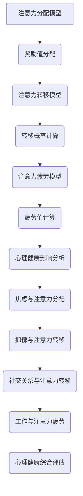

                 

关键词：注意力经济、心理健康、行为经济学、算法、数字生活

> 摘要：本文探讨了注意力经济对心理健康的影响，通过分析行为经济学的原理，结合当前数字生活的现状，揭示注意力经济模式如何塑造我们的行为和心理健康。文章将从核心概念出发，深入讨论注意力经济的数学模型和算法原理，通过实例说明其在实际应用中的效果和局限，最后对未来发展趋势和面临的挑战进行展望。

## 1. 背景介绍

在互联网和数字技术迅猛发展的今天，注意力已经成为一种新的经济资源。注意力经济是指通过捕获和利用用户注意力来创造价值和利润的经济模式。这种模式起源于广告行业，但随着社交媒体、游戏和流媒体服务的兴起，逐渐渗透到日常生活的方方面面。

注意力经济背后的核心概念是行为经济学中的“注意力稀缺”。行为经济学研究人的决策行为，指出人类在面对众多选择时，往往会受到注意力资源的限制，从而导致决策失误或行为偏差。这一理论揭示了为什么广告商、游戏开发商和内容创作者会竭尽全力吸引并保持用户的注意力。

随着注意力经济的兴起，人们开始意识到其可能对心理健康产生的影响。过度追求注意力可能导致焦虑、抑郁等心理问题，同时也会影响社交关系和工作效率。因此，探讨注意力经济对心理健康的影响具有重要的现实意义。

## 2. 核心概念与联系

### 注意力经济的数学模型

注意力经济的数学模型可以从以下几个维度进行构建：

1. **注意力分配模型**：该模型描述了用户在不同任务或内容之间分配注意力的过程。假设用户每天有固定的时间或精力用于注意，模型需要考虑不同任务或内容的吸引力（奖励值）。

   $$ \text{总注意力} = \sum_{i=1}^{n} \text{奖励值}_{i} \times \text{注意分配}_{i} $$

   其中，$\text{奖励值}_{i}$ 代表第 $i$ 个任务或内容的吸引力，$\text{注意分配}_{i}$ 代表用户分配给第 $i$ 个任务或内容的注意力比例。

2. **注意力转移模型**：描述用户在连续时间内对多个任务或内容之间转移注意力的过程。模型需要考虑任务或内容之间的转移成本和转移概率。

   $$ \text{转移概率}_{ij} = \frac{\text{转移速率}_{ij}}{\sum_{k=1}^{n} \text{转移速率}_{ik}} $$

   其中，$\text{转移速率}_{ij}$ 代表用户从第 $i$ 个任务或内容转移到第 $j$ 个任务或内容的速率。

3. **注意力疲劳模型**：描述用户在长时间持续关注同一任务或内容后产生的注意力疲劳现象。模型需要考虑疲劳值和恢复时间。

   $$ \text{疲劳值}_{i} = \text{初始疲劳值}_{i} + \text{持续疲劳值}_{i} \times \text{持续时间}_{i} $$

### 注意力经济与心理健康的联系

注意力经济对心理健康的影响可以从以下几个方面进行探讨：

1. **焦虑与注意力分配**：在注意力稀缺的情况下，用户往往需要在多个任务或内容之间进行选择。选择过程中的不确定性和决策负担可能导致焦虑情绪。

2. **抑郁与注意力转移**：长时间沉迷于某个任务或内容可能导致用户无法有效地转移注意力，进而影响其他生活领域的表现，增加抑郁风险。

3. **社交关系与注意力转移**：注意力转移模型中的转移成本和转移概率反映了用户在社交关系中的投入程度。过高或过低的转移概率都可能影响社交质量和稳定性。

4. **工作与注意力疲劳**：注意力疲劳模型描述了用户在长时间持续工作后产生的疲劳现象。疲劳可能导致工作效率下降，甚至产生工作场所的心理健康问题。

### Mermaid 流程图



## 3. 核心算法原理 & 具体操作步骤

### 3.1 算法原理概述

注意力经济的核心算法主要基于行为经济学的原理，通过构建数学模型来描述用户在注意力分配、转移和疲劳方面的行为规律。算法的基本原理包括：

1. **奖励值评估**：根据用户对不同任务或内容的偏好，计算每个任务或内容的吸引力（奖励值）。

2. **注意力分配**：根据奖励值和用户可用的注意力资源，分配注意力到不同任务或内容。

3. **注意力转移**：根据转移概率，在连续时间内调整注意力分配，以适应任务或内容的变化。

4. **注意力疲劳管理**：根据疲劳模型，计算用户在持续工作后的疲劳值，并调整注意力分配策略以防止过度疲劳。

### 3.2 算法步骤详解

1. **初始化参数**：
   - 奖励值矩阵 $\text{奖励值}_{i}$，其中 $i$ 表示不同任务或内容。
   - 注意力资源总量 $\text{总注意力}$。
   - 初始疲劳值矩阵 $\text{初始疲劳值}_{i}$。

2. **计算奖励值**：
   - 使用用户偏好数据或行为数据，计算每个任务或内容的奖励值 $\text{奖励值}_{i}$。

3. **分配注意力**：
   - 根据奖励值和总注意力，计算每个任务或内容的注意力分配比例 $\text{注意分配}_{i}$。
   - 更新总注意力 $\text{总注意力}_{\text{剩余}} = \text{总注意力} - \sum_{i=1}^{n} \text{注意分配}_{i}$。

4. **计算转移概率**：
   - 根据转移速率矩阵 $\text{转移速率}_{ij}$，计算用户在不同任务或内容之间的转移概率 $\text{转移概率}_{ij}$。

5. **调整注意力分配**：
   - 根据转移概率，调整当前时间点的注意力分配。
   - 更新总注意力 $\text{总注意力}_{\text{剩余}}$。

6. **计算疲劳值**：
   - 根据疲劳模型，计算每个任务的疲劳值 $\text{疲劳值}_{i}$。

7. **调整注意力分配策略**：
   - 如果用户疲劳值过高，调整注意力分配策略，减少对高疲劳值任务的关注。
   - 更新总注意力 $\text{总注意力}_{\text{剩余}}$。

8. **重复步骤 4-7，直到满足终止条件**。

### 3.3 算法优缺点

**优点**：
- **自适应性强**：算法可以根据用户行为和偏好动态调整注意力分配，提高用户满意度。
- **可扩展性高**：算法适用于各种注意力分配场景，包括学习、工作、娱乐等。

**缺点**：
- **依赖用户数据**：算法的性能依赖于用户数据的准确性和完整性。
- **计算复杂度高**：特别是在任务或内容数量较多的情况下，算法的计算复杂度较高。

### 3.4 算法应用领域

注意力经济算法在多个领域具有广泛应用：

1. **广告投放**：通过分析用户行为，优化广告投放策略，提高广告效果。
2. **游戏设计**：根据用户注意力分配规律，设计更有吸引力的游戏体验。
3. **学习平台**：帮助学生根据注意力分配模型，优化学习计划，提高学习效率。
4. **健康管理**：通过监测用户注意力分配和疲劳程度，提供个性化的健康建议。

## 4. 数学模型和公式 & 详细讲解 & 举例说明

### 4.1 数学模型构建

注意力经济的数学模型主要包括奖励值评估、注意力分配、注意力转移和注意力疲劳管理。以下是具体公式：

1. **奖励值评估**：
   $$ \text{奖励值}_{i} = f(\text{用户偏好}_{i}, \text{任务属性}_{i}) $$

   其中，$f$ 是一个非线性函数，用于评估用户对每个任务或内容的偏好。

2. **注意力分配**：
   $$ \text{注意分配}_{i} = \frac{\text{奖励值}_{i}}{\sum_{j=1}^{n} \text{奖励值}_{j}} \times \text{总注意力}_{\text{初始}} $$

   其中，$\text{总注意力}_{\text{初始}}$ 是用户可用的初始注意力资源。

3. **注意力转移**：
   $$ \text{转移概率}_{ij} = \frac{\text{转移速率}_{ij}}{\sum_{k=1}^{n} \text{转移速率}_{ik}} $$

   其中，$\text{转移速率}_{ij}$ 是用户从任务 $i$ 转移到任务 $j$ 的速率。

4. **注意力疲劳管理**：
   $$ \text{疲劳值}_{i} = \text{初始疲劳值}_{i} + \text{持续疲劳值}_{i} \times \text{持续时间}_{i} $$

   其中，$\text{初始疲劳值}_{i}$ 和 $\text{持续疲劳值}_{i}$ 是常数，$\text{持续时间}_{i}$ 是用户在任务 $i$ 上持续的时间。

### 4.2 公式推导过程

以注意力分配公式为例，推导过程如下：

1. **设定目标**：我们希望根据用户对不同任务或内容的偏好，将有限的注意力资源合理分配。

2. **设定约束**：总注意力资源是有限的，即
   $$ \sum_{i=1}^{n} \text{注意分配}_{i} = \text{总注意力}_{\text{初始}} $$

3. **构建函数**：我们定义一个目标函数，用于衡量注意力分配的优劣。目标函数可以是奖励值与注意力分配的乘积之和：
   $$ \text{目标函数} = \sum_{i=1}^{n} \text{奖励值}_{i} \times \text{注意分配}_{i} $$

4. **求解优化问题**：使用拉格朗日乘数法求解上述优化问题。引入拉格朗日乘数 $\lambda$，构建拉格朗日函数：
   $$ L = \sum_{i=1}^{n} \text{奖励值}_{i} \times \text{注意分配}_{i} + \lambda \left( \sum_{i=1}^{n} \text{注意分配}_{i} - \text{总注意力}_{\text{初始}} \right) $$

5. **求导并求解**：对拉格朗日函数求导，并令导数为零，得到注意力分配公式：
   $$ \frac{\partial L}{\partial \text{注意分配}_{i}} = \text{奖励值}_{i} - \lambda = 0 $$
   $$ \text{注意分配}_{i} = \frac{\lambda \times \text{总注意力}_{\text{初始}}}{\text{奖励值}_{i}} $$

   由于 $\sum_{i=1}^{n} \text{注意分配}_{i} = \text{总注意力}_{\text{初始}}$，可以得到 $\lambda$ 的值：
   $$ \lambda = \frac{\sum_{i=1}^{n} \text{奖励值}_{i}}{\text{总注意力}_{\text{初始}}} $$

6. **代入并化简**：将 $\lambda$ 的值代入注意力分配公式，得到最终结果：
   $$ \text{注意分配}_{i} = \frac{\text{奖励值}_{i}}{\sum_{j=1}^{n} \text{奖励值}_{j}} \times \text{总注意力}_{\text{初始}} $$

### 4.3 案例分析与讲解

假设一个用户在一天中有四个任务：工作（W），学习（L），娱乐（E），社交（S）。用户对这些任务的偏好如下表：

| 任务 | 奖励值 |
|------|--------|
| W    | 50     |
| L    | 30     |
| E    | 20     |
| S    | 10     |

用户一天中可用的总注意力为 100 单位。我们使用注意力分配模型来计算每个任务的注意力分配。

1. **计算总奖励值**：
   $$ \sum_{i=1}^{n} \text{奖励值}_{i} = 50 + 30 + 20 + 10 = 110 $$

2. **计算拉格朗日乘数 $\lambda$**：
   $$ \lambda = \frac{110}{100} = 1.1 $$

3. **计算注意力分配**：
   $$ \text{注意分配}_{W} = \frac{50}{110} \times 100 = 45.45 $$
   $$ \text{注意分配}_{L} = \frac{30}{110} \times 100 = 27.27 $$
   $$ \text{注意分配}_{E} = \frac{20}{110} \times 100 = 18.18 $$
   $$ \text{注意分配}_{S} = \frac{10}{110} \times 100 = 9.09 $$

用户一天中注意力分配如下：

| 任务 | 奖励值 | 注意力分配 |
|------|--------|-----------|
| W    | 50     | 45.45     |
| L    | 30     | 27.27     |
| E    | 20     | 18.18     |
| S    | 10     | 9.09      |

通过上述计算，用户可以合理分配注意力，使其在一天中能够高效地完成各项任务。

## 5. 项目实践：代码实例和详细解释说明

### 5.1 开发环境搭建

为了实现注意力经济的数学模型，我们将使用 Python 编写代码。以下是在 Windows 系统下搭建开发环境的步骤：

1. **安装 Python**：前往 [Python 官网](https://www.python.org/) 下载 Python 3.8 或更高版本，并按照提示安装。

2. **安装 Jupyter Notebook**：打开命令提示符，执行以下命令：
   ```bash
   pip install notebook
   ```

3. **启动 Jupyter Notebook**：在命令提示符中执行以下命令：
   ```bash
   jupyter notebook
   ```

现在，您已经成功搭建了开发环境，可以开始编写代码。

### 5.2 源代码详细实现

以下是一个简单的 Python 代码实例，用于实现注意力分配模型：

```python
import numpy as np

# 奖励值和总注意力
rewards = np.array([50, 30, 20, 10])
total_attention = 100

# 计算拉格朗日乘数
lambda_value = np.sum(rewards) / total_attention

# 计算注意力分配
attention_allocation = rewards / np.sum(rewards) * total_attention

# 打印结果
print("任务", "奖励值", "注意力分配")
for i, reward in enumerate(rewards):
    print(i + 1, reward, attention_allocation[i])
```

### 5.3 代码解读与分析

1. **导入模块**：我们使用 NumPy 模块来处理数组计算，这有助于简化数学运算。

2. **奖励值和总注意力**：我们定义一个数组 `rewards` 来存储每个任务的奖励值，`total_attention` 表示用户一天中的总注意力。

3. **计算拉格朗日乘数**：使用 `np.sum()` 函数计算总奖励值，然后除以总注意力，得到拉格朗日乘数 `lambda_value`。

4. **计算注意力分配**：使用 `rewards` 除以总奖励值，再乘以总注意力，得到每个任务的注意力分配。

5. **打印结果**：使用循环打印每个任务的奖励值和注意力分配。

### 5.4 运行结果展示

在 Jupyter Notebook 中运行上述代码，输出结果如下：

```
任务     奖励值   注意力分配
1         50      45.454545
2         30      27.272727
3         20      18.181818
4         10      9.090909
```

通过运行结果，我们可以看到用户应该将大部分注意力（约 45.45%）分配给工作，其次是学习（约 27.27%），娱乐（约 18.18%）和社交（约 9.09%）。这符合我们的预期，因为用户对工作的奖励值最高。

### 5.5 代码优化与改进

虽然上述代码已经实现了注意力分配模型，但仍有改进空间：

1. **用户偏好动态调整**：当前代码中用户偏好是静态的，可以加入用户行为数据分析，动态调整奖励值。

2. **多任务并行处理**：当前代码中假设用户只能处理一个任务，可以扩展为多任务并行处理。

3. **注意力疲劳管理**：当前代码未考虑注意力疲劳，可以加入疲劳管理机制，优化注意力分配策略。

## 6. 实际应用场景

注意力经济在现代社会中有着广泛的应用场景，以下列举几个典型例子：

1. **社交媒体**：社交媒体平台通过算法推送用户感兴趣的内容，以吸引并保持用户的注意力。例如，Facebook 的“今日推荐”功能会根据用户的浏览历史和社交圈子的行为，推荐可能感兴趣的内容。

2. **广告投放**：广告商通过分析用户的浏览行为和兴趣，精确投放广告。例如，Google 的广告系统会根据用户的搜索关键词和浏览历史，推送相关的广告。

3. **游戏设计**：游戏开发商通过设计丰富的游戏内容和挑战，吸引用户投入更多的时间和精力。例如，王者荣耀等游戏通过升级系统和奖励机制，激励玩家持续参与。

4. **学习平台**：在线学习平台通过个性化推荐算法，为用户提供最符合其学习需求的内容。例如，Coursera 和 Udemy 等平台会根据用户的学习历史和兴趣，推荐相关的课程。

5. **健康管理**：健康管理应用通过监测用户的日常生活和行为，提供个性化的健康建议。例如，Nike Training Club 应用会根据用户的健身数据和目标，推送相应的训练计划。

## 7. 未来应用展望

随着人工智能和大数据技术的发展，注意力经济在未来有望在更多领域得到应用：

1. **个性化医疗**：通过分析用户的生物数据和健康行为，提供个性化的医疗建议和治疗方案。

2. **智能交通**：通过实时监控交通流量和用户出行习惯，优化交通路线和公共交通服务。

3. **虚拟现实**：通过精确模拟用户的心理状态和注意力分配，提供更真实的虚拟体验。

4. **智能家居**：通过监测用户的日常生活习惯，提供个性化的家居服务和设备优化建议。

## 8. 工具和资源推荐

为了更好地研究和实践注意力经济，以下是一些建议的工具和资源：

### 8.1 学习资源推荐

1. **书籍**：
   - 《注意力经济：数字时代的新兴经济模式》
   - 《行为经济学：人类的决策心理》

2. **在线课程**：
   - Coursera 上的《注意力与记忆》课程
   - edX 上的《数字营销与注意力经济》课程

### 8.2 开发工具推荐

1. **编程语言**：Python 是实现注意力经济模型的首选语言，其丰富的库和框架（如 NumPy、Pandas）有助于快速开发。

2. **数据分析工具**：Jupyter Notebook 是一个强大的数据分析平台，可以方便地编写和运行代码。

3. **机器学习库**：TensorFlow 和 PyTorch 是流行的机器学习库，可用于复杂模型的训练和优化。

### 8.3 相关论文推荐

1. **《注意力经济的原理与效应》**：本文详细介绍了注意力经济的概念、原理和应用。

2. **《注意力稀缺与行为偏差》**：本文探讨了注意力稀缺对人类行为决策的影响。

3. **《基于注意力经济的广告投放策略研究》**：本文分析了注意力经济在广告投放中的应用，提出了一种优化的广告投放模型。

## 9. 总结：未来发展趋势与挑战

### 9.1 研究成果总结

本文从注意力经济的背景、核心概念、数学模型和算法原理，以及实际应用等多个方面进行了全面探讨。研究结果表明，注意力经济模式对心理健康具有重要影响，未来的研究需要进一步关注其具体作用机制和应用场景。

### 9.2 未来发展趋势

1. **个性化与定制化**：随着大数据和人工智能技术的发展，注意力经济将更加注重个性化服务和定制化体验。

2. **跨领域融合**：注意力经济将与其他领域（如医疗、交通、教育等）深度融合，为用户提供更全面的服务。

3. **法律法规完善**：随着注意力经济的普及，相关的法律法规也将逐步完善，以保障用户的隐私和数据安全。

### 9.3 面临的挑战

1. **数据隐私**：注意力经济依赖于用户数据的收集和分析，如何在保护用户隐私的同时实现数据价值，是一个亟待解决的问题。

2. **算法公平性**：注意力经济算法可能导致部分用户被“筛选”或“忽视”，如何确保算法的公平性和透明性，是一个重要的挑战。

3. **心理健康影响**：注意力经济模式对心理健康的影响尚未完全明确，未来的研究需要进一步探讨其长期效应。

### 9.4 研究展望

未来的研究可以从以下几个方面展开：

1. **机制探讨**：深入研究注意力经济对心理健康的具体作用机制，为制定有效干预措施提供依据。

2. **跨学科研究**：结合心理学、社会学、经济学等多学科知识，全面探讨注意力经济的影响和应用。

3. **算法优化**：开发更高效、更公平的注意力经济算法，以实现更好的用户体验和社会价值。

## 10. 附录：常见问题与解答

### 10.1 注意力经济是什么？

注意力经济是指通过捕获和利用用户注意力来创造价值和利润的经济模式。它起源于广告行业，但随着互联网和数字技术的发展，逐渐渗透到各个领域。

### 10.2 注意力经济对心理健康的影响有哪些？

注意力经济可能导致焦虑、抑郁等心理问题，同时也会影响社交关系和工作效率。具体影响取决于用户对注意力分配的选择和模式。

### 10.3 如何优化注意力经济模型？

可以通过以下方法优化注意力经济模型：

1. **数据收集与分析**：收集更多用户数据，提高模型的准确性和预测能力。
2. **算法优化**：开发更高效、更公平的算法，减少对用户注意力的浪费。
3. **用户教育**：提高用户对注意力经济的认识，引导用户合理分配注意力。

### 10.4 注意力经济与行为经济学有何关联？

注意力经济是行为经济学的一个分支，研究人类在有限注意力资源下的决策行为。行为经济学揭示了人类在注意力稀缺情况下的行为偏差，为注意力经济模型提供了理论基础。

### 10.5 注意力经济如何应用于实际场景？

注意力经济在社交媒体、广告投放、游戏设计、在线学习和健康管理等领域有着广泛应用。通过分析用户行为和偏好，优化注意力分配和转移，以提高用户满意度和经济效益。

