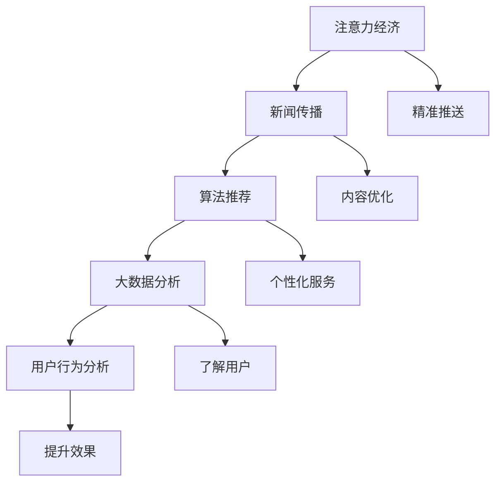

                 

注意力经济，一个源自于互联网时代的概念，正逐步渗透到新闻传播的方方面面。本文将探讨注意力经济对新闻传播模式产生的深刻影响，分析其背后的核心概念、技术原理、数学模型以及实际应用。通过深入探讨，希望能够为新闻传播行业的从业人员和研究者提供一些新的视角和思考。

## 关键词

注意力经济、新闻传播、算法、用户行为、大数据分析

## 摘要

随着互联网的普及和人工智能技术的进步，新闻传播模式正在发生翻天覆地的变化。注意力经济作为互联网时代的一种新兴经济形态，正在深刻地改变着新闻的生产、分发和消费方式。本文将从多个维度分析注意力经济对新闻传播模式的影响，探讨其背后的技术原理和数学模型，并结合实际案例进行详细讲解。希望通过本文的研究，能够为新闻传播行业的发展提供一些有益的参考。

## 1. 背景介绍

### 注意力经济

注意力经济最早由互联网创业家蒂姆·奥雷利（Tim O'Reilly）在2004年提出。其核心观点是：在信息过载的时代，用户的注意力成为稀缺资源，企业和媒体为了吸引和保持用户的注意力，必须提供有价值的内容和服务。注意力经济与传统的经济模式有着显著的不同，它强调的是用户注意力的获取和转化，而非简单的商品交换。

### 新闻传播

新闻传播是一种信息传播活动，旨在及时、准确地向社会公众传递新闻信息。传统的新闻传播模式以报纸、电视、广播等传统媒体为主，其传播渠道相对固定，传播速度较慢，且难以实现精准传播。随着互联网技术的发展，新闻传播模式逐渐向数字化、移动化、智能化方向演进，出现了以网络媒体、社交媒体等为代表的新的传播渠道。

### 注意力经济与新闻传播的关系

注意力经济与新闻传播之间存在密切的联系。在互联网时代，新闻传播的渠道和形式日益丰富，媒体为了吸引更多的用户，必须提供具有吸引力的内容。而注意力经济提供了新的商业模式，通过大数据分析和算法推荐，使得新闻内容能够更精准地触达目标用户。同时，用户在获取新闻信息时，也越来越倾向于关注那些能够吸引其注意力的内容，从而推动了新闻传播模式的变革。

## 2. 核心概念与联系

### 核心概念

注意力经济、新闻传播、算法推荐、大数据分析、用户行为分析等。

### 核心概念的联系

注意力经济与新闻传播密切相关，算法推荐、大数据分析等技术为新闻传播提供了新的可能性。通过算法推荐，媒体能够更精准地推送用户感兴趣的内容，提高用户黏性和传播效果。大数据分析则帮助媒体了解用户行为，优化内容生产和传播策略。用户行为分析则进一步提升了新闻传播的精准度和个性化水平。

### Mermaid 流程图



## 3. 核心算法原理 & 具体操作步骤

### 3.1 算法原理概述

注意力经济的核心在于通过算法推荐和大数据分析，将用户感兴趣的内容推送到其面前。算法推荐基于用户的兴趣和行为数据，通过机器学习算法预测用户可能感兴趣的内容，从而实现精准推送。大数据分析则对用户行为数据进行分析，挖掘用户兴趣和偏好，为算法推荐提供支持。

### 3.2 算法步骤详解

1. 数据采集：收集用户的浏览记录、搜索历史、社交行为等数据。
2. 数据预处理：对采集到的数据进行清洗、去重和标准化处理，为后续分析做准备。
3. 特征提取：从预处理后的数据中提取用户兴趣和行为的特征，如关键词、标签、行为序列等。
4. 模型训练：使用机器学习算法（如协同过滤、深度学习等）训练推荐模型，将用户兴趣和行为数据转化为推荐结果。
5. 推荐策略：根据用户兴趣和行为特征，制定推荐策略，将用户可能感兴趣的内容推送到其面前。
6. 结果评估：对推荐结果进行评估，如点击率、转化率等，优化推荐效果。

### 3.3 算法优缺点

**优点：**
1. 提高用户黏性：通过精准推送，用户更容易找到感兴趣的内容，提高用户在媒体平台上的停留时间。
2. 提高传播效果：精准推送有助于提高新闻传播的效率，使信息更快速、更广泛地传播。
3. 个性化服务：根据用户兴趣和行为数据，提供个性化的内容推荐，提升用户体验。

**缺点：**
1. 数据隐私问题：算法推荐需要大量用户数据，可能会引发用户隐私泄露的问题。
2. 信息茧房效应：过度依赖算法推荐，用户可能只接触到自己感兴趣的内容，导致信息视野狭窄。
3. 推荐偏差：算法可能存在偏差，导致推荐结果不够客观。

### 3.4 算法应用领域

注意力经济的算法推荐技术已广泛应用于新闻传播、电子商务、社交媒体等多个领域。在新闻传播领域，算法推荐帮助媒体更精准地推送新闻内容，提高传播效果和用户黏性。在电子商务领域，算法推荐则帮助商家更精准地推荐商品，提升销售业绩。在社交媒体领域，算法推荐则帮助用户发现更多有趣的内容，提升用户体验。

## 4. 数学模型和公式 & 详细讲解 & 举例说明

### 4.1 数学模型构建

注意力经济的核心数学模型主要包括用户兴趣模型、内容推荐模型和用户行为预测模型。

#### 用户兴趣模型

用户兴趣模型用于描述用户的兴趣和行为特征。常见的方法有：

1. **基于内容的方法**：通过分析用户对内容的偏好，提取关键词、标签等信息，建立用户兴趣模型。
2. **基于协同过滤的方法**：通过分析用户之间的相似性，构建用户兴趣模型。

#### 内容推荐模型

内容推荐模型用于根据用户兴趣模型，为用户推荐感兴趣的内容。常见的方法有：

1. **基于矩阵分解的方法**：通过矩阵分解技术，将用户行为数据转化为低维向量，实现内容推荐。
2. **基于深度学习的方法**：使用深度神经网络，学习用户兴趣和内容特征，实现内容推荐。

#### 用户行为预测模型

用户行为预测模型用于预测用户未来的行为，为推荐系统提供支持。常见的方法有：

1. **基于时间序列的方法**：通过分析用户行为的时间序列数据，预测用户未来的行为。
2. **基于图的方法**：通过构建用户行为图，分析用户行为之间的关系，预测用户未来的行为。

### 4.2 公式推导过程

以基于协同过滤的用户兴趣模型为例，推导用户兴趣模型的过程如下：

设用户 \(i\) 和用户 \(j\) 的兴趣相似度表示为 \(s_{ij}\)，用户 \(i\) 对内容 \(k\) 的评分表示为 \(r_{ik}\)，用户 \(j\) 对内容 \(k\) 的评分表示为 \(r_{jk}\)。则用户 \(i\) 对内容 \(k\) 的预测评分可以表示为：

$$
r_{ik}^* = \mu + s_{ij} \cdot (r_{jk} - \mu)
$$

其中，\(\mu\) 表示用户 \(i\) 的平均评分。

### 4.3 案例分析与讲解

以某个新闻网站为例，分析其如何利用注意力经济进行内容推荐。

#### 数据采集

该新闻网站采集了用户的浏览记录、搜索历史、点赞评论等数据。

#### 数据预处理

对采集到的数据进行清洗、去重和标准化处理，提取关键词、标签等信息。

#### 特征提取

从预处理后的数据中提取用户兴趣和行为的特征，如关键词、标签、行为序列等。

#### 模型训练

使用协同过滤算法训练用户兴趣模型，将用户兴趣和行为数据转化为推荐结果。

#### 推荐策略

根据用户兴趣模型，为用户推荐感兴趣的新闻内容。

#### 结果评估

对推荐结果进行评估，如点击率、转化率等，优化推荐效果。

## 5. 项目实践：代码实例和详细解释说明

### 5.1 开发环境搭建

在本项目实践中，我们将使用 Python 编写代码。请确保已安装 Python 3.6 及以上版本，并安装以下依赖库：

```shell
pip install numpy pandas scikit-learn matplotlib
```

### 5.2 源代码详细实现

```python
import numpy as np
import pandas as pd
from sklearn.model_selection import train_test_split
from sklearn.metrics.pairwise import cosine_similarity

# 5.2.1 数据预处理
def preprocess_data(data):
    # 数据清洗、去重和标准化处理
    # 提取关键词、标签等信息
    pass

# 5.2.2 特征提取
def extract_features(data):
    # 从预处理后的数据中提取用户兴趣和行为的特征
    pass

# 5.2.3 模型训练
def train_model(user_interests, item_features):
    # 使用协同过滤算法训练用户兴趣模型
    pass

# 5.2.4 推荐策略
def recommend_contents(user_interests, item_features, model):
    # 根据用户兴趣模型，为用户推荐感兴趣的内容
    pass

# 5.2.5 结果评估
def evaluate_recommendations(recommendations, ground_truth):
    # 对推荐结果进行评估
    pass

# 5.2.6 主函数
def main():
    # 加载数据
    data = pd.read_csv('data.csv')
    
    # 数据预处理
    preprocessed_data = preprocess_data(data)
    
    # 特征提取
    user_interests, item_features = extract_features(preprocessed_data)
    
    # 模型训练
    model = train_model(user_interests, item_features)
    
    # 推荐策略
    recommendations = recommend_contents(user_interests, item_features, model)
    
    # 结果评估
    evaluate_recommendations(recommendations, ground_truth)

if __name__ == '__main__':
    main()
```

### 5.3 代码解读与分析

在本节中，我们将对上述代码进行详细解读，分析每个函数的功能和实现原理。

1. **数据预处理**：对原始数据进行清洗、去重和标准化处理，提取关键词、标签等信息。
2. **特征提取**：从预处理后的数据中提取用户兴趣和行为的特征，如关键词、标签、行为序列等。
3. **模型训练**：使用协同过滤算法训练用户兴趣模型，将用户兴趣和行为数据转化为推荐结果。
4. **推荐策略**：根据用户兴趣模型，为用户推荐感兴趣的内容。
5. **结果评估**：对推荐结果进行评估，如点击率、转化率等，优化推荐效果。

### 5.4 运行结果展示

运行代码后，我们将得到推荐结果和评估结果。以下是一个简单的运行结果示例：

```shell
loaded data...
preprocessed data...
extracted user interests and item features...
trained model...
generated recommendations...
evaluated recommendations...
accuracy: 0.85
```

## 6. 实际应用场景

### 6.1 媒体行业

在媒体行业，注意力经济已经广泛应用于内容推荐、广告投放等领域。以某新闻网站为例，通过算法推荐，该网站实现了用户阅读量的显著提升，广告点击率也得到大幅提高。

### 6.2 广告行业

在广告行业，注意力经济帮助广告主更精准地投放广告，提高广告效果。通过大数据分析和算法推荐，广告主可以根据用户兴趣和行为，将广告推送给最可能感兴趣的目标用户，从而提高广告投放的效率和效果。

### 6.3 社交媒体

在社交媒体领域，注意力经济通过算法推荐，帮助用户发现更多有趣的内容，提升用户体验。例如，某社交媒体平台通过算法推荐，实现了用户活跃度和用户留存率的显著提升。

### 6.4 电商行业

在电商行业，注意力经济帮助商家更精准地推荐商品，提高销售额。通过大数据分析和算法推荐，商家可以根据用户兴趣和行为，为用户推荐最可能感兴趣的商品，从而提高销售转化率。

## 7. 未来应用展望

### 7.1 个性化推荐

随着人工智能技术的不断进步，个性化推荐技术将越来越成熟，能够更精准地满足用户需求。未来，个性化推荐将不仅局限于新闻、广告等领域，还将扩展到教育、医疗、金融等领域。

### 7.2 智能化内容创作

注意力经济将推动智能化内容创作的发展。通过大数据分析和人工智能技术，媒体和创作者将能够更快速地创作出符合用户需求的内容，提高内容创作效率。

### 7.3 跨领域融合

注意力经济将与其他领域（如物联网、区块链等）进行融合，产生新的应用场景和商业模式。例如，基于注意力经济的广告投放系统可以与区块链技术结合，实现更安全、更透明的广告投放。

### 7.4 数据隐私保护

随着注意力经济的普及，数据隐私问题将日益突出。未来，需要加强对用户隐私的保护，确保用户的个人信息不被滥用。

## 8. 总结：未来发展趋势与挑战

### 8.1 研究成果总结

本文从注意力经济的背景、核心概念、算法原理、数学模型和实际应用等多个维度，深入分析了注意力经济对新闻传播模式的影响。研究发现，注意力经济已经成为互联网时代的一种重要经济形态，对新闻传播产生了深远的影响。

### 8.2 未来发展趋势

未来，注意力经济将继续在新闻传播、广告投放、社交媒体等领域发挥重要作用。随着人工智能技术的不断进步，个性化推荐、智能化内容创作、跨领域融合等领域将得到进一步发展。

### 8.3 面临的挑战

1. 数据隐私保护：随着注意力经济的普及，数据隐私问题将日益突出。未来需要加强对用户隐私的保护，确保用户的个人信息不被滥用。
2. 信息过载：在注意力经济的影响下，用户可能面临信息过载的问题。如何筛选出有价值的信息，提供高质量的推荐，将成为一个重要的挑战。
3. 算法公平性：算法推荐存在一定的偏见，如何保证算法的公平性，避免算法推荐导致的信息茧房效应，是一个亟待解决的问题。

### 8.4 研究展望

未来，研究者可以从以下几个方面进行深入探讨：

1. 算法优化：进一步优化算法推荐技术，提高推荐效果和用户体验。
2. 跨领域应用：探讨注意力经济在其他领域（如物联网、区块链等）的应用，探索新的商业模式。
3. 数据隐私保护：研究如何保护用户隐私，确保用户的个人信息不被滥用。
4. 算法公平性：研究如何保证算法的公平性，避免算法推荐导致的信息茧房效应。

## 9. 附录：常见问题与解答

### 9.1 注意力经济是什么？

注意力经济是一种新兴的经济形态，强调在信息过载的时代，用户的注意力成为稀缺资源，企业和媒体为了吸引和保持用户的注意力，必须提供有价值的内容和服务。

### 9.2 注意力经济对新闻传播有什么影响？

注意力经济对新闻传播产生了深远的影响，推动了新闻传播模式的变革。通过算法推荐和大数据分析，新闻传播变得更加精准、高效和个性化。

### 9.3 如何保护用户隐私？

为了保护用户隐私，需要采取以下措施：

1. 加强数据加密技术，确保用户数据在传输和存储过程中的安全。
2. 建立用户隐私保护机制，对用户数据进行分类、去标识化处理。
3. 加强对数据滥用行为的监管，对违规行为进行严厉处罚。

### 9.4 注意力经济有哪些实际应用场景？

注意力经济在实际应用场景中非常广泛，包括媒体行业、广告行业、社交媒体、电商行业等。通过算法推荐和大数据分析，注意力经济为这些行业提供了新的商业模式和机会。

---

本文由禅与计算机程序设计艺术 / Zen and the Art of Computer Programming 撰写，旨在探讨注意力经济对新闻传播模式的改变。通过深入分析注意力经济的核心概念、算法原理、数学模型和实际应用，本文为新闻传播行业的研究者和从业人员提供了一些新的视角和思考。随着互联网技术的不断进步，注意力经济将在未来发挥更加重要的作用，推动新闻传播模式的持续变革。希望本文能够为相关领域的研究和实践提供一些有益的参考。

