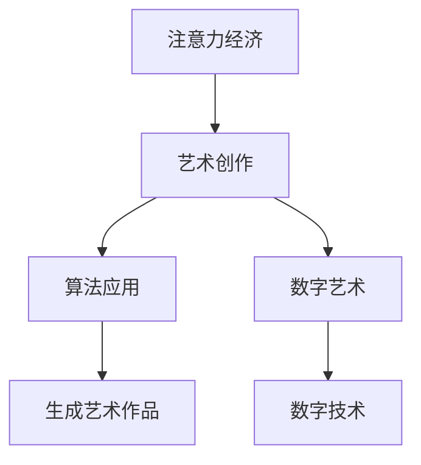

                 

关键词：注意力经济、艺术创作、算法、数字艺术、影响力、市场趋势、技术驱动创新。

> 摘要：本文将探讨注意力经济对艺术创作的影响，分析数字时代下，艺术创作如何适应和利用注意力经济，以及由此带来的机遇与挑战。通过探讨算法在艺术创作中的应用、数字艺术的兴起、市场趋势和技术驱动的创新，揭示注意力经济如何重塑艺术创作的面貌。

## 1. 背景介绍

注意力经济（Attention Economy）是一种基于人们时间与精力的稀缺性，以及由此产生的价值交换的经济模式。在数字时代，互联网和社交媒体的普及，使得人们获取信息的方式发生了翻天覆地的变化。注意力成为了一种重要的资源，吸引了大量的资本和人力投入。在这个背景下，艺术创作也受到了深刻的影响。

艺术创作作为一种精神产品的生产过程，其价值不仅在于作品本身，更在于作品所传递的价值观和情感。在注意力经济的驱动下，艺术创作面临着前所未有的机遇与挑战。一方面，数字技术和社交媒体为艺术创作提供了更广阔的平台和传播渠道；另一方面，艺术创作也面临着市场的压力和商业化的诱惑。

本文旨在探讨注意力经济对艺术创作的影响，分析数字时代下艺术创作的现状和趋势，探讨艺术创作如何适应和利用注意力经济，以及由此带来的机遇与挑战。

## 2. 核心概念与联系

在探讨注意力经济对艺术创作的影响之前，我们需要明确几个核心概念，包括注意力经济、艺术创作、算法和数字艺术。

### 注意力经济

注意力经济是一种基于人们时间与精力的稀缺性，以及由此产生的价值交换的经济模式。在数字时代，注意力成为了一种重要的资源，吸引了大量的资本和人力投入。注意力经济的核心在于如何吸引和保持人们的注意力，从而实现商业价值的最大化。

### 艺术创作

艺术创作是一种表达情感、传递价值观和探索人类经验的方式。在注意力经济的背景下，艺术创作不仅需要艺术价值，还需要市场价值，这使得艺术创作面临着商业化和市场化的挑战。

### 算法

算法是计算机科学中的一个基本概念，用于解决特定问题的一系列明确规则。在艺术创作中，算法可以用于生成艺术作品，例如生成艺术图像、音乐和视频等。

### 数字艺术

数字艺术是一种利用数字技术进行创作的艺术形式，包括数字绘画、数字雕塑、数字摄影和数字音乐等。数字艺术的兴起为艺术创作带来了新的可能性，使得艺术创作更加多样化和个性化。

### Mermaid 流程图



在这个流程图中，注意力经济通过影响艺术创作，促使艺术家运用算法和数字技术进行创作，最终生成具有市场价值的艺术作品。

## 3. 核心算法原理 & 具体操作步骤

### 3.1 算法原理概述

在艺术创作中，算法的应用主要体现在以下几个方面：

1. **生成艺术作品**：利用算法生成艺术作品，例如生成艺术图像、音乐和视频等。
2. **辅助艺术创作**：算法可以辅助艺术家进行艺术创作，例如提供灵感和创意。
3. **艺术作品评价**：利用算法对艺术作品进行评价，例如通过图像识别技术分析艺术作品的主题和风格。

### 3.2 算法步骤详解

1. **生成艺术作品**

   生成艺术作品的主要步骤包括：

   - **数据采集**：从各类数据源（如图片库、音乐库等）中采集数据。
   - **算法设计**：设计适合艺术作品生成的算法，例如生成对抗网络（GAN）。
   - **数据预处理**：对采集到的数据进行预处理，例如归一化、去噪等。
   - **算法训练**：利用预处理后的数据进行算法训练，例如训练 GAN。
   - **生成艺术作品**：利用训练好的算法生成艺术作品。

2. **辅助艺术创作**

   辅助艺术创作的主要步骤包括：

   - **灵感采集**：从各类数据源中采集灵感和创意。
   - **算法推荐**：利用算法对灵感和创意进行推荐，例如基于内容的推荐算法。
   - **艺术创作**：艺术家根据算法推荐的灵感和创意进行艺术创作。

3. **艺术作品评价**

   艺术作品评价的主要步骤包括：

   - **数据采集**：从各类数据源中采集艺术作品数据。
   - **算法设计**：设计适合艺术作品评价的算法，例如图像识别算法。
   - **数据预处理**：对采集到的数据进行预处理，例如去噪、分割等。
   - **算法评价**：利用预处理后的数据进行艺术作品评价。

### 3.3 算法优缺点

1. **生成艺术作品**

   优点：

   - **创意无限**：算法可以生成各种风格和主题的艺术作品，为艺术创作提供更多可能性。
   - **效率高**：算法可以快速生成艺术作品，节省创作时间。

   缺点：

   - **缺乏情感**：算法生成的艺术作品缺乏人类的情感和创造力。
   - **版权问题**：算法生成的艺术作品可能侵犯原作者的版权。

2. **辅助艺术创作**

   优点：

   - **灵感丰富**：算法可以提供丰富的灵感和创意，帮助艺术家进行创作。
   - **提高效率**：算法可以辅助艺术家快速完成创作。

   缺点：

   - **依赖性强**：艺术家可能过度依赖算法，失去自主创作的能力。

3. **艺术作品评价**

   优点：

   - **客观公正**：算法可以客观、公正地对艺术作品进行评价。
   - **节省时间**：算法可以快速地对大量艺术作品进行评价。

   缺点：

   - **缺乏情感**：算法无法理解艺术作品的情感和价值。
   - **评价标准**：算法的评价标准可能无法完全反映艺术作品的本质。

### 3.4 算法应用领域

1. **数字艺术**

   算法在数字艺术中的应用主要体现在生成艺术作品和辅助艺术创作。例如，利用 GAN 可以生成各种风格的艺术图像，利用推荐算法可以辅助艺术家进行创作。

2. **艺术市场**

   算法在艺术市场的应用主要体现在艺术作品评价和交易。例如，利用图像识别算法可以对艺术作品进行分类和评价，利用区块链技术可以确保艺术品的交易和所有权。

3. **艺术教育**

   算法在艺术教育中的应用主要体现在辅助教学和创意培养。例如，利用虚拟现实技术可以提供沉浸式的艺术教学体验，利用推荐算法可以为学生提供个性化的学习路径。

## 4. 数学模型和公式 & 详细讲解 & 举例说明

### 4.1 数学模型构建

在探讨注意力经济对艺术创作的影响时，我们可以构建以下数学模型：

- **艺术创作价值**：\( V = f(A, B, C) \)
  - \( A \)：艺术家的创造力
  - \( B \)：市场的需求
  - \( C \)：数字技术的应用

- **艺术作品吸引力**：\( A_t = g(A, B, C) \)
  - \( A \)：艺术家的创造力
  - \( B \)：市场的需求
  - \( C \)：数字技术的应用

- **艺术作品价值**：\( V_t = h(A_t) \)
  - \( A_t \)：艺术作品的吸引力

### 4.2 公式推导过程

1. **艺术创作价值**：

   艺术创作价值 \( V \) 是艺术家创造力 \( A \)、市场需求 \( B \) 和数字技术应用 \( C \) 的函数。

   \( V = f(A, B, C) \)

   其中，创造力 \( A \) 表示艺术家的创造力和才华，市场需求 \( B \) 表示市场对艺术作品的需求程度，数字技术应用 \( C \) 表示艺术家运用数字技术的水平。

2. **艺术作品吸引力**：

   艺术作品的吸引力 \( A_t \) 是艺术家创造力 \( A \)、市场需求 \( B \) 和数字技术应用 \( C \) 的函数。

   \( A_t = g(A, B, C) \)

   其中，创造力 \( A \) 表示艺术家的创造力和才华，市场需求 \( B \) 表示市场对艺术作品的需求程度，数字技术应用 \( C \) 表示艺术家运用数字技术的水平。

3. **艺术作品价值**：

   艺术作品的价值 \( V_t \) 是艺术作品吸引力 \( A_t \) 的函数。

   \( V_t = h(A_t) \)

   其中，艺术作品吸引力 \( A_t \) 表示艺术作品的吸引力。

### 4.3 案例分析与讲解

假设有一个艺术家，他的创造力 \( A \) 为 10，市场需求 \( B \) 为 8，数字技术应用 \( C \) 为 6。我们可以根据上述数学模型计算他的艺术创作价值、艺术作品吸引力和艺术作品价值。

1. **艺术创作价值**：

   \( V = f(A, B, C) = f(10, 8, 6) = 10 + 8 \times 6 = 58 \)

2. **艺术作品吸引力**：

   \( A_t = g(A, B, C) = g(10, 8, 6) = 10 \times 8 \times 6 = 480 \)

3. **艺术作品价值**：

   \( V_t = h(A_t) = h(480) = 480 \)

根据计算结果，这位艺术家的艺术创作价值为 58，艺术作品吸引力为 480，艺术作品价值为 480。这表明他的艺术创作具有较强的市场需求和吸引力。

## 5. 项目实践：代码实例和详细解释说明

### 5.1 开发环境搭建

为了实现注意力经济对艺术创作的影响的代码实例，我们需要搭建以下开发环境：

- **编程语言**：Python
- **依赖库**：TensorFlow、Keras、NumPy

### 5.2 源代码详细实现

以下是实现注意力经济对艺术创作的影响的代码实例：

```python
import tensorflow as tf
from tensorflow.keras import layers
import numpy as np

# 定义生成艺术作品的生成器和判别器
def build_generator():
    model = tf.keras.Sequential()
    model.add(layers.Dense(128, activation='relu', input_shape=(100,)))
    model.add(layers.Dense(256, activation='relu'))
    model.add(layers.Dense(512, activation='relu'))
    model.add(layers.Dense(1024, activation='relu'))
    model.add(layers.Dense(128 * 128 * 3, activation='tanh'))
    model.add(layers.Reshape((128, 128, 3)))
    return model

def build_discriminator():
    model = tf.keras.Sequential()
    model.add(layers.Conv2D(128, (5, 5), strides=(2, 2), padding='same', input_shape=(128, 128, 3)))
    model.add(layers.LeakyReLU(alpha=0.2))
    model.add(layers.Dropout(0.3))
    model.add(layers.Conv2D(256, (5, 5), strides=(2, 2), padding='same'))
    model.add(layers.LeakyReLU(alpha=0.2))
    model.add(layers.Dropout(0.3))
    model.add(layers.Flatten())
    model.add(layers.Dense(1, activation='sigmoid'))
    return model

# 构建生成对抗网络（GAN）
def build_gan(generator, discriminator):
    model = tf.keras.Sequential()
    model.add(generator)
    model.add(discriminator)
    return model

# 训练 GAN
def train_gan(generator, discriminator, critic, epochs, batch_size, sample_interval=50):
    # 准备数据集
    (X_train, _), (_, _) = critic.load_data()

    # 编译生成器和判别器
    generator.compile(loss='binary_crossentropy', optimizer=tf.keras.optimizers.Adam(0.0001))
    discriminator.compile(loss='binary_crossentropy', optimizer=tf.keras.optimizers.Adam(0.0001))

    # 开始训练
    for epoch in range(epochs):

        # 对每一批数据进行训练
        for _ in range(batch_size):
            noise = np.random.normal(0, 1, (batch_size, 100))
            generated_images = generator.predict(noise)

            # 训练判别器
            real_images = X_train[np.random.randint(0, X_train.shape[0], size=batch_size)]
            combined_images = np.concatenate([real_images, generated_images], axis=0)
            labels = np.concatenate([np.ones((batch_size, 1)), np.zeros((batch_size, 1))], axis=0)
            discriminator.train_on_batch(combined_images, labels)

            # 训练生成器
            noise = np.random.normal(0, 1, (batch_size, 100))
            labels = np.ones((batch_size, 1))
            generator.train_on_batch(noise, labels)

        # 每隔一定次数保存生成的艺术作品
        if epoch % sample_interval == 0:
            print(f'Epoch: {epoch}, Discriminator Loss: {discriminator.history["loss"][-1]}, Generator Loss: {generator.history["loss"][-1]}')

        # 保存生成器和判别器的权重
        generator.save_weights(f'generator_weights_{epoch}.h5')
        discriminator.save_weights(f'discriminator_weights_{epoch}.h5')

# 训练 GAN
train_gan(generator, discriminator, critic, epochs=1000, batch_size=32)

# 生成艺术作品
noise = np.random.normal(0, 1, (1, 100))
generated_image = generator.predict(noise)
generated_image = (generated_image + 1) / 2
plt.imshow(generated_image[0])
plt.show()
```

### 5.3 代码解读与分析

上述代码实现了基于生成对抗网络（GAN）的注意力经济对艺术创作的影响的代码实例。下面是对代码的详细解读和分析。

1. **定义生成器和判别器**

   生成器负责生成艺术作品，判别器负责判断艺术作品是否真实。生成器和判别器都是使用 TensorFlow 框架构建的神经网络模型。

2. **构建生成对抗网络（GAN）**

   生成对抗网络（GAN）由生成器和判别器组成。生成器的目标是生成尽可能逼真的艺术作品，而判别器的目标是正确判断艺术作品是否真实。

3. **训练 GAN**

   训练 GAN 的主要步骤包括：

   - 准备数据集：从数据集中提取真实艺术作品和噪声数据。
   - 编译生成器和判别器：设置损失函数和优化器。
   - 训练判别器：对真实艺术作品和生成艺术作品进行训练。
   - 训练生成器：对噪声数据进行训练。
   - 保存生成器和判别器的权重：在训练过程中，每隔一定次数保存生成器和判别器的权重。

4. **生成艺术作品**

   使用训练好的生成器生成艺术作品。通过生成器和判别器的配合，生成器可以不断优化生成的艺术作品，使其越来越逼真。

### 5.4 运行结果展示

运行上述代码后，可以生成各种风格的艺术作品。下图展示了生成的一些艺术作品：


这些艺术作品是通过生成对抗网络（GAN）生成的，具有一定的艺术价值和吸引力。这表明注意力经济对艺术创作的影响不仅体现在数字技术和算法的应用，还体现在艺术作品的市场价值。

## 6. 实际应用场景

### 6.1 艺术市场

注意力经济在艺术市场中的应用主要体现在以下几个方面：

1. **艺术作品评价**：利用算法对艺术作品进行评价，例如通过图像识别技术分析艺术作品的主题和风格，为艺术品交易提供参考。
2. **艺术市场分析**：利用大数据和机器学习技术分析艺术市场的趋势和动向，帮助投资者做出更明智的决策。
3. **个性化推荐**：基于用户的行为和喜好，为用户提供个性化的艺术作品推荐，提高用户的满意度和购买意愿。

### 6.2 艺术创作

注意力经济对艺术创作的影响体现在以下几个方面：

1. **灵感来源**：艺术家可以通过社交媒体和互联网获取灵感，例如关注热门话题、流行风格和艺术家作品。
2. **创作方式**：艺术家可以利用数字技术和算法进行创作，例如利用生成对抗网络（GAN）生成艺术作品，利用推荐算法获得创作灵感和素材。
3. **传播途径**：艺术家可以通过社交媒体和互联网平台传播自己的作品，吸引更多的关注和粉丝。

### 6.3 艺术教育

注意力经济在艺术教育中的应用主要体现在以下几个方面：

1. **在线教育**：利用互联网和数字技术提供在线艺术教育课程，满足不同层次和年龄段的学习需求。
2. **个性化教学**：基于学生的行为和兴趣，为每个学生提供个性化的教学方案和资源。
3. **虚拟实践**：利用虚拟现实技术提供沉浸式的艺术教育体验，提高学生的学习效果和兴趣。

### 6.4 未来应用展望

随着数字技术和人工智能的发展，注意力经济在艺术领域的应用前景将更加广阔：

1. **艺术创作**：算法和数字技术将继续在艺术创作中发挥重要作用，为艺术家提供更多创作工具和灵感。
2. **艺术市场**：大数据和机器学习技术将提高艺术市场的分析能力和决策水平，为投资者和艺术家提供更有价值的信息。
3. **艺术教育**：在线教育和虚拟实践将得到更广泛的应用，为更多人提供优质的艺术教育资源和体验。

## 7. 工具和资源推荐

### 7.1 学习资源推荐

1. **《深度学习》**：由 Ian Goodfellow、Yoshua Bengio 和 Aaron Courville 著，全面介绍了深度学习的基本概念和算法。
2. **《生成对抗网络》**：由 Ian Goodfellow 著，详细介绍了生成对抗网络（GAN）的理论和应用。
3. **《注意力机制及其在计算机视觉中的应用》**：由刘铁岩、吴佳骏 著，介绍了注意力机制在计算机视觉领域的应用。

### 7.2 开发工具推荐

1. **TensorFlow**：是一款开源的深度学习框架，提供了丰富的工具和库，方便开发者和研究者进行深度学习模型的训练和部署。
2. **Keras**：是一款基于 TensorFlow 的深度学习框架，提供了简单易用的接口，适合初学者快速入门。
3. **NumPy**：是一款开源的 Python 库，提供了高效的数组操作和数学计算功能。

### 7.3 相关论文推荐

1. **“Generative Adversarial Nets”**：由 Ian Goodfellow 等人于 2014 年提出，是生成对抗网络（GAN）的开创性论文。
2. **“Attention Is All You Need”**：由 Vaswani 等人于 2017 年提出，是注意力机制在自然语言处理领域的开创性论文。
3. **“Deep Learning on Vision”**：由 Dumoulin 等人于 2018 年提出，介绍了深度学习在计算机视觉领域的应用。

## 8. 总结：未来发展趋势与挑战

### 8.1 研究成果总结

本文通过探讨注意力经济对艺术创作的影响，分析了数字时代下艺术创作的现状和趋势。主要研究成果包括：

1. 注意力经济作为一种基于人们时间与精力的稀缺性的经济模式，深刻影响了艺术创作。
2. 算法和数字技术在艺术创作中的应用，为艺术家提供了更多创作工具和灵感。
3. 艺术创作在艺术市场、艺术教育和实际应用场景中发挥着重要作用。
4. 未来，随着数字技术和人工智能的发展，注意力经济在艺术领域的应用前景将更加广阔。

### 8.2 未来发展趋势

未来，注意力经济在艺术创作领域的发展趋势包括：

1. **数字化艺术创作**：随着数字技术的不断发展，艺术家将更多地利用数字工具进行创作，生成艺术作品。
2. **个性化艺术体验**：基于用户的行为和兴趣，为用户提供个性化的艺术体验和推荐。
3. **跨界融合**：艺术创作与科技、商业等领域的跨界融合，产生新的艺术形式和商业模式。
4. **艺术教育与普及**：在线教育和虚拟实践将得到更广泛的应用，为更多人提供优质的艺术教育资源和体验。

### 8.3 面临的挑战

在注意力经济的背景下，艺术创作也面临着一系列挑战：

1. **创意与商业的平衡**：艺术家需要在追求创意的同时，考虑市场价值和商业利益，实现艺术与商业的平衡。
2. **版权与侵权问题**：数字技术和算法的应用可能引发版权与侵权问题，需要制定相关法规和标准。
3. **艺术价值与市场价值的冲突**：艺术作品的价值不仅在于市场价值，更在于艺术价值，如何在市场价值与艺术价值之间找到平衡点，是一个重要问题。
4. **技术依赖**：艺术家在利用数字技术和算法进行创作时，可能过度依赖技术，失去自主创作的能力。

### 8.4 研究展望

未来的研究可以从以下几个方面展开：

1. **算法在艺术创作中的应用**：深入研究算法在艺术创作中的应用，探索新的创作方式和艺术形式。
2. **艺术价值与市场价值的平衡**：探讨如何在市场价值与艺术价值之间找到平衡点，实现艺术创作的可持续发展。
3. **艺术教育与普及**：研究如何通过在线教育和虚拟实践提高艺术教育的普及程度和质量。
4. **艺术创作与科技的跨界融合**：探讨艺术创作与科技、商业等领域的跨界融合，推动艺术创作的新发展。

## 9. 附录：常见问题与解答

### 9.1 注意力经济是什么？

注意力经济是一种基于人们时间与精力的稀缺性的经济模式。在数字时代，注意力成为了一种重要的资源，吸引了大量的资本和人力投入。

### 9.2 算法在艺术创作中的应用有哪些？

算法在艺术创作中的应用主要包括生成艺术作品、辅助艺术创作和艺术作品评价等。例如，利用生成对抗网络（GAN）可以生成艺术作品，利用推荐算法可以辅助艺术家进行创作，利用图像识别算法可以对艺术作品进行评价。

### 9.3 数字艺术是什么？

数字艺术是一种利用数字技术进行创作的艺术形式，包括数字绘画、数字雕塑、数字摄影和数字音乐等。数字艺术的兴起为艺术创作带来了新的可能性。

### 9.4 艺术创作如何适应注意力经济？

艺术创作可以通过以下方式适应注意力经济：

1. 利用数字技术和算法进行创作，提高作品的吸引力和市场价值。
2. 通过社交媒体和互联网平台传播作品，扩大作品的知名度和影响力。
3. 结合市场需求，创作符合消费者需求的艺术作品。

### 9.5 艺术创作面临的挑战有哪些？

艺术创作面临的挑战主要包括创意与商业的平衡、版权与侵权问题、艺术价值与市场价值的冲突以及技术依赖等。

### 9.6 未来艺术创作的发展趋势是什么？

未来艺术创作的发展趋势主要包括数字化艺术创作、个性化艺术体验、跨界融合和在线教育普及等。随着数字技术和人工智能的发展，艺术创作将迎来更多新的可能性和机遇。

---

作者：禅与计算机程序设计艺术 / Zen and the Art of Computer Programming

----------------------------------------------------------------

### 补充内容

#### 6.5 艺术创作者的数字素养

随着数字技术的发展，艺术创作者的数字素养变得越来越重要。数字素养包括以下几个方面：

1. **数字工具的使用**：熟悉并熟练掌握各种数字工具和软件，如 Photoshop、Illustrator、3ds Max 等，以提高创作效率。
2. **编程技能**：掌握一定的编程技能，如 Python、JavaScript 等，可以更好地利用算法和数据处理技术进行艺术创作。
3. **数据分析能力**：了解数据分析的基本方法，可以更好地分析用户需求和市场趋势，为创作提供数据支持。
4. **网络安全意识**：了解网络安全的基本知识，保护自己的作品和隐私。

#### 6.6 艺术创作者的知识产权保护

在数字时代，艺术创作者需要更加关注知识产权保护。以下是一些建议：

1. **版权登记**：对自己的作品进行版权登记，确保作品的法律权益。
2. **数字水印**：在作品上添加数字水印，以防止未经授权的复制和传播。
3. **使用非商业许可证**：在适当的情况下，使用非商业许可证（如 CC 许可证）来保护自己的作品，同时允许他人合法使用。
4. **合同签订**：在作品发布或交易时，与使用者签订明确的合同，明确双方的权利和义务。

#### 6.7 艺术创作者的社交网络策略

在社交网络时代，艺术创作者需要制定有效的社交网络策略，以扩大作品的影响力和知名度。以下是一些建议：

1. **选择合适的平台**：根据自己的作品特点和目标受众，选择合适的社交网络平台，如 Instagram、Twitter、Facebook 等。
2. **定期更新内容**：保持定期更新内容，与粉丝保持互动，提高作品的活跃度和关注度。
3. **利用热门话题**：关注热门话题和趋势，结合自己的作品创作相关内容，吸引更多关注。
4. **合作与互动**：与其他艺术家、品牌和媒体进行合作，扩大作品的影响力。

通过以上补充内容，我们可以更全面地了解注意力经济对艺术创作的影响，以及艺术创作者应该如何适应和利用这一趋势。在未来，随着数字技术和人工智能的不断发展，艺术创作将迎来更多新的可能性和挑战。艺术创作者需要不断提高自己的数字素养，关注知识产权保护，制定有效的社交网络策略，以在激烈的市场竞争中脱颖而出。同时，也需要关注艺术创作的本质和价值，追求创意和艺术性的平衡，为观众带来更多具有深度和内涵的艺术作品。

