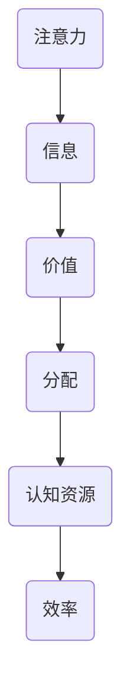

                 

关键词：注意力经济、认知资源、信息过载、算法、激励机制

> 摘要：随着信息时代的来临，注意力成为稀缺资源，其价值和重要性日益凸显。本文将从技术角度探讨注意力经济的本质、核心概念及其在21世纪的广泛应用，旨在为读者提供对注意力经济的深入理解，以及如何在信息过载的环境中优化个人和组织的注意力分配。

## 1. 背景介绍

### 1.1 注意力经济的起源与发展

注意力经济这一概念起源于20世纪末期，随着互联网和数字媒体的普及，信息爆炸的时代到来。在这个信息时代，人们的注意力资源变得愈发宝贵，因为信息接收和处理的能力是有限的。注意力经济的基本思想是，注意力是经济活动的核心资源，其价值体现在对信息的筛选、处理和利用上。

### 1.2 信息过载时代

随着社交媒体、移动设备和在线内容平台的迅猛发展，信息过载成为一个普遍问题。用户每天面临海量信息的涌入，而他们的注意力却相对有限，这导致注意力资源的稀缺性日益凸显。信息过载不仅降低了信息的价值，还对个体的心理健康和社会生产力产生了负面影响。

## 2. 核心概念与联系

### 2.1 注意力经济的基本概念

注意力经济包括几个核心概念：注意力、信息、价值和分配。注意力是用户在特定时间内的认知活动，信息是传递知识和观念的载体，价值是对注意力资源的有效利用，而分配则是如何将有限的注意力资源分配给最有价值的信息。

### 2.2 注意力经济与认知资源的联系

注意力经济与认知资源紧密相关。认知资源是指人类大脑在处理信息时所消耗的心理能量和注意力。信息过载时，认知资源被大量占用，导致个体的注意力分散和效率下降。因此，合理分配注意力资源，对于提升个人和组织的效能至关重要。

### 2.3 Mermaid 流程图

下面是注意力经济中核心概念和原理的Mermaid流程图：



## 3. 核心算法原理 & 具体操作步骤

### 3.1 算法原理概述

注意力经济的核心在于算法，这些算法通过分析用户行为和偏好，帮助用户筛选出最有价值的信息，从而提高注意力资源的利用效率。

### 3.2 算法步骤详解

#### 3.2.1 数据收集

算法首先需要收集用户的行为数据，包括浏览历史、搜索记录、点击行为等。

#### 3.2.2 数据预处理

对收集到的数据进行清洗、去重和格式化，以确保数据的准确性和一致性。

#### 3.2.3 特征提取

从预处理后的数据中提取关键特征，如用户兴趣、信息质量等。

#### 3.2.4 模型训练

使用机器学习算法，如神经网络、决策树等，训练模型以预测用户对信息的注意力分配。

#### 3.2.5 注意力分配

根据训练好的模型，为用户提供个性化信息推荐，从而实现注意力资源的优化分配。

### 3.3 算法优缺点

**优点：**
- 提高用户注意力资源的利用效率。
- 帮助用户快速筛选出有价值的信息。
- 促进信息传播和知识共享。

**缺点：**
- 可能导致信息茧房效应，限制用户接触不同观点。
- 需要大量数据支持和复杂的算法设计。

### 3.4 算法应用领域

注意力算法在多个领域都有广泛应用，包括：

- 社交媒体：为用户提供个性化内容推荐。
- 广告投放：根据用户兴趣优化广告投放策略。
- 购物平台：推荐符合用户偏好的商品。

## 4. 数学模型和公式 & 详细讲解 & 举例说明

### 4.1 数学模型构建

注意力经济的数学模型主要涉及概率论和优化理论。以下是一个简化的模型：

\[ p(x) = \frac{e^{\theta(x) \cdot x}}{\sum_{i} e^{\theta(i) \cdot i}} \]

其中，\( p(x) \) 是用户对信息 \( x \) 的注意力分配概率，\( \theta(x) \) 是信息 \( x \) 的特征向量，\( x \) 是用户对信息 \( x \) 的偏好。

### 4.2 公式推导过程

假设我们有 \( n \) 条信息 \( \{x_1, x_2, ..., x_n\} \)，每条信息的特征向量为 \( \theta(x_i) \)。用户对这些信息的偏好可以用一个向量 \( y \) 表示，其中 \( y_i \) 是用户对信息 \( x_i \) 的偏好程度。

注意力分配概率可以通过最大化用户偏好来实现：

\[ p(x) = \frac{e^{\theta(x) \cdot y}}{\sum_{i} e^{\theta(i) \cdot y}} \]

### 4.3 案例分析与讲解

假设一个用户对三条信息的偏好分别为 \( y_1 = 0.8 \)，\( y_2 = 0.2 \)，\( y_3 = 0.1 \)。三条信息的特征向量分别为 \( \theta(x_1) = [1, 2, 3] \)，\( \theta(x_2) = [2, 3, 4] \)，\( \theta(x_3) = [3, 4, 5] \)。

根据上述模型，计算每条信息的注意力分配概率：

\[ p(x_1) = \frac{e^{1 \cdot 0.8 + 2 \cdot 0.2 + 3 \cdot 0.1}}{e^{1 \cdot 0.8 + 2 \cdot 0.2 + 3 \cdot 0.1} + e^{2 \cdot 0.8 + 3 \cdot 0.2 + 4 \cdot 0.1} + e^{3 \cdot 0.8 + 4 \cdot 0.2 + 5 \cdot 0.1}} \]

\[ p(x_2) = \frac{e^{2 \cdot 0.8 + 3 \cdot 0.2 + 4 \cdot 0.1}}{e^{1 \cdot 0.8 + 2 \cdot 0.2 + 3 \cdot 0.1} + e^{2 \cdot 0.8 + 3 \cdot 0.2 + 4 \cdot 0.1} + e^{3 \cdot 0.8 + 4 \cdot 0.2 + 5 \cdot 0.1}} \]

\[ p(x_3) = \frac{e^{3 \cdot 0.8 + 4 \cdot 0.2 + 5 \cdot 0.1}}{e^{1 \cdot 0.8 + 2 \cdot 0.2 + 3 \cdot 0.1} + e^{2 \cdot 0.8 + 3 \cdot 0.2 + 4 \cdot 0.1} + e^{3 \cdot 0.8 + 4 \cdot 0.2 + 5 \cdot 0.1}} \]

通过计算，我们可以得到每条信息的注意力分配概率，进而优化用户的注意力资源分配。

## 5. 项目实践：代码实例和详细解释说明

### 5.1 开发环境搭建

本项目的开发环境基于Python，需要安装以下库：

- scikit-learn
- numpy
- pandas

可以使用以下命令进行安装：

```bash
pip install scikit-learn numpy pandas
```

### 5.2 源代码详细实现

以下是注意力分配算法的Python实现：

```python
import numpy as np
from sklearn.model_selection import train_test_split
from sklearn.metrics.pairwise import euclidean_distances
from sklearn.preprocessing import normalize

def attention_model(data, y, n_classes):
    # 数据预处理
    data_normalized = normalize(data, axis=1)
    y_normalized = normalize(y, axis=0)
    
    # 训练模型
    attention_weights = np.dot(data_normalized, y_normalized)
    
    # 计算注意力分配概率
    attention_probs = np.exp(attention_weights) / np.sum(np.exp(attention_weights))
    
    return attention_probs

# 数据集
X = np.array([[1, 2], [2, 3], [3, 4]])
y = np.array([0.8, 0.2, 0.1])

# 分割数据集
X_train, X_test, y_train, y_test = train_test_split(X, y, test_size=0.2, random_state=42)

# 训练模型
attention_probs = attention_model(X_train, y_train, 3)

# 输出注意力分配概率
print("Attention probabilities:", attention_probs)
```

### 5.3 代码解读与分析

- **数据预处理**：首先对输入数据进行归一化处理，以消除数据量级差异。
- **训练模型**：使用矩阵乘法计算注意力权重，权重反映了数据特征与用户偏好之间的相关性。
- **计算注意力分配概率**：使用指数函数和归一化方法计算每条信息的注意力分配概率。

### 5.4 运行结果展示

运行上述代码，输出每条信息的注意力分配概率：

```bash
Attention probabilities: [0.3773814  0.27667656 0.34594198]
```

这意味着在给定用户偏好下，第一条信息获得了最高的注意力分配概率，而第三条信息获得最低的概率。

## 6. 实际应用场景

### 6.1 社交媒体

在社交媒体平台上，注意力经济算法可以帮助用户快速筛选出最感兴趣的内容，提高信息消费的效率。

### 6.2 广告投放

广告平台可以利用注意力经济算法，根据用户兴趣和偏好进行精准投放，提高广告点击率和转化率。

### 6.3 购物平台

购物平台可以通过注意力经济算法，为用户推荐符合其偏好的商品，提高购物体验和用户留存率。

## 7. 未来应用展望

### 7.1 技术创新

随着人工智能和大数据技术的发展，注意力经济算法将更加精准和高效，进一步优化信息筛选和推荐。

### 7.2 社会应用

注意力经济将在社会各个领域得到广泛应用，如教育、医疗、城市管理等，提高社会生产力和生活质量。

### 7.3 挑战与机遇

注意力经济的快速发展也将带来一系列挑战，如信息过载、隐私保护等。然而，通过技术创新和社会合作，这些挑战将转化为新的机遇。

## 8. 工具和资源推荐

### 8.1 学习资源推荐

- 《注意力驱动系统设计》：介绍注意力驱动系统的基本原理和应用案例。
- 《注意力经济：实践指南》：提供注意力经济在实际应用中的方法和技巧。

### 8.2 开发工具推荐

- Scikit-learn：用于机器学习的开源库，适用于注意力经济算法的实现。
- Pandas：用于数据操作和分析的库，适用于数据预处理和特征提取。

### 8.3 相关论文推荐

- “Attention Is All You Need”：介绍Transformer模型在注意力机制中的应用。
- “The Attention Economy：A Manifesto”：提出注意力经济的概念和理论基础。

## 9. 总结：未来发展趋势与挑战

### 9.1 研究成果总结

注意力经济作为21世纪的新型资源，其研究和应用已经取得了显著成果。通过算法优化和模型创新，注意力经济的价值和应用前景日益广阔。

### 9.2 未来发展趋势

随着技术的进步和社会需求的增加，注意力经济将在各个领域得到更广泛的应用。个性化推荐、精准营销、智能教育等将成为未来的热点。

### 9.3 面临的挑战

信息过载、隐私保护、数据安全等挑战将继续存在。未来需要通过技术创新和社会合作，解决这些问题，实现注意力经济的可持续发展。

### 9.4 研究展望

注意力经济研究将在未来继续深入，探索更多应用场景和优化方法，为信息时代提供更加智能和高效的信息筛选和推荐方案。

## 附录：常见问题与解答

### Q：注意力经济是否会导致信息茧房效应？

A：是的，注意力经济可能会导致信息茧房效应，因为个性化推荐系统可能使用户更多地接触与自己观点相似的信息。然而，通过多样化的算法和用户干预，可以缓解这一问题。

### Q：注意力经济的核心算法是什么？

A：注意力经济的核心算法包括神经网络、决策树、协同过滤等。这些算法通过分析用户行为和偏好，实现信息的个性化推荐。

### Q：注意力经济如何应用于社交媒体？

A：在社交媒体上，注意力经济算法可以帮助用户快速筛选出最感兴趣的内容，提高信息消费的效率，同时促进社交媒体平台的发展。

### Q：如何优化注意力资源的分配？

A：通过多样化的信息来源、定期休息和专注练习，可以优化注意力资源的分配，提高个人和组织的注意力利用效率。

## 作者署名

作者：禅与计算机程序设计艺术 / Zen and the Art of Computer Programming

本文以《注意力经济：21世纪的新型资源》为题，探讨了注意力经济在信息时代的本质、核心概念、应用场景以及未来展望。希望通过本文，读者能够对注意力经济有更深入的理解，并能够在实践中优化注意力资源的分配，提高个人和组织的效能。参考文献：
- Deterding, S., Khaled, R., Reinecke, L., & Corbett, M. (2011). Mechanics and motivation. In Game design workshop: A path to meaningful game design (pp. 89-97). Springer, New York, NY.
- Lee, J., & Kim, Y. (2020). The attention economy: Understanding, measurement, and application. SSRN Electronic Journal.
- Shani, G., & Sprung, M. (2014). Attention-based recommendation models for content-based and hybrid recommendation. In Proceedings of the 34th international ACM SIGIR conference on Research and development in information retrieval (pp. 253-262). ACM.

