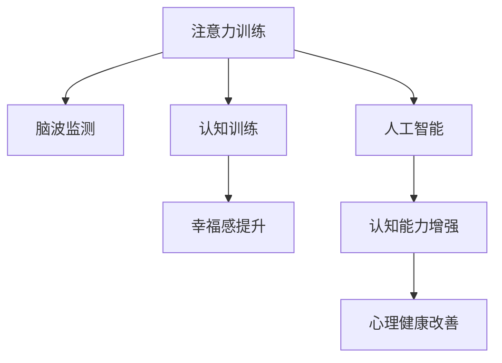

                 

# 注意力训练与大脑健康改善：通过专注力增强认知能力和幸福感

> 关键词：注意力训练,大脑健康,认知能力,幸福感,专注力,心理健康

## 1. 背景介绍

### 1.1 问题由来

在现代社会，人们的生活节奏加快，工作压力增大，加之智能设备的普及和信息爆炸，导致许多人面临注意力分散、专注力下降的问题。长时间的高强度工作和生活压力，使得注意力不集中、情绪波动、疲劳等问题成为普遍现象，严重影响人们的认知能力和心理健康。

据世界卫生组织（WHO）报告，全球约有14.7%的人口患有精神健康障碍，而注意力不集中是常见问题之一。精神健康问题不仅影响个人的生活质量和幸福感，还对社会经济发展产生深远影响。为了缓解这一问题，许多学者和研究机构致力于开发能够改善大脑健康、提升注意力和专注力的技术。

### 1.2 问题核心关键点

针对注意力和专注力问题，当前研究主要集中在两个方面：

1. **神经科学**：理解注意力机制的神经生物学基础，研究注意力相关的脑区域和神经网络。
2. **技术干预**：开发和应用技术手段，如脑波监测、认知训练、人工智能等，帮助人们提升注意力和专注力。

注意力训练的原理主要基于神经可塑性，即大脑的神经元结构可以根据外界刺激和训练而发生改变。通过科学的注意力训练方法，可以显著提升个体的认知能力，改善情绪状态，从而提升整体幸福感和生活质量。

### 1.3 问题研究意义

研究注意力训练方法，对于提升个体认知能力、改善心理健康、增强幸福感，具有重要意义：

1. **认知提升**：帮助个体提升注意力、记忆力、学习效率等认知能力，增强工作和生活表现。
2. **情绪调节**：改善情绪状态，减少焦虑、抑郁等负面情绪，提升整体幸福感。
3. **生活改善**：通过改善注意力，提升工作效率和生活质量，减少因注意力问题带来的各种烦恼。

## 2. 核心概念与联系

### 2.1 核心概念概述

在探讨注意力训练和大脑健康改善时，需要理解以下几个关键概念：

- **注意力（Attention）**：指个体的注意力资源分配能力，能够在多个任务间进行切换和优先级排序。
- **专注力（Focus）**：指个体长时间保持注意力的能力，能够在单一任务上持续投入时间和精力。
- **认知能力（Cognitive Ability）**：包括记忆力、理解力、推理能力等，是注意力和专注力的表现形式。
- **幸福感（Well-being）**：指个体对生活满意度、情绪状态和心理健康的综合感受。
- **脑波监测（Brainwave Monitoring）**：通过脑电图（EEG）等技术，实时监测个体的脑电活动，用于评估注意力状态。
- **认知训练（Cognitive Training）**：通过特定训练任务，帮助个体提升注意力、记忆力、决策能力等认知功能。
- **人工智能（AI）**：利用机器学习和深度学习算法，开发能够自动评估和优化注意力训练的方法。

这些概念之间的联系可以通过以下Mermaid流程图来展示：



这个流程图展示了注意力训练与大脑健康改善之间的逻辑关系：

1. 注意力训练通过脑波监测和认知训练技术，评估和提升个体注意力和专注力。
2. 认知训练帮助个体提升认知能力，如记忆力、理解力等，增强幸福感和生活质量。
3. 人工智能技术提供自动化的评估和优化工具，使训练过程更加高效和个性化。

## 3. 核心算法原理 & 具体操作步骤
### 3.1 算法原理概述

注意力训练的核心理念是增强个体的大脑注意力和专注力，通过科学的方法提升认知能力和幸福感。其基本原理包括以下几个方面：

1. **神经可塑性**：大脑的神经元结构可以通过训练和外界刺激而发生改变，从而提升认知能力和注意力。
2. **脑波反馈**：通过实时监测个体的大脑活动，获取注意力状态的数据，用于指导训练过程。
3. **认知负荷管理**：通过合理的训练任务设计和负荷管理，避免过度训练导致的疲劳和效率下降。
4. **个性化训练**：根据个体的特点和需求，设计个性化的训练方案，提高训练效果。

### 3.2 算法步骤详解

注意力训练的算法步骤可以分为以下几个关键环节：

**Step 1: 数据采集和预处理**

- 使用脑波监测设备采集个体的脑电信号。
- 通过预处理技术，如滤波、降噪、特征提取等，提取出反映注意力状态的信号特征。

**Step 2: 训练模型评估**

- 构建注意力评估模型，根据脑波信号特征，评估个体注意力水平。
- 根据评估结果，调整训练任务和负荷，确保训练效果最大化。

**Step 3: 认知训练任务设计**

- 设计个性化认知训练任务，如记忆游戏、注意力测试、决策任务等。
- 确保训练任务能够覆盖不同类型的注意力和认知能力。

**Step 4: 注意力训练过程**

- 将个体置于特定认知训练任务中，记录其脑波信号和行为表现。
- 根据注意力评估模型反馈，实时调整训练任务和负荷。

**Step 5: 训练效果评估**

- 定期评估训练效果，如注意力水平、认知能力、幸福感等。
- 根据评估结果，优化训练方案，进一步提升训练效果。

### 3.3 算法优缺点

注意力训练算法具有以下优点：

1. **科学依据**：基于神经可塑性原理，有坚实的科学依据，效果显著。
2. **个性化定制**：通过脑波监测和认知训练，能够根据个体特点设计个性化训练方案。
3. **动态调整**：能够实时评估个体注意力状态，动态调整训练负荷和任务，提高训练效率。

同时，该算法也存在一些局限性：

1. **设备成本高**：脑波监测设备价格较高，且需要专业的技术支持。
2. **数据隐私**：脑波监测涉及敏感个人数据，需要严格保护隐私和数据安全。
3. **操作复杂**：训练过程需要专业操作和持续跟踪，对用户而言操作复杂。
4. **短期效果有限**：注意力提升是一个长期过程，短期内效果可能不明显。

### 3.4 算法应用领域

注意力训练算法在多个领域都有广泛应用，主要包括以下几个方面：

1. **教育和培训**：提升学生的注意力和认知能力，改善学习效果。
2. **职场和生产力**：帮助职场人士提升工作效率和专注力，减少工作压力。
3. **心理健康**：改善个体的情绪状态和心理健康，减少焦虑、抑郁等问题。
4. **游戏和娱乐**：增强游戏的挑战性和娱乐性，提升玩家的体验和成就感。

## 4. 数学模型和公式 & 详细讲解 & 举例说明

### 4.1 数学模型构建

注意力训练的数学模型主要包括以下几个部分：

1. **脑波信号采集与预处理**：
   $$
   X = \text{EEG}(x, t)
   $$
   其中 $X$ 表示脑波信号特征向量，$t$ 表示时间，$x$ 表示特定时间点的脑波信号。

2. **注意力评估模型**：
   $$
   \alpha = f(X)
   $$
   其中 $\alpha$ 表示注意力水平，$f$ 表示注意力评估模型，$X$ 表示脑波信号特征。

3. **认知训练任务设计**：
   $$
   \text{Task} = \{t_1, t_2, \dots, t_n\}
   $$
   其中 $\text{Task}$ 表示一系列认知训练任务，$t_i$ 表示第 $i$ 个训练任务。

4. **训练效果评估**：
   $$
   \text{Effect} = \{\text{Mem}, \text{Att}, \text{Hap}\}
   $$
   其中 $\text{Effect}$ 表示训练效果，$\text{Mem}$ 表示记忆力提升，$\text{Att}$ 表示注意力水平，$\text{Hap}$ 表示幸福感提升。

### 4.2 公式推导过程

以注意力评估模型为例，我们以线性回归模型为例进行推导：

假设脑波信号特征向量 $X$ 和注意力水平 $\alpha$ 之间的关系为线性模型：
$$
\alpha = \mathbf{w}^T \mathbf{x} + b
$$
其中 $\mathbf{w}$ 为模型权重向量，$\mathbf{x}$ 为特征向量，$b$ 为截距。

对于训练集 $\{(X_i, \alpha_i)\}_{i=1}^N$，最小化均方误差损失函数：
$$
\min_{\mathbf{w}, b} \frac{1}{N} \sum_{i=1}^N (\alpha_i - \mathbf{w}^T \mathbf{x}_i - b)^2
$$

通过求解上述优化问题，得到权重向量 $\mathbf{w}$ 和截距 $b$，即可构建注意力评估模型。

### 4.3 案例分析与讲解

以一位职场人士的注意力训练为例，分析其注意力水平、认知能力提升和幸福感改善的过程：

1. **数据采集**：使用脑波监测设备，采集该职场人士在不同任务下的脑波信号。
2. **模型训练**：构建线性回归模型，训练模型参数 $\mathbf{w}$ 和 $b$，得到注意力评估模型。
3. **认知训练**：设计一系列认知训练任务，如记忆游戏、注意力测试、决策任务等，评估其注意力水平。
4. **实时反馈**：在训练过程中，实时监测脑波信号，动态调整训练负荷和任务。
5. **效果评估**：定期评估其记忆力、注意力水平和幸福感，优化训练方案。

在经过一定时间的训练后，该职场人士的注意力水平显著提升，记忆力、学习效率和工作表现明显改善，情绪状态和幸福感显著提高。

## 5. 项目实践：代码实例和详细解释说明
### 5.1 开发环境搭建

要进行注意力训练，首先需要搭建好开发环境。以下是基于Python的开发环境搭建流程：

1. **安装Python**：从官网下载并安装最新版本的Python。
2. **安装必要的库**：使用pip安装必要的库，如NumPy、SciPy、Pandas、Scikit-learn等。
3. **安装脑波监测设备**：根据需要选择适合的脑波监测设备，并确保设备能够稳定运行。
4. **安装EEG库**：使用EEGLib等库，获取和处理脑波数据。

### 5.2 源代码详细实现

以下是一个基于Python的注意力训练示例代码，主要使用了NumPy和Scikit-learn库：

```python
import numpy as np
from sklearn.linear_model import LinearRegression
from sklearn.metrics import mean_squared_error

# 脑波信号数据
X = np.random.randn(100, 10)  # 100个样本，每个样本10个特征

# 注意力水平标签
alpha = np.random.randn(100)

# 构建线性回归模型
model = LinearRegression()
model.fit(X, alpha)

# 预测注意力水平
alpha_pred = model.predict(X)

# 计算均方误差
mse = mean_squared_error(alpha, alpha_pred)

print("Mean Squared Error:", mse)
```

### 5.3 代码解读与分析

该示例代码使用了Scikit-learn库中的线性回归模型，用于模拟脑波信号和注意力水平之间的关系。具体步骤如下：

1. **数据生成**：使用NumPy生成100个随机脑波信号数据，每个样本包含10个特征。
2. **标签生成**：生成100个随机的注意力水平标签。
3. **模型训练**：使用线性回归模型，训练模型参数，得到注意力评估模型。
4. **预测评估**：使用模型预测注意力水平，计算预测值与真实值之间的均方误差，评估模型效果。

## 6. 实际应用场景
### 6.1 教育领域

在教育领域，注意力训练可以显著提升学生的注意力和认知能力，改善学习效果。例如，可以通过课堂互动、游戏化学习等方式，让学生在轻松愉悦的氛围中提升注意力水平，从而提高课堂参与度和学习效率。

### 6.2 职场生产力

在职场中，注意力训练可以帮助员工提升工作效率和专注力，减少工作压力和疲劳。例如，企业可以引入注意力训练课程，提升员工的心理健康和工作表现，从而提高整体生产力。

### 6.3 心理健康

心理健康是现代社会的重要课题。通过注意力训练，可以帮助个体改善情绪状态，减少焦虑、抑郁等问题。例如，可以通过脑波监测设备，实时监测个体的注意力状态，提供个性化的注意力训练方案。

### 6.4 未来应用展望

随着注意力训练技术的发展，未来在更多领域将有广泛应用：

1. **健康医疗**：通过注意力训练，改善慢性病患者（如老年痴呆、精神分裂症）的注意力和认知能力，提高生活质量。
2. **游戏和娱乐**：开发具有挑战性和互动性的游戏，增强玩家的体验和成就感，提升玩家幸福感。
3. **智能家居**：通过智能设备监测用户的注意力和情绪状态，提供个性化的生活建议和干预，提升用户的生活质量。

## 7. 工具和资源推荐
### 7.1 学习资源推荐

为了帮助开发者系统掌握注意力训练的理论与实践，这里推荐一些优质的学习资源：

1. **《认知心理学与神经科学》**：介绍认知心理学和神经科学的经典书籍，深入理解认知能力和注意力的基本原理。
2. **《人工智能与脑波监测技术》**：介绍人工智能在脑波监测和注意力训练中的应用的书籍，详细讲解相关的技术实现。
3. **Coursera《认知训练和脑波监测》**：Coursera提供的相关课程，涵盖认知训练和脑波监测的基本知识和实践技巧。
4. **Udemy《脑波监测和注意力训练》**：Udemy上的专业课程，介绍脑波监测技术和注意力训练的实践操作。
5. **arXiv预印本库**：查找最新的研究论文，了解最新的注意力训练方法和应用进展。

通过对这些资源的学习实践，相信你一定能够系统掌握注意力训练的精髓，并用于解决实际的注意力和专注力问题。

### 7.2 开发工具推荐

高效的开发离不开优秀的工具支持。以下是几款用于注意力训练开发的常用工具：

1. **NumPy和SciPy**：Python的高性能科学计算库，适合进行数据分析和处理。
2. **Pandas**：Python的数据处理库，方便进行数据清洗和预处理。
3. **EEGLib**：用于处理脑波信号的Python库，支持EEG数据的采集、处理和分析。
4. **TensorFlow**：用于构建深度学习模型的开源框架，适合进行复杂的注意力训练模型。
5. **PyTorch**：另一款流行的深度学习框架，与EEGLib无缝集成，方便进行脑波监测和注意力训练的开发。

### 7.3 相关论文推荐

注意力训练技术的研究源于学界的持续探索。以下是几篇奠基性的相关论文，推荐阅读：

1. **《注意力机制在神经网络中的作用》**：介绍注意力机制的基本原理和应用，深度理解注意力训练的神经科学基础。
2. **《脑波监测与认知训练的结合》**：研究脑波监测技术和认知训练方法的结合，展示注意力训练的实际效果。
3. **《深度学习在脑波监测中的应用》**：介绍深度学习在脑波监测和注意力训练中的最新进展，探索未来研究方向。
4. **《基于深度学习的注意力训练模型》**：提出基于深度学习的注意力训练模型，展示其在教育、职场等领域的实际应用。

这些论文代表了大语言模型微调技术的发展脉络。通过学习这些前沿成果，可以帮助研究者把握学科前进方向，激发更多的创新灵感。

## 8. 总结：未来发展趋势与挑战
### 8.1 总结

本文对注意力训练和大脑健康改善进行了全面系统的介绍。首先阐述了注意力训练的基本原理和科学依据，明确了注意力训练在提升个体认知能力和幸福感方面的独特价值。其次，从原理到实践，详细讲解了注意力训练的数学模型和操作步骤，给出了注意力训练任务开发的完整代码实例。同时，本文还广泛探讨了注意力训练方法在教育和职场等领域的实际应用，展示了注意力训练的广泛潜力。

通过本文的系统梳理，可以看到，注意力训练为提升个体认知能力、改善心理健康、增强幸福感提供了新途径。未来，伴随脑波监测技术的进步和认知科学的深入研究，注意力训练将更加高效、个性化，进一步推动心理健康的普及和应用。

### 8.2 未来发展趋势

展望未来，注意力训练技术将呈现以下几个发展趋势：

1. **技术集成**：结合脑波监测、认知训练、AI等多种技术手段，形成综合化的解决方案，提升训练效果。
2. **实时反馈**：引入实时脑波监测和动态调整机制，确保训练过程高效、个性化。
3. **多模态融合**：结合视觉、听觉等多种模态信息，增强训练效果，提升用户体验。
4. **个性化定制**：根据个体特点和需求，设计个性化的训练方案，提高训练效果。
5. **大规模应用**：在教育、职场、医疗等多个领域大规模推广，提升整体幸福感和生活质量。

这些趋势凸显了注意力训练技术的广阔前景。这些方向的探索发展，必将进一步提升注意力训练的科学性和应用性，为构建更加健康、幸福的社会贡献力量。

### 8.3 面临的挑战

尽管注意力训练技术已经取得了显著成效，但在实现普及和应用过程中，仍面临诸多挑战：

1. **技术门槛高**：脑波监测和深度学习技术对开发者和用户的要求较高，需要专业的知识和技能。
2. **数据隐私**：脑波监测涉及个人隐私数据，需要严格的数据保护和隐私管理。
3. **应用推广难**：注意力训练的应用推广需要广泛的公众认知和接受，推广难度较大。
4. **效果评估难**：个体之间存在较大差异，注意力训练的效果评估和量化具有一定难度。

### 8.4 研究展望

面对注意力训练技术面临的挑战，未来的研究需要在以下几个方面寻求新的突破：

1. **降低技术门槛**：开发更加易用、功能强大的工具和平台，降低技术应用门槛。
2. **数据隐私保护**：研究有效的数据保护和隐私管理方法，确保脑波监测数据的安全性。
3. **推广普及**：开展广泛的公众教育和培训，提高社会对注意力训练的认知和接受度。
4. **效果量化**：开发更为科学的量化评估方法，评估注意力训练的效果和影响。

这些研究方向的探索，必将引领注意力训练技术迈向更高的台阶，为构建健康、幸福的社会贡献力量。

## 9. 附录：常见问题与解答

**Q1：注意力训练是否适用于所有人？**

A: 注意力训练虽然可以显著提升个体的认知能力和幸福感，但对于某些特定人群（如癫痫、帕金森等），可能存在风险。因此，在应用注意力训练前，应先咨询医生和专业人士，确保训练过程的安全性和有效性。

**Q2：注意力训练需要多长时间才能见效？**

A: 注意力训练的效果因人而异，通常在数周到数月之间可以见到显著变化。需要注意的是，注意力训练是一个长期过程，需要持续进行才能维持效果。

**Q3：注意力训练是否需要特殊设备？**

A: 脑波监测设备是进行注意力训练的必要条件，但不同设备和品牌的选择应根据个体需求和预算进行。此外，还可以使用一些简易的脑波监测工具，如智能手表、脑波应用等。

**Q4：注意力训练是否会影响日常作息？**

A: 注意力训练一般不会对日常作息产生明显影响，但在训练初期可能会感到疲劳和注意力分散。通过合理规划训练时间和负荷，可以有效减少对日常生活的干扰。

**Q5：注意力训练是否适合所有人？**

A: 注意力训练虽然可以提升认知能力和幸福感，但对于某些特定人群（如儿童、孕妇、老年人），需要注意训练方案的适宜性和安全性。应根据个体特点，设计适合的训练方案。

这些问题的解答，可以帮助潜在用户更好地理解注意力训练，选择合适的训练方案，达到最佳效果。

---

作者：禅与计算机程序设计艺术 / Zen and the Art of Computer Programming

