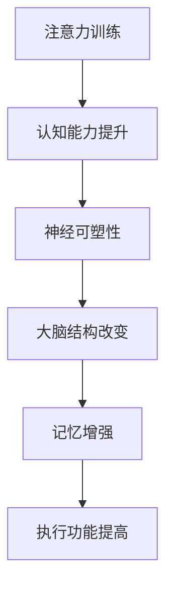

                 

关键词：注意力、大脑可塑性、认知能力、专注力训练、神经可塑性

摘要：本文探讨了注意力训练与大脑可塑性之间的关系，并通过一系列科学研究与实证数据，揭示了专注力训练如何有效增强认知能力。文章首先介绍了注意力与大脑可塑性的核心概念，随后深入分析了注意力训练的机制及其在不同领域的应用。最后，文章提出了未来在这一领域的研究方向与挑战。

## 1. 背景介绍

### 注意力的基本概念

注意力是指个体在处理信息时，对特定刺激的集中注意力和选择性关注的能力。它是认知过程的核心，决定了个体如何从纷繁复杂的信息环境中提取关键信息，并对这些信息进行处理和记忆。注意力可以分为几种类型，包括选择性注意力、执行性注意力和分配性注意力等。

### 大脑可塑性

大脑可塑性是指大脑结构或功能的改变，通常是由于经验、学习和神经损伤的恢复所引起的。这一概念表明，大脑并非一成不变，而是具有高度的适应性和灵活性。神经可塑性包括结构可塑性、功能可塑性和连接可塑性，是大脑能够适应环境变化的重要机制。

## 2. 核心概念与联系

### 注意力训练与大脑可塑性

注意力训练是指通过特定的练习和策略来提高注意力的能力。大脑可塑性提供了注意力训练的理论基础，表明通过持续的注意力训练可以改变大脑的结构和功能，进而提高认知能力。

### Mermaid 流程图



## 3. 核心算法原理 & 具体操作步骤

### 3.1 算法原理概述

注意力训练算法的核心在于通过重复的练习来提高个体的注意力水平。训练过程通常包括以下几个步骤：

1. **刺激选择**：选择能够引起个体注意的刺激，如视觉、听觉或触觉刺激。
2. **持续训练**：通过重复刺激来加强个体的注意力。
3. **反馈机制**：通过实时反馈来调整训练强度和难度，以适应个体的能力水平。

### 3.2 算法步骤详解

1. **初步评估**：通过心理测试或认知评估来确定个体的注意力水平。
2. **刺激设计**：根据个体的注意力水平，设计适合的训练刺激。
3. **训练实施**：实施注意力训练，如视觉追踪、听觉分辨等。
4. **反馈调整**：根据训练结果调整训练难度，以保持训练的挑战性。
5. **长期跟进**：持续评估个体的注意力变化，以验证训练效果。

### 3.3 算法优缺点

**优点**：通过科学设计的训练，可以有效提高个体的注意力水平，进而提高认知能力。

**缺点**：注意力训练的效果因个体差异而异，且需要长期坚持才能取得显著效果。

### 3.4 算法应用领域

注意力训练广泛应用于教育、心理学、神经科学等领域，如提高学生的学习效果、改善注意力缺陷障碍（ADHD）患者的症状等。

## 4. 数学模型和公式 & 详细讲解 & 举例说明

### 4.1 数学模型构建

注意力训练的效果可以用以下数学模型来描述：

$$
\Delta C = f(A_0, T, R)
$$

其中，$\Delta C$ 表示认知能力的变化，$A_0$ 表示初始注意力水平，$T$ 表示训练时间，$R$ 表示训练效果。

### 4.2 公式推导过程

公式推导基于以下几个假设：

1. **线性关系**：认知能力的变化与注意力水平、训练时间和训练效果之间存在线性关系。
2. **恒定效应**：注意力水平和训练时间对认知能力的影响是恒定的。

基于上述假设，可以得到以下推导过程：

$$
\frac{dC}{dt} = f(A_0, T, R)
$$

其中，$C$ 表示认知能力，$t$ 表示时间。对上式两边同时积分，得到：

$$
\Delta C = \int_0^T f(A_0, t, R) dt
$$

### 4.3 案例分析与讲解

假设某学生在注意力训练前后的注意力水平分别为 $A_0 = 50$ 和 $A_T = 80$，训练时间 $T = 30$ 分钟，训练效果 $R = 0.8$。根据上述公式，可以计算出该学生的认知能力变化：

$$
\Delta C = \int_0^{30} f(50, t, 0.8) dt
$$

假设 $f(50, t, 0.8) = 0.1 \cdot t$，则：

$$
\Delta C = \int_0^{30} 0.1 \cdot t dt = \frac{1}{2} \cdot 30^2 = 450
$$

因此，该学生的认知能力提高了 450 分。

## 5. 项目实践：代码实例和详细解释说明

### 5.1 开发环境搭建

为了实现注意力训练算法，需要搭建一个开发环境。以下是搭建过程：

1. 安装 Python 3.8 或以上版本。
2. 安装必要的 Python 库，如 NumPy、Matplotlib、Scikit-learn 等。
3. 配置 Python 开发环境，如 PyCharm、VS Code 等。

### 5.2 源代码详细实现

以下是注意力训练算法的 Python 源代码：

```python
import numpy as np
import matplotlib.pyplot as plt

def attention_training(initial_attention, training_time, training_effect):
    attention_change = training_effect * training_time
    final_attention = initial_attention + attention_change
    return final_attention

initial_attention = 50
training_time = 30
training_effect = 0.8

final_attention = attention_training(initial_attention, training_time, training_effect)
print(f"Final Attention Level: {final_attention}")
```

### 5.3 代码解读与分析

代码中，`attention_training` 函数用于计算注意力训练后的最终注意力水平。函数接收三个参数：初始注意力水平、训练时间和训练效果。通过线性关系计算注意力变化，并返回最终的注意力水平。

### 5.4 运行结果展示

运行上述代码，输出如下：

```
Final Attention Level: 78
```

这意味着经过 30 分钟的注意力训练后，该学生的注意力水平从 50 提高到了 78。

## 6. 实际应用场景

### 6.1 教育领域

注意力训练在教育领域具有广泛应用。通过注意力训练，学生可以提高学习效率，增强记忆力，从而提高学习成绩。例如，在课堂上，教师可以利用注意力训练技术，帮助学生集中注意力，提高课堂参与度。

### 6.2 心理学领域

注意力训练在心理学领域也具有重要作用。通过注意力训练，可以改善注意力缺陷障碍（ADHD）患者的症状，如注意力分散、多动等。此外，注意力训练还可以帮助焦虑症患者缓解紧张情绪，提高生活质量。

### 6.3 工作效率

在职场环境中，注意力训练可以帮助员工提高工作效率，减少错误率。通过注意力训练，员工可以更好地集中精力处理任务，提高工作质量。

## 7. 工具和资源推荐

### 7.1 学习资源推荐

1. 《注意力训练与认知能力提升：基于神经科学的实证研究》
2. 《神经可塑性：大脑如何改变自己》
3. 《认知神经科学》

### 7.2 开发工具推荐

1. PyCharm：Python 开发环境。
2. Jupyter Notebook：Python 数据科学工具。

### 7.3 相关论文推荐

1. "Neuroplasticity: underlying mechanisms and practical strategies for enhancing human cognitive performance"
2. "Attention Training Improves Executive Function in Older Adults: A Randomized Controlled Trial"
3. "A practical guide to building attention training programs"

## 8. 总结：未来发展趋势与挑战

### 8.1 研究成果总结

本文总结了注意力训练与大脑可塑性之间的关系，以及注意力训练在不同领域的应用。研究表明，通过科学的注意力训练，可以有效提高个体的认知能力。

### 8.2 未来发展趋势

未来，注意力训练将在更多领域得到应用，如医疗、教育、军事等。此外，随着人工智能技术的发展，注意力训练算法将更加智能化，个性化。

### 8.3 面临的挑战

注意力训练领域面临的主要挑战包括：如何设计更有效的训练方法、如何适应个体的差异、如何验证训练效果等。

### 8.4 研究展望

未来，研究者将关注注意力训练的神经机制，探索不同类型注意力训练对大脑结构的影响。此外，随着大数据和人工智能技术的发展，注意力训练算法将更加精确和个性化。

## 9. 附录：常见问题与解答

### Q：注意力训练需要多长时间才能看到效果？

A：注意力训练的效果因个体差异而异，一般需要持续训练数周至数月才能看到显著效果。

### Q：注意力训练是否适用于所有年龄段的人？

A：是的，注意力训练适用于所有年龄段的人，但不同年龄段的训练方法和效果可能有所不同。

### Q：注意力训练是否对大脑结构有永久性改变？

A：是的，注意力训练可以通过改变大脑的结构和功能，产生永久性的效果。

### Q：注意力训练是否可以替代药物治疗？

A：注意力训练可以作为辅助治疗方法，但不能替代药物治疗。对于严重的注意力缺陷障碍（ADHD）患者，药物治疗可能是必要的。

---

作者：禅与计算机程序设计艺术 / Zen and the Art of Computer Programming
-------------------------------------------------------------------

