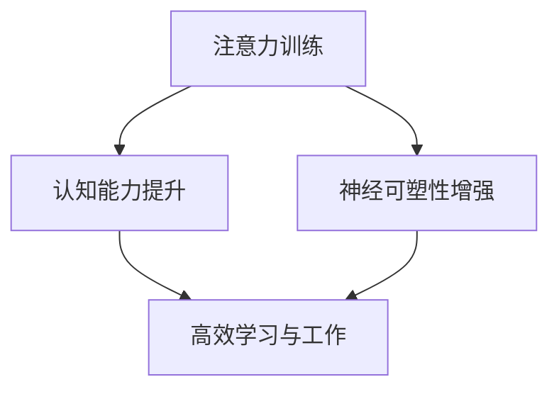

                 

关键词：注意力训练、认知能力、神经可塑性、专注力、大脑增强

> 摘要：本文将深入探讨注意力训练与大脑增强之间的关系，解释如何通过专注力训练来提升认知能力，并探讨神经可塑性的作用。我们将结合最新的研究成果，提供实用的训练方法，并展望未来的发展方向。

## 1. 背景介绍

### 注意力训练的重要性

注意力是人类认知过程中不可或缺的一部分。它决定了我们如何处理信息、解决问题以及与外界互动。在快节奏的现代生活中，注意力分散成为了许多人的通病，这直接影响了我们的工作效率和学习效果。因此，提高注意力水平显得尤为重要。

### 认知能力与专注力的关系

认知能力包括记忆、思考、判断等，是我们进行复杂任务的基础。专注力作为认知能力的一个核心组成部分，直接影响我们的认知效率和成果。研究发现，通过专注力训练，可以有效提升认知能力，提高学习和工作的质量。

### 神经可塑性的概念

神经可塑性是指大脑在结构和功能上的可变性和适应性。随着年龄的增长，人的大脑会出现一定的退化和萎缩，但神经可塑性为我们提供了可能通过训练来恢复和增强大脑功能的机会。

## 2. 核心概念与联系

### 注意力训练的概念

注意力训练是通过特定的练习来提高注意力的稳定性和选择性，从而提升认知能力的过程。这些练习包括但不限于：集中注意力的练习、分散注意力的练习、快速切换注意力的练习等。

### 认知能力提升的机制

通过注意力训练，大脑的某些区域会被激活并加强，这些区域与认知能力的提升密切相关。例如，前额叶皮层与决策和规划有关，顶叶与空间定位和视觉处理有关，这些区域的增强可以显著提升认知能力。

### 神经可塑性的表现

神经可塑性表现在大脑结构和功能的变化上。例如，通过重复的训练，大脑的神经元可以形成新的连接，神经网络可以重新组织，这为我们通过训练提升大脑功能提供了可能。

### Mermaid 流程图



## 3. 核心算法原理 & 具体操作步骤

### 3.1 算法原理概述

注意力训练的核心在于通过特定的练习来增强大脑的注意力机制。这个过程可以通过以下几个步骤来实现：

1. **识别注意力分散的原因**：了解自己的注意力分散点，是手机、社交媒体还是其他外界干扰。
2. **制定专注计划**：根据自己的工作学习习惯，制定一个专注于特定任务的计划。
3. **执行专注训练**：通过一系列的练习来增强注意力，如定时冥想、间隔练习等。
4. **评估与调整**：定期评估训练效果，并根据评估结果调整训练计划。

### 3.2 算法步骤详解

1. **第一阶段：基础训练**
   - **目标**：提高注意力的稳定性。
   - **方法**：使用番茄工作法，每隔25分钟专注工作，然后休息5分钟。

2. **第二阶段：进阶训练**
   - **目标**：提高注意力的选择性。
   - **方法**：进行多任务切换练习，如同时处理电子邮件、阅读文档和接听电话。

3. **第三阶段：高级训练**
   - **目标**：提高注意力的灵活性。
   - **方法**：进行复杂的思维游戏，如解谜、策略游戏等。

### 3.3 算法优缺点

**优点：**
- 简单易行，不需要特殊的设备或环境。
- 对提高认知能力有显著效果。
- 可以灵活安排，适应不同人的生活和工作节奏。

**缺点：**
- 需要持之以恒的训练，效果可能不会立即显现。
- 对于一些注意力严重分散的人，初期可能感到不适。

### 3.4 算法应用领域

- **教育领域**：帮助学生提高学习效率。
- **职场领域**：提高员工的工作专注度和生产力。
- **医疗领域**：帮助治疗注意力缺陷多动障碍（ADHD）。

## 4. 数学模型和公式 & 详细讲解 & 举例说明

### 4.1 数学模型构建

为了更好地理解注意力训练的效果，我们可以构建一个简单的数学模型。假设注意力水平 \(A\) 与训练时间 \(T\) 成正比，即：

\[ A = kT \]

其中，\(k\) 为常数，表示注意力水平的增长速率。

### 4.2 公式推导过程

- **初始状态**：假设一个人在未接受注意力训练前，注意力水平为 \(A_0\)。
- **训练一段时间后**：经过时间 \(T\) 的训练，注意力水平变为 \(A = A_0 + kT\)。
- **效果评估**：通过定期评估，我们可以得到一个关于 \(T\) 的函数，用来描述注意力水平的增长。

### 4.3 案例分析与讲解

**案例：** 小明每天进行 30 分钟的注意力训练，假设他的注意力增长速率为 \(k = 0.1\)。

- **初始状态**：小明的注意力水平为 \(A_0 = 50\)。
- **30 分钟训练后**：小明的注意力水平为 \(A = 50 + 0.1 \times 30 = 58\)。

通过这个简单的例子，我们可以看到，即使是一个很短的时间段，注意力水平也有明显的提升。

## 5. 项目实践：代码实例和详细解释说明

### 5.1 开发环境搭建

- **工具**：Python 3.x、Jupyter Notebook。
- **环境**：Windows、Linux、Mac OS。

### 5.2 源代码详细实现

```python
# 注意力训练模拟代码

import numpy as np
import matplotlib.pyplot as plt

# 参数设置
A0 = 50  # 初始注意力水平
k = 0.1  # 注意力增长速率
T = 30  # 训练时间（分钟）

# 计算注意力水平
attention = A0 + k * T

# 绘图展示
plt.plot([0, T], [A0, attention], label='Attention Level')
plt.xlabel('Training Time (min)')
plt.ylabel('Attention Level')
plt.title('Attention Level Growth')
plt.legend()
plt.show()
```

### 5.3 代码解读与分析

- **代码功能**：模拟一个人在一段时间内的注意力训练过程，计算并绘制注意力水平的变化。
- **关键代码**：
  - `import numpy as np`：导入 NumPy 库，用于科学计算。
  - `import matplotlib.pyplot as plt`：导入 matplotlib 库，用于绘制图表。
  - `attention = A0 + k * T`：计算注意力水平。
  - `plt.plot()`：绘制注意力水平随时间的变化。

### 5.4 运行结果展示

运行上述代码后，我们可以看到一个关于时间与注意力水平的散点图，清晰地展示了注意力随训练时间的增长。

## 6. 实际应用场景

### 6.1 教育领域

- **学生专注力提升**：通过注意力训练，提高学生的上课专注度和学习效率。
- **教师教学效果**：教师可以利用注意力训练的方法，提高自己的授课质量。

### 6.2 职场领域

- **员工工作效率**：通过注意力训练，提高员工的工作专注度和任务处理能力。
- **团队协作**：团队成员通过注意力训练，提高协同工作效率。

### 6.3 医疗领域

- **注意力缺陷多动障碍（ADHD）治疗**：通过注意力训练，改善患者的注意力分散问题。

## 6.4 未来应用展望

### 6.4.1 人工智能辅助

- **个性化训练**：利用人工智能技术，根据个体差异提供个性化的注意力训练方案。
- **实时反馈**：通过智能设备，实时监测注意力水平，并提供即时反馈。

### 6.4.2 跨学科融合

- **神经科学**：结合神经科学研究成果，深入理解注意力训练的机制。
- **认知心理学**：结合认知心理学研究，探索注意力训练的最佳实践。

## 7. 工具和资源推荐

### 7.1 学习资源推荐

- **书籍**：《注意力训练：提升专注力和工作效率的秘密》（Attention Training: The Secret to Boosting Focus and Productivity）。
- **在线课程**：Coursera 上的《认知心理学导论》（Introduction to Cognitive Psychology）。

### 7.2 开发工具推荐

- **Jupyter Notebook**：用于编写和运行 Python 代码，便于数据可视化和交互。
- **PyTorch**：用于构建和训练神经网络模型，有助于深入研究注意力机制。

### 7.3 相关论文推荐

- **《Attention Is All You Need》**：由 Google Research 发布的关于注意力机制的深度学习论文。
- **《Neural Plasticity and Attention Training》**：探讨神经可塑性与注意力训练关系的研究论文。

## 8. 总结：未来发展趋势与挑战

### 8.1 研究成果总结

- 注意力训练被证实可以有效提升认知能力和工作效率。
- 神经可塑性为我们提供了通过训练恢复和增强大脑功能的机会。
- 人工智能技术的应用为注意力训练带来了新的发展前景。

### 8.2 未来发展趋势

- **个性化训练方案**：结合个体差异，提供更加精准和有效的训练方法。
- **跨学科研究**：融合神经科学、认知心理学等学科，深入探索注意力训练的机制。

### 8.3 面临的挑战

- **训练效果的持久性**：如何确保注意力训练的效果能够长期维持。
- **技术门槛**：对于普通用户来说，如何降低注意力训练的技术门槛。

### 8.4 研究展望

- **神经可塑性机制**：深入研究神经可塑性，为注意力训练提供更科学的理论基础。
- **人工智能应用**：探索人工智能在注意力训练中的新应用，提升训练效果和用户体验。

## 9. 附录：常见问题与解答

### 9.1 问题1

**Q：注意力训练需要多少时间才能见效？**

**A：** 注意力训练的效果因人而异，一般来说，持续进行训练至少几周后才能看到明显效果。但为了保持注意力水平的提升，建议将注意力训练作为长期习惯。

### 9.2 问题2

**Q：注意力训练是否适用于所有人？**

**A：** 注意力训练适用于大多数成年人，但对于某些注意力缺陷多动障碍（ADHD）患者，可能需要更专业的指导和个性化的训练方案。在进行注意力训练前，建议咨询专业医生或心理医生。

### 9.3 问题3

**Q：注意力训练是否会带来副作用？**

**A：** 注意力训练通常没有明显的副作用，但初期可能会感到不适，如疲劳、注意力分散等。建议在开始训练前咨询专业人士，并遵循科学的训练方法。

----------------------------------------------------------------
### 作者署名

作者：禅与计算机程序设计艺术 / Zen and the Art of Computer Programming

以上是本文的完整内容，希望对您有所帮助。如果您有任何疑问或建议，欢迎在评论区留言。感谢您的阅读！

