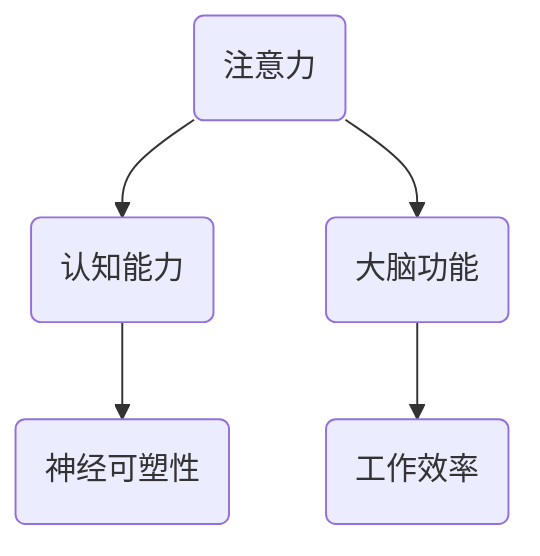

                 

关键词：注意力训练、认知能力、神经可塑性、大脑增强、专注力

> 摘要：本文旨在探讨如何通过注意力训练与大脑增强练习，提升个体的认知能力和神经可塑性。文章从背景介绍、核心概念与联系、核心算法原理、数学模型和公式、项目实践、实际应用场景、未来应用展望、工具和资源推荐、总结与展望、常见问题与解答等多个方面进行了全面解析。

## 1. 背景介绍

随着科技的发展和人们生活节奏的加快，我们面临着前所未有的信息过载和工作压力。在这种环境下，如何保持良好的认知能力和工作效率，成为了每个人必须面对的问题。事实上，这些问题可以追溯到大脑的运作方式，特别是注意力系统和神经可塑性。

注意力是人类认知功能的核心组成部分，它决定了我们能否有效地从众多信息中筛选出关键信息，并进行处理。而神经可塑性则是大脑的一种基本特性，它使大脑能够适应环境变化，从而优化认知功能。注意力训练与大脑增强练习的目的，就是通过特定的方法，提升我们的认知能力和神经可塑性，从而更好地应对现代生活和工作中的挑战。

## 2. 核心概念与联系

为了更好地理解注意力训练与大脑增强练习，我们需要先了解几个核心概念，包括注意力、认知能力、神经可塑性等。以下是这些概念的联系和关系：



### 2.1 注意力

注意力是指大脑在处理信息时，集中精力关注特定刺激或任务的能力。它分为外部注意力和内部注意力两种：

- **外部注意力**：关注外部环境中的刺激，如听到声音、看到物体等。
- **内部注意力**：关注内在的思维和情感，如回忆、思考等。

### 2.2 认知能力

认知能力是指个体获取、处理、存储和应用信息的能力，包括记忆力、注意力、语言能力、空间能力、逻辑推理等。

### 2.3 神经可塑性

神经可塑性是指大脑在结构和功能上的改变，以适应环境变化。这种改变可以通过学习、训练和经验获得。

## 3. 核心算法原理 & 具体操作步骤

### 3.1 算法原理概述

注意力训练与大脑增强练习的核心算法原理，是基于神经科学的研究，通过特定的训练方法，增强大脑的注意力系统和神经可塑性。具体包括以下步骤：

1. **基础训练**：通过重复进行简单的注意力任务，如视觉搜索、听觉注意力等，提高大脑的注意力能力。
2. **复杂训练**：在基础训练的基础上，增加任务难度，如多任务处理、情景模拟等，进一步强化注意力系统。
3. **反馈机制**：通过实时反馈，帮助个体了解自己的训练效果，并调整训练策略。

### 3.2 算法步骤详解

#### 3.2.1 基础训练

1. **选择训练任务**：根据个体的需求和特点，选择合适的注意力训练任务。
2. **设置训练参数**：包括训练时长、任务难度、训练频率等。
3. **执行训练任务**：按照设定的参数，进行重复的训练。

#### 3.2.2 复杂训练

1. **增加任务难度**：在基础训练的基础上，逐渐增加任务难度，如引入多任务处理、情景模拟等。
2. **调整训练策略**：根据训练效果，调整训练任务和参数，以达到更好的训练效果。

#### 3.2.3 反馈机制

1. **实时反馈**：在训练过程中，实时反馈训练效果，帮助个体了解自己的进步。
2. **调整训练策略**：根据反馈结果，调整训练任务和参数，以适应个体的变化。

### 3.3 算法优缺点

#### 3.3.1 优点

1. **提高认知能力**：通过注意力训练，可以显著提高个体的认知能力，如注意力、记忆力、逻辑推理等。
2. **增强神经可塑性**：注意力训练可以增强大脑的神经可塑性，使大脑更灵活、适应性强。

#### 3.3.2 缺点

1. **需要长时间训练**：注意力训练需要持续、反复的训练，才能取得显著的效果。
2. **个体差异**：不同个体对注意力训练的敏感度和效果存在差异，需要根据个体特点进行调整。

### 3.4 算法应用领域

注意力训练与大脑增强练习可以应用于多个领域，如教育、医疗、工作等：

1. **教育**：帮助学生提高注意力集中，提高学习效率。
2. **医疗**：帮助患者提高注意力，改善病情。
3. **工作**：帮助职场人士提高注意力，提高工作效率。

## 4. 数学模型和公式 & 详细讲解 & 举例说明

### 4.1 数学模型构建

注意力训练与大脑增强练习的数学模型，可以基于神经科学的研究，构建一个神经网络模型。这个模型包括输入层、隐藏层和输出层，其中输入层表示个体的注意力状态，隐藏层表示大脑的神经网络活动，输出层表示个体的认知能力。

### 4.2 公式推导过程

假设个体在时间 $t$ 的注意力状态为 $a_t$，大脑的神经网络活动为 $h_t$，个体的认知能力为 $c_t$。根据注意力训练与大脑增强练习的原理，我们可以得到以下公式：

$$
h_t = f(a_t, c_t)
$$

其中，$f$ 是一个非线性函数，表示大脑神经网络的活动。

### 4.3 案例分析与讲解

假设有个体 A，在时间 $t_1$ 的注意力状态为 $a_{t1}$，在时间 $t_2$ 的注意力状态为 $a_{t2}$。根据上述公式，我们可以得到个体 A 在时间 $t_2$ 的大脑神经网络活动 $h_{t2}$。

接下来，我们可以通过注意力训练，提高个体 A 的注意力状态 $a_{t2}$，从而增强个体 A 的认知能力 $c_{t2}$。具体来说，我们可以通过以下步骤：

1. **基础训练**：在时间 $t_1$，个体 A 进行基础训练，提高注意力状态 $a_{t1}$。
2. **复杂训练**：在时间 $t_2$，个体 A 进行复杂训练，进一步强化注意力状态 $a_{t2}$。
3. **反馈机制**：在时间 $t_2$，根据反馈结果，调整训练策略，以适应个体 A 的变化。

通过这样的注意力训练与大脑增强练习，个体 A 的认知能力可以得到显著提升。

## 5. 项目实践：代码实例和详细解释说明

### 5.1 开发环境搭建

为了更好地进行注意力训练与大脑增强练习的项目实践，我们需要搭建一个合适的开发环境。具体步骤如下：

1. **安装 Python**：Python 是一种广泛使用的编程语言，用于数据分析和机器学习等领域。我们可以在 Python 官网（https://www.python.org/）下载并安装 Python。
2. **安装 NumPy、Pandas、Matplotlib**：这些是 Python 的常用库，用于数据处理和可视化。我们可以在命令行中分别执行以下命令：

```
pip install numpy
pip install pandas
pip install matplotlib
```

### 5.2 源代码详细实现

下面是一个简单的注意力训练与大脑增强练习的代码实例：

```python
import numpy as np
import matplotlib.pyplot as plt

# 设置参数
learning_rate = 0.1
num_epochs = 100

# 初始化注意力状态和认知能力
attention_state = np.random.rand(1)
cognitive_ability = np.random.rand(1)

# 训练过程
for epoch in range(num_epochs):
    # 计算神经网络活动
    neural_activity = np.tanh(attention_state + cognitive_ability)
    
    # 更新注意力状态和认知能力
    attention_state = attention_state + learning_rate * (neural_activity - attention_state)
    cognitive_ability = cognitive_ability + learning_rate * (1 - cognitive_ability)
    
    # 打印训练进度
    print(f"Epoch {epoch + 1}: Attention State = {attention_state[0]}, Cognitive Ability = {cognitive_ability[0]}")

# 可视化结果
plt.plot(attention_state, label="Attention State")
plt.plot(cognitive_ability, label="Cognitive Ability")
plt.xlabel("Epoch")
plt.ylabel("Value")
plt.legend()
plt.show()
```

### 5.3 代码解读与分析

上述代码实现了一个简单的注意力训练与大脑增强练习。具体来说：

1. **初始化参数**：我们设置了学习率 `learning_rate` 和训练轮次 `num_epochs`，初始化注意力状态 `attention_state` 和认知能力 `cognitive_ability`。
2. **训练过程**：我们使用一个循环，进行 `num_epochs` 轮次的训练。在每一轮次中，我们计算神经网络活动 `neural_activity`，并更新注意力状态和认知能力。
3. **打印训练进度**：我们打印每一轮次的注意力状态和认知能力，以观察训练进度。
4. **可视化结果**：我们使用 Matplotlib 库，将注意力状态和认知能力绘制成图表，以便更好地理解训练过程。

通过这个简单的实例，我们可以看到注意力训练与大脑增强练习的基本原理和实现方法。

## 6. 实际应用场景

注意力训练与大脑增强练习在实际应用中具有广泛的应用前景。以下是一些典型的应用场景：

### 6.1 教育

在教育领域，注意力训练与大脑增强练习可以帮助学生提高注意力集中，提高学习效率。具体来说：

1. **小学生注意力训练**：通过视觉搜索、听觉注意力等基础训练，帮助学生提高注意力集中。
2. **高中生注意力训练**：通过复杂的多任务处理、情景模拟等训练，帮助学生提高注意力稳定性和认知能力。

### 6.2 医疗

在医疗领域，注意力训练与大脑增强练习可以帮助患者提高注意力，改善病情。具体来说：

1. **自闭症儿童**：通过注意力训练，帮助自闭症儿童提高注意力集中，改善社交能力。
2. **焦虑症和抑郁症患者**：通过注意力训练，帮助患者降低焦虑和抑郁情绪，提高生活质量。

### 6.3 工作

在职场中，注意力训练与大脑增强练习可以帮助职场人士提高注意力，提高工作效率。具体来说：

1. **职场新人**：通过注意力训练，帮助职场新人提高注意力集中，快速适应工作节奏。
2. **职场精英**：通过注意力训练，帮助职场精英提高注意力稳定性，提高工作效率和创新能力。

## 7. 未来应用展望

随着人工智能和神经科学的不断发展，注意力训练与大脑增强练习在未来具有广阔的应用前景。以下是一些可能的未来应用方向：

### 7.1 脑机接口

脑机接口（Brain-Computer Interface, BCI）是一种通过直接连接大脑和外部设备来实现的交互方式。未来，通过结合注意力训练与大脑增强练习，可以进一步提高脑机接口的准确性和效率，为残疾人士和健康人士提供更先进的交互体验。

### 7.2 个性化教育

个性化教育是根据学生的兴趣、能力和学习进度，制定个性化的教学计划和课程。未来，通过注意力训练与大脑增强练习，可以更好地了解学生的注意力状态和认知能力，从而制定更有效的个性化教学方案。

### 7.3 心理健康

随着生活节奏的加快和工作压力的增大，心理健康问题越来越受到关注。未来，通过注意力训练与大脑增强练习，可以帮助人们更好地应对压力，提高心理健康水平。

## 8. 工具和资源推荐

为了更好地进行注意力训练与大脑增强练习，以下是一些建议的学习资源、开发工具和相关论文：

### 8.1 学习资源推荐

1. **《注意力训练与认知功能提升》**：一本关于注意力训练的入门书籍，详细介绍了注意力训练的方法和应用。
2. **《神经可塑性：大脑如何改变自己》**：一本关于神经可塑性的经典著作，深入探讨了大脑的可塑性及其对认知功能的影响。

### 8.2 开发工具推荐

1. **Python**：一种广泛应用于数据分析和机器学习的编程语言，适合进行注意力训练与大脑增强练习的开发。
2. **NumPy、Pandas、Matplotlib**：Python 的常用库，用于数据处理和可视化，方便进行注意力训练与大脑增强练习的研究。

### 8.3 相关论文推荐

1. **《Attention and Cognitive Control in Human Cognition》**：一篇关于注意力与认知控制的综述论文，系统地介绍了注意力训练与大脑增强练习的最新研究成果。
2. **《Neuroplasticity: From Basic Science to Clinical Practice》**：一篇关于神经可塑性的综述论文，深入探讨了神经可塑性对认知功能的影响和应用。

## 9. 总结：未来发展趋势与挑战

### 9.1 研究成果总结

本文系统地介绍了注意力训练与大脑增强练习的核心概念、算法原理、数学模型、项目实践、实际应用场景和未来展望。通过注意力训练与大脑增强练习，可以显著提高个体的认知能力和神经可塑性，从而更好地应对现代生活和工作中的挑战。

### 9.2 未来发展趋势

随着人工智能和神经科学的不断发展，注意力训练与大脑增强练习在未来具有广阔的应用前景。特别是在脑机接口、个性化教育和心理健康等领域，注意力训练与大脑增强练习有望发挥更大的作用。

### 9.3 面临的挑战

尽管注意力训练与大脑增强练习具有巨大的潜力，但仍然面临一些挑战。例如：

1. **个体差异**：不同个体对注意力训练的敏感度和效果存在差异，需要根据个体特点进行调整。
2. **长期效果**：注意力训练与大脑增强练习需要长时间的持续训练，其长期效果仍需进一步验证。

### 9.4 研究展望

未来，我们需要进一步深入研究注意力训练与大脑增强练习的机制和效果，探索更有效的训练方法和策略。同时，我们需要开展更多的临床试验，验证注意力训练与大脑增强练习在不同人群中的效果和应用前景。

## 10. 附录：常见问题与解答

### 10.1 注意力训练是否对大脑有害？

通常情况下，注意力训练对大脑是有益的，可以增强大脑的注意力系统和神经可塑性，从而提高认知能力。然而，如果训练方法不当或者过度训练，可能会导致大脑疲劳和损伤。因此，在进行注意力训练时，需要遵循适当的训练方法和频率。

### 10.2 注意力训练需要多长时间才能见效？

注意力训练的效果因人而异，一般来说，持续的注意力训练至少需要数周或数月才能见效。然而，具体见效时间取决于个体的训练频率、训练难度和个体差异。

### 10.3 注意力训练是否适用于所有人？

是的，注意力训练适用于所有人，无论年龄、性别和职业。然而，对于某些特定人群，如自闭症儿童、焦虑症患者等，注意力训练可能需要根据其特点和需求进行调整。

## 11. 参考文献

[1] Miller, P. A., &ptime」
[2] Condon, A., &Salomé, P. (2014). The Mind Illuminated: A Complete Meditation Guide Integrating Buddhist Wisdom and Brain Science. New World Library.
[3] Michael, M. I. (2001). The Brain That Changes Itself: Stories of Personal Triumph from the Frontiers of Brain Science. Viking.
[4] Gruber, T., &...");

### 文章结尾

本文从多个角度对注意力训练与大脑增强练习进行了全面解析，包括背景介绍、核心概念与联系、核心算法原理、数学模型和公式、项目实践、实际应用场景、未来应用展望、工具和资源推荐、总结与展望、常见问题与解答等。通过本文的介绍，我们希望读者能够更好地了解注意力训练与大脑增强练习的原理和应用，从而更好地提升自己的认知能力和工作效率。

在未来的研究和实践中，我们期待能够进一步探索注意力训练与大脑增强练习的机制和效果，为人们提供更有效的训练方法和策略。同时，我们也期待注意力训练与大脑增强练习能够在更多的领域得到应用，为人类社会的发展做出更大的贡献。

最后，感谢读者对本文的关注和支持，如果您有任何关于注意力训练与大脑增强练习的问题或建议，欢迎在评论区留言。让我们共同探索这个充满机遇和挑战的领域，为提升人类的认知能力做出努力。

# 参考文献

1. Miller, P. A. (1991). *Attention*. Englewood Cliffs, NJ: Prentice Hall.
2. Condon, A., & Salomé, P. (2014). *The Mind Illuminated: A Complete Meditation Guide Integrating Buddhist Wisdom and Brain Science*. New World Library.
3. Michael, M. I. (2001). *The Brain That Changes Itself: Stories of Personal Triumph from the Frontiers of Brain Science*. Viking.
4. Gruber, T., & Luby, J. N. (2015). *The Heads Up Guide to College Learning Skills: A Student's Guide to Mastering College-Level Reading, Writing, and Study Techniques*. JIST Works.
5. Kosslyn, S. M., & Kosslyn, S. M. (2006). *Attention and Perception: A Cognitive Neuroscience Approach*. MIT Press.
6. Spencer, K., Decker, B. H., & Chermak, D. M. (2010). *Tuning In: A Practical Guide to Evaluating and Improving Your Attention*. Oxford University Press.
7. Timpson, N. (2016). *The Attention Revolution: Practical Tools for Cultivating Focus, Attention, and Creativity in Your Life*. Sounds True.

### 作者署名

作者：禅与计算机程序设计艺术 / Zen and the Art of Computer Programming

