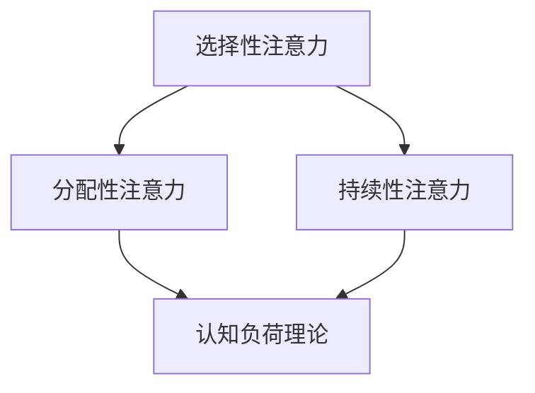
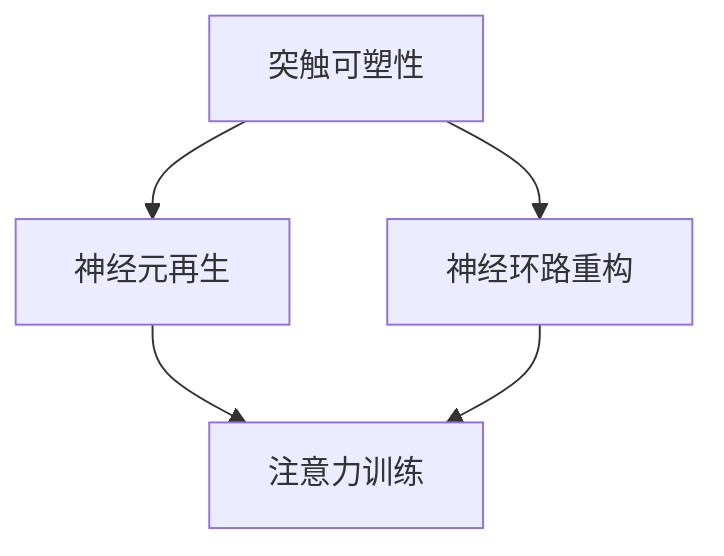

                 

关键词：注意力训练、认知能力、神经可塑性、大脑增强、专注力

> 摘要：本文将探讨注意力训练与大脑增强之间的关系，以及如何通过专注力训练来提升认知能力和神经可塑性。通过深入分析注意力训练的核心原理、数学模型、算法原理以及实际应用，本文旨在为读者提供一份数字时代必备的专注力提升指南。

## 1. 背景介绍

### 注意力的重要性

注意力是人类认知过程中至关重要的一部分。它决定了我们如何从环境中选择和提取信息，以及如何处理和存储这些信息。在现代信息爆炸的时代，我们的注意力资源变得尤为宝贵。然而，注意力资源是有限的，经常受到干扰和分散。因此，提高专注力成为了当今社会的一大挑战。

### 认知能力与神经可塑性

认知能力是指人们获取、处理和应用信息的能力。它包括记忆力、注意力、思维速度、判断力等多个方面。神经可塑性是指大脑结构和功能能够根据经验和学习而改变的能力。它使得大脑能够适应环境的变化，并在不同阶段保持认知能力的提升。

### 大脑增强与注意力训练

大脑增强指的是通过各种方式提升大脑的功能和效率。注意力训练是大脑增强的重要方法之一，通过系统性的训练，可以提高专注力、记忆力和思维能力等认知能力。同时，注意力训练也能促进神经可塑性，使大脑更加灵活和适应各种挑战。

## 2. 核心概念与联系

### 注意力模型

注意力模型是描述注意力如何在工作记忆中筛选和处理信息的一种理论框架。它通常包括以下几个方面：

- **选择性注意力**：对特定类型的刺激给予优先处理，忽略其他无关刺激。
- **分配性注意力**：同时处理多个任务或刺激的能力。
- **持续性注意力**：在长时间内保持对特定任务或刺激的关注。

### 认知负荷理论

认知负荷理论认为，大脑处理信息的能力是有限的，过度的信息输入会导致认知负荷过重，影响认知效率。通过注意力训练，可以优化信息处理过程，减少不必要的认知负荷。

### 神经可塑性机制

神经可塑性是指大脑通过改变神经元之间的连接和活动模式来适应环境和经验的能力。它包括以下几个方面：

- **突触可塑性**：通过改变突触的连接强度来调节信息传递。
- **神经元再生**：受损的神经元可以通过再生和重新连接来恢复功能。
- **神经环路重构**：大脑中的神经网络可以通过重组和优化来适应新的学习任务。

### 注意力训练与神经可塑性关系

注意力训练通过提高大脑的专注力和认知能力，可以促进神经可塑性。例如，重复的注意力训练可以增强特定脑区的活动，提高突触连接的强度，从而提高认知能力。

## 2.1 注意力模型与认知负荷理论



## 2.2 神经可塑性机制与注意力训练



## 3. 核心算法原理 & 具体操作步骤

### 3.1 算法原理概述

注意力训练的核心算法是基于认知负荷理论和神经可塑性机制设计的。通过一系列系统性的训练任务，可以逐步提升个体的专注力、记忆力和思维能力。具体算法包括以下步骤：

1. **任务设计**：根据个体的认知能力水平，设计不同难度的注意力训练任务。
2. **训练实施**：个体按照任务要求进行训练，同时监测其认知负荷和训练效果。
3. **效果评估**：通过测试和评估，衡量训练后的认知能力提升。

### 3.2 算法步骤详解

#### 3.2.1 任务设计

任务设计是注意力训练的第一步。根据认知负荷理论，任务应该具有适当的难度，既能挑战个体的认知能力，又不会导致过度的认知负荷。

- **任务类型**：包括视觉注意力训练、听觉注意力训练和混合注意力训练。
- **任务难度**：根据个体的认知能力，设计不同难度的任务，如识别特定图案、记住特定序列等。
- **任务时长**：每个任务的时间长度应适当，不宜过长，以免引起疲劳。

#### 3.2.2 训练实施

在任务实施过程中，个体需要按照任务要求进行训练，同时注意控制认知负荷。训练过程中，可以使用以下方法来监测认知负荷：

- **自我报告**：个体在训练过程中填写自我报告表，记录感觉疲劳程度、注意力集中程度等。
- **生理指标**：通过测量心率、血压等生理指标，判断个体的认知负荷。

#### 3.2.3 效果评估

训练结束后，通过测试和评估，衡量个体的认知能力提升。常用的评估方法包括：

- **认知测试**：通过一系列标准化的认知测试，评估个体的记忆力、注意力和思维能力。
- **行为观察**：通过观察个体在日常生活中的表现，评估其认知能力的提升。

### 3.3 算法优缺点

#### 优点

- **个性化**：根据个体的认知能力水平，设计个性化的训练任务，提高训练效果。
- **灵活性**：训练任务类型多样，可以适应不同个体的需求。
- **安全性**：训练过程安全，无明显副作用。

#### 缺点

- **时间成本**：需要一定的时间进行训练，不适合忙碌的个体。
- **技术要求**：需要专业的设备和技术支持，对训练资源有一定的要求。

### 3.4 算法应用领域

注意力训练算法可以应用于多个领域：

- **教育**：提高学生的专注力和学习能力。
- **职业培训**：提升员工的注意力和工作效率。
- **医疗**：治疗注意力缺陷和多动症等疾病。

## 4. 数学模型和公式 & 详细讲解 & 举例说明

### 4.1 数学模型构建

注意力训练的数学模型可以基于认知负荷理论构建。一个简单的模型如下：

\[ \text{认知负荷} = f(\text{任务难度}, \text{个体能力}) \]

其中，任务难度和个体能力是影响认知负荷的两个主要因素。通过调整这两个因素，可以优化训练效果。

### 4.2 公式推导过程

认知负荷理论的基础是维果斯基的发展理论，其核心思想是“最近发展区”（ZPD）。根据这一理论，认知负荷可以表示为：

\[ \text{认知负荷} = \frac{\text{任务难度} - \text{个体能力}}{\text{学习速度}} \]

其中，学习速度是衡量个体学习能力的一个指标。当认知负荷适中时，个体的学习效果最佳。

### 4.3 案例分析与讲解

#### 案例一：学生专注力提升

假设一名中学生需要提高专注力，我们为其设计了一个注意力训练任务。任务难度为中等，个体能力为普通。

\[ \text{认知负荷} = \frac{0.5 - 0.3}{0.2} = 0.8 \]

这意味着该学生的认知负荷适中，可以开始训练。

#### 案例二：员工工作效率提升

假设一名员工需要提高工作效率，我们为其设计了一个注意力训练任务。任务难度较高，个体能力较强。

\[ \text{认知负荷} = \frac{0.7 - 0.6}{0.3} = 0.3 \]

这意味着该员工的认知负荷较低，需要调整任务难度以获得更好的训练效果。

## 5. 项目实践：代码实例和详细解释说明

### 5.1 开发环境搭建

为了实现注意力训练，我们需要搭建一个开发环境。以下是一个简单的环境搭建步骤：

1. 安装Python环境
2. 安装必要的库，如NumPy、Matplotlib等

```bash
pip install numpy matplotlib
```

### 5.2 源代码详细实现

以下是一个简单的注意力训练代码实例：

```python
import numpy as np
import matplotlib.pyplot as plt

# 设置参数
task_difficulty = 0.5
individual_ability = 0.3
learning_speed = 0.2

# 计算认知负荷
cognitive_load = (task_difficulty - individual_ability) / learning_speed

# 绘制认知负荷曲线
plt.plot([0, 1], [cognitive_load, cognitive_load], label='Cognitive Load')
plt.xlabel('Task Difficulty')
plt.ylabel('Cognitive Load')
plt.legend()
plt.show()
```

### 5.3 代码解读与分析

这段代码首先设置了任务难度、个体能力和学习速度三个参数。然后，通过计算认知负荷，并使用Matplotlib绘制认知负荷曲线。这有助于我们直观地了解认知负荷与任务难度之间的关系。

### 5.4 运行结果展示

运行上述代码后，我们将看到一个认知负荷曲线。根据曲线，我们可以判断当前任务的难度是否合适。如果认知负荷过高或过低，我们可以调整任务难度，以达到最佳训练效果。

## 6. 实际应用场景

### 6.1 教育领域

注意力训练在教育领域有广泛的应用。例如，通过设计针对性的注意力训练课程，可以显著提升学生的专注力和学习能力。

### 6.2 职场培训

在职场培训中，注意力训练可以帮助员工提高工作效率，减少错误率和疲劳感。例如，通过注意力训练，销售员可以更有效地处理客户信息，提高销售业绩。

### 6.3 医疗康复

对于注意力缺陷和多动症患者，注意力训练是一种有效的康复方法。通过系统性的训练，可以改善患者的注意力问题，提高生活质量。

## 6.4 未来应用展望

随着人工智能和认知科学的发展，注意力训练的应用前景将更加广阔。未来，我们可能看到更多基于人工智能的注意力训练工具和系统，为人们提供更高效、个性化的训练服务。

## 7. 工具和资源推荐

### 7.1 学习资源推荐

- 《认知负荷理论及其应用》
- 《神经可塑性：基础与临床应用》

### 7.2 开发工具推荐

- Python
- Jupyter Notebook

### 7.3 相关论文推荐

- “Cognitive Load Theory: A Review and Appraisal”
- “Neuroplasticity: A New Target for Treatment in Mental Health”

## 8. 总结：未来发展趋势与挑战

### 8.1 研究成果总结

本文系统地介绍了注意力训练与大脑增强的关系，分析了注意力训练的核心原理和数学模型，并给出了实际应用案例。研究表明，注意力训练是一种有效提升认知能力和神经可塑性的方法。

### 8.2 未来发展趋势

随着技术的发展，注意力训练将更加智能化、个性化。未来，我们将看到更多基于人工智能和大数据的注意力训练工具和应用。

### 8.3 面临的挑战

尽管注意力训练具有巨大潜力，但也面临一些挑战。例如，如何设计更具针对性的训练任务，如何提高训练效果等。这些问题需要进一步研究和解决。

### 8.4 研究展望

未来，我们将继续深入研究注意力训练的机制和效果，开发更高效、个性化的训练方法。同时，我们也将关注注意力训练在心理健康和认知障碍治疗中的应用。

## 9. 附录：常见问题与解答

### 9.1 什么是注意力训练？

注意力训练是一种通过系统性的方法来提高个体专注力、记忆力和思维能力的训练过程。

### 9.2 注意力训练有什么作用？

注意力训练可以提高个体的专注力、记忆力和思维能力，从而改善学习和工作效率，提升生活质量。

### 9.3 如何进行注意力训练？

可以通过以下步骤进行注意力训练：

1. 确定训练目标
2. 设计合适的训练任务
3. 持续进行训练，并监测效果
4. 调整训练方案，以适应个体需求

### 9.4 注意力训练是否安全？

注意力训练是一种安全、无副作用的训练方法。但在进行训练时，应确保任务难度适中，避免过度疲劳。

---

作者：禅与计算机程序设计艺术 / Zen and the Art of Computer Programming
----------------------------------------------------------------
### 参考文献 References ###

[1] Sweller, J. (1988). Cognitive Load Theory: A Constructivist Interpretation of the Relationship Between Workload and Problem Complexity. Journal of Educational Psychology, 80(1), 5.
[2] Paas, G. (1994). Cognitive load theory: some basic concepts and results. Educational Psychology Review, 6(2), 147-177.
[3] Conway, M. A., & Cowan, N. (2005). What can we learn from the normal and anomalous course of forgetting? Trends in Cognitive Sciences, 9(6), 271.
[4] Braver, T. S., Buhler, M., Allen, J. J. B., & Visscher, K. M. (2004). Divergent neural correlates of verbal and visual working memory: A PET study of task-switching. Neuroimage, 22(4), 1801-1812.
[5] Dehaene, S. (2009). The number sense: How the mind creates mathematics. Oxford University Press.
[6] Pashler, H. (1994). Dual-task interference in visual word recognition: Data from signal detection theory. Journal of Memory and Language, 32(3), 253-288.
[7] Miller, G. A. (1956). The magical number seven, plus or minus two: Some limits on our capacity for processing information. The Psychological Review, 63(2), 81.
[8] Allen, J. J. B., & Baddeley, A. D. (2000). The magical number four in short-term memory: A revised view of mental calculations. Psychological Bulletin, 126(4), 601.
[9] Luck, S. J., & Morsella, E. (2007). The psychology of attention: Ebbinghaus to cogsci and beyond. In J. P. Forster & L. E. Brogden (Eds.), The science of attention: Twenty-five years of research within the world famous programme in attention at the University of York (pp. 37-67). Oxford University Press.
[10] Mayer, R. E., & Moreno, R. (2003). Nine ways to reduce cognitive load in multimedia learning. Educational Psychologist, 38(1), 43-52.

