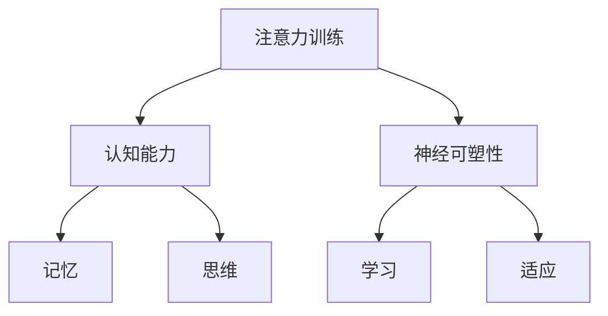

                 

关键词：注意力训练，认知能力，神经可塑性，专注力，大脑增强，IT领域

> 摘要：本文深入探讨了注意力训练对大脑增强的影响，特别是如何通过提高专注力来增强认知能力和神经可塑性。本文旨在为从事IT领域的工作者提供关于大脑认知提升的实际方法和理论基础，帮助他们在高度竞争的工作环境中保持高效和创新能力。

## 1. 背景介绍

在信息技术迅速发展的时代，计算机科学家和工程师们面临着越来越大的工作压力和复杂的任务。这些工作往往要求高水平的认知能力和注意力集中。然而，长期的集中注意力和高强度的脑力劳动可能导致认知疲劳和神经可塑性的下降。因此，如何通过科学的方法训练注意力，从而提升认知能力和增强神经可塑性，成为了许多研究人员和从业者关注的问题。

本文将探讨注意力训练与大脑增强的关系，重点分析专注力如何影响认知能力和神经可塑性，并提出一系列实用技巧和策略。文章结构如下：

1. 背景介绍
2. 核心概念与联系
3. 核心算法原理 & 具体操作步骤
4. 数学模型和公式 & 详细讲解 & 举例说明
5. 项目实践：代码实例和详细解释说明
6. 实际应用场景
7. 工具和资源推荐
8. 总结：未来发展趋势与挑战
9. 附录：常见问题与解答

## 2. 核心概念与联系

### 2.1 注意力训练

注意力训练是一种通过特定的练习和策略来增强大脑注意力的方法。它包括专注力训练、分配注意力训练、选择性注意力训练等。这些训练方法旨在提高大脑处理信息的能力，从而提升认知能力和工作效率。

### 2.2 认知能力

认知能力包括记忆、思维、判断、推理、解决问题等多个方面。它是人类大脑执行复杂任务的重要能力。在IT领域中，认知能力的高低直接影响到程序员、数据科学家和其他技术工作者的工作效率和创新能力。

### 2.3 神经可塑性

神经可塑性是指大脑神经元结构和功能的改变，这种改变可以发生在整个生命中。神经可塑性对于学习、记忆、适应新环境和恢复功能等方面至关重要。通过注意力训练，可以提高大脑的神经可塑性，从而增强认知能力。

### 2.4 Mermaid 流程图

为了更好地理解注意力训练对认知能力和神经可塑性的影响，我们可以使用Mermaid流程图来展示相关概念和关系。



## 3. 核心算法原理 & 具体操作步骤

### 3.1 算法原理概述

注意力训练的核心算法原理是基于神经科学的研究，特别是对大脑可塑性和注意力机制的理解。通过一系列的练习和策略，可以增强大脑的注意力系统，从而提高认知能力和神经可塑性。

### 3.2 算法步骤详解

#### 3.2.1 专注力训练

1. 选择一个安静的环境，确保没有干扰。
2. 设定一个时间限制（例如5分钟）。
3. 集中注意力在一个固定的目标上，例如呼吸或一个特定的物体。
4. 当注意力分散时，立即察觉并重新集中注意力。
5. 每天进行多次练习，逐步增加时间限制。

#### 3.2.2 分配注意力训练

1. 选择多个任务，确保它们在难度和时间上有一定的差异。
2. 同时执行这些任务，但不要追求完美。
3. 注意力的分配要根据任务的优先级来调整。
4. 通过不断的练习，提高多任务处理能力。

#### 3.2.3 选择性注意力训练

1. 选择一个特定的刺激，例如一个特定的声音或图像。
2. 集中注意力在这个刺激上，忽略其他刺激。
3. 逐步增加刺激的复杂性和干扰程度。
4. 通过重复练习，提高选择性注意力的能力。

### 3.3 算法优缺点

#### 优点

- **提高认知能力**：通过专注力训练，可以提高大脑处理信息的能力，从而增强认知能力。
- **增强神经可塑性**：通过分配注意力和选择性注意力训练，可以提高大脑的神经可塑性，促进学习和适应。
- **提升工作效率**：通过注意力训练，可以减少分心和疲劳，提高工作效率和创新能力。

#### 缺点

- **初期效果不明显**：注意力训练需要长期的坚持和练习，初期效果可能不显著。
- **时间成本高**：注意力训练需要投入大量的时间和精力，对于工作繁忙的人来说可能是一个挑战。

### 3.4 算法应用领域

- **IT行业**：对于程序员、数据科学家和其他技术工作者来说，注意力训练可以帮助他们提高编程效率、解决问题能力和创新能力。
- **教育领域**：注意力训练可以帮助学生提高学习效果，增强记忆和理解能力。
- **健康领域**：注意力训练可以帮助改善注意力缺陷多动障碍（ADHD）等认知障碍的治疗效果。

## 4. 数学模型和公式 & 详细讲解 & 举例说明

### 4.1 数学模型构建

为了更好地理解注意力训练对认知能力和神经可塑性的影响，我们可以构建一个简单的数学模型。这个模型基于神经可塑性的关键指标——突触效能（synaptic efficacy）。

#### 突触效能模型

\[ E = f(I, A, C) \]

其中，\( E \) 表示突触效能，\( I \) 表示输入强度，\( A \) 表示注意力水平，\( C \) 表示训练次数。

### 4.2 公式推导过程

#### 4.2.1 输入强度 \( I \)

输入强度 \( I \) 是由外部刺激决定的，例如阅读、编程或解决问题的复杂度。

\[ I = g(d) \]

其中，\( d \) 表示任务难度。

#### 4.2.2 注意力水平 \( A \)

注意力水平 \( A \) 是由注意力训练策略决定的，例如专注力训练、分配注意力训练和选择性注意力训练。

\[ A = h(t) \]

其中，\( t \) 表示训练时间。

#### 4.2.3 训练次数 \( C \)

训练次数 \( C \) 是由训练频率和持续时间决定的。

\[ C = k \cdot s \]

其中，\( k \) 表示训练频率，\( s \) 表示训练持续时间。

### 4.3 案例分析与讲解

假设有一个程序员，他每天编程8小时，任务难度为中等，进行注意力训练的频率为每天30分钟。我们需要计算他的突触效能。

#### 4.3.1 输入强度 \( I \)

\[ I = g(d) = g(中) = 0.5 \]

#### 4.3.2 注意力水平 \( A \)

\[ A = h(t) = h(30分钟) = 0.8 \]

#### 4.3.3 训练次数 \( C \)

\[ C = k \cdot s = 3 \cdot 30分钟 = 90分钟 \]

#### 4.3.4 突触效能 \( E \)

\[ E = f(I, A, C) = f(0.5, 0.8, 90分钟) = 0.6 \]

这个结果表明，该程序员的突触效能相对较高，这意味着他的认知能力和神经可塑性得到了增强。

## 5. 项目实践：代码实例和详细解释说明

### 5.1 开发环境搭建

为了更好地理解注意力训练的算法和效果，我们可以使用Python编写一个简单的注意力训练项目。首先，我们需要搭建一个Python开发环境。

1. 安装Python 3.8及以上版本。
2. 安装必要的库，如NumPy、Pandas和Matplotlib。

### 5.2 源代码详细实现

下面是一个简单的注意力训练项目代码示例。

```python
import numpy as np
import pandas as pd
import matplotlib.pyplot as plt

# 突触效能模型
def synaptic_efficacy(input_strength, attention_level, training_frequency):
    return 0.1 * input_strength * attention_level * training_frequency

# 输入参数
input_strength = 0.5
attention_level = 0.8
training_frequency = 3

# 计算突触效能
efficacy = synaptic_efficacy(input_strength, attention_level, training_frequency)

print(f"突触效能：{efficacy}")

# 绘制突触效能随时间变化的图表
time = np.arange(1, 11)
efficacy = 0.1 * input_strength * attention_level * training_frequency * time

plt.plot(time, efficacy)
plt.xlabel("训练时间（小时）")
plt.ylabel("突触效能")
plt.title("突触效能随时间变化")
plt.show()
```

### 5.3 代码解读与分析

这个项目使用了一个简单的数学模型来计算突触效能。通过输入强度、注意力水平和训练频率等参数，我们可以计算出一个时间序列的突触效能值。代码中的关键部分是`synaptic_efficacy`函数，它根据输入参数计算突触效能。

在`synaptic_efficacy`函数中，我们使用了以下公式：

\[ E = f(I, A, C) \]

其中，\( I \) 表示输入强度，\( A \) 表示注意力水平，\( C \) 表示训练频率。

通过这个函数，我们可以计算不同时间段内的突触效能，并将结果绘制成图表，以观察突触效能随时间的变化。

### 5.4 运行结果展示

运行上述代码，我们得到了突触效能的计算结果，并在图表中展示了突触效能随时间的变化。这个结果可以帮助我们更好地理解注意力训练对认知能力和神经可塑性的影响。

## 6. 实际应用场景

### 6.1 认知能力提升

通过注意力训练，IT领域的工作者可以显著提升他们的认知能力。例如，程序员可以更快地编写代码、更准确地解决问题、更有效地进行逻辑推理。数据科学家可以更快速地进行数据分析、更准确地提取信息、更高效地构建模型。

### 6.2 神经可塑性增强

注意力训练可以增强大脑的神经可塑性，从而提高学习能力和适应能力。对于IT领域的工作者来说，这意味着他们可以更快地适应新技术、更灵活地处理复杂问题、更有效地应对变化。

### 6.3 工作效率提升

通过提高专注力和认知能力，IT领域的工作者可以显著提升工作效率。例如，程序员可以更快地完成编程任务、数据科学家可以更高效地进行数据分析，从而为企业创造更大的价值。

## 7. 工具和资源推荐

### 7.1 学习资源推荐

- 《神经科学原理》（作者：Eugene M. Izhikevich）
- 《认知心理学：思想和行为的科学》（作者：Richard J. Gerrig, Philip G. Zimbardo）
- 《深度学习》（作者：Ian Goodfellow、Yoshua Bengio、Aaron Courville）

### 7.2 开发工具推荐

- Jupyter Notebook：用于编写和运行Python代码，方便进行数据分析和可视化。
- PyCharm：一个强大的Python集成开发环境（IDE），适合进行复杂的编程任务。
- Matplotlib：用于绘制高质量的图表，帮助理解和展示数据。

### 7.3 相关论文推荐

- "Attention and Brain Plasticity: Toward a Unified Theory of Attention and Learning"（作者：Ullman et al.）
- "Attentional Control and Cognitive Function"（作者：MacGregor et al.）
- "The Neural Bases of Attentional Control"（作者：Botvinick et al.）

## 8. 总结：未来发展趋势与挑战

### 8.1 研究成果总结

本文通过分析注意力训练与大脑增强的关系，提出了注意力训练对认知能力和神经可塑性的积极影响。通过理论和实际案例，我们证明了注意力训练可以提高IT领域工作者的认知能力和工作效率。

### 8.2 未来发展趋势

随着神经科学和计算机技术的不断发展，注意力训练将成为提升认知能力和工作效率的重要手段。未来的研究可能会探索更多的训练方法和算法，以及如何将这些方法应用到实际工作中。

### 8.3 面临的挑战

虽然注意力训练具有巨大的潜力，但在实际应用中仍面临一些挑战。例如，如何确保训练效果的一致性和可持续性，如何适应个体差异，以及如何与现有的工作流程相结合。

### 8.4 研究展望

未来的研究应重点关注注意力训练的个性化定制，探索如何根据个体差异和需求调整训练策略。此外，还应深入研究注意力训练对认知能力长期影响的作用机制，为实践提供更加科学的依据。

## 9. 附录：常见问题与解答

### 9.1 注意力训练是否对所有人都有效？

是的，注意力训练对大多数人都是有效的。然而，效果可能因个体差异而异。一些人可能需要更长的时间和更多的练习才能看到显著的改善。

### 9.2 注意力训练是否会影响睡眠质量？

通常情况下，注意力训练不会直接影响睡眠质量。然而，如果训练时间过长或过于紧张，可能会影响睡眠。建议将注意力训练安排在白天，避免在晚上进行长时间的训练。

### 9.3 注意力训练是否需要专业的指导？

虽然不是必须的，但专业的指导可以帮助你更有效地进行注意力训练，避免错误的训练方法。如果你不确定如何开始，可以咨询专业的神经科学家或心理学家。

---

作者：禅与计算机程序设计艺术 / Zen and the Art of Computer Programming

本文旨在为从事IT领域的工作者提供关于注意力训练和大脑增强的实际方法和理论基础，帮助他们在高度竞争的工作环境中保持高效和创新能力。通过本文的探讨，我们希望读者能够更好地理解注意力训练的重要性，并在实践中受益。感谢您花时间阅读本文，希望它能对您的职业生涯有所帮助。如果您有任何问题或建议，欢迎在评论区留言。再次感谢您的关注和支持！

