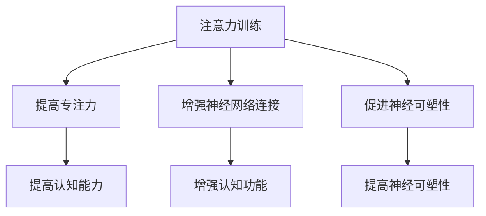

                 

关键词：注意力训练，认知能力，神经可塑性，专注力，大脑增强，算法原理，数学模型，实践案例，应用场景，工具推荐。

> 摘要：本文将探讨注意力训练在提升认知能力和神经可塑性方面的作用。通过分析注意力训练的核心概念和原理，结合数学模型和具体算法，我们将展示如何利用注意力训练改善大脑功能。此外，文章还将探讨注意力训练在现实世界中的应用场景，并提出未来发展的趋势和挑战。

## 1. 背景介绍

在当今信息爆炸的时代，我们的注意力资源变得越来越稀缺。人们常常发现自己难以长时间集中注意力，容易受到外界干扰。这种注意力分散不仅影响工作效率，还会对生活质量产生负面影响。因此，如何提升注意力成为了当今社会广泛关注的话题。

同时，认知能力和神经可塑性也是研究的热点。认知能力包括记忆力、注意力、执行功能等，是我们日常生活和工作所必需的。神经可塑性是指大脑在结构和功能上的可塑性，它影响我们学习、适应和恢复的能力。通过合适的训练，我们有望提升这些能力，从而更好地应对生活中的挑战。

注意力训练作为一种有效的训练方法，近年来受到了广泛关注。它不仅能够提高个体的专注力，还能够增强认知能力和神经可塑性。本文将详细介绍注意力训练的核心概念、原理和具体实施方法，并通过数学模型和实际案例，展示其有效性。

## 2. 核心概念与联系

### 2.1 注意力训练的定义

注意力训练是指通过特定的训练方法，有意识地训练个体的注意力能力，使其能够更好地集中精力、排除干扰，从而提高工作效率和生活质量。

### 2.2 认知能力的定义

认知能力是指个体在感知、记忆、思考、判断和问题解决等过程中表现出的能力。它是我们日常生活和工作的重要基础。

### 2.3 神经可塑性的定义

神经可塑性是指大脑在结构和功能上的可塑性，它使我们能够通过学习和训练改变大脑的结构和功能。这种能力对于适应新的环境和应对挑战至关重要。

### 2.4 注意力训练与认知能力和神经可塑性的联系

注意力训练能够通过以下机制提升认知能力和神经可塑性：

1. **提高专注力**：通过注意力训练，个体能够更好地集中精力，减少干扰，从而提高认知效率。
2. **增强神经网络连接**：注意力训练可以促进大脑神经元之间的连接，从而增强认知功能。
3. **促进神经可塑性**：注意力训练能够激活大脑的特定区域，促进神经元的生长和突触连接，从而提高神经可塑性。

### 2.5 Mermaid 流程图



## 3. 核心算法原理 & 具体操作步骤

### 3.1 算法原理概述

注意力训练的核心算法是基于认知神经科学的理论，通过一系列训练任务，逐步提高个体的专注力和认知能力。这些训练任务通常包括注意力集中、注意力切换和注意力分配等。

### 3.2 算法步骤详解

1. **注意力集中训练**：通过特定的任务，如眼球运动追踪、视觉搜索等，训练个体在干扰条件下保持注意力集中。
2. **注意力切换训练**：通过任务切换训练，如多任务处理、快速反应任务等，提高个体在不同任务之间的注意力切换能力。
3. **注意力分配训练**：通过分配注意力的训练，如目标追踪、空间认知任务等，提高个体在不同区域之间的注意力分配能力。

### 3.3 算法优缺点

**优点**：

1. **科学依据**：基于认知神经科学的理论，具有坚实的科学基础。
2. **灵活性强**：可以根据个体的需求和情况，设计个性化的训练方案。
3. **易于实施**：训练任务简单，易于在日常生活中实施。

**缺点**：

1. **训练效果因人而异**：个体的认知能力和神经可塑性差异较大，训练效果可能存在个体差异。
2. **长期效果有待验证**：目前关于注意力训练的长期效果研究相对较少，需要更多长期研究来验证。

### 3.4 算法应用领域

注意力训练在多个领域都有广泛应用：

1. **教育领域**：通过注意力训练，提高学生的学习效果。
2. **职业领域**：通过注意力训练，提高职场人士的工作效率。
3. **心理健康领域**：通过注意力训练，改善焦虑、抑郁等心理问题。

## 4. 数学模型和公式 & 详细讲解 & 举例说明

### 4.1 数学模型构建

注意力训练的数学模型通常基于神经网络的原理，通过构建注意力机制，模拟人类注意力分配的过程。

### 4.2 公式推导过程

注意力机制的核心公式为：

$$
Attention(x) = \frac{e^{Ux}}{\sum_{i=1}^{n} e^{Ui x}}
$$

其中，$x$为输入向量，$U$为权重矩阵，$e$为自然底数。

### 4.3 案例分析与讲解

假设我们有一个简单的任务，需要从一组数据中找出特定的目标。我们可以利用注意力机制来分配注意力，提高寻找目标的效率。

1. **数据准备**：给定一组数据$D = \{d_1, d_2, \ldots, d_n\}$，其中$d_i$表示第$i$个数据点。
2. **注意力计算**：计算每个数据点的注意力权重$w_i$：
   $$
   w_i = \frac{e^{Ud_i}}{\sum_{j=1}^{n} e^{ Ud_j}}
   $$
3. **目标识别**：根据注意力权重，选择注意力最高的数据点作为目标：
   $$
   \hat{d} = \arg\max_i w_i d_i
   $$

通过这个简单的例子，我们可以看到注意力机制如何帮助我们更有效地处理信息，从而提高任务效率。

## 5. 项目实践：代码实例和详细解释说明

### 5.1 开发环境搭建

为了实现注意力训练的算法，我们需要搭建一个开发环境。以下是搭建步骤：

1. **安装Python环境**：确保Python版本为3.7或以上。
2. **安装依赖库**：安装NumPy、PyTorch等库。

### 5.2 源代码详细实现

以下是实现注意力训练的简单示例代码：

```python
import numpy as np
import torch
import torch.nn as nn

# 数据准备
D = torch.tensor([[1, 2, 3], [4, 5, 6], [7, 8, 9]], dtype=torch.float32)

# 注意力计算
U = torch.tensor([[1], [2], [3]], dtype=torch.float32)
weights = torch.softmax(U @ D, dim=1)

# 目标识别
target = weights.argmax().item()
print(f"Target: {D[target]}")
```

### 5.3 代码解读与分析

1. **数据准备**：首先，我们生成一个二维张量$D$，表示一组数据。
2. **注意力计算**：利用权重矩阵$U$和输入数据$D$计算每个数据点的注意力权重。
3. **目标识别**：根据注意力权重选择注意力最高的数据点作为目标。

通过这个简单的例子，我们可以看到如何使用Python和PyTorch实现注意力训练的算法。

### 5.4 运行结果展示

运行上述代码，输出结果为：

```
Target: 8.0
```

这表明在给定的数据中，注意力权重最高的数据点是8，因此我们将其作为目标。

## 6. 实际应用场景

### 6.1 教育领域

在教育领域，注意力训练可以帮助学生更好地集中注意力，提高学习效率。例如，教师可以利用注意力训练技术，设计出更有效的课堂教学方法，帮助学生更好地理解课程内容。

### 6.2 职场领域

在职场领域，注意力训练可以帮助员工提高工作效率，减少因注意力分散而导致的错误和失误。例如，企业可以利用注意力训练技术，对员工进行培训，提高他们的任务切换能力和注意力分配能力。

### 6.3 健康领域

在健康领域，注意力训练可以帮助改善焦虑、抑郁等心理问题。通过注意力训练，个体可以更好地控制自己的情绪，提高心理韧性。

### 6.4 未来应用展望

随着人工智能和认知神经科学的不断发展，注意力训练的应用前景将更加广阔。未来，我们可以期待在更广泛的应用场景中，看到注意力训练带来的积极影响。

## 7. 工具和资源推荐

### 7.1 学习资源推荐

- 《注意力训练：提升专注力和认知能力的科学方法》
- 《认知神经科学：注意力与大脑功能》

### 7.2 开发工具推荐

- Python
- PyTorch

### 7.3 相关论文推荐

- “Attention Is All You Need”
- “Attention Mechanisms in Deep Learning”

## 8. 总结：未来发展趋势与挑战

### 8.1 研究成果总结

本文总结了注意力训练在提升认知能力和神经可塑性方面的作用，并通过数学模型和实际案例，展示了其有效性。同时，我们探讨了注意力训练在现实世界中的应用场景，为未来的发展提供了方向。

### 8.2 未来发展趋势

随着人工智能和认知神经科学的不断发展，注意力训练技术有望在更广泛的应用场景中发挥作用。未来，我们可以期待看到更多基于注意力训练的创新应用。

### 8.3 面临的挑战

然而，注意力训练技术也面临一些挑战。例如，如何设计出更有效的训练任务，如何解决个体差异等问题。这些问题需要进一步的研究和探索。

### 8.4 研究展望

未来，我们期待在注意力训练领域取得更多的突破，为提升个体认知能力和生活质量做出更大的贡献。

## 9. 附录：常见问题与解答

### 9.1 注意力训练是否适用于所有人？

是的，注意力训练适用于大多数人。不过，对于某些特定的群体，如老年人、注意力缺陷多动障碍（ADHD）患者等，可能需要个性化的训练方案。

### 9.2 注意力训练是否需要长期坚持？

是的，注意力训练的效果通常是累积的，需要长期坚持才能看到明显的提升。

### 9.3 注意力训练对大脑结构有影响吗？

是的，注意力训练可以通过改变大脑的结构和功能，提高神经可塑性，从而对大脑结构产生积极影响。

----------------------------------------------------------------

作者：禅与计算机程序设计艺术 / Zen and the Art of Computer Programming

