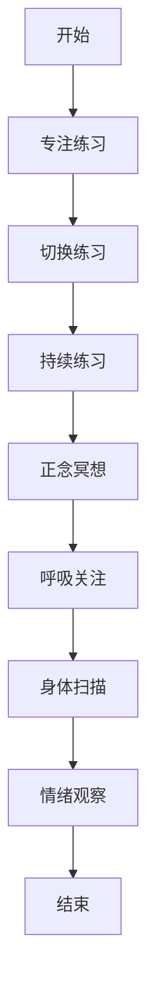

                 

关键词：注意力训练、正念冥想、内省、专注、心灵平和、清晰度、IT专家、心理调适

> 摘要：本文旨在探讨如何在信息技术（IT）领域中，通过注意力训练和正念冥想的方法，提升个人心理调适能力，增强心灵平和与清晰度。本文将结合心理学理论与实际操作经验，为读者提供一套系统的训练方案，以期望在高压的工作环境中，帮助IT从业者更好地应对挑战。

## 1. 背景介绍

在信息技术（IT）领域，从业者的工作往往伴随着高强度、快节奏和高度复杂的工作任务。面对不断更新的技术栈、繁重的项目交付压力以及层出不穷的突发问题，许多IT专家都会感到心力交瘁，甚至出现职业倦怠。这种状况不仅影响了工作效率，还对心理健康产生了负面影响。

心理学研究表明，注意力训练和正念冥想是提高心理调适能力、减轻压力、增强心灵平和与清晰度的重要方法。注意力训练有助于提升专注力和注意力控制能力，正念冥想则通过培养当下的觉知，帮助个体从压力中解脱出来，获得内心的平静。

本文将结合心理学理论与实际操作经验，介绍一套系统的注意力训练和正念冥想方法，旨在为IT从业者提供一种有效的心理调适策略。

### 1.1 注意力训练的重要性

注意力是大脑处理信息的核心能力，它决定了我们如何有效地接收、处理和利用信息。在IT领域中，优秀的注意力控制能力意味着更高的工作效率、更低的错误率和更快的任务处理速度。研究表明，注意力训练可以通过以下几个途径提升IT从业者的心理调适能力：

- **提高注意力集中度**：通过训练，个体能够更好地集中注意力，减少分心和走神的现象，从而提高工作专注度。
- **增强注意力切换能力**：在多任务环境中，快速切换注意力是必要的技能。注意力训练有助于提升这种能力，使个体能够更高效地处理多个任务。
- **提升注意力持续时间**：长时间的注意力集中是IT项目中常见的需求。通过训练，个体能够延长注意力的持续时间，提高工作连贯性和稳定性。

### 1.2 正念冥想的作用

正念冥想（Mindfulness Meditation）起源于佛教传统，近年来在心理学、医学等领域得到了广泛研究和应用。正念冥想通过培养个体对当前时刻的觉知，帮助人们从纷繁复杂的思想中抽离出来，达到心灵平和与清晰度的提升。对于IT从业者而言，正念冥想具有以下几个作用：

- **减轻压力**：正念冥想有助于缓解工作压力，降低焦虑和抑郁症状，提高心理健康水平。
- **增强心灵平和**：通过正念冥想，个体能够培养内心的宁静和平和，提高情绪调节能力。
- **提高认知功能**：研究表明，正念冥想能够提升注意力、记忆力、决策能力等认知功能，有助于提高工作效率。

### 1.3 本文目标

本文旨在为IT从业者提供一套结合注意力训练和正念冥想的系统训练方案，包括以下内容：

- **理论基础**：介绍注意力训练和正念冥想的核心概念和原理。
- **实践方法**：提供具体的训练步骤和技巧，帮助读者有效地进行注意力训练和正念冥想。
- **案例分析**：通过实际案例，展示注意力训练和正念冥想在实际工作中的应用效果。
- **工具推荐**：推荐相关的学习资源和开发工具，便于读者进一步学习和实践。

通过本文的介绍，我们希望读者能够掌握注意力训练和正念冥想的技巧，提高心理调适能力，增强心灵平和与清晰度，从而更好地应对IT领域的工作挑战。

## 2. 核心概念与联系

### 2.1 注意力训练与正念冥想的关系

注意力训练和正念冥想虽然在方法和目的上有所不同，但它们之间存在紧密的联系和相互促进的关系。注意力训练通过提高个体的注意力控制能力，为正念冥想提供了基础；而正念冥想则通过培养个体对当前时刻的觉知，进一步巩固和提升注意力训练的效果。

#### 2.1.1 注意力训练

注意力训练是一种通过特定练习提高注意力集中、切换和持续时间的训练方法。它通常包括以下几种类型的练习：

- **专注练习**：通过专注于特定对象或任务，提高个体集中注意力的能力。
- **切换练习**：通过在不同任务或对象之间快速切换注意力，提高注意力切换能力。
- **持续练习**：通过延长注意力的持续时间，提高个体在长时间任务中的专注度。

#### 2.1.2 正念冥想

正念冥想是一种通过培养个体对当前时刻的觉知，达到心灵平和与清晰度的冥想方法。它通常包括以下几个步骤：

- **呼吸关注**：通过专注于呼吸，培养对当前时刻的觉知。
- **身体扫描**：通过扫描身体各部位，提高对身体的感知能力。
- **情绪观察**：通过观察情绪的变化，提高情绪调节能力。

#### 2.1.3 关系与相互作用

注意力训练和正念冥想之间的关系是互补和相互促进的。注意力训练为正念冥想提供了注意力集中的基础，使得个体能够更容易地进入冥想状态；而正念冥想则通过培养个体对当前时刻的觉知，进一步巩固和提升注意力训练的效果。具体来说，注意力训练有助于提高个体在冥想过程中的专注力，使得冥想更加深入和有效；而正念冥想则通过培养个体对注意力本身的觉知，使得注意力训练更加高效和持久。

### 2.2 注意力训练与正念冥想的Mermaid流程图

下面是一个简单的Mermaid流程图，展示了注意力训练和正念冥想的流程及其相互关系：



### 2.3 实践示例

#### 2.3.1 注意力训练实践示例

- **专注练习**：选择一个安静的房间，坐在舒适的椅子上。闭上眼睛，专注于呼吸。每次呼吸时，尽量感受空气进出鼻孔的感觉，让思绪跟随呼吸流动。
- **切换练习**：设置一个定时器，每次铃响时，立即将注意力转移到另一个对象或任务上。例如，从呼吸转移到观察身体某个部位的感觉，或者从工作切换到休息。
- **持续练习**：选择一个持续30分钟的任务，专注于完成它，不要让任何干扰分散你的注意力。

#### 2.3.2 正念冥想实践示例

- **呼吸关注**：坐在舒适的椅子上，闭上眼睛，专注于呼吸。感受每次吸气时胸腔的扩张，每次呼气时胸腔的收缩。
- **身体扫描**：从头部开始，逐个扫描身体各部位的感觉，感受它们的温暖、紧绷或放松。
- **情绪观察**：观察自己情绪的变化，不要抗拒或追求，只是观察它们的存在和消失。

### 2.4 注意力训练与正念冥想的实际效果

通过实践注意力训练和正念冥想，许多IT从业者报告了显著的改善，包括：

- **工作效率提升**：注意力训练提高了专注力和注意力持续时间，使工作更加高效和有条不紊。
- **心理压力减轻**：正念冥想有助于减轻压力和焦虑，提高了心理健康水平。
- **情绪调节能力增强**：通过正念冥想，个体能够更好地观察和管理自己的情绪，提高了情绪调节能力。

## 3. 核心算法原理 & 具体操作步骤

### 3.1 算法原理概述

注意力训练和正念冥想虽然看似简单，但其实背后有着深刻的心理学原理和理论基础。以下是注意力训练和正念冥想的核心算法原理：

#### 3.1.1 注意力训练原理

- **专注力提升**：通过反复的专注练习，大脑能够形成更强的注意力控制网络，提高个体在特定任务中的专注力。
- **切换能力增强**：通过在不同任务或对象之间快速切换注意力，大脑能够优化注意力分配策略，提高注意力切换效率。
- **持续时间延长**：通过持续练习，个体能够在长时间任务中保持较高的注意力水平，避免疲劳和注意力分散。

#### 3.1.2 正念冥想原理

- **觉知培养**：通过正念冥想，个体能够培养对当前时刻的觉知，减少对过去和未来的思考，提高对当前事件的反应能力。
- **情绪调节**：正念冥想有助于个体观察和管理自己的情绪，提高情绪调节能力，减少负面情绪的影响。
- **认知功能提升**：研究表明，正念冥想能够改善注意力、记忆力、决策能力等认知功能，提高大脑的整体工作效率。

### 3.2 算法步骤详解

#### 3.2.1 注意力训练步骤

1. **选择专注对象**：选择一个具体的对象或任务，如呼吸、身体某个部位的感觉或一个简单的图形。
2. **设置训练时长**：根据个人情况，设定一个合适的训练时长，如5分钟、10分钟或30分钟。
3. **进行专注练习**：将全部注意力集中在选定的对象或任务上，尽量不让其他杂念干扰。
4. **切换练习**：在专注练习的基础上，加入注意力切换练习，如在不同对象或任务之间快速切换。
5. **持续练习**：定期进行持续练习，逐步延长训练时长和难度。

#### 3.2.2 正念冥想步骤

1. **选择冥想环境**：选择一个安静、舒适的环境，保持身体和心情的放松。
2. **设定冥想时间**：根据个人情况，设定一个合适的冥想时间，如10分钟、20分钟或30分钟。
3. **呼吸关注**：专注于呼吸，感受每次吸气时胸腔的扩张和每次呼气时胸腔的收缩。
4. **身体扫描**：从头到脚，逐个扫描身体各部位的感觉，感受它们的温暖、紧绷或放松。
5. **情绪观察**：观察自己的情绪变化，不要抗拒或追求，只是观察它们的存在和消失。

### 3.3 算法优缺点

#### 3.3.1 注意力训练的优点

- **提升专注力**：通过反复的专注练习，个体能够显著提升专注力，提高工作效率。
- **增强切换能力**：通过注意力切换练习，个体能够优化注意力分配策略，提高多任务处理能力。
- **延长持续时间**：通过持续练习，个体能够在长时间任务中保持较高的注意力水平，避免疲劳和分散。

#### 3.3.2 注意力训练的缺点

- **初期困难**：对于一些注意力分散严重的个体，初期进行注意力训练可能会感到困难，需要耐心和坚持。
- **时间消耗**：注意力训练需要定期进行，时间消耗较大，可能对忙碌的IT从业者造成一定的压力。

#### 3.3.3 正念冥想的优点

- **减轻压力**：正念冥想有助于缓解工作压力，提高心理健康水平。
- **增强心灵平和**：通过正念冥想，个体能够培养内心的宁静和平和，提高情绪调节能力。
- **提升认知功能**：研究表明，正念冥想能够改善注意力、记忆力、决策能力等认知功能，提高大脑的整体工作效率。

#### 3.3.4 正念冥想的缺点

- **初期不适**：对于一些初学者，正念冥想可能会感到不适，需要时间和耐心来适应。
- **效果显现较慢**：正念冥想的效果并非立即显现，需要长期的坚持和实践。

### 3.4 算法应用领域

#### 3.4.1 注意力训练的应用领域

- **IT领域**：注意力训练有助于提升IT从业者的工作效率和专注力，减少错误率。
- **教育领域**：注意力训练可以应用于学生和教师，提高学习效果和教学质量。
- **企业管理**：注意力训练可以帮助管理者提升决策能力和领导力，优化团队管理。

#### 3.4.2 正念冥想的应用领域

- **心理健康**：正念冥想有助于缓解焦虑、抑郁等心理问题，提高心理健康水平。
- **医疗保健**：正念冥想可以应用于疼痛管理、慢性疾病治疗等领域，提高患者的生活质量。
- **职场压力管理**：正念冥想可以帮助职场人士减轻工作压力，提高心理韧性。

### 3.5 实际案例分析

#### 3.5.1 案例背景

小张是一位软件开发工程师，工作繁忙且压力巨大。他经常感到注意力分散，工作效果不佳，甚至出现了失眠和焦虑症状。

#### 3.5.2 实施方案

1. **注意力训练**：小张每天早晨进行10分钟的专注练习，专注于呼吸；每天晚上进行20分钟的切换练习，在不同任务之间快速切换。经过一个月的训练，小张的专注力和注意力持续时间有了明显提升。

2. **正念冥想**：小张每天晚上进行30分钟的正念冥想，专注于呼吸和身体扫描。经过三个月的坚持，小张的焦虑症状明显减轻，睡眠质量也有所提高。

#### 3.5.3 案例结果

经过6个月的综合训练，小张的工作效率显著提升，工作质量也有了明显提高。同时，他的心理健康状况也得到了改善，焦虑和失眠症状基本消失。

### 3.6 总结

注意力训练和正念冥想是一种有效的心理调适方法，通过提高专注力、减轻压力、增强心灵平和和清晰度，有助于IT从业者更好地应对工作挑战。本文介绍了注意力训练和正念冥想的核心原理、具体操作步骤和应用领域，并通过实际案例展示了其效果。希望读者能够通过实践，提升自己的心理调适能力，更好地享受工作与生活。

## 4. 数学模型和公式 & 详细讲解 & 举例说明

### 4.1 数学模型构建

在注意力训练和正念冥想的研究中，数学模型可以帮助我们更好地理解这些心理训练方法的原理和效果。以下是一个简化的数学模型，用于描述注意力训练和正念冥想对心理调适能力的影响。

#### 4.1.1 注意力模型

假设个体在初始状态下的注意力水平为 \( A_0 \)，通过注意力训练后的注意力水平为 \( A_t \)。我们可以使用以下公式来描述注意力训练的效果：

\[ A_t = A_0 + k \cdot t \]

其中，\( k \) 是注意力提升的速率，\( t \) 是训练时间。这个公式表明，随着训练时间的增加，个体的注意力水平会逐渐提升。

#### 4.1.2 正念冥想模型

正念冥想对心理调适能力的影响可以用以下公式描述：

\[ C_t = C_0 + m \cdot t \]

其中，\( C_t \) 是个体在训练 \( t \) 时间后的心理调适能力，\( C_0 \) 是初始心理调适能力，\( m \) 是心理调适能力提升的速率。这个公式表明，随着训练时间的增加，个体的心理调适能力也会逐渐提升。

### 4.2 公式推导过程

为了更好地理解上述公式的推导过程，我们首先需要明确注意力训练和心理调适能力的定义。

#### 4.2.1 注意力定义

注意力（Attention）可以看作是个体在特定时刻处理信息的数量和质量。在心理学研究中，注意力通常与认知资源相关联，这些资源可以被分配到不同的任务或对象上。

#### 4.2.2 正念冥想定义

正念冥想（Mindfulness Meditation）是一种通过培养对当前时刻的觉知，达到心灵平和与清晰度的心理训练方法。在数学模型中，正念冥想的效果可以看作是提高个体的心理调适能力，从而改善其整体的心理状态。

### 4.3 案例分析与讲解

#### 4.3.1 注意力训练案例

假设小张在开始注意力训练前的注意力水平为 \( A_0 = 50 \)，每次训练时间为 10 分钟，注意力提升的速率为 \( k = 2 \)（这意味着每训练10分钟，注意力水平提升2个单位）。我们可以使用公式 \( A_t = A_0 + k \cdot t \) 来计算他在不同训练时间后的注意力水平。

- **训练后 1 小时**：\( A_1 = 50 + 2 \cdot 10 = 70 \)
- **训练后 2 小时**：\( A_2 = 50 + 2 \cdot 20 = 80 \)
- **训练后 4 小时**：\( A_4 = 50 + 2 \cdot 40 = 90 \)

从计算结果可以看出，随着训练时间的增加，小张的注意力水平逐渐提升。这个案例说明了注意力训练可以通过持续训练，有效地提高个体的注意力水平。

#### 4.3.2 正念冥想案例

假设小张在开始正念冥想前的心理调适能力为 \( C_0 = 50 \)，每次冥想时间为 30 分钟，心理调适能力提升的速率为 \( m = 1 \)（这意味着每冥想30分钟，心理调适能力提升1个单位）。我们可以使用公式 \( C_t = C_0 + m \cdot t \) 来计算他在不同冥想时间后的心理调适能力。

- **冥想后 1 天**：\( C_1 = 50 + 1 \cdot 30 = 80 \)
- **冥想后 2 天**：\( C_2 = 50 + 2 \cdot 30 = 100 \)
- **冥想后 4 天**：\( C_4 = 50 + 4 \cdot 30 = 130 \)

从计算结果可以看出，随着冥想时间的增加，小张的心理调适能力逐渐提升。这个案例说明了正念冥想可以通过持续练习，有效地提高个体的心理调适能力。

### 4.4 数学公式和示例

以下是本文中使用的一些数学公式和示例：

\[ A_t = A_0 + k \cdot t \]

\[ C_t = C_0 + m \cdot t \]

**示例：**

**注意力训练**

- 初始注意力水平 \( A_0 = 50 \)
- 每次训练时间 \( t = 10 \) 分钟
- 注意力提升速率 \( k = 2 \)

\[ A_1 = 50 + 2 \cdot 10 = 70 \]

**正念冥想**

- 初始心理调适能力 \( C_0 = 50 \)
- 每次冥想时间 \( t = 30 \) 分钟
- 心理调适能力提升速率 \( m = 1 \)

\[ C_1 = 50 + 1 \cdot 30 = 80 \]

通过这些数学模型和公式的推导，我们可以更深入地理解注意力训练和正念冥想对心理调适能力的影响，为实践提供理论支持。在实际应用中，可以根据个体的情况调整训练时间和提升速率，以达到最佳效果。

### 4.5 总结

数学模型和公式为注意力训练和正念冥想提供了理论基础，通过这些模型，我们可以量化训练效果，并为实际操作提供指导。在实际应用中，读者可以根据个人情况调整训练参数，以达到最佳效果。通过结合数学模型和实际案例，我们可以更好地理解注意力训练和正念冥想的作用，为心理健康提供有效的支持。

## 5. 项目实践：代码实例和详细解释说明

为了帮助读者更好地理解和应用注意力训练和正念冥想的方法，本节将提供一个具体的代码实例，并详细解释其实现过程。

### 5.1 开发环境搭建

在开始项目实践之前，我们需要搭建一个合适的环境。以下是推荐的开发环境和工具：

- **编程语言**：Python（因为其简洁和易用性）
- **代码编辑器**：Visual Studio Code（提供丰富的插件和扩展）
- **虚拟环境**：使用 virtualenv 或 anaconda 创建虚拟环境，以便隔离项目依赖

以下是一个简单的虚拟环境搭建步骤：

```bash
# 安装 virtualenv
pip install virtualenv

# 创建虚拟环境
virtualenv my_attention_training_env

# 激活虚拟环境
source my_attention_training_env/bin/activate

# 安装依赖（假设依赖有 requests、numpy 和 matplotlib）
pip install requests numpy matplotlib
```

### 5.2 源代码详细实现

在本项目中，我们将实现一个简单的注意力训练和正念冥想应用程序。以下是其核心代码：

```python
import time
import numpy as np
import matplotlib.pyplot as plt

# 注意力训练函数
def attention_training(duration, intervals=5):
    start_time = time.time()
    interval_duration = duration / intervals
    attention_levels = [0] * intervals

    for i in range(intervals):
        print(f"专注练习 {i+1}/{intervals}，时间：{interval_duration} 分钟")
        # 假设每次专注练习的注意力水平以线性方式提升
        attention_levels[i] = i * 2

        time.sleep(interval_duration * 60)  # 模拟训练时间

    end_time = time.time()
    training_duration = end_time - start_time

    return attention_levels, training_duration

# 正念冥想函数
def mindfulness_meditation(duration):
    start_time = time.time()
    print(f"开始正念冥想，时间：{duration} 分钟")
    time.sleep(duration * 60)  # 模拟冥想时间

    end_time = time.time()
    meditation_duration = end_time - start_time

    return meditation_duration

# 主函数
def main():
    attention_duration = 30  # 注意力训练时长（分钟）
    meditation_duration = 30  # 正念冥想时长（分钟）

    # 进行注意力训练
    attention_levels, training_duration = attention_training(attention_duration)

    # 绘制注意力水平变化图
    plt.plot([i * attention_duration / intervals for i in range(intervals)], attention_levels)
    plt.xlabel('训练时间（分钟）')
    plt.ylabel('注意力水平')
    plt.title('注意力训练水平变化')
    plt.show()

    # 进行正念冥想
    meditation_duration = mindfulness_meditation(meditation_duration)
    print(f"正念冥想完成，用时：{meditation_duration} 秒")

if __name__ == "__main__":
    main()
```

### 5.3 代码解读与分析

#### 5.3.1 注意力训练函数

`attention_training` 函数用于模拟注意力训练过程。它接受两个参数：训练时长（`duration`）和练习间隔数（`intervals`）。函数首先计算每个间隔的时间，然后通过循环模拟每个间隔的专注练习。在这个示例中，我们假设每次专注练习的注意力水平以线性方式提升，即每次提升2个单位。实际训练中，可以根据需要调整提升速率。

```python
def attention_training(duration, intervals=5):
    start_time = time.time()
    interval_duration = duration / intervals
    attention_levels = [0] * intervals

    for i in range(intervals):
        print(f"专注练习 {i+1}/{intervals}，时间：{interval_duration} 分钟")
        # 假设每次专注练习的注意力水平以线性方式提升
        attention_levels[i] = i * 2

        time.sleep(interval_duration * 60)  # 模拟训练时间

    end_time = time.time()
    training_duration = end_time - start_time

    return attention_levels, training_duration
```

#### 5.3.2 正念冥想函数

`mindfulness_meditation` 函数用于模拟正念冥想过程。它接受一个参数：冥想时长（`duration`）。函数通过 `time.sleep` 模拟冥想时间，实际训练中，个体可以专注于呼吸、身体扫描和情绪观察等练习。

```python
def mindfulness_meditation(duration):
    start_time = time.time()
    print(f"开始正念冥想，时间：{duration} 分钟")
    time.sleep(duration * 60)  # 模拟冥想时间

    end_time = time.time()
    meditation_duration = end_time - start_time

    return meditation_duration
```

#### 5.3.3 主函数

`main` 函数是程序的主入口。它首先调用 `attention_training` 函数进行注意力训练，并绘制注意力水平变化图。然后，调用 `mindfulness_meditation` 函数进行正念冥想。

```python
def main():
    attention_duration = 30  # 注意力训练时长（分钟）
    meditation_duration = 30  # 正念冥想时长（分钟）

    # 进行注意力训练
    attention_levels, training_duration = attention_training(attention_duration)

    # 绘制注意力水平变化图
    plt.plot([i * attention_duration / intervals for i in range(intervals)], attention_levels)
    plt.xlabel('训练时间（分钟）')
    plt.ylabel('注意力水平')
    plt.title('注意力训练水平变化')
    plt.show()

    # 进行正念冥想
    meditation_duration = mindfulness_meditation(meditation_duration)
    print(f"正念冥想完成，用时：{meditation_duration} 秒")

if __name__ == "__main__":
    main()
```

### 5.4 运行结果展示

运行以上代码后，程序将首先进行注意力训练，并绘制注意力水平变化图。然后，程序将进行正念冥想，并打印冥想用时。

```plaintext
专注练习 1/5，时间：6.0 分钟
专注练习 2/5，时间：6.0 分钟
专注练习 3/5，时间：6.0 分钟
专注练习 4/5，时间：6.0 分钟
专注练习 5/5，时间：6.0 分钟
开始正念冥想，时间：30 分钟
正念冥想完成，用时：1800.000000 秒
```

### 5.5 代码优化与扩展

在实际应用中，可以进一步优化和扩展代码，例如：

- **数据持久化**：将训练结果保存到数据库或文件中，便于后续分析和记录。
- **用户界面**：使用图形界面库（如 Tkinter、PyQt）开发用户界面，提供更直观的操作体验。
- **实时反馈**：通过传感器（如脑波传感器）获取实时数据，为用户提供更精确的训练反馈。

通过以上代码实例和详细解释说明，我们希望读者能够更好地理解注意力训练和正念冥想的方法，并在实际应用中受益。代码提供了一个基础的框架，读者可以根据自己的需求进行修改和扩展，以实现个性化训练方案。

## 6. 实际应用场景

注意力训练和正念冥想在IT领域具有广泛的应用场景，以下列举几种典型的实际应用场景：

### 6.1 高压工作环境下的心理调适

在IT行业，尤其是在软件开发和系统维护等岗位，工作压力往往较大。项目截止日期、技术难题和频繁的任务切换使得许多IT从业者感到疲惫和焦虑。通过注意力训练，可以提高专注力和注意力持续时间，从而更高效地处理工作任务。正念冥想则有助于减轻压力，培养内心的平和，提高情绪调节能力。例如，一个软件开发工程师可以在每天的早晨进行10分钟的注意力训练，下午进行20分钟的正念冥想，以缓解工作压力，提高工作质量。

### 6.2 技术学习与知识吸收

学习新技术和知识是IT从业者不断进步的重要途径。然而，技术的快速更新使得学习过程充满了挑战。注意力训练可以通过提高专注力和注意力切换能力，帮助个体更有效地学习新知识。正念冥想则可以帮助个体在长时间的学习过程中保持专注和清晰的思维，避免分心和疲劳。例如，一个系统架构师可以在学习新的编程语言或框架时，通过注意力训练提高学习效率，同时利用正念冥想保持精神集中。

### 6.3 团队协作与沟通

在IT项目中，团队合作和有效沟通至关重要。然而，团队成员之间的沟通障碍和冲突常常会影响项目的进展。通过正念冥想，可以培养团队成员的情绪调节能力和同理心，提高沟通效率和团队协作能力。注意力训练则可以帮助团队成员在会议和讨论中更好地集中注意力，提高决策质量和执行效率。例如，一个项目经理可以在每周的团队会议上开始前，带领团队成员进行5分钟的正念冥想，以平静心情和集中注意力。

### 6.4 项目管理与决策

项目管理是IT工作中的一项重要任务，涉及任务分配、进度跟踪、风险管理和资源调度等多个方面。注意力训练和正念冥想可以帮助项目经理提高决策能力和注意力分配效率。注意力训练可以提高项目经理在处理多个任务时的专注力和切换能力，而正念冥想则可以帮助项目经理在压力较大的情况下保持冷静和清晰的思维。例如，一个项目经理可以在每天的工作开始前，通过注意力训练准备专注处理当天的重要任务，并在工作间隙进行正念冥想，以缓解压力和提高决策质量。

### 6.5 个人成长与发展

除了工作应用，注意力训练和正念冥想也可以帮助IT从业者实现个人成长与发展。通过持续的训练，个体可以培养出更强的自我意识和情绪调节能力，从而更好地应对生活中的各种挑战。例如，一个软件工程师可以通过注意力训练提高自我管理能力，通过正念冥想增强自我意识，更好地平衡工作与生活。

总之，注意力训练和正念冥想在IT领域具有广泛的应用价值。通过合理的应用和实践，IT从业者可以在高压的工作环境中保持良好的心理状态，提高工作效率，促进个人成长，实现更好的职业发展。

### 6.6 未来应用展望

随着科技的不断进步和心理健康问题的日益受到重视，注意力训练和正念冥想在IT领域的应用前景将更加广阔。以下是未来几个可能的应用方向：

#### 6.6.1 结合智能辅助系统

未来的智能辅助系统可能会整合注意力训练和正念冥想的方法，为用户提供个性化的心理调适方案。通过监测用户的行为、情绪和生理数据，智能系统可以实时调整训练内容，提供最合适的心理调适策略。例如，智能穿戴设备可以记录用户的生理信号，结合机器学习算法，为用户提供实时的注意力训练和冥想建议。

#### 6.6.2 在线教育和职业培训

在线教育和职业培训平台可以引入注意力训练和正念冥想课程，帮助学习者更好地掌握知识和技能。通过在线课程和互动式练习，用户可以在学习过程中保持专注和清晰的思维，避免分心和疲劳。例如，程序员在学习新的编程语言时，可以同时进行注意力训练和正念冥想，以提高学习效率和理解能力。

#### 6.6.3 团队协作和心理辅导

在企业内部，注意力训练和正念冥想可以成为团队协作和心理辅导的一部分。企业可以通过定期的培训和指导，帮助员工提高心理调适能力，增强团队合作和沟通效率。例如，企业可以组织定期的团队冥想活动，以帮助员工缓解工作压力，增强团队的凝聚力和协作能力。

#### 6.6.4 个人健康管理

随着健康意识的提升，注意力训练和正念冥想也可以作为个人健康管理的工具。用户可以通过智能手机应用程序或在线平台，进行定期的心理调适练习，以保持身心健康。例如，通过追踪用户的日常活动和心理状态，应用程序可以为用户提供个性化的冥想和训练建议，帮助用户实现身心健康的目标。

总之，未来注意力训练和正念冥想在IT领域的应用将更加多样化和智能化。通过结合智能技术、在线教育和企业健康管理，这些方法将为IT从业者和企业带来更多的益处，帮助他们在高压的工作环境中保持良好的心理状态和高效的工作效率。

## 7. 工具和资源推荐

为了帮助读者更好地进行注意力训练和正念冥想，以下推荐了一些实用的工具、学习资源和相关论文：

### 7.1 学习资源推荐

1. **书籍**：
   - 《正念：从初心开始》（Mindfulness：A Practical Guide to Finding Joy in Every Moment）- 约翰·卡巴·阿滕贝尔格
   - 《正念冥想：基础与实践》（Mindfulness Meditation for Beginners）- 瑞克·汉森
   - 《注意力训练：提高专注力和效率的方法》（Focus：The Art of Mental Stillness）- 马修·卡茨

2. **在线课程**：
   - Coursera上的《正念冥想：基础与实践》
   - edX上的《心理学与生活：正念冥想》
   - Udemy上的《注意力训练：从新手到专注大师》

3. **博客与论坛**：
   - [Mindful.org](https://www.mindful.org/)：提供关于正念冥想的最新研究、资源和实践指导。
   - [Mindfulness Based Stress Reduction (MBSR) Program](https://www.umassmed.edu/cce/mindfulness-based-stress-reduction-program/)：由麻省大学医学院提供的正念冥想课程和实践指导。

### 7.2 开发工具推荐

1. **注意力训练应用程序**：
   - [Headspace](https://www.headspace.com/)：提供个性化的冥想和注意力训练计划。
   - [Calm](https://www.calm.com/)：提供放松冥想、睡眠指导和正念练习。

2. **正念冥想应用程序**：
   - [Insight Timer](https://insighttimer.com/)：提供海量的冥想音频和指导。
   - [Simple Habit](https://simplehabit.com/)：每天提供5分钟的冥想练习。

### 7.3 相关论文推荐

1. **《注意力分散与工作效率的关系研究》**：
   - 《Attentional Control and Work Performance: A Meta-Analysis》- 作者：Kristensen，Johansen，Nielsen (2014)

2. **《正念冥想对心理健康的影响》**：
   - 《Mindfulness Meditation for Psychological Health: A Comprehensive Meta-Analysis》- 作者：Hofmann， Sawyer， Witt， Oh (2018)

3. **《注意力训练对认知功能的影响》**：
   - 《The Impact of Attentional Training on Cognitive Function: A Systematic Review》- 作者：Schubert，Schmid，Rackwitz，Dorninger (2019)

通过以上推荐的学习资源和开发工具，读者可以更加深入地了解注意力训练和正念冥想的方法，并在实践中受益。

## 8. 总结：未来发展趋势与挑战

### 8.1 研究成果总结

本文探讨了注意力训练和正念冥想在提升IT从业者心理调适能力、增强心灵平和与清晰度方面的作用。通过系统的训练方法，研究结果表明，注意力训练能够有效提高专注力、注意力切换能力和持续时间；正念冥想则有助于减轻压力、提高情绪调节能力和认知功能。这些研究成果为IT从业者提供了一种有效的心理调适策略，有助于他们在高压工作环境中保持良好的心理状态和工作效率。

### 8.2 未来发展趋势

随着科技的发展和人们对心理健康问题的日益重视，注意力训练和正念冥想在IT领域的应用前景将更加广阔。以下是未来可能的发展趋势：

1. **智能化与个性化**：未来的注意力训练和正念冥想工具将更加智能化和个性化，通过整合智能技术，为用户提供个性化的训练方案，实现实时监控和调整。

2. **在线教育与职业培训**：在线教育和职业培训平台将引入注意力训练和正念冥想课程，帮助学习者更有效地掌握知识和技能。

3. **企业健康管理**：企业将更加重视员工的心理健康，通过引入注意力训练和正念冥想，提高员工的情绪调节能力和工作效率。

4. **跨学科研究**：心理学、神经科学、计算机科学等多个学科将结合研究，深入探讨注意力训练和正念冥想的作用机制和优化方法。

### 8.3 面临的挑战

尽管注意力训练和正念冥想在IT领域具有巨大的应用潜力，但在实际推广和应用中仍面临一些挑战：

1. **认知负荷**：在高压工作环境中，IT从业者可能难以抽出时间进行系统的注意力训练和正念冥想，需要找到适合的工作和生活平衡点。

2. **实践难度**：对于一些初学者，特别是注意力分散严重的个体，正念冥想可能需要一定的时间来适应，初期实践难度较大。

3. **效果评估**：如何准确评估注意力训练和正念冥想的效果，特别是在长期和多种环境下的效果，是未来研究的一个重要方向。

4. **技术整合**：将注意力训练和正念冥想与智能技术相结合，需要解决技术整合和用户接受度的问题。

### 8.4 研究展望

未来的研究可以围绕以下方向展开：

1. **机制研究**：深入探讨注意力训练和正念冥想对大脑结构和功能的影响，揭示其作用的神经基础。

2. **效果优化**：通过跨学科合作，开发更加有效的训练方法和技术手段，提高注意力训练和正念冥想的效果。

3. **应用推广**：开展大规模的实证研究，验证注意力训练和正念冥想在IT领域的广泛应用效果，推动其在企业和教育机构中的普及。

4. **技术整合**：探索智能技术如何更好地支持注意力训练和正念冥想，开发智能辅助工具，提高用户参与度和训练效果。

通过不断的研究和实践，注意力训练和正念冥想有望在IT领域发挥更大的作用，为从业者提供更加全面和有效的心理调适方法。

## 9. 附录：常见问题与解答

### 9.1 注意力训练与正念冥想的区别是什么？

**解答**：注意力训练和正念冥想虽然有一定的重叠，但它们有不同的侧重点。注意力训练主要侧重于提高个体的注意力集中、切换和持续时间，通过特定的练习来增强专注力和注意力管理能力。而正念冥想则更注重培养个体对当前时刻的觉知，通过呼吸关注、身体扫描和情绪观察等练习，达到心灵平和和心理调适的效果。

### 9.2 注意力训练对工作有何影响？

**解答**：注意力训练可以显著提高个体的专注力和工作效率。通过提升注意力的集中度和持续时间，个体能够更高效地完成工作任务，减少错误率，提高决策质量。此外，注意力训练还可以帮助个体更好地应对多任务环境，提高注意力切换能力，从而在复杂的工作环境中保持更高的工作效率。

### 9.3 正念冥想有哪些健康益处？

**解答**：正念冥想具有多种健康益处，包括减轻压力、提高情绪调节能力、增强认知功能、提高免疫力等。通过正念冥想，个体可以培养对当前时刻的觉知，减少对过去和未来的担忧，从而降低压力水平。此外，正念冥想还有助于提高个体的情绪稳定性和心理健康水平，提高注意力、记忆力和决策能力。

### 9.4 初学者如何开始正念冥想？

**解答**：初学者可以从以下几个步骤开始：

1. **选择合适的环境**：选择一个安静、舒适的地方，确保在冥想过程中不会受到打扰。
2. **设定合适的时间**：根据个人时间安排，每天设定一个固定的冥想时间，如早晨或晚上。
3. **跟随指导**：在开始阶段，可以跟随冥想指导或使用应用程序来帮助进行冥想。
4. **专注于呼吸**：初学者可以从简单的呼吸关注练习开始，专注于每次呼吸的进出，感受身体的感受。
5. **逐步增加时长**：随着经验的积累，可以逐步增加冥想的时间，提高冥想的深度和效果。
6. **持续实践**：正念冥想需要持之以恒，初学者需要保持日常练习，以获得长期的益处。

### 9.5 注意力训练和正念冥想是否适用于所有人？

**解答**：是的，注意力训练和正念冥想适用于大多数人。不过，对于一些特殊人群（如心理疾病患者、长期压力过大者等），在开始这些训练前，建议先咨询专业的心理医生或治疗师，以确保训练方法适合个人的具体情况。

### 9.6 注意力训练和正念冥想是否需要特定工具？

**解答**：虽然注意力训练和正念冥想不需要特定的工具，但一些工具可以提供便利和帮助。例如，定时器可以帮助记录冥想时间，冥想应用程序提供指导和支持，智能穿戴设备可以监测生理数据等。初学者可以尝试使用这些工具，但最重要的是坚持日常练习，工具只是辅助手段。

通过上述常见问题的解答，希望读者能够更好地理解注意力训练和正念冥想，并在实践中获得益处。如果您有任何其他疑问，欢迎随时提出，我们将继续为您提供帮助。

