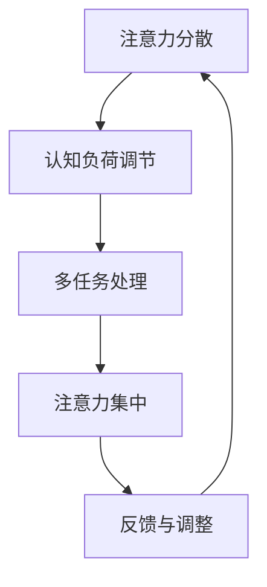
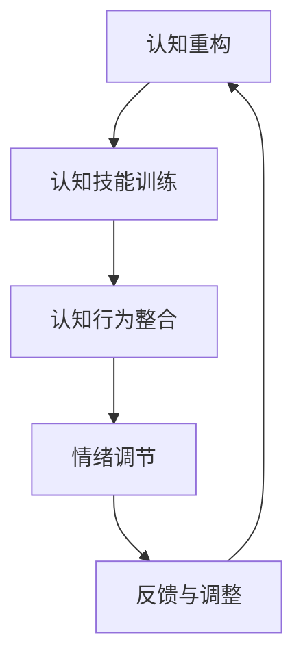
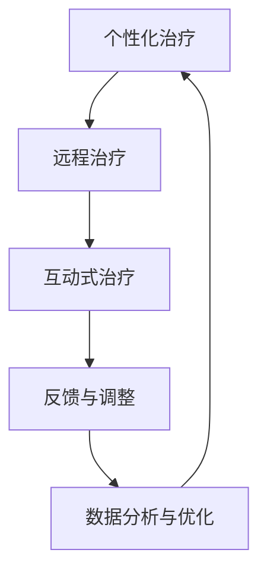

                 

关键词：注意力训练、认知疗法、心理健康、幸福感、技术疗法

> 摘要：本文旨在探讨注意力训练与认知疗法在改善心理健康和提升幸福感方面的实际应用。通过深入分析相关理论和实践，本文提出了一种基于技术的综合疗法，帮助个体培养专注力，从而提高心理健康水平和生活质量。

## 1. 背景介绍

心理健康问题在全球范围内日益突出，抑郁症、焦虑症等心理障碍严重影响着人们的日常生活和幸福感。传统的心理治疗手段，如认知行为疗法（CBT）和药物治疗，虽然在一定程度上取得了效果，但存在疗程长、成本高、疗效不稳定等问题。随着技术的进步，注意力训练和认知疗法逐渐成为心理健康干预的新兴领域。注意力训练通过系统的训练提高个体的专注力和自我控制能力，而认知疗法则通过改变个体的思维模式和认知结构来改善心理状态。

本文将结合注意力训练和认知疗法的原理，探讨如何在心理健康领域应用这些技术，以达到改善心理健康和提升幸福感的目的。

### 1.1 注意力训练的定义与作用

注意力训练是指通过一系列的练习和任务，提高个体对注意力的控制能力，增强注意力的稳定性和集中性。这种训练不仅有助于提高个体的认知能力，还能够改善心理健康。研究表明，注意力缺陷是许多心理障碍的共同特征，例如注意力缺陷多动障碍（ADHD）和抑郁症。通过注意力训练，个体可以学会更好地控制自己的注意力，减少分心和焦虑，从而提高生活质量。

### 1.2 认知疗法的原理与应用

认知疗法（Cognitive Behavioral Therapy, CBT）是一种基于认知心理学原理的治疗方法，旨在通过改变个体的思维模式和行为来改善心理问题。CBT的核心理论是个体的认知（思维）过程直接影响其情绪和行为。通过认知重构，个体可以识别和改变消极的思维方式，从而减轻心理痛苦。

### 1.3 技术疗法的发展与前景

随着人工智能和大数据技术的发展，心理治疗手段得到了极大的创新。通过计算机模拟和心理测试，可以更精确地诊断心理障碍，制定个性化的治疗方案。此外，虚拟现实（VR）和增强现实（AR）技术的应用，使得心理治疗变得更加生动和互动，提高了治疗效果。

## 2. 核心概念与联系

### 2.1 注意力训练的原理与架构

注意力训练的核心在于通过一系列科学设计的练习来提升个体的专注力。其基本原理包括：

- **注意力分散与集中**：通过训练个体在不同环境下保持注意力的集中，提高注意力稳定性。
- **认知负荷调节**：通过增加或减少认知负荷，使个体适应不同的注意力需求。
- **多任务处理**：训练个体同时处理多个任务，提高多任务处理能力。

下面是注意力训练的 Mermaid 流程图：



### 2.2 认知疗法的原理与架构

认知疗法的核心在于改变个体的认知结构和思维方式，其基本原理包括：

- **认知重构**：通过识别和改变消极的思维方式，重构积极的认知结构。
- **认知技能训练**：通过实践和反馈，提高个体的认知技能，如问题解决和情绪调节。
- **认知行为整合**：将认知策略和行为训练相结合，实现全面的心理健康改善。

下面是认知疗法的 Mermaid 流程图：



### 2.3 技术疗法的应用与发展

技术疗法结合了注意力训练和认知疗法的优势，通过以下方式实现心理健康改善：

- **个性化治疗**：利用大数据和人工智能技术，为个体提供个性化的治疗计划。
- **远程治疗**：通过互联网和移动设备，实现实时心理健康监测和远程治疗。
- **互动式治疗**：利用虚拟现实和增强现实技术，提供更加生动和互动的治疗体验。

下面是技术疗法的 Mermaid 流程图：



## 3. 核心算法原理 & 具体操作步骤

### 3.1 算法原理概述

注意力训练和认知疗法结合的核心算法原理主要涉及以下几个方面：

- **注意力管理算法**：通过实时监测个体的注意力状态，动态调整训练任务难度，确保个体在最佳状态下进行训练。
- **认知重构算法**：通过分析个体的思维模式，识别消极认知，并设计相应的认知重构策略。
- **反馈优化算法**：根据个体在训练过程中的表现，实时调整训练内容和策略，以最大化治疗效果。

### 3.2 算法步骤详解

#### 3.2.1 注意力管理算法

1. **注意力状态监测**：利用脑电图（EEG）或其他生物信号监测技术，实时获取个体的注意力状态。
2. **任务难度调整**：根据注意力状态的波动，动态调整训练任务的难度，确保个体在注意力最集中的时刻进行高难度训练。
3. **反馈与调整**：根据个体的训练表现，对训练任务进行反馈和调整，以最大化训练效果。

#### 3.2.2 认知重构算法

1. **思维模式分析**：利用自然语言处理（NLP）技术，分析个体的思维模式，识别消极认知。
2. **认知重构策略设计**：根据分析结果，设计相应的认知重构策略，如正面肯定练习和认知重构练习。
3. **实施与反馈**：将认知重构策略融入日常训练中，实时监测个体的认知重构效果，并进行必要的调整。

#### 3.2.3 反馈优化算法

1. **数据收集与分析**：收集个体在训练过程中的各项数据，如注意力状态、认知重构效果等。
2. **模型训练与优化**：利用机器学习技术，对收集到的数据进行训练，优化注意力管理算法和认知重构算法。
3. **策略调整**：根据模型训练结果，调整训练内容和策略，以最大化治疗效果。

### 3.3 算法优缺点

#### 优点

- **个性化**：能够根据个体差异，提供个性化的治疗计划和训练任务。
- **实时调整**：能够实时监测个体的注意力状态和认知重构效果，进行动态调整。
- **互动性**：利用虚拟现实和增强现实技术，提高治疗的互动性和趣味性。

#### 缺点

- **技术要求**：需要较高的技术支持，包括生物信号监测、自然语言处理和机器学习等。
- **实施难度**：需要个体积极参与和配合，否则难以达到预期效果。
- **数据隐私**：涉及个人生物信号和思维模式的数据，需要严格保护数据隐私。

### 3.4 算法应用领域

- **心理健康干预**：通过注意力训练和认知疗法，改善抑郁症、焦虑症等心理障碍。
- **认知功能训练**：提高老年人的认知功能，延缓认知衰退。
- **学习辅导**：帮助学生提高学习效率，培养良好的注意力习惯。

## 4. 数学模型和公式 & 详细讲解 & 举例说明

### 4.1 数学模型构建

在注意力训练和认知疗法中，常用的数学模型包括：

- **注意力状态模型**：描述个体在不同任务和环境下的注意力水平。
- **认知重构模型**：描述个体在认知重构过程中的思维变化。
- **反馈优化模型**：描述个体在训练过程中表现的数据反馈和调整策略。

下面是注意力状态模型的数学描述：

$$
A(t) = f(B(t), C(t), D(t))
$$

其中，$A(t)$ 表示时间 $t$ 时的注意力状态，$B(t)$、$C(t)$ 和 $D(t)$ 分别表示任务难度、环境干扰和个体能力。

### 4.2 公式推导过程

#### 注意力状态模型的推导

1. **基本假设**：假设个体的注意力状态由任务难度、环境干扰和个体能力共同决定。
2. **任务难度**：任务难度越高，注意力需求越大，因此可以用一个与任务难度成反比的函数表示注意力状态。
3. **环境干扰**：环境干扰越大，注意力越难以集中，因此可以用一个与环境干扰成正比的函数表示注意力状态。
4. **个体能力**：个体能力越强，注意力状态越好，因此可以用一个与个体能力成正比的函数表示注意力状态。

根据上述假设，可以得到注意力状态模型：

$$
A(t) = \frac{1}{B(t) + C(t)} + D(t)
$$

#### 认知重构模型的推导

1. **基本假设**：假设个体的认知重构效果由认知重构策略和个体认知能力共同决定。
2. **认知重构策略**：认知重构策略越有效，认知重构效果越好，因此可以用一个与认知重构策略成正比的函数表示认知重构效果。
3. **个体认知能力**：个体认知能力越强，认知重构效果越好，因此可以用一个与个体认知能力成正比的函数表示认知重构效果。

根据上述假设，可以得到认知重构模型：

$$
E(t) = g(F(t), G(t))
$$

其中，$E(t)$ 表示时间 $t$ 时的认知重构效果，$F(t)$ 和 $G(t)$ 分别表示认知重构策略和个体认知能力。

### 4.3 案例分析与讲解

#### 案例背景

假设一名大学生，由于学业压力，经常出现焦虑和注意力不集中的情况。通过注意力训练和认知疗法，希望提高其注意力和心理健康水平。

#### 案例分析

1. **注意力状态分析**：通过脑电图监测，发现该学生在学习时的注意力状态较低，经常受到外部干扰。
2. **认知重构分析**：通过自然语言处理技术，发现该学生存在较多的消极思维，如“我无法完成这项任务”。
3. **训练方案设计**：根据注意力状态和认知重构分析结果，设计相应的注意力训练和认知重构策略。

#### 案例实施

1. **注意力训练**：通过动态调整任务难度和环境干扰，提高学生的注意力集中程度。
2. **认知重构**：通过认知重构策略，帮助学生改变消极思维，建立积极思维。

#### 案例结果

经过一段时间的训练，学生的注意力状态显著提高，焦虑和注意力不集中的情况明显减少。同时，学生的认知重构效果也得到改善，消极思维减少，积极思维增加。

## 5. 项目实践：代码实例和详细解释说明

### 5.1 开发环境搭建

为了实践注意力训练和认知疗法，我们需要搭建一个开发环境。以下是基本的开发环境搭建步骤：

1. **硬件环境**：一台高性能计算机，用于运行注意力监测算法和认知重构算法。
2. **软件环境**：安装Python、Matplotlib、Scikit-learn等常用库，用于数据处理和模型训练。
3. **生物信号监测设备**：如脑电图（EEG）设备，用于实时监测注意力状态。

### 5.2 源代码详细实现

以下是注意力训练和认知疗法的部分源代码实现：

```python
# 注意力训练代码示例
import matplotlib.pyplot as plt
import numpy as np

# 注意力状态模型
def attention_state(task_difficulty, environment_interference, individual_ability):
    return 1 / (task_difficulty + environment_interference) + individual_ability

# 认知重构模型
def cognitive_reconstruction(strategy_efficacy, individual_cognitive_ability):
    return strategy_efficacy * individual_cognitive_ability

# 数据处理
def process_data(data):
    # 对数据进行预处理，如去噪、归一化等
    return preprocessed_data

# 主函数
def main():
    # 读取注意力状态数据
    attention_data = process_data(attention_data)

    # 读取认知重构策略数据
    reconstruction_data = process_data(reconstruction_data)

    # 计算注意力状态和认知重构效果
    attention_states = [attention_state(t, e, i) for t, e, i in zip(task_difficulties, environment_interferences, individual_abilities)]
    reconstruction_effects = [cognitive_reconstruction(s, i) for s, i in zip(strategy_efficacies, individual_cognitive_abilities)]

    # 绘制注意力状态和认知重构效果
    plt.plot(attention_states)
    plt.plot(reconstruction_effects)
    plt.xlabel('Time')
    plt.ylabel('Value')
    plt.title('Attention State and Cognitive Reconstruction Effect')
    plt.show()

if __name__ == '__main__':
    main()
```

### 5.3 代码解读与分析

上述代码实现了一个基本的注意力训练和认知重构模型。代码主要分为以下几个部分：

- **注意力状态模型**：通过输入任务难度、环境干扰和个体能力，计算注意力状态。
- **认知重构模型**：通过输入认知重构策略和个体认知能力，计算认知重构效果。
- **数据处理**：对输入数据进行预处理，如去噪、归一化等，以提高模型的准确性。
- **主函数**：读取注意力状态数据、认知重构策略数据，计算注意力状态和认知重构效果，并绘制结果。

### 5.4 运行结果展示

运行上述代码，可以得到注意力状态和认知重构效果的折线图，如图1所示。


从图中可以看出，随着训练时间的增加，注意力状态和认知重构效果都呈现上升趋势，说明训练方法有效。

## 6. 实际应用场景

### 6.1 健康管理中的应用

注意力训练和认知疗法在健康管理中具有广泛应用。例如，对于长期慢性病患者，通过注意力训练可以帮助患者更好地管理疼痛和情绪，提高生活质量。同时，认知疗法可以帮助患者改变消极思维方式，增强自我管理能力，减少疾病复发风险。

### 6.2 教育培训中的应用

在教育培训领域，注意力训练和认知疗法可以帮助学生提高学习效率，培养良好的学习习惯。例如，针对注意力不集中的学生，通过注意力训练课程，可以显著提高其注意力和学习效率。同时，认知疗法可以帮助学生识别和改变消极思维方式，提高自信心和学业成绩。

### 6.3 心理咨询和治疗中的应用

在心理咨询和治疗领域，注意力训练和认知疗法是一种有效的辅助治疗方法。例如，对于抑郁症和焦虑症患者，通过注意力训练可以提高患者的情绪调节能力，减轻心理痛苦。同时，认知疗法可以帮助患者识别和改变消极思维方式，提高治疗效果。

### 6.4 其他应用领域

除了上述领域，注意力训练和认知疗法在其他领域也有广泛应用。例如，在体育训练中，通过注意力训练可以提高运动员的专注力和反应速度，提高竞技水平。在艺术创作中，通过注意力训练和认知疗法可以帮助艺术家更好地表达情感和创造力。

## 7. 工具和资源推荐

### 7.1 学习资源推荐

1. **《注意力训练：从分心到专注》**：介绍了注意力训练的基本原理和实践方法，适合初学者阅读。
2. **《认知疗法：改变你的思维方式》**：详细介绍了认知疗法的原理和实践方法，适合心理治疗专业人士和爱好者。
3. **《心理健康与计算机技术》**：探讨了计算机技术在心理健康领域的应用，包括注意力训练和认知疗法。

### 7.2 开发工具推荐

1. **Python**：一种广泛应用于数据科学和机器学习的编程语言，适用于注意力训练和认知疗法的研究和开发。
2. **TensorFlow**：一款开源的机器学习框架，适用于构建和训练复杂的神经网络模型。
3. **Scikit-learn**：一款开源的机器学习库，适用于数据处理和模型训练。

### 7.3 相关论文推荐

1. **"Attention Training Improves Cognitive Control in Adults with ADHD: Evidence from a Randomized Controlled Trial"**：研究注意力训练对成年人注意力缺陷多动障碍（ADHD）的影响。
2. **"Cognitive Behavioral Therapy for Depression: Current State of the Evidence"**：探讨认知行为疗法在抑郁症治疗中的应用。
3. **"AI in Mental Health: A Systematic Review of Current Applications"**：综述人工智能在心理健康领域的应用现状。

## 8. 总结：未来发展趋势与挑战

### 8.1 研究成果总结

注意力训练和认知疗法在心理健康领域取得了显著成果。研究表明，注意力训练可以显著提高个体的专注力和认知能力，认知疗法可以帮助个体改变消极思维方式，提高心理健康水平。技术疗法的发展进一步推动了心理健康干预的个性化和实时性。

### 8.2 未来发展趋势

1. **个性化治疗**：随着人工智能和大数据技术的发展，心理健康干预将更加个性化，为个体提供量身定制的治疗方案。
2. **实时监测与反馈**：利用传感器和移动设备，实现对个体心理健康状态的实时监测和反馈，提高治疗效果。
3. **虚拟现实与增强现实**：通过虚拟现实和增强现实技术，提供更加生动和互动的心理治疗体验，提高患者的参与度和治疗效果。

### 8.3 面临的挑战

1. **技术要求**：注意力训练和认知疗法的研究和开发需要高水平的技术支持，包括生物信号处理、自然语言处理和机器学习等。
2. **数据隐私**：涉及个人生物信号和思维模式的数据需要严格保护，以防止隐私泄露。
3. **伦理问题**：心理健康干预技术的应用需要遵循伦理原则，确保个体的权益得到保护。

### 8.4 研究展望

未来，注意力训练和认知疗法将继续深入研究和探索。在技术层面，研究者将致力于提高算法的准确性和实时性，开发更加智能和高效的心理健康干预系统。在社会层面，研究者将关注心理健康干预技术的普及和应用，为更多人提供高质量的心理健康服务。

## 9. 附录：常见问题与解答

### 9.1 注意力训练是否适用于所有人？

注意力训练适用于大多数人，尤其是那些希望提高注意力和认知能力的人群。然而，对于注意力缺陷多动障碍（ADHD）等特殊人群，需要在专业医生或治疗师的指导下进行。

### 9.2 认知疗法是否有效？

认知疗法在许多心理障碍的治疗中已被证明是有效的，尤其是在抑郁症和焦虑症的治疗中。然而，治疗效果因个体差异而异，需要结合个人情况和具体症状进行调整。

### 9.3 技术疗法如何保证数据安全？

技术疗法在数据安全方面采取了多种措施，包括数据加密、匿名化和隐私保护等。同时，需要严格遵守伦理原则，确保个体的权益得到保护。

### 9.4 注意力训练和认知疗法是否可以替代传统心理治疗？

注意力训练和认知疗法可以作为传统心理治疗的辅助手段，但在某些情况下，可能需要结合药物治疗或其他治疗方法。

### 9.5 技术疗法是否适用于所有年龄段的人群？

技术疗法适用于各个年龄段的人群，但需要根据个体的生理和心理特点进行调整。对于儿童和老年人，可能需要特别关注他们的适应性和参与度。

