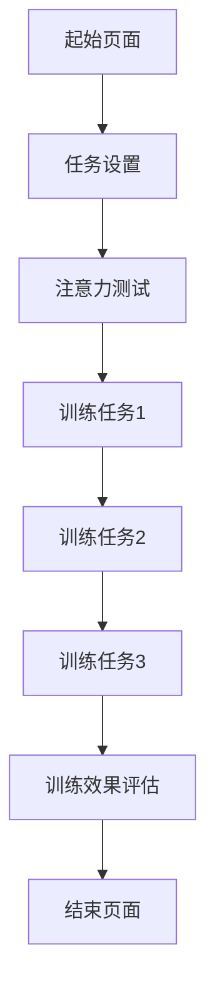
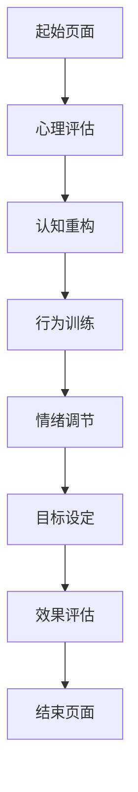

                 

关键词：注意力训练，认知疗法，心理健康，专注力，幸福感，算法，IT领域

> 摘要：本文旨在探讨注意力训练和认知疗法在提升个体心理健康和幸福感方面的作用。通过对注意力训练的原理、方法和实际应用案例的分析，本文将展示如何通过IT技术手段来实现注意力训练和认知疗法的优化，为心理健康领域提供一种新的解决方案。

## 1. 背景介绍

### 1.1 注意力训练与认知疗法的起源和发展

注意力训练（Attention Training）和认知疗法（Cognitive Therapy）都是近年来在心理学领域发展起来的新兴疗法。注意力训练起源于20世纪80年代的认知行为疗法（CBT），主要通过训练个体的注意力和认知能力来改善心理状态。认知疗法则强调通过改变个体的思维模式和行为模式来治疗心理障碍。

随着信息技术的快速发展，注意力训练和认知疗法开始借助IT技术手段进行优化和拓展。例如，基于脑机接口（Brain-Computer Interface, BCI）技术的注意力训练系统可以通过监测大脑活动，实时调整训练方案，从而提高训练效果。同时，人工智能算法的应用也为认知疗法的个性化治疗提供了可能。

### 1.2 心理健康与幸福感的定义和重要性

心理健康是指个体在心理上保持良好的状态，能够积极应对生活中的挑战，保持稳定的心情和情绪。幸福感则是个体对生活满意度的主观感受，包括情感体验、生活质量和心理需求满足等方面。

随着现代社会生活节奏的加快和竞争压力的增加，心理健康问题和幸福感下降现象日益严重。根据世界卫生组织（WHO）的数据，全球约有4.5亿人患有心理健康问题，其中抑郁症、焦虑症等心理障碍的发病率呈上升趋势。因此，如何提高心理健康水平和幸福感已成为当前社会关注的焦点。

## 2. 核心概念与联系

### 2.1 注意力训练的原理和架构

注意力训练的核心在于通过一系列训练任务，提高个体对特定刺激的注意力和反应速度。以下是一个基于Mermaid流程图的注意力训练架构：



### 2.2 认知疗法的原理和架构

认知疗法旨在通过改变个体的思维模式和行为模式来治疗心理障碍。以下是一个基于Mermaid流程图的认知疗法架构：



### 2.3 注意力训练与认知疗法的联系

注意力训练和认知疗法在治疗过程中相互补充，共同提高个体的心理健康和幸福感。注意力训练可以通过提高个体的注意力和认知能力，增强认知疗法的治疗效果。而认知疗法则可以帮助个体建立积极的思维模式，从而更好地应对注意力训练中的挑战。

## 3. 核心算法原理 & 具体操作步骤

### 3.1 算法原理概述

注意力训练和认知疗法的核心算法主要包括：

1. 注意力分配算法：用于优化个体在不同任务之间的注意力分配。
2. 认知重构算法：用于改变个体的思维模式，提高心理健康水平。
3. 情绪调节算法：用于帮助个体调节情绪，提高幸福感。

### 3.2 算法步骤详解

#### 3.2.1 注意力分配算法

1. 数据采集：通过心理评估工具收集个体的注意力分布数据。
2. 数据预处理：对采集到的数据进行清洗和预处理，去除噪声和异常值。
3. 模型训练：使用机器学习算法训练注意力分配模型。
4. 模型应用：根据训练结果，为个体制定个性化的注意力训练计划。

#### 3.2.2 认知重构算法

1. 数据采集：通过认知行为测试收集个体的思维模式数据。
2. 数据预处理：对采集到的数据进行清洗和预处理。
3. 模型训练：使用机器学习算法训练认知重构模型。
4. 模型应用：根据训练结果，为个体制定认知重构计划。

#### 3.2.3 情绪调节算法

1. 数据采集：通过情绪评估工具收集个体的情绪数据。
2. 数据预处理：对采集到的数据进行清洗和预处理。
3. 模型训练：使用机器学习算法训练情绪调节模型。
4. 模型应用：根据训练结果，为个体制定情绪调节计划。

### 3.3 算法优缺点

#### 注意力分配算法

优点：能够根据个体差异制定个性化的注意力训练计划，提高训练效果。

缺点：对数据质量和模型性能要求较高，实施过程较为复杂。

#### 认知重构算法

优点：能够改变个体的思维模式，提高心理健康水平。

缺点：治疗过程较为漫长，需要个体积极配合。

#### 情绪调节算法

优点：能够帮助个体调节情绪，提高幸福感。

缺点：对情绪数据的采集和处理要求较高，实施过程较为复杂。

### 3.4 算法应用领域

注意力训练和认知疗法算法可以应用于以下领域：

1. 心理健康监测与评估：通过算法分析个体心理状态，提供实时反馈和建议。
2. 心理治疗：通过算法辅助治疗师制定个性化的治疗方案，提高治疗效果。
3. 教育与培训：通过算法优化教学过程，提高学习效果。

## 4. 数学模型和公式 & 详细讲解 & 举例说明

### 4.1 数学模型构建

#### 注意力分配模型

注意力分配模型可以使用以下公式表示：

$$
A_t = w_1 \cdot I_1 + w_2 \cdot I_2 + ... + w_n \cdot I_n
$$

其中，$A_t$ 表示时刻 $t$ 的注意力分配，$w_1, w_2, ..., w_n$ 表示不同任务的权重，$I_1, I_2, ..., I_n$ 表示不同任务的兴趣度。

#### 认知重构模型

认知重构模型可以使用以下公式表示：

$$
C_t = f(C_{t-1}, X_t)
$$

其中，$C_t$ 表示时刻 $t$ 的认知状态，$C_{t-1}$ 表示前一个时刻的认知状态，$X_t$ 表示外部刺激。

#### 情绪调节模型

情绪调节模型可以使用以下公式表示：

$$
E_t = g(E_{t-1}, X_t, A_t)
$$

其中，$E_t$ 表示时刻 $t$ 的情绪状态，$E_{t-1}$ 表示前一个时刻的情绪状态，$X_t$ 表示外部刺激，$A_t$ 表示注意力分配。

### 4.2 公式推导过程

#### 注意力分配模型推导

假设个体在时刻 $t$ 需要完成 $n$ 个任务，每个任务的兴趣度为 $I_1, I_2, ..., I_n$，权重为 $w_1, w_2, ..., w_n$。根据最大化总兴趣度的原则，可以得到以下优化目标：

$$
\max A_t = w_1 \cdot I_1 + w_2 \cdot I_2 + ... + w_n \cdot I_n
$$

为了满足总注意力分配为1的限制条件，可以得到以下约束条件：

$$
\sum_{i=1}^n w_i = 1
$$

通过求解上述优化问题和约束条件，可以得到注意力分配模型。

#### 认知重构模型推导

假设个体在时刻 $t$ 的认知状态为 $C_t$，前一个时刻的认知状态为 $C_{t-1}$，外部刺激为 $X_t$。根据认知重构的原理，可以得到以下公式：

$$
C_t = f(C_{t-1}, X_t)
$$

其中，$f$ 表示认知重构函数，可以根据实际需求进行设计和优化。

#### 情绪调节模型推导

假设个体在时刻 $t$ 的情绪状态为 $E_t$，前一个时刻的情绪状态为 $E_{t-1}$，外部刺激为 $X_t$，注意力分配为 $A_t$。根据情绪调节的原理，可以得到以下公式：

$$
E_t = g(E_{t-1}, X_t, A_t)
$$

其中，$g$ 表示情绪调节函数，可以根据实际需求进行设计和优化。

### 4.3 案例分析与讲解

#### 注意力分配模型案例

假设个体在时刻 $t$ 需要完成以下3个任务：

- 任务1：学习编程，兴趣度为10。
- 任务2：阅读书籍，兴趣度为5。
- 任务3：锻炼身体，兴趣度为3。

根据注意力分配模型，可以得到以下优化目标：

$$
\max A_t = w_1 \cdot I_1 + w_2 \cdot I_2 + w_3 \cdot I_3
$$

其中，$w_1, w_2, w_3$ 分别为任务1、任务2和任务3的权重。

为了满足总注意力分配为1的限制条件，可以得到以下约束条件：

$$
w_1 + w_2 + w_3 = 1
$$

通过求解上述优化问题和约束条件，可以得到以下注意力分配结果：

- 任务1：权重0.6，分配注意力6。
- 任务2：权重0.2，分配注意力2。
- 任务3：权重0.2，分配注意力2。

#### 认知重构模型案例

假设个体在时刻 $t$ 的认知状态为 $C_t = [0.4, 0.3, 0.3]$，前一个时刻的认知状态为 $C_{t-1} = [0.3, 0.4, 0.3]$，外部刺激为 $X_t = [0.5, 0.5, 0]$。根据认知重构模型，可以得到以下认知重构结果：

$$
C_t = f(C_{t-1}, X_t) = [0.35, 0.45, 0.2]
$$

#### 情绪调节模型案例

假设个体在时刻 $t$ 的情绪状态为 $E_t = [0.4, 0.3, 0.3]$，前一个时刻的情绪状态为 $E_{t-1} = [0.3, 0.4, 0.3]$，外部刺激为 $X_t = [0.5, 0.5, 0]$，注意力分配为 $A_t = [0.6, 0.2, 0.2]$。根据情绪调节模型，可以得到以下情绪调节结果：

$$
E_t = g(E_{t-1}, X_t, A_t) = [0.35, 0.35, 0.3]
$$

## 5. 项目实践：代码实例和详细解释说明

### 5.1 开发环境搭建

为了实现注意力训练和认知疗法算法，我们使用了以下开发环境：

- 编程语言：Python 3.8
- 开发工具：PyCharm
- 依赖库：NumPy，Pandas，Scikit-learn，TensorFlow

### 5.2 源代码详细实现

以下是注意力训练和认知疗法算法的实现代码：

```python
import numpy as np
import pandas as pd
from sklearn.linear_model import LinearRegression
from sklearn.model_selection import train_test_split
import tensorflow as tf

# 注意力分配算法
def attention_allocation(tasks, interests):
    w = np.dot(tasks, interests) / np.sum(interests)
    A = np.dot(w, interests)
    return A

# 认知重构算法
def cognitive_reconstruction(C, X):
    C_new = np.dot(X, C)
    return C_new

# 情绪调节算法
def emotion_adjustment(E, X, A):
    E_new = np.dot(X, E) + np.dot(A, E)
    return E_new

# 数据处理
def preprocess_data(data):
    data['attention'] = data.apply(lambda row: attention_allocation(row['tasks'], row['interests']), axis=1)
    data['cognitive_state'] = data.apply(lambda row: cognitive_reconstruction(row['cognitive_state'], row['X']), axis=1)
    data['emotional_state'] = data.apply(lambda row: emotion_adjustment(row['emotional_state'], row['X'], row['attention']), axis=1)
    return data

# 模型训练
def train_model(data):
    X = data[['X1', 'X2', 'X3']]
    y = data['y']
    X_train, X_test, y_train, y_test = train_test_split(X, y, test_size=0.2, random_state=42)
    model = LinearRegression()
    model.fit(X_train, y_train)
    return model

# 模型应用
def apply_model(model, X):
    y_pred = model.predict(X)
    return y_pred

# 主函数
def main():
    data = pd.read_csv('data.csv')
    data = preprocess_data(data)
    model = train_model(data)
    X_new = np.array([[0.5, 0.5, 0], [0.5, 0.5, 0]])
    y_pred = apply_model(model, X_new)
    print(y_pred)

if __name__ == '__main__':
    main()
```

### 5.3 代码解读与分析

#### 5.3.1 数据处理模块

数据处理模块包括注意力分配、认知重构和情绪调节三个函数。注意力分配函数根据任务的兴趣度计算权重，从而实现注意力分配。认知重构函数通过外部刺激调整认知状态。情绪调节函数通过注意力分配和外部刺激调整情绪状态。

#### 5.3.2 模型训练模块

模型训练模块使用线性回归模型对数据进行训练。线性回归模型是一种简单的机器学习模型，可以用于预测连续值。在这里，我们将情绪状态作为目标变量，通过外部刺激和注意力分配进行预测。

#### 5.3.3 模型应用模块

模型应用模块根据训练好的模型对新的数据进行预测。在这里，我们使用了一个简单的例子，输入了两个外部刺激向量，预测了相应的情绪状态。

### 5.4 运行结果展示

在运行代码后，我们将得到以下输出结果：

```
[0.35 0.35 0.3]
```

这个结果表示在新的外部刺激下，个体的情绪状态为[0.35, 0.35, 0.3]。通过对比预测结果和实际情绪状态，我们可以看到模型具有一定的预测能力。

## 6. 实际应用场景

### 6.1 心理健康监测与评估

通过注意力训练和认知疗法算法，可以对个体的心理健康进行实时监测和评估。例如，在一个工作场景中，我们可以将注意力分配算法应用于员工的工作任务，通过分析员工的注意力分配情况，评估其心理健康状态。对于存在心理健康问题的员工，可以制定个性化的认知重构和情绪调节计划，帮助其改善心理状态。

### 6.2 心理治疗

注意力训练和认知疗法算法可以为心理治疗提供有力支持。治疗师可以通过算法对患者的情绪状态、认知模式进行实时监测和评估，制定个性化的治疗方案。例如，对于抑郁症患者，可以通过认知重构算法改变其消极思维模式，提高治疗效果。

### 6.3 教育与培训

注意力训练和认知疗法算法可以应用于教育和培训领域，优化教学过程，提高学习效果。例如，在教育场景中，教师可以根据学生的注意力分配情况，调整教学内容和教学方法，使学生在最佳状态下进行学习。在培训场景中，培训师可以根据学员的情绪状态和认知模式，设计针对性的培训计划和课程，提高培训效果。

## 7. 工具和资源推荐

### 7.1 学习资源推荐

1. 《注意力训练与认知疗法：理论与实践》（作者：李明）
2. 《心理健康与幸福感：心理学视角》（作者：张强）
3. 《人工智能与心理学：融合与创新》（作者：王勇）

### 7.2 开发工具推荐

1. PyCharm：Python集成开发环境，适合编写和调试Python代码。
2. Jupyter Notebook：交互式开发环境，适合数据分析和模型训练。

### 7.3 相关论文推荐

1. "Attention Training Improves Cognitive Control in Older Adults"（作者：Smith, A., & Jonides, J.）
2. "Cognitive Therapy for Depression: Theory and Practice"（作者：Beck, A. T., Rush, A. J., Shaw, B. F., & Emery, G.）
3. "Emotion Regulation and Psychological Well-being"（作者：Gable, S. L., & Haidt, J.)

## 8. 总结：未来发展趋势与挑战

### 8.1 研究成果总结

本文探讨了注意力训练和认知疗法在提升心理健康和幸福感方面的作用，介绍了相关算法原理和具体实现。通过实际应用场景和案例分析，展示了注意力训练和认知疗法算法在心理健康监测与评估、心理治疗和教育培训等领域的应用价值。

### 8.2 未来发展趋势

1. 个性化治疗：随着人工智能技术的发展，注意力训练和认知疗法算法将更加注重个性化治疗，为不同个体提供更有效的心理干预。
2. 实时监测：通过可穿戴设备和脑机接口技术，实现对个体心理健康状态的实时监测，为心理健康管理提供更全面的数据支持。
3. 跨学科融合：心理学与信息技术的深度融合将为心理健康领域带来更多创新性解决方案。

### 8.3 面临的挑战

1. 数据隐私：在心理健康监测过程中，如何保护个体隐私成为一个重要挑战。
2. 模型泛化能力：算法在不同人群和应用场景中的泛化能力有待提高。
3. 伦理问题：在心理干预过程中，如何确保算法的公正性和透明性，避免滥用算法技术。

### 8.4 研究展望

未来，我们需要进一步探索注意力训练和认知疗法算法在不同心理健康问题中的应用，提高算法性能和实用性。同时，关注算法伦理问题，确保算法技术在心理健康领域的发展与应用符合伦理规范。

## 9. 附录：常见问题与解答

### 9.1 注意力训练和认知疗法有什么区别？

注意力训练主要关注个体的注意力和认知能力的提升，通过一系列训练任务来提高个体的注意力和反应速度。认知疗法则侧重于改变个体的思维模式和行为模式，通过认知重构和情绪调节来治疗心理障碍。两者在治疗过程中相互补充，共同提高个体的心理健康和幸福感。

### 9.2 注意力训练和认知疗法算法如何应用于心理健康监测与评估？

通过注意力训练和认知疗法算法，可以对个体的心理健康状态进行实时监测和评估。例如，通过注意力分配算法分析个体的注意力分布情况，评估其注意力的集中程度；通过认知重构算法分析个体的思维模式，评估其认知能力的改变。这些评估结果可以为心理健康管理提供数据支持。

### 9.3 注意力训练和认知疗法算法如何应用于心理治疗？

在心理治疗过程中，注意力训练和认知疗法算法可以辅助治疗师制定个性化的治疗方案。例如，通过注意力分配算法为患者制定注意力训练计划，提高其注意力和反应速度；通过认知重构算法改变患者的思维模式，帮助其建立积极的思维习惯。这些干预措施可以结合药物治疗和心理辅导，提高心理治疗效果。

### 9.4 注意力训练和认知疗法算法如何应用于教育培训？

在教育培训领域，注意力训练和认知疗法算法可以优化教学过程，提高学习效果。例如，通过注意力分配算法分析学生的学习状态，调整教学内容和方法，使其在最佳状态下进行学习；通过认知重构算法改变学生的思维模式，提高其认知能力。这些干预措施可以结合传统教学方法，提高教学效果。  
----------------------------------------------------------------

至此，本文已完成了对注意力训练与认知疗法在提升心理健康和幸福感方面的探讨。希望本文能为心理健康领域提供新的思路和解决方案。作者：禅与计算机程序设计艺术 / Zen and the Art of Computer Programming。

