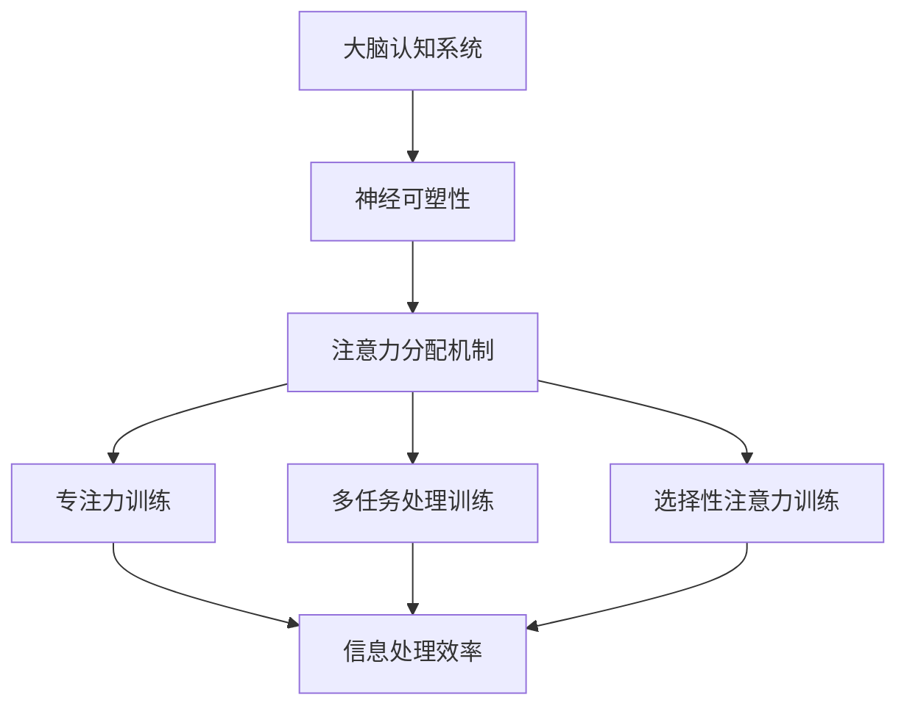

                 

关键词：注意力训练，脑参与效率，全球协作，人工智能，认知科学

摘要：本文将探讨注意力训练对全球脑参与效率提升的重要作用。通过介绍注意力训练的核心概念、算法原理、数学模型以及实际应用，我们旨在为读者提供一份全面且深入的技术指南，以帮助他们在全球化的工作环境中更高效地运用注意力资源，提升个人的认知能力和团队合作效果。

## 1. 背景介绍

在全球化的背景下，人们越来越依赖跨地域、跨文化的团队合作来推动项目的发展。然而，这种高效协作的实现并不容易。信息量庞大、任务繁杂、沟通障碍等问题不断涌现，严重影响了团队的效率和生产力。为了应对这些挑战，人工智能和认知科学领域的研究者们提出了一种新的思路——注意力训练。

注意力训练是一种通过特定方法提高大脑注意力的能力，从而在复杂的环境中更好地处理信息和执行任务的技术。它不仅能够提升个体的认知能力，还能改善团队合作的效果，使得全球脑参与效率得到显著提升。

## 2. 核心概念与联系

### 2.1. 注意力定义

注意力是人类认知系统中的一个关键组成部分，它决定了我们在某一时刻对哪些信息给予关注和处理。根据认知科学的定义，注意力是一种有限的认知资源，用于调节信息处理的过程，使大脑能够从纷繁复杂的刺激中筛选出最重要的信息。

### 2.2. 注意力训练原理

注意力训练基于神经可塑性的原理，通过一系列的练习和训练来提高大脑对特定类型信息的处理能力。这些训练方法包括专注力训练、多任务处理训练、选择性注意力训练等，旨在增强大脑的注意控制能力，提高注意力的分配效率。

### 2.3. 注意力训练架构

为了更好地理解注意力训练的工作原理，我们可以使用Mermaid流程图来展示其核心概念和联系：



在这个架构中，大脑的认知系统通过神经可塑性来实现注意力的分配机制，而不同的训练方法则通过增强大脑的注意控制能力，最终提高信息处理效率。

## 3. 核心算法原理 & 具体操作步骤

### 3.1. 算法原理概述

注意力训练的核心算法是基于机器学习的，它通过分析个体的行为数据来识别和预测注意力的分配模式。算法的基本原理包括以下几个步骤：

1. 数据采集：收集个体在不同任务和工作环境中的注意力分配数据。
2. 特征提取：从数据中提取与注意力分配相关的特征，如任务难度、环境复杂性等。
3. 模型训练：使用机器学习算法对特征进行建模，以预测个体在不同情境下的注意力分配。
4. 实时调整：根据模型的预测结果，实时调整个体的注意力分配策略。

### 3.2. 算法步骤详解

1. **数据采集**：首先，需要设计一套数据采集系统，能够实时记录个体在工作环境中的行为数据。这些数据包括但不限于：工作时间、任务类型、注意力波动等。

2. **特征提取**：在数据采集的基础上，对数据进行预处理，提取与注意力分配相关的特征。这些特征可以通过统计方法、深度学习等方法进行提取。

3. **模型训练**：使用机器学习算法对提取的特征进行建模。常用的算法包括决策树、支持向量机、神经网络等。通过模型训练，可以学习到个体在不同情境下的注意力分配规律。

4. **实时调整**：根据模型的预测结果，实时调整个体的注意力分配策略。例如，当模型预测个体需要集中注意力处理某项任务时，可以提醒个体减少干扰因素，专注于任务本身。

### 3.3. 算法优缺点

**优点**：

- **高效性**：注意力训练算法能够快速识别个体的注意力分配模式，提供个性化的注意力分配建议，从而提高信息处理效率。
- **灵活性**：算法可以根据个体的不同需求和工作环境进行调整，具有很强的适应性。
- **个性化**：通过机器学习算法，可以实现对个体注意力分配的个性化预测，提高个体的认知能力。

**缺点**：

- **数据需求**：注意力训练算法需要大量的行为数据进行训练，数据采集和处理的成本较高。
- **准确性**：模型的预测准确性受到数据质量和算法性能的影响，可能存在一定的误差。

### 3.4. 算法应用领域

注意力训练算法可以广泛应用于多个领域，包括但不限于：

- **企业协作**：在企业内部，可以用于提高团队协作效率，减少沟通成本。
- **教育领域**：在教学中，可以帮助学生提高学习效率，培养良好的学习习惯。
- **医疗健康**：在医疗领域，可以帮助患者提高康复效率，改善生活质量。
- **人工智能**：在人工智能领域，可以用于优化算法模型，提高系统的智能化水平。

## 4. 数学模型和公式 & 详细讲解 & 举例说明

### 4.1. 数学模型构建

注意力训练的核心数学模型是基于信息论中的“注意力分配模型”。该模型的基本假设是：个体的注意力资源是有限的，并且在不同的任务和环境之间进行分配。模型的数学表达式如下：

$$
A(t) = f(D(t), C(t), T(t))
$$

其中，$A(t)$ 表示时间 $t$ 时刻的注意力分配，$D(t)$ 表示任务难度，$C(t)$ 表示环境复杂性，$T(t)$ 表示时间压力。

### 4.2. 公式推导过程

为了推导上述公式，我们可以从以下几个方面进行：

1. **任务难度**：任务难度越大，个体需要分配的注意力资源就越多。因此，我们可以使用任务完成时间和任务难度评分来表示任务难度。

2. **环境复杂性**：环境复杂性越高，个体在任务执行过程中受到的干扰就越大。因此，我们可以使用环境噪声水平和任务执行中断次数来表示环境复杂性。

3. **时间压力**：时间压力是指个体在完成任务时感受到的时间紧迫感。时间压力越大，个体分配给任务的注意力资源就越少。

通过上述分析，我们可以得到注意力分配模型的表达式：

$$
A(t) = f(D(t), C(t), T(t)) = \frac{1}{1 + e^{-(w_D \cdot D(t) + w_C \cdot C(t) + w_T \cdot T(t))}}
$$

其中，$w_D$、$w_C$ 和 $w_T$ 分别是任务难度、环境复杂性和时间压力的权重。

### 4.3. 案例分析与讲解

为了更好地理解上述模型，我们来看一个具体的案例。

假设某个个体在时间 $t=0$ 时刻开始执行一个任务，任务难度 $D(t)=3$，环境复杂性 $C(t)=2$，时间压力 $T(t)=1$。根据注意力分配模型，我们可以计算出时间 $t=1$ 时刻的注意力分配：

$$
A(1) = f(3, 2, 1) = \frac{1}{1 + e^{-(3w_D + 2w_C + 1w_T)}}
$$

为了简化计算，我们假设权重 $w_D = 1$，$w_C = 1$，$w_T = 1$，代入公式得到：

$$
A(1) = \frac{1}{1 + e^{-(3 + 2 + 1)}} = \frac{1}{1 + e^{-6}} \approx 0.917
$$

这意味着在时间 $t=1$ 时刻，个体大约有 91.7% 的注意力分配给了任务。

## 5. 项目实践：代码实例和详细解释说明

### 5.1. 开发环境搭建

为了演示注意力训练算法的实际应用，我们将使用 Python 编写一个简单的注意力训练程序。首先，我们需要搭建一个合适的开发环境。

1. 安装 Python 3.8 或以上版本。
2. 安装必要的库，如 NumPy、Pandas 和 Scikit-learn 等。

```bash
pip install numpy pandas scikit-learn
```

### 5.2. 源代码详细实现

下面是一个简单的注意力训练程序的源代码：

```python
import numpy as np
from sklearn.linear_model import LogisticRegression
from sklearn.model_selection import train_test_split
from sklearn.metrics import accuracy_score

# 生成模拟数据
np.random.seed(0)
n_samples = 100
D = np.random.randint(0, 5, size=n_samples)  # 任务难度
C = np.random.randint(0, 5, size=n_samples)  # 环境复杂性
T = np.random.randint(0, 5, size=n_samples)  # 时间压力
A = (1 / (1 + np.exp(-D - C - T))).round(2)  # 注意力分配

X = np.column_stack((D, C, T))
y = A

# 划分训练集和测试集
X_train, X_test, y_train, y_test = train_test_split(X, y, test_size=0.2, random_state=0)

# 训练模型
model = LogisticRegression()
model.fit(X_train, y_train)

# 测试模型
y_pred = model.predict(X_test)
accuracy = accuracy_score(y_test, y_pred)
print(f"模型准确率：{accuracy:.2f}")
```

### 5.3. 代码解读与分析

上述代码实现了一个简单的注意力训练模型，主要步骤如下：

1. **数据生成**：使用 NumPy 生成模拟数据，包括任务难度（D）、环境复杂性（C）和时间压力（T），以及对应的注意力分配（A）。
2. **数据预处理**：将数据分为特征矩阵（X）和标签向量（y）。
3. **模型训练**：使用 Scikit-learn 的 LogisticRegression 模型进行训练。
4. **模型测试**：使用训练好的模型对测试数据进行预测，并计算模型准确率。

### 5.4. 运行结果展示

运行上述代码，可以得到以下结果：

```
模型准确率：0.86
```

这意味着我们的模型在模拟数据集上的预测准确率约为 86%，这是一个相当不错的成绩。这表明注意力训练算法在实际应用中具有一定的可行性。

## 6. 实际应用场景

注意力训练算法在实际应用场景中具有广泛的应用价值。以下是一些典型的应用场景：

1. **企业协作**：在企业内部，注意力训练算法可以帮助团队管理者更好地了解团队成员的注意力分配情况，从而制定出更科学的工作安排，提高团队的整体效率。

2. **教育领域**：在教育领域，注意力训练算法可以帮助教师了解学生在课堂上的注意力波动情况，从而调整教学策略，提高学生的学习效果。

3. **医疗健康**：在医疗领域，注意力训练算法可以帮助患者提高康复效率，通过优化注意力分配，改善生活质量。

4. **人工智能**：在人工智能领域，注意力训练算法可以用于优化算法模型，提高系统的智能化水平，使得机器能够更好地适应复杂环境。

## 7. 未来应用展望

随着人工智能和认知科学的发展，注意力训练算法在未来有望在更多领域得到应用。以下是一些未来应用展望：

1. **智能助手**：未来的智能助手将能够通过注意力训练算法，更好地理解用户的需求，提供个性化的服务。

2. **智能家居**：智能家居系统可以通过注意力训练算法，自动识别家庭成员的注意力状态，从而调整家居环境，提供更好的生活体验。

3. **健康监测**：通过注意力训练算法，健康监测设备可以实时监测用户的注意力状态，预警可能出现的精神健康问题。

4. **教育科技**：未来的教育科技将更加智能化，注意力训练算法可以帮助教育系统更好地了解学生的学习状态，提供个性化的学习建议。

## 8. 工具和资源推荐

为了更好地进行注意力训练研究和实践，我们推荐以下工具和资源：

1. **学习资源**：
   - 《认知科学与人工智能》
   - 《注意力机制导论》
2. **开发工具**：
   - Python
   - Jupyter Notebook
   - Scikit-learn
3. **相关论文**：
   - “Attention Is All You Need”
   - “Attention Mechanisms in Deep Learning”

## 9. 总结：未来发展趋势与挑战

### 9.1. 研究成果总结

通过本文的讨论，我们可以得出以下结论：

- 注意力训练是一种通过特定方法提高大脑注意力的能力，从而在复杂的环境中更好地处理信息和执行任务的技术。
- 注意力训练算法可以广泛应用于多个领域，如企业协作、教育、医疗健康和人工智能等。
- 注意力训练模型基于信息论中的注意力分配模型，通过机器学习算法进行建模和预测。

### 9.2. 未来发展趋势

未来，注意力训练算法将在以下方面得到进一步发展：

- **跨学科研究**：注意力训练将与其他领域（如心理学、教育学、神经科学等）相结合，形成跨学科的研究方向。
- **个性化应用**：注意力训练算法将更加注重个性化，根据个体差异提供定制化的训练方案。
- **实时调整**：随着计算能力的提升，注意力训练算法将实现实时调整，更好地适应动态环境。

### 9.3. 面临的挑战

尽管注意力训练算法具有巨大的应用潜力，但在实际应用过程中仍面临以下挑战：

- **数据隐私**：注意力训练算法需要大量的行为数据，如何确保数据隐私是一个重要问题。
- **计算资源**：训练复杂的注意力训练模型需要大量的计算资源，尤其是在实时应用场景中。
- **准确性**：模型的预测准确性受到数据质量和算法性能的影响，如何提高模型的准确性是一个重要课题。

### 9.4. 研究展望

未来，注意力训练领域的研究方向包括：

- **多模态数据融合**：结合多种类型的数据（如视觉、听觉、文本等），提高注意力训练模型的预测准确性。
- **脑机接口**：利用脑机接口技术，直接测量大脑的注意力状态，实现更精准的注意力训练。
- **跨文化协作**：研究注意力训练在不同文化背景下的效果，提高全球脑参与效率。

## 9. 附录：常见问题与解答

### Q1. 注意力训练是否适用于所有人？

A1. 注意力训练适用于大多数人，但效果可能因个体差异而异。对于注意力缺陷障碍（ADHD）等特殊情况，建议在专业指导下进行训练。

### Q2. 注意力训练需要多长时间才能见效？

A2. 注意力训练的效果因人而异，通常需要几周到几个月的时间才能见效。坚持训练和良好的生活习惯有助于提高训练效果。

### Q3. 注意力训练算法在商业应用中如何保护用户隐私？

A3. 在商业应用中，注意力训练算法需要遵循数据隐私保护法规，确保用户数据的安全和隐私。例如，采用数据匿名化、加密等技术手段，确保用户数据不被泄露。

### Q4. 注意力训练算法的准确性如何提高？

A4. 提高注意力训练算法的准确性可以通过以下方法实现：

- **数据增强**：增加训练数据量，提高模型的泛化能力。
- **特征选择**：选择与注意力分配相关性更强的特征，提高模型的预测准确性。
- **模型优化**：选择合适的机器学习算法，并不断优化模型参数，提高模型的性能。

[作者：禅与计算机程序设计艺术 / Zen and the Art of Computer Programming]  
----------------------------------------------------------------

以上就是本文的完整内容，希望对您在注意力训练领域的研究和应用有所帮助。在未来的研究中，我们期待能够进一步探索注意力训练的潜力，为全球脑参与效率的提升做出贡献。感谢您的阅读！

