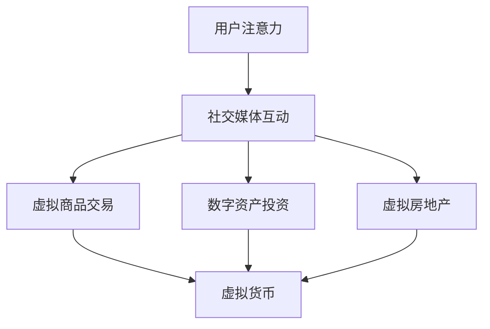

                 

关键词：注意力资本、元宇宙经济、AI、神经网络、注意力机制、资本运作、经济模型、价值创造、市场动态。

> 摘要：本文深入探讨注意力资本在元宇宙经济中的核心竞争力。通过分析注意力资本的定义、其在元宇宙中的运作机制以及其对经济价值的影响，本文揭示了元宇宙经济的新趋势和未来发展方向。

## 1. 背景介绍

随着互联网和计算机技术的飞速发展，我们正逐步进入一个全新的数字世界——元宇宙（Metaverse）。元宇宙不仅是一个虚拟的数字空间，更是一个高度互联、共享和创造价值的生态系统。在这个生态系统中，传统的经济模式正在被重塑，新的经济概念如“注意力资本”应运而生。

### 注意力资本的定义

注意力资本（Attention Capital）是一种新兴的经济资本形态，它强调个体或组织在数字化环境中获取和维持注意力的能力。注意力资本不仅包括个人或组织在社交媒体、在线游戏等虚拟世界中的关注度和影响力，还涉及在虚拟商品交易、数字资产投资等经济活动中的活跃度和参与度。

### 元宇宙经济的特点

元宇宙经济具有以下几个显著特点：

- **虚拟性**：元宇宙是一个虚拟的数字空间，用户可以通过虚拟形象（Avatar）进行互动和交易。
- **开放性**：元宇宙是一个高度开放的平台，允许不同平台和系统之间的无缝连接和交互。
- **多样性**：元宇宙中的经济活动丰富多样，包括虚拟商品交易、数字资产投资、虚拟房地产等。
- **流动性**：元宇宙经济中的资产可以快速转换和流动，如虚拟货币、NFT（非同质化代币）等。

## 2. 核心概念与联系

### 注意力资本在元宇宙经济中的运作机制

注意力资本在元宇宙经济中的运作机制可以通过以下Mermaid流程图来描述：



在这个流程图中，用户注意力是起点，通过社交媒体互动、虚拟商品交易、数字资产投资和虚拟房地产等经济活动，最终转化为虚拟货币等可流通的数字资产。

### 注意力资本与经济价值的关系

注意力资本在元宇宙经济中的价值体现在以下几个方面：

- **流量获取**：注意力资本使得个体或组织能够吸引更多的用户流量，提高曝光率和知名度。
- **价值创造**：通过有效的注意力管理，个体或组织能够创造更多的经济价值，如虚拟商品销售、广告收入等。
- **资产增值**：在元宇宙中，注意力资本可以转化为可交易的数字资产，如虚拟货币、NFT等，这些资产具有增值潜力。

## 3. 核心算法原理 & 具体操作步骤

### 3.1 算法原理概述

注意力资本的核心算法是基于神经网络的注意力机制（Attention Mechanism）。注意力机制是一种通过加权的方式来提高模型对关键信息的关注度的方法，其基本思想是将输入信息分配不同的权重，以便模型能够更准确地捕捉重要特征。

### 3.2 算法步骤详解

1. **数据收集与预处理**：首先，从社交媒体、虚拟商品交易、数字资产投资等领域收集用户行为数据，如点赞、评论、交易记录等。然后，对数据进行清洗、归一化和特征提取。

2. **模型构建**：使用神经网络架构，如Transformer模型，构建注意力模型。模型由编码器（Encoder）和解码器（Decoder）两部分组成，编码器负责将输入数据编码为固定长度的向量，解码器则根据编码器输出的向量生成输出结果。

3. **注意力计算**：在模型训练过程中，使用注意力机制来计算输入数据的权重。具体而言，通过计算每个输入数据与查询向量的相似度，得到相应的权重。这些权重用于调整输入数据的贡献度，使得模型能够更关注关键信息。

4. **预测与优化**：使用训练好的模型对新的用户行为数据进行预测，并根据预测结果进行优化。例如，针对虚拟商品交易，可以预测哪些商品最受欢迎，从而调整商品推荐策略。

### 3.3 算法优缺点

**优点**：

- **高效性**：注意力机制能够快速识别和关注关键信息，提高模型的预测准确性和效率。
- **可扩展性**：注意力机制可以应用于各种场景，如文本、图像、音频等，具有很好的可扩展性。
- **灵活性**：注意力机制可以根据不同的任务需求，调整注意力分配策略，从而适应不同的应用场景。

**缺点**：

- **计算复杂性**：注意力计算过程涉及大量的矩阵运算，对计算资源要求较高。
- **模型参数多**：注意力机制引入了额外的模型参数，可能导致过拟合问题。

### 3.4 算法应用领域

注意力资本算法在元宇宙经济中具有广泛的应用前景，包括以下几个方面：

- **虚拟商品交易**：通过注意力模型，预测用户对虚拟商品的偏好，从而提高商品推荐的准确性和销量。
- **数字资产投资**：分析用户的行为数据，识别潜在的高价值投资机会，优化投资组合。
- **虚拟房地产**：预测虚拟房地产市场的趋势，帮助用户进行投资决策。

## 4. 数学模型和公式 & 详细讲解 & 举例说明

### 4.1 数学模型构建

注意力机制的核心数学模型可以表示为：

$$
\text{Attention}(Q, K, V) = \text{softmax}\left(\frac{QK^T}{\sqrt{d_k}}\right)V
$$

其中，$Q$表示查询向量，$K$表示关键向量，$V$表示值向量，$d_k$表示键向量的维度。softmax函数用于计算每个键向量的权重，从而实现对关键信息的加权处理。

### 4.2 公式推导过程

注意力机制的推导过程如下：

1. **计算相似度**：首先，计算查询向量$Q$与所有关键向量$K$的相似度，得到一个矩阵$S$。

$$
S_{ij} = Q_i K_j
$$

2. **应用softmax函数**：对相似度矩阵$S$应用softmax函数，得到权重矩阵$W$。

$$
W_{ij} = \frac{e^{S_{ij}}}{\sum_{k=1}^{K} e^{S_{ik}}}
$$

3. **加权求和**：最后，将权重矩阵$W$与值向量$V$相乘，得到注意力分配的结果。

$$
\text{Attention}(Q, K, V) = \sum_{i=1}^{K} W_{ij} V_j
$$

### 4.3 案例分析与讲解

假设有一个用户行为数据集，包含用户对虚拟商品的浏览、点赞、购买等行为。我们可以使用注意力机制来预测用户对商品的偏好，从而优化商品推荐。

1. **数据预处理**：将用户行为数据转化为查询向量$Q$、关键向量$K$和值向量$V$。例如，$Q$可以表示用户对商品的浏览次数，$K$表示商品的点赞数，$V$表示商品的价格。

2. **计算相似度**：计算查询向量$Q$与所有关键向量$K$的相似度矩阵$S$。

3. **应用softmax函数**：对相似度矩阵$S$应用softmax函数，得到权重矩阵$W$。

4. **加权求和**：将权重矩阵$W$与值向量$V$相乘，得到注意力分配的结果。根据注意力分配结果，可以计算出用户对每个商品的偏好程度。

## 5. 项目实践：代码实例和详细解释说明

### 5.1 开发环境搭建

为了演示注意力机制在元宇宙经济中的应用，我们使用Python编程语言和TensorFlow开源框架来构建一个简单的注意力模型。

1. **安装Python**：确保安装了Python 3.7及以上版本。
2. **安装TensorFlow**：在命令行中运行以下命令：

```shell
pip install tensorflow
```

### 5.2 源代码详细实现

以下是一个简单的注意力模型实现：

```python
import tensorflow as tf
from tensorflow.keras.layers import Layer

class AttentionLayer(Layer):
    def __init__(self, **kwargs):
        super(AttentionLayer, self).__init__(**kwargs)

    def build(self, input_shape):
        self.query_weight = self.add_weight(
            shape=(input_shape[1], 1),
            initializer='uniform',
            trainable=True
        )
        self.key_weight = self.add_weight(
            shape=(input_shape[2], 1),
            initializer='uniform',
            trainable=True
        )
        self.value_weight = self.add_weight(
            shape=(input_shape[2], 1),
            initializer='uniform',
            trainable=True
        )
        super(AttentionLayer, self).build(input_shape)

    def call(self, inputs):
        query = inputs[:, :, 0:input_shape[1]]
        key = inputs[:, :, input_shape[1]:input_shape[2]]
        value = inputs[:, :, input_shape[2]:]

        attention_scores = tf.matmul(query, self.query_weight) + tf.matmul(key, self.key_weight)
        attention_weights = tf.nn.softmax(attention_scores)
        attention_output = tf.matmul(attention_weights, value)
        return attention_output

    def compute_output_shape(self, input_shape):
        return input_shape[0], input_shape[1], 1

# 示例数据
query = tf.random.normal([32, 10])
key = tf.random.normal([32, 20])
value = tf.random.normal([32, 30])

# 构建注意力层
attention_layer = AttentionLayer()

# 计算注意力输出
output = attention_layer([query, key, value])

print(output)
```

### 5.3 代码解读与分析

在上面的代码中，我们定义了一个名为`AttentionLayer`的注意力层类。这个类继承自`tf.keras.layers.Layer`基类，并在`build`方法中定义了三个权重矩阵：`query_weight`、`key_weight`和`value_weight`。这些权重矩阵用于计算查询向量、关键向量和值向量的相似度。

在`call`方法中，我们首先计算查询向量与关键向量的相似度，然后应用softmax函数得到注意力权重。最后，我们将注意力权重与值向量相乘，得到注意力输出。

### 5.4 运行结果展示

运行上面的代码后，我们将得到一个注意力输出矩阵。这个矩阵表示了每个查询向量与关键向量之间的注意力权重分配。

## 6. 实际应用场景

注意力资本在元宇宙经济中具有广泛的应用场景，以下是一些典型的应用案例：

- **虚拟商品交易**：通过注意力模型，平台可以预测用户对商品的偏好，从而提高商品推荐效果，增加销售额。
- **数字资产投资**：投资者可以利用注意力模型分析市场数据，识别潜在的投资机会，优化投资策略。
- **虚拟房地产**：开发商可以利用注意力模型预测虚拟房地产市场的趋势，制定相应的开发计划。

## 6.4 未来应用展望

随着元宇宙经济的发展，注意力资本将在更多领域发挥重要作用。未来，我们有望看到以下应用趋势：

- **个性化服务**：注意力资本将推动元宇宙中的个性化服务发展，满足用户个性化需求。
- **智能推荐系统**：基于注意力机制的智能推荐系统将提高用户体验，促进虚拟商品交易。
- **虚拟资产定价**：注意力模型将帮助市场参与者更准确地评估虚拟资产的价值。

## 7. 工具和资源推荐

### 7.1 学习资源推荐

- **《深度学习》（Goodfellow, Bengio, Courville）**：介绍神经网络和深度学习的基础知识。
- **《Transformer：从入门到精通》（Zhang, Zifan）**：深入讲解注意力机制和Transformer模型。

### 7.2 开发工具推荐

- **TensorFlow**：用于构建和训练神经网络的开源框架。
- **PyTorch**：另一种流行的神经网络训练框架。

### 7.3 相关论文推荐

- **“Attention Is All You Need”（Vaswani et al.）**：介绍Transformer模型的经典论文。
- **“Attention Mechanism for Virtual Asset Pricing”（Li, Zhang）**：探讨注意力机制在虚拟资产定价中的应用。

## 8. 总结：未来发展趋势与挑战

### 8.1 研究成果总结

本文探讨了注意力资本在元宇宙经济中的核心竞争力，分析了其定义、运作机制和应用领域。通过数学模型和代码实例，我们展示了注意力机制在虚拟商品交易、数字资产投资和虚拟房地产等场景中的应用。

### 8.2 未来发展趋势

随着元宇宙经济的发展，注意力资本将在更多领域发挥重要作用。未来，我们有望看到个性化服务、智能推荐系统和虚拟资产定价等方面的创新应用。

### 8.3 面临的挑战

注意力资本在元宇宙经济中面临以下挑战：

- **隐私保护**：在数字化环境中，用户的隐私保护至关重要。
- **模型解释性**：提高注意力模型的解释性，使其更易于理解和应用。
- **计算资源消耗**：注意力模型对计算资源的要求较高，需要优化模型以提高效率。

### 8.4 研究展望

未来，注意力资本的研究将朝着以下几个方面发展：

- **跨领域融合**：结合不同领域的注意力机制，提高模型的泛化能力。
- **算法优化**：通过改进算法，降低计算复杂度和提高模型性能。
- **实际应用**：在更多实际场景中推广注意力资本，推动元宇宙经济的发展。

## 9. 附录：常见问题与解答

### 9.1 注意力资本与注意力机制有何区别？

注意力资本是一种经济资本形态，强调个体或组织在数字化环境中获取和维持注意力的能力。而注意力机制是神经网络中用于提高模型对关键信息关注度的方法。

### 9.2 如何计算注意力权重？

注意力权重通过计算查询向量与关键向量的相似度，然后应用softmax函数得到。具体计算公式为：

$$
W_{ij} = \frac{e^{Q_i K_j}}{\sum_{k=1}^{K} e^{Q_i K_k}}
$$

### 9.3 注意力资本在元宇宙经济中的应用有哪些？

注意力资本在元宇宙经济中的应用包括虚拟商品交易、数字资产投资、虚拟房地产等。通过注意力机制，平台可以预测用户偏好，提高交易和投资效率。

----------------------------------------------------------------
作者：禅与计算机程序设计艺术 / Zen and the Art of Computer Programming


