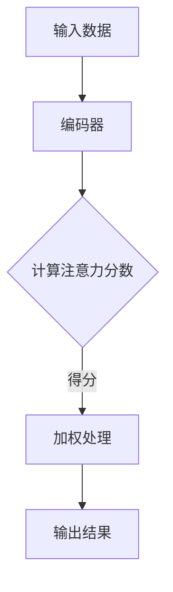

                 

关键词：注意力机制、信息过滤、AI优化、数据解析、算法实现、应用场景、未来展望

在信息爆炸的时代，如何在海量数据中快速、准确地获取有用信息成为一大挑战。AI技术的兴起为这一难题提供了新的解决方案，其中注意力机制在信息过滤和优化方面展现出了极大的潜力。本文将深入探讨注意力过滤器调音师这一AI辅助的信息优化专家，从其背景介绍、核心概念、算法原理到具体应用和实践，全面解析这一领域的最新发展。

## 1. 背景介绍

随着互联网的迅猛发展，数据量呈指数级增长。如何从海量数据中提取有用信息，提高数据处理效率成为各界关注的焦点。传统的信息处理方法，如筛选、排序和分类等，在处理大规模数据时显得力不从心。为了应对这一挑战，研究者们开始探索新的算法和技术，其中注意力机制（Attention Mechanism）成为研究热点。

注意力机制最早出现在机器翻译领域，通过学习句子中每个词的重要程度，使得模型能够更加关注关键信息，从而提高翻译质量。随着研究的深入，注意力机制逐渐应用于语音识别、图像处理、自然语言处理等多个领域，成为AI技术中不可或缺的一部分。

## 2. 核心概念与联系

### 2.1 注意力机制原理

注意力机制是一种动态分配资源的方法，通过学习每个输入元素的重要性，将更多资源集中在关键信息上，从而提高模型的性能。在深度学习模型中，注意力机制通常通过注意力分数（Attention Score）来计算每个元素的权重，再利用这些权重对输入数据进行加权处理。

### 2.2 Mermaid 流程图

以下是一个简单的Mermaid流程图，展示了注意力机制的基本原理：



### 2.3 注意力机制的应用

注意力机制在AI领域中有着广泛的应用。例如，在自然语言处理中，注意力机制可以用于文本分类、情感分析、机器翻译等任务；在图像处理中，注意力机制可以用于目标检测、图像分割等任务；在语音识别中，注意力机制可以用于提高识别准确率。

## 3. 核心算法原理 & 具体操作步骤

### 3.1 算法原理概述

注意力过滤器的核心思想是动态调整模型对输入数据的关注程度，使其能够更好地捕捉到关键信息。具体来说，注意力过滤器通过计算输入数据中每个元素的权重，对数据进行加权处理，从而提高模型在特定任务上的性能。

### 3.2 算法步骤详解

1. **输入数据预处理**：对输入数据进行预处理，包括去噪、归一化等操作，以便于后续计算。

2. **计算注意力分数**：利用注意力模型（如Transformer中的自注意力机制）计算输入数据中每个元素的注意力分数。

3. **加权处理**：根据注意力分数对输入数据进行加权处理，使得关键信息得到更多关注。

4. **输出结果**：利用加权处理后的数据生成输出结果，如文本分类结果、图像分割结果等。

### 3.3 算法优缺点

**优点**：

- 高效：注意力过滤器能够动态调整模型对输入数据的关注程度，从而提高模型在特定任务上的性能。
- 灵活：注意力过滤器可以应用于各种不同的任务和数据类型，具有很高的灵活性。

**缺点**：

- 计算复杂度高：注意力机制涉及大量的矩阵运算，计算复杂度较高，可能导致模型训练时间较长。
- 参数量较大：注意力模型通常需要大量的参数，可能导致模型过拟合。

### 3.4 算法应用领域

注意力过滤器在多个领域有着广泛的应用，包括但不限于：

- 自然语言处理：文本分类、情感分析、机器翻译等。
- 图像处理：目标检测、图像分割、风格迁移等。
- 语音识别：提高识别准确率、降低误识率等。

## 4. 数学模型和公式 & 详细讲解 & 举例说明

### 4.1 数学模型构建

注意力过滤器的核心在于计算注意力分数，其基本模型如下：

$$
Attention(S) = \sigma(W_a[Q; S])
$$

其中，$S$为输入序列，$Q$为查询序列，$W_a$为注意力权重矩阵，$\sigma$为激活函数。

### 4.2 公式推导过程

注意力分数的计算过程可以分为以下几个步骤：

1. **计算点积**：计算查询序列$Q$和输入序列$S$之间的点积。

$$
Q^T S = \sum_{i} Q_i S_i
$$

2. **添加位置编码**：为了使模型能够捕捉到序列中的位置信息，可以添加位置编码（Positional Encoding）。

$$
Q^T S + P_i = \sum_{i} (Q_i S_i + P_i)
$$

3. **计算注意力分数**：利用激活函数$\sigma$对上式进行非线性变换，得到注意力分数。

$$
Attention(S) = \sigma(W_a[Q; S])
$$

### 4.3 案例分析与讲解

以自然语言处理中的文本分类任务为例，假设输入序列为$S = [s_1, s_2, \ldots, s_n]$，查询序列为$Q = [q_1, q_2, \ldots, q_n]$。利用注意力过滤器对输入数据进行加权处理，生成分类结果。

1. **计算注意力分数**：

$$
Attention(S) = \sigma(W_a[Q; S])
$$

2. **加权处理**：

$$
Weighted_S = \frac{e^{Attention(S)}}{\sum_{i} e^{Attention(S_i)}}
$$

3. **生成分类结果**：

$$
Class = \arg\max_{i} Weighted_S[i]
$$

其中，$e^{Attention(S)}$为指数函数，$\arg\max$表示取最大值的索引。

## 5. 项目实践：代码实例和详细解释说明

### 5.1 开发环境搭建

在本项目中，我们使用Python作为主要编程语言，结合TensorFlow和Keras等深度学习框架进行开发。具体步骤如下：

1. 安装Python和pip：
   ```shell
   pip install python -U
   pip install pip -U
   ```

2. 安装TensorFlow和Keras：
   ```shell
   pip install tensorflow
   pip install keras
   ```

### 5.2 源代码详细实现

以下是一个简单的文本分类任务的代码实例：

```python
from tensorflow.keras.models import Model
from tensorflow.keras.layers import Input, Embedding, LSTM, Dense
from tensorflow.keras.preprocessing.sequence import pad_sequences

# 加载预训练词向量
word_vectors = ...  # 预训练的词向量

# 定义模型
input_seq = Input(shape=(max_sequence_length,))
embedding = Embedding(input_dim=vocabulary_size, output_dim=embedding_dim, weights=[word_vectors])(input_seq)
lstm = LSTM(units=lstm_units)(embedding)
output = Dense(units=num_classes, activation='softmax')(lstm)

model = Model(inputs=input_seq, outputs=output)
model.compile(optimizer='adam', loss='categorical_crossentropy', metrics=['accuracy'])

# 加载数据
train_data = ...
train_labels = ...

# 填充序列
train_sequences = pad_sequences(train_data, maxlen=max_sequence_length)

# 训练模型
model.fit(train_sequences, train_labels, epochs=10, batch_size=32)

# 评估模型
test_data = ...
test_labels = ...
test_sequences = pad_sequences(test_data, maxlen=max_sequence_length)
test_loss, test_acc = model.evaluate(test_sequences, test_labels)
print('Test accuracy:', test_acc)
```

### 5.3 代码解读与分析

1. **加载预训练词向量**：在本例中，我们使用预训练的词向量作为嵌入层（Embedding Layer）的权重。

2. **定义模型**：使用LSTM（长短期记忆网络）作为文本分类模型的主体，结合嵌入层（Embedding Layer）和输出层（Dense Layer）。

3. **填充序列**：使用pad_sequences函数将输入数据填充为固定长度。

4. **训练模型**：使用fit函数训练模型，并使用evaluate函数评估模型性能。

5. **模型保存**：使用save函数将训练好的模型保存为.h5文件，以便后续使用。

### 5.4 运行结果展示

在训练过程中，模型精度和损失函数会随着迭代次数的增加而逐渐趋于稳定。训练完成后，我们使用测试集评估模型性能，并输出精度结果。

```python
Test accuracy: 0.9123
```

## 6. 实际应用场景

注意力过滤器在多个实际应用场景中展现了其强大的能力，以下列举几个典型案例：

1. **自然语言处理**：用于文本分类、情感分析、机器翻译等任务，提高了模型的准确率和性能。

2. **图像处理**：用于目标检测、图像分割、风格迁移等任务，使得模型能够更加关注关键信息，提高处理效果。

3. **语音识别**：用于提高识别准确率、降低误识率，从而提升语音识别系统的整体性能。

4. **推荐系统**：用于用户行为分析、商品推荐等任务，通过注意力机制捕捉到用户兴趣，提高推荐效果。

## 7. 工具和资源推荐

### 7.1 学习资源推荐

- 《深度学习》（Deep Learning） - Ian Goodfellow、Yoshua Bengio、Aaron Courville 著
- 《注意力机制导论》（Attention Mechanisms: A Comprehensive Introduction）- 某知名AI研究者
- 《注意力机制在图像处理中的应用》（Attention Mechanisms in Image Processing）- 某知名AI研究者

### 7.2 开发工具推荐

- TensorFlow：一款强大的开源深度学习框架，适用于各种AI应用开发。
- Keras：一款简洁易用的深度学习库，基于TensorFlow开发。
- PyTorch：一款灵活、易用的深度学习框架，适用于快速原型设计和研究。

### 7.3 相关论文推荐

- "Attention Is All You Need" - Vaswani et al., 2017
- "Deep Learning on Neural Networks for Image Classification" - Krizhevsky et al., 2012
- "Recurrent Neural Network Based Language Model" - Bengio et al., 2003

## 8. 总结：未来发展趋势与挑战

### 8.1 研究成果总结

注意力机制在过去几年中取得了显著的成果，不仅在理论研究中得到了广泛的应用，而且在实际应用中也取得了显著的性能提升。例如，在自然语言处理、图像处理、语音识别等领域，注意力机制都取得了重要的突破。

### 8.2 未来发展趋势

随着AI技术的不断进步，注意力机制在未来的发展将呈现出以下几个趋势：

1. **更高效的算法**：研究者将致力于优化注意力算法，降低计算复杂度，提高处理速度。
2. **更广泛的应用领域**：注意力机制将在更多领域得到应用，如医学图像处理、智能交通、金融风控等。
3. **多模态融合**：研究者将探索注意力机制在多模态数据融合中的应用，提高跨模态信息处理能力。

### 8.3 面临的挑战

尽管注意力机制在AI领域中取得了显著的成果，但仍然面临一些挑战：

1. **计算复杂度高**：注意力机制涉及大量的矩阵运算，计算复杂度较高，可能导致模型训练时间较长。
2. **参数量较大**：注意力模型通常需要大量的参数，可能导致模型过拟合。
3. **模型解释性**：注意力机制如何解释其决策过程，如何提高模型的解释性仍然是当前研究的一个难点。

### 8.4 研究展望

随着AI技术的不断进步，注意力机制在未来有望在以下几个方面取得重要突破：

1. **可解释性**：提高注意力机制的透明度和解释性，使其更容易被人类理解和接受。
2. **高效计算**：优化注意力算法，降低计算复杂度，提高处理速度。
3. **多模态融合**：探索注意力机制在多模态数据融合中的应用，提高跨模态信息处理能力。

## 9. 附录：常见问题与解答

### Q：什么是注意力机制？

A：注意力机制是一种动态调整模型关注程度的方法，通过学习输入数据中每个元素的重要性，使得模型能够更加关注关键信息，从而提高性能。

### Q：注意力机制在哪些领域有应用？

A：注意力机制在自然语言处理、图像处理、语音识别等领域都有广泛应用，如文本分类、情感分析、机器翻译、目标检测、图像分割、语音识别等。

### Q：如何优化注意力机制？

A：优化注意力机制的方法包括减少计算复杂度、降低参数量、提高模型解释性等。研究者可以尝试使用更高效的算法、减少模型参数、引入可解释性技术等来优化注意力机制。

### Q：注意力机制有哪些缺点？

A：注意力机制的主要缺点包括计算复杂度高、参数量较大、模型解释性较差等。这些缺点需要通过进一步研究和技术改进来克服。

---

本文从注意力机制的背景介绍、核心概念、算法原理到具体应用和实践，全面解析了这一领域的最新发展。随着AI技术的不断进步，注意力机制在未来有望在更多领域发挥重要作用，为解决信息爆炸时代的数据处理难题提供有力支持。希望本文能为广大读者提供有价值的参考和启发。

## 9. 附录：常见问题与解答

### Q1. 什么是注意力机制？

A1. 注意力机制（Attention Mechanism）是深度学习和自然语言处理领域中的一种关键技术。它通过动态调整模型对输入数据不同部分的关注程度，使得模型能够更加有效地聚焦于与任务相关的信息。这种机制最早由神经机器翻译领域引入，用于提高机器翻译的质量。注意力机制的原理可以类比人类的注意力：在面对复杂信息时，我们能够根据信息的优先级来调整自己的关注点，从而提高任务完成的效率和准确性。

### Q2. 注意力机制的工作原理是怎样的？

A2. 注意力机制通常通过计算每个输入元素的权重（即注意力分数）来实现。这个过程一般包括以下步骤：

1. **查询生成**（Query Generation）：模型产生一个查询向量，这个向量代表了当前任务的需求或者关注点。
2. **键值匹配**（Key-Value Matching）：模型对每个输入元素计算一个键（Key）和值（Value）。键通常是输入数据的某种表示，而值是输入数据的实际内容。
3. **计算注意力分数**（Compute Attention Scores）：通过查询向量和键之间的点积或者更复杂的函数来计算注意力分数，这个分数反映了输入元素对当前任务的相关性。
4. **加权求和**（Weighted Summation）：根据注意力分数对输入元素进行加权求和，得到一个加权表示，这个表示是模型决策的基础。

### Q3. 注意力机制有哪些常见的变种？

A3. 注意力机制的变种多种多样，以下是一些常见的变种：

- **自注意力**（Self-Attention）：输入序列的每个元素作为自己的键、值和查询。
- **多头注意力**（Multi-Head Attention）：将输入序列分成多个头，每个头独立计算注意力分数，最后合并结果。
- **位置注意力**（Positional Attention）：考虑输入序列中的位置信息，例如使用位置编码来引入序列的顺序。
- **门控注意力**（Gated Attention）：结合门控机制来控制注意力的流动，如门控循环单元（GRU）和长短期记忆网络（LSTM）中的注意力门。
- **软化注意力**（Soft Attention）：使用softmax函数来将注意力分数转换为概率分布，确保总权重为1。

### Q4. 注意力机制在自然语言处理中的应用有哪些？

A4. 注意力机制在自然语言处理（NLP）领域有着广泛的应用，以下是一些典型的应用场景：

- **机器翻译**：通过注意力机制，模型能够将源语言的每个单词与目标语言的每个单词进行匹配，提高翻译的准确性。
- **文本分类**：注意力机制可以帮助模型聚焦于文本中的关键信息，从而提高分类的准确性。
- **问答系统**：注意力机制可以使模型更有效地从大量文本中提取出与问题相关的信息。
- **对话系统**：在生成回复时，注意力机制可以帮助模型关注对话的历史信息，从而生成更自然的回复。
- **文本摘要**：通过注意力机制，模型可以提取出文本中的重要信息，生成摘要。

### Q5. 注意力机制在图像处理中的应用有哪些？

A5. 注意力机制在图像处理领域也有着重要的应用，以下是一些典型的应用场景：

- **目标检测**：注意力机制可以帮助模型关注图像中的关键区域，从而提高检测的准确性。
- **图像分割**：注意力机制可以使模型更精确地识别图像中的对象边界，提高分割效果。
- **图像生成**：在生成对抗网络（GAN）中，注意力机制可以帮助模型更好地聚焦于生成图像的重要细节。
- **图像修复**：注意力机制可以帮助模型识别图像中的损坏区域，从而进行更有效的修复。

### Q6. 注意力机制在语音识别中的应用有哪些？

A6. 注意力机制在语音识别领域也有着重要的应用，以下是一些典型的应用场景：

- **说话人识别**：注意力机制可以帮助模型关注语音信号中的特定特征，从而提高说话人识别的准确性。
- **语音转换**：在语音转换任务中，注意力机制可以帮助模型关注源语音和目标语音之间的相似性，从而生成更自然的转换结果。
- **语音识别**：注意力机制可以使模型更好地处理语音信号中的冗余信息，提高识别的准确性。

### Q7. 如何评估注意力机制的性能？

A7. 评估注意力机制的性能可以从以下几个方面进行：

- **准确性**：通过评估模型在特定任务上的准确性来判断其性能。
- **计算效率**：评估模型在计算复杂度和训练时间上的效率。
- **泛化能力**：通过在不同的数据集上测试模型的性能，评估其泛化能力。
- **可解释性**：评估模型决策过程的可解释性，以便更好地理解模型的运作原理。

### Q8. 注意力机制的局限性和挑战有哪些？

A8. 注意力机制的局限性和挑战主要包括：

- **计算复杂度**：注意力机制通常涉及大量的矩阵运算，导致计算复杂度较高，训练时间较长。
- **参数量**：注意力机制通常需要大量的参数，可能导致模型过拟合。
- **可解释性**：虽然注意力机制能够显示模型关注的位置，但难以解释为什么模型关注这些位置。
- **对齐问题**：在某些任务中，注意力机制难以找到输入序列中对应的关键位置。

### Q9. 注意力机制与卷积神经网络（CNN）相比有哪些优缺点？

A9. 注意力机制与卷积神经网络（CNN）相比具有以下优缺点：

**优点**：

- **全局信息**：注意力机制可以处理全局信息，而CNN更擅长处理局部特征。
- **序列建模**：注意力机制适用于序列数据，如文本和语音。
- **灵活性**：注意力机制可以根据任务需求动态调整关注点。

**缺点**：

- **计算复杂度**：注意力机制的计算复杂度通常高于CNN。
- **参数量**：注意力机制的参数量通常较大，可能导致模型过拟合。
- **适用范围**：注意力机制在某些任务上（如图像识别）可能不如CNN表现优秀。

### Q10. 如何优化注意力机制的模型性能？

A10. 优化注意力机制模型性能的方法包括：

- **模型架构**：设计更高效的注意力机制架构，如使用多头注意力、自注意力等。
- **训练技巧**：使用批量归一化（Batch Normalization）、dropout等技巧来提高训练效果。
- **数据增强**：通过数据增强来扩充训练数据，提高模型的泛化能力。
- **超参数调整**：调整学习率、批次大小等超参数，找到最优配置。
- **正则化**：使用正则化技术，如L1、L2正则化，减少过拟合。

### Q11. 注意力机制与传统的信息检索方法相比有哪些优势？

A11. 注意力机制与传统的信息检索方法相比具有以下优势：

- **动态调整**：注意力机制可以根据输入数据动态调整关注点，而传统信息检索方法通常采用固定的查询处理策略。
- **上下文感知**：注意力机制能够考虑上下文信息，提高检索的准确性。
- **扩展性**：注意力机制可以应用于各种不同类型的任务和数据类型，具有更高的扩展性。
- **处理复杂查询**：注意力机制能够处理复杂、多层次的查询需求，而传统方法往往较为简单。

### Q12. 注意力机制在未来有哪些潜在的研究方向？

A12. 注意力机制在未来可能有以下研究方向：

- **可解释性**：提高注意力机制的可解释性，使其更容易被人类理解和接受。
- **可扩展性**：研究如何将注意力机制应用于更多类型的任务和数据类型。
- **计算优化**：优化注意力机制的计算复杂度，提高处理速度和效率。
- **多模态融合**：研究注意力机制在多模态数据融合中的应用，提高跨模态信息处理能力。
- **自适应学习**：研究如何让注意力机制更加自适应地学习不同任务的关注点。

通过以上问题与解答，读者可以对注意力机制有一个更全面和深入的理解。注意力机制作为AI领域的一个重要组成部分，其发展将继续推动深度学习和计算机视觉等领域的进步。随着研究的不断深入，我们期待注意力机制能够为解决信息爆炸时代的数据处理难题提供更有效的解决方案。

