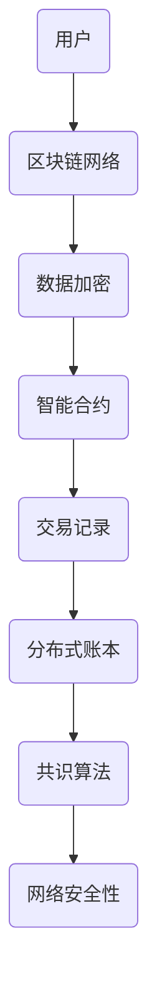

                 

摘要：
随着元宇宙的迅速发展，人们对其中的交互体验和安全性的期望也越来越高。然而，元宇宙的开放性和复杂性为黑客攻击提供了新的机会。本文将探讨元宇宙中的信息安全问题，特别是注意力黑客防御的新挑战，并介绍相关的技术手段和解决方案。

## 1. 背景介绍

### 元宇宙的概念与特点

元宇宙（Metaverse）是人们通过虚拟现实（VR）、增强现实（AR）和其他数字技术构建的沉浸式虚拟世界。它不仅是一个虚拟空间，更是一个社会网络，人们在其中可以互动、创造、学习、工作等。元宇宙具有以下特点：

1. **沉浸感**：通过VR和AR技术，用户可以全身心投入到元宇宙中，感受到与真实世界相似的体验。
2. **互动性**：用户可以在元宇宙中与其他用户实时互动，形成丰富的社交网络。
3. **创造性**：用户可以在元宇宙中创造自己的虚拟世界、物品和体验。
4. **开放性**：元宇宙是一个开放的平台，任何人都可以参与其中，这为创新和合作提供了广阔的空间。

### 元宇宙的安全隐患

尽管元宇宙具有诸多优点，但其开放性和复杂性也带来了新的安全挑战：

1. **隐私泄露**：用户在元宇宙中的行为和身份信息可能被黑客窃取，导致隐私泄露。
2. **虚拟财产被盗**：元宇宙中的虚拟财产（如虚拟货币、虚拟物品等）容易成为黑客攻击的目标。
3. **虚假信息传播**：恶意用户可能在元宇宙中散布虚假信息，影响真实世界的判断。
4. **社交工程攻击**：黑客通过元宇宙中的社交互动，获取用户的敏感信息，进而实施攻击。

## 2. 核心概念与联系

为了理解元宇宙信息安全问题，我们需要了解以下几个核心概念：

### 2.1 区块链技术

区块链技术是元宇宙的基础设施之一，它通过去中心化的方式确保数据的不可篡改性和透明性。区块链中的智能合约则可以自动执行合约条款，减少人为干预和欺诈风险。

### 2.2 加密技术

加密技术是保护数据安全和隐私的关键技术。通过对数据进行加密，即使数据被截获，攻击者也无法解读其内容。

### 2.3 虚拟现实与增强现实

虚拟现实（VR）和增强现实（AR）技术是元宇宙的重要组成部分。通过这些技术，用户可以沉浸在元宇宙中，并与虚拟环境进行互动。

### 2.4 Mermaid流程图

以下是一个描述区块链技术在元宇宙中的应用的Mermaid流程图：



## 3. 核心算法原理 & 具体操作步骤

### 3.1 算法原理概述

在元宇宙中，注意力黑客防御的核心算法包括：

1. **隐私保护算法**：通过对用户行为和身份信息的加密和混淆，确保其隐私不被泄露。
2. **身份验证算法**：使用多重身份验证技术，防止恶意用户冒充合法用户。
3. **智能合约执行算法**：确保智能合约的安全性和正确性，防止恶意合约执行。

### 3.2 算法步骤详解

1. **隐私保护算法步骤**：

   - **数据加密**：使用高级加密算法（如AES）对用户数据进行加密。
   - **数据混淆**：对加密后的数据进行混淆处理，增加破解难度。
   - **隐私保护传输**：通过安全的加密通道传输加密后的数据。

2. **身份验证算法步骤**：

   - **多重身份验证**：用户需要通过多种方式（如密码、指纹、面部识别等）进行身份验证。
   - **动态身份验证**：用户每次登录时，系统都会随机生成一个动态密码，提高安全性。

3. **智能合约执行算法步骤**：

   - **合约预检查**：在合约执行前，系统会对合约进行安全性和正确性检查。
   - **合约执行**：通过加密算法确保合约的执行过程安全和透明。
   - **结果验证**：执行结果经过多方验证，确保合约的正确执行。

### 3.3 算法优缺点

**优点**：

- **高效性**：算法能够在元宇宙的开放环境中高效运行，确保数据安全和隐私。
- **安全性**：多种加密和身份验证技术的结合，提高了系统的整体安全性。
- **透明性**：智能合约的执行过程透明，用户可以实时查看执行结果。

**缺点**：

- **计算成本**：加密和身份验证算法需要大量的计算资源，可能导致系统性能下降。
- **兼容性问题**：不同平台和技术的兼容性可能成为算法推广的障碍。

### 3.4 算法应用领域

注意力黑客防御算法主要应用于以下几个方面：

1. **用户隐私保护**：在元宇宙中，用户的行为和身份信息是隐私保护的重点。
2. **虚拟财产安全**：保护虚拟财产（如虚拟货币、虚拟物品等）不被黑客盗取。
3. **社交互动安全**：确保用户在元宇宙中的社交互动安全，防止虚假信息和社交工程攻击。

## 4. 数学模型和公式 & 详细讲解 & 举例说明

### 4.1 数学模型构建

在元宇宙信息安全中，常用的数学模型包括：

1. **加密算法模型**：包括对称加密和非对称加密模型。
2. **身份验证模型**：包括基于密码学的身份验证模型和基于生物识别的身份验证模型。
3. **智能合约模型**：包括基于状态机的智能合约模型和基于图灵机的智能合约模型。

### 4.2 公式推导过程

以下是一个简单的对称加密算法模型的公式推导过程：

$$
c = E_k(p)
$$

其中，$c$ 是加密后的数据，$k$ 是加密密钥，$p$ 是原始数据。

### 4.3 案例分析与讲解

以下是一个基于密码学的身份验证模型的案例：

1. **用户注册**：用户生成一个密码，并将其加密存储在服务器上。

$$
h(p) \rightarrow S
$$

其中，$h$ 是哈希函数，$p$ 是密码，$S$ 是服务器存储的加密密码。

2. **用户登录**：用户输入密码，系统将其加密并与服务器存储的加密密码进行比较。

$$
h(p') \rightarrow S'
$$

其中，$p'$ 是用户输入的密码，$S'$ 是服务器存储的加密密码。

如果 $h(p') = S'$，则用户登录成功。

### 4.4 案例分析与讲解

以下是一个基于图灵机的智能合约模型案例：

1. **合约编写**：开发人员编写智能合约代码，并将其部署到区块链上。

2. **合约执行**：用户通过区块链网络调用智能合约，执行合约条款。

3. **结果验证**：智能合约执行结果经过多方验证，确保合约的正确执行。

## 5. 项目实践：代码实例和详细解释说明

### 5.1 开发环境搭建

为了演示注意力黑客防御算法的应用，我们将使用Python语言搭建一个简单的元宇宙平台。以下是搭建开发环境的步骤：

1. 安装Python环境：从[Python官网](https://www.python.org/downloads/)下载并安装Python。
2. 安装相关库：使用pip命令安装所需的库，如`pycryptodome`、`hashlib`、`ecdsa`等。

### 5.2 源代码详细实现

以下是注意力黑客防御算法在元宇宙平台中的应用示例：

```python
from Cryptodome.PublicKey import RSA
from Cryptodome.Cipher import PKCS1_OAEP
import hashlib

# 生成RSA密钥对
key = RSA.generate(2048)
private_key = key.export_key()
public_key = key.publickey().export_key()

# 加密函数
def encrypt_message(message, public_key):
    rsa_cipher = PKCS1_OAEP.new(RSA.import_key(public_key))
    cipher_text = rsa_cipher.encrypt(message)
    return cipher_text

# 解密函数
def decrypt_message(cipher_text, private_key):
    rsa_cipher = PKCS1_OAEP.new(RSA.import_key(private_key))
    plain_text = rsa_cipher.decrypt(cipher_text)
    return plain_text

# 用户注册
user_password = "password123"
hash_password = hashlib.sha256(user_password.encode()).hexdigest()
encrypted_password = encrypt_message(hash_password, public_key)

# 用户登录
input_password = input("请输入密码：")
input_hash = hashlib.sha256(input_password.encode()).hexdigest()
if encrypt_message(input_hash, public_key) == encrypted_password:
    print("登录成功！")
else:
    print("登录失败！")
```

### 5.3 代码解读与分析

1. **密钥生成**：使用RSA算法生成密钥对，包括私钥和公钥。
2. **加密函数**：使用公钥加密用户输入的密码。
3. **解密函数**：使用私钥解密加密后的密码。
4. **用户注册**：将用户输入的密码进行哈希处理，然后加密存储。
5. **用户登录**：用户输入密码后，对其进行哈希处理，并与存储的加密密码进行比较，判断登录是否成功。

### 5.4 运行结果展示

运行上述代码后，将提示用户输入密码，如果输入正确，则会显示“登录成功！”；否则，显示“登录失败！”

## 6. 实际应用场景

### 6.1 虚拟财产交易

在元宇宙中，虚拟财产交易是一个重要应用场景。通过注意力黑客防御算法，可以确保交易过程的安全性和隐私性。

### 6.2 虚拟身份认证

虚拟身份认证是元宇宙中的另一个重要应用。通过多重身份验证技术和加密算法，可以确保用户身份的真实性和安全性。

### 6.3 社交互动安全

在元宇宙中，社交互动是用户间沟通的重要方式。通过注意力黑客防御算法，可以防止恶意用户在社交互动中泄露隐私或散布虚假信息。

## 7. 工具和资源推荐

### 7.1 学习资源推荐

1. 《区块链技术指南》
2. 《加密算法与安全协议》
3. 《虚拟现实与增强现实技术》

### 7.2 开发工具推荐

1. Python开发环境
2. PyCharm
3. GitHub

### 7.3 相关论文推荐

1. "Privacy Protection in the Metaverse: Challenges and Opportunities"
2. "Blockchain-Based Security Solutions for the Metaverse"
3. "Cryptographic Techniques for Virtual Reality and Augmented Reality Applications"

## 8. 总结：未来发展趋势与挑战

### 8.1 研究成果总结

本文介绍了元宇宙中的信息安全问题，特别是注意力黑客防御的新挑战，并提出了相应的技术手段和解决方案。通过数学模型、算法原理和项目实践，我们对元宇宙信息安全有了更深入的理解。

### 8.2 未来发展趋势

1. **隐私保护算法的优化**：随着元宇宙的发展，对隐私保护的需求将不断增加，因此需要不断优化隐私保护算法。
2. **智能合约的安全性**：智能合约在元宇宙中的应用越来越广泛，但其安全性仍然是一个挑战，需要进一步研究和改进。
3. **跨平台兼容性**：随着元宇宙的多样化应用场景，不同平台和技术的兼容性将成为重要研究方向。

### 8.3 面临的挑战

1. **计算资源消耗**：加密和身份验证算法需要大量的计算资源，如何在保证安全性的同时提高系统性能是一个挑战。
2. **数据隐私泄露**：随着元宇宙中数据量的增加，数据隐私泄露的风险也在增加，需要采取更有效的隐私保护措施。
3. **恶意攻击手段**：黑客不断研究新的攻击手段，如何及时应对和防范新的攻击技术是一个挑战。

### 8.4 研究展望

未来的研究可以集中在以下几个方面：

1. **高效隐私保护算法**：研究更高效的加密和身份验证算法，减少计算资源消耗。
2. **智能合约安全性**：研究智能合约的安全性和正确性，提高其在元宇宙中的应用可靠性。
3. **跨平台兼容性**：研究不同平台和技术的兼容性，推动元宇宙的多元化应用。

### 8.5 附录：常见问题与解答

**Q1**：为什么需要在元宇宙中进行注意力黑客防御？

A1：元宇宙的开放性和复杂性为黑客攻击提供了新的机会，注意力黑客防御可以保护用户的隐私、虚拟财产和社交互动安全。

**Q2**：注意力黑客防御算法有哪些类型？

A2：注意力黑客防御算法主要包括隐私保护算法、身份验证算法和智能合约执行算法。

**Q3**：如何提高元宇宙中的数据安全性？

A3：提高元宇宙中的数据安全性可以从以下几个方面入手：使用高级加密算法、实施多重身份验证、加强智能合约安全性等。

**Q4**：注意力黑客防御算法在实际应用中面临哪些挑战？

A4：在实际应用中，注意力黑客防御算法面临计算资源消耗、数据隐私泄露和恶意攻击手段等方面的挑战。

作者：禅与计算机程序设计艺术 / Zen and the Art of Computer Programming
```

