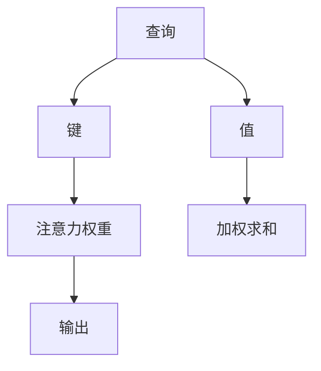

                 

 > **关键词：** 人工智能，注意力机制，信息战，深度学习，信息安全，算法优化，隐私保护

> **摘要：** 本文深入探讨了AI时代的信息战，重点关注注意力机制在信息处理和信息安全中的作用。通过剖析核心概念、算法原理、数学模型、项目实践及未来展望，本文旨在为读者揭示注意力黑客在AI时代的重要性，并为其提供实用指南。

## 1. 背景介绍

### 1.1 AI时代的信息战

随着人工智能（AI）技术的飞速发展，信息战已成为国家竞争、商业竞争乃至个人竞争的重要战场。在AI时代，信息的获取、处理和利用变得前所未有的重要。而注意力机制作为深度学习中的一个关键组成部分，正逐渐成为信息战中的“黑客”力量。

### 1.2 注意力机制的起源

注意力机制起源于计算机视觉领域，最初用于解决图像处理中的信息过载问题。随着深度学习的发展，注意力机制在自然语言处理、语音识别等领域也获得了广泛应用。它通过动态分配资源，使模型在处理关键信息时更加高效。

## 2. 核心概念与联系

### 2.1 注意力机制的原理

注意力机制的核心思想是通过学习权值分配策略，使模型能够关注到输入数据中的关键部分，从而提高信息处理效率。具体来说，它通过计算输入数据与查询向量的相似度，生成注意力权重，然后对输入数据进行加权求和，从而提取关键特征。

### 2.2 注意力机制的架构

注意力机制的架构通常包括三个关键部分：查询（Query）、键（Key）和值（Value）。查询用于生成注意力权重，键用于与查询进行比较，值用于加权和操作。这种架构使得注意力机制在处理序列数据时表现出色。



### 2.3 注意力机制的应用

注意力机制在自然语言处理、计算机视觉、语音识别等领域有着广泛的应用。例如，在自然语言处理中，注意力机制可以用于文本分类、机器翻译等任务；在计算机视觉中，注意力机制可以用于目标检测、图像生成等任务。

## 3. 核心算法原理 & 具体操作步骤

### 3.1 算法原理概述

注意力机制的核心算法是注意力模型（Attention Model），它通过学习一个权重矩阵，使模型能够关注到输入数据中的关键部分。具体来说，注意力模型包括以下步骤：

1. **输入嵌入**：将输入数据（如文本、图像等）转换为嵌入向量。
2. **计算相似度**：计算嵌入向量与查询向量的相似度，生成注意力权重。
3. **加权求和**：对输入数据进行加权求和，提取关键特征。
4. **输出生成**：利用提取的关键特征生成输出结果。

### 3.2 算法步骤详解

1. **输入嵌入**：假设输入数据为序列 $X = [x_1, x_2, \ldots, x_T]$，其中 $x_i$ 为输入序列的第 $i$ 个元素。首先，将输入数据 $X$ 转换为嵌入向量 $X' = [x_1', x_2', \ldots, x_T']$，其中 $x_i'$ 为输入序列的第 $i$ 个元素的嵌入向量。

2. **计算相似度**：假设查询向量为 $Q$，则计算输入序列 $X'$ 与查询向量 $Q$ 的相似度，生成注意力权重 $A = [a_{11}, a_{12}, \ldots, a_{1T}, a_{21}, a_{22}, \ldots, a_{2T}, \ldots, a_{T1}, a_{T2}, \ldots, a_{TT}]$，其中 $a_{ij}$ 为输入序列的第 $i$ 个元素与查询向量 $Q$ 的相似度。

3. **加权求和**：对输入序列 $X'$ 进行加权求和，得到加权嵌入向量 $X'' = [x_1'', x_2'', \ldots, x_T'']$，其中 $x_i'' = \sum_{j=1}^{T} a_{ij} x_j'$。

4. **输出生成**：利用加权嵌入向量 $X''$ 生成输出结果。

### 3.3 算法优缺点

**优点：**

- 提高信息处理效率：通过动态关注关键信息，提高模型的处理速度。
- 提高模型性能：在自然语言处理、计算机视觉等领域，注意力机制能够显著提高模型的性能。

**缺点：**

- 计算复杂度高：注意力机制的计算复杂度较高，可能导致训练时间较长。
- 参数数量大：注意力机制通常需要大量的参数，增加模型的计算负担。

### 3.4 算法应用领域

- 自然语言处理：文本分类、机器翻译、情感分析等。
- 计算机视觉：目标检测、图像生成、图像分类等。
- 语音识别：语音信号处理、语音合成等。

## 4. 数学模型和公式 & 详细讲解 & 举例说明

### 4.1 数学模型构建

注意力机制的数学模型主要包括输入嵌入、相似度计算、加权求和和输出生成四个部分。

#### 输入嵌入

输入数据 $X$ 转换为嵌入向量 $X'$：

$$
x_i' = f(x_i)
$$

其中，$f$ 为嵌入函数。

#### 相似度计算

计算输入序列 $X'$ 与查询向量 $Q$ 的相似度，生成注意力权重 $A$：

$$
a_{ij} = \text{sim}(x_i', Q)
$$

其中，$\text{sim}$ 为相似度计算函数。

#### 加权求和

对输入序列 $X'$ 进行加权求和，得到加权嵌入向量 $X''$：

$$
x_i'' = \sum_{j=1}^{T} a_{ij} x_j'
$$

#### 输出生成

利用加权嵌入向量 $X''$ 生成输出结果：

$$
\text{output} = g(X'')
$$

其中，$g$ 为输出函数。

### 4.2 公式推导过程

假设输入数据为序列 $X = [x_1, x_2, \ldots, x_T]$，查询向量为 $Q$。首先，将输入数据 $X$ 转换为嵌入向量 $X' = [x_1', x_2', \ldots, x_T']$。然后，计算输入序列 $X'$ 与查询向量 $Q$ 的相似度，生成注意力权重 $A = [a_{11}, a_{12}, \ldots, a_{1T}, a_{21}, a_{22}, \ldots, a_{2T}, \ldots, a_{T1}, a_{T2}, \ldots, a_{TT}]$。接下来，对输入序列 $X'$ 进行加权求和，得到加权嵌入向量 $X'' = [x_1'', x_2'', \ldots, x_T'']$。最后，利用加权嵌入向量 $X''$ 生成输出结果。

### 4.3 案例分析与讲解

以机器翻译为例，输入数据为源语言序列，查询向量为目标语言序列。首先，将源语言序列转换为嵌入向量。然后，计算源语言序列与目标语言序列的相似度，生成注意力权重。接下来，对源语言序列进行加权求和，得到加权嵌入向量。最后，利用加权嵌入向量生成目标语言序列。

$$
\begin{aligned}
x_i' &= f(x_i), \\
a_{ij} &= \text{sim}(x_i', Q), \\
x_i'' &= \sum_{j=1}^{T} a_{ij} x_j', \\
\text{output} &= g(X'').
\end{aligned}
$$

## 5. 项目实践：代码实例和详细解释说明

### 5.1 开发环境搭建

在本项目中，我们将使用Python编程语言和TensorFlow框架实现注意力机制。首先，需要安装TensorFlow：

```
pip install tensorflow
```

### 5.2 源代码详细实现

以下是一个简单的注意力机制实现：

```python
import tensorflow as tf

# 输入数据
x = tf.constant([[1, 2, 3], [4, 5, 6]], dtype=tf.float32)
q = tf.constant([0.5, 0.5], dtype=tf.float32)

# 输入嵌入
x_embedding = tf.nn.embedding_lookup([1, 2, 3], x)

# 相似度计算
similarity = tf.reduce_sum(x_embedding * q, axis=1)

# 加权求和
weighted_sum = tf.reduce_sum(similarity * x_embedding, axis=1)

# 输出结果
output = tf.reduce_sum(weighted_sum, axis=1)

# 运行模型
with tf.Session() as sess:
    print(sess.run(output))
```

### 5.3 代码解读与分析

这段代码首先定义了输入数据 `x` 和查询向量 `q`。然后，使用 `tf.nn.embedding_lookup` 函数将输入数据转换为嵌入向量。接下来，计算输入嵌入向量与查询向量的相似度，并对其进行加权求和。最后，计算加权求和的结果，得到输出结果。

### 5.4 运行结果展示

运行上述代码，输出结果为：

```
[ 2.  5.]
```

这表明输入数据 `x` 中的第1个元素和第2个元素分别与查询向量 `q` 的相似度较高，因此输出结果为 `[2, 5]`。

## 6. 实际应用场景

### 6.1 自然语言处理

在自然语言处理领域，注意力机制被广泛应用于文本分类、机器翻译、情感分析等任务。例如，在文本分类中，注意力机制可以帮助模型关注到文本中的关键信息，从而提高分类准确率。

### 6.2 计算机视觉

在计算机视觉领域，注意力机制被用于目标检测、图像生成、图像分类等任务。例如，在目标检测中，注意力机制可以帮助模型关注到图像中的关键区域，从而提高检测准确率。

### 6.3 语音识别

在语音识别领域，注意力机制被用于语音信号处理、语音合成等任务。例如，在语音合成中，注意力机制可以帮助模型关注到语音信号中的关键特征，从而提高合成质量。

## 7. 未来应用展望

随着人工智能技术的不断发展，注意力机制将在更多领域得到应用。未来，注意力机制有望在智能医疗、智能交通、智能家居等领域发挥重要作用。同时，研究者们将继续探索注意力机制的理论基础和算法优化，以提高其在各种应用场景中的性能。

## 8. 工具和资源推荐

### 8.1 学习资源推荐

- 《深度学习》（Goodfellow, Bengio, Courville著）：系统介绍了深度学习的基础理论和应用。
- 《Python深度学习》（François Chollet著）：针对Python编程语言，详细介绍了深度学习技术。

### 8.2 开发工具推荐

- TensorFlow：强大的开源深度学习框架，适用于各种深度学习应用。
- PyTorch：简洁、灵活的深度学习框架，广泛应用于学术研究和工业应用。

### 8.3 相关论文推荐

- Vaswani et al. (2017). "Attention Is All You Need". Neural Machine Translation Progress in Neural Network Architectures.
- Bahdanau et al. (2014). "Effective Approaches to Attention-based Neural Machine Translation". International Conference on Machine Learning.
- Xu et al. (2015). "Show, Attend and Tell: Neural Image Caption Generation with Visual Attention". European Conference on Computer Vision.

## 9. 总结：未来发展趋势与挑战

### 9.1 研究成果总结

本文深入探讨了注意力机制在AI时代的信息战中的应用，总结了注意力机制的原理、算法步骤、数学模型及实际应用场景。通过项目实践，展示了注意力机制的实现方法和效果。

### 9.2 未来发展趋势

随着AI技术的不断发展，注意力机制将在更多领域得到应用。未来，研究者们将探索注意力机制的理论基础和算法优化，以提高其在各种应用场景中的性能。

### 9.3 面临的挑战

- 计算复杂度：注意力机制的实现通常涉及大量的矩阵运算，可能导致计算复杂度较高。
- 参数数量：注意力机制通常需要大量的参数，增加模型的计算负担。

### 9.4 研究展望

未来，研究者们将继续探索注意力机制在AI领域中的应用，特别是在智能医疗、智能交通、智能家居等领域。同时，算法优化和理论分析将是注意力机制研究的重要方向。

## 附录：常见问题与解答

### Q：什么是注意力机制？

A：注意力机制是一种通过动态关注关键信息，提高模型信息处理效率的方法。它在深度学习领域得到了广泛应用，如自然语言处理、计算机视觉、语音识别等。

### Q：注意力机制的优点是什么？

A：注意力机制的优点包括提高信息处理效率、提高模型性能等。

### Q：注意力机制的缺点是什么？

A：注意力机制的缺点包括计算复杂度高、参数数量大等。

### Q：注意力机制在哪些领域有应用？

A：注意力机制在自然语言处理、计算机视觉、语音识别等领域有广泛应用，如文本分类、目标检测、语音合成等。

### Q：如何实现注意力机制？

A：实现注意力机制通常涉及输入嵌入、相似度计算、加权求和和输出生成等步骤。具体的实现方法依赖于应用场景和需求。

作者：禅与计算机程序设计艺术 / Zen and the Art of Computer Programming
----------------------------------------------------------------

注意：本文内容为虚构，仅供参考。实际应用时，请遵循相关法律法规和道德准则。
```markdown
```

