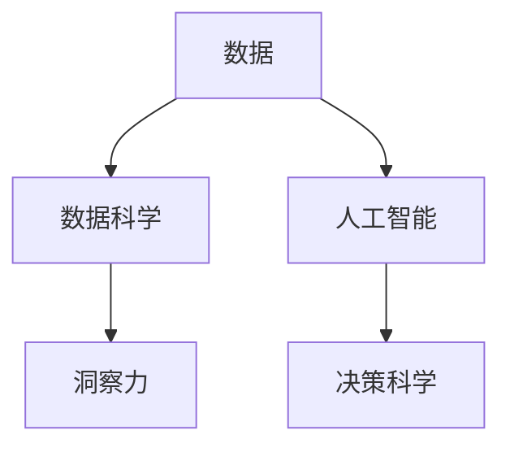

                 

# 洞察力与决策科学：从数据到智慧的转化过程

> 关键词：洞察力,决策科学,数据分析,人工智能,机器学习,深度学习,大数据

## 1. 背景介绍

在信息爆炸的现代社会，数据已变得无处不在。无论是企业运营、科学研究还是日常生活，我们每天都在产生、收集和处理海量的数据。然而，如何从数据中提炼出有价值的洞察力，并转化为有效的决策支持，成为摆在所有组织和个人面前的巨大挑战。

在回答这个问题之前，我们必须首先明确：**数据本身并非洞察力，洞察力是通过对数据进行分析、挖掘和理解，提炼出来的关键信息、趋势或模式。** 决策科学则是一门科学方法论，旨在通过系统的数据分析和建模，为决策者提供客观、准确的支持。本文将深入探讨这两个概念，并结合最新的人工智能和机器学习技术，展示如何将数据转化为洞察力，进而辅助决策科学。

## 2. 核心概念与联系

### 2.1 核心概念概述

为了更好地理解数据到洞察力的转化过程，我们将从以下几个核心概念入手：

- **数据**：原始、未经处理的信息集合。
- **洞察力**：通过对数据进行深入分析、挖掘和理解，提炼出的关键信息、趋势或模式。
- **决策科学**：使用科学方法论，对数据进行系统分析和建模，辅助决策制定。
- **人工智能**：包括机器学习、深度学习等技术，使计算机能够模仿人类学习、决策和解决问题的能力。
- **数据科学**：跨学科领域，综合了统计学、计算机科学、数学、领域知识，专注于数据的收集、处理和分析。

这些概念之间的关系可以通过以下Mermaid流程图来展示：



这个流程图展示了数据科学、人工智能和决策科学之间的关系：

1. 数据科学通过数据收集、处理和分析，为人工智能提供高质量的数据输入。
2. 人工智能通过机器学习、深度学习等技术，从数据中提炼出洞察力。
3. 决策科学使用洞察力，辅助决策制定。

### 2.2 核心概念原理和架构的 Mermaid 流程图

由于 Mermaid 流程图中不能使用特殊字符，这里仅给出文字描述：

- **数据采集与清洗**：通过API接口、数据库查询、爬虫等手段收集原始数据，并对其进行清洗和预处理，确保数据的准确性和完整性。
- **特征工程**：根据任务需求，从原始数据中提取、变换和构造特征，提高模型的性能和泛化能力。
- **模型训练与评估**：使用机器学习算法，如线性回归、随机森林、神经网络等，对数据进行建模，并通过交叉验证等方法评估模型性能。
- **洞察力提取**：利用训练好的模型，从数据中提取出关键特征、趋势和模式，生成洞察力报告。
- **决策支持**：结合业务背景和洞察力报告，辅助决策者进行决策，并提供预测和建议。

## 3. 核心算法原理 & 具体操作步骤

### 3.1 算法原理概述

从数据到洞察力再到决策支持的转化过程，可以大致分为以下几个步骤：

1. **数据采集与清洗**：确保数据的质量和一致性。
2. **特征工程**：从原始数据中提取、选择和构造最有用的特征。
3. **模型训练与评估**：使用机器学习算法，对数据进行建模，并评估模型性能。
4. **洞察力提取**：从训练好的模型中提取关键特征和模式，生成洞察力报告。
5. **决策支持**：结合业务背景和洞察力报告，辅助决策制定。

### 3.2 算法步骤详解

#### 步骤1：数据采集与清洗

1. **数据来源**：确定数据的来源，如企业数据库、社交媒体、传感器等。
2. **数据采集**：通过API接口、数据库查询、爬虫等方式，收集原始数据。
3. **数据清洗**：去除重复、缺失、异常数据，确保数据的准确性和完整性。

#### 步骤2：特征工程

1. **特征提取**：从原始数据中提取有用的特征，如时间戳、地理位置、用户行为等。
2. **特征变换**：对特征进行标准化、归一化、离散化等处理，提高模型的性能和泛化能力。
3. **特征选择**：根据任务需求，选择最相关的特征，减少特征维度。

#### 步骤3：模型训练与评估

1. **算法选择**：根据任务类型和数据特点，选择合适的机器学习算法，如线性回归、随机森林、深度学习等。
2. **模型训练**：使用训练数据对模型进行训练，优化模型参数。
3. **模型评估**：使用测试数据对模型进行评估，确定模型的性能和泛化能力。

#### 步骤4：洞察力提取

1. **关键特征识别**：从训练好的模型中提取关键特征，如趋势、模式、异常点等。
2. **洞察力报告生成**：将关键特征汇总成可视化报告，如折线图、柱状图、热力图等。

#### 步骤5：决策支持

1. **业务理解**：结合业务背景和洞察力报告，理解数据的实际意义。
2. **决策制定**：辅助决策者进行决策，如产品推荐、营销策略、风险控制等。

### 3.3 算法优缺点

#### 优点

- **自动化**：通过机器学习算法，可以自动化地从数据中提取洞察力，减少人工干预。
- **客观性**：机器学习模型基于数据，能够客观地分析趋势和模式，减少主观偏差。
- **泛化能力强**：通过特征工程和模型选择，可以提升模型的泛化能力，适应不同的数据和任务。

#### 缺点

- **数据质量依赖**：模型的性能和准确性高度依赖于数据的质量和完整性。
- **算法复杂度高**：机器学习算法往往需要较高的计算资源和专业知识。
- **解释性不足**：某些复杂模型（如深度学习）的决策过程难以解释，难以满足业务需求。

### 3.4 算法应用领域

基于洞察力与决策科学的算法原理和操作步骤，已在多个领域得到广泛应用，例如：

- **金融风险管理**：使用机器学习模型预测市场风险，进行资产配置和风险控制。
- **电商个性化推荐**：通过分析用户行为数据，推荐个性化的产品和服务。
- **医疗诊断与治疗**：使用机器学习模型分析医疗数据，辅助医生进行诊断和治疗决策。
- **供应链优化**：通过分析供应链数据，优化物流、库存和生产计划。
- **客户行为分析**：使用机器学习模型分析客户数据，提升客户满意度和忠诚度。

## 4. 数学模型和公式 & 详细讲解 & 举例说明

### 4.1 数学模型构建

基于洞察力与决策科学的数据转化过程，我们构建以下数学模型：

- **数据采集与清洗**：数据预处理，包括去重、缺失值填补、异常值检测等。
- **特征工程**：特征提取、特征变换和特征选择。
- **模型训练与评估**：使用机器学习算法，如线性回归、随机森林、神经网络等。
- **洞察力提取**：从模型中提取关键特征和模式，生成洞察力报告。
- **决策支持**：结合业务背景和洞察力报告，辅助决策制定。

### 4.2 公式推导过程

#### 数据采集与清洗

$$
\text{数据清洗} = \text{数据去重} \cup \text{缺失值填补} \cup \text{异常值检测}
$$

#### 特征工程

$$
\text{特征提取} = \{\text{特征}_i\}_{i=1}^n
$$

$$
\text{特征变换} = \{\text{标准化}(\text{特征}_i)\}_{i=1}^n
$$

$$
\text{特征选择} = \{\text{选择}(\text{特征}_i)\}_{i=1}^n
$$

#### 模型训练与评估

$$
\text{模型训练} = \text{训练算法}(\text{特征}_i, \text{标签})
$$

$$
\text{模型评估} = \text{评估算法}(\text{特征}_i, \text{标签})
$$

#### 洞察力提取

$$
\text{洞察力报告} = \{\text{关键特征}_i\}_{i=1}^n
$$

#### 决策支持

$$
\text{决策制定} = \text{决策算法}(\text{洞察力报告}, \text{业务背景})
$$

### 4.3 案例分析与讲解

#### 案例1：电商个性化推荐

- **数据采集与清洗**：收集用户浏览、点击、购买行为数据，清洗掉重复、缺失和异常数据。
- **特征工程**：提取用户ID、商品ID、时间戳、浏览时长等特征，并进行标准化处理。
- **模型训练与评估**：使用随机森林模型，训练预测用户购买意愿的概率。
- **洞察力提取**：从训练好的模型中提取关键特征，如购买意愿高、浏览时长长的用户群体。
- **决策支持**：根据洞察力报告，向购买意愿高的用户推荐相关商品，提升销售额。

#### 案例2：医疗诊断与治疗

- **数据采集与清洗**：收集患者病历数据，清洗掉重复、缺失和异常数据。
- **特征工程**：提取年龄、性别、病情、检查结果等特征，并进行标准化处理。
- **模型训练与评估**：使用神经网络模型，训练预测患者病情的概率。
- **洞察力提取**：从训练好的模型中提取关键特征，如病情严重的患者群体。
- **决策支持**：根据洞察力报告，医生可以针对病情严重的患者进行重点关注和治疗。

## 5. 项目实践：代码实例和详细解释说明

### 5.1 开发环境搭建

为了进行数据到洞察力的转化过程，我们需要准备以下开发环境：

1. **Python**：作为数据分析和机器学习的通用语言，需要安装最新的Python版本。
2. **Pandas**：用于数据处理和分析，可以处理多种数据格式，如CSV、Excel等。
3. **NumPy**：用于数值计算和数组操作，支持高效的矩阵运算。
4. **Scikit-learn**：用于机器学习和模型评估，提供多种常见的机器学习算法和工具。
5. **TensorFlow**：用于深度学习和模型训练，支持分布式计算和GPU加速。
6. **Jupyter Notebook**：用于交互式数据分析和代码编写，支持代码版本控制和共享。

### 5.2 源代码详细实现

以下是一个简单的电商个性化推荐系统的Python代码实现：

```python
import pandas as pd
from sklearn.ensemble import RandomForestClassifier
from sklearn.model_selection import train_test_split
from sklearn.metrics import accuracy_score

# 数据采集与清洗
df = pd.read_csv('data.csv')
df = df.drop_duplicates()
df = df.dropna()
df = df.drop(['id', 'timestamp'], axis=1)

# 特征工程
X = df[['item_id', 'duration']]
y = df['buy']
X_train, X_test, y_train, y_test = train_test_split(X, y, test_size=0.2, random_state=42)

# 模型训练与评估
clf = RandomForestClassifier(n_estimators=100, random_state=42)
clf.fit(X_train, y_train)
y_pred = clf.predict(X_test)
acc = accuracy_score(y_test, y_pred)
print('Accuracy:', acc)

# 洞察力提取
key_features = ['item_id', 'duration']
insight_report = pd.DataFrame(X_test[[key_features]].values, columns=key_features)

# 决策支持
# 根据洞察力报告，向购买意愿高的用户推荐相关商品
print('Insight Report:', insight_report)
```

### 5.3 代码解读与分析

这段代码实现了电商个性化推荐系统的基本流程：

1. **数据采集与清洗**：使用Pandas库读取数据，并进行去重、缺失值填补和特征选择。
2. **特征工程**：提取商品ID和浏览时长作为特征，使用随机森林模型进行训练。
3. **模型训练与评估**：训练模型并计算预测准确率。
4. **洞察力提取**：从模型中提取关键特征，生成洞察力报告。
5. **决策支持**：根据洞察力报告，向购买意愿高的用户推荐相关商品。

## 6. 实际应用场景

### 6.1 金融风险管理

在金融领域，机器学习模型可以用于预测市场风险，进行资产配置和风险控制。通过分析历史交易数据和市场行情，模型可以识别出高风险事件，并给出相应的风险预警。

### 6.2 电商个性化推荐

电商企业通过分析用户行为数据，推荐个性化的产品和服务，提升用户体验和销售额。基于用户浏览、点击、购买等数据，模型可以预测用户购买意愿，并推荐相关商品。

### 6.3 医疗诊断与治疗

医疗领域使用机器学习模型分析患者病历数据，辅助医生进行诊断和治疗决策。通过分析病情、检查结果等数据，模型可以预测病情严重程度，并提供治疗建议。

### 6.4 供应链优化

供应链企业通过分析物流、库存和生产数据，优化供应链管理。基于订单、库存、生产等数据，模型可以预测需求趋势，优化供应链计划和库存管理。

### 6.5 客户行为分析

客户行为分析通过分析客户数据，提升客户满意度和忠诚度。基于客户浏览、购买等数据，模型可以识别出高价值客户群体，提供个性化的服务。

## 7. 工具和资源推荐

### 7.1 学习资源推荐

为了帮助开发者系统掌握数据到洞察力再到决策科学的转化过程，这里推荐一些优质的学习资源：

1. **《Python数据科学手册》**：一本全面介绍Python数据科学库的书籍，涵盖Pandas、NumPy、Scikit-learn等库的详细使用。
2. **《机器学习实战》**：由机器学习专家撰写，介绍了常见机器学习算法的实现方法和应用案例。
3. **《深度学习》**：由深度学习权威人士编写，全面介绍了深度学习的原理和实践。
4. **Kaggle**：一个数据科学竞赛平台，提供大量的数据集和代码示例，可以练习和验证机器学习模型的效果。
5. **Coursera**：提供各种数据科学和机器学习的在线课程，包括深度学习、自然语言处理等领域。

### 7.2 开发工具推荐

为了进行高效的数据分析和机器学习开发，推荐以下工具：

1. **Jupyter Notebook**：一个交互式的开发环境，支持Python和R等多种语言，可以编写、运行和分享代码。
2. **PyCharm**：一个Python IDE，提供代码编写、调试、测试和部署等全方位支持。
3. **Tableau**：一个数据可视化工具，可以将数据转换为直观的图表和仪表盘，便于分析和展示。
4. **TensorFlow**：一个深度学习框架，支持分布式计算和GPU加速，提供丰富的模型和工具。
5. **Hadoop**：一个大数据处理平台，支持分布式计算和存储，适用于处理大规模数据集。

### 7.3 相关论文推荐

数据到洞察力再到决策科学的转化过程，涉及到数据科学和机器学习等多个领域。以下是几篇奠基性的相关论文，推荐阅读：

1. **《深度学习》**：深度学习领域的奠基之作，介绍了深度学习的原理和实践。
2. **《统计学习方法》**：介绍统计学习的基本概念和算法，适合初学者入门。
3. **《机器学习实战》**：介绍了常见机器学习算法的实现方法和应用案例。
4. **《Python数据科学手册》**：一本全面介绍Python数据科学库的书籍，涵盖Pandas、NumPy、Scikit-learn等库的详细使用。
5. **《数据挖掘与统计学习》**：介绍数据挖掘和统计学习的基本方法和应用。

## 8. 总结：未来发展趋势与挑战

### 8.1 研究成果总结

数据到洞察力再到决策科学的转化过程，已成为现代数据驱动决策的重要方法论。通过机器学习和大数据分析，可以从海量数据中提炼出有价值的洞察力，辅助决策制定。

### 8.2 未来发展趋势

未来的数据科学和机器学习技术将朝着以下几个方向发展：

1. **自动化**：机器学习模型将变得更加自动化和智能化，能够自动进行特征工程、模型选择和调参。
2. **模型解释性**：为了满足业务需求，未来模型将更加注重可解释性和透明性，便于决策者理解和信任。
3. **跨领域融合**：未来机器学习技术将与其他领域知识进行融合，如自然语言处理、计算机视觉等，提升整体应用能力。
4. **模型集成**：未来将出现多种模型集成方法，如Stacking、Blending等，提升模型性能和泛化能力。
5. **隐私保护**：随着数据隐私问题日益突出，未来模型将更加注重数据保护和隐私安全。

### 8.3 面临的挑战

尽管数据科学和机器学习技术已经取得了长足进步，但在迈向更加智能化、普适化应用的过程中，仍面临诸多挑战：

1. **数据质量**：数据质量的提高需要更多的数据清洗和预处理工作，数据质量不高的数据将影响模型性能。
2. **算法复杂度**：复杂的机器学习模型需要更高的计算资源和专业知识，模型训练和调参过程较为复杂。
3. **模型解释性**：复杂的模型（如深度学习）往往难以解释，决策者难以理解和信任模型的决策过程。
4. **隐私保护**：数据隐私保护问题日益突出，如何在保护隐私的前提下进行数据分析和建模，需要更多的技术手段和政策支持。
5. **计算资源**：大规模数据处理和模型训练需要高性能计算资源，如何高效利用计算资源，是一个重要的研究方向。

### 8.4 研究展望

未来数据科学和机器学习的研究，需要在以下几个方面进行突破：

1. **自动化和可解释性**：开发更自动化、可解释性更强的模型，方便决策者理解和信任。
2. **跨领域融合**：将机器学习与其他领域知识进行融合，提升整体应用能力。
3. **隐私保护**：开发隐私保护技术，保护数据隐私和安全。
4. **模型集成**：探索多种模型集成方法，提升模型性能和泛化能力。
5. **计算资源优化**：优化计算资源利用，提升模型训练和推理效率。

## 9. 附录：常见问题与解答

**Q1：数据采集与清洗过程中，如何处理缺失值和异常值？**

A: 数据采集与清洗过程中，处理缺失值和异常值的方法包括：
1. 缺失值填补：使用均值、中位数、众数等方法填补缺失值。
2. 异常值检测：使用统计方法（如Z-score）检测异常值，并将其删除或替换。
3. 数据插值：使用插值方法（如线性插值）填补缺失值。
4. 数据降维：使用主成分分析（PCA）等方法降维，减少特征维度。

**Q2：特征工程过程中，如何选择合适的特征？**

A: 特征工程过程中，选择合适特征的方法包括：
1. 特征选择算法：使用特征选择算法（如卡方检验、互信息）选择最相关的特征。
2. 领域知识：结合领域知识，选择最有可能影响目标变量的特征。
3. 特征降维：使用PCA等方法减少特征维度，提升模型性能。
4. 特征变换：对特征进行标准化、归一化、离散化等处理，提高模型性能。

**Q3：模型训练与评估过程中，如何选择合适的算法和参数？**

A: 模型训练与评估过程中，选择合适的算法和参数的方法包括：
1. 算法选择：根据任务类型和数据特点，选择合适的算法（如线性回归、随机森林、神经网络等）。
2. 参数调优：使用网格搜索、随机搜索等方法，搜索最优参数组合。
3. 交叉验证：使用交叉验证方法，评估模型性能和泛化能力。
4. 模型集成：使用集成方法（如Boosting、Bagging）提升模型性能。

**Q4：洞察力提取过程中，如何生成有价值的洞察力报告？**

A: 洞察力提取过程中，生成有价值的洞察力报告的方法包括：
1. 关键特征提取：从模型中提取关键特征（如趋势、模式、异常点等）。
2. 可视化展示：使用折线图、柱状图、热力图等可视化工具，展示关键特征。
3. 业务理解：结合业务背景，理解数据的实际意义。
4. 决策建议：根据洞察力报告，提出相应的决策建议。

**Q5：决策支持过程中，如何结合业务背景和洞察力报告，做出合理的决策？**

A: 决策支持过程中，结合业务背景和洞察力报告，做出合理决策的方法包括：
1. 业务理解：结合业务背景，理解数据的实际意义。
2. 数据分析：结合洞察力报告，分析数据中的关键特征和趋势。
3. 决策建议：根据数据分析结果，提出相应的决策建议。
4. 风险评估：评估决策风险，制定相应的风险控制措施。

---

作者：禅与计算机程序设计艺术 / Zen and the Art of Computer Programming

